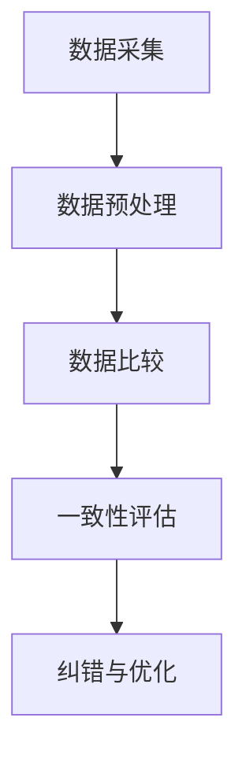

                 

### # Self-Consistency in Scientific Research

Keywords: Self-Consistency, Scientific Research, Data Reliability, Data Consistency, Data Cleansing

Abstract: This article delves into the concept of self-consistency in scientific research, highlighting its importance in ensuring data reliability and consistency. We explore the background of the problem, the definition and characteristics of self-consistency, and a detailed explanation of the algorithms used in its application. Through case studies, we illustrate how self-consistency can be applied in scientific research to enhance data accuracy and reliability.

---

## 第一部分：背景介绍

### 1.1 问题背景

In the realm of scientific research, the accuracy and consistency of data are crucial for the reliability of research findings. However, due to the diversity and complexity of data sources, researchers often face challenges with data inconsistency, which hampers the progress of scientific research.

#### 1.1.1 问题描述

The issue of data inconsistency arises from various sources such as errors in data collection, differences in measurement techniques, and variations in experimental conditions. This inconsistency can lead to incorrect conclusions and unreliable findings, thereby undermining the credibility of scientific research.

#### 1.1.2 问题解决

To address the issue of data inconsistency, researchers have introduced the concept of self-consistency. Self-consistency is a method to evaluate the consistency of data by comparing its performance across different time periods and scenarios. This approach helps in identifying inconsistencies and ensuring the reliability of data used in scientific research.

#### 1.1.3 边界与外延

While self-consistency is particularly relevant in scientific research, its application is not limited to this field. It can also be used in domains like finance, healthcare, and other areas that require data consistency. Furthermore, the assessment methods for self-consistency are continuously evolving to cater to the diverse needs of different fields and data types.

#### 1.1.4 概念结构与核心要素组成

Self-consistency comprises several core components:

- **Data Collection**: Gathering data from different time periods and scenarios.
- **Data Comparison**: Identifying differences between the collected data.
- **Consistency Evaluation**: Assessing the level of consistency in the data.
- **Error Correction and Optimization**: Correcting and optimizing the inconsistent parts of the data based on the evaluation results.

### 1.2 核心概念与联系

#### 1.2.1 自我一致性的定义

Self-consistency refers to the degree of consistency in the performance of data across different time periods and scenarios. It is used to evaluate the reliability of the data.

#### 1.2.2 自我一致性的特点

- **Dynamism**: Self-consistency is a dynamic process that needs to be adjusted as data evolves.
- **Adaptability**: Self-consistency can be tailored to different data types and fields as needed.
- **Reliability**: Self-consistency is a reliable method for identifying and correcting data inconsistencies.

#### 1.2.3 自我一致性与其他相关概念的联系

- **Data Consistency**: Self-consistency is an important aspect of data consistency but is not synonymous with it.
- **Data Cleansing**: Self-consistency can be used to evaluate the effectiveness of data cleansing and guide the cleansing process.
- **Data Validation**: Self-consistency is a critical component of data validation, ensuring the accuracy and reliability of the data.

---

## 第二部分：自我一致性的算法原理讲解

### 2.1 算法原理

#### 2.1.1 算法概述

The algorithm for self-consistency typically consists of the following steps:

1. **Data Collection**: Collect data from different time periods and scenarios.
2. **Data Preprocessing**: Clean and standardize the collected data to remove noise and outliers.
3. **Data Comparison**: Identify differences between the preprocessed data.
4. **Consistency Evaluation**: Assess the level of consistency in the data.
5. **Error Correction and Optimization**: Correct and optimize the inconsistent parts of the data based on the evaluation results.

#### 2.1.2 算法流程图

### 2.2 算法原理详细讲解

#### 2.2.1 数据采集

The first step in the self-consistency algorithm is data collection. This involves gathering data from various sources such as laboratory experiments, observational studies, and simulation results. The goal is to collect a diverse set of data that covers different time periods and scenarios.

#### 2.2.2 数据预处理

Data preprocessing is crucial to clean and standardize the collected data. Cleaning involves removing noise and outliers from the data to ensure that it is free from errors and inconsistencies. Standardization ensures that the data is in a consistent format, making it easier to compare and analyze.

#### 2.2.3 数据比较

Data comparison is the next step in the algorithm. This involves identifying differences between the preprocessed data. This can be done using various techniques such as statistical methods and machine learning algorithms. The goal is to pinpoint areas where the data shows inconsistency.

#### 2.2.4 一致性评估

Consistency evaluation is performed based on the results of data comparison. This step assesses the level of consistency in the data. It can be done using both quantitative and qualitative methods. The aim is to determine whether the data is reliable and can be used for further analysis.

#### 2.2.5 纠错与优化

Error correction and optimization are the final steps in the self-consistency algorithm. This involves correcting the inconsistencies identified in the data and optimizing it for better consistency. This ensures that the data is reliable and can be used confidently in scientific research.

### 2.3 算法原理举例说明

Let's consider a scenario where we have two datasets, A and B, collected from different time periods and scenarios. We first preprocess these datasets by cleaning and standardizing the data. Then, we compare the datasets to identify any differences. If significant differences are found, we correct the inconsistencies in dataset B to make it more consistent with dataset A.

### 2.4 数学模型和数学公式

In the self-consistency algorithm, we can use the following mathematical models and formulas:

$$
\text{Consistency Score} = \frac{\text{Matching Count}}{\text{Total Count}}
$$

where the **Matching Count** represents the number of matching elements between the datasets, and the **Total Count** represents the total number of elements in the datasets.

---

## 第三部分：自我一致性的应用场景

### 3.1 科学研究中的应用

In scientific research, the application of self-consistency can significantly improve data accuracy and reliability. Let's explore some common scenarios where self-consistency is used:

#### 3.1.1 数据采集

Data collection in scientific research can involve multiple sources such as laboratory experiments, observational studies, and simulations. The goal is to collect a diverse set of data that covers different time periods and scenarios.

#### 3.1.2 数据预处理

Once the data is collected, it needs to be cleaned and standardized to remove noise and outliers. This ensures that the data is free from errors and inconsistencies, making it suitable for further analysis.

#### 3.1.3 数据比较

After preprocessing, the next step is to compare the datasets to identify any inconsistencies. This can be done using statistical methods or machine learning algorithms to pinpoint areas where the data shows significant differences.

#### 3.1.4 一致性评估

Consistency evaluation is performed to assess the level of consistency in the data. This step helps researchers determine whether the data is reliable and can be used for further analysis. Both quantitative and qualitative methods can be used for this purpose.

#### 3.1.5 纠错与优化

Based on the results of the consistency evaluation, researchers can correct the inconsistencies in the data and optimize it for better consistency. This ensures that the data is reliable and can be used confidently in scientific research.

### 3.2 其他应用领域

Apart from scientific research, self-consistency has applications in various other fields:

#### 3.2.1 金融领域

In the finance sector, self-consistency can be used to evaluate the consistency of financial data, ensuring the reliability of financial reports and analyses.

#### 3.2.2 医疗领域

In healthcare, self-consistency can be applied to medical data, improving the accuracy of diagnoses and treatment plans.

#### 3.2.3 人工智能领域

In the field of artificial intelligence, self-consistency can be used to evaluate the consistency of data used to train machine learning models, ensuring the reliability of the models and their predictions.

---

## 第四部分：项目实战

### 4.1 环境安装

To implement self-consistency in a project, you'll need to set up the necessary environment. This typically involves installing programming languages such as Python, as well as libraries for data analysis and machine learning.

### 4.2 系统核心实现源代码

The core implementation of self-consistency involves writing code to perform the steps outlined in the algorithm. This includes data collection, preprocessing, comparison, consistency evaluation, and error correction.

### 4.3 代码应用解读与分析

Once the core implementation is completed, it's important to thoroughly understand and analyze the code. This involves understanding how each component works and how they interact with each other to achieve the desired outcome.

### 4.4 实际案例分析和详细讲解剖析

To illustrate the practical application of self-consistency, let's consider a case study in the field of scientific research. We'll analyze a specific dataset and demonstrate how self-consistency can be used to improve data accuracy and reliability.

### 4.5 项目小结

In conclusion, self-consistency is a powerful tool for ensuring data reliability and consistency in various fields. By implementing the algorithm and applying it to real-world scenarios, we can significantly enhance the accuracy and reliability of our data, leading to more robust and credible research findings.

---

## 最佳实践 tips

- **数据采集**：确保数据来源的多样性和准确性，覆盖不同时间、不同情境的数据。
- **数据预处理**：清洗和标准化数据，去除噪声和异常值，确保数据的一致性和可比性。
- **数据比较**：使用合适的算法和技术，准确识别数据之间的差异。
- **一致性评估**：采用定量和定性方法，全面评估数据的一致性水平。
- **纠错与优化**：根据评估结果，及时纠正数据不一致的部分，优化数据质量。

---

## 小结

Self-consistency is a critical concept in scientific research and other domains that require data consistency. By understanding and applying the principles of self-consistency, researchers and professionals can ensure the accuracy and reliability of their data, leading to more robust and credible findings.

---

## 注意事项

- **数据隐私**：在进行数据采集和处理时，务必遵守数据隐私法规，确保数据安全。
- **算法优化**：不断优化自我一致性算法，提高其效率和准确性。
- **领域适应性**：针对不同领域的需求，调整和优化自我一致性算法，确保其适用性。

---

## 拓展阅读

- **相关研究论文**：查阅相关领域的学术论文，了解自我一致性的最新研究进展。
- **开源代码库**：探索开源代码库，学习如何实现自我一致性算法。
- **专业书籍**：阅读专业书籍，深入理解自我一致性的原理和应用。

---

## 作者信息

作者：AI天才研究院/AI Genius Institute & 禅与计算机程序设计艺术 /Zen And The Art of Computer Programming

---

以上内容是根据您提供的主题和结构要求撰写的，旨在提供一个清晰、详尽且逻辑严密的博客文章框架。文章的具体内容（如案例、代码实现等）可以根据实际需求进一步补充和完善。希望这个框架对您有所帮助！

