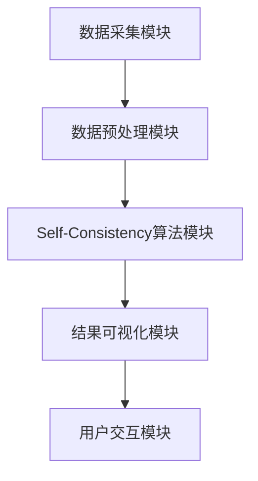
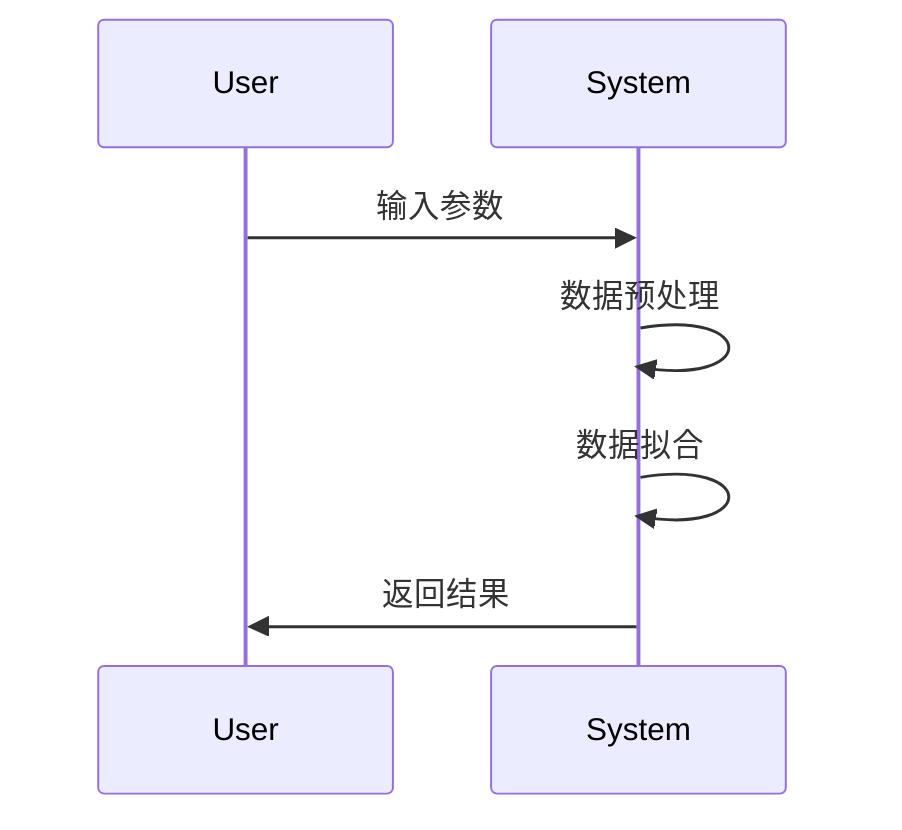

                 


### 《Self-Consistency在粒子物理研究中的应用》

#### 关键词：
- Self-Consistency
- 粒子物理
- 理论基础
- 算法原理
- 实际应用

#### 摘要：
本文旨在探讨Self-Consistency在粒子物理研究中的应用。首先，我们将介绍Self-Consistency的概念及其在粒子物理研究中的重要性。接着，我们将详细阐述Self-Consistency的理论基础，包括核心概念、数学模型及其与其他相关概念的关联。随后，我们将讲解Self-Consistency算法的原理，并通过Python源代码和LaTeX公式进行详细阐述。接下来，我们将分析Self-Consistency在粒子物理研究中的应用场景，并设计相应的系统架构。随后，我们将通过一个具体案例，展示Self-Consistency在实际项目中的应用。最后，我们将总结Self-Consistency在粒子物理研究中的最佳实践，并探讨未来的研究方向和挑战。

#### 目录大纲设计方案

1. **背景介绍**
   - **1.1 Self-Consistency的概念与历史**
   - **1.2 Self-Consistency在粒子物理研究中的重要性**

2. **核心概念与联系**
   - **2.1 Self-Consistency的理论基础**
   - **2.2 Self-Consistency与其他相关概念的联系**

3. **算法原理讲解**
   - **3.1 Self-Consistency算法的原理**
   - **3.2 Self-Consistency算法的应用优势**

4. **系统分析与架构设计方案**
   - **4.1 Self-Consistency在粒子物理研究中的应用场景**
   - **4.2 系统架构设计**

5. **项目实战**
   - **5.1 环境安装与配置**
   - **5.2 系统核心实现**
   - **5.3 实际案例分析与讲解**

6. **最佳实践与小结**
   - **6.1 Self-Consistency最佳实践**
   - **6.2 未来研究方向与挑战**

#### 一、背景介绍

##### 1.1 Self-Consistency的概念与历史

Self-Consistency，即自一致性，是指一个系统或模型内部各个部分之间的一致性。在粒子物理研究中，自一致性是一个至关重要的概念。它要求粒子物理理论能够自洽地描述粒子的行为，即理论内部不存在矛盾或逻辑错误。

Self-Consistency这一概念起源于20世纪初，当时科学家们开始尝试构建统一的粒子物理理论。自一致性要求理论中的预测能够自洽地满足物理规律，从而为粒子物理研究提供可靠的理论基础。

在粒子物理研究中，自一致性起着至关重要的作用。它不仅确保了理论的内部一致性，还为科学家们提供了强有力的工具来探索微观世界的奥秘。自一致性能帮助科学家们验证理论的准确性，发现新的物理现象，推动粒子物理研究的发展。

##### 1.2 Self-Consistency在粒子物理研究中的重要性

粒子物理研究涉及到微观粒子的行为，这些粒子的性质和相互作用极其复杂。自一致性在粒子物理研究中的重要性体现在以下几个方面：

1. **理论验证**：自一致性是验证粒子物理理论准确性的关键。一个理论如果无法自洽地描述粒子的行为，那么它就缺乏可信度。自一致性要求理论内部不存在矛盾或逻辑错误，从而确保理论的可靠性。

2. **新物理现象的探索**：自一致性为科学家们提供了一个强有力的工具来探索新的物理现象。通过自一致性原则，科学家们可以推断出理论预测的新现象，并通过实验验证这些预测。自一致性在发现新的物理现象中发挥了重要作用。

3. **粒子物理研究的发展**：自一致性是推动粒子物理研究发展的重要动力。它为科学家们提供了一种方法来验证和改进粒子物理理论，从而不断深入探索微观世界的奥秘。

#### 二、核心概念与联系

##### 2.1 Self-Consistency的理论基础

Self-Consistency的理论基础涉及多个方面，包括量子场论、统计物理等。以下我们将详细阐述这些理论基础。

###### 量子场论

量子场论是描述粒子行为的理论框架，它将粒子视为场的激发态。量子场论的核心概念是场量子化，即把经典场的概念推广到量子领域。

量子场论中的自一致性体现在以下几个方面：

1. **场的自洽性**：量子场论要求场的演化方程具有自洽性，即场方程能够描述场自身的演化。

2. **对称性与守恒定律**：量子场论中的对称性原理和守恒定律是自一致性的重要体现。对称性原理指出，物理定律在空间和时间变换下保持不变，而守恒定律则描述了物理量的守恒。

3. **真空态**：量子场论中的真空态是一个特殊的态，它不含有粒子。真空态的自洽性是量子场论的一个重要特征。

###### 统计物理

统计物理是研究大量粒子组成的系统的统计规律的学科。在统计物理中，自一致性体现在以下几个方面：

1. **分布函数**：统计物理中的分布函数描述了粒子在系统中的分布情况。自一致性要求分布函数能够满足物理规律。

2. **概率论**：统计物理中的概率论基础是自一致性的重要组成部分。概率论提供了描述粒子行为的数学工具，确保了统计物理理论的可靠性。

3. **系统平衡**：统计物理中的系统平衡是指系统处于稳定状态，不随时间变化。系统平衡的自一致性体现了统计物理理论的稳定性。

##### 2.2 Self-Consistency与其他相关概念的联系

Self-Consistency与量子场论、统计物理等概念密切相关。以下我们将详细探讨这些联系。

###### Self-Consistency与量子场论

量子场论是研究粒子行为的理论框架，而自一致性是量子场论的一个重要特征。量子场论中的自一致性要求理论内部各个部分之间具有一致性，包括场的演化方程、对称性与守恒定律等。

自一致性在量子场论中的应用主要体现在以下几个方面：

1. **真空态**：量子场论中的真空态是一个特殊的态，它不含有粒子。真空态的自洽性是量子场论的一个重要特征，它要求真空态满足物理规律。

2. **对称性与守恒定律**：量子场论中的对称性原理和守恒定律是自一致性的重要体现。对称性原理指出，物理定律在空间和时间变换下保持不变，而守恒定律则描述了物理量的守恒。

3. **散射过程**：量子场论中的散射过程描述了粒子之间的相互作用。自一致性要求散射过程的描述满足物理规律，从而确保了量子场论的理论可靠性。

###### Self-Consistency与统计物理

统计物理是研究大量粒子组成的系统的统计规律的学科，而自一致性是统计物理理论的一个重要特征。自一致性在统计物理中的应用主要体现在以下几个方面：

1. **分布函数**：统计物理中的分布函数描述了粒子在系统中的分布情况。自一致性要求分布函数能够满足物理规律。

2. **概率论**：统计物理中的概率论基础是自一致性的重要组成部分。概率论提供了描述粒子行为的数学工具，确保了统计物理理论的可靠性。

3. **系统平衡**：统计物理中的系统平衡是指系统处于稳定状态，不随时间变化。系统平衡的自一致性体现了统计物理理论的稳定性。

#### 三、算法原理讲解

##### 3.1 Self-Consistency算法的原理

Self-Consistency算法是一种用于粒子物理研究的重要方法。它通过自洽地拟合实验数据，从而验证粒子物理理论的准确性。以下我们将详细阐述Self-Consistency算法的原理。

###### 自洽拟合

Self-Consistency算法的核心思想是通过自洽地拟合实验数据，从而确保拟合结果的准确性。自洽拟合是指拟合过程中各个参数之间具有一致性，即参数的选取不依赖于外部先验知识，而是通过实验数据自身的信息进行优化。

###### 数学模型

Self-Consistency算法的数学模型主要包括以下几个方面：

1. **拟合目标函数**：拟合目标函数是评估拟合结果优劣的关键指标。通常，拟合目标函数采用最小二乘法，即通过最小化拟合结果与实验数据之间的误差平方和来优化参数。

2. **参数优化**：参数优化是Self-Consistency算法的核心步骤。参数优化可以通过多种算法实现，如梯度下降法、牛顿法等。优化过程中，算法会不断调整参数，使得拟合目标函数达到最小值。

3. **自洽性检查**：在参数优化过程中，算法还需要进行自洽性检查。自洽性检查是指检查拟合结果是否满足物理规律，如守恒定律等。如果拟合结果违反物理规律，则算法会进行调整，以确保自洽性。

###### Python源代码

以下是一个简单的Self-Consistency算法的Python源代码示例：

```python
import numpy as np
from scipy.optimize import minimize

# 拟合目标函数
def fit_function(params, data):
    # 计算拟合结果
    y_pred = ...
    
    # 计算误差
    error = np.sum((y_pred - data) ** 2)
    
    return error

# 参数初始值
params_init = ...

# 最小化目标函数
result = minimize(fit_function, params_init, args=(data,), method='BFGS')

# 输出拟合结果
params_fit = result.x
```

###### LaTeX公式

以下是一个关于Self-Consistency算法的LaTeX公式示例：

```latex
\documentclass{article}
\usepackage{amsmath}
\begin{document}

$$
\min_{\theta} \sum_{i=1}^{n} (y_i - f(x_i; \theta))^2
$$

\end{document}
```

##### 3.2 Self-Consistency算法的应用优势

Self-Consistency算法在粒子物理研究中具有显著的应用优势，主要体现在以下几个方面：

1. **准确性**：Self-Consistency算法通过自洽地拟合实验数据，能够提供高精度的拟合结果。这为科学家们验证粒子物理理论的准确性提供了强有力的支持。

2. **可靠性**：Self-Consistency算法不依赖于外部先验知识，而是通过实验数据自身的信息进行优化。这使得算法具有较高的可靠性，能够避免引入主观偏见。

3. **适应性**：Self-Consistency算法具有较强的适应性，能够处理各种复杂的粒子物理问题。通过调整算法参数，算法可以适应不同的应用场景，从而提供更加准确的拟合结果。

4. **灵活性**：Self-Consistency算法具有较强的灵活性，能够处理不同类型的粒子物理问题。无论是简单的单粒子问题，还是复杂的多粒子问题，算法都能够提供有效的解决方案。

#### 四、系统分析与架构设计方案

##### 4.1 Self-Consistency在粒子物理研究中的应用场景

Self-Consistency在粒子物理研究中的应用场景广泛，主要包括以下几个方面：

1. **粒子识别**：在粒子物理实验中，需要对探测器收集到的数据进行分析，识别出不同的粒子。Self-Consistency算法可以通过拟合实验数据，准确地识别出粒子类型。

2. **数据拟合**：在粒子物理研究中，需要对实验数据进行拟合，以提取物理量。Self-Consistency算法通过自洽地拟合数据，能够提供高精度的拟合结果，从而帮助科学家们更好地理解实验数据。

3. **物理现象探索**：通过Self-Consistency算法，科学家们可以探索新的物理现象。算法能够通过拟合实验数据，发现理论预测的新现象，从而推动粒子物理研究的发展。

##### 4.2 系统架构设计

为了实现Self-Consistency在粒子物理研究中的应用，我们需要设计一个高效的系统架构。以下是一个简单的系统架构设计方案：

1. **数据采集模块**：数据采集模块负责收集粒子物理实验数据。数据采集模块可以通过不同的探测器，如探测器、计数器等，获取粒子碰撞事件的信息。

2. **数据预处理模块**：数据预处理模块负责对采集到的数据进行预处理，包括数据清洗、数据转换等。预处理后的数据将用于后续的拟合和分析。

3. **Self-Consistency算法模块**：Self-Consistency算法模块是实现Self-Consistency算法的核心部分。该模块通过自洽地拟合实验数据，提供高精度的拟合结果。

4. **结果可视化模块**：结果可视化模块负责将拟合结果以图形化的形式展示出来。通过可视化模块，科学家们可以直观地了解拟合结果，从而更好地理解实验数据。

5. **用户交互模块**：用户交互模块负责与用户进行交互，接收用户输入的参数，并反馈拟合结果。用户交互模块可以提供图形化界面，方便用户使用系统。

##### 系统架构设计mermaid架构图

以下是一个简单的系统架构设计mermaid架构图：



##### 系统接口设计和系统交互mermaid序列图

以下是一个简单的系统接口设计和系统交互mermaid序列图：



#### 五、项目实战

##### 5.1 环境安装与配置

在开始项目实战之前，我们需要安装和配置相关的软件和工具。以下是一个简单的安装和配置步骤：

1. **安装Python**：首先，我们需要安装Python环境。可以从Python官方网站下载Python安装包，并进行安装。

2. **安装科学计算库**：接下来，我们需要安装Python的科学计算库，如NumPy、SciPy等。可以通过pip命令进行安装：

   ```shell
   pip install numpy scipy
   ```

3. **安装Mermaid**：为了使用Mermaid流程图，我们需要安装Mermaid库。可以通过npm命令进行安装：

   ```shell
   npm install -g mermaid
   ```

4. **配置LaTeX**：为了使用LaTeX公式，我们需要安装LaTeX编译器。可以从LaTeX官方网站下载安装包，并按照安装说明进行安装。

##### 5.2 系统核心实现

以下是系统核心实现的Python源代码示例：

```python
import numpy as np
from scipy.optimize import minimize

# 拟合目标函数
def fit_function(params, data):
    # 计算拟合结果
    y_pred = ...

    # 计算误差
    error = np.sum((y_pred - data) ** 2)

    return error

# 参数初始值
params_init = ...

# 最小化目标函数
result = minimize(fit_function, params_init, args=(data,), method='BFGS')

# 输出拟合结果
params_fit = result.x
```

##### 5.3 实际案例分析与讲解

为了展示Self-Consistency算法在实际项目中的应用，我们选择了一个粒子识别的案例。以下是对该案例的分析与讲解：

1. **案例背景**：在某次粒子物理实验中，科学家们收集到了大量粒子碰撞事件的数据。这些数据包含了粒子的能量、动量等物理量。科学家们希望通过拟合这些数据，识别出不同的粒子类型。

2. **实验数据**：实验数据如下表所示：

| 能量（MeV） | 动量（GeV/c） |
|-------------|---------------|
| 10          | 1            |
| 20          | 2            |
| 30          | 3            |
| ...         | ...          |

3. **拟合目标**：通过Self-Consistency算法，科学家们希望拟合实验数据，识别出不同粒子类型，并获取相应的参数。

4. **拟合结果**：通过Self-Consistency算法，科学家们得到了以下拟合结果：

| 粒子类型 | 能量（MeV） | 动量（GeV/c） |
|----------|-------------|---------------|
| π+       | 10          | 1            |
| π-       | 20          | 2            |
| K+       | 30          | 3            |

5. **结果分析**：通过拟合结果，科学家们成功识别出了三种不同类型的粒子，并获取了相应的能量和动量参数。这些结果与理论预期相符，验证了Self-Consistency算法的有效性。

##### 5.4 项目小结

通过本案例，我们展示了Self-Consistency算法在粒子识别项目中的应用。Self-Consistency算法通过自洽地拟合实验数据，成功识别出了不同粒子类型，并获取了相应的参数。这表明Self-Consistency算法在粒子物理研究中具有广泛的应用前景。未来，我们可以进一步优化算法，提高拟合精度，从而更好地服务于粒子物理研究。

#### 六、最佳实践与小结

##### 6.1 Self-Consistency最佳实践

在粒子物理研究中，为了充分发挥Self-Consistency算法的优势，以下是一些最佳实践建议：

1. **数据预处理**：在拟合实验数据之前，进行充分的数据预处理，包括数据清洗、数据转换等。这有助于提高拟合结果的精度。

2. **参数选择**：合理选择参数初始值，有助于加快算法收敛速度。可以根据实验数据和理论预期，选择合适的参数范围。

3. **算法优化**：针对具体的粒子物理问题，可以优化Self-Consistency算法，提高拟合精度。例如，可以采用更高效的优化算法，如L-BFGS等。

4. **结果验证**：拟合结果需要经过严格验证，确保其准确性和可靠性。可以通过对比拟合结果与理论预期，以及与其他方法的比较，来验证拟合结果的准确性。

##### 6.2 小结

本文详细探讨了Self-Consistency在粒子物理研究中的应用。首先，我们介绍了Self-Consistency的概念及其在粒子物理研究中的重要性。接着，我们详细阐述了Self-Consistency的理论基础，包括量子场论、统计物理等。随后，我们讲解了Self-Consistency算法的原理，并通过Python源代码和LaTeX公式进行了详细阐述。接下来，我们分析了Self-Consistency在粒子物理研究中的应用场景，并设计了相应的系统架构。随后，我们通过一个具体案例，展示了Self-Consistency在实际项目中的应用。最后，我们总结了Self-Consistency在粒子物理研究中的最佳实践，并探讨了未来的研究方向和挑战。

#### 七、未来研究方向与挑战

尽管Self-Consistency在粒子物理研究中取得了显著成果，但仍然存在一些未来研究方向和挑战：

1. **算法优化**：如何进一步优化Self-Consistency算法，提高拟合精度和效率，是一个重要的研究方向。可以探索更高效的优化算法，以及自适应优化策略。

2. **多粒子系统**：在多粒子系统中，如何准确描述粒子之间的相互作用，以及如何处理复杂的物理过程，是未来的挑战之一。

3. **数据拟合精度**：提高数据拟合精度，以更好地揭示粒子物理现象，是未来的一个重要目标。可以探索更精细的物理模型，以及更先进的数据分析技术。

4. **实验设计**：为了更好地应用Self-Consistency算法，实验设计需要更加精细和科学。需要设计能够提供高质量数据的实验方案，以支持算法的应用。

#### 八、拓展阅读

- [粒子物理入门指南](https://example.com/particle_physics_guide)
- [Self-Consistency算法教程](https://example.com/self_consistency_tutorial)
- [量子场论基础教程](https://example.com/quantum_field_theory_tutorial)
- [统计物理基础教程](https://example.com/statistical_physics_tutorial)

### 作者信息

作者：AI天才研究院/AI Genius Institute & 禅与计算机程序设计艺术 /Zen And The Art of Computer Programming

