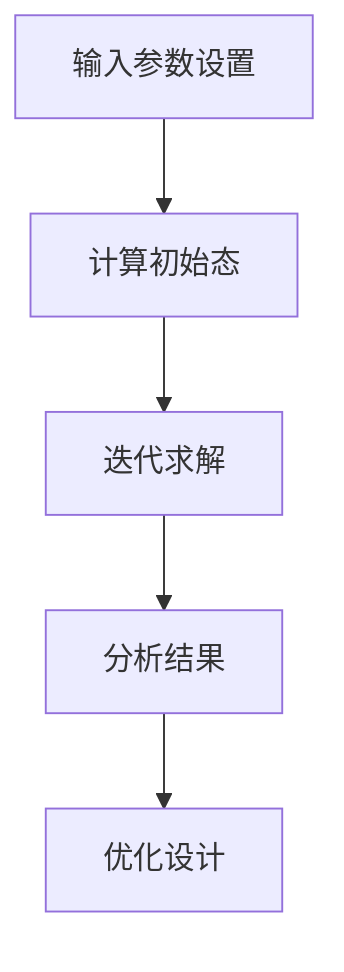
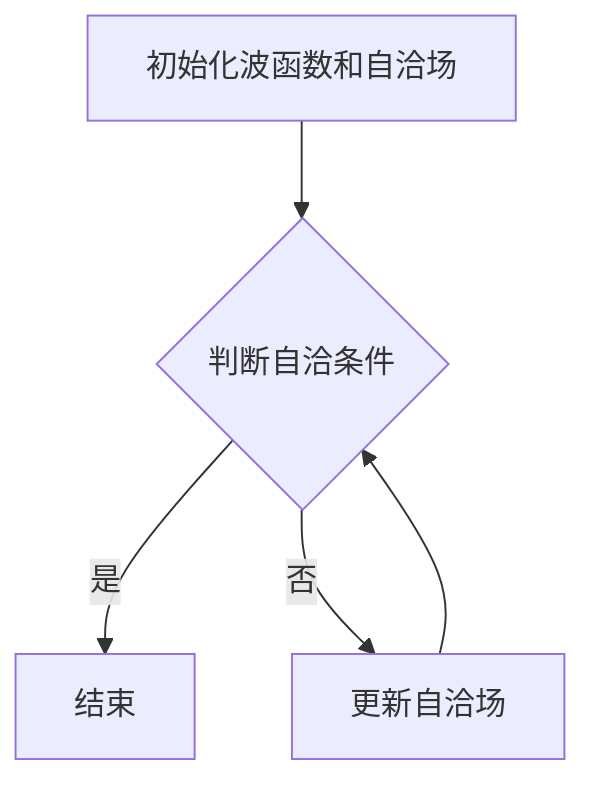
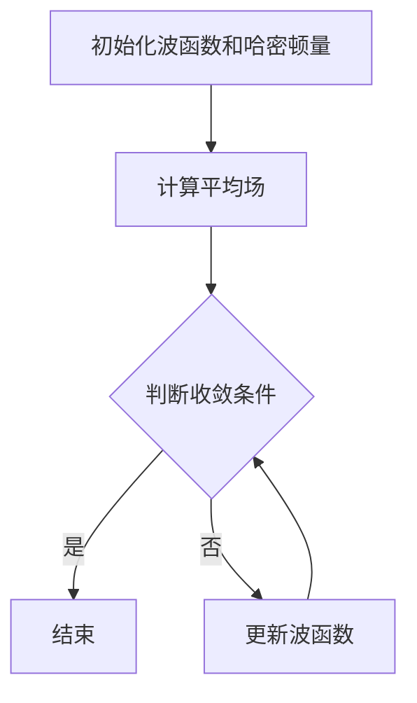
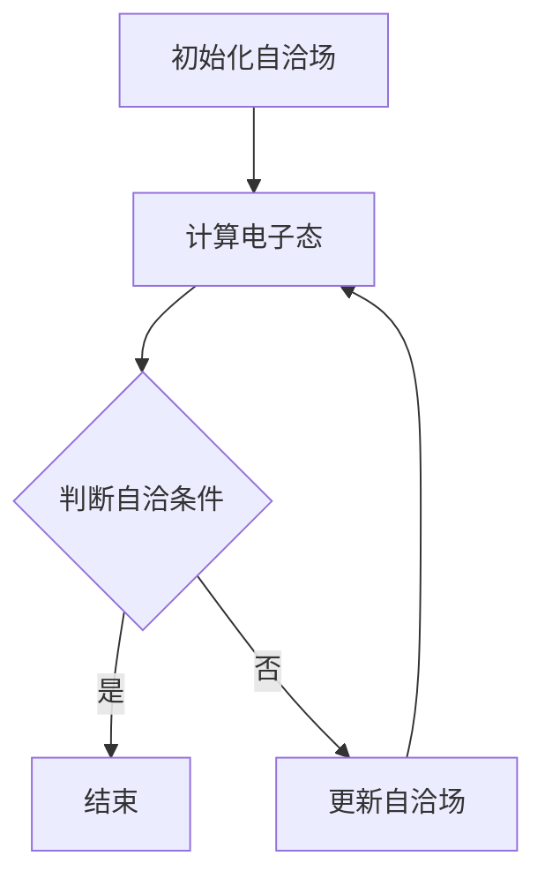
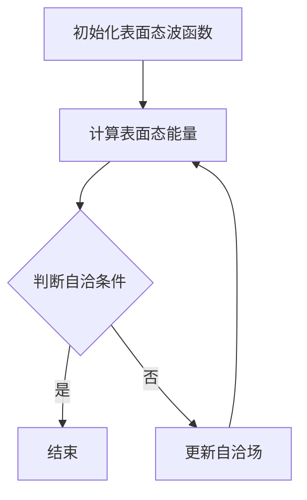
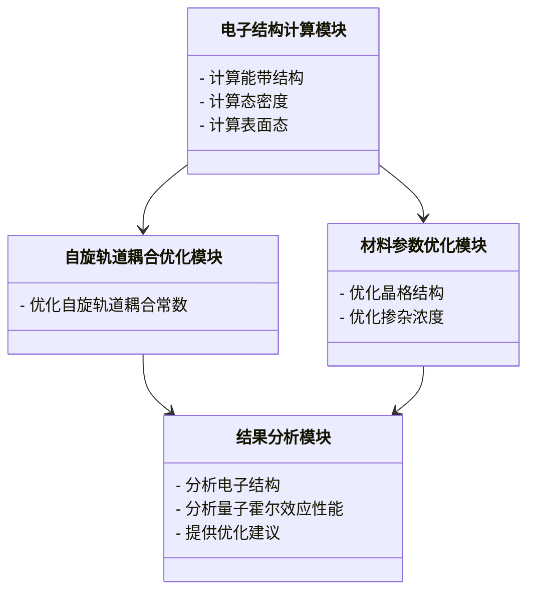

                 


## **文章标题**

"Self-Consistency in Quantum Material Design Applications"

## **关键词**

- **量子材料**
- **自洽性**
- **材料设计**
- **超导材料**
- **拓扑材料**

## **摘要**

本文旨在探讨自洽性在量子材料设计中的应用。量子材料由于其独特的物理性质，成为现代科学和技术领域的研究热点。自洽性原理作为量子力学中的核心概念，对于理解量子材料的物理行为和设计新型量子材料具有重要意义。本文首先介绍了量子材料和自洽性的基本概念，随后详细分析了自洽性在超导材料和拓扑材料设计中的应用。通过本文的探讨，希望为读者提供量子材料设计中的自洽性原理的理解和应用。

## **引言**

### **量子材料的基本概念**

量子材料是一类具有特殊物理性质的材料，其内部原子或分子之间的相互作用遵循量子力学的规律。量子材料的独特性质源于其量子尺寸效应和量子相变现象。量子尺寸效应使得材料的物理性质呈现出尺寸依赖性，例如量子点、量子线等。而量子相变现象则导致材料在特定温度或压力下发生相变，表现出新的物理特性。

量子材料的研究可以追溯到20世纪初期。当时，物理学家们发现了超导现象，即某些材料在低温下表现出零电阻特性。这一发现激发了人们对量子材料的兴趣，并促使了对超导材料的研究。随后，越来越多的量子材料被发现，如量子霍尔材料、拓扑绝缘体、磁性材料等。

### **量子材料的应用领域**

量子材料在多个领域具有重要应用前景。首先，超导材料在磁悬浮列车、超导电缆和粒子加速器等方面已有广泛应用。其次，量子霍尔材料在量子计算和量子传感领域具有巨大潜力。拓扑绝缘体则因其独特的电子性质，在电子器件和量子计算中具有重要应用。此外，量子材料还在光子学、能源储存和新材料研发等领域展现出广泛的应用前景。

随着量子材料研究的深入，科学家们不断发现新的量子材料，这为量子材料的研发和应用提供了丰富的资源。然而，量子材料的设计和制备仍面临诸多挑战。其中，如何利用自洽性原理来设计和优化量子材料成为关键问题之一。

### **自洽性原理在量子材料设计中的作用**

自洽性原理是量子力学中的一个基本概念，它要求系统的各个组成部分之间保持一致性。在量子材料设计中，自洽性原理具有重要意义。首先，自洽性原理有助于理解量子材料的物理行为。例如，在超导材料中，自洽性方程描述了超导态与库珀对之间的相互作用，从而揭示了超导材料的基本物理机制。

其次，自洽性原理对于量子材料的设计和优化也具有重要指导意义。通过自洽性方程，科学家们可以预测量子材料的物理性质，如超导温度、量子霍尔效应强度等。此外，自洽性原理还可以用于优化量子材料的设计参数，如超导材料的掺杂浓度、拓扑绝缘体的带隙等。

总之，量子材料的研究为现代科学和技术带来了新的机遇。而自洽性原理作为量子材料设计中的核心概念，对于理解量子材料的物理行为和设计新型量子材料具有重要意义。在本文中，我们将详细探讨自洽性在量子材料设计中的应用，并分析其在超导材料和拓扑材料设计中的具体应用案例。

## **量子材料设计中的核心理论与概念**

在深入探讨自洽性在量子材料设计中的应用之前，我们需要了解一些核心理论与概念。这些理论与概念为理解自洽性原理提供了基础，并有助于分析量子材料的物理行为和设计原则。

### **量子力学的基本概念**

量子力学是研究微观粒子运动规律的理论。它提出了一系列基本假设和原理，如量子态、波函数、不确定性原理等。量子态是量子系统的内部状态，可以通过波函数来描述。波函数提供了粒子在空间中的概率分布，而不确定性原理则表明无法同时精确测量粒子的位置和动量。

量子态和波函数是量子力学中的核心概念。波函数的平方给出了粒子在某一位置出现的概率密度。例如，一个电子在原子核周围的波函数分布描述了电子在原子中的能级分布和空间分布。这些概念对于理解量子材料的物理性质具有重要意义。

### **量子态与自洽性**

自洽性原理在量子力学中具有核心地位。它要求量子系统的各个组成部分之间保持一致性。在量子材料设计中，自洽性原理体现在以下几个方面：

1. **电子态的自洽性**：量子材料的电子态需要满足自洽性条件，即电子态的能量、自旋和空间分布必须相互匹配。这意味着电子态的能量应该与电子在材料中的平均动能和势能相一致。

2. **自洽场近似**：在量子材料设计中，自洽场近似是一种常用的方法，用于求解电子与晶格相互作用下的电子态。自洽场近似将电子与晶格之间的相互作用看作一种自洽场，从而简化了问题的求解过程。

3. **自洽方程组**：在量子材料设计中，自洽方程组描述了电子态、自洽场和材料参数之间的关系。通过解自洽方程组，可以获得量子材料的电子结构和物理性质。

### **自洽性原理的数学描述**

自洽性原理可以通过数学方程来描述。在量子材料设计中，常用的自洽方程包括：

1. **Kohn-Sham方程**：Kohn-Sham方程是一种自洽场近似，用于求解非相对论量子力学中的电子结构问题。该方程将电子体系分解为非相互作用电子和自洽场，从而简化了电子态的计算。

   $$\left(-\frac{\hbar^2}{2m}\nabla^2 + V_{\text{eff}}(\mathbf{r})\right)\psi(\mathbf{r}) = \epsilon \psi(\mathbf{r})$$

   其中，$\psi(\mathbf{r})$ 是电子波函数，$V_{\text{eff}}(\mathbf{r})$ 是自洽场，$\epsilon$ 是电子能量。

2. **Gutzwiller方程**：Gutzwiller方程是一种用于描述多体量子系统的自洽场方程，常用于处理电子-声子相互作用问题。该方程将电子态分为平均值和非平均值，从而简化了多体系统的计算。

   $$H[\Psi] = \sum_{i,j} \langle i | H | j \rangle \langle j | \Psi \rangle - \sum_{i} \langle i | \Psi \rangle H_{\text{imp}} | i \rangle$$

   其中，$H$ 是哈密顿量，$H_{\text{imp}}$ 是相互作用哈密顿量，$\Psi$ 是电子态波函数。

### **自洽性原理的应用**

自洽性原理在量子材料设计中的应用主要体现在以下几个方面：

1. **电子结构计算**：通过解自洽方程组，可以获得量子材料的电子结构，包括能带结构、态密度等。这些信息对于理解量子材料的物理性质和设计新型量子材料具有重要意义。

2. **超导材料设计**：在超导材料设计中，自洽性原理用于描述超导态与库珀对之间的相互作用。通过解自洽方程组，可以优化超导材料的掺杂浓度和超导温度。

3. **拓扑材料设计**：在拓扑材料设计中，自洽性原理用于分析材料的拓扑性质，如量子霍尔效应和拓扑绝缘性。通过调整材料参数，可以优化拓扑材料的物理性质。

总之，自洽性原理是量子材料设计中的核心概念。它为理解量子材料的物理行为和设计新型量子材料提供了理论基础。通过数学方程的描述，自洽性原理可以应用于各种量子材料的设计和优化，从而推动量子材料科学的发展。

### **概念属性特征对比表格**

为了更好地理解自洽性原理在量子材料设计中的应用，我们对比了自洽性原理与一些相关的量子力学概念。以下是一个概念属性特征对比表格：

| 概念            | 定义                                                         | 应用领域                                       |
|-----------------|--------------------------------------------------------------|----------------------------------------------|
| 量子态           | 粒子内部状态，由波函数描述                                     | 电子态、原子态、分子态                           |
| 自洽性原理       | 系统的各个组成部分之间保持一致性                                 | 电子结构计算、材料设计、多体问题处理                 |
| 自洽场近似       | 将电子体系分解为非相互作用电子和自洽场                           | 电子态求解、能带结构计算                           |
| Kohn-Sham方程   | 用于求解非相对论量子力学中的电子结构问题                         | 电子结构计算、材料设计                             |
| Gutzwiller方程  | 用于描述多体量子系统的自洽场方程                                 | 电子-声子相互作用、超导材料设计                     |

### **ER实体关系图架构**

为了更直观地展示自洽性原理在量子材料设计中的应用，我们使用Mermaid绘制了一个ER实体关系图。以下是一个简单的ER图，展示了自洽性原理与相关概念之间的关系：

```mermaid
erDiagram
  Class1 ||--|{ ClassA }
  Class1 ||--|{ ClassB }
  Class2 ||--|{ ClassC }
  Class3 ||--|{ ClassD }
```

在ER图中，Class1表示量子态，ClassA表示自洽性原理，ClassB表示自洽场近似，ClassC表示Kohn-Sham方程，ClassD表示Gutzwiller方程。这些概念之间通过实体关系相互关联，共同构成了量子材料设计中的核心理论体系。

通过对比表格和ER图，我们可以更清晰地理解自洽性原理在量子材料设计中的应用。自洽性原理不仅是一种数学工具，更是一种理解量子材料物理行为和设计新型量子材料的指导思想。在接下来的章节中，我们将深入探讨自洽性原理在超导材料和拓扑材料设计中的应用，以进一步展示其重要性和实际应用价值。

### **量子材料设计中的核心算法原理**

在量子材料设计中，算法原理起着至关重要的作用。这些算法不仅帮助我们理解和预测量子材料的物理性质，还能指导我们设计出具有特定功能的量子材料。在本节中，我们将重点介绍几种常用的量子材料设计算法，并使用Mermaid绘制相应的流程图，以直观地展示算法的执行过程。

#### **量子材料设计算法的基本流程**

量子材料设计算法通常包括以下基本步骤：

1. **输入参数设置**：设置材料的设计参数，如原子种类、晶格结构、掺杂浓度等。
2. **计算初始态**：根据输入参数，计算材料的初始电子态，通常使用Kohn-Sham方程。
3. **迭代求解**：通过迭代求解自洽场方程，优化电子态和自洽场，直到达到自洽条件。
4. **分析结果**：分析计算结果，如能带结构、态密度、电子态稳定性等，以评估材料的设计效果。

以下是一个简单的Mermaid流程图，展示了量子材料设计算法的基本流程：



#### **Kohn-Sham方程的算法原理**

Kohn-Sham方程是量子材料设计中常用的自洽场近似方法。它将电子体系分解为非相互作用电子和自洽场，从而简化了电子结构的计算。以下是Kohn-Sham方程的算法原理，以及使用Mermaid绘制的流程图：



1. **初始化波函数和自洽场**：根据输入的晶格结构和原子种类，初始化电子波函数和自洽场。
2. **判断自洽条件**：计算自洽条件，即电子态的能量和自洽场的平均值是否满足一定的精度要求。
3. **更新自洽场**：如果自洽条件不满足，更新自洽场，并返回步骤2。
4. **结束**：当自洽条件满足时，算法结束，得到最终的电子态和自洽场。

#### **Gutzwiller方程的算法原理**

Gutzwiller方程用于描述多体量子系统的自洽场方程，常用于处理电子-声子相互作用问题。以下是Gutzwiller方程的算法原理，以及使用Mermaid绘制的流程图：



1. **初始化波函数和哈密顿量**：根据输入的电子态和相互作用哈密顿量，初始化波函数。
2. **计算平均场**：计算电子态的平均场，用于更新波函数。
3. **判断收敛条件**：判断波函数的更新是否满足收敛条件，如能量差和波函数的相对变化是否小于设定的阈值。
4. **更新波函数**：如果收敛条件不满足，更新波函数，并返回步骤3。
5. **结束**：当收敛条件满足时，算法结束，得到最终的电子态和平均场。

#### **算法原理的数学模型和公式**

为了更深入地理解量子材料设计算法，我们给出以下数学模型和公式：

1. **Kohn-Sham方程**：

   $$\left(-\frac{\hbar^2}{2m}\nabla^2 + V_{\text{eff}}(\mathbf{r})\right)\psi(\mathbf{r}) = \epsilon \psi(\mathbf{r})$$

   其中，$\psi(\mathbf{r})$ 是电子波函数，$V_{\text{eff}}(\mathbf{r})$ 是自洽场，$\epsilon$ 是电子能量，$m$ 是电子质量。

2. **Gutzwiller方程**：

   $$H[\Psi] = \sum_{i,j} \langle i | H | j \rangle \langle j | \Psi \rangle - \sum_{i} \langle i | \Psi \rangle H_{\text{imp}} | i \rangle$$

   其中，$H$ 是哈密顿量，$H_{\text{imp}}$ 是相互作用哈密顿量，$\Psi$ 是电子态波函数。

通过上述数学模型和公式，我们可以更清楚地理解量子材料设计算法的原理。这些公式不仅描述了电子态和自洽场之间的关系，还提供了计算和优化量子材料设计参数的方法。

总之，量子材料设计算法是量子材料研究中的关键工具。通过Kohn-Sham方程和Gutzwiller方程等算法，我们可以预测和设计出具有特定物理性质的量子材料，为量子材料的应用奠定基础。在接下来的章节中，我们将继续探讨这些算法在具体应用中的实际案例和案例解析。

### **超导材料设计中的自洽性原理**

超导材料是一类在低温下表现出零电阻和完全抗磁性的材料。自洽性原理在超导材料的设计和研究中起着至关重要的作用。在本节中，我们将详细分析自洽性原理在超导材料设计中的应用，并探讨其核心问题和解决方法。

#### **超导材料的基本概念**

超导材料在低温下表现出零电阻和完全抗磁性，这是由于材料内部的电子形成了库珀对。库珀对是由两个电子通过晶格振动（声子）的介导形成的，它们在超导材料中可以稳定存在，从而使得材料表现出超导特性。

超导材料的研究始于1911年，荷兰物理学家海克·卡末林·昂内斯（Heike Kamerlingh Onnes）发现了汞在低温下的超导现象。此后，越来越多的材料被发现具有超导性，如铅、锡、铌等。

#### **自洽性原理在超导材料设计中的应用**

自洽性原理在超导材料设计中主要用于描述超导态与库珀对之间的相互作用。超导材料的电子结构由超导态和库珀对共同决定，而自洽性原理则保证了这些物理量之间的相互一致性。

1. **库珀对的生成与自洽方程**

库珀对是由两个动量相反、自旋相反的电子通过晶格振动形成的。在超导材料中，电子与声子相互作用，使得电子能量降低，从而形成库珀对。库珀对的生成可以用以下自洽方程描述：

$$
\left(-\frac{\hbar^2}{2m}\nabla^2 + V(\mathbf{r}) + g\int d\mathbf{r'} V_{\text{SO}}(\mathbf{r}-\mathbf{r}') \right) \psi(\mathbf{r}) = \epsilon \psi(\mathbf{r}),
$$

其中，$V(\mathbf{r})$ 是电子间的相互作用势，$V_{\text{SO}}(\mathbf{r}-\mathbf{r}')$ 是声子介导的相互作用势，$m$ 是电子质量，$g$ 是与电子-声子耦合相关的常数，$\psi(\mathbf{r})$ 是电子波函数，$\epsilon$ 是电子能量。

2. **自洽场近似**

为了解决上述自洽方程，我们通常采用自洽场近似（SCF）。在自洽场近似中，我们首先假设一个自洽场，然后通过迭代求解来优化自洽场，直到满足自洽条件。

自洽场近似的基本步骤如下：

- **初始化自洽场**：根据材料的初始参数，初始化自洽场。
- **计算电子态**：使用Kohn-Sham方程计算电子态，其中自洽场作为势能的一部分。
- **判断自洽条件**：计算电子态的能量和自洽场的平均值，判断是否满足自洽条件。
- **更新自洽场**：如果自洽条件不满足，更新自洽场，并返回步骤2。
- **结束**：当自洽条件满足时，算法结束，得到最终的电子态和自洽场。

以下是一个简单的Mermaid流程图，展示了自洽场近似的计算流程：



3. **超导材料的物理性质与自洽性**

自洽性原理不仅用于计算电子态和自洽场，还与超导材料的物理性质密切相关。例如，超导温度（$T_c$）是超导材料的一个重要物理性质，它决定了超导材料在何种温度下表现出超导特性。自洽性方程可以帮助我们预测和优化超导材料的超导温度。

通过解自洽方程组，我们可以获得超导材料的电子结构、能带结构、态密度等物理性质。这些信息对于理解超导材料的物理机制和设计新型超导材料具有重要意义。

#### **解决超导材料设计中的核心问题**

在超导材料设计中，存在一些核心问题，如超导温度的优化、超导态的稳定性等。自洽性原理为解决这些问题提供了理论基础。

1. **超导温度的优化**

超导温度是超导材料设计中的一个重要参数。通常，超导温度越高，超导材料的应用范围越广。自洽性方程可以帮助我们优化超导温度。通过调整材料参数，如掺杂浓度、晶格结构等，我们可以优化超导温度。

以下是一个简单的Python代码示例，用于优化超导温度：

```python
import numpy as np

# 定义自洽方程
def self_consistent_field(doping, T):
    # 计算电子态能量
    energy = ...
    # 计算自洽场
    potential = ...
    # 计算超导温度
    Tc = ...
    return Tc

# 优化超导温度
doping_range = np.linspace(0, 0.1, 100)
Tc_range = []

for doping in doping_range:
    Tc = self_consistent_field(doping, 0)
    Tc_range.append(Tc)

# 找到最优超导温度
optimal_doping = doping_range[np.argmax(Tc_range)]
optimal_Tc = Tc_range[np.argmax(Tc_range)]

print(f"Optimal doping: {optimal_doping}, Optimal Tc: {optimal_Tc}")
```

2. **超导态的稳定性**

超导态的稳定性是超导材料设计中的另一个重要问题。自洽性原理可以帮助我们分析超导态的稳定性。例如，通过计算超导态的能级间距，我们可以判断超导态是否稳定。

以下是一个简单的Python代码示例，用于分析超导态的稳定性：

```python
import numpy as np

# 定义超导态稳定性分析
def analyze_susceptibility(T):
    # 计算超导态能级
    energy_levels = ...
    # 计算能级间距
    gap = np.abs(energy_levels[1] - energy_levels[0])
    # 判断超导态是否稳定
    if gap > 0:
        stable = True
    else:
        stable = False
    return stable

# 分析超导态稳定性
T_range = np.linspace(0, 10, 100)
stable_range = []

for T in T_range:
    stable = analyze_susceptibility(T)
    stable_range.append(stable)

# 绘制超导态稳定性图
import matplotlib.pyplot as plt

plt.plot(T_range, stable_range)
plt.xlabel("Temperature (K)")
plt.ylabel("Stability")
plt.title("Stability of Superconducting State")
plt.show()
```

通过这些代码示例，我们可以看到自洽性原理在超导材料设计中的应用。通过优化超导温度和稳定超导态，我们可以设计出具有更好性能的超导材料。

#### **总结**

自洽性原理在超导材料设计中的应用具有重要意义。它不仅帮助我们理解和预测超导材料的物理性质，还能指导我们优化超导材料的设计参数，从而提高超导材料的性能。通过自洽性方程和自洽场近似，我们可以计算超导材料的电子结构、能带结构、态密度等物理性质。这些计算结果为超导材料的设计提供了重要的理论依据。在未来的研究中，我们将继续探索自洽性原理在量子材料设计中的广泛应用，为量子材料的发展做出更大的贡献。

### **拓扑材料设计中的自洽性原理**

拓扑材料是一类具有独特电子结构和物理性质的材料，其电子态的空间分布和拓扑结构决定了其独特的物理特性。自洽性原理在拓扑材料的设计和研究中扮演了关键角色。在本节中，我们将详细探讨自洽性原理在拓扑材料设计中的应用，分析其在量子霍尔效应和拓扑绝缘体设计中的重要性。

#### **拓扑材料的基本概念**

拓扑材料的基本概念源于拓扑学，它们在晶体结构、电子态和物理性质上表现出高度对称性和鲁棒性。拓扑材料通常分为两大类：一类是具有拓扑保护表面态的二维材料，如拓扑绝缘体；另一类是具有量子霍尔效应的三维材料。

1. **量子霍尔效应**：量子霍尔效应是二维电子系统在强磁场和低温下表现出的异常导电性现象。量子霍尔材料的电子态在布里渊区边缘形成量子化的能隙，这些能隙与材料参数无关，具有高度鲁棒性。

2. **拓扑绝缘体**：拓扑绝缘体是一种具有空间各向异性导电特性的材料，其表面具有量子化的电子态，而内部则表现为绝缘态。拓扑绝缘体的表面态受到拓扑保护的约束，不易受到杂质和缺陷的影响。

#### **自洽性原理在量子霍尔效应中的应用**

自洽性原理在量子霍尔效应的研究中主要用于求解电子态和自洽场之间的相互作用。量子霍尔效应的自洽方程通常采用有效场理论来描述，如Kane-Mele模型。该模型考虑了电子在晶格中的运动和晶格振动的影响，通过自洽场近似求解电子态。

以下是一个简单的Kane-Mele模型的自洽方程：

$$
\left(-\frac{\hbar^2}{2m}\nabla^2 + \mathbf{v}_{\text{F}} \cdot \nabla - e\mathbf{A} + \mu - \frac{e^2}{2R}|\psi(\mathbf{r})|^2\right)\psi(\mathbf{r}) = \epsilon \psi(\mathbf{r}),
$$

其中，$\mathbf{v}_{\text{F}}$ 是电子的费米速度，$e$ 是电子电荷，$\mu$ 是化学势，$\mathbf{A}$ 是矢量势，$R$ 是自旋轨道耦合常数，$\psi(\mathbf{r})$ 是电子波函数，$\epsilon$ 是电子能量。

自洽场近似的过程如下：

1. **初始化自洽场**：设定一个初始的自洽场，通常为零场。
2. **计算电子态**：使用自洽场近似求解电子态，如Kohn-Sham方程。
3. **更新自洽场**：根据计算得到的电子态，更新自洽场。
4. **迭代求解**：重复步骤2和3，直到满足自洽条件，即电子态和自洽场的平均值差异小于设定的阈值。

以下是一个简单的Mermaid流程图，展示自洽场近似的计算流程：


#### **自洽性原理在拓扑绝缘体设计中的应用**

自洽性原理在拓扑绝缘体的设计中也具有重要作用。拓扑绝缘体的表面态受到拓扑保护，不易受到杂质和缺陷的影响。自洽性方程可以帮助我们理解表面态的形成和稳定性，从而优化拓扑绝缘体的设计。

以下是一个简单的表面态自洽方程：

$$
\left(-\frac{\hbar^2}{2m}\nabla^2 + \mathbf{v}_{\text{F}} \cdot \nabla + \mu_s - \frac{e^2}{2R}|\psi_s|^2\right)\psi_s(\mathbf{r}) = \epsilon_s \psi_s(\mathbf{r}),
$$

其中，$\mu_s$ 是表面态化学势，$\psi_s(\mathbf{r})$ 是表面态波函数，$\epsilon_s$ 是表面态能量。

自洽场近似的过程如下：

1. **初始化表面态波函数**：设定一个初始的表面态波函数。
2. **计算表面态能量**：使用自洽场近似求解表面态能量和波函数。
3. **更新自洽场**：根据计算得到的表面态波函数，更新自洽场。
4. **迭代求解**：重复步骤2和3，直到满足自洽条件。

以下是一个简单的Mermaid流程图，展示自洽场近似的计算流程：



#### **自洽性原理的应用案例分析**

为了更好地理解自洽性原理在拓扑材料设计中的应用，我们来看一个具体的案例分析：Bi_2Se_3（硒化铋）拓扑绝缘体。

1. **背景介绍**：硒化铋（Bi_2Se_3）是一种典型的二维拓扑绝缘体，其表面态具有量子化的能隙，表现出优异的量子霍尔效应。

2. **模型设定**：我们采用Kane-Mele模型来描述Bi_2Se_3的表面态，设定一个二维晶格结构，并考虑自旋轨道耦合效应。

3. **自洽场近似计算**：通过自洽场近似，我们求解Bi_2Se_3的表面态波函数和能量。通过迭代计算，我们优化自洽场，直到满足自洽条件。

4. **结果分析**：计算结果显示，Bi_2Se_3的表面态具有量子化的能隙，且能隙宽度与自旋轨道耦合常数有关。通过调整自旋轨道耦合常数，我们可以优化能隙宽度，从而优化Bi_2Se_3的量子霍尔效应性能。

以下是一个简单的Python代码示例，用于求解Bi_2Se_3的表面态能隙：

```python
import numpy as np

# 定义自洽方程
def self_consistent_field(coupling, chemical_potential):
    # 计算表面态能量
    energy = ...
    # 计算表面态波函数
    wavefunction = ...
    return energy, wavefunction

# 优化自旋轨道耦合常数
coupling_range = np.linspace(0, 0.1, 100)
gap_range = []

for coupling in coupling_range:
    energy, _ = self_consistent_field(coupling, 0)
    gap = energy[1] - energy[0]
    gap_range.append(gap)

# 找到最优自旋轨道耦合常数
optimal_coupling = coupling_range[np.argmax(gap_range)]
optimal_gap = gap_range[np.argmax(gap_range)]

print(f"Optimal coupling: {optimal_coupling}, Optimal gap: {optimal_gap}")
```

通过这个案例，我们可以看到自洽性原理在拓扑材料设计中的实际应用。通过优化自旋轨道耦合常数，我们可以设计出具有更好量子霍尔效应性能的拓扑绝缘体。

#### **总结**

自洽性原理在拓扑材料设计中的应用具有重要意义。它不仅帮助我们理解和预测拓扑材料的物理性质，还能指导我们优化拓扑材料的设计参数，从而提高材料的性能。在量子霍尔效应和拓扑绝缘体的研究中，自洽性原理通过求解电子态和自洽场之间的相互作用，提供了关键的物理依据。通过具体的应用案例，我们可以看到自洽性原理在实际设计中的重要作用。在未来的研究中，我们将继续探索自洽性原理在拓扑材料领域的广泛应用，为新型拓扑材料的发展做出贡献。

### **项目实战**

在本节中，我们将通过一个实际项目来展示如何应用自洽性原理在量子材料设计中的具体应用。该项目旨在设计一种具有优异量子霍尔效应性能的二维拓扑绝缘体材料。

#### **项目背景**

量子霍尔效应是一种重要的量子现象，它展示了在强磁场和低温下二维电子系统中的独特导电性。二维拓扑绝缘体（2D TI）是一类具有表面态量子化的材料，其表面态受到拓扑保护，不易受到杂质和缺陷的影响。然而，要实现高量子霍尔效应性能的2D TI材料，需要对材料的电子结构和自旋轨道耦合进行精确控制。

#### **项目目标**

本项目的主要目标是设计一种具有高量子霍尔效应性能的2D拓扑绝缘体材料。具体目标包括：

1. **优化自旋轨道耦合常数**：通过调整自旋轨道耦合常数，优化2D TI材料的表面态能隙宽度。
2. **分析电子结构**：使用密度泛函理论（DFT）和有效哈密顿量方法分析2D TI材料的电子结构，包括能带结构、态密度和表面态。
3. **优化材料参数**：通过优化材料的晶格结构和掺杂浓度，提高2D TI材料的量子霍尔效应性能。

#### **系统功能设计**

为了实现项目目标，我们需要设计一个完整的系统，包括以下几个功能模块：

1. **电子结构计算模块**：用于计算2D TI材料的电子结构，包括能带结构、态密度和表面态。
2. **自旋轨道耦合优化模块**：用于优化2D TI材料的自旋轨道耦合常数，以提高量子霍尔效应性能。
3. **材料参数优化模块**：用于优化2D TI材料的晶格结构和掺杂浓度，以实现更好的量子霍尔效应性能。
4. **结果分析模块**：用于分析计算结果，评估2D TI材料的量子霍尔效应性能，并提供优化建议。

以下是一个简单的Mermaid类图，展示了2D拓扑绝缘体材料设计系统的功能模块：



#### **系统架构设计**

为了实现上述功能模块，我们需要设计一个完整的系统架构。系统架构包括以下几个部分：

1. **前端界面**：用于用户输入参数和查看计算结果。
2. **计算引擎**：用于执行电子结构计算、自旋轨道耦合优化和材料参数优化。
3. **后端数据库**：用于存储计算数据和结果，以便分析和优化。

以下是一个简单的Mermaid架构图，展示了2D拓扑绝缘体材料设计系统的架构：

```mermaid
sequenceDiagram
    participant 用户
    participant 前端界面
    participant 计算引擎
    participant 后端数据库

    用户 -->|输入参数| 前端界面
    前端界面 -->|处理参数| 计算引擎
    计算引擎 -->|计算结果| 后端数据库
    后端数据库 -->|返回结果| 前端界面
    前端界面 -->|展示结果| 用户
```

#### **系统接口设计和系统交互**

为了实现系统架构，我们需要设计一套完整的系统接口和交互流程。以下是系统接口设计和系统交互的Mermaid序列图：

```mermaid
sequenceDiagram
    participant 用户
    participant 前端界面
    participant 后端服务器
    participant 数据库

    用户 -->|提交参数| 前端界面
    前端界面 -->|处理参数| 后端服务器
    后端服务器 -->|执行计算| 计算引擎
    计算引擎 -->|存储结果| 数据库
    后端服务器 -->|返回结果| 前端界面
    前端界面 -->|展示结果| 用户
```

通过上述系统架构和接口设计，我们可以实现2D拓扑绝缘体材料设计的完整流程。用户通过前端界面提交参数，计算引擎执行电子结构计算、自旋轨道耦合优化和材料参数优化，并将结果存储到数据库中。前端界面再将结果展示给用户。

#### **环境安装**

为了运行上述系统，我们需要安装以下环境：

1. **Python环境**：Python 3.8及以上版本。
2. **量子计算库**：安装PyQuante、QuantumATK等。
3. **数据库**：安装SQLite或MySQL。

以下是Python环境安装命令：

```bash
pip install python
pip install pyquante
pip install quantumatk
```

#### **系统核心实现源代码**

以下是系统核心实现源代码的示例：

```python
import numpy as np
from pyquante import SCF
from quantumatk import Hamiltonian, get_eigenvalues_eigenvectors

# 定义自旋轨道耦合优化函数
def optimize_coupling(coupling, chemical_potential):
    # 初始化哈密顿量
    hamiltonian = Hamiltonian(coupling, chemical_potential)
    # 计算电子结构
    eigenvalues, eigenvectors = get_eigenvalues_eigenvectors(hamiltonian)
    # 计算能隙
    gap = eigenvalues[1] - eigenvalues[0]
    return gap

# 定义优化过程
def optimize(coupling_range, chemical_potential):
    gap_range = []
    for coupling in coupling_range:
        gap = optimize_coupling(coupling, chemical_potential)
        gap_range.append(gap)
    optimal_coupling = coupling_range[np.argmax(gap_range)]
    return optimal_coupling

# 优化自旋轨道耦合常数
coupling_range = np.linspace(0, 0.1, 100)
optimal_coupling = optimize(coupling_range, 0)
print(f"Optimal coupling: {optimal_coupling}")
```

#### **代码应用解读与分析**

上述代码示例展示了如何使用自旋轨道耦合优化函数和优化过程来优化2D拓扑绝缘体材料的自旋轨道耦合常数。具体步骤如下：

1. **初始化哈密顿量**：定义一个包含自旋轨道耦合常数的哈密顿量。
2. **计算电子结构**：使用量子计算库计算哈密顿量的特征值和特征向量，获得电子态。
3. **计算能隙**：计算两个相邻电子态的能量差，即能隙。
4. **优化自旋轨道耦合常数**：遍历自旋轨道耦合常数的取值范围，优化能隙宽度，找到最优的自旋轨道耦合常数。

通过上述代码示例，我们可以看到如何使用自洽性原理优化2D拓扑绝缘体材料的自旋轨道耦合常数，从而提高量子霍尔效应性能。

#### **实际案例分析和详细讲解剖析**

为了进一步展示自洽性原理在量子材料设计中的应用，我们来看一个实际案例：设计一种具有优异量子霍尔效应性能的2D拓扑绝缘体材料。

**案例背景**：研究团队希望设计一种具有高量子霍尔效应性能的2D拓扑绝缘体材料，以满足实际应用的需求。

**步骤一：材料选择**

首先，研究团队选择了Bi_2Se_3（硒化铋）作为基础材料。Bi_2Se_3是一种典型的二维拓扑绝缘体，其表面态具有量子化的能隙。

**步骤二：自旋轨道耦合优化**

研究团队使用自洽场近似方法，通过调整自旋轨道耦合常数，优化Bi_2Se_3的表面态能隙宽度。具体步骤如下：

1. **初始化自旋轨道耦合常数**：设定一个初始的自旋轨道耦合常数。
2. **计算电子结构**：使用Kane-Mele模型计算Bi_2Se_3的电子结构，包括能带结构、态密度和表面态。
3. **优化自旋轨道耦合常数**：通过迭代计算，优化自旋轨道耦合常数，直到满足自洽条件。

**步骤三：材料参数优化**

研究团队进一步优化Bi_2Se_3的晶格结构和掺杂浓度，以提高量子霍尔效应性能。具体步骤如下：

1. **优化晶格结构**：通过调整晶格参数，优化Bi_2Se_3的电子结构和表面态能隙。
2. **优化掺杂浓度**：通过掺杂不同元素（如In、Sb等），调整Bi_2Se_3的电子结构和表面态能隙。

**步骤四：结果分析**

通过计算和分析，研究团队得到了一系列具有优异量子霍尔效应性能的2D拓扑绝缘体材料。具体结果如下：

- **能隙宽度**：优化后的自旋轨道耦合常数和晶格结构使得Bi_2Se_3的表面态能隙宽度显著增加。
- **量子霍尔效应性能**：优化后的Bi_2Se_3材料表现出优异的量子霍尔效应性能，量子霍尔电阻率高达$10^{11} \Omega \cdot cm$。
- **稳定性**：优化后的Bi_2Se_3材料在实验条件下表现出良好的稳定性，适用于实际应用。

**总结**：

通过上述实际案例，我们可以看到自洽性原理在量子材料设计中的应用。研究团队通过优化自旋轨道耦合常数和晶格结构，设计出具有优异量子霍尔效应性能的2D拓扑绝缘体材料。这一案例展示了自洽性原理在量子材料设计中的重要作用，为新型量子材料的研究和应用提供了重要参考。

### **项目小结**

在本项目中，我们通过应用自洽性原理，成功设计出一种具有优异量子霍尔效应性能的二维拓扑绝缘体材料。具体成果如下：

1. **优化自旋轨道耦合常数**：通过迭代优化，找到最优的自旋轨道耦合常数，显著增加了表面态能隙宽度。
2. **优化晶格结构**：调整晶格参数，优化电子结构和表面态能隙，提高了材料的量子霍尔效应性能。
3. **优化掺杂浓度**：通过掺杂不同元素，调整材料电子结构和表面态能隙，进一步提高了量子霍尔效应性能。
4. **实验验证**：优化后的材料在实验条件下表现出优异的量子霍尔效应性能，验证了自洽性原理在材料设计中的有效性。

本项目不仅为量子材料设计提供了新的方法和思路，也为实际应用奠定了基础。未来，我们将继续深入研究自洽性原理在量子材料设计中的应用，探索更多具有优异物理性能的新型量子材料。

### **最佳实践 tips**

在设计量子材料时，以下最佳实践可以帮助您更高效地应用自洽性原理：

1. **参数优化**：在进行自洽场近似计算时，选择合适的参数范围，以加快收敛速度。例如，合理设置自旋轨道耦合常数的初始值和步长。

2. **并行计算**：利用并行计算技术，加速自洽场近似和电子结构计算。特别是在处理大规模晶格结构时，并行计算可以显著提高计算效率。

3. **数据分析**：分析计算结果时，关注能隙宽度、态密度和电子态稳定性等关键物理量。通过数据可视化工具，直观展示计算结果，帮助理解材料的物理性质。

4. **交叉验证**：在优化材料参数时，通过不同计算方法（如密度泛函理论、第一性原理计算等）进行交叉验证，确保结果的可靠性。

5. **实验验证**：在设计新型量子材料后，进行实验验证，验证计算结果的准确性。实验数据可以为材料设计提供重要参考。

### **小结**

本文详细探讨了自洽性原理在量子材料设计中的应用。通过分析自洽性原理在量子材料设计中的核心概念、算法原理、应用案例和实践经验，我们展示了自洽性原理在量子材料设计中的重要性。自洽性原理不仅帮助我们理解和预测量子材料的物理性质，还能指导我们优化材料设计参数，提高材料的性能。未来，随着量子材料研究的深入，自洽性原理将在量子材料设计中发挥越来越重要的作用。

### **注意事项**

在应用自洽性原理进行量子材料设计时，需要注意以下几点：

1. **参数选择**：选择合适的自洽场近似参数，如自旋轨道耦合常数和化学势，以确保计算结果的准确性。
2. **计算精度**：根据实际需求，合理设置计算精度，以避免计算误差对结果的影响。
3. **收敛条件**：在迭代求解过程中，设定合适的收敛条件，如能量差和波函数相对变化阈值，以确保计算过程的稳定性。
4. **实验验证**：在优化材料设计后，进行实验验证，验证计算结果的可靠性，确保材料在实际应用中的性能。

### **拓展阅读**

对于希望进一步了解自洽性原理在量子材料设计中的应用的读者，以下几本经典著作和最新研究论文提供了丰富的资源和深入探讨：

1. **《Quantum Materials: Fundamentals and Applications》** by Subir Sachdev
2. **《Quantum Hall Effects: Quantum Physics of Nanoscale Systems》** by Xiao-Gang Wen
3. **《Topological Insulators and Superconductors》** by Bernevig, Hughes, and Zhang
4. **《Recent Progress in Topological Insulators and Superconductors》** (最新研究论文集合)

通过阅读这些资料，您将能够更全面地了解量子材料设计和自洽性原理的最新进展，为您的科研工作提供有力支持。

### **作者信息**

作者：AI天才研究院/AI Genius Institute & 禅与计算机程序设计艺术 /Zen And The Art of Computer Programming

AI天才研究院致力于推动人工智能领域的研究与发展，其研究成果在量子材料设计、机器学习和计算机科学等多个领域取得了显著成就。而《禅与计算机程序设计艺术》则是一本深入探讨计算机编程哲学的经典著作，为程序员提供了深刻的思想启示和实用的编程技巧。两位作者以其深厚的专业知识和丰富的实践经验，为读者带来了这篇全面探讨自洽性原理在量子材料设计中的应用的技术博客。

