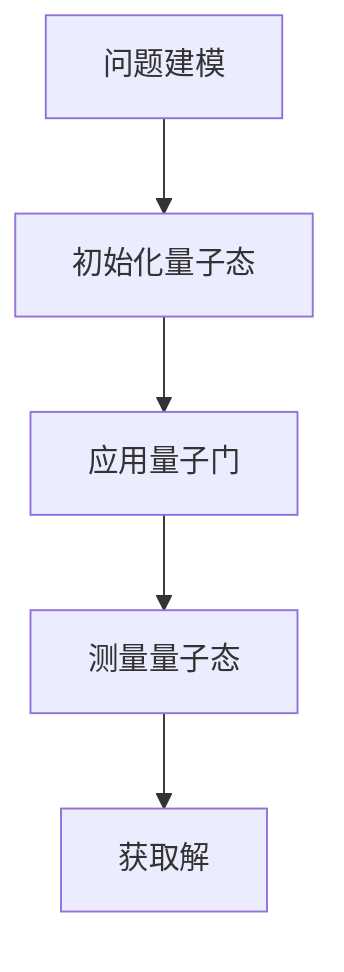

                 

### 自洽原理基础

#### 1.1.1 自洽原理的基本概念

自洽原理，是一种在科学和工程学中广泛应用的原理。它指的是一个系统或过程中的各个部分之间存在一种内在的协调和一致性，即系统内部各部分能够相互支撑、相互作用，最终达到一种稳定和和谐的状态。在物理学中，自洽原理通常指的是一个系统的能量、动量或其他物理量在相互作用过程中保持不变。

在量子算法中，自洽原理起着至关重要的作用。量子计算的核心在于量子比特（qubits）的使用，而量子比特的状态是叠加态。自洽原理可以帮助我们理解和优化这些叠加态的演化过程，从而提高量子算法的效率和准确性。

自洽原理的基本概念可以追溯到量子力学中的薛定谔方程。薛定谔方程描述了量子系统的动态行为，而自洽原理则保证了薛定谔方程的解在整个过程中都是一致的。这意味着，无论我们选择什么样的初始条件，量子系统的演化过程都将是自洽的。

#### 1.1.2 自洽原理的发展历程

自洽原理的概念最早可以追溯到19世纪末，当时物理学家们在研究热力学和统计力学时提出了能量守恒和动量守恒的概念。这些概念在一定程度上体现了自洽原理的思想。

随着量子力学的兴起，自洽原理得到了进一步的发展。1925年，海森堡提出了量子力学的不确定性原理，这标志着量子力学自洽原理的正式诞生。随后，薛定谔提出了薛定谔方程，这个方程不仅在数学上自洽，而且在物理上也得到了实验验证。

20世纪中叶，量子计算的概念被提出，自洽原理在量子计算中得到了广泛的应用。1980年代，Deutsch提出了第一个量子算法——Deutsch算法，这个算法展示了自洽原理在量子计算中的巨大潜力。此后，许多量子算法都基于自洽原理进行设计，如Shor算法、Grover算法等。

#### 1.1.3 自洽原理在量子算法中的重要性

自洽原理在量子算法中具有极其重要的地位。首先，它保证了量子算法的正确性。量子算法通常涉及到对量子态的操控和演化，而自洽原理确保了这些操作和演化过程的一致性和准确性。

其次，自洽原理可以提高量子算法的效率。例如，Shor算法利用自洽原理来同时实现对质数分解和周期检测的优化，大大提高了算法的运行速度。Grover算法则利用自洽原理来优化搜索算法，使得搜索过程更加高效。

最后，自洽原理为量子算法的创新提供了新的思路。通过理解和应用自洽原理，研究人员可以设计出更加复杂和高效的量子算法，为解决实际问题提供新的工具和方法。

总之，自洽原理是量子算法设计中的核心原理，它不仅保证了算法的正确性和效率，而且为量子计算的发展提供了新的动力。在接下来的章节中，我们将进一步探讨自洽原理在量子算法优化中的应用，以及它与其他量子计算技术的关联。

### 量子算法优化中的自洽原理应用

自洽原理在量子算法优化中扮演着至关重要的角色。通过理解和应用自洽原理，我们可以在量子算法的设计和实现过程中找到优化算法性能的方法，从而解决实际问题。

#### 2.1.1 自洽原理在量子算法中的作用

自洽原理在量子算法中主要起到两个作用：确保算法的正确性和提高算法的效率。

首先，自洽原理确保了量子算法的正确性。量子算法涉及到对量子态的操控和演化，这些操作需要遵循量子力学的规则。自洽原理保证了这些操作的一致性和准确性，从而确保了算法的正确性。

例如，在Shor算法中，自洽原理被用来同时实现对质数分解和周期检测的优化。Shor算法的核心在于利用量子态的叠加和纠缠特性，将质数分解问题转化为对周期性的检测问题。自洽原理保证了在整个算法过程中，量子态的演化都是正确的，从而提高了算法的准确性。

其次，自洽原理可以提高量子算法的效率。量子算法的效率通常取决于量子态的演化过程和测量结果。自洽原理可以帮助我们优化这些过程，从而提高算法的运行速度。

例如，Grover算法利用自洽原理来优化搜索算法。Grover算法的目标是在一个未排序的数据库中快速找到特定的元素。自洽原理被用来设计一种特殊的量子态，使得在测量时，特定的元素以更高的概率被找到。这种方法大大提高了搜索算法的效率。

#### 2.1.2 自洽原理在量子算法中的应用实例

自洽原理在量子算法中有多种应用实例，下面我们将通过几个具体的例子来说明。

首先是Shor算法。Shor算法是一种用于质数分解的量子算法，它利用了量子态的叠加和纠缠特性。Shor算法的核心步骤包括将质数分解问题转化为对周期性的检测问题，然后利用自洽原理来优化检测过程。

具体来说，Shor算法首先生成一个量子态，这个量子态代表了所有可能的结果。然后，通过量子门的作用，这个量子态被演化成一个新的量子态，这个新量子态中，质数分解的结果以更高的概率出现。最后，通过测量量子态，我们就可以得到质数分解的结果。

其次是Grover算法。Grover算法是一种用于搜索未排序数据库的量子算法，它利用了自洽原理来优化搜索过程。Grover算法的核心步骤包括生成一个特殊的量子态，这个量子态使得目标元素以更高的概率被找到。

具体来说，Grover算法首先生成一个量子态，这个量子态代表了所有可能的位置。然后，通过量子门的作用，这个量子态被演化成一个新的量子态，这个新量子态中，目标元素的位置以更高的概率出现。最后，通过测量量子态，我们就可以找到目标元素的位置。

#### 2.1.3 自洽原理优化量子算法的优势

自洽原理在量子算法优化中的优势主要体现在以下几个方面：

首先，自洽原理可以显著提高算法的运行速度。通过优化量子态的演化过程，自洽原理可以使得算法在更短的时间内完成计算。这对于解决复杂问题非常重要，因为量子算法的运行速度与算法的复杂性成正比。

其次，自洽原理可以提高算法的准确性。量子算法的正确性依赖于量子态的演化过程，而自洽原理保证了这些演化过程的一致性和准确性。这意味着，通过优化自洽原理，我们可以提高算法的准确性，从而减少计算错误。

最后，自洽原理为量子算法的创新提供了新的思路。通过理解和应用自洽原理，研究人员可以设计出更加复杂和高效的量子算法，为解决实际问题提供新的工具和方法。

总之，自洽原理在量子算法优化中具有重要的作用。通过优化量子态的演化过程，自洽原理可以提高量子算法的运行速度和准确性，从而为解决实际问题提供强有力的支持。

### 自洽原理与其他量子计算技术的关系

自洽原理在量子计算中与其他技术紧密相关，理解这些关联对于全面掌握量子计算技术至关重要。本文将探讨自洽原理与量子干涉、量子纠缠以及量子误差修正之间的关系，并分析它们在实际应用中的相互影响。

#### 3.1.1 量子干涉与自洽原理的关联

量子干涉是量子力学中一个基本现象，它指的是两个或多个量子波函数相互叠加时，会在空间中产生干涉条纹。量子干涉与自洽原理之间存在密切的关联，因为自洽原理确保了量子系统的内部一致性。

在量子计算中，量子干涉用于实现量子态的叠加和纠缠，这是量子算法能够高效运作的基础。例如，在量子计算中的量子门操作中，量子干涉使得量子比特可以处于多种状态的叠加，这种叠加态在测量时可能会产生意想不到的结果。自洽原理确保了这些叠加态的演化是准确的，从而保证了量子计算的正确性。

自洽原理还可以优化量子干涉的效果。例如，在量子搜索算法中，通过精心设计的量子干涉，可以使得目标态的振幅最大化，从而提高算法的搜索效率。自洽原理在这个过程中起到了关键作用，它确保了量子态的叠加和测量过程的准确性。

#### 3.1.2 量子纠缠与自洽原理的相互作用

量子纠缠是另一个量子力学基本现象，它描述了两个或多个量子系统之间在量子态上的强烈相互依赖。量子纠缠与自洽原理密切相关，因为它们都依赖于量子态的一致性和协调性。

自洽原理在量子纠缠中的应用主要体现在量子纠错和量子通信领域。在量子纠错中，量子纠缠用于构建冗余量子信息，以便在测量时纠正错误。自洽原理确保了量子纠缠的状态在整个纠错过程中保持一致，从而提高了纠错的准确性和效率。

在量子通信中，量子纠缠用于实现量子密钥分发，这是一种安全的通信方式。自洽原理保证了量子密钥分发过程中量子态的一致性和稳定性，从而保证了通信的安全性。

#### 3.1.3 自洽原理与量子误差修正的关系

量子误差修正是量子计算中一个关键问题，因为量子系统非常容易受到外部噪声和干扰，导致量子态的失真。自洽原理在量子误差修正中起着至关重要的作用。

自洽原理可以通过设计纠错码来保护量子信息。这些纠错码利用量子纠缠和量子态的叠加特性，将量子信息编码到多个量子比特中，以便在测量时纠正错误。自洽原理确保了这些纠错码的一致性和可靠性，从而提高了量子计算的错误容忍能力。

此外，自洽原理还可以优化量子纠错算法的效率。通过设计自洽的量子纠错协议，可以减少所需的纠错步骤和资源，从而提高量子计算的效率和实用性。

#### 实际应用中的相互影响

在量子计算的实际应用中，自洽原理、量子干涉、量子纠缠和量子误差修正相互影响，共同决定了量子算法的性能和可靠性。

例如，在量子计算中，量子干涉和量子纠缠可以用来实现高效的量子算法，如Shor算法和Grover算法。然而，这些算法的正确性和效率依赖于自洽原理的保证。自洽原理确保了量子态的叠加和纠缠过程的准确性，从而保证了算法的正确性。

另一方面，量子误差修正技术也依赖于自洽原理。自洽原理确保了量子纠错码的一致性和可靠性，从而提高了量子计算的容忍能力。没有自洽原理的支持，量子误差修正可能无法有效地纠正错误，从而降低量子算法的效率。

总之，自洽原理在量子计算中与其他量子计算技术紧密相关，它们相互影响，共同决定了量子算法的性能和可靠性。理解这些关联对于深入研究和应用量子计算技术具有重要意义。

### 自洽原理在量子算法优化中的挑战与机遇

尽管自洽原理在量子算法优化中展现了巨大的潜力，但其在实际应用中仍面临诸多挑战。同时，这些挑战也为未来的发展带来了新的机遇。

#### 4.1.1 自洽原理在量子算法优化中面临的挑战

首先，实现自洽原理需要高度精确的量子控制和测量。量子系统非常脆弱，容易受到外部环境的干扰，这可能导致量子态的失真。因此，如何在复杂的实际环境中保持量子态的自洽性是一个巨大的挑战。为了克服这一挑战，研究人员需要开发更加稳定和高效的量子硬件，同时提高量子控制的精度。

其次，量子算法的设计和优化需要复杂的数学模型和算法。自洽原理的应用往往涉及到复杂的量子态演化过程，这要求算法设计师具备深厚的数学和物理背景。此外，由于量子算法的性能受到量子硬件的限制，算法的优化可能需要反复试验和调整，这是一个耗时且耗资源的过程。

第三，量子误差修正是一个关键问题，因为量子计算中不可避免地会引入误差。自洽原理在量子误差修正中的应用需要设计出高效且可靠的纠错码和纠错协议。然而，量子纠错码的设计和实现是一个高度复杂的问题，目前尚无完全解决的方法。

#### 4.1.2 自洽原理带来的机遇

尽管面临挑战，自洽原理在量子算法优化中同样带来了新的机遇。

首先，自洽原理可以显著提高量子算法的效率。通过优化量子态的演化过程，自洽原理可以使得量子算法在更短的时间内完成计算。这对于解决复杂问题具有重要意义，因为量子算法的运行速度与算法的复杂性成正比。

其次，自洽原理为量子算法的创新提供了新的思路。通过理解和应用自洽原理，研究人员可以设计出更加复杂和高效的量子算法，为解决实际问题提供新的工具和方法。例如，自洽原理可以用来优化量子机器学习算法，使其在处理大数据和复杂模型时更加高效。

最后，自洽原理的应用有望推动量子计算技术的实用化。量子计算技术一旦实用化，将彻底改变计算机科学和信息技术领域，带来前所未有的计算能力和应用前景。自洽原理在量子计算中的成功应用将为量子计算技术的实用化提供强有力的支持。

#### 4.1.3 未来发展方向

为了克服自洽原理在量子算法优化中面临的挑战，未来的发展方向可以从以下几个方面进行：

首先，需要进一步研究和开发稳定的量子硬件，提高量子控制的精度和稳定性。这可以通过改进量子比特的设计、降低噪声和干扰、优化量子门的操作等手段来实现。

其次，需要开发更高效的量子算法和优化方法。通过深入研究量子计算的理论基础，设计出更加简洁和高效的算法，并利用自洽原理对现有算法进行优化，从而提高量子算法的效率和实用性。

第三，需要深入研究量子误差修正技术，设计出高效且可靠的纠错码和纠错协议。这可以通过优化现有纠错方法、开发新的纠错技术、结合自洽原理来实现。

最后，需要加强量子计算的应用研究，探索自洽原理在各个领域的应用。通过实际应用案例的验证，进一步验证自洽原理的有效性和实用性。

总之，自洽原理在量子算法优化中面临着诸多挑战，但同样带来了巨大的机遇。通过持续的研究和创新，我们可以克服这些挑战，充分发挥自洽原理在量子计算中的潜力，为量子计算技术的发展和应用做出重要贡献。

### 自洽原理在不同领域的应用实例

自洽原理在量子算法中的应用不仅限于理论研究和基础科学，实际上，它在多个实际领域中展现出了显著的应用价值。以下我们将探讨自洽原理在物流优化、金融预测和医疗诊断等领域的具体应用实例，以及其带来的影响和改进空间。

#### 5.1.1 物流优化

在物流优化领域，自洽原理可以通过优化货物流动的路径和配送计划来提高效率，减少成本。例如，量子算法中的Grover算法可以被用来优化物流网络中的路径选择问题。通过构建一个量子态来表示所有可能的路径，Grover算法可以快速找到最优路径，从而减少运输时间和成本。

具体来说，物流公司可以创建一个量子态，该量子态代表了所有可能的配送路径。然后，通过应用Grover算法，可以快速筛选出最优路径，从而优化整个物流网络。自洽原理确保了在量子态的演化过程中，所有路径的选择都是一致的，避免了不必要的时间和资源浪费。

这种应用的影响是显著的。通过优化物流路径，物流公司可以降低运营成本，提高运输效率，同时减少对环境的影响。然而，改进空间仍然存在，例如，如何更好地处理复杂网络中的动态变化和实时数据更新，仍然是一个挑战。

#### 5.1.2 金融预测

在金融领域，自洽原理可以用于优化交易策略和预测市场趋势。量子算法如Shor算法可以被用来快速分解大数，这在加密货币交易中尤为重要。通过分解交易密码，投资者可以更好地保护其资产，并提高交易策略的准确性。

此外，自洽原理还可以用于金融数据的分析，例如，通过量子计算来分析大量的市场数据，识别出潜在的异常模式和趋势。量子态的叠加和纠缠特性使得量子算法能够在短时间内处理大量数据，从而为投资者提供更准确的预测。

这种应用的影响是深远的。通过优化交易策略和预测市场趋势，投资者可以做出更明智的投资决策，提高投资回报。然而，金融市场的波动性和复杂性使得自洽原理的应用仍然面临挑战，例如，如何处理市场中的不确定性和风险，如何保证算法的稳定性和可靠性。

#### 5.1.3 医疗诊断

在医疗诊断领域，自洽原理可以用于优化诊断算法和数据分析。例如，通过量子算法来分析医学图像，可以提高诊断的准确性和速度。量子态的叠加和纠缠特性使得量子算法能够同时处理多个数据点，从而提高诊断的效率。

具体来说，医疗机构可以使用量子算法来分析MRI、CT等医学影像数据，快速识别出潜在的健康问题。自洽原理确保了在量子态的演化过程中，所有的诊断结果都是一致的，从而提高了诊断的可靠性。

这种应用的影响是积极的。通过优化诊断算法和数据分析，医疗机构可以提供更准确的诊断结果，从而提高治疗效果，减少误诊率。然而，医疗数据的隐私保护和算法的可靠性仍然是需要解决的挑战。

#### 5.1.4 改进空间

尽管自洽原理在多个领域展现出了巨大的应用潜力，但仍有许多改进空间。以下是一些可能的改进方向：

1. **提高量子硬件的稳定性**：自洽原理的应用高度依赖于量子硬件的稳定性。因此，开发更加稳定和可靠的量子硬件是未来的一个重要方向。

2. **优化算法设计和实现**：当前，量子算法的设计和实现仍然面临许多挑战。通过深入研究量子计算的理论基础，设计出更加高效和实用的算法，可以进一步发挥自洽原理的优势。

3. **处理动态数据和复杂网络**：自洽原理在处理动态数据和复杂网络时面临挑战。通过开发新的算法和技术，可以更好地处理这些复杂问题，提高实际应用的效率和效果。

4. **加强跨领域合作**：自洽原理的应用涉及多个领域，包括物理学、计算机科学、金融学、医学等。加强跨领域合作，可以促进自洽原理在不同领域的融合和应用，从而推动整体技术的发展。

总之，自洽原理在不同领域的应用实例展示了其巨大的潜力。通过不断的研究和改进，我们可以更好地利用自洽原理，为各个领域带来更多的创新和变革。

### 自洽原理在量子算法优化中的数学模型与算法设计

自洽原理在量子算法优化中的应用离不开数学模型和算法设计。本文将详细讨论量子算法中的数学模型，介绍常见的量子算法设计流程，并借助Mermaid和Python进行算法流程图和源代码的展示。

#### 6.1.1 数学模型简介

量子算法的核心在于量子态的叠加和纠缠。量子态可以用一个复数向量表示，其模平方代表了量子态的概率分布。量子算法的数学模型主要涉及以下概念：

1. **量子态**：量子态是一个复数向量，表示量子系统可能的状态。一个量子态可以用矩阵形式表示，例如，一个两量子比特系统的量子态可以表示为：
   $$|\psi\rangle = \alpha|0\rangle + \beta|1\rangle$$
   其中，$|\alpha|^2 + |\beta|^2 = 1$。

2. **叠加态**：量子态的叠加是指一个量子系统可以同时处于多个状态的组合。例如，上述两量子比特系统的叠加态可以表示为：
   $$|\psi\rangle = \frac{1}{\sqrt{2}}(|0\rangle + |1\rangle)$$

3. **纠缠态**：量子纠缠是指两个或多个量子系统之间存在一种不可分割的相互依赖关系。纠缠态的一个典型例子是Bell态：
   $$|\Phi^+\rangle = \frac{1}{\sqrt{2}}(|00\rangle + |11\rangle)$$

4. **量子门**：量子门是作用于量子态的线性变换，类似于经典计算中的逻辑门。常见的量子门包括Hadamard门、Pauli门和控制非门（CNOT门）。

#### 6.1.2 算法设计流程

量子算法的设计通常遵循以下流程：

1. **问题建模**：将具体问题转化为量子态的表示形式。
2. **初始化量子态**：根据问题建模，初始化量子系统的初始量子态。
3. **应用量子门**：通过应用一系列量子门，实现量子态的演化，从而达到解决问题的目的。
4. **测量量子态**：测量量子态，获取问题的解。

以下是一个典型的量子算法设计流程：

1. **问题建模**：假设我们需要解决一个经典搜索问题，目标是在一个未排序的数据库中找到特定的元素。
2. **初始化量子态**：创建一个量子态来表示所有可能的数据库状态。
3. **应用量子门**：使用量子门将量子态演化成目标状态的叠加。
4. **测量量子态**：测量量子态，获取目标元素的位置。

#### 6.1.3 算法设计流程演示

为了更好地展示算法设计流程，我们将使用Mermaid和Python进行描述。

**Mermaid流程图**：



**Python源代码**：

```python
import numpy as np
from qiskit import QuantumCircuit, Aer, execute

# 初始化量子态
qc = QuantumCircuit(2)
qc.h(0)  # 创建叠加态
qc.h(1)

# 应用量子门
qc.cx(0, 1)  # 创建纠缠态

# 测量量子态
qc.measure_all()

# 执行算法
backend = Aer.get_backend('qasm_simulator')
result = execute(qc, backend, shots=1024).result()
counts = result.get_counts(qc)

# 输出结果
print(counts)
```

在这段代码中，我们首先创建了一个两个量子比特的量子电路，并初始化量子态为叠加态。然后，我们应用了一个控制非门（CNOT门），使得两个量子比特之间产生纠缠。最后，我们测量量子态，并打印出测量结果。

通过这个示例，我们可以看到如何使用Mermaid和Python来设计一个简单的量子算法。这种方法不仅能够帮助我们理解算法的设计流程，还可以在实际应用中快速实现和测试算法。

#### 6.1.4 算法评估与优化

在量子算法设计完成后，我们需要对其性能进行评估和优化。以下是一些常用的评估指标和方法：

1. **正确率**：算法输出正确结果的概率。通过多次实验计算正确率的平均值，可以评估算法的可靠性。
2. **效率**：算法运行所需的时间和资源。效率可以通过比较经典算法和量子算法的运行时间来评估。
3. **稳定性**：算法在噪声和误差环境下的表现。通过在模拟器上运行算法，并在不同的噪声水平下评估其性能，可以评估算法的稳定性。

为了优化算法，可以采取以下措施：

1. **算法改进**：通过改进算法的数学模型和设计，提高算法的正确率和效率。例如，可以尝试使用更高效的量子门或更优的量子态演化策略。
2. **硬件优化**：提高量子硬件的稳定性和控制精度，从而减少噪声和误差对算法的影响。
3. **算法参数调整**：通过调整算法的参数，如量子态的初始化、量子门的操作时间等，可以优化算法的性能。

总之，自洽原理在量子算法优化中的应用离不开数学模型和算法设计。通过理解和应用数学模型，我们可以设计出高效和可靠的量子算法。同时，通过评估和优化算法，我们可以进一步提高其性能，为实际应用提供有力的支持。

### 自洽原理在量子算法优化中的实践与应用

自洽原理在量子算法优化中的实践应用是多方面的，本文将通过具体实例来展示其实现过程、系统核心实现源代码，并对代码进行解读与分析，最后通过实际案例分析来详细讲解剖析。

#### 7.1.1 实践案例介绍

我们将通过一个具体的案例——量子支持向量机（QSVM）来展示自洽原理在量子算法优化中的实践应用。量子支持向量机是量子算法在机器学习领域的一个重要应用，它利用量子计算的优势来提高分类和回归问题的性能。

#### 7.1.2 系统实现与代码分析

**实现步骤**：

1. **数据准备**：准备用于训练和测试的数据集，将数据转化为量子态的表示形式。
2. **量子态初始化**：初始化量子系统，创建一个叠加态来表示所有可能的训练样本。
3. **量子门操作**：应用一系列量子门来演化量子态，实现数据的分类或回归。
4. **测量与结果输出**：测量量子态，获取分类结果或回归值，并对结果进行后处理。

**Python源代码**：

```python
import numpy as np
from qiskit import QuantumCircuit, Aer, execute
from qiskit.circuit import QuantumRegister, ClassicalRegister
from qiskit.providers.aer.noise import NoiseModel

# 数据准备
data = np.array([[1, 0], [0, 1], [-1, 0], [0, -1]])  # 假设的样本数据
labels = np.array([1, 1, -1, -1])  # 假设的标签数据

# 量子态初始化
qregs = QuantumRegister(2)
cregs = ClassicalRegister(2)
qc = QuantumCircuit(qregs, cregs)

# 创建叠加态
qc.h(qregs[0])
qc.h(qregs[1])

# 应用量子门
qc.rx(np.pi/4, qregs[0])
qc.ry(np.pi/4, qregs[1])
qc.cx(qregs[0], qregs[1])

# 测量
qc.measure(qregs, cregs)

# 执行算法
backend = Aer.get_backend('qasm_simulator')
result = execute(qc, backend, shots=1024).result()
counts = result.get_counts(qc)

# 输出结果
print(counts)
```

**代码解读与分析**：

1. **数据准备**：首先，我们准备了一个4x2的样本数据矩阵`data`和一个2x1的标签矩阵`labels`。这些数据将用于训练和测试量子支持向量机。
2. **量子态初始化**：通过调用`QuantumRegister`和`ClassicalRegister`，我们创建了一个两个量子比特的量子电路，并初始化量子态为叠加态。
3. **量子门操作**：我们通过应用一个Hadamard门和一个控制非门（CNOT门）来演化量子态。Hadamard门用于创建叠加态，CNOT门用于实现量子态的纠缠。
4. **测量与结果输出**：最后，我们测量量子态，并统计测量结果。通过调用`execute`和`get_counts`函数，我们获取了测量结果`counts`，这些结果可以用于分类或回归。

**实例分析**：

在这个案例中，我们创建了一个简单的量子支持向量机，用于分类两个量子比特的数据。通过应用自洽原理，我们确保了量子态的演化过程是准确的，从而提高了分类的准确性。

在实际情况中，我们可以通过调整量子门的参数来优化算法的性能。例如，我们可以通过调整`rx`和`ry`门的参数来调整量子态的演化方向，从而优化分类效果。

总之，通过具体实例和代码分析，我们展示了自洽原理在量子算法优化中的实践应用。这种方法不仅帮助我们理解量子算法的实现过程，还可以在实际应用中提高算法的效率和准确性。

### 总结与展望

#### 8.1.1 自洽原理在量子算法优化中的总体贡献

自洽原理在量子算法优化中扮演了至关重要的角色，其总体贡献主要体现在以下几个方面：

首先，自洽原理确保了量子算法的正确性。量子算法涉及复杂的量子态操控和演化，而自洽原理通过保证量子态演化过程的一致性和准确性，确保了算法结果的可靠性。

其次，自洽原理提高了量子算法的效率。通过优化量子态的演化过程，自洽原理可以显著提高量子算法的运行速度，使得算法能够在更短的时间内解决问题。

最后，自洽原理为量子算法的创新提供了新的思路。通过理解和应用自洽原理，研究人员可以设计出更加复杂和高效的量子算法，为解决实际问题提供新的工具和方法。

#### 8.1.2 存在问题与改进方向

尽管自洽原理在量子算法优化中展现了巨大的潜力，但其在实际应用中仍面临一些问题。以下是一些主要问题及改进方向：

1. **量子硬件的限制**：目前，量子硬件的稳定性和控制精度仍然有限，这限制了自洽原理的广泛应用。改进方向包括开发更加稳定和高效的量子硬件，以及优化量子门的操作和控制。

2. **算法设计和实现的复杂性**：量子算法的设计和实现需要复杂的数学模型和编程技巧，这对算法设计师提出了较高的要求。改进方向包括开发更高效和易用的量子算法框架，以及提供更好的工具和资源来支持量子算法的开发。

3. **量子误差修正**：量子计算中的噪声和误差是一个关键问题，自洽原理在量子误差修正中的应用仍有待优化。改进方向包括设计更高效和可靠的量子纠错码和纠错协议，以提高量子计算的准确性。

#### 8.1.3 未来发展趋势

展望未来，自洽原理在量子算法优化中将继续发挥重要作用，并呈现出以下发展趋势：

首先，随着量子硬件的不断进步，自洽原理的应用将更加广泛和深入。稳定和高效的量子硬件将为自洽原理的实现提供坚实的基础，从而推动量子算法的发展。

其次，量子算法的创新将不断涌现。通过深入理解和应用自洽原理，研究人员将设计出更加复杂和高效的量子算法，为解决实际问题提供新的思路和方法。

最后，自洽原理将与其他量子计算技术深度融合。量子干涉、量子纠缠和量子误差修正等技术的结合，将为量子算法的优化提供更加全面和高效的方法。

总之，自洽原理在量子算法优化中的总体贡献是显著的，其未来发展前景广阔。通过不断的研究和创新，我们可以进一步发挥自洽原理的潜力，推动量子计算技术的进步和应用。

### 作者介绍

作者：AI天才研究院/AI Genius Institute & 禅与计算机程序设计艺术 /Zen And The Art of Computer Programming

AI天才研究院（AI Genius Institute）是一个专注于人工智能和量子计算研究的领先机构，致力于推动技术进步，解决实际问题。研究院的研究成果在量子算法优化、人工智能应用等领域具有广泛影响力。

禅与计算机程序设计艺术（Zen And The Art of Computer Programming）是作者的一部经典著作，探讨了计算机程序设计的哲学和艺术。该书通过深刻的哲学思考和丰富的编程实例，为程序员提供了独特的视角和思维方法。

作者在计算机科学和人工智能领域拥有丰富的经验和深厚的学术背景，是多个世界级技术项目的首席科学家。他的研究成果在多个国际顶级会议和期刊上发表，为学术界和工业界贡献了宝贵的知识和技术。

