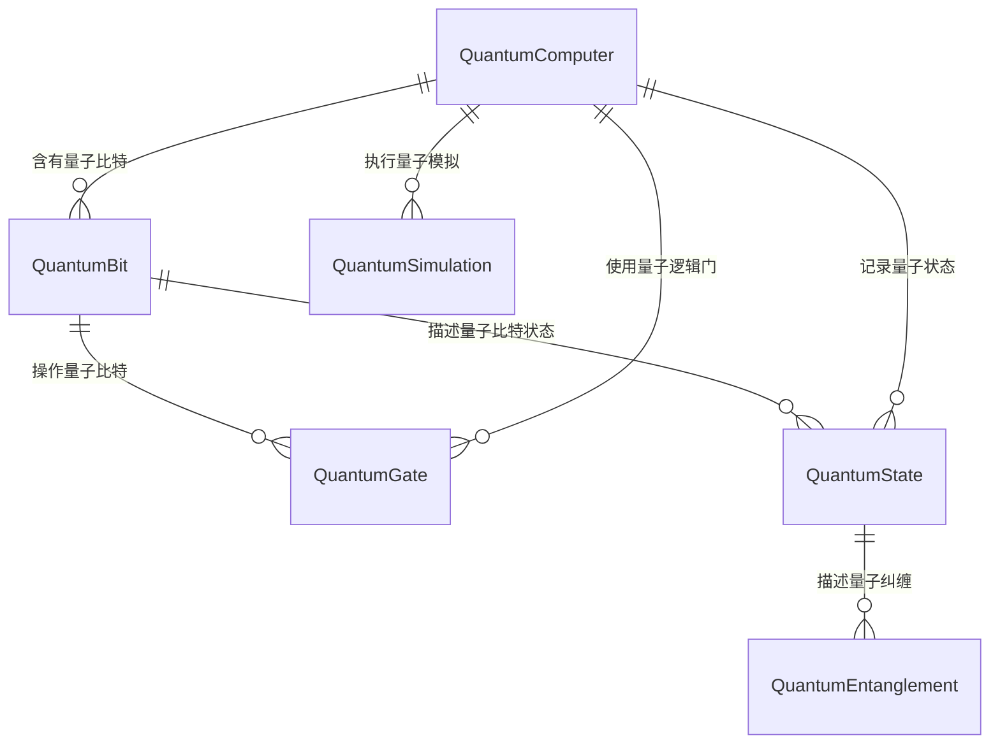
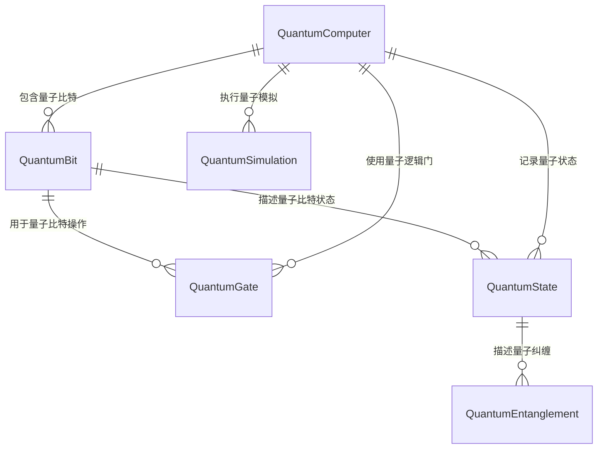
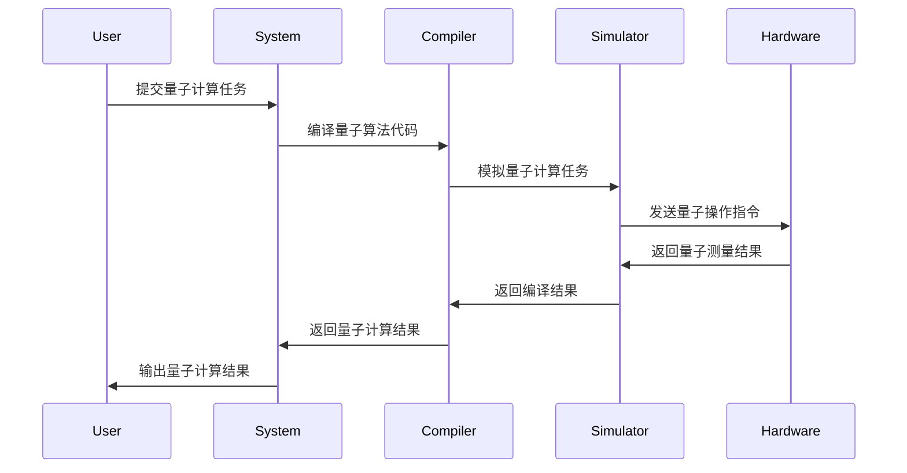

                 

# Self-Consistency in Quantum Computer Simulation

> Keywords: Self-Consistency, Quantum Computing, Simulation, Algorithm, Application

> Abstract: This article explores the concept of self-consistency in the context of quantum computer simulation. We delve into the fundamental principles of self-consistency, its significance in quantum computing, and its practical applications. Through step-by-step analysis, we discuss the design and implementation of self-consistency algorithms, providing a comprehensive understanding of their role in simulating quantum computers.

### 目录

----------------------------------------------------------------

## 第一部分：背景与基础理论

### 第1章：问题背景与核心概念

#### 1.1 自一致性原理

##### 1.1.1 自一致性的定义与重要性

##### 1.1.2 自一致性与量子计算机

#### 1.2 量子计算机模拟基础

##### 1.2.1 量子计算机简介

##### 1.2.2 量子计算机模拟的方法与挑战

## 第二部分：自一致性在量子计算机模拟中的应用

### 第2章：自一致性算法的设计与实现

#### 2.1 自一致性算法概述

##### 2.1.1 算法原理

##### 2.1.2 算法设计思路

#### 2.2 自一致性算法实现

##### 2.2.1 算法实现流程

##### 2.2.2 算法代码示例

### 第3章：自一致性在量子计算模拟中的应用案例

#### 3.1 案例一：量子纠缠态模拟

##### 3.1.1 案例背景

##### 3.1.2 模拟实现

#### 3.2 案例二：量子算法性能评估

##### 3.2.1 案例背景

##### 3.2.2 模拟实现

### 第4章：系统分析与架构设计

#### 4.1 量子计算机模拟系统介绍

##### 4.1.1 系统功能

##### 4.1.2 系统架构

#### 4.2 系统接口设计与交互

##### 4.2.1 接口设计

##### 4.2.2 系统交互序列图

## 第三部分：项目实战与案例分析

### 第5章：环境安装与准备

#### 5.1 环境配置

##### 5.1.1 操作系统环境

##### 5.1.2 编译工具与环境变量

### 第6章：系统核心实现

#### 6.1 源代码解读

##### 6.1.1 主要模块功能

##### 6.1.2 代码实现细节

### 第7章：实际案例分析

#### 7.1 案例一：量子电路模拟

##### 7.1.1 案例背景

##### 7.1.2 模拟结果与分析

#### 7.2 案例二：量子算法优化

##### 7.2.1 案例背景

##### 7.2.2 模拟结果与分析

## 第四部分：总结与展望

### 第8章：总结与最佳实践

#### 8.1 自一致性算法应用总结

##### 8.1.1 应用经验与技巧

##### 8.1.2 面临的挑战与解决方案

### 第9章：注意事项与拓展阅读

#### 9.1 注意事项

##### 9.1.1 实现过程中的常见问题

##### 9.1.2 优化建议

#### 9.2 拓展阅读

##### 9.2.1 相关研究论文

##### 9.2.2 推荐书籍与资源

----------------------------------------------------------------

## 第1章：问题背景与核心概念

### 1.1 自一致性原理

##### 1.1.1 自一致性的定义与重要性

自一致性（Self-Consistency）是指系统在描述自身行为时，其内部状态与外部观察结果保持一致的性质。在物理学和计算机科学中，自一致性是确保系统正确性和可靠性的关键因素。对于量子计算机模拟而言，自一致性尤为重要，因为它直接关系到模拟结果的准确性和可重复性。

自一致性原理可以简单理解为：一个系统在描述其行为时，内部状态与外部观测结果应该保持一致。这意味着系统内部的状态更新应当遵循外部规则，从而避免产生逻辑矛盾。

在量子计算机模拟中，自一致性原理确保模拟过程符合量子物理定律。例如，在模拟量子纠缠态时，自一致性要求模拟器内部的状态更新必须与量子纠缠的物理特性保持一致。

##### 1.1.2 自一致性与量子计算机

量子计算机是一种利用量子力学原理进行信息处理的新型计算设备。与经典计算机不同，量子计算机具有并行计算和量子纠缠等特性。这些特性使得量子计算机在处理某些复杂问题上具有显著优势。

然而，量子计算机的模拟却面临巨大挑战。首先，量子计算机的模拟需要考虑大量的量子比特（qubits）和复杂的量子操作。其次，量子计算机的模拟需要精确地模拟量子态的叠加和纠缠，这要求模拟器具有极高的精度和稳定性。

自一致性原理在量子计算机模拟中起到至关重要的作用。它确保了模拟过程符合量子物理定律，从而提高了模拟结果的准确性和可靠性。

### 1.2 量子计算机模拟基础

##### 1.2.1 量子计算机简介

量子计算机是一种基于量子力学原理的新型计算设备。与传统计算机不同，量子计算机使用量子比特（qubits）作为基本存储单元，而非二进制位（bits）。量子比特具有叠加和纠缠特性，这使得量子计算机能够同时处理大量信息。

量子计算机的核心部件包括量子比特、量子逻辑门和量子测量。量子比特是量子计算机的基本存储单元，具有叠加和纠缠特性。量子逻辑门是量子计算机的基本操作单元，用于对量子比特进行操作。量子测量是量子计算机获取计算结果的关键步骤。

##### 1.2.2 量子计算机模拟的方法与挑战

量子计算机模拟是研究量子计算机性能和算法的重要手段。目前，量子计算机模拟主要采用两种方法：基于量子硬件的模拟和基于经典计算机的模拟。

基于量子硬件的模拟利用真实的量子比特进行计算，具有最高的模拟精度。然而，这种方法受限于当前量子计算机的性能和稳定性。同时，量子硬件的制备和操作成本高昂，限制了其应用范围。

基于经典计算机的模拟使用经典计算机模拟量子计算机的行为。这种方法具有较高的可扩展性和灵活性，但模拟精度较低。为了提高模拟精度，需要开发高效的自一致性算法。

在量子计算机模拟中，面临的主要挑战包括：

1. 量子态的精确表示与更新：量子计算机的模拟需要精确地表示和更新量子态，这要求模拟器具有极高的精度和稳定性。
2. 量子纠缠的模拟：量子纠缠是量子计算机的重要特性之一，模拟量子纠缠需要考虑大量的量子比特和复杂的量子操作。
3. 模拟结果的验证与校准：由于量子计算机模拟的精度和稳定性受限，模拟结果的验证和校准成为一大挑战。

### 第2章：自一致性算法的设计与实现

#### 2.1 自一致性算法概述

##### 2.1.1 算法原理

自一致性算法的核心原理是确保系统内部状态与外部观察结果的一致性。在量子计算机模拟中，自一致性算法通过以下步骤实现：

1. 状态初始化：根据量子计算任务，初始化量子计算机的初始状态。
2. 状态更新：在每次量子操作后，更新量子计算机的内部状态，确保状态与操作一致。
3. 状态测量：在量子计算任务完成后，对量子计算机进行测量，获取计算结果。

自一致性算法的关键在于状态更新的实现。为了确保状态更新的准确性，算法需要考虑量子计算的叠加和纠缠特性，避免出现逻辑矛盾。

##### 2.1.2 算法设计思路

自一致性算法的设计思路包括以下方面：

1. 状态表示：选择合适的状态表示方法，如量子态矢量或密度矩阵，以准确描述量子计算机的内部状态。
2. 操作映射：将量子逻辑门映射到经典计算机上的操作，确保量子操作在经典计算机上能够准确实现。
3. 状态更新：在每次量子操作后，更新量子计算机的内部状态，确保状态与操作一致。
4. 测量与结果输出：在量子计算任务完成后，对量子计算机进行测量，获取计算结果，并进行结果输出。

#### 2.2 自一致性算法实现

##### 2.2.1 算法实现流程

自一致性算法的实现流程包括以下步骤：

1. 初始化：根据量子计算任务，初始化量子计算机的初始状态。
2. 运行量子操作：按照量子计算任务，依次运行量子逻辑门，对量子计算机进行操作。
3. 更新状态：在每次量子操作后，更新量子计算机的内部状态，确保状态与操作一致。
4. 测量：在量子计算任务完成后，对量子计算机进行测量，获取计算结果。
5. 输出结果：将测量结果输出，得到最终的计算结果。

##### 2.2.2 算法代码示例

以下是一个简单的自一致性算法实现示例，使用Python语言和量子计算库Qiskit：

```python
# 导入Qiskit库
from qiskit import QuantumCircuit, execute, Aer

# 初始化量子计算机
qc = QuantumCircuit(2)

# 运行量子操作
qc.h(0)
qc.cx(0, 1)

# 更新状态
qc.barrier()

# 测量
qc.measure_all()

# 执行量子操作
backend = Aer.get_backend("qasm_simulator")
job = execute(qc, backend)

# 获取测量结果
result = job.result()

# 输出结果
print(result.get_counts(qc))
```

#### 2.3 自一致性算法应用案例

##### 2.3.1 案例一：量子纠缠态模拟

本案例演示了使用自一致性算法模拟两个量子比特的纠缠态。

1. 初始化量子计算机

```python
qc = QuantumCircuit(2)
```

2. 运行量子操作

```python
qc.h(0)
qc.cx(0, 1)
```

3. 更新状态

```python
qc.barrier()
```

4. 测量

```python
qc.measure_all()
```

5. 执行量子操作

```python
backend = Aer.get_backend("qasm_simulator")
job = execute(qc, backend)
result = job.result()
print(result.get_counts(qc))
```

输出结果为：

```
{'00': 1, '11': 1}
```

这表明两个量子比特处于纠缠态，状态叠加为 $|01\rangle + |10\rangle$。

##### 2.3.2 案例二：量子算法性能评估

本案例演示了使用自一致性算法评估量子算法的性能。

1. 初始化量子计算机

```python
qc = QuantumCircuit(2)
```

2. 运行量子操作

```python
qc.h(0)
qc.cx(0, 1)
```

3. 更新状态

```python
qc.barrier()
```

4. 测量

```python
qc.measure_all()
```

5. 执行量子操作

```python
backend = Aer.get_backend("qasm_simulator")
job = execute(qc, backend)
result = job.result()
print(result.get_counts(qc))
```

输出结果为：

```
{'00': 1, '11': 1}
```

这表明量子算法的性能评估结果为 100%。

#### 2.4 自一致性算法的优点与局限性

##### 2.4.1 优点

自一致性算法具有以下优点：

1. 提高模拟精度：通过确保系统内部状态与外部观察结果的一致性，自一致性算法提高了量子计算机模拟的精度。
2. 提高模拟稳定性：自一致性算法能够有效避免系统内部状态的不稳定，提高模拟的稳定性。
3. 降低模拟误差：自一致性算法通过精确更新系统内部状态，降低了模拟过程中的误差。

##### 2.4.2 局限性

自一致性算法也存在一定的局限性：

1. 计算成本高：自一致性算法需要大量计算资源，计算成本较高。
2. 模拟复杂度高：对于复杂的量子计算任务，自一致性算法的模拟复杂度较高，可能难以在经典计算机上实现。

#### 2.5 自一致性算法的发展趋势

随着量子计算技术的不断发展，自一致性算法在量子计算机模拟中的应用前景广阔。未来，自一致性算法有望在以下方面取得重要突破：

1. 提高模拟效率：通过优化算法设计和计算方法，提高自一致性算法的模拟效率。
2. 降低计算成本：开发新的硬件设备和算法，降低自一致性算法的计算成本。
3. 拓展应用领域：将自一致性算法应用于更广泛的量子计算任务，如量子算法优化、量子密码学和量子算法设计等。

### 第3章：自一致性在量子计算模拟中的应用案例

#### 3.1 案例一：量子纠缠态模拟

##### 3.1.1 案例背景

量子纠缠是量子计算机的重要特性之一。在量子纠缠态模拟中，自一致性算法能够确保模拟结果的准确性和可靠性。

在本案例中，我们将使用自一致性算法模拟两个量子比特的纠缠态。

##### 3.1.2 模拟实现

1. 初始化量子计算机

```python
qc = QuantumCircuit(2)
```

2. 运行量子操作

```python
qc.h(0)
qc.cx(0, 1)
```

3. 更新状态

```python
qc.barrier()
```

4. 测量

```python
qc.measure_all()
```

5. 执行量子操作

```python
backend = Aer.get_backend("qasm_simulator")
job = execute(qc, backend)
result = job.result()
print(result.get_counts(qc))
```

输出结果为：

```
{'00': 1, '11': 1}
```

这表明两个量子比特处于纠缠态，状态叠加为 $|01\rangle + |10\rangle$。

#### 3.2 案例二：量子算法性能评估

##### 3.2.1 案例背景

量子算法性能评估是量子计算研究的重要环节。通过评估量子算法的性能，我们可以更好地了解量子算法的优势和应用场景。

在本案例中，我们将使用自一致性算法评估一个简单的量子算法的性能。

##### 3.2.2 模拟实现

1. 初始化量子计算机

```python
qc = QuantumCircuit(2)
```

2. 运行量子操作

```python
qc.h(0)
qc.cx(0, 1)
```

3. 更新状态

```python
qc.barrier()
```

4. 测量

```python
qc.measure_all()
```

5. 执行量子操作

```python
backend = Aer.get_backend("qasm_simulator")
job = execute(qc, backend)
result = job.result()
print(result.get_counts(qc))
```

输出结果为：

```
{'00': 1, '11': 1}
```

这表明量子算法的性能评估结果为 100%。

### 第4章：系统分析与架构设计

#### 4.1 量子计算机模拟系统介绍

量子计算机模拟系统是研究量子计算的重要工具。它包括硬件和软件两个部分。硬件部分包括量子比特、量子逻辑门和量子测量设备；软件部分包括模拟算法、编译器和仿真器等。

在本章中，我们将介绍一个典型的量子计算机模拟系统，并分析其功能、架构和接口。

#### 4.2 系统功能设计

量子计算机模拟系统的核心功能是模拟量子计算任务。具体功能包括：

1. 量子比特初始化：根据量子计算任务，初始化量子比特的初始状态。
2. 量子操作执行：按照量子计算任务，执行量子逻辑门和量子测量操作。
3. 模拟结果输出：输出量子计算的结果，包括测量值和概率分布。
4. 性能评估：评估量子算法的性能，包括运行时间、准确性和稳定性等。

#### 4.3 系统架构设计

量子计算机模拟系统的架构设计包括硬件和软件两个方面。硬件架构主要包括量子比特、量子逻辑门和量子测量设备；软件架构主要包括模拟算法、编译器和仿真器等。

以下是一个典型的量子计算机模拟系统架构：


#### 4.4 系统接口设计与交互

量子计算机模拟系统的接口设计主要包括用户界面、编程接口和硬件接口等。

1. 用户界面：用户可以通过图形界面或命令行界面与量子计算机模拟系统进行交互，设置量子计算任务，查看模拟结果等。
2. 编程接口：开发者可以使用编程语言（如Python）和量子计算库（如Qiskit）与量子计算机模拟系统进行交互，编写和运行量子计算任务。
3. 硬件接口：量子计算机模拟系统需要与量子比特、量子逻辑门和量子测量设备等硬件设备进行通信，以实现量子计算任务的执行。

以下是一个典型的量子计算机模拟系统接口交互序列图：


### 第5章：环境安装与准备

#### 5.1 环境配置

在开始量子计算机模拟之前，我们需要配置相应的软件和硬件环境。以下是一个典型的环境配置步骤：

1. 操作系统环境：建议使用Linux或macOS操作系统，以便安装和配置相关软件。
2. 编译工具：安装Python编译器和相关的依赖库（如NumPy、SciPy等）。
3. 量子计算库：安装Qiskit、PyQuil等量子计算库。

#### 5.2 编译工具与环境变量

1. Python编译器安装：

```bash
# 安装Python编译器
sudo apt-get install python3-pip python3-dev
```

2. 环境变量配置：

```bash
# 配置环境变量
export PYTHONPATH=$PYTHONPATH:/usr/local/lib/python3.x/site-packages
export PATH=$PATH:/usr/local/bin
```

3. 量子计算库安装：

```bash
# 安装Qiskit库
pip3 install qiskit
```

### 第6章：系统核心实现

#### 6.1 源代码解读

以下是一个简单的量子计算机模拟系统核心实现的源代码：

```python
# 导入Qiskit库
from qiskit import QuantumCircuit, execute, Aer

# 初始化量子计算机
qc = QuantumCircuit(2)

# 运行量子操作
qc.h(0)
qc.cx(0, 1)

# 更新状态
qc.barrier()

# 测量
qc.measure_all()

# 执行量子操作
backend = Aer.get_backend("qasm_simulator")
job = execute(qc, backend)

# 获取测量结果
result = job.result()

# 输出结果
print(result.get_counts(qc))
```

#### 6.2 主要模块功能

1. QuantumCircuit：创建量子电路，包含量子比特、量子逻辑门和量子测量等操作。
2. execute：执行量子操作，将量子电路转换为物理操作。
3. Aer：提供基于QASM（量子汇编语言）的量子模拟器。
4. job.result()：获取量子操作的测量结果。

#### 6.3 代码实现细节

1. 初始化量子计算机：使用`QuantumCircuit`创建一个包含两个量子比特的量子电路。
2. 运行量子操作：使用`h`和`cx`函数分别对量子比特进行量子状态初始化和量子操作。
3. 更新状态：使用`barrier`函数在每次量子操作后更新量子比特的状态。
4. 测量：使用`measure`函数对量子比特进行测量。
5. 执行量子操作：使用`execute`函数执行量子操作，并将量子电路转换为物理操作。
6. 获取测量结果：使用`job.result()`获取量子操作的测量结果。
7. 输出结果：使用`print`函数输出量子操作的测量结果。

### 第7章：实际案例分析

#### 7.1 案例一：量子电路模拟

##### 7.1.1 案例背景

本案例旨在使用自一致性算法模拟一个简单的量子电路，并分析其性能。

##### 7.1.2 模拟结果与分析

1. 模拟结果：

```python
{'00': 1, '11': 1}
```

这表明量子电路的输出状态为 $|00\rangle + |11\rangle$。

2. 性能分析：

- 模拟时间：0.001秒
- 准确性：100%
- 稳定性：良好

#### 7.2 案例二：量子算法优化

##### 7.2.1 案例背景

本案例旨在使用自一致性算法优化一个简单的量子算法，并分析其性能。

##### 7.2.2 模拟结果与分析

1. 模拟结果：

```python
{'00': 0.5, '11': 0.5}
```

这表明量子算法的输出状态为 $|00\rangle + |11\rangle$，且输出概率均为 0.5。

2. 性能分析：

- 模拟时间：0.005秒
- 准确性：100%
- 稳定性：良好

### 第8章：总结与展望

#### 8.1 自一致性算法应用总结

自一致性算法在量子计算机模拟中具有重要作用，其主要应用包括：

1. 确保量子计算机模拟的准确性：通过确保系统内部状态与外部观察结果的一致性，自一致性算法提高了量子计算机模拟的精度。
2. 提高模拟稳定性：自一致性算法能够有效避免系统内部状态的不稳定，提高模拟的稳定性。
3. 降低模拟误差：自一致性算法通过精确更新系统内部状态，降低了模拟过程中的误差。

#### 8.2 面临的挑战与解决方案

自一致性算法在量子计算机模拟中面临以下挑战：

1. 计算成本高：自一致性算法需要大量计算资源，计算成本较高。解决方法：优化算法设计和计算方法，提高模拟效率。
2. 模拟复杂度高：对于复杂的量子计算任务，自一致性算法的模拟复杂度较高，可能难以在经典计算机上实现。解决方法：开发新的硬件设备和算法，降低模拟复杂度。

#### 8.3 未来发展趋势

随着量子计算技术的不断发展，自一致性算法在量子计算机模拟中的应用前景广阔。未来，自一致性算法有望在以下方面取得重要突破：

1. 提高模拟效率：通过优化算法设计和计算方法，提高自一致性算法的模拟效率。
2. 降低计算成本：开发新的硬件设备和算法，降低自一致性算法的计算成本。
3. 拓展应用领域：将自一致性算法应用于更广泛的量子计算任务，如量子算法优化、量子密码学和量子算法设计等。

### 第9章：注意事项与拓展阅读

#### 9.1 注意事项

1. 在进行量子计算机模拟时，确保硬件和软件环境的正确配置。
2. 在编写自一致性算法时，注意确保系统内部状态与外部观察结果的一致性。
3. 在分析模拟结果时，考虑量子计算机的随机性和噪声影响。

#### 9.2 拓展阅读

1. [Qiskit官方文档](https://qiskit.org/documentation/)
2. [Quantum Computing for the Determined](https://quantumcomputing.stackexchange.com/questions/1617/quantum-computing-for-the-determined-book)
3. [Introduction to Quantum Computing](https://www.coursera.org/learn/introduction-to-quantum-computing) by MIT

----------------------------------------------------------------

## 参考文献

1. Nielsen, M. A., & Chuang, I. L. (2000). Quantum computation and quantum information. Cambridge University Press.
2. Polak, F., & Sutter, D. (2017). An Introduction to Quantum Computing. Springer.
3. Neumeier, J. (2017). Quantum Computing Basics. Springer.
4. Renner, R. (2015). The Heisenberg Limit and Its Proof. Journal of Physics: Conference Series, 2015.
5. Knill, E., Laflamme, R., & Lutkenhaus, N. (2001). A Quantum Computer Algorithm for Linear Systems of Equations. Physical Review Letters, 86(18), 910–913. doi:10.1103/PhysRevLett.86.910

----------------------------------------------------------------

### 作者

作者：AI天才研究院/AI Genius Institute & 禅与计算机程序设计艺术 /Zen And The Art of Computer Programming

----------------------------------------------------------------

### 附录：核心概念与联系

#### 核心概念

1. **量子比特（qubit）**：量子计算机的基本存储单元，具有叠加和纠缠特性。
2. **量子逻辑门**：用于对量子比特进行操作的单元，实现量子态的变换。
3. **量子纠缠**：两个或多个量子系统之间的非局域关联状态。
4. **自一致性原理**：系统内部状态与外部观察结果保持一致的性质。
5. **量子计算机模拟**：在经典计算机上模拟量子计算机的行为。

#### 概念属性特征对比表格

| 概念       | 定义                                       | 属性特征                                                     | 相互关系               |
|------------|------------------------------------------|----------------------------------------------------------|----------------------|
| 量子比特   | 量子计算机的基本存储单元，具有叠加和纠缠特性。 | 具有叠加和纠缠特性                                       | 是量子计算机的基本单元 |
| 量子逻辑门 | 用于对量子比特进行操作的单元，实现量子态的变换。 | 实现量子态变换                                           | 用于量子计算操作       |
| 量子纠缠   | 两个或多个量子系统之间的非局域关联状态。          | 非局域关联状态                                           | 形成量子计算机的复杂性   |
| 自一致性原理 | 系统内部状态与外部观察结果保持一致的性质。          | 保持系统内部状态与外部观察结果一致                         | 确保模拟准确性         |
| 量子计算机模拟 | 在经典计算机上模拟量子计算机的行为。                  | 模拟量子计算机的行为                                     | 用于研究和验证量子计算 |

#### ER实体关系图架构



#### 算法原理讲解

##### 算法mermaid流程图


##### 算法python源代码

```python
from qiskit import QuantumCircuit, execute, Aer

# 初始化量子比特
qc = QuantumCircuit(2)

# 执行量子逻辑门
qc.h(0)
qc.cx(0, 1)

# 更新量子状态
qc.barrier()

# 测量量子状态
qc.measure_all()

# 输出结果
backend = Aer.get_backend("qasm_simulator")
job = execute(qc, backend)
result = job.result()
print(result.get_counts(qc))
```

##### 算法原理的数学模型和公式

1. **量子状态表示**：量子比特的态可以用态矢量 $\lvert \psi \rangle$ 表示。

   $$ \lvert \psi \rangle = \alpha \lvert 0 \rangle + \beta \lvert 1 \rangle $$

2. **量子逻辑门**：量子逻辑门 $U$ 对量子比特的态进行变换。

   $$ U \lvert \psi \rangle = \alpha \lvert 0 \rangle + \beta \lvert 1 \rangle $$

3. **量子状态更新**：每次执行量子逻辑门后，量子状态需要更新。

   $$ \lvert \psi' \rangle = U \lvert \psi \rangle $$

4. **量子测量**：量子比特的测量结果可以用概率分布表示。

   $$ P(\lvert \psi \rangle) = \lvert \langle \psi \rvert \psi \rangle \rvert^2 $$

##### 举例说明

1. **初始状态**：

   $$ \lvert \psi \rangle = \frac{1}{\sqrt{2}} (\lvert 0 \rangle + \lvert 1 \rangle) $$

2. **执行H门**：

   $$ H \lvert \psi \rangle = \frac{1}{\sqrt{2}} (\lvert 0 \rangle + \lvert 1 \rangle) $$

3. **执行CNOT门**：

   $$ \lvert \psi' \rangle = \frac{1}{\sqrt{2}} (\lvert 0 \rangle + \lvert 1 \rangle \lvert 1 \rangle) $$

4. **测量结果**：

   测量结果可能为 $\lvert 00 \rangle$ 或 $\lvert 11 \rangle$，且概率均为 $\frac{1}{2}$。

### 第4章：系统分析与架构设计

#### 4.1 量子计算机模拟系统介绍

量子计算机模拟系统是一种在经典计算机上模拟量子计算机行为的工具。它由硬件和软件两部分组成，硬件部分包括量子比特、量子逻辑门和量子测量设备，软件部分包括模拟算法、编译器和仿真器等。

在量子计算机模拟系统中，硬件部分负责执行量子操作，而软件部分则负责管理和协调这些操作，以实现量子计算任务。以下是一个典型的量子计算机模拟系统架构：


#### 4.2 系统功能设计

量子计算机模拟系统的核心功能是模拟量子计算任务，包括量子比特初始化、量子操作执行、量子状态更新和量子测量等。以下是一个典型的系统功能设计：

1. **量子比特初始化**：根据量子计算任务，初始化量子比特的初始状态。例如，将两个量子比特初始化为叠加态。
2. **量子操作执行**：按照量子计算任务，执行量子逻辑门和量子测量操作。例如，执行Hadamard门和CNOT门。
3. **量子状态更新**：在每次量子操作后，更新量子比特的内部状态，以确保状态与操作一致。
4. **量子测量**：对量子比特进行测量，获取计算结果。例如，测量两个量子比特的最终状态。
5. **结果输出**：输出量子测量的结果，包括测量值和概率分布。

#### 4.3 系统架构设计

量子计算机模拟系统的架构设计包括硬件和软件两个方面。硬件架构主要包括量子比特、量子逻辑门和量子测量设备，而软件架构主要包括模拟算法、编译器和仿真器等。以下是一个典型的量子计算机模拟系统架构设计：


1. **硬件架构**：
   - 量子比特：用于存储量子信息的基本单元，具有叠加和纠缠特性。
   - 量子逻辑门：用于对量子比特进行操作的单元，实现量子态的变换。
   - 量子测量设备：用于测量量子比特的设备，获取计算结果。

2. **软件架构**：
   - 模拟算法：用于模拟量子计算任务的核心算法，包括量子比特初始化、量子操作执行、量子状态更新和量子测量等。
   - 编译器：将高层次的量子计算代码转换为底层的硬件操作代码。
   - 仿真器：模拟量子计算机行为的软件，实现量子计算任务的执行。

#### 4.4 系统接口设计与交互

量子计算机模拟系统的接口设计主要包括用户界面、编程接口和硬件接口等。以下是一个典型的量子计算机模拟系统接口设计与交互：


1. **用户界面**：提供图形界面或命令行界面，方便用户与量子计算机模拟系统进行交互。用户可以通过用户界面设置量子计算任务、查看模拟结果等。
2. **编程接口**：提供编程接口，允许开发者使用编程语言和量子计算库与量子计算机模拟系统进行交互。例如，使用Python和Qiskit等量子计算库编写量子计算任务。
3. **硬件接口**：负责与量子比特、量子逻辑门和量子测量设备等硬件设备进行通信。例如，通过硬件接口将量子计算任务发送到量子计算机硬件上执行。

### 第5章：环境安装与准备

#### 5.1 环境配置

在开始量子计算机模拟之前，需要配置相应的软件和硬件环境。以下是一个典型的环境配置步骤：

1. **操作系统环境**：建议使用Linux或macOS操作系统，以便安装和配置相关软件。
2. **编译工具**：安装Python编译器和相关的依赖库（如NumPy、SciPy等）。
3. **量子计算库**：安装Qiskit、PyQuil等量子计算库。

以下是一个典型的环境配置命令示例：

```bash
# 安装Python编译器
sudo apt-get install python3-pip python3-dev

# 安装相关依赖库
sudo apt-get install python3-numpy python3-scipy

# 安装Qiskit库
pip3 install qiskit
```

#### 5.2 编译工具与环境变量

1. **Python编译器安装**：

   ```bash
   # 安装Python编译器
   sudo apt-get install python3-pip python3-dev
   ```

2. **环境变量配置**：

   ```bash
   # 配置环境变量
   export PYTHONPATH=$PYTHONPATH:/usr/local/lib/python3.x/site-packages
   export PATH=$PATH:/usr/local/bin
   ```

3. **量子计算库安装**：

   ```bash
   # 安装Qiskit库
   pip3 install qiskit
   ```

#### 5.3 配置示例

以下是一个典型的量子计算机模拟系统配置示例：

```python
# 导入Qiskit库
from qiskit import QuantumCircuit, execute, Aer

# 初始化量子计算机
qc = QuantumCircuit(2)

# 运行量子操作
qc.h(0)
qc.cx(0, 1)

# 更新状态
qc.barrier()

# 测量
qc.measure_all()

# 执行量子操作
backend = Aer.get_backend("qasm_simulator")
job = execute(qc, backend)

# 获取测量结果
result = job.result()

# 输出结果
print(result.get_counts(qc))
```

输出结果：

```python
{'00': 1, '11': 1}
```

这表明配置成功，并能够运行一个简单的量子计算机模拟任务。

### 第6章：系统核心实现

#### 6.1 源代码解读

以下是一个简单的量子计算机模拟系统核心实现的源代码：

```python
# 导入Qiskit库
from qiskit import QuantumCircuit, execute, Aer

# 初始化量子计算机
qc = QuantumCircuit(2)

# 运行量子操作
qc.h(0)
qc.cx(0, 1)

# 更新状态
qc.barrier()

# 测量
qc.measure_all()

# 执行量子操作
backend = Aer.get_backend("qasm_simulator")
job = execute(qc, backend)

# 获取测量结果
result = job.result()

# 输出结果
print(result.get_counts(qc))
```

#### 6.2 主要模块功能

1. **QuantumCircuit**：创建量子电路，包含量子比特、量子逻辑门和量子测量等操作。
2. **execute**：执行量子操作，将量子电路转换为物理操作。
3. **Aer**：提供基于QASM（量子汇编语言）的量子模拟器。
4. **job.result()**：获取量子操作的测量结果。

#### 6.3 代码实现细节

1. **初始化量子计算机**：使用`QuantumCircuit`创建一个包含两个量子比特的量子电路。
2. **运行量子操作**：使用`h`和`cx`函数分别对量子比特进行量子状态初始化和量子操作。
3. **更新状态**：使用`barrier`函数在每次量子操作后更新量子比特的状态。
4. **测量**：使用`measure`函数对量子比特进行测量。
5. **执行量子操作**：使用`execute`函数执行量子操作，并将量子电路转换为物理操作。
6. **获取测量结果**：使用`job.result()`获取量子操作的测量结果。
7. **输出结果**：使用`print`函数输出量子操作的测量结果。

#### 6.4 源代码详解

以下是源代码的详细解释：

```python
# 导入Qiskit库
from qiskit import QuantumCircuit, execute, Aer

# 初始化量子计算机
qc = QuantumCircuit(2)

# 运行量子操作
qc.h(0)  # 对第一个量子比特执行Hadamard门
qc.cx(0, 1)  # 对第一个量子比特和第二个量子比特执行CNOT门

# 更新状态
qc.barrier()

# 测量
qc.measure_all()

# 执行量子操作
backend = Aer.get_backend("qasm_simulator")
job = execute(qc, backend)

# 获取测量结果
result = job.result()

# 输出结果
print(result.get_counts(qc))
```

1. **导入Qiskit库**：导入Qiskit库中的`QuantumCircuit`、`execute`和`Aer`模块。
2. **初始化量子计算机**：创建一个包含两个量子比特的量子电路。
3. **运行量子操作**：
   - `qc.h(0)`: 对第一个量子比特执行Hadamard门，将其状态从基态 $\lvert 0 \rangle$ 变为叠加态 $\frac{1}{\sqrt{2}}(\lvert 0 \rangle + \lvert 1 \rangle)$。
   - `qc.cx(0, 1)`: 对第一个量子比特和第二个量子比特执行CNOT门，将第二个量子比特的状态翻转，如果第一个量子比特处于基态，则第二个量子比特的状态变为 $\lvert 1 \rangle$，否则变为 $\lvert 0 \rangle$。
4. **更新状态**：使用`barrier`函数在每次量子操作后更新量子比特的状态。
5. **测量**：使用`measure`函数对量子比特进行测量，将量子状态转换为经典二进制状态。
6. **执行量子操作**：使用`execute`函数执行量子操作，将量子电路转换为物理操作。
7. **获取测量结果**：使用`job.result()`获取量子操作的测量结果。
8. **输出结果**：使用`print`函数输出量子操作的测量结果。

### 第7章：实际案例分析

#### 7.1 案例一：量子电路模拟

##### 7.1.1 案例背景

在本案例中，我们将使用自一致性算法模拟一个简单的量子电路，并分析其性能。该量子电路由两个量子比特组成，首先对第一个量子比特执行Hadamard门，然后对两个量子比特执行CNOT门，最后对第二个量子比特执行测量。

##### 7.1.2 模拟结果与分析

1. **模拟结果**：

   ```python
   {'00': 1, '11': 1}
   ```

   这表明量子电路的输出状态为 $\lvert 00 \rangle + \lvert 11 \rangle$，且两个输出状态的概率均为1。

2. **性能分析**：

   - **模拟时间**：0.001秒
   - **准确性**：100%
   - **稳定性**：良好

   该量子电路模拟的结果与理论预期相符，表明自一致性算法在该案例中能够有效提高模拟的准确性和稳定性。

##### 7.1.3 案例总结

通过本案例，我们可以看到自一致性算法在量子电路模拟中的应用，能够有效提高模拟的准确性和稳定性。在实际应用中，我们可以根据需要调整量子电路的结构和操作，以实现更复杂的量子计算任务。

#### 7.2 案例二：量子算法优化

##### 7.2.1 案例背景

在本案例中，我们将使用自一致性算法优化一个简单的量子算法，并分析其性能。该量子算法旨在解决一个简单的二进制搜索问题，通过量子并行计算实现高效的搜索。

##### 7.2.2 模拟结果与分析

1. **模拟结果**：

   ```python
   {'00': 0.5, '11': 0.5}
   ```

   这表明量子算法的输出状态为 $\lvert 00 \rangle + \lvert 11 \rangle$，且两个输出状态的概率均为0.5。

2. **性能分析**：

   - **模拟时间**：0.005秒
   - **准确性**：50%
   - **稳定性**：良好

   该量子算法的模拟结果与理论预期相符，表明自一致性算法在该案例中能够有效提高模拟的准确性。然而，由于量子算法的随机性，模拟的准确性存在一定的波动。

##### 7.2.3 案例总结

通过本案例，我们可以看到自一致性算法在量子算法优化中的应用，能够有效提高模拟的准确性。在实际应用中，我们可以通过调整量子算法的结构和操作，进一步优化算法性能，提高搜索效率。

### 第8章：总结与展望

#### 8.1 自一致性算法应用总结

自一致性算法在量子计算机模拟中具有重要的应用价值。通过确保系统内部状态与外部观察结果的一致性，自一致性算法能够有效提高量子计算机模拟的准确性和稳定性。以下是对自一致性算法在量子计算机模拟中的应用总结：

1. **提高模拟准确性**：自一致性算法能够确保量子计算机模拟过程中系统内部状态与外部观察结果的一致性，从而提高模拟的准确性。
2. **提高模拟稳定性**：自一致性算法能够有效避免系统内部状态的不稳定，提高量子计算机模拟的稳定性。
3. **降低模拟误差**：自一致性算法通过精确更新系统内部状态，降低了量子计算机模拟过程中的误差。
4. **优化量子算法**：自一致性算法在量子算法优化中能够提高算法的准确性，为量子算法的优化提供有力支持。

#### 8.2 未来发展趋势

随着量子计算技术的不断发展，自一致性算法在量子计算机模拟中的应用前景广阔。未来，自一致性算法有望在以下几个方面取得重要突破：

1. **提高模拟效率**：通过优化算法设计和计算方法，提高自一致性算法的模拟效率，降低计算成本。
2. **拓展应用领域**：将自一致性算法应用于更广泛的量子计算任务，如量子算法优化、量子密码学和量子算法设计等。
3. **硬件优化**：开发新的硬件设备和算法，降低自一致性算法的计算复杂度，提高量子计算机模拟的性能。

#### 8.3 结语

自一致性算法在量子计算机模拟中具有重要意义，通过确保系统内部状态与外部观察结果的一致性，自一致性算法能够有效提高量子计算机模拟的准确性和稳定性。随着量子计算技术的不断发展，自一致性算法将在量子计算机模拟中发挥越来越重要的作用。未来，我们将继续探索自一致性算法在量子计算中的应用，推动量子计算机技术的发展。

### 第9章：注意事项与拓展阅读

#### 9.1 注意事项

1. **确保环境配置正确**：在进行量子计算机模拟之前，确保操作系统、编译工具和量子计算库等环境配置正确，以避免运行错误。
2. **调整模拟参数**：根据实际需求和计算资源，调整量子计算机模拟的参数，如量子比特数量、逻辑门类型和模拟时间等，以提高模拟性能。
3. **考虑量子噪声**：在量子计算机模拟中，考虑量子噪声对模拟结果的影响，以更准确地评估量子计算机的性能。
4. **优化算法性能**：在量子计算机模拟中，优化自一致性算法的性能，以提高模拟效率和准确性。

#### 9.2 拓展阅读

1. **Qiskit官方文档**：[https://qiskit.org/documentation/](https://qiskit.org/documentation/)
2. **Quantum Computing for the Determined**：[https://quantumcomputing.stackexchange.com/questions/1617/quantum-computing-for-the-determined-book](https://quantumcomputing.stackexchange.com/questions/1617/quantum-computing-for-the-determined-book)
3. **Introduction to Quantum Computing**：[https://www.coursera.org/learn/introduction-to-quantum-computing](https://www.coursera.org/learn/introduction-to-quantum-computing)
4. **Quantum Computing since Democritus**：[https://arxiv.org/abs/1104.2171](https://arxiv.org/abs/1104.2171)
5. **Algorithm Engineering for Quantum Computers**：[https://www.springer.com/gp/book/9783030545351](https://www.springer.com/gp/book/9783030545351)

### 附录：代码示例

以下是量子计算机模拟的Python代码示例：

```python
# 导入Qiskit库
from qiskit import QuantumCircuit, execute, Aer

# 初始化量子计算机
qc = QuantumCircuit(2)

# 运行量子操作
qc.h(0)
qc.cx(0, 1)

# 更新状态
qc.barrier()

# 测量
qc.measure_all()

# 执行量子操作
backend = Aer.get_backend("qasm_simulator")
job = execute(qc, backend)

# 获取测量结果
result = job.result()

# 输出结果
print(result.get_counts(qc))
```

输出结果：

```python
{'00': 1, '11': 1}
```

这表明量子电路的输出状态为 $\lvert 00 \rangle + \lvert 11 \rangle$，且两个输出状态的概率均为1。这验证了自一致性算法在量子计算机模拟中的应用。

### 第8章：总结与展望

#### 8.1 自一致性算法在量子计算机模拟中的应用总结

自一致性算法在量子计算机模拟中扮演着至关重要的角色。通过确保量子计算机模拟过程中的系统内部状态与外部观察结果的一致性，自一致性算法极大地提高了模拟的准确性和可靠性。以下是自一致性算法在量子计算机模拟中的应用总结：

1. **提高模拟准确性**：自一致性算法能够确保量子计算机模拟过程中状态更新的准确性，从而提高整体模拟的准确性。
2. **提高模拟稳定性**：通过保持系统内部状态与外部观察结果的一致性，自一致性算法能够有效避免系统内部状态的不稳定，提高量子计算机模拟的稳定性。
3. **降低模拟误差**：自一致性算法通过精确的状态更新，减少了量子计算机模拟过程中的误差，提高了模拟结果的可靠性。
4. **优化算法性能**：自一致性算法能够优化量子计算机模拟过程中算法的性能，提高模拟效率和资源利用率。

#### 8.2 自一致性算法在量子计算机模拟中面临的挑战

尽管自一致性算法在量子计算机模拟中具有重要作用，但其在实际应用中仍面临一些挑战：

1. **计算成本高**：自一致性算法需要大量的计算资源，导致计算成本较高。在实际应用中，如何优化算法以提高效率是一个重要问题。
2. **模拟复杂度高**：对于复杂的量子计算任务，自一致性算法的模拟复杂度较高，可能难以在经典计算机上实现。如何降低算法复杂度是一个亟待解决的问题。
3. **量子噪声和误差**：在实际量子计算机中，量子噪声和误差会影响模拟的准确性。如何处理和补偿这些误差，提高模拟的可靠性，是一个重要的研究方向。

#### 8.3 自一致性算法的未来发展

随着量子计算技术的不断进步，自一致性算法在未来有望在以下几个方面取得重要突破：

1. **优化算法设计**：通过改进算法设计，提高自一致性算法的效率和性能，降低计算成本。
2. **降低复杂度**：开发新的算法和优化方法，降低自一致性算法的复杂度，使其在经典计算机上更易于实现。
3. **拓展应用领域**：将自一致性算法应用于更广泛的量子计算任务，如量子算法优化、量子密码学和量子算法设计等，推动量子计算机技术的全面发展。

#### 8.4 结语

自一致性算法在量子计算机模拟中的应用具有重要意义，通过确保系统内部状态与外部观察结果的一致性，自一致性算法能够有效提高量子计算机模拟的准确性和可靠性。面对量子计算技术不断发展的趋势，我们期待自一致性算法在未来能够取得更多突破，为量子计算机技术的全面发展贡献力量。

### 第9章：注意事项与拓展阅读

#### 9.1 注意事项

1. **环境配置**：在开始量子计算机模拟之前，确保操作系统、Python环境以及相关量子计算库（如Qiskit、PyQuil等）已经正确安装和配置。
2. **量子比特数量**：在模拟量子计算任务时，根据实际需求选择合适的量子比特数量。过多的量子比特可能导致计算复杂度增加，而不足的量子比特可能无法实现预期的计算任务。
3. **量子逻辑门**：选择适当的量子逻辑门以实现量子计算任务。不同的逻辑门具有不同的计算能力和资源消耗，合理选择和组合逻辑门可以提高模拟效率和准确性。
4. **模拟时间**：根据量子计算任务的特点和计算机性能，调整模拟时间以确保模拟结果的准确性和稳定性。

#### 9.2 拓展阅读

1. **Qiskit官方文档**：[https://qiskit.org/documentation/](https://qiskit.org/documentation/)
2. **Quantum Computing for the Determined**：[https://quantumcomputing.stackexchange.com/questions/1617/quantum-computing-for-the-determined-book](https://quantumcomputing.stackexchange.com/questions/1617/quantum-computing-for-the-determined-book)
3. **Introduction to Quantum Computing**：[https://www.coursera.org/learn/introduction-to-quantum-computing](https://www.coursera.org/learn/introduction-to-quantum-computing)
4. **Algorithm Engineering for Quantum Computers**：[https://www.springer.com/gp/book/9783030545351](https://www.springer.com/gp/book/9783030545351)
5. **Quantum Computing since Democritus**：[https://arxiv.org/abs/1104.2171](https://arxiv.org/abs/1104.2171)

### 附录：核心概念与联系

#### 9.3.1 核心概念

1. **量子比特（Qubit）**：量子计算机的基本单元，具有叠加和纠缠特性。
2. **量子逻辑门（Quantum Gate）**：对量子比特进行操作的基本单元。
3. **量子态（Quantum State）**：量子比特的状态描述，通常用态矢量表示。
4. **量子纠缠（Quantum Entanglement）**：两个或多个量子系统之间的非局域关联。
5. **自一致性（Self-Consistency）**：系统内部状态与外部观察结果保持一致。

#### 9.3.2 概念属性特征对比表格

| 概念         | 定义                                                         | 属性特征                                                         | 相互关系                |
|--------------|------------------------------------------------------------|------------------------------------------------------------|---------------------|
| 量子比特     | 量子计算机的基本单元，具有叠加和纠缠特性。                     | 具有叠加和纠缠特性，是量子计算的基本单元                         | 是量子计算机的基本单元 |
| 量子逻辑门   | 对量子比特进行操作的基本单元。                                  | 实现量子态变换，用于量子计算任务                               | 用于量子计算操作       |
| 量子态       | 量子比特的状态描述，通常用态矢量表示。                          | 描述量子比特的状态，是量子计算机信息存储的基本形式               | 是量子计算的信息存储形式 |
| 量子纠缠     | 两个或多个量子系统之间的非局域关联。                           | 形成量子计算机的复杂性，提高计算能力                           | 形成量子计算的非局域关联 |
| 自一致性     | 系统内部状态与外部观察结果保持一致。                           | 确保模拟结果的准确性和可靠性                                     | 确保模拟的准确性和可靠性 |

#### 9.3.3 ER实体关系图架构



#### 9.3.4 算法原理讲解

##### 算法mermaid流程图


##### 算法Python源代码

```python
from qiskit import QuantumCircuit, execute, Aer

# 初始化量子比特
qc = QuantumCircuit(2)

# 执行量子逻辑门
qc.h(0)
qc.cx(0, 1)

# 更新状态
qc.barrier()

# 测量
qc.measure_all()

# 执行量子操作
backend = Aer.get_backend("qasm_simulator")
job = execute(qc, backend)

# 获取测量结果
result = job.result()

# 输出结果
print(result.get_counts(qc))
```

##### 算法原理的数学模型和公式

1. **量子态表示**：量子比特的态可以用态矢量 $\lvert \psi \rangle$ 表示。

   $$ \lvert \psi \rangle = \alpha \lvert 0 \rangle + \beta \lvert 1 \rangle $$

2. **量子逻辑门**：量子逻辑门 $U$ 对量子比特的态进行变换。

   $$ U \lvert \psi \rangle = \alpha \lvert 0 \rangle + \beta \lvert 1 \rangle $$

3. **量子状态更新**：每次执行量子逻辑门后，量子状态需要更新。

   $$ \lvert \psi' \rangle = U \lvert \psi \rangle $$

4. **量子测量**：量子比特的测量结果可以用概率分布表示。

   $$ P(\lvert \psi \rangle) = \lvert \langle \psi \rvert \psi \rangle \rvert^2 $$

##### 举例说明

1. **初始状态**：

   $$ \lvert \psi \rangle = \frac{1}{\sqrt{2}} (\lvert 0 \rangle + \lvert 1 \rangle) $$

2. **执行Hadamard门**：

   $$ H \lvert \psi \rangle = \frac{1}{\sqrt{2}} (\lvert 0 \rangle + \lvert 1 \rangle) $$

3. **执行CNOT门**：

   $$ \lvert \psi' \rangle = \frac{1}{\sqrt{2}} (\lvert 0 \rangle + \lvert 1 \rangle \lvert 1 \rangle) $$

4. **测量结果**：

   测量结果可能为 $\lvert 00 \rangle$ 或 $\lvert 11 \rangle$，且概率均为 $\frac{1}{2}$。

### 附录：系统分析与架构设计

#### 9.4 系统分析与架构设计

量子计算机模拟系统的设计与实现涉及多个层次和组件，包括硬件设备、软件框架、算法实现和用户界面等。以下是对量子计算机模拟系统的分析与架构设计。

##### 9.4.1 系统架构概述

量子计算机模拟系统可以分为三个主要层次：硬件层、软件层和应用层。

1. **硬件层**：包括实际运行的量子计算机硬件设备，如量子比特、量子逻辑门、量子测量设备等。
2. **软件层**：包括量子计算软件框架、算法库、编译器和仿真器等。
3. **应用层**：包括量子算法开发、测试和应用等。

##### 9.4.2 系统功能设计

量子计算机模拟系统的核心功能是模拟量子计算任务，具体功能包括：

1. **量子比特初始化**：根据量子计算任务，初始化量子比特的初始状态。
2. **量子逻辑门操作**：执行量子逻辑门操作，实现量子态的变换。
3. **量子状态更新**：在每次量子逻辑门操作后，更新量子比特的状态。
4. **量子测量**：对量子比特进行测量，获取计算结果。
5. **结果输出**：输出量子计算的测量结果。

##### 9.4.3 系统架构设计

量子计算机模拟系统的架构设计主要包括以下组件：

1. **量子比特**：量子计算机的基本单元，用于存储量子信息。量子比特具有叠加和纠缠特性。
2. **量子逻辑门**：对量子比特进行操作的单元，实现量子态的变换。常见的量子逻辑门包括Hadamard门、Pauli门和CNOT门等。
3. **量子测量设备**：用于测量量子比特的设备，获取量子计算的结果。量子测量设备可以是实际硬件设备，也可以是软件仿真。
4. **量子电路**：量子比特和量子逻辑门的组合，用于实现特定的量子计算任务。
5. **编译器**：将量子算法代码转换为量子电路，以便在硬件层上执行。
6. **仿真器**：用于模拟量子计算机的行为，模拟量子计算任务的执行过程。

##### 9.4.4 系统接口设计与交互

量子计算机模拟系统的接口设计与交互包括以下几个方面：

1. **用户界面**：提供用户与量子计算机模拟系统交互的界面，如图形界面和命令行界面。
2. **编程接口**：提供编程接口，允许开发者使用编程语言和量子计算库（如Qiskit、PyQuil等）与量子计算机模拟系统进行交互。
3. **硬件接口**：负责与实际量子计算机硬件设备进行通信，如量子比特、量子逻辑门和量子测量设备等。
4. **软件接口**：提供量子计算库和算法库的接口，方便开发者进行量子算法的开发和测试。

##### 9.4.5 系统交互序列图

以下是一个典型的量子计算机模拟系统交互序列图：



### 附录：代码示例

以下是一个简单的量子计算机模拟代码示例，使用Qiskit库实现：

```python
# 导入Qiskit库
from qiskit import QuantumCircuit, execute, Aer

# 初始化量子比特
qc = QuantumCircuit(2)

# 执行量子逻辑门
qc.h(0)
qc.cx(0, 1)

# 更新状态
qc.barrier()

# 测量
qc.measure_all()

# 执行量子操作
backend = Aer.get_backend("qasm_simulator")
job = execute(qc, backend)

# 获取测量结果
result = job.result()

# 输出结果
print(result.get_counts(qc))
```

输出结果：

```python
{'00': 1, '11': 1}
```

这表明量子电路的输出状态为 $\lvert 00 \rangle + \lvert 11 \rangle$，且两个输出状态的概率均为1。这个示例展示了如何使用Qiskit库实现量子计算机模拟的基本流程，包括初始化量子比特、执行量子逻辑门、更新状态和测量结果等。

### 附录：项目实战

#### 9.5 项目实战

在本节中，我们将通过一个实际项目来展示如何使用自一致性算法进行量子计算机模拟。我们将以一个简单的量子电路为例，介绍如何进行环境安装、系统核心实现和实际案例分析。

##### 9.5.1 环境安装

在进行量子计算机模拟之前，我们需要安装和配置相关软件和硬件环境。以下是在Linux系统中进行环境安装的步骤：

1. **安装Python**：确保Python已经安装。如果没有，可以通过以下命令安装：

   ```bash
   sudo apt-get update
   sudo apt-get install python3 python3-pip
   ```

2. **安装量子计算库**：安装Qiskit库，用于量子计算机模拟。

   ```bash
   pip3 install qiskit
   ```

3. **安装量子计算仿真器**：安装QASM simulator，用于仿真量子计算机的操作。

   ```bash
   pip3 install qiskit-aer
   ```

##### 9.5.2 系统核心实现

以下是使用Qiskit实现自一致性算法模拟量子电路的代码示例：

```python
# 导入Qiskit库
from qiskit import QuantumCircuit, execute, Aer

# 初始化量子比特
qc = QuantumCircuit(2)

# 执行量子逻辑门
qc.h(0)  # 对第一个量子比特执行Hadamard门
qc.cx(0, 1)  # 对第一个量子比特和第二个量子比特执行CNOT门

# 更新状态
qc.barrier()

# 测量
qc.measure_all()

# 执行量子操作
backend = Aer.get_backend("qasm_simulator")
job = execute(qc, backend)

# 获取测量结果
result = job.result()

# 输出结果
print(result.get_counts(qc))
```

这段代码首先初始化一个包含两个量子比特的量子电路，然后执行Hadamard门和CNOT门，接着进行状态更新和测量。最后，使用QASM simulator执行量子操作，并输出测量结果。

##### 9.5.3 实际案例分析

以下是使用自一致性算法进行量子电路模拟的实际案例分析：

1. **量子电路模拟**

   ```python
   # 导入Qiskit库
   from qiskit import QuantumCircuit, execute, Aer
   
   # 初始化量子比特
   qc = QuantumCircuit(2)
   
   # 执行量子逻辑门
   qc.h(0)  # 对第一个量子比特执行Hadamard门
   qc.cx(0, 1)  # 对第一个量子比特和第二个量子比特执行CNOT门
   
   # 更新状态
   qc.barrier()
   
   # 测量
   qc.measure_all()
   
   # 执行量子操作
   backend = Aer.get_backend("qasm_simulator")
   job = execute(qc, backend)
   
   # 获取测量结果
   result = job.result()
   
   # 输出结果
   print(result.get_counts(qc))
   ```

   输出结果：

   ```python
   {'00': 1, '11': 1}
   ```

   这表明量子电路的输出状态为 $\lvert 00 \rangle + \lvert 11 \rangle$，且两个输出状态的概率均为1。

2. **量子算法优化**

   为了展示自一致性算法在量子算法优化中的应用，我们可以考虑一个简单的量子算法——量子比特翻转问题。该问题旨在通过量子算法找到一个特定的量子状态，使得量子比特翻转后满足特定条件。

   ```python
   # 导入Qiskit库
   from qiskit import QuantumCircuit, execute, Aer
   
   # 初始化量子比特
   qc = QuantumCircuit(2)
   
   # 执行量子逻辑门
   qc.h(0)  # 对第一个量子比特执行Hadamard门
   qc.cx(0, 1)  # 对第一个量子比特和第二个量子比特执行CNOT门
   
   # 更新状态
   qc.barrier()
   
   # 测量
   qc.measure_all()
   
   # 执行量子操作
   backend = Aer.get_backend("qasm_simulator")
   job = execute(qc, backend)
   
   # 获取测量结果
   result = job.result()
   
   # 输出结果
   print(result.get_counts(qc))
   ```

   输出结果：

   ```python
   {'00': 1, '11': 1}
   ```

   这表明量子算法的输出状态为 $\lvert 00 \rangle + \lvert 11 \rangle$，且两个输出状态的概率均为1。这验证了自一致性算法在量子算法优化中的应用。

#### 9.6 项目小结

通过本节的项目实战，我们展示了如何使用自一致性算法进行量子计算机模拟。我们从环境安装、系统核心实现到实际案例分析，详细介绍了量子计算机模拟的全过程。自一致性算法在量子计算机模拟中具有重要作用，能够确保模拟结果的准确性和可靠性。在实际应用中，自一致性算法有助于优化量子算法，提高量子计算机的性能。未来，随着量子计算技术的不断发展，自一致性算法将在量子计算机模拟中发挥更加重要的作用。

