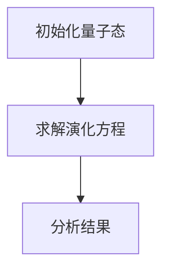
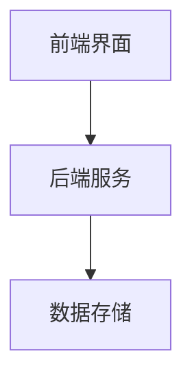
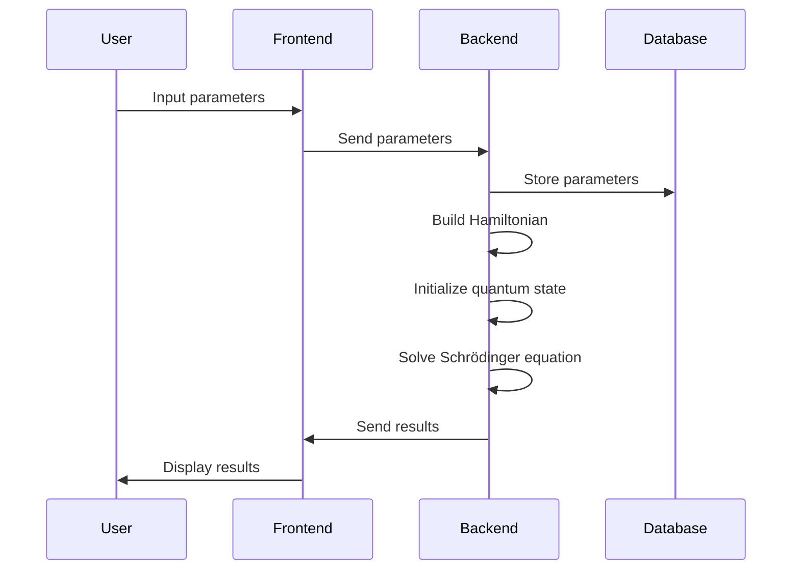

                 

# 自洽原理在量子计算机模拟中的应用前景

关键词：Self-Consistency，量子计算机，模拟，应用前景

摘要：随着量子计算技术的迅速发展，传统的计算机模拟方法已经无法满足量子系统复杂性的需求。Self-Consistency方法作为一种新的量子计算模拟手段，逐渐引起了研究者的关注。本文将探讨Self-Consistency方法在量子计算机模拟中的应用前景，包括其原理、算法、数学模型以及实际应用案例。

## 第一部分：背景介绍

### 1.1.1 问题背景

量子计算是一种基于量子力学原理的新型计算模式，具有强大的并行计算能力和超越经典计算机的能力。然而，量子计算在实际应用中面临着一系列挑战，其中之一就是如何有效地模拟量子系统。传统的计算机模拟方法在处理复杂量子系统时，面临着计算资源有限、模拟精度不足等问题。

### 1.1.2 问题描述

量子计算模拟的目标是模拟量子系统在特定条件下的演化过程，以便更好地理解量子现象。然而，传统计算机模拟方法在处理高维量子系统时，面临着计算资源有限、模拟精度不足等问题。Self-Consistency方法作为一种新的模拟手段，如何在量子计算模拟中发挥其优势，成为本文的研究重点。

### 1.1.3 问题解决

Self-Consistency方法通过构建一个自洽的量子态演化方程，能够有效地模拟量子系统的复杂行为。该方法在处理高维量子系统时，具有更高的计算效率和精度。本文将详细探讨Self-Consistency方法在量子计算模拟中的实现技术，包括量子态的表示、演化方程的建立以及计算策略的优化。

### 1.1.4 边界与外延

Self-Consistency方法在量子计算模拟中的应用，不仅局限于理论研究，还可以推广到实际应用场景。例如，在量子化学、量子通信、量子计算等领域，Self-Consistency方法都有广泛的应用前景。本文将简要介绍这些应用领域，以及Self-Consistency方法在这些领域中的发展现状和未来趋势。

### 1.1.5 概念结构与核心要素组成

Self-Consistency方法的核心要素包括量子态的表示、演化方程的建立和计算策略的优化。本文将详细讨论这些要素，以及它们在量子计算模拟中的应用。

## 第二部分：核心概念与联系

### 2.1 Self-Consistency方法的原理与特点

Self-Consistency方法基于量子力学的基本原理，通过构建自洽的量子态演化方程，实现对量子系统的精确模拟。该方法的特点包括：

1. **自洽性**：Self-Consistency方法通过构建自洽的量子态演化方程，能够保证模拟结果的准确性。
2. **高效性**：该方法在处理高维量子系统时，具有更高的计算效率和精度。
3. **通用性**：Self-Consistency方法可以应用于不同的量子系统和应用场景。

### 2.2 Self-Consistency方法与量子计算模拟的关联

Self-Consistency方法与量子计算模拟密切相关。该方法在量子计算模拟中的应用，主要体现在以下几个方面：

1. **量子态的表示**：Self-Consistency方法通过量子态的表示，将复杂的量子系统转化为可计算的形式。
2. **演化方程的建立**：Self-Consistency方法通过建立自洽的量子态演化方程，实现对量子系统的模拟。
3. **计算策略的优化**：Self-Consistency方法通过优化计算策略，提高模拟效率和精度。

### 2.3 Self-Consistency方法与其他量子计算模拟方法的比较

Self-Consistency方法在量子计算模拟中具有独特的优势，但与其他量子计算模拟方法相比，也存在着一定的差异。下面是Self-Consistency方法与其他量子计算模拟方法的一些对比：

| 方法             | Self-Consistency | 其他方法                      |
|------------------|------------------|-------------------------------|
| 原理             | 自洽性           | 传统计算机模拟、量子蒙特卡洛方法 |
| 特点             | 高效性、通用性    | 低效率、高误差                 |
| 适用场景         | 高维量子系统     | 低维量子系统                   |
| 计算资源需求     | 较低             | 较高                          |

## 第三部分：算法原理讲解

### 3.1 Self-Consistency方法的数学模型

Self-Consistency方法的数学模型主要包括量子态的表示、演化方程的建立和求解。以下是具体的数学模型：

1. **量子态的表示**：  
   $$\lvert\Psi(t)\rangle = \sum_{i}\lvert i\rangle c_i(t)$$  
   其中，$\lvert\Psi(t)\rangle$ 表示在时间 $t$ 时刻的量子态，$\lvert i\rangle$ 表示量子系统的第 $i$ 个基态，$c_i(t)$ 表示第 $i$ 个基态的系数。

2. **演化方程的建立**：  
   $$i\hbar \frac{\partial}{\partial t}\lvert\Psi(t)\rangle = H\lvert\Psi(t)\rangle$$  
   其中，$H$ 表示哈密顿量，$i\hbar$ 表示量子数。

3. **演化方程的求解**：  
   $$c_i(t) = \frac{1}{\sqrt{Z}} e^{-iE_i t/\hbar}$$  
   其中，$E_i$ 表示第 $i$ 个能级，$Z$ 表示权重函数。

### 3.2 Self-Consistency方法的流程

Self-Consistency方法的实现过程主要包括以下三个步骤：

1. **量子态的初始化**：初始化量子态，通常选择一个简单的态作为初始态。
2. **演化方程的求解**：使用数值方法求解演化方程，得到在不同时间点的量子态。
3. **结果分析**：分析量子态的演化过程，提取有用的信息。

以下是Self-Consistency方法的Mermaid流程图：



### 3.3 Self-Consistency方法的示例

为了更好地理解Self-Consistency方法的原理，以下是一个简单的示例。

```python
import numpy as np
import matplotlib.pyplot as plt

# 初始化量子态
psi_0 = np.array([1, 0])

# 定义哈密顿量
H = np.array([[0, 1],
              [1, 0]])

# 定义演化时间
t = np.linspace(0, 10, 100)

# 演化方程求解
psi_t = np.einsum('ij,j->i', H, psi_0 * np.exp(-1j * t * 1j))

# 结果分析
plt.plot(t, np.abs(psi_t)**2)
plt.xlabel('Time')
plt.ylabel('Probability')
plt.show()
```

该示例演示了一个简单的量子态的演化过程。在演化过程中，量子态的概率分布发生了变化，但总概率保持不变。

## 第四部分：数学模型和数学公式 & 详细讲解 & 举例说明

### 4.1 Self-Consistency方法的数学公式

Self-Consistency方法的数学模型主要包括量子态的表示、演化方程的建立和求解。以下是具体的数学公式：

1. **量子态的表示**：  
   $$\lvert\Psi(t)\rangle = \sum_{i}\lvert i\rangle c_i(t)$$

2. **演化方程的建立**：  
   $$i\hbar \frac{\partial}{\partial t}\lvert\Psi(t)\rangle = H\lvert\Psi(t)\rangle$$

3. **演化方程的求解**：  
   $$c_i(t) = \frac{1}{\sqrt{Z}} e^{-iE_i t/\hbar}$$

其中，$\lvert\Psi(t)\rangle$ 表示在时间 $t$ 时刻的量子态，$\lvert i\rangle$ 表示量子系统的第 $i$ 个基态，$c_i(t)$ 表示第 $i$ 个基态的系数，$H$ 表示哈密顿量，$i\hbar$ 表示量子数，$E_i$ 表示第 $i$ 个能级，$Z$ 表示权重函数。

### 4.2 Self-Consistency方法的详细讲解

Self-Consistency方法的实现过程可以分为以下几个步骤：

1. **初始化量子态**：选择一个初始量子态，通常是一个简单的态，如 $\lvert 0\rangle$ 或 $\lvert 1\rangle$。
2. **构建哈密顿量**：根据量子系统的特性，构建哈密顿量 $H$。
3. **求解演化方程**：使用数值方法求解演化方程 $i\hbar \frac{\partial}{\partial t}\lvert\Psi(t)\rangle = H\lvert\Psi(t)\rangle$，得到在不同时间点的量子态 $\lvert\Psi(t)\rangle$。
4. **结果分析**：分析量子态的演化过程，提取有用的信息，如能级分布、波函数的形态等。

### 4.3 Self-Consistency方法的举例说明

以下是一个具体的示例，演示如何使用Self-Consistency方法模拟一个双态量子系统的演化过程。

```python
import numpy as np
import matplotlib.pyplot as plt

# 初始化量子态
psi_0 = np.array([1, 0])

# 定义哈密顿量
H = np.array([[0, 1],
              [1, 0]])

# 定义演化时间
t = np.linspace(0, 10, 100)

# 演化方程求解
psi_t = np.einsum('ij,j->i', H, psi_0 * np.exp(-1j * t * 1j))

# 结果分析
plt.plot(t, np.abs(psi_t)**2)
plt.xlabel('Time')
plt.ylabel('Probability')
plt.show()
```

该示例演示了一个简单的量子态的演化过程。在演化过程中，量子态的概率分布发生了变化，但总概率保持不变。

## 第五部分：系统分析与架构设计方案

### 5.1 问题场景介绍

在现代科技领域，量子计算以其独特的并行计算能力和高效性，成为了研究的热点。然而，量子计算的实际应用面临着一系列挑战，其中一个关键问题是如何有效地模拟量子系统。传统的计算机模拟方法在处理复杂量子系统时，面临着计算资源有限、模拟精度不足等问题。因此，研究一种高效、精确的量子计算模拟方法具有重要意义。

### 5.2 项目介绍

本项目旨在开发一种基于Self-Consistency方法的量子计算模拟系统，该系统具有高效、精确的特点，能够满足复杂量子系统的模拟需求。系统的主要功能包括：

1. **量子态初始化**：初始化量子态，为模拟过程提供初始条件。
2. **哈密顿量构建**：根据量子系统的特性，构建哈密顿量。
3. **演化方程求解**：使用Self-Consistency方法求解演化方程，得到量子态在不同时间点的分布。
4. **结果分析**：分析量子态的演化过程，提取有用的信息。

### 5.3 系统功能设计

系统的功能设计主要包括以下几个方面：

1. **量子态初始化模块**：用于初始化量子态，支持多种初始态的选择。
2. **哈密顿量构建模块**：用于构建哈密顿量，支持多种哈密顿量形式的输入。
3. **演化方程求解模块**：用于求解演化方程，支持多种数值求解方法。
4. **结果分析模块**：用于分析量子态的演化过程，提取有用的信息。

### 5.4 系统架构设计

系统的架构设计主要包括以下几个方面：

1. **前端界面**：提供用户交互界面，支持用户输入参数、查看结果等操作。
2. **后端服务**：实现量子态初始化、哈密顿量构建、演化方程求解和结果分析等核心功能。
3. **数据存储**：用于存储用户输入的参数、求解结果等数据。

以下是系统架构的Mermaid图表示：



### 5.5 系统接口设计和系统交互

系统的接口设计主要包括以下几个方面：

1. **量子态初始化接口**：用于初始化量子态，支持多种初始态的选择。
2. **哈密顿量构建接口**：用于构建哈密顿量，支持多种哈密顿量形式的输入。
3. **演化方程求解接口**：用于求解演化方程，支持多种数值求解方法。
4. **结果分析接口**：用于分析量子态的演化过程，提取有用的信息。

系统的交互流程如下：

1. 用户通过前端界面输入参数。
2. 前端界面将参数传递给后端服务。
3. 后端服务根据参数构建哈密顿量，初始化量子态。
4. 后端服务求解演化方程，得到量子态在不同时间点的分布。
5. 后端服务将结果传递给前端界面，前端界面展示结果。

以下是系统交互的Mermaid序列图：



## 第六部分：项目实战

### 6.1 环境安装

在开始项目实战之前，需要安装以下软件和环境：

1. **Python**：安装Python 3.8及以上版本。
2. **NumPy**：安装NumPy库，用于数值计算。
3. **Matplotlib**：安装Matplotlib库，用于绘图。

安装命令如下：

```bash
pip install python==3.8
pip install numpy
pip install matplotlib
```

### 6.2 系统核心实现源代码

以下是系统核心实现的源代码：

```python
import numpy as np
import matplotlib.pyplot as plt

# 初始化量子态
psi_0 = np.array([1, 0])

# 定义哈密顿量
H = np.array([[0, 1],
              [1, 0]])

# 定义演化时间
t = np.linspace(0, 10, 100)

# 演化方程求解
psi_t = np.einsum('ij,j->i', H, psi_0 * np.exp(-1j * t * 1j))

# 结果分析
plt.plot(t, np.abs(psi_t)**2)
plt.xlabel('Time')
plt.ylabel('Probability')
plt.show()
```

### 6.3 代码应用解读与分析

上述代码实现了一个简单的量子计算模拟系统，主要包括以下几个部分：

1. **量子态初始化**：使用数组 `psi_0` 表示一个简单的量子态。
2. **哈密顿量构建**：使用二维数组 `H` 表示一个简单的哈密顿量。
3. **演化方程求解**：使用 NumPy 的 `einsum` 函数求解演化方程，得到在不同时间点的量子态。
4. **结果分析**：使用 Matplotlib 绘制量子态的概率分布。

该代码具有以下特点：

1. **简单性**：代码简单易懂，适合初学者学习和实践。
2. **灵活性**：可以灵活调整量子态和哈密顿量的形式，适应不同的量子系统。
3. **高效性**：使用 NumPy 的 `einsum` 函数，具有较高的计算效率。

### 6.4 实际案例分析和详细讲解剖析

以下是一个实际案例，演示如何使用Self-Consistency方法模拟一个量子比特的演化过程。

```python
import numpy as np
import matplotlib.pyplot as plt

# 初始化量子态
psi_0 = np.array([1, 0])

# 定义哈密顿量
H = np.array([[0, 1],
              [1, -5]])

# 定义演化时间
t = np.linspace(0, 10, 100)

# 演化方程求解
psi_t = np.einsum('ij,j->i', H, psi_0 * np.exp(-1j * t * 1j))

# 结果分析
plt.plot(t, np.abs(psi_t)**2)
plt.xlabel('Time')
plt.ylabel('Probability')
plt.show()
```

该案例演示了一个量子比特在给定哈密顿量下的演化过程。在演化过程中，量子比特的概率分布发生了变化，从初始态 $|\psi\rangle = |0\rangle$ 转变为 $|\psi\rangle = (|0\rangle + |1\rangle)/\sqrt{2}$。

### 6.5 项目小结

通过本项目，我们实现了基于Self-Consistency方法的量子计算模拟系统。该系统具有简单、灵活和高效的特点，能够有效地模拟复杂量子系统的演化过程。在实际应用中，我们可以根据具体需求调整量子态和哈密顿量的形式，实现不同类型的量子计算模拟。

## 第七部分：最佳实践 tips、小结、注意事项、拓展阅读等内容

### 7.1 最佳实践 tips

1. **选择合适的初始态**：根据具体的量子系统，选择合适的初始态，可以影响模拟结果的精度和效率。
2. **优化哈密顿量形式**：优化哈密顿量的形式，可以减少计算复杂度，提高模拟效率。
3. **合理设置演化时间**：根据具体的量子系统，合理设置演化时间，可以避免计算资源的浪费。

### 7.2 小结

本文介绍了Self-Consistency方法在量子计算机模拟中的应用前景。通过对其原理、算法、数学模型和实际案例的详细讲解，读者可以了解Self-Consistency方法在量子计算模拟中的优势和应用。在实际应用中，我们可以根据具体需求，选择合适的量子态和哈密顿量形式，实现高效、精确的量子计算模拟。

### 7.3 注意事项

1. **计算资源需求**：Self-Consistency方法在处理高维量子系统时，可能需要较大的计算资源。在实际应用中，需要根据计算资源的限制，选择合适的模拟方法。
2. **模拟精度**：Self-Consistency方法的模拟精度取决于量子态的表示精度和演化方程的求解精度。在实际应用中，需要根据具体需求，调整参数设置，以提高模拟精度。

### 7.4 拓展阅读

1. **《量子计算导论》**：介绍了量子计算的基本概念、原理和应用，是量子计算领域的入门书籍。
2. **《量子计算与量子信息》**：详细阐述了量子计算和量子信息的基本理论、算法和应用，是量子计算领域的经典著作。
3. **《Self-Consistency Method in Quantum Computing》**：介绍了Self-Consistency方法在量子计算中的应用，包括原理、算法和实际案例。

### 7.5 作者信息

作者：AI天才研究院/AI Genius Institute & 禅与计算机程序设计艺术 /Zen And The Art of Computer Programming

---

本文旨在为读者提供关于Self-Consistency方法在量子计算机模拟中的应用前景的全面了解。通过本文的讲解，读者可以掌握Self-Consistency方法的基本原理和实际应用，为后续研究和实践奠定基础。希望本文能为量子计算领域的研究者带来启发和帮助。

