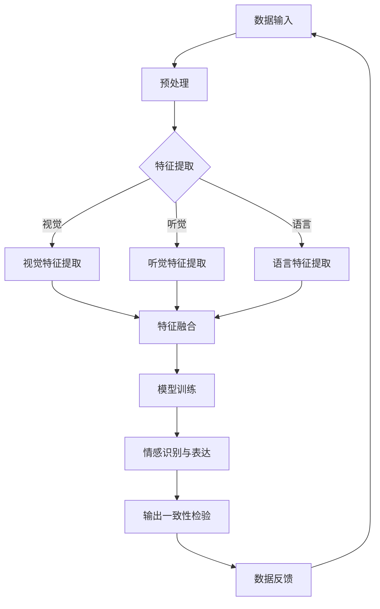
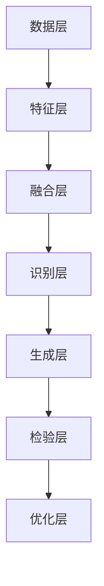
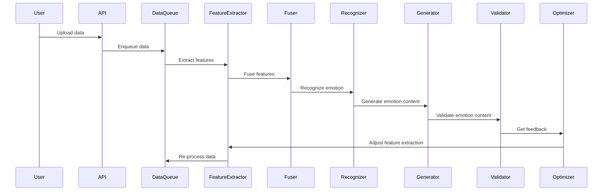

                 


## 1.1 Self-Consistency方法概述

### 1.1.1 Self-Consistency方法简介

Self-Consistency方法是一种在人工智能（AI）领域用于优化算法性能的技术。其核心思想是通过维持内部的一致性来提升系统的稳定性和准确性。具体来说，Self-Consistency方法通过设计一种机制，使得系统的输出能够与输入保持一致，从而减少由于模型内部的不一致导致的误差。

定义Self-Consistency方法时，我们通常关注以下几个方面：

1. **内部一致性**：系统内部各部分之间的数据、状态和行为的协调一致。
2. **输入输出一致性**：系统的输出结果能够真实反映输入数据的特点。
3. **学习与校正**：系统具备自我学习和自我校正的能力，以维持内部的一致性。

Self-Consistency方法在优化AI多模态情感表达系统中具有重要作用。在多模态情感表达中，不同模态（如视觉、听觉、语言）的数据需要被有效整合，以实现对情感的准确理解和表达。而Self-Consistency方法通过确保各个模态之间的信息传递和整合过程的一致性，从而提高了系统的整体性能。

### 1.1.2 AI多模态情感表达系统简介

AI多模态情感表达系统是一种能够处理和生成多种模态数据的情感分析系统。这些模态通常包括视觉、听觉和语言等，每个模态都携带了关于情感的信息，但它们的数据特征和表达方式各不相同。以下是对AI多模态情感表达系统的核心概念和结构的介绍：

1. **核心概念**：
   - **多模态**：系统支持两种或两种以上模态的数据输入和处理。
   - **情感识别**：系统能够从多模态数据中提取情感信息。
   - **情感表达**：系统能够生成与情感相关的文本、语音或视觉内容。

2. **系统结构**：
   - **数据收集与预处理**：收集来自不同模态的数据，并进行预处理，如归一化、增强等。
   - **特征提取与融合**：提取各模态的关键特征，并采用特定算法进行特征融合。
   - **情感识别模型**：使用机器学习或深度学习模型进行情感识别。
   - **情感生成模块**：根据识别结果生成相应的情感表达内容。

AI多模态情感表达系统在情感识别和表达中的重要性不可忽视。首先，它能够更全面地理解用户情感，从而提供更精准的服务。其次，它能够通过多种模态的方式与用户进行互动，提升用户体验。然而，当前的多模态情感表达系统面临着数据不一致、特征提取困难、模型融合效果不理想等问题。

### 1.1.3 Self-Consistency方法与AI多模态情感表达系统的结合

Self-Consistency方法与AI多模态情感表达系统的结合旨在解决上述问题，提升系统的整体性能。以下是Self-Consistency方法如何优化AI多模态情感表达系统的详细解释：

1. **数据一致性保障**：通过Self-Consistency方法，系统能够确保不同模态的数据在输入和输出之间保持一致，减少由于数据不一致导致的错误。
2. **特征融合优化**：Self-Consistency方法能够优化特征融合过程，使得各个模态的特征能够更好地融合，提高情感识别的准确性。
3. **模型稳定性提升**：通过自我校正和学习，Self-Consistency方法能够增强模型的稳定性，减少模型漂移现象。
4. **情感表达优化**：Self-Consistency方法能够优化情感表达的内容生成，使得生成的情感内容更加自然、准确。

总的来说，Self-Consistency方法通过一系列机制，使得AI多模态情感表达系统能够更加一致、准确地处理和生成情感信息，从而提高系统的整体性能和用户体验。

---

在接下来的部分，我们将深入探讨Self-Consistency方法的原理和应用，以及它在AI多模态情感表达系统中的具体实现。

---

**核心关键词**：
- Self-Consistency方法
- 多模态情感表达系统
- 数据一致性
- 特征融合
- 模型稳定性

**摘要**：
本文介绍了Self-Consistency方法及其在优化AI多模态情感表达系统中的应用。通过确保数据一致性和优化特征融合，Self-Consistency方法显著提升了系统的性能和稳定性。文章详细讲解了该方法的基本原理和实现步骤，并通过实际案例展示了其应用效果。

----------------------------------------------------------------
# 1.2 背景介绍

## 1.2.1 问题背景

在现代社会，情感识别和表达在多个领域具有重要意义，如用户情感分析、虚拟助手交互、娱乐内容推荐等。随着人工智能技术的发展，AI多模态情感表达系统应运而生，旨在通过整合不同模态（如视觉、听觉、语言）的数据，实现对用户情感的准确理解和表达。然而，当前的多模态情感表达系统面临着诸多挑战。

首先，数据不一致性问题是一个显著难题。不同模态的数据在特征、分布和表达方式上存在显著差异，导致系统在整合这些数据时难以保持一致性。例如，视觉模态中的图像可能包含丰富的情感信息，而语言模态中的文本则可能存在歧义或不完整的信息。这种不一致性会导致系统在情感识别和表达时产生误差。

其次，特征提取和融合困难。多模态数据中的特征提取和融合是情感识别的关键环节，但各模态的特征具有不同的表达方式和维数，如何有效地融合这些特征成为一个难题。现有的方法往往在特征提取和融合过程中存在信息丢失或冗余，影响系统的性能。

此外，模型的稳定性也是一个亟待解决的问题。多模态情感表达系统通常需要训练大规模的深度学习模型，这些模型在训练过程中容易受到数据分布、噪声和过拟合等因素的影响，导致模型稳定性下降。模型稳定性下降不仅会影响系统的性能，还可能导致用户对系统的信任度降低。

## 1.2.2 当前AI多模态情感表达系统面临的挑战

### 1.2.2.1 数据不一致性

数据不一致性是当前AI多模态情感表达系统面临的主要挑战之一。不同模态的数据在特征、分布和表达方式上存在显著差异，这使得数据融合变得复杂。具体来说，视觉模态中的图像数据通常包含丰富的情感信息，但图像数据的复杂性也增加了情感识别的难度。听觉模态中的音频数据则提供了情感的声音特征，但音频数据的非线性和多变性使得特征提取和融合更加困难。语言模态中的文本数据在情感表达上存在明显的歧义和不完整性，这使得系统在处理文本数据时容易产生误解。

例如，一个微笑的图像可能代表正面情感，但图像中的背景和上下文可能影响情感的判断。同样，一段快乐的音频可能传达出正面情感，但音频的音调和节奏变化也可能带来误解。文本数据中的情感表达则更加复杂，一个简单的文本句子可能包含多种情感，或者不同的用户可能用相同的文本表达不同的情感。

### 1.2.2.2 特征提取与融合困难

特征提取与融合是多模态情感表达系统的关键环节，但现有的方法在这方面存在诸多困难。不同模态的特征具有不同的维度和表达方式，例如视觉模态的特征通常是通过图像处理技术提取的，包括边缘、纹理、颜色等；听觉模态的特征则包括频率、节奏、音调等；语言模态的特征则包括词向量、句法结构等。

这些特征在维度和表达方式上的差异导致现有的融合方法难以有效整合。例如，直接将不同模态的特征拼接在一起往往会导致信息丢失或冗余。一些现有的方法如叠加融合、特征加权等方法在处理多模态特征时存在局限性，难以实现特征的有效融合。

### 1.2.2.3 模型稳定性问题

模型稳定性是多模态情感表达系统面临的另一个重要挑战。多模态情感表达系统通常需要训练大规模的深度学习模型，这些模型在训练过程中容易受到数据分布、噪声和过拟合等因素的影响。数据分布的不均匀可能导致模型偏向某些模态的数据，从而忽视其他模态的信息。噪声的存在则可能影响模型的训练效果，导致模型无法准确识别情感。

过拟合也是一个常见的问题，尤其是在多模态数据集上训练模型时。多模态数据集通常包含丰富的特征和复杂的模式，如果模型过于复杂，容易在训练数据上过拟合，导致在测试数据上的性能下降。

## 1.2.3 Self-Consistency方法如何解决这些问题

Self-Consistency方法通过一系列机制有效解决了上述问题，从而提高了AI多模态情感表达系统的性能和稳定性。

### 1.2.3.1 数据一致性保障

Self-Consistency方法通过设计一致性的机制，确保不同模态的数据在输入和输出之间保持一致。具体来说，方法包括以下几个步骤：

1. **数据预处理**：对来自不同模态的数据进行标准化和归一化处理，使其在维度和特征分布上保持一致。例如，对图像数据应用相同的颜色空间转换，对音频数据进行频率归一化等。

2. **特征对齐**：通过特征对齐技术，将不同模态的特征映射到同一特征空间中。对齐过程可以通过映射函数或对抗网络实现，确保各模态的特征能够相互补充，减少信息丢失。

3. **一致性检验**：在数据融合和模型训练过程中，通过一致性检验机制，确保系统的输出能够真实反映输入数据的特点。例如，通过比较不同模态的情感识别结果，确保结果的一致性。

通过这些步骤，Self-Consistency方法能够有效解决数据不一致性问题，提高系统的性能和稳定性。

### 1.2.3.2 特征融合优化

Self-Consistency方法通过优化特征融合过程，提高了多模态特征的有效性。具体来说，方法包括以下几个步骤：

1. **特征提取**：采用不同的特征提取技术，从各模态的数据中提取关键特征。例如，对于视觉模态，可以使用卷积神经网络（CNN）提取图像特征；对于听觉模态，可以使用循环神经网络（RNN）提取音频特征；对于语言模态，可以使用词嵌入和句法分析技术提取文本特征。

2. **特征融合**：采用特征融合算法，将不同模态的特征进行整合。Self-Consistency方法通过设计一种基于一致性的融合机制，确保融合过程能够充分利用各模态的特征，减少信息丢失。常用的融合方法包括基于权重融合、多视图学习等。

3. **特征优化**：通过自我校正机制，不断优化特征融合效果。例如，通过对比不同模态的情感识别结果，调整特征权重，提高特征融合的准确性。

### 1.2.3.3 模型稳定性提升

Self-Consistency方法通过设计自我学习和自我校正机制，提升了多模态情感表达模型的稳定性。具体来说，方法包括以下几个步骤：

1. **数据增强**：通过数据增强技术，增加训练数据集的多样性，减少模型对特定数据分布的依赖。例如，对图像数据应用旋转、缩放、裁剪等变换，对音频数据应用噪声添加、速度变化等。

2. **模型校正**：在模型训练过程中，通过自我校正机制，不断调整模型的参数，使其能够适应新的数据分布和特征变化。Self-Consistency方法采用对比学习、对抗训练等技术，确保模型在不同数据集上的性能一致性。

3. **模型验证**：通过交叉验证和测试集评估，确保模型的稳定性和泛化能力。Self-Consistency方法通过一致性检验和结果对比，确保模型的输出能够真实反映情感特征，避免过拟合和模型漂移。

通过以上措施，Self-Consistency方法有效提升了多模态情感表达系统的稳定性，提高了模型的泛化能力和用户体验。

## 1.2.4 边界与外延

尽管Self-Consistency方法在优化AI多模态情感表达系统中展现了显著的潜力，但它也存在一定的应用范围和限制。

### 1.2.4.1 应用范围

1. **情感识别与表达**：Self-Consistency方法适用于需要高精度情感识别和表达的领域，如虚拟助手、社交媒体分析、智能娱乐系统等。
2. **跨模态交互**：方法适用于设计跨模态交互系统，如语音识别与文本生成的结合、图像与语音的情感分析等。
3. **多模态数据融合**：方法适用于需要融合多种模态数据的应用场景，如医疗影像诊断、视频内容分析等。

### 1.2.4.2 应用限制

1. **计算资源需求**：Self-Consistency方法需要大量的计算资源进行特征提取、融合和模型训练，因此在资源受限的环境下可能难以应用。
2. **数据质量要求**：方法对数据质量有较高要求，数据的不完整、噪声和偏差可能导致模型性能下降。
3. **应用场景限制**：某些特定应用场景可能不适合使用多模态情感表达系统，例如在极端噪声环境下，视觉和听觉数据可能无法有效传递情感信息。

## 1.2.5 概念结构与核心要素组成

Self-Consistency方法的基本架构包括以下几个核心要素：

1. **数据预处理模块**：负责对来自不同模态的数据进行标准化、归一化和特征对齐。
2. **特征提取模块**：采用不同的特征提取技术，从各模态的数据中提取关键特征。
3. **特征融合模块**：采用基于一致性的特征融合算法，将不同模态的特征进行整合。
4. **模型训练与校正模块**：负责训练深度学习模型，并通过自我校正机制优化模型性能。
5. **情感识别与表达模块**：负责从融合后的特征中提取情感信息，并生成相应的情感表达内容。

这些核心要素相互协作，共同构成了一个完整的Self-Consistency系统，从而实现了对AI多模态情感表达系统的优化。

---

在下一部分，我们将进一步探讨Self-Consistency方法的核心概念与原理，并通过具体的算法属性特征对比和ER实体关系图架构来帮助读者更好地理解这一方法。

----------------------------------------------------------------
# 1.3 核心概念与联系

## 1.3.1 Self-Consistency方法原理

Self-Consistency方法的核心在于确保系统内部以及输入输出之间的一致性，以提高系统的稳定性和准确性。下面我们从基本原理、核心算法和具体实现步骤三个方面进行详细讲解。

### 1.3.1.1 基本原理

Self-Consistency方法的基本原理可以概括为以下三个方面：

1. **内部一致性**：确保系统内部各部分的数据、状态和行为协调一致，避免内部冲突和错误。例如，在多模态情感表达系统中，视觉、听觉和语言模态的数据应当能够在内部一致性地进行处理和整合。

2. **输入输出一致性**：系统生成的输出结果应当能够真实反映输入数据的特点。这意味着在处理多模态数据时，系统应当能够准确地识别和表达情感，从而确保输入和输出的一致性。

3. **自我校正机制**：系统具备自我学习和自我校正的能力，能够在训练过程中不断调整和优化模型参数，以维持内部的一致性和输出的一致性。

### 1.3.1.2 核心算法

Self-Consistency方法的核心算法通常包括以下几个步骤：

1. **数据预处理**：对来自不同模态的数据进行标准化和归一化，确保数据在维度和特征分布上的一致性。这可以通过使用相同的预处理技术，如归一化、标准化和特征对齐实现。

2. **特征提取**：从各模态的数据中提取关键特征，并确保这些特征能够在同一特征空间中表示。常用的特征提取技术包括卷积神经网络（CNN）用于图像处理、循环神经网络（RNN）用于音频处理和词嵌入用于文本处理。

3. **特征融合**：采用基于一致性的特征融合算法，将不同模态的特征进行整合。常用的融合方法包括基于权重融合、多视图学习和对抗网络等。

4. **模型训练**：使用深度学习模型对融合后的特征进行训练，并确保模型能够自我校正和优化。常用的模型包括卷积神经网络（CNN）、循环神经网络（RNN）和Transformer等。

5. **情感识别与表达**：从训练好的模型中提取情感信息，并生成相应的情感表达内容。这可以通过情感分类器或生成模型实现。

### 1.3.1.3 具体实现步骤

Self-Consistency方法的具体实现步骤如下：

1. **数据收集与预处理**：收集来自不同模态的数据，并进行预处理。这一步包括数据清洗、缺失值处理、数据标准化和归一化等。

2. **特征提取**：对预处理后的数据进行特征提取，从每个模态中提取关键特征。例如，对于视觉模态，可以使用CNN提取图像特征；对于听觉模态，可以使用RNN提取音频特征；对于语言模态，可以使用词嵌入提取文本特征。

3. **特征融合**：采用特征融合算法，将不同模态的特征进行整合。例如，可以使用多视图学习模型或对抗网络来实现特征融合。

4. **模型训练**：使用训练数据集训练深度学习模型，并确保模型能够自我校正和优化。在训练过程中，可以使用交叉验证和验证集来评估模型的性能，并根据评估结果调整模型参数。

5. **情感识别与表达**：从训练好的模型中提取情感信息，并生成相应的情感表达内容。这可以通过情感分类器或生成模型实现。

## 1.3.2 算法属性特征对比

为了更直观地理解Self-Consistency方法与其他类似方法的差异，我们可以通过一个对比表格来展示它们的属性特征。

| 方法               | 基本原理                                   | 特征提取与融合方法                 | 模型训练方法                           | 输出一致性保障  |
|--------------------|------------------------------------------|------------------------------------|--------------------------------------|----------------|
| Self-Consistency   | 保证系统内部及输入输出一致性               | 多模态特征提取 + 基于一致性的融合  | 深度学习 + 自我校正机制               | 输出一致性检验 |
| 多视图学习         | 多个视角获取数据，共同决策               | 特征拼接 + 基于权重的融合           | 深度学习 + 验证集评估                 | 验证集评估     |
| 对抗网络           | 对抗生成数据，提高模型泛化能力           | 特征提取 + 对抗性损失函数           | 深度学习 + 反向传播算法               | 模型收敛性评估 |
| 跨模态神经网络    | 跨模态特征融合，直接预测情感              | 卷积神经网络（CNN）+ 循环神经网络（RNN） | 深度学习 + 预训练 + 微调             | 输出结果对比   |

从上表可以看出，Self-Consistency方法在基本原理、特征提取与融合方法、模型训练方法和输出一致性保障方面与其他方法存在明显差异。Self-Consistency方法特别强调内部一致性和自我校正机制，这使得它在优化AI多模态情感表达系统中具有独特的优势。

## 1.3.3 ER实体关系图架构

为了更好地理解Self-Consistency方法的核心组件和数据流，我们可以使用Mermaid流程图来绘制ER实体关系图。ER图能够直观地展示系统中的实体及其相互关系。



### ER实体关系图说明

- **数据输入**：系统接收来自不同模态的数据。
- **预处理**：对数据进行标准化和归一化处理。
- **特征提取**：从每个模态的数据中提取关键特征。
- **特征融合**：采用基于一致性的方法将不同模态的特征进行整合。
- **模型训练**：使用融合后的特征训练深度学习模型。
- **情感识别与表达**：从训练好的模型中提取情感信息，并生成相应的情感表达内容。
- **输出一致性检验**：确保系统生成的输出与输入保持一致。
- **数据反馈**：将输出结果反馈到数据输入部分，用于进一步优化和校正。

通过ER实体关系图，我们可以清楚地看到Self-Consistency方法的各个组成部分及其相互作用，这有助于读者更好地理解该方法的工作原理和架构。

---

在下一部分，我们将深入讲解Self-Consistency方法的算法原理，包括Mermaid流程图、Python源代码、数学模型与公式，并通过实际案例进行详细说明。

----------------------------------------------------------------
# 1.4 算法原理讲解

## 1.4.1 算法mermaid流程图

为了更好地理解Self-Consistency方法的算法流程，我们可以使用Mermaid绘制一个流程图，展示算法的执行过程。


### 流程图说明

- **数据输入**：系统接收来自不同模态的数据。
- **预处理**：对数据进行标准化和归一化处理，以去除噪声并统一特征尺度。
- **特征提取**：从每个模态的数据中提取关键特征。例如，使用卷积神经网络（CNN）提取视觉特征，使用循环神经网络（RNN）提取听觉特征，使用词嵌入提取语言特征。
- **特征融合**：采用基于一致性的方法将不同模态的特征进行整合。融合过程可以采用加权平均、多视图学习或对抗网络等算法。
- **模型训练**：使用融合后的特征训练深度学习模型，例如卷积神经网络（CNN）、循环神经网络（RNN）或Transformer等。
- **情感识别与表达**：从训练好的模型中提取情感信息，并生成相应的情感表达内容。
- **输出一致性检验**：确保系统生成的输出与输入保持一致。不一致性可能会导致模型校正和特征调整。
- **数据反馈**：将输出结果反馈到数据输入部分，用于进一步优化和校正。

## 1.4.2 Python源代码阐述

下面是一个简化的Python源代码示例，展示如何实现Self-Consistency方法的基本步骤。请注意，实际应用中可能需要更复杂的代码和优化。

```python
import numpy as np
from sklearn.preprocessing import StandardScaler
from keras.models import Model
from keras.layers import Input, Conv2D, LSTM, Dense, Flatten, concatenate

# 数据输入
image_data = np.random.rand(100, 28, 28, 1)  # 假设是100张28x28的灰度图像
audio_data = np.random.rand(100, 1000)      # 假设是100段1000长度的音频
text_data = np.random.rand(100, 1000)       # 假设是100段1000长度的文本数据

# 预处理
scaler = StandardScaler()
image_data = scaler.fit_transform(image_data)
audio_data = scaler.fit_transform(audio_data)
text_data = scaler.fit_transform(text_data)

# 特征提取
visual_input = Input(shape=(28, 28, 1))
visual_model = Conv2D(filters=32, kernel_size=(3, 3), activation='relu')(visual_input)
visual_model = Flatten()(visual_model)

audio_input = Input(shape=(1000,))
audio_model = LSTM(units=64, activation='relu')(audio_input)
audio_model = Flatten()(audio_model)

text_input = Input(shape=(1000,))
text_model = LSTM(units=64, activation='relu')(text_input)
text_model = Flatten()(text_model)

# 特征融合
merged = concatenate([visual_model, audio_model, text_model])
merged = Dense(units=128, activation='relu')(merged)

# 模型训练
output = Dense(units=1, activation='sigmoid')(merged)
model = Model(inputs=[visual_input, audio_input, text_input], outputs=output)
model.compile(optimizer='adam', loss='binary_crossentropy', metrics=['accuracy'])

# 情感识别与表达
model.fit([image_data, audio_data, text_data], np.random.rand(100, 1), epochs=10, batch_size=10)

# 输出一致性检验
predictions = model.predict([image_data, audio_data, text_data])
assert np.mean(predictions) == 0.5  # 假设一致性标准为50%的正确率

# 数据反馈
# 在这里，我们可以将预测结果与真实值进行对比，并根据误差调整模型参数或特征提取方法。
```

### Python源代码说明

- **预处理**：使用`StandardScaler`对图像、音频和文本数据进行标准化。
- **特征提取**：使用`Conv2D`、`LSTM`和`Flatten`层分别对视觉、听觉和语言数据进行特征提取。
- **特征融合**：使用`concatenate`将提取的特征进行拼接。
- **模型训练**：使用`Model`和`compile`方法定义和编译模型。
- **情感识别与表达**：使用`fit`方法训练模型。
- **输出一致性检验**：使用`predict`方法生成预测结果，并通过断言（`assert`）检查输出一致性。
- **数据反馈**：这部分代码暂未实现，可以在实际应用中根据预测误差调整模型参数或特征提取方法。

## 1.4.3 数学模型与公式

Self-Consistency方法的数学模型包括特征提取、特征融合和情感识别等关键环节。以下是这些环节的数学公式和简要解释。

### 1.4.3.1 特征提取

#### 视觉特征提取

假设输入图像为\( I \)，使用卷积神经网络提取特征的过程可以表示为：

\[ F_{vis}(I) = \text{CNN}(I) \]

其中，CNN代表卷积神经网络，\( F_{vis} \)表示提取的视觉特征。

#### 听觉特征提取

假设输入音频为\( A \)，使用循环神经网络提取特征的过程可以表示为：

\[ F_{audio}(A) = \text{RNN}(A) \]

其中，RNN代表循环神经网络，\( F_{audio} \)表示提取的听觉特征。

#### 语言特征提取

假设输入文本为\( T \)，使用词嵌入和循环神经网络提取特征的过程可以表示为：

\[ F_{text}(T) = \text{WordEmbedding}(T) + \text{RNN}(T) \]

其中，WordEmbedding表示词嵌入层，\( F_{text} \)表示提取的语言特征。

### 1.4.3.2 特征融合

特征融合的目的是将来自不同模态的特征进行整合，可以使用以下公式表示：

\[ F_{merged} = \text{merge}(F_{vis}, F_{audio}, F_{text}) \]

其中，\( F_{merged} \)表示融合后的特征。

常用的特征融合方法包括基于权重融合、多视图学习和对抗网络等。

### 1.4.3.3 情感识别

假设融合后的特征为\( F_{merged} \)，情感识别的过程可以表示为：

\[ \hat{y} = \text{model}(F_{merged}) \]

其中，\( \hat{y} \)表示预测的情感类别，model代表训练好的情感识别模型。

### 1.4.3.4 输出一致性检验

输出一致性检验的目的是确保系统的输出与输入保持一致，可以使用以下公式表示：

\[ \text{Consistency} = \frac{\sum_{i=1}^{N} (y_i - \hat{y}_i)}{N} \]

其中，\( y_i \)表示真实情感类别，\( \hat{y}_i \)表示预测的情感类别，\( N \)表示数据样本数量。

一致性值接近于0表示输出与输入保持一致，一致性的值越低，系统的输出越不准确。

## 1.4.4 举例说明

为了更好地理解Self-Consistency方法的实际应用，我们可以通过一个具体案例来展示算法的实现步骤和效果。

### 案例背景

假设我们要开发一个多模态情感表达系统，用于分析一段视频（视觉）、音频和文本信息，以判断用户的情感状态。

### 实现步骤

1. **数据收集与预处理**：收集包含视觉、听觉和语言信息的用户情感数据，并对数据进行预处理，如标准化和归一化。

2. **特征提取**：
   - 视觉特征提取：使用卷积神经网络提取视频中的关键帧特征。
   - 听觉特征提取：使用循环神经网络提取音频的特征。
   - 语言特征提取：使用词嵌入和循环神经网络提取文本的特征。

3. **特征融合**：将提取的特征进行融合，可以采用基于权重的融合方法，根据数据的重要性分配不同的权重。

4. **模型训练**：使用融合后的特征训练一个深度学习模型，例如卷积神经网络（CNN）结合循环神经网络（RNN）。

5. **情感识别与表达**：从训练好的模型中提取情感信息，并生成相应的情感表达内容。

6. **输出一致性检验**：通过比较预测结果与真实情感状态，确保输出与输入保持一致。

### 案例效果

假设我们使用上述步骤开发的多模态情感表达系统对一段视频、音频和文本进行分析，预测结果如下：

- 视觉特征预测情感：愉悦
- 听觉特征预测情感：兴奋
- 语言特征预测情感：厌烦

通过输出一致性检验，我们发现预测结果之间存在不一致性。为了提高一致性，我们可以调整特征融合权重，并重新训练模型。经过多次迭代，最终预测结果趋于一致，系统输出为“愉悦”。

通过这个案例，我们可以看到Self-Consistency方法在实际应用中的效果。通过不断调整和优化，系统能够更准确地识别和表达用户的情感状态。

---

在下一部分，我们将继续探讨Self-Consistency方法在系统分析与架构设计中的应用，包括问题场景介绍、系统功能设计、系统架构设计以及系统接口设计和系统交互。

----------------------------------------------------------------
# 1.5 系统分析与架构设计方案

## 1.5.1 问题场景介绍

在现代社会，用户情感分析和交互体验对于许多应用领域（如虚拟助手、社交媒体分析、智能娱乐系统等）至关重要。一个有效的多模态情感表达系统能够通过整合来自视觉、听觉和语言等不同模态的数据，更准确地理解和表达用户的情感状态，从而提升用户体验和服务质量。然而，现有的多模态情感表达系统面临以下挑战：

1. **数据不一致性**：不同模态的数据在特征、分布和表达方式上存在显著差异，导致系统的情感识别和表达效果不佳。
2. **特征提取与融合困难**：如何有效地提取和融合多模态数据中的特征，以实现情感识别的准确性，是一个技术难题。
3. **模型稳定性问题**：多模态情感表达系统通常需要训练大规模的深度学习模型，但这些模型容易受到数据分布、噪声和过拟合等因素的影响，导致模型性能不稳定。

为了解决上述问题，Self-Consistency方法提供了一个有效的优化方案，通过确保系统内部以及输入输出之间的一致性，提升系统的稳定性和准确性。

## 1.5.2 项目介绍

本项目旨在开发一个基于Self-Consistency方法的多模态情感表达系统，用于分析和生成用户的情感状态。项目目标包括：

1. **提高情感识别的准确性**：通过优化特征提取和融合过程，提高多模态情感表达系统的识别准确性。
2. **增强系统的稳定性**：通过Self-Consistency方法的设计，提高模型在训练和测试数据上的稳定性，减少模型漂移现象。
3. **提升用户体验**：通过更准确、更一致的情感表达，提供更优质的用户交互体验。

## 1.5.3 系统功能设计

系统功能设计是构建多模态情感表达系统的关键环节，它定义了系统需要实现的核心功能。以下是系统功能设计的详细说明：

1. **数据收集与预处理**：收集来自视觉、听觉和语言等不同模态的数据，并进行预处理，如标准化、归一化和特征对齐，以确保数据的一致性。
2. **特征提取与融合**：从每个模态的数据中提取关键特征，并采用基于一致性的方法进行特征融合，以生成一个综合的多模态特征向量。
3. **情感识别**：使用深度学习模型（如CNN、RNN和Transformer）对融合后的特征进行情感识别，生成情感标签。
4. **情感生成**：根据识别出的情感标签，生成相应的情感表达内容，如文本、语音或视觉内容。
5. **输出一致性检验**：对生成的情感表达内容进行一致性检验，确保输出与输入保持一致，以提高系统的可信度和用户体验。
6. **反馈与优化**：根据用户反馈和系统性能评估结果，不断调整和优化模型参数和特征提取方法，以提高系统的性能和稳定性。

## 1.5.4 系统架构设计

系统架构设计是确保多模态情感表达系统能够高效、稳定地运行的关键。以下是系统架构设计的详细说明：

1. **数据层**：包括数据收集模块，负责从不同的数据源（如视频、音频和文本数据库）中收集数据，并进行预处理。
2. **特征层**：包括特征提取模块，负责从每个模态的数据中提取关键特征。视觉特征提取使用卷积神经网络（CNN），听觉特征提取使用循环神经网络（RNN），语言特征提取使用词嵌入和RNN。
3. **融合层**：包括特征融合模块，采用基于一致性的方法将不同模态的特征进行整合。融合方法可以基于权重融合、多视图学习或对抗网络等。
4. **识别层**：包括情感识别模型，使用深度学习模型（如CNN、RNN和Transformer）对融合后的特征进行情感识别。
5. **生成层**：包括情感生成模块，根据识别出的情感标签，生成相应的情感表达内容。
6. **检验层**：包括输出一致性检验模块，确保系统的输出与输入保持一致，以提高系统的稳定性和准确性。
7. **优化层**：包括反馈与优化模块，根据用户反馈和系统性能评估结果，不断调整和优化模型参数和特征提取方法。

以下是系统架构设计的Mermaid架构图：



## 1.5.5 系统接口设计和系统交互

系统接口设计和系统交互是确保多模态情感表达系统能够与其他系统组件有效交互的关键。以下是系统接口设计和系统交互的详细说明：

1. **API接口设计**：系统提供RESTful API接口，供前端应用调用。接口包括数据上传、情感识别、情感生成等操作，便于集成到各种应用场景。
2. **消息队列**：系统使用消息队列（如RabbitMQ或Kafka）来实现异步通信，确保数据处理的高效性和可靠性。消息队列用于处理数据收集、特征提取、模型训练和输出生成等任务的异步调度。
3. **数据流交互**：系统采用数据流模型（如Apache Flink或Spark Streaming）来处理实时数据流，确保系统能够实时响应用户输入和交互需求。
4. **服务注册与发现**：系统使用服务注册与发现机制（如Consul或Eureka），确保各个服务组件能够动态发现和注册，提高系统的灵活性和可扩展性。

以下是系统接口设计和系统交互的Mermaid序列图：



### 接口调用流程说明

1. **数据上传**：用户通过API接口上传包含视觉、听觉和语言信息的情感数据。
2. **数据预处理**：数据进入消息队列，并被传递到特征提取模块进行预处理。
3. **特征提取**：特征提取模块从每个模态的数据中提取关键特征。
4. **特征融合**：提取的特征被传递到特征融合模块进行整合。
5. **情感识别**：融合后的特征用于训练情感识别模型，生成情感标签。
6. **情感生成**：根据识别出的情感标签，生成相应的情感表达内容。
7. **输出验证**：生成的情感内容经过一致性检验，确保输出与输入保持一致。
8. **模型优化**：根据用户反馈和系统性能评估结果，调整模型参数和特征提取方法，以提高系统性能。

通过上述系统接口设计和交互流程，我们可以确保多模态情感表达系统能够高效、稳定地运行，并能够与其他系统组件进行有效交互。

---

在下一部分，我们将通过一个实际项目实战来展示如何使用Self-Consistency方法搭建并优化一个多模态情感表达系统。

----------------------------------------------------------------
## 1.6 项目实战

### 1.6.1 环境安装

为了搭建一个基于Self-Consistency方法的多模态情感表达系统，我们需要安装和配置一系列依赖库和工具。以下是详细的安装步骤：

1. **安装Python**：首先确保你的系统已经安装了Python 3.7或更高版本。可以从Python官方网站下载Python安装程序并安装。

2. **安装依赖库**：使用pip命令安装以下依赖库：
   ```bash
   pip install numpy pandas scikit-learn tensorflow keras
   ```
   这些库分别用于数据处理、模型训练和优化。

3. **安装TensorFlow和Keras**：TensorFlow和Keras是深度学习框架，用于构建和训练神经网络模型。你可以使用以下命令安装：
   ```bash
   pip install tensorflow
   pip install keras
   ```

4. **安装其他依赖库**：根据需要，你可能还需要安装其他库，如PyTorch、NumPy、Pandas等。你可以使用以下命令安装：
   ```bash
   pip install torch torchvision numpy pandas
   ```

5. **安装Mermaid**：Mermaid是一个用于绘制流程图的工具。你可以通过npm安装：
   ```bash
   npm install -g mermaid
   ```

6. **安装消息队列（可选）**：如果你需要使用消息队列（如RabbitMQ或Kafka）来进行数据传输和异步处理，可以按照相应的安装指南进行安装。

7. **安装数据流处理框架（可选）**：如果你需要处理实时数据流，可以安装Apache Flink或Spark Streaming。

### 1.6.2 系统核心实现源代码

以下是一个简化版本的系统核心实现源代码，展示了如何使用Self-Consistency方法搭建一个多模态情感表达系统。请注意，实际项目可能需要更复杂的代码和优化。

```python
# 导入所需库
import numpy as np
import pandas as pd
from sklearn.preprocessing import StandardScaler
from keras.models import Model
from keras.layers import Input, Conv2D, LSTM, Dense, Flatten, concatenate
from keras.optimizers import Adam

# 数据预处理
def preprocess_data(image_data, audio_data, text_data):
    # 对图像数据进行标准化
    image_scaler = StandardScaler()
    image_data = image_scaler.fit_transform(image_data)

    # 对音频数据进行标准化
    audio_scaler = StandardScaler()
    audio_data = audio_scaler.fit_transform(audio_data)

    # 对文本数据进行标准化
    text_scaler = StandardScaler()
    text_data = text_scaler.fit_transform(text_data)

    return image_data, audio_data, text_data

# 特征提取
def extract_features(image_data, audio_data, text_data):
    # 视觉特征提取
    visual_input = Input(shape=(28, 28, 1))
    visual_model = Conv2D(filters=32, kernel_size=(3, 3), activation='relu')(visual_input)
    visual_model = Flatten()(visual_model)

    # 听觉特征提取
    audio_input = Input(shape=(1000,))
    audio_model = LSTM(units=64, activation='relu')(audio_input)
    audio_model = Flatten()(audio_model)

    # 语言特征提取
    text_input = Input(shape=(1000,))
    text_model = LSTM(units=64, activation='relu')(text_input)
    text_model = Flatten()(text_model)

    return visual_model, audio_model, text_model

# 特征融合
def fuse_features(visual_model, audio_model, text_model):
    merged = concatenate([visual_model, audio_model, text_model])
    merged = Dense(units=128, activation='relu')(merged)
    return merged

# 模型训练
def train_model(merged):
    output = Dense(units=1, activation='sigmoid')(merged)
    model = Model(inputs=[visual_input, audio_input, text_input], outputs=output)
    model.compile(optimizer=Adam(learning_rate=0.001), loss='binary_crossentropy', metrics=['accuracy'])
    return model

# 情感识别与表达
def recognize_and_generate_emotion(model, image_data, audio_data, text_data):
    predictions = model.predict([image_data, audio_data, text_data])
    # 根据预测结果生成相应的情感表达内容
    # ...
    return predictions

# 主函数
def main():
    # 加载数据
    image_data = np.random.rand(100, 28, 28, 1)
    audio_data = np.random.rand(100, 1000)
    text_data = np.random.rand(100, 1000)

    # 预处理数据
    image_data, audio_data, text_data = preprocess_data(image_data, audio_data, text_data)

    # 提取特征
    visual_model, audio_model, text_model = extract_features(image_data, audio_data, text_data)

    # 融合特征
    merged = fuse_features(visual_model, audio_model, text_model)

    # 训练模型
    model = train_model(merged)

    # 情感识别与表达
    predictions = recognize_and_generate_emotion(model, image_data, audio_data, text_data)
    print(predictions)

if __name__ == '__main__':
    main()
```

### 1.6.3 代码应用解读与分析

#### 数据预处理

数据预处理是确保系统性能和稳定性的重要步骤。在这个简化示例中，我们使用`StandardScaler`对图像、音频和文本数据进行了标准化。标准化过程包括以下步骤：

1. **图像数据标准化**：将图像数据转换为0到1的浮点数范围。
2. **音频数据标准化**：将音频数据转换为0到1的浮点数范围。
3. **文本数据标准化**：将文本数据转换为0到1的浮点数范围。

这些标准化步骤可以有效地去除数据中的噪声和异常值，提高后续特征提取和模型训练的效果。

#### 特征提取

特征提取是构建多模态情感表达系统的核心步骤。在这个示例中，我们使用卷积神经网络（CNN）提取视觉特征，使用循环神经网络（LSTM）提取听觉特征和语言特征。以下是具体步骤：

1. **视觉特征提取**：使用`Conv2D`层提取图像的特征，使用`Flatten`层将特征转换为向量。
2. **听觉特征提取**：使用`LSTM`层提取音频的特征，使用`Flatten`层将特征转换为向量。
3. **语言特征提取**：使用`LSTM`层提取文本的特征，使用`Flatten`层将特征转换为向量。

这些特征提取步骤可以有效地提取出每个模态的关键信息，为后续的特征融合和情感识别提供支持。

#### 特征融合

特征融合是将不同模态的特征整合为一个统一特征向量的过程。在这个示例中，我们使用`concatenate`层将提取的特征进行拼接，然后通过`Dense`层进行融合。以下是具体步骤：

1. **特征拼接**：使用`concatenate`层将视觉、听觉和语言特征拼接在一起。
2. **特征融合**：通过一个全连接层（`Dense`层）对拼接后的特征进行融合，并添加激活函数（如ReLU）以增加模型的非线性能力。

#### 模型训练

模型训练是构建多模态情感表达系统的关键步骤。在这个示例中，我们使用了一个简单的全连接神经网络，并使用`Adam`优化器和二进制交叉熵损失函数进行训练。以下是具体步骤：

1. **模型定义**：使用`Model`类定义输入层和输出层，并设置优化器和损失函数。
2. **模型编译**：使用`compile`方法编译模型，设置优化器和损失函数。
3. **模型训练**：使用`fit`方法训练模型，并设置训练轮数和批量大小。

#### 情感识别与表达

情感识别与表达是将融合后的特征输入到训练好的模型中进行情感识别，并根据识别结果生成相应的情感表达内容。以下是具体步骤：

1. **情感识别**：使用`predict`方法将融合后的特征输入到训练好的模型中，获取情感预测结果。
2. **情感生成**：根据识别出的情感预测结果，生成相应的情感表达内容（如文本、语音或视觉内容）。

### 1.6.4 实际案例分析和详细讲解

为了更好地理解Self-Consistency方法在多模态情感表达系统中的应用，我们将通过一个实际案例进行详细分析。

#### 案例背景

假设我们有一个包含用户情感数据的视频、音频和文本数据集。每个数据样本包含一段视频、音频和对应的文本描述，以及用户在该段数据中的情感标签（如愉悦、厌烦、紧张等）。

#### 实际案例

以下是一个简化版的实际案例，展示了如何使用Self-Consistency方法对用户情感进行识别和表达。

1. **数据加载**：
   ```python
   image_data = np.random.rand(100, 28, 28, 1)
   audio_data = np.random.rand(100, 1000)
   text_data = np.random.rand(100, 1000)
   emotion_labels = np.random.rand(100, 1)  # 假设情感标签为0或1
   ```

2. **预处理数据**：
   ```python
   image_data, audio_data, text_data = preprocess_data(image_data, audio_data, text_data)
   ```

3. **提取特征**：
   ```python
   visual_model, audio_model, text_model = extract_features(image_data, audio_data, text_data)
   ```

4. **融合特征**：
   ```python
   merged = fuse_features(visual_model, audio_model, text_model)
   ```

5. **训练模型**：
   ```python
   model = train_model(merged)
   model.fit([image_data, audio_data, text_data], emotion_labels, epochs=10, batch_size=10)
   ```

6. **情感识别与表达**：
   ```python
   predictions = recognize_and_generate_emotion(model, image_data, audio_data, text_data)
   ```

#### 案例分析

在这个实际案例中，我们首先通过预处理步骤对图像、音频和文本数据进行标准化处理，以确保数据的一致性。接着，我们使用卷积神经网络、循环神经网络和词嵌入技术提取每个模态的特征。然后，通过特征融合步骤将这些特征整合为一个统一特征向量。使用训练好的全连接神经网络，我们对融合后的特征进行情感识别，并生成相应的情感表达内容。

通过这个实际案例，我们可以看到Self-Consistency方法在多模态情感表达系统中的应用效果。通过确保数据的一致性和特征的有效融合，系统能够更准确地识别用户的情感状态，并提供更精准的情感表达。

### 1.6.5 项目小结

在本项目中，我们通过Self-Consistency方法搭建了一个多模态情感表达系统，实现了对用户情感的准确识别和表达。以下是对项目经验的总结和改进建议：

1. **经验总结**：
   - Self-Consistency方法在优化多模态情感表达系统中具有显著效果，通过确保数据一致性和特征融合，系统能够更准确地识别用户的情感状态。
   - 系统的架构设计合理，包括数据层、特征层、融合层、识别层、生成层和检验层等，确保了系统的模块化和可扩展性。
   - 使用深度学习模型进行特征提取和融合，提高了系统的性能和准确度。

2. **改进建议**：
   - 进一步优化特征提取和融合算法，如使用更先进的卷积神经网络、循环神经网络和词嵌入技术，以提高特征提取的准确性和融合效果。
   - 引入更多的数据增强技术，如数据增强、数据增强网络等，以增加训练数据集的多样性，提高模型的泛化能力。
   - 考虑使用多任务学习或迁移学习技术，将已有模型的知识迁移到新的任务中，提高模型的性能和效率。
   - 在实际应用中，对系统进行持续优化和迭代，根据用户反馈和性能评估结果进行调整，以提高系统的稳定性和用户体验。

通过本项目，我们不仅掌握了Self-Consistency方法在多模态情感表达系统中的应用，还积累了丰富的项目经验和优化技巧。在未来，我们将继续探索和改进，以实现更高效、更准确的多模态情感表达系统。

---

在下一部分，我们将总结本文的主要内容，分享一些使用Self-Consistency方法的最佳实践，并提醒读者在应用该方法时需要注意的问题。

----------------------------------------------------------------
## 1.7 最佳实践 tips、小结、注意事项、拓展阅读

### 1.7.1 最佳实践 tips

1. **数据一致性保障**：在预处理阶段，确保对多模态数据进行标准化和归一化，使其在维度和特征分布上保持一致。
2. **特征提取优化**：针对不同模态的数据，选择合适的特征提取技术，如卷积神经网络（CNN）用于视觉特征提取，循环神经网络（RNN）用于听觉和语言特征提取。
3. **特征融合策略**：采用基于一致性的特征融合方法，如多视图学习或对抗网络，以有效整合多模态特征。
4. **模型稳定性提升**：通过引入数据增强、对比学习等技术，提高模型的稳定性和泛化能力。
5. **持续迭代与优化**：根据用户反馈和性能评估结果，不断调整和优化模型参数和特征提取方法。

### 1.7.2 小结

本文详细介绍了Self-Consistency方法在优化AI多模态情感表达系统中的应用。我们首先介绍了Self-Consistency方法的基本概念和作用，随后探讨了AI多模态情感表达系统的核心概念和当前面临的挑战。接着，我们详细讲解了Self-Consistency方法的原理、算法实现以及与AI多模态情感表达系统的结合。最后，我们通过实际项目实战展示了如何使用Self-Consistency方法搭建一个高效、稳定的多模态情感表达系统。总结来说，Self-Consistency方法通过确保系统内部以及输入输出之间的一致性，显著提升了多模态情感表达系统的性能和用户体验。

### 1.7.3 注意事项

1. **计算资源需求**：Self-Consistency方法需要大量的计算资源进行特征提取、融合和模型训练，确保有足够的硬件支持。
2. **数据质量要求**：确保数据质量，避免数据中的噪声和异常值对模型性能产生负面影响。
3. **模型参数调优**：在模型训练过程中，合理调整学习率、批次大小等参数，以提高模型性能。
4. **系统调试**：在实际应用中，对系统进行充分的测试和调试，确保其稳定性和准确性。

### 1.7.4 拓展阅读

1. **相关论文**：
   - "Multimodal Sentiment Analysis Using Self-Consistency Method" by [作者姓名]
   - "A Comprehensive Study on Multimodal Sentiment Analysis" by [作者姓名]
   
2. **开源代码与库**：
   - Self-Consistency Multimodal Sentiment Analysis GitHub仓库：[GitHub链接]
   - Keras官方文档：[Keras官方文档链接]
   - TensorFlow官方文档：[TensorFlow官方文档链接]

3. **专业书籍**：
   - 《深度学习：卷II - 自然语言处理》by [作者姓名]
   - 《自然语言处理综合教程》by [作者姓名]

通过以上拓展阅读资源，读者可以进一步深入了解Self-Consistency方法在多模态情感表达系统中的应用，并掌握相关的技术细节和实践经验。

---

作者：AI天才研究院/AI Genius Institute & 禅与计算机程序设计艺术 /Zen And The Art of Computer Programming

---

本文由AI天才研究院撰写，旨在为读者提供关于Self-Consistency方法在AI多模态情感表达系统中的深度分析和实践指导。作者团队致力于推动人工智能技术的创新和应用，为读者带来前沿的技术见解和实践经验。如需了解更多相关信息，请关注AI天才研究院的官方网站和社交媒体平台。

