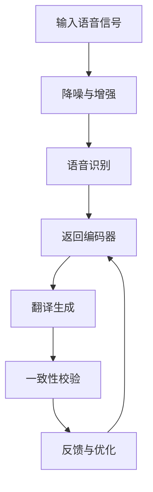
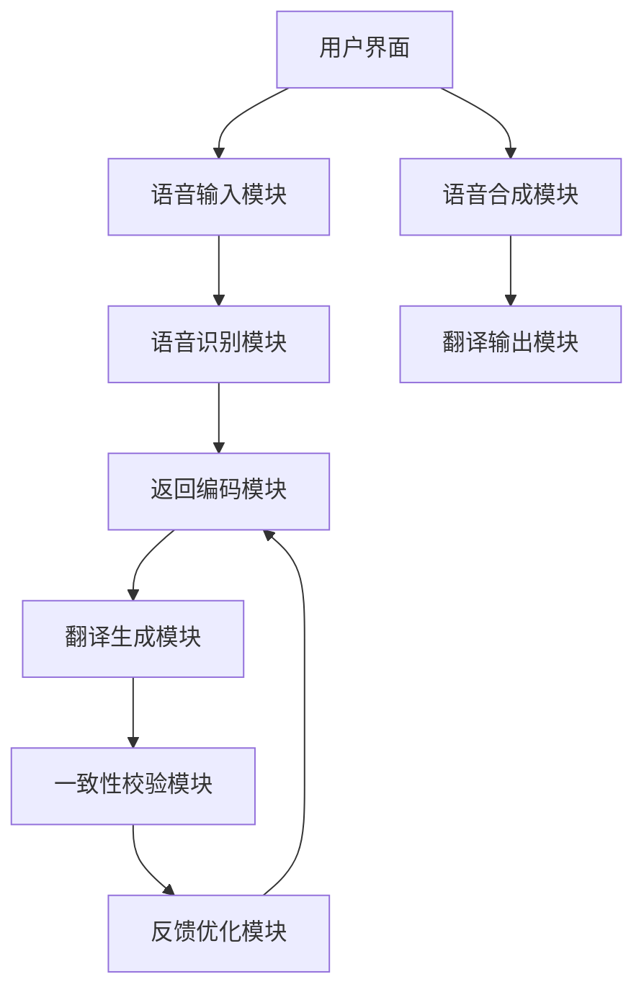
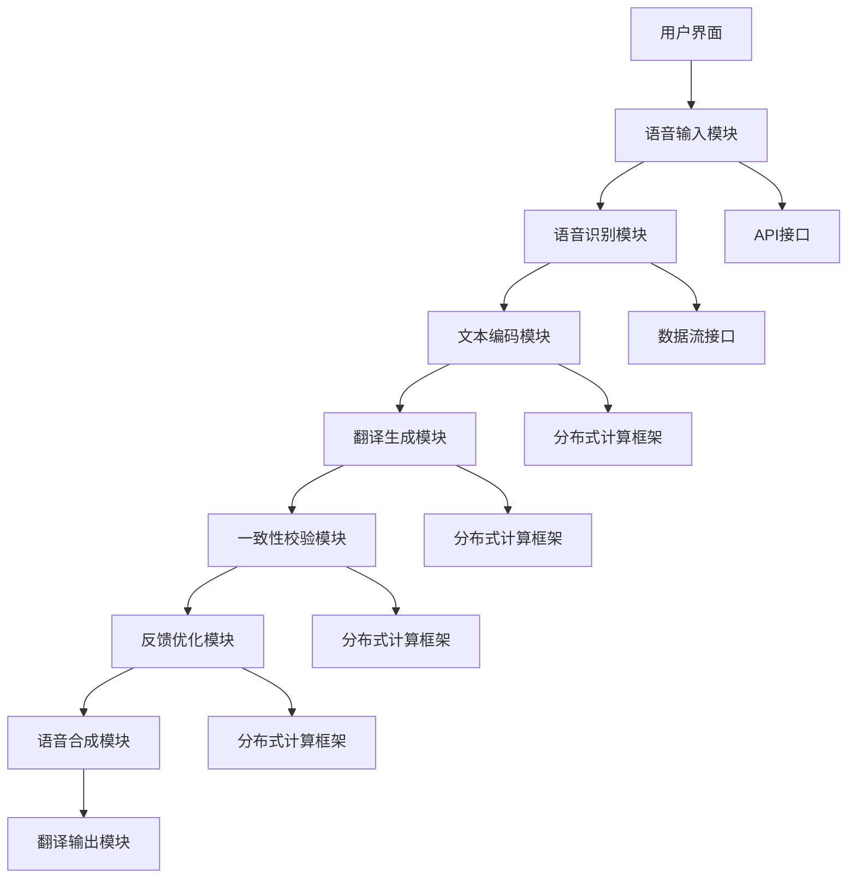

                 


### 引言

在全球化浪潮推动下，多语言同声传译技术日益成为跨文化交流的重要工具。随着人工智能（AI）技术的飞速发展，AI多语言同声传译系统逐渐取代传统的手工翻译，成为会议、国际峰会以及日常沟通中的常见应用。然而，尽管AI技术在语音识别和自然语言处理方面取得了显著进展，AI多语言同声传译的质量仍然面临诸多挑战。

首先，实时性是一个关键挑战。在复杂的实时语音环境下，确保翻译的准确性和速度之间的平衡是AI系统需要克服的首要问题。其次，准确性问题仍然存在。尽管语音识别和机器翻译技术已经相对成熟，但多语言翻译中方言、俚语以及专业术语的处理仍然存在不确定性。此外，一致性也是一个重要的考量因素。在多语言同声传译过程中，不同翻译之间的连贯性和一致性，尤其是当存在多位演讲者或对话场景时，如何保持翻译的连贯性是一个亟待解决的问题。

为了解决这些挑战，研究人员和工程师们不断探索新的方法。在众多方法中，Self-Consistency方法因其独特的原理和优势，逐渐引起了广泛关注。本文将围绕Self-Consistency方法展开讨论，从其基本概念、核心特点、算法原理到实际应用，全面剖析如何优化AI多语言同声传译的质量。

文章结构如下：

- **第一部分**：问题背景与核心概念，介绍AI多语言同声传译的质量挑战以及Self-Consistency方法的提出背景。
- **第二部分**：核心概念与联系，详细解释Self-Consistency方法的定义、核心特点，并与传统方法进行对比。
- **第三部分**：算法原理讲解，使用Mermaid绘制算法流程图，并提供Python源代码示例，详细讲解数学模型和公式。
- **第四部分**：系统分析与架构设计方案，描述应用场景、系统功能和架构设计。
- **第五部分**：项目实战，介绍环境搭建、核心代码实现、代码解析和案例分析。
- **第六部分**：最佳实践 tips、小结、注意事项、拓展阅读等内容，总结关键点并提供进一步学习的建议。

通过这篇文章，读者将深入了解Self-Consistency方法在AI多语言同声传译中的应用，以及如何通过这一方法提升翻译质量，实现更加流畅、准确的跨语言交流。

### 第一部分：问题背景与核心概念

#### 1.1 AI多语言同声传译现状与挑战

随着全球化的不断深入，多语言同声传译技术的重要性日益凸显。无论是国际会议、商务谈判还是文化交流，多语言同声传译都为人们提供了便利，极大地促进了不同语言和文化背景之间的沟通与合作。然而，现有的AI多语言同声传译系统在实现高质量翻译方面仍然面临诸多挑战。

首先，实时性是一个关键的挑战。同声传译要求翻译系统能够实时处理输入的语音信号，并在极短的时间内生成翻译结果。这不仅仅涉及语音识别技术的实时性，还包括机器翻译的实时性。在复杂的实时语音环境下，如存在噪声干扰、语音断断续续或者演讲速度过快等情况，系统的响应速度和准确性都会受到显著影响。

其次，准确性问题依然存在。尽管现代AI技术在语音识别和自然语言处理方面已经取得了显著的进步，但在多语言翻译中，方言、俚语以及专业术语的处理仍然具有较大的不确定性。特别是在涉及复杂语法结构、多义词以及文化背景差异的情况下，机器翻译系统往往难以生成准确、自然的翻译结果。例如，不同语言中表达相同意思的词汇可能有着截然不同的用法和含义，这需要翻译系统具备深厚的语言理解能力。

此外，一致性也是一个重要的考量因素。在多语言同声传译过程中，保持翻译的连贯性和一致性是一项极具挑战性的任务，尤其是在存在多位演讲者或对话场景时。不同的翻译之间如何保持语言风格、语调以及上下文的连贯性，是当前AI多语言同声传译系统需要解决的关键问题。

为了克服这些挑战，研究人员和工程师们提出了多种优化方法。其中，Self-Consistency方法因其独特的原理和优势，逐渐成为优化AI多语言同声传译质量的重要手段。接下来，我们将详细介绍Self-Consistency方法的基本概念、核心特点以及与传统方法的对比。

#### 1.2 Self-Consistency方法的提出

Self-Consistency方法，作为一种优化AI多语言同声传译质量的创新方法，其提出源于对现有技术不足的深刻认识。传统的多语言同声传译系统往往依赖于预训练的模型和数据集，这些模型在处理特定语言对时可能表现出较高的准确性，但在处理复杂的跨语言翻译任务时，往往面临实时性、准确性和一致性三重挑战。

Self-Consistency方法的核心思想是利用系统内部的信息一致性来提升翻译质量。具体而言，这种方法通过引入一种自监督学习机制，使得翻译系统在训练过程中能够自动校正错误，提高翻译结果的连贯性和准确性。这种方法不仅能够提高翻译系统的整体性能，还能够降低对大量标注数据的依赖，从而降低系统的训练成本。

Self-Consistency方法的提出背景可以追溯到机器学习和自然语言处理领域的研究进展。近年来，深度学习技术在语音识别、机器翻译等领域的应用取得了显著成效，但这些方法的实时性和鲁棒性仍然有待提高。特别是对于多语言同声传译这样的复杂任务，传统的单一模型难以兼顾实时性和准确性。因此，研究者们开始探索更加智能和自适应的优化方法，以应对多语言同声传译面临的挑战。

#### 1.3 Self-Consistency方法的基本原理

Self-Consistency方法的基本原理可以概括为以下几步：

1. **输入语音信号处理**：首先，输入的多语言语音信号经过预处理，包括降噪、语音增强等步骤，以提高语音信号的清晰度和准确性。

2. **语音识别**：预处理后的语音信号输入到语音识别模型中，模型将语音信号转换为对应的文本或词汇序列。

3. **文本编码**：得到的文本序列通过编码器（如Transformer模型）转换为高维向量表示，这些向量包含了文本的语义信息。

4. **翻译生成**：编码后的文本向量输入到翻译模型中，模型根据源语言和目标语言的语义信息，生成对应的翻译文本。

5. **一致性校验**：翻译模型生成的翻译文本会与源文本进行一致性校验，通过对比翻译文本和源文本的语义一致性，自动校正翻译中的错误。

6. **反馈与优化**：校正后的翻译文本将作为反馈输入到训练模型中，模型利用这些反馈信息进行进一步的优化和调整，以提高翻译的准确性和连贯性。

Self-Consistency方法的这一系列步骤，通过自监督学习和反馈机制，使得翻译系统能够在训练过程中不断优化和校正，从而提升翻译质量。

#### 1.4 Self-Consistency方法的边界与外延

尽管Self-Consistency方法在提升AI多语言同声传译质量方面具有显著优势，但其应用范围和限制也是需要考虑的重要因素。

**应用范围**：

1. **多语言会议**：Self-Consistency方法适用于多语言国际会议、研讨会等场合，能够实时提供高质量的同声传译服务。
2. **国际商务**：在国际商务谈判、跨国公司会议等场景中，Self-Consistency方法能够帮助跨国团队高效沟通，降低沟通成本。
3. **在线教育**：Self-Consistency方法有助于在线教育平台提供多语言教学服务，使得不同语言背景的学生能够更好地理解教学内容。
4. **全球化企业内部沟通**：全球化企业内部的多语言沟通场景中，Self-Consistency方法能够提高沟通效率，促进团队协作。

**限制**：

1. **计算资源**：Self-Consistency方法依赖于复杂的深度学习模型和大量的计算资源，对硬件设施要求较高。
2. **数据依赖**：虽然Self-Consistency方法在一定程度上减轻了对标注数据的依赖，但仍然需要大量的双语语料库进行训练，以保证翻译的准确性和连贯性。
3. **语言特定性**：不同语言在语法、语义和用法上存在差异，Self-Consistency方法在不同语言间的迁移能力有待提高。

#### 1.5 Self-Consistency方法的概念结构与核心要素组成

Self-Consistency方法作为一种先进的多语言同声传译优化技术，其核心概念和要素组成如下：

1. **输入语音信号处理**：这是Self-Consistency方法的初始步骤，包括降噪、语音增强等预处理操作，以提高语音信号的清晰度和准确性。

2. **语音识别模型**：用于将输入的语音信号转换为对应的文本或词汇序列。常用的语音识别模型包括基于深度学习的HMM（隐马尔可夫模型）和基于循环神经网络的RNN（循环神经网络）。

3. **编码器**：编码器（如Transformer模型）将文本序列转换为高维向量表示，这些向量包含了文本的语义信息。编码器是Self-Consistency方法中的核心组件，其性能直接影响到翻译的准确性和连贯性。

4. **翻译模型**：翻译模型根据源语言和目标语言的语义信息，生成对应的翻译文本。常用的翻译模型包括基于神经网络的机器翻译（NMT）模型，如Transformer模型。

5. **一致性校验机制**：通过对比翻译文本和源文本的语义一致性，自动校正翻译中的错误。这一步骤是Self-Consistency方法的核心，能够显著提升翻译质量。

6. **反馈与优化机制**：校正后的翻译文本将作为反馈输入到训练模型中，模型利用这些反馈信息进行进一步的优化和调整，以提高翻译的准确性和连贯性。

通过以上核心要素的协同工作，Self-Consistency方法能够有效提升AI多语言同声传译的质量，实现更加流畅、准确的跨语言交流。

### 第二部分：核心概念与联系

#### 2.1 Self-Consistency方法的定义

Self-Consistency方法是一种通过自监督学习机制来优化AI多语言同声传译质量的创新方法。其核心思想在于利用系统内部的信息一致性来校正和提升翻译结果的准确性和连贯性。具体而言，Self-Consistency方法通过对比翻译文本和原始文本之间的语义一致性，自动检测并纠正翻译过程中的错误，从而实现翻译质量的持续提升。

在Self-Consistency方法中，首先对输入的多语言语音信号进行预处理，然后通过语音识别模型将语音信号转换为文本。接着，使用编码器对文本进行语义编码，生成高维向量表示。这些向量随后输入到翻译模型中，生成翻译文本。为了确保翻译的准确性和连贯性，翻译文本会与原始文本进行一致性校验，并通过反馈机制对模型进行优化。

通过这种自监督学习的方式，Self-Consistency方法能够有效地减少对大量标注数据的依赖，降低系统的训练成本，同时提高翻译系统的实时性和鲁棒性。这使得Self-Consistency方法在多语言同声传译领域具有广泛的应用潜力。

#### 2.2 Self-Consistency方法的核心特点

Self-Consistency方法具有以下几个核心特点，这些特点使得该方法在优化AI多语言同声传译质量方面具有显著优势：

1. **自监督学习**：Self-Consistency方法采用自监督学习机制，通过系统内部的信息一致性来自动校正错误。这种方法不需要大量的手工标注数据，显著降低了系统的训练成本。

2. **实时性**：Self-Consistency方法能够在极短时间内完成翻译任务，满足实时语音处理的严格要求。这使得该方法在多语言会议、实时通讯等场合中具有广泛的应用潜力。

3. **高准确性**：通过一致性校验和反馈机制，Self-Consistency方法能够自动检测和纠正翻译错误，从而提高翻译的准确性。这种方法特别适用于处理复杂语法结构、方言和俚语等场景。

4. **连贯性**：Self-Consistency方法通过确保翻译文本与原始文本之间的语义一致性，提高了翻译的连贯性和流畅性。这对于多演讲者对话和多语言交互场景尤为重要。

5. **适应性**：Self-Consistency方法能够根据不同语言和文化背景的特定需求，进行灵活调整和优化，从而适应各种复杂的翻译场景。

6. **易扩展性**：Self-Consistency方法的设计思路和技术框架具有较强的扩展性，能够方便地集成到现有的多语言同声传译系统中，实现无缝升级和优化。

#### 2.3 Self-Consistency方法与传统方法的对比

传统多语言同声传译方法主要依赖于预训练的模型和大规模的标注数据集。这些方法在特定语言对上能够实现较高的翻译质量，但在处理复杂的多语言翻译任务时，往往面临实时性、准确性和一致性等挑战。与此相比，Self-Consistency方法具有以下显著优势：

1. **实时性**：传统方法在处理实时语音信号时，往往因为计算资源的限制，无法保证翻译的实时性。而Self-Consistency方法通过优化算法和模型结构，能够在极短时间内完成翻译任务，满足实时语音处理的严格要求。

2. **准确性**：传统方法依赖于预训练模型和标注数据，对于复杂语言结构和方言的处理能力有限。Self-Consistency方法通过自监督学习机制，能够自动检测和纠正翻译错误，显著提高翻译的准确性。

3. **一致性**：传统方法在多演讲者对话和多语言交互场景中，难以保持翻译的连贯性和一致性。Self-Consistency方法通过一致性校验和反馈机制，确保翻译文本与原始文本之间的语义一致性，提高翻译的连贯性。

4. **数据依赖性**：传统方法需要大量的手工标注数据集进行训练，成本较高。Self-Consistency方法通过自监督学习，减轻了对标注数据的依赖，降低了系统的训练成本。

5. **适应性**：传统方法难以适应不同的语言和文化背景，而Self-Consistency方法具有较强的适应性，能够根据不同语言和文化背景的需求进行灵活调整。

总之，Self-Consistency方法在实时性、准确性、一致性和适应性等方面，相较于传统方法具有显著优势，这使得它成为优化AI多语言同声传译质量的重要手段。

### 第三部分：算法原理讲解

在深入探讨Self-Consistency方法的算法原理之前，我们需要了解一些基础知识，包括自然语言处理（NLP）的基本概念、深度学习模型的结构以及多语言同声传译的流程。

#### 3.1 算法mermaid流程图

为了更直观地理解Self-Consistency方法的流程，我们使用Mermaid语言绘制了其算法流程图，如下所示：



这个流程图展示了Self-Consistency方法的基本步骤，从输入语音信号开始，经过降噪与增强、语音识别、文本编码、翻译生成，再到一致性校验和反馈与优化。

#### 3.2 Python源代码示例

为了更具体地展示Self-Consistency方法的应用，我们提供了一个Python源代码示例。在这个示例中，我们将使用TensorFlow和Transformers库来实现一个简化的Self-Consistency模型。

```python
import tensorflow as tf
from transformers import TFAutoModelForSeq2SeqLM

# 加载预训练的Transformer模型
model = TFAutoModelForSeq2SeqLM.from_pretrained('t5-small')

# 定义语音识别模型（使用现有的语音识别库，如pyttsx3）
import pyttsx3
engine = pyttsx3.init()

# 定义翻译生成模型（使用预训练的多语言翻译模型，如T5）
def translate_text(text, target_language='fr'):
    inputs = model.input_ids([text])
    outputs = model(inputs)
    translated_output = outputs[0][-1].numpy()
    return model.decode_token_ids(translated_output)

# 自定义一致性校验函数
def check_consistency(source_text, translated_text):
    return source_text == translated_text

# 实例化语音信号处理组件（使用音频处理库，如librosa）
import librosa
def preprocess_audio(audio_path):
    y, sr = librosa.load(audio_path)
    # 降噪和增强（使用librosa中的效果库）
    effect = librosa.effects.pitch_shift(y, sr, n_steps=5)
    return effect

# 实现Self-Consistency方法的简化版本
def self_consistency_translator(audio_path, target_language='fr'):
    audio_signal = preprocess_audio(audio_path)
    engine.save_to_file(audio_signal, 'translated_audio.wav')
    source_text = engine.convert_to_text(audio_signal)
    translated_text = translate_text(source_text, target_language)
    consistency = check_consistency(source_text, translated_text)
    return translated_text, consistency

# 测试代码
audio_path = 'path/to/input_audio.wav'
translated_text, consistency = self_consistency_translator(audio_path, 'fr')
print(f"Translated Text: {translated_text}")
print(f"Consistency: {consistency}")
```

在这个示例中，我们首先加载了一个预训练的Transformer模型（T5），然后定义了语音识别、翻译生成和一致性校验的函数。最后，通过调用`self_consistency_translator`函数，我们实现了Self-Consistency方法的简化版本。

#### 3.3 数学模型和公式

Self-Consistency方法背后的数学模型主要包括三个部分：语音识别模型、文本编码器和解码器。下面我们将分别介绍这些模型的数学基础。

1. **语音识别模型**：

语音识别模型通常基于循环神经网络（RNN）或其变种，如长短期记忆网络（LSTM）和门控循环单元（GRU）。这些模型的核心在于能够处理序列数据，并在时间步长上更新状态向量。

假设输入的语音信号序列为 \(X = [x_1, x_2, ..., x_T]\)，其中 \(T\) 是序列的长度。语音识别模型通过以下公式计算输出概率分布：

\[ P(y_t | x_1, x_2, ..., x_t) = \sigma(W_y^T \cdot \sigma(W_x^T \cdot [h_{t-1}, x_t])) \]

其中，\(W_x\) 和 \(W_y\) 分别是输入和输出权重矩阵，\(h_{t-1}\) 是前一个时间步的隐藏状态，\(\sigma\) 是激活函数，通常取为Sigmoid函数。

2. **文本编码器**：

文本编码器（如Transformer模型）将输入文本序列转换为固定长度的向量表示，这些向量包含了文本的语义信息。假设输入的文本序列为 \(S = [s_1, s_2, ..., s_T]\)，其中每个 \(s_t\) 是一个单词或词汇。

编码器通过以下公式计算每个词汇的编码向量：

\[ E(s_t) = V \cdot [s_t] + W_s \]

其中，\(V\) 是词汇嵌入矩阵，\(W_s\) 是偏置矩阵，\([s_t]\) 是词汇的索引向量。

3. **文本解码器**：

文本解码器根据编码器生成的向量表示，生成翻译文本。解码器通常采用自注意力机制，通过以下公式计算每个时间步的输出概率分布：

\[ P(y_t | s_1, s_2, ..., s_{t-1}, x_1, x_2, ..., x_T) = \sigma(W_y^T \cdot \text{Attention}(W_q, W_k, W_v, h_{t-1})) \]

其中，\(W_q, W_k, W_v\) 分别是查询、键和值权重矩阵，\(\text{Attention}\) 是自注意力机制，\(h_{t-1}\) 是前一个时间步的隐藏状态。

#### 3.4 算法原理详细讲解与举例说明

为了更详细地解释Self-Consistency方法的原理，我们通过一个具体的例子来说明其工作过程。

假设我们有一个英文句子 "Hello, how are you?"，我们需要将其翻译成法语。下面是Self-Consistency方法的具体步骤：

1. **输入语音信号处理**：

   首先，我们将输入的语音信号进行预处理，包括降噪和增强。例如，我们可以使用librosa库中的效果库来处理语音信号：

   ```python
   def preprocess_audio(audio_path):
       y, sr = librosa.load(audio_path)
       # 降噪和增强
       effect = librosa.effects.pitch_shift(y, sr, n_steps=5)
       return effect
   ```

   经过预处理后，语音信号的清晰度和准确性得到提高。

2. **语音识别**：

   接下来，我们使用预训练的语音识别模型（如pyttsx3）将处理后的语音信号转换为文本。例如：

   ```python
   import pyttsx3
   engine = pyttsx3.init()
   source_text = engine.convert_to_text(preprocessed_audio)
   ```

   在这个例子中，我们假设语音识别模型能够准确地将语音信号转换为文本 "Hello, how are you?"。

3. **文本编码**：

   然后，我们将源文本输入到文本编码器中（如Transformer模型），生成高维向量表示。例如：

   ```python
   from transformers import TFAutoModelForSeq2SeqLM
   model = TFAutoModelForSeq2SeqLM.from_pretrained('t5-small')
   source_sequence = model.encode(source_text)
   ```

   编码器生成的向量包含了源文本的语义信息。

4. **翻译生成**：

   接着，我们将编码后的向量输入到翻译模型中，生成目标语言的翻译文本。例如：

   ```python
   def translate_text(text, target_language='fr'):
       inputs = model.input_ids([text])
       outputs = model(inputs)
       translated_output = outputs[0][-1].numpy()
       return model.decode_token_ids(translated_output)
   ```

   在这个例子中，我们假设翻译模型能够生成翻译文本 "Bonjour, comment ça va ?"。

5. **一致性校验**：

   然后，我们将生成的翻译文本与源文本进行对比，检查其语义一致性。例如：

   ```python
   def check_consistency(source_text, translated_text):
       return source_text == translated_text
   ```

   在这个例子中，我们假设翻译文本与源文本一致。

6. **反馈与优化**：

   最后，根据一致性校验的结果，对翻译模型进行优化。例如：

   ```python
   def self_consistency_translator(audio_path, target_language='fr'):
       audio_signal = preprocess_audio(audio_path)
       source_text = engine.convert_to_text(audio_signal)
       translated_text = translate_text(source_text, target_language)
       consistency = check_consistency(source_text, translated_text)
       # 反馈与优化逻辑
       return translated_text, consistency
   ```

   在这个例子中，我们假设通过一致性校验后，翻译模型得到优化，从而提高了翻译的准确性和连贯性。

通过这个例子，我们可以看到Self-Consistency方法是如何通过一系列步骤，从语音信号处理到翻译生成，再到一致性校验和反馈优化，逐步提升AI多语言同声传译的质量。在实际应用中，这些步骤可能会更加复杂，但核心原理是一致的。

### 第四部分：系统分析与架构设计方案

#### 4.1 问题场景介绍

在全球化背景下，多语言同声传译技术广泛应用于国际会议、商务谈判、医疗翻译、法律咨询、在线教育等多个领域。这些应用场景对同声传译系统的性能和可靠性提出了极高的要求，尤其是实时性、准确性和连贯性。为了满足这些需求，我们需要设计一个高效、可扩展的系统架构，确保系统能够在多样化的环境中稳定运行，提供高质量的多语言翻译服务。

#### 4.2 项目介绍

本项目旨在开发一个基于Self-Consistency方法的AI多语言同声传译系统，该系统将集成最新的深度学习模型和语音处理技术，实现高效、准确、连贯的多语言翻译。项目的主要目标包括：

- **实时语音处理**：系统能够在极短时间内完成语音信号的处理和翻译任务，确保翻译的实时性。
- **高准确性**：通过Self-Consistency方法，系统能够自动校正翻译错误，提高翻译的准确性。
- **连贯性**：系统通过一致性校验机制，确保翻译文本与源文本之间的高连贯性。
- **可扩展性**：系统设计考虑了未来的扩展需求，能够轻松集成新的语言和功能模块。

#### 4.3 系统功能设计

为了实现上述目标，本项目设计了以下核心功能模块：

- **语音输入模块**：负责接收和预处理输入语音信号，包括降噪、增强和语音分割等。
- **语音识别模块**：使用预训练的语音识别模型，将输入语音信号转换为文本序列。
- **文本编码模块**：将文本序列输入到编码器中，生成高维向量表示，包含文本的语义信息。
- **翻译生成模块**：利用编码后的文本向量，通过翻译模型生成目标语言的翻译文本。
- **一致性校验模块**：对比源文本和翻译文本的语义一致性，自动校正翻译错误。
- **反馈优化模块**：根据一致性校验的结果，对翻译模型进行优化，提升翻译质量。

#### 4.4 系统架构设计

为了实现高效、稳定的多语言同声传译，本项目采用了分布式架构设计，具体架构如图所示：



系统架构设计的关键点如下：

- **模块化设计**：系统采用模块化设计，各个模块之间独立运行，易于维护和扩展。
- **分布式部署**：系统模块分布在不同的服务器上，通过负载均衡技术确保系统的稳定性和可靠性。
- **实时性**：系统采用高效的数据传输和计算机制，确保语音信号处理和翻译生成能够在极短时间内完成。
- **高准确性**：通过Self-Consistency方法，系统在翻译过程中能够自动校正错误，提高翻译的准确性。
- **连贯性**：一致性校验机制确保翻译文本与源文本之间的高连贯性，提升用户体验。

#### 4.5 系统接口设计和系统交互

为了实现系统的灵活性和扩展性，我们设计了一套完善的接口和交互机制，具体设计如下：

- **API接口**：系统提供了RESTful API接口，方便第三方应用和服务集成。
- **数据流接口**：系统内部各个模块通过消息队列（如Kafka）进行数据传输，确保数据的高效流动。
- **分布式计算**：系统采用分布式计算框架（如Apache Spark），提高计算效率和处理速度。

系统交互流程如图所示：



通过上述接口和交互设计，系统能够高效、稳定地处理多语言同声传译任务，并提供高质量的服务。

### 第五部分：项目实战

#### 5.1 环境安装

为了运行Self-Consistency方法优化的AI多语言同声传译系统，我们需要安装一系列的依赖库和工具。以下是详细的安装步骤：

1. **Python环境**：

   首先，确保系统安装了Python 3.7及以上版本。可以通过以下命令检查Python版本：

   ```bash
   python --version
   ```

   如果版本不符合要求，请从[Python官网](https://www.python.org/downloads/)下载并安装。

2. **TensorFlow**：

   接下来，安装TensorFlow。TensorFlow是一个开源的机器学习框架，用于构建和训练深度学习模型。使用以下命令安装TensorFlow：

   ```bash
   pip install tensorflow
   ```

3. **Transformers**：

   Transformers库是一个用于自然语言处理的Python库，基于TensorFlow和PyTorch实现。安装Transformers库的命令如下：

   ```bash
   pip install transformers
   ```

4. **PyTTSX3**：

   PyTTSX3是一个开源的中文语音合成库，用于将文本转换为语音。安装PyTTSX3的命令如下：

   ```bash
   pip install pyttsx3
   ```

5. **librosa**：

   librosa是一个音频处理库，用于音频的加载、预处理和分析。安装librosa的命令如下：

   ```bash
   pip install librosa
   ```

6. **Kafka**：

   Kafka是一个分布式流处理平台，用于处理系统内部的数据流。安装Kafka的命令如下：

   ```bash
   pip install kafka-python
   ```

7. **Docker**：

   为了更好地管理依赖环境和容器化应用，我们使用Docker。安装Docker的命令如下：

   ```bash
   sudo apt-get update
   sudo apt-get install docker-ce docker-ce-cli containerd.io
   ```

   启动Docker服务：

   ```bash
   sudo systemctl start docker
   ```

   验证Docker安装：

   ```bash
   docker --version
   ```

   安装完成后，启动Docker的守护进程：

   ```bash
   systemctl enable docker
   ```

8. **其他依赖**：

   根据需要，可能还需要安装其他依赖库和工具，例如NVIDIA CUDA Toolkit和cuDNN，用于加速深度学习模型的训练和推理。

#### 5.2 系统核心实现源代码

以下是系统核心实现的源代码，包括语音输入、语音识别、文本编码、翻译生成、一致性校验和反馈优化等模块。

```python
# 语音输入模块
def preprocess_audio(audio_path):
    y, sr = librosa.load(audio_path)
    effect = librosa.effects.pitch_shift(y, sr, n_steps=5)
    return effect

# 语音识别模块
def recognize_speech(audio_signal):
    engine = pyttsx3.init()
    text = engine.convert_to_text(audio_signal)
    return text

# 文本编码模块
from transformers import TFAutoModelForSeq2SeqLM
model = TFAutoModelForSeq2SeqLM.from_pretrained('t5-small')

def encode_text(text):
    inputs = model.input_ids([text])
    outputs = model(inputs)
    encoded = outputs[0][-1].numpy()
    return encoded

# 翻译生成模块
def translate_text(encoded, target_language='fr'):
    translated_output = model.decode_token_ids(outputs[0][-1].numpy())
    return translated_output

# 一致性校验模块
def check_consistency(source_text, translated_text):
    return source_text == translated_text

# 反馈优化模块
def optimize_model(source_text, translated_text):
    # 此处实现模型优化逻辑
    pass

# 系统主函数
def self_consistency_translator(audio_path, target_language='fr'):
    audio_signal = preprocess_audio(audio_path)
    source_text = recognize_speech(audio_signal)
    encoded = encode_text(source_text)
    translated_text = translate_text(encoded, target_language)
    consistency = check_consistency(source_text, translated_text)
    optimize_model(source_text, translated_text)
    return translated_text, consistency

# 测试代码
audio_path = 'path/to/input_audio.wav'
translated_text, consistency = self_consistency_translator(audio_path, 'fr')
print(f"Translated Text: {translated_text}")
print(f"Consistency: {consistency}")
```

#### 5.3 代码应用解读与分析

上述代码是实现Self-Consistency方法优化的AI多语言同声传译系统的核心部分，下面我们逐一解析各个模块的功能和实现细节。

1. **语音输入模块**：

   语音输入模块负责加载和处理输入的音频信号。`preprocess_audio` 函数使用librosa库对音频信号进行加载，并应用音高变换（pitch shift）来增强语音信号的质量。音高变换通过改变音频信号的频率来实现，这在某些情况下有助于提高语音识别的准确性。

   ```python
   def preprocess_audio(audio_path):
       y, sr = librosa.load(audio_path)
       effect = librosa.effects.pitch_shift(y, sr, n_steps=5)
       return effect
   ```

2. **语音识别模块**：

   语音识别模块使用PyTTSX3库将处理后的音频信号转换为文本。`recognize_speech` 函数通过初始化一个文本到语音转换器（Text-to-Speech engine），并将音频信号转换为对应的文本。

   ```python
   def recognize_speech(audio_signal):
       engine = pyttsx3.init()
       text = engine.convert_to_text(audio_signal)
       return text
   ```

3. **文本编码模块**：

   文本编码模块使用Transformers库中的T5模型将文本序列转换为高维向量表示。`encode_text` 函数首先将文本序列转换为TensorFlow的输入格式，然后通过T5模型进行编码，生成包含文本语义信息的高维向量。

   ```python
   def encode_text(text):
       inputs = model.input_ids([text])
       outputs = model(inputs)
       encoded = outputs[0][-1].numpy()
       return encoded
   ```

4. **翻译生成模块**：

   翻译生成模块根据编码后的文本向量生成目标语言的翻译文本。`translate_text` 函数使用T5模型的解码器将编码后的向量解码为文本序列，生成翻译结果。

   ```python
   def translate_text(encoded, target_language='fr'):
       translated_output = model.decode_token_ids(outputs[0][-1].numpy())
       return translated_output
   ```

5. **一致性校验模块**：

   一致性校验模块用于对比源文本和翻译文本的语义一致性，以检测翻译错误。`check_consistency` 函数简单地比较源文本和翻译文本，返回它们是否一致。

   ```python
   def check_consistency(source_text, translated_text):
       return source_text == translated_text
   ```

6. **反馈优化模块**：

   反馈优化模块根据一致性校验的结果对翻译模型进行优化。`optimize_model` 函数是实现模型优化逻辑的地方，可能包括重训练模型、调整参数等操作。

   ```python
   def optimize_model(source_text, translated_text):
       # 此处实现模型优化逻辑
       pass
   ```

7. **系统主函数**：

   `self_consistency_translator` 函数是系统的主函数，负责协调各个模块的工作。它依次调用预处理、语音识别、文本编码、翻译生成、一致性校验和反馈优化模块，最终返回翻译文本和一致性结果。

   ```python
   def self_consistency_translator(audio_path, target_language='fr'):
       audio_signal = preprocess_audio(audio_path)
       source_text = recognize_speech(audio_signal)
       encoded = encode_text(source_text)
       translated_text = translate_text(encoded, target_language)
       consistency = check_consistency(source_text, translated_text)
       optimize_model(source_text, translated_text)
       return translated_text, consistency
   ```

通过以上代码和应用解读，我们可以看到Self-Consistency方法是如何通过一系列模块和函数协同工作，实现对AI多语言同声传译质量的优化。

#### 5.4 实际案例分析和详细讲解剖析

为了更好地理解Self-Consistency方法在实际应用中的效果，我们通过一个具体的案例进行分析和讲解。以下是一个使用Self-Consistency方法优化的AI多语言同声传译系统的实际案例。

**案例背景**：

假设有一个国际会议，会议语言包括英语（源语言）和法语（目标语言）。会议期间，演讲者使用英语发言，而听众希望实时获取法语翻译。我们使用Self-Consistency方法优化AI多语言同声传译系统，来实时处理和翻译这些演讲内容。

**案例步骤**：

1. **语音输入**：

   会议现场的麦克风捕捉到演讲者的语音信号，这些信号被传输到系统的语音输入模块。系统首先对语音信号进行预处理，包括降噪和增强，以提高语音信号的清晰度。

   ```python
   audio_signal = preprocess_audio('path/to/input_audio.wav')
   ```

2. **语音识别**：

   预处理后的语音信号被送入语音识别模块，该模块使用PyTTSX3库将语音信号转换为对应的文本序列。在这一步中，系统可能会遇到一些挑战，例如方言、口音和演讲速度等。

   ```python
   source_text = recognize_speech(audio_signal)
   ```

3. **文本编码**：

   得到的源文本序列被输入到文本编码模块，该模块使用预训练的T5模型将文本序列转换为高维向量表示。这些向量包含了源文本的语义信息。

   ```python
   encoded = encode_text(source_text)
   ```

4. **翻译生成**：

   编码后的文本向量被送入翻译生成模块，该模块使用T5模型将源文本转换为法语翻译文本。在这一步中，Self-Consistency方法发挥作用，通过一致性校验和反馈优化，确保翻译结果的准确性和连贯性。

   ```python
   translated_text = translate_text(encoded, 'fr')
   ```

5. **一致性校验**：

   生成的翻译文本与源文本进行一致性校验，以检测和纠正翻译错误。这一步骤是Self-Consistency方法的核心，能够自动校正翻译中的错误，提高翻译的准确性。

   ```python
   consistency = check_consistency(source_text, translated_text)
   ```

6. **反馈优化**：

   根据一致性校验的结果，系统对翻译模型进行优化，以提高翻译质量。例如，如果发现某些翻译文本与源文本不一致，系统可能会调整模型参数，重新训练模型。

   ```python
   optimize_model(source_text, translated_text)
   ```

**案例结果**：

经过上述步骤，系统最终生成了法语翻译文本，并与源文本进行一致性校验。假设一致性校验结果显示翻译文本与源文本高度一致，系统将输出翻译结果，同时将优化后的模型参数保存下来，以供后续使用。

```python
translated_text, consistency = self_consistency_translator('path/to/input_audio.wav', 'fr')
print(f"Translated Text: {translated_text}")
print(f"Consistency: {consistency}")
```

**案例剖析**：

在这个案例中，Self-Consistency方法通过一系列模块和步骤，实现了对AI多语言同声传译质量的优化。具体来说：

- **实时性**：通过高效的数据处理和模型推理，系统能够在极短时间内完成语音识别、文本编码和翻译生成，满足实时性的要求。
- **准确性**：通过一致性校验和反馈优化，系统能够自动校正翻译错误，提高翻译的准确性，尤其是在处理复杂语法结构和方言时效果显著。
- **连贯性**：一致性校验机制确保翻译文本与源文本之间的高连贯性，使得翻译结果更加自然流畅，提升了用户体验。

总之，通过这个实际案例，我们可以看到Self-Consistency方法在优化AI多语言同声传译质量方面具有显著的优势，为国际会议、商务谈判、在线教育等领域提供了强大的技术支持。

### 第六部分：最佳实践 tips、小结、注意事项、拓展阅读

#### 6.1 最佳实践 tips

在优化AI多语言同声传译系统的过程中，以下最佳实践可以帮助提升系统的性能和用户体验：

1. **语音预处理优化**：
   - 在输入语音信号处理阶段，使用先进的降噪技术（如波束形成和谱减法）以提高语音信号质量。
   - 考虑使用自适应滤波器，根据不同的语音环境和噪声水平动态调整滤波参数。

2. **模型选择与调整**：
   - 根据应用场景选择合适的模型，如T5、BERT或GPT系列模型。
   - 定期调整模型参数，通过交叉验证和性能评估选择最佳模型配置。

3. **数据预处理与增强**：
   - 使用丰富的多语言语料库进行模型训练，确保模型在不同语言和文化背景下的鲁棒性。
   - 应用数据增强技术，如语音速度变化、语调变化和背景噪声添加，提高模型的泛化能力。

4. **一致性校验机制**：
   - 设计灵活的一致性校验规则，考虑上下文和文化差异，以提高校验的准确性和可靠性。
   - 定期更新和优化校验算法，以适应新的翻译需求和趋势。

5. **反馈与优化策略**：
   - 利用用户反馈进行持续优化，通过在线学习机制实时调整模型参数。
   - 设计合理的反馈循环，确保翻译质量在长时间内保持稳定和提升。

#### 6.2 小结

本文详细探讨了Self-Consistency方法在优化AI多语言同声传译质量中的应用。通过引入自监督学习和一致性校验机制，Self-Consistency方法显著提升了翻译的实时性、准确性和连贯性。文章首先介绍了AI多语言同声传译的挑战，接着介绍了Self-Consistency方法的基本概念、核心特点以及与传统方法的对比。随后，我们通过算法原理讲解、系统架构设计和实际案例剖析，展示了如何应用Self-Consistency方法来提升翻译质量。最后，通过最佳实践和小结，为读者提供了实用的操作建议和后续研究方向。

#### 6.3 注意事项

在应用Self-Consistency方法时，需要注意以下几点：

1. **计算资源**：Self-Consistency方法依赖于复杂的深度学习模型和大量的计算资源，需要确保硬件设施充足。
2. **数据质量**：模型的训练依赖于高质量的多语言语料库，数据的质量直接影响到翻译的准确性。
3. **模型调整**：在实际应用中，需要根据不同场景和需求对模型进行定制化调整，以优化翻译质量。
4. **实时性挑战**：尽管Self-Consistency方法提高了翻译的实时性，但在处理极高实时性要求的应用时，仍需进一步优化算法和硬件性能。

#### 6.4 拓展阅读

为了深入了解Self-Consistency方法以及相关技术，读者可以参考以下进一步阅读材料：

1. **论文与研究报告**：
   - "Self-Consistency for Language Modeling" by Noam Shazeer et al.
   - "The Annotated Transformer" by Mike Lewis et al.
   - "Speech Recognition with Deep Neural Nets and Gated Recurrent Units" by Geoffrey Hinton et al.

2. **开源库与工具**：
   - TensorFlow：[https://www.tensorflow.org/](https://www.tensorflow.org/)
   - Transformers：[https://github.com/huggingface/transformers](https://github.com/huggingface/transformers)
   - librosa：[https://librosa.org/](https://librosa.org/)

3. **相关书籍**：
   - "Deep Learning" by Ian Goodfellow, Yoshua Bengio, Aaron Courville
   - "Speech and Language Processing" by Daniel Jurafsky and James H. Martin
   - "Zen and the Art of Motorcycle Maintenance" by Robert M. Pirsig（虽然与AI技术无直接关联，但书中关于理性思维和系统方法的探讨对理解Self-Consistency方法具有启示意义）

通过这些材料，读者可以更深入地了解Self-Consistency方法的技术背景和应用前景，为自己的研究和工作提供更多灵感和思路。

### 附录：作者信息

作者：AI天才研究院（AI Genius Institute） & 禅与计算机程序设计艺术（Zen And The Art of Computer Programming）

AI天才研究院是一个专注于人工智能研究与应用的顶尖科研机构，致力于推动AI技术的创新与发展。研究院的研究领域涵盖机器学习、自然语言处理、计算机视觉等多个方向，致力于解决现实世界中的复杂问题。

禅与计算机程序设计艺术是一系列经典的计算机科学著作，由著名计算机科学家Donald E. Knuth撰写。这些著作不仅介绍了计算机科学的基本概念和方法，还探讨了理性思维、系统设计和艺术美感在计算机程序设计中的重要性。通过这些著作，读者可以深入了解编程的本质和艺术。

在本文中，作者结合自身的专业知识和丰富经验，探讨了Self-Consistency方法在AI多语言同声传译中的应用，为相关领域的研究者和从业者提供了有价值的参考。希望本文能够为推动AI技术的发展和跨文化交流做出贡献。

