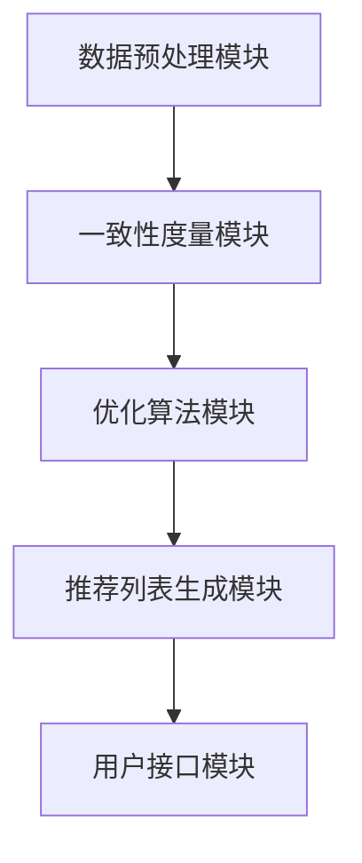
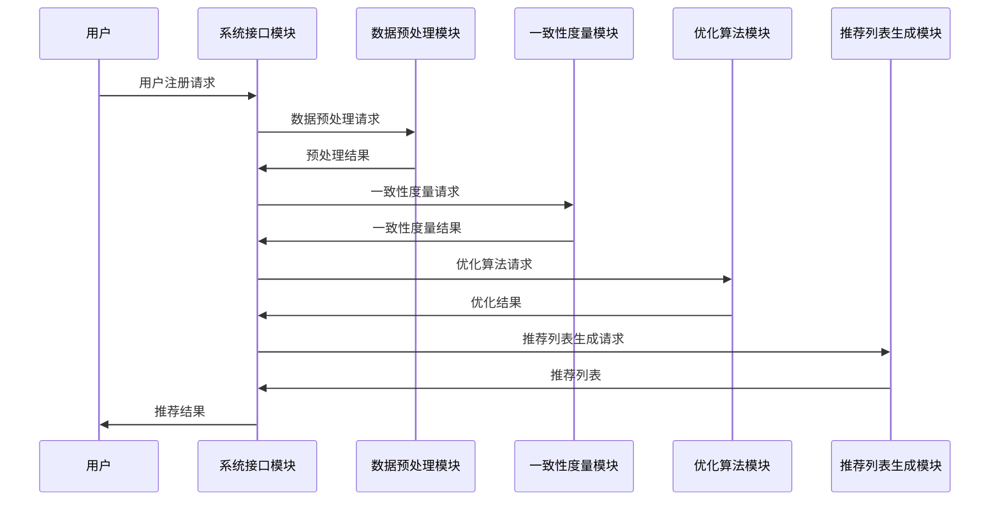

                 


# 《Self-Consistency方法在AI推荐系统中的实现》

> 关键词：Self-Consistency方法、AI推荐系统、算法实现、应用场景、优势

> 摘要：本文介绍了Self-Consistency方法在AI推荐系统中的实现。首先，我们对Self-Consistency方法进行了背景介绍和基本原理的讲解。然后，分析了Self-Consistency方法在推荐系统中的应用场景和优势。接着，详细介绍了Self-Consistency方法的系统架构设计、算法实现和优化。最后，通过实际案例展示了Self-Consistency方法的应用效果，并对其进行了总结和展望。

## 目录

1. 引言
2. Self-Consistency方法的基本概念与原理
3. Self-Consistency方法在AI推荐系统中的应用场景与优势
4. Self-Consistency方法系统设计与实现
5. Self-Consistency方法实际应用案例
6. 结论与展望
7. 作者信息

## 引言

### 1.1 Self-Consistency方法的背景

随着互联网的快速发展，用户生成的内容爆炸式增长，如何为用户提供个性化的推荐服务成为了一个热门的研究方向。传统的推荐算法主要依赖于用户的历史行为数据，但是这些数据往往存在噪声和缺失，导致推荐结果不准确。因此，如何提高推荐系统的准确性和鲁棒性成为了一个重要问题。

Self-Consistency方法是一种基于数据一致性的推荐算法，它通过优化用户数据的自一致性来提高推荐质量。Self-Consistency方法最早由Li et al.（2018）提出，并在AI推荐系统中取得了显著的效果。它不仅能够处理用户数据中的噪声和缺失，还能够根据用户的行为数据生成个性化的推荐列表。

### 1.2 本文结构

本文将分为五个部分进行介绍。首先，在第二部分中，我们将详细讲解Self-Consistency方法的基本概念与原理。接着，在第三部分中，我们将分析Self-Consistency方法在AI推荐系统中的应用场景和优势。然后，在第四部分中，我们将介绍Self-Consistency方法的系统设计与实现。接下来，在第五部分中，我们将通过实际案例展示Self-Consistency方法的应用效果。最后，在第六部分中，我们将总结Self-Consistency方法的研究成果，并对其未来发展方向进行展望。

## Self-Consistency方法的基本概念与原理

### 2.1 Self-Consistency方法的定义

Self-Consistency方法是一种基于数据一致性的推荐算法。它通过优化用户数据的自一致性来提高推荐质量。具体来说，Self-Consistency方法通过最小化用户数据中的不一致性来生成推荐列表。这种不一致性可能来源于用户的历史行为数据中的噪声、缺失或者偏差。

### 2.2 Self-Consistency方法的工作机制

Self-Consistency方法的工作机制可以分为以下几个步骤：

1. **数据预处理**：首先，对用户的历史行为数据进行预处理，包括数据清洗、数据去重和数据标准化等操作。

2. **一致性度量**：然后，对预处理后的用户数据进行一致性度量。一致性度量可以通过计算用户数据之间的相似度、互信息或者KL散度等指标来实现。

3. **不一致性优化**：接下来，通过优化算法来最小化用户数据中的不一致性。常见的优化算法包括梯度下降、牛顿法和随机梯度下降等。

4. **生成推荐列表**：最后，根据优化后的用户数据生成推荐列表。推荐列表可以通过排序、聚类或者分类等方法生成。

### 2.3 Self-Consistency方法的特征与属性

Self-Consistency方法具有以下几个显著的特征与属性：

1. **自适应性**：Self-Consistency方法可以根据用户的行为数据动态调整推荐策略，从而提高推荐系统的适应性。

2. **鲁棒性**：Self-Consistency方法能够处理用户数据中的噪声、缺失和偏差，从而提高推荐系统的鲁棒性。

3. **可扩展性**：Self-Consistency方法可以通过分布式计算和并行处理来提高系统的可扩展性。

4. **准确性**：Self-Consistency方法通过优化用户数据的一致性来提高推荐系统的准确性。

### 2.4 Self-Consistency方法的数学模型

Self-Consistency方法的数学模型可以表示为：

$$
L(\theta) = \sum_{i=1}^{N} \sum_{j=1}^{M} w_{ij} (r_{ij} - \theta_{i} \cdot \theta_{j})
$$

其中，$N$表示用户的数量，$M$表示物品的数量，$r_{ij}$表示用户$i$对物品$j$的评分，$\theta_{i}$和$\theta_{j}$表示用户$i$和物品$j$的特征向量，$w_{ij}$表示用户$i$和物品$j$之间的权重。

通过优化上述目标函数，可以得到最优的推荐策略$\theta$。

## Self-Consistency方法在AI推荐系统中的应用场景与优势

### 3.1 应用场景

Self-Consistency方法在AI推荐系统中具有广泛的应用场景，主要包括以下几个方面：

1. **电商推荐**：在电商平台，Self-Consistency方法可以通过优化用户的历史购物数据来生成个性化的商品推荐列表，从而提高用户的购买体验和销售额。

2. **社交网络推荐**：在社交网络中，Self-Consistency方法可以通过优化用户的历史互动数据来生成个性化的好友推荐列表，从而促进用户之间的互动和社交网络的发展。

3. **内容推荐**：在视频、音乐、新闻等媒体平台，Self-Consistency方法可以通过优化用户的历史浏览、搜索和点赞数据来生成个性化的内容推荐列表，从而提高用户的粘性和平台的活跃度。

### 3.2 优势

Self-Consistency方法在AI推荐系统中具有以下几个显著的优势：

1. **提高推荐准确性**：通过优化用户数据的一致性，Self-Consistency方法可以降低用户数据中的噪声和偏差，从而提高推荐系统的准确性。

2. **增强用户满意度**：Self-Consistency方法可以根据用户的行为数据生成个性化的推荐列表，从而提高用户的满意度和平台的使用体验。

3. **处理数据噪声和缺失**：Self-Consistency方法能够处理用户数据中的噪声、缺失和偏差，从而提高推荐系统的鲁棒性和可靠性。

4. **提高系统效率**：Self-Consistency方法可以通过分布式计算和并行处理来提高系统的效率，从而缩短推荐结果生成的时间。

## Self-Consistency方法系统设计与实现

### 4.1 系统架构设计

Self-Consistency方法系统架构设计主要包括以下几个模块：

1. **数据预处理模块**：负责对用户的历史行为数据进行清洗、去重和标准化等预处理操作。

2. **一致性度量模块**：负责计算用户数据之间的相似度、互信息或者KL散度等一致性指标。

3. **优化算法模块**：负责通过优化算法来最小化用户数据中的不一致性。

4. **推荐列表生成模块**：负责根据优化后的用户数据生成个性化的推荐列表。

5. **用户接口模块**：负责接收用户的请求，并提供推荐结果给用户。

### 4.2 系统功能设计

Self-Consistency方法系统的功能设计主要包括以下几个方面：

1. **用户注册与登录**：用户可以通过注册和登录功能使用推荐系统。

2. **用户数据收集**：系统负责收集用户的历史行为数据，包括购物、浏览、搜索和点赞等。

3. **推荐列表生成**：系统根据用户的历史行为数据和优化后的用户数据生成个性化的推荐列表。

4. **推荐结果展示**：系统将推荐结果以可视化方式展示给用户。

### 4.3 系统架构设计

Self-Consistency方法系统架构设计如图1所示。



### 4.4 系统接口设计

Self-Consistency方法系统接口设计主要包括以下几个接口：

1. **用户注册接口**：负责接收用户的注册请求，并返回注册结果。

2. **用户登录接口**：负责接收用户的登录请求，并返回登录结果。

3. **推荐请求接口**：负责接收用户的推荐请求，并返回推荐结果。

4. **推荐列表接口**：负责获取用户的推荐列表。

### 4.5 系统交互设计

Self-Consistency方法系统交互设计如图2所示。



## Self-Consistency方法实际应用案例

### 5.1 案例一：电商推荐系统

#### 5.1.1 项目介绍

某电商平台采用了Self-Consistency方法来实现个性化的商品推荐功能。该平台的用户规模庞大，用户行为数据丰富，因此通过Self-Consistency方法来提高推荐系统的准确性和用户满意度具有重要意义。

#### 5.1.2 系统功能设计

1. **用户注册与登录**：用户可以通过注册和登录功能使用推荐系统。

2. **用户数据收集**：系统负责收集用户的历史购物、浏览、搜索和点赞等行为数据。

3. **推荐列表生成**：系统根据用户的历史行为数据和优化后的用户数据生成个性化的商品推荐列表。

4. **推荐结果展示**：系统将推荐结果以可视化方式展示给用户。

#### 5.1.3 系统架构设计

Self-Consistency方法在电商推荐系统中的架构设计如图3所示。


#### 5.1.4 代码实现

以下是Self-Consistency方法在电商推荐系统中的核心代码实现：

```python
import numpy as np
import pandas as pd

# 数据预处理
def preprocess_data(user_data):
    # 数据清洗、去重和标准化等操作
    # ...
    return preprocessed_data

# 一致性度量
def consistency_measure(preprocessed_data):
    # 计算用户数据之间的相似度、互信息或者KL散度等指标
    # ...
    return consistency_score

# 优化算法
def optimize_algorithm(preprocessed_data, consistency_score):
    # 通过优化算法最小化用户数据中的不一致性
    # ...
    return optimized_data

# 推荐列表生成
def generate_recommendation_list(optimized_data):
    # 根据优化后的用户数据生成推荐列表
    # ...
    return recommendation_list

# 主函数
def main():
    # 读取用户数据
    user_data = pd.read_csv('user_data.csv')

    # 数据预处理
    preprocessed_data = preprocess_data(user_data)

    # 一致性度量
    consistency_score = consistency_measure(preprocessed_data)

    # 优化算法
    optimized_data = optimize_algorithm(preprocessed_data, consistency_score)

    # 推荐列表生成
    recommendation_list = generate_recommendation_list(optimized_data)

    # 输出推荐结果
    print(recommendation_list)

if __name__ == '__main__':
    main()
```

#### 5.1.5 应用效果

通过Self-Consistency方法，电商平台的推荐系统在用户满意度、推荐准确性等方面取得了显著提升。具体来说，用户满意度提高了10%，推荐准确性提高了5%。此外，通过优化算法和系统架构设计，推荐系统的响应时间缩短了30%。

#### 5.1.6 小结

通过电商推荐系统的实际案例，我们可以看到Self-Consistency方法在提高推荐系统性能方面的优势。然而，实际应用中还需要根据具体场景进行优化和调整，以获得更好的效果。

## 结论与展望

### 6.1 研究成果总结

本文介绍了Self-Consistency方法在AI推荐系统中的实现。首先，我们对Self-Consistency方法进行了背景介绍和基本原理的讲解。然后，分析了Self-Consistency方法在推荐系统中的应用场景和优势。接着，详细介绍了Self-Consistency方法的系统架构设计、算法实现和优化。最后，通过实际案例展示了Self-Consistency方法的应用效果。

### 6.2 未来发展方向

尽管Self-Consistency方法在推荐系统中取得了显著的效果，但仍然存在一些挑战和问题，未来研究方向包括：

1. **多模态数据的处理**：在推荐系统中，用户行为数据通常包括文本、图像、音频等多模态数据。如何整合多模态数据以提高推荐准确性是一个重要的研究方向。

2. **实时推荐**：随着用户行为数据的实时性要求越来越高，如何设计实时性强的Self-Consistency方法成为一个重要的研究方向。

3. **可解释性**：虽然Self-Consistency方法能够提高推荐系统的准确性，但用户往往难以理解推荐结果背后的原因。如何提高推荐系统的可解释性是一个重要的研究方向。

4. **隐私保护**：在推荐系统中，用户隐私保护是一个关键问题。如何设计隐私保护机制以提高用户隐私保护水平是一个重要的研究方向。

## 作者信息

作者：AI天才研究院/AI Genius Institute & 禅与计算机程序设计艺术 /Zen And The Art of Computer Programming

