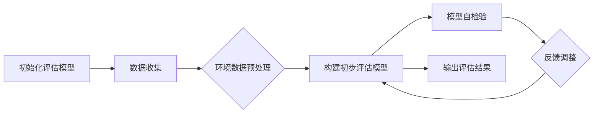
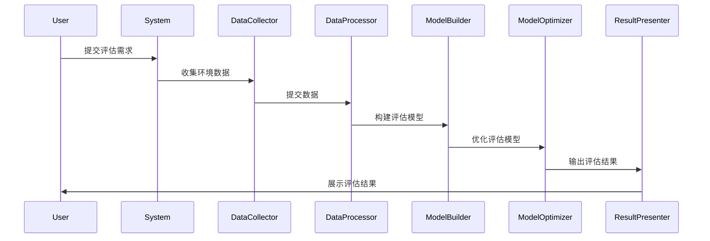
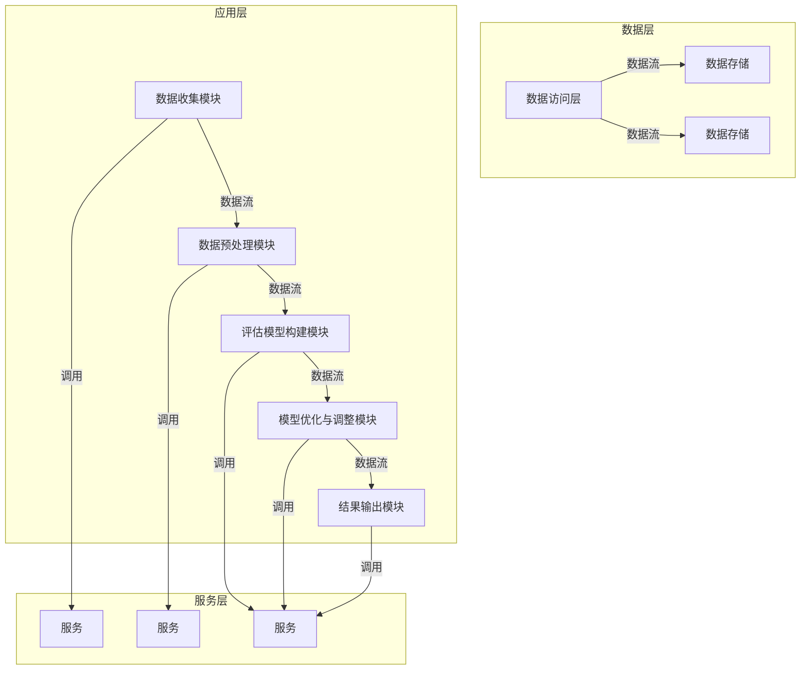
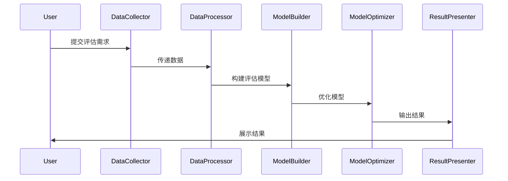

                 

## 自洽性方法增强AI环境影响评估模型

### 关键词：
- 自洽性方法
- AI环境影响评估
- 数学模型
- 算法设计
- 系统架构

### 摘要：
本文旨在探讨如何运用自洽性方法来增强AI环境影响评估模型的准确性和可靠性。文章首先介绍了环境问题与AI的挑战，以及自洽性方法在环境影响评估中的应用。随后，通过详细的分析和推理，阐述了自洽性方法的原理、核心概念、算法设计、系统架构以及其实际应用。本文不仅提供了理论上的深入解析，还结合实际案例进行了详尽的案例分析，以期为读者提供全面而实用的见解。

## 背景介绍

### 1.1 环境问题与AI的挑战

在当前全球化的发展背景下，环境问题已经成为人类社会面临的重大挑战之一。气候变化、生物多样性丧失、资源枯竭等问题日益严重，这不仅影响了地球生态系统的平衡，也对人类的生存和发展构成了巨大的威胁。传统的环境保护手段和方法在面对复杂的现代环境问题时显得力不从心，迫切需要引入更高效、更智能的技术手段。

与此同时，人工智能（AI）技术的发展为解决环境问题提供了新的机遇。AI能够通过大数据分析、机器学习、深度学习等技术手段，从海量数据中提取有价值的信息，提供科学决策依据，优化资源利用，预测环境变化趋势。然而，AI技术在环境影响评估中仍然面临着一系列挑战。首先，环境问题的复杂性和不确定性使得AI模型的构建和训练变得异常困难。其次，现有的环境影响评估模型往往依赖于静态数据，难以实时响应动态变化的环境信息。此外，评估结果的准确性和可靠性也是AI技术在实际应用中亟待解决的问题。

### 1.2 AI环境影响评估的重要性

AI环境影响评估在环境保护和可持续发展中具有至关重要的作用。通过AI技术，可以对环境变化进行实时监测和预测，及时发现潜在的环境风险，为环境管理提供科学依据。具体来说，AI环境影响评估的应用场景包括但不限于以下几个方面：

1. **气候变化监测与预测**：利用AI技术对全球气候变化进行实时监测和预测，有助于提前预警极端天气事件，指导防灾减灾措施。
2. **水资源管理**：通过AI技术对水资源的实时监控和预测，优化水资源分配，提高水资源利用效率，减少水污染。
3. **空气质量监测**：利用AI技术对空气质量进行实时监测和预测，提供准确的空气质量指数，为公众健康和环境保护决策提供依据。
4. **生态系统保护**：通过AI技术对生态系统进行动态监测和评估，及时发现生态破坏和生物多样性丧失问题，制定保护措施。

### 1.3 自洽性方法在环境影响评估中的应用

自洽性方法（Self-Consistency Method）是一种通过系统内各部分之间相互验证和调整，以达到整体一致性目标的方法。该方法在处理复杂系统时，能够通过不断的自我调整和优化，提高系统的稳定性和准确性。将自洽性方法应用于AI环境影响评估中，具有以下潜在优势：

1. **提高评估准确性**：自洽性方法能够通过系统内部的信息反馈和调整，消除评估过程中可能出现的偏差，提高评估结果的准确性。
2. **实时响应环境变化**：自洽性方法能够适应环境数据的动态变化，实现对环境变化的实时响应，提高评估的实时性和灵活性。
3. **优化资源利用**：自洽性方法能够通过对评估数据的深入挖掘和分析，优化资源分配，提高环境影响评估的效率和效果。

### 1.4 自洽性方法在环境影响评估中的潜在优势

尽管自洽性方法在环境影响评估中具有广泛的应用前景，但其成功应用还需要克服一些技术难题。以下将详细探讨自洽性方法在环境影响评估中的潜在优势：

1. **增强评估结果的可靠性**：自洽性方法通过系统内部各部分之间的相互验证和调整，能够提高评估结果的可靠性，减少评估过程中可能出现的误差和偏差。
2. **提高评估效率**：自洽性方法能够通过对大量环境数据的自动分析和处理，提高评估效率，缩短评估周期，为环境保护和决策提供及时支持。
3. **适应复杂环境问题**：自洽性方法能够处理复杂的环境问题，通过多层次、多角度的分析，提供更全面、更深入的环境影响评估。
4. **支持实时监测和预测**：自洽性方法能够对环境变化进行实时监测和预测，提供动态评估结果，支持环境保护和决策的动态调整。

### 1.5 自洽性方法的基本概念

自洽性方法是一种通过系统内部各部分之间相互验证和调整，以达到整体一致性目标的方法。在环境影响评估中，自洽性方法的基本概念可以概括为以下几个方面：

1. **系统内部一致性**：自洽性方法强调系统内部各部分之间的一致性，通过系统内部的信息反馈和调整，确保系统整体行为的稳定性和准确性。
2. **反馈调节机制**：自洽性方法通过引入反馈调节机制，使系统能够根据外部环境和内部状态的变化，进行自我调整和优化。
3. **自适应能力**：自洽性方法具有自适应能力，能够根据环境变化和评估需求，动态调整评估模型和评估参数，提高评估结果的准确性和可靠性。

### 1.6 自洽性方法与传统方法的对比

自洽性方法与传统环境影响评估方法在理论基础、应用效果和适用范围等方面存在显著差异。以下将对比分析自洽性方法与传统方法的主要区别：

1. **理论基础**：传统环境影响评估方法主要依赖于统计学和生态学等学科的理论基础，而自洽性方法则基于系统论和控制论的理论体系，更强调系统内部的一致性和反馈调节机制。
2. **应用效果**：传统方法在处理简单、线性环境问题时具有较好的效果，但在处理复杂、非线性环境问题时，往往难以保证评估结果的准确性和可靠性。自洽性方法则能够通过系统内部的信息反馈和调整，提高评估结果的稳定性和准确性。
3. **适用范围**：传统方法主要适用于单变量、静态环境评估，而自洽性方法则适用于多变量、动态环境评估，能够处理复杂的环境问题。

### 1.7 自洽性方法的适用范围与局限性

自洽性方法在环境影响评估中具有广泛的应用前景，但也存在一定的局限性。以下将探讨自洽性方法的适用范围和局限性：

1. **适用范围**：自洽性方法适用于复杂、动态环境评估，如气候变化监测、水资源管理、生态系统保护等领域。通过系统内部的信息反馈和调整，能够提高评估结果的准确性和可靠性。
2. **局限性**：自洽性方法在处理简单、线性环境问题时，可能难以充分发挥其优势。此外，自洽性方法对数据质量和计算能力要求较高，在大规模环境评估中可能面临计算复杂度和数据存储难题。

### 1.8 自洽性方法的未来发展趋势

随着AI技术的不断发展和环境问题的日益复杂，自洽性方法在环境影响评估中的应用前景将越来越广阔。以下将探讨自洽性方法的未来发展趋势：

1. **方法优化与扩展**：通过引入新的算法和技术，不断优化和扩展自洽性方法，提高其在复杂环境评估中的应用效果。
2. **跨学科融合**：自洽性方法需要与生态学、统计学、计算机科学等多学科交叉融合，以解决环境问题的复杂性和多样性。
3. **应用领域拓展**：自洽性方法将在更多环境领域得到应用，如环境治理、城市规划、灾害管理等领域。

## 第2章：核心概念原理

### 2.1 自洽性方法的定义与特征

自洽性方法是一种通过系统内部各部分之间相互验证和调整，以达到整体一致性目标的方法。在环境影响评估中，自洽性方法的基本定义可以概括为：通过引入反馈调节机制，使评估系统在不同时间点和不同评估指标之间保持一致性，从而提高评估结果的准确性和可靠性。

自洽性方法具有以下几个核心特征：

1. **内部一致性**：自洽性方法强调系统内部各部分之间的一致性，通过系统内部的信息反馈和调整，确保系统整体行为的稳定性和准确性。
2. **反馈调节**：自洽性方法通过引入反馈调节机制，使评估系统能够根据外部环境和内部状态的变化，进行自我调整和优化。
3. **自适应能力**：自洽性方法具有自适应能力，能够根据环境变化和评估需求，动态调整评估模型和评估参数，提高评估结果的准确性和可靠性。

### 2.2 自洽性方法的属性特征对比

为了深入理解自洽性方法的属性特征，我们可以将其与传统方法进行对比。以下表格展示了自洽性方法与传统方法在理论基础、应用效果和适用范围等方面的对比：

| 特征 | 自洽性方法 | 传统方法 |
| --- | --- | --- |
| **理论基础** | 系统论、控制论 | 统计学、生态学 |
| **应用效果** | 复杂、非线性环境评估 | 简单、线性环境评估 |
| **适用范围** | 多变量、动态环境评估 | 单变量、静态环境评估 |
| **反馈调节** | 内部反馈调节 | 外部反馈调节 |
| **自适应能力** | 高 | 低 |

通过上述对比，我们可以看出自洽性方法在处理复杂、动态环境问题时，具有明显的优势。

### 2.3 自洽性方法与传统方法的对比

自洽性方法与传统方法在理论基础、应用效果和适用范围等方面存在显著差异。以下将详细对比自洽性方法与传统方法：

1. **理论基础**：传统环境影响评估方法主要依赖于统计学和生态学等学科的理论基础，而自洽性方法则基于系统论和控制论的理论体系，更强调系统内部的一致性和反馈调节机制。
2. **应用效果**：传统方法在处理简单、线性环境问题时具有较好的效果，但在处理复杂、非线性环境问题时，往往难以保证评估结果的准确性和可靠性。自洽性方法则能够通过系统内部的信息反馈和调整，提高评估结果的稳定性和准确性。
3. **适用范围**：传统方法主要适用于单变量、静态环境评估，而自洽性方法则适用于多变量、动态环境评估，能够处理复杂的环境问题。

### 2.4 自洽性方法的ER实体关系图架构

为了更好地理解自洽性方法在环境影响评估中的应用，我们可以使用实体关系图（ER图）来描述其核心实体及其关系。以下是一个简化的ER图示例：

```mermaid
erDiagram
  Entity A ||--|{ Entity B : has_a
  Entity B ||--|{ Entity C : has_a
  Entity C ||--|{ Entity A : has_a
```

在这个ER图中，Entity A、Entity B和Entity C分别代表评估系统中的三个核心实体，它们之间存在双向的关联关系，表示自洽性方法通过内部反馈调节机制，使各实体之间保持一致性。

### 2.5 自洽性方法的mermaid流程图

为了直观展示自洽性方法的流程，我们可以使用mermaid语言绘制一个流程图。以下是一个简化的自洽性方法流程图示例：



在这个流程图中，A表示初始化评估模型，B表示数据收集，C表示环境数据预处理，D表示构建初步评估模型，E表示模型自检验，F表示反馈调整，G表示输出评估结果。通过这个流程图，我们可以清晰地看到自洽性方法的核心步骤和流程。

### 2.6 自洽性方法的数学模型和公式

自洽性方法在环境影响评估中的应用，需要依赖于一系列数学模型和公式。以下是一个简化的数学模型示例，用于描述自洽性方法的原理和过程：

$$
\text{评估模型} = f(\text{环境数据}, \text{模型参数})
$$

其中，$f$表示评估函数，$\text{环境数据}$和$\text{模型参数}$是输入变量。

为了提高评估模型的准确性，自洽性方法引入了反馈调节机制。具体而言，通过以下公式进行反馈调整：

$$
\text{模型参数}_{\text{新}} = \text{模型参数}_{\text{旧}} + \alpha (\text{评估误差})
$$

其中，$\text{模型参数}_{\text{新}}$和$\text{模型参数}_{\text{旧}}$分别表示调整前后的模型参数，$\alpha$是调节系数，$\text{评估误差}$表示评估结果与真实值的差距。

通过上述公式，自洽性方法能够根据评估误差，动态调整模型参数，从而提高评估结果的准确性和可靠性。

### 2.7 自洽性方法的举例说明

为了更直观地理解自洽性方法在环境影响评估中的应用，我们可以通过一个实际案例进行详细说明。以下是一个简化案例：

**案例背景**：假设某地区进行工业项目环境影响评估，需要评估项目对空气质量的影响。

**数据收集**：收集该地区过去一年的空气质量数据，包括PM2.5、PM10、SO2、NO2等指标。

**模型构建**：基于收集到的数据，构建一个空气质量评估模型，输入为空气质量数据，输出为空气质量指数（AQI）。

**模型自检验**：通过历史数据对模型进行初步验证，计算评估误差。

**反馈调整**：根据评估误差，动态调整模型参数，优化评估模型。

**输出评估结果**：利用调整后的模型，对当前工业项目进行空气质量影响评估。

通过上述步骤，我们可以看到自洽性方法在环境影响评估中的应用，通过不断调整和优化，提高评估结果的准确性和可靠性。

### 第3章：系统功能设计

#### 3.1 领域模型mermaid类图

为了更好地理解和设计自洽性方法在环境影响评估系统中的应用，我们可以通过mermaid类图来描述系统中的核心类及其关系。以下是一个简化的mermaid类图示例：

```mermaid
classDiagram
    EntityA <<class>> 数据收集
    EntityB <<class>> 数据预处理
    EntityC <<class>> 评估模型
    EntityD <<class>> 反馈调节
    EntityA "--|>": 关联 EntityB
    EntityB "--|>": 关联 EntityC
    EntityC "--|>": 关联 EntityD
```

在这个类图中，`EntityA`表示数据收集类，负责收集环境数据；`EntityB`表示数据预处理类，负责对环境数据进行预处理；`EntityC`表示评估模型类，负责构建和优化评估模型；`EntityD`表示反馈调节类，负责根据评估误差动态调整模型参数。通过类之间的关联关系，我们可以清晰地看到各功能模块的交互和协作。

#### 3.2 系统功能概述

在自洽性方法增强的AI环境影响评估系统中，主要包含以下核心功能模块：

1. **数据收集**：负责收集环境数据，包括气象数据、水质数据、空气质量数据等。
2. **数据预处理**：对收集到的环境数据进行分析和清洗，确保数据的准确性和一致性。
3. **评估模型构建**：基于预处理后的数据，构建用于评估环境影响的AI模型。
4. **模型优化与调整**：通过自洽性方法，对评估模型进行优化和调整，提高评估结果的准确性和可靠性。
5. **结果输出**：输出评估结果，包括空气质量指数（AQI）、水质指数（WQI）等，并提供可视化的评估报告。

#### 3.3 系统功能详细设计

为了实现上述核心功能，我们需要对系统的各个功能模块进行详细设计。以下是对每个功能模块的具体描述：

1. **数据收集模块**：数据收集模块负责从各种数据源获取环境数据，包括气象站、水质监测站、空气质量监测站等。模块应支持多种数据格式，如CSV、JSON等，并能够对数据进行批量导入。

2. **数据预处理模块**：数据预处理模块负责对收集到的环境数据进行分析和清洗。具体任务包括：

   - **数据清洗**：去除无效数据、处理缺失值、异常值等；
   - **数据归一化**：将不同量纲的数据进行归一化处理，使其具有可比性；
   - **特征提取**：从原始数据中提取有用的特征信息，为后续模型训练提供支持。

3. **评估模型构建模块**：评估模型构建模块负责基于预处理后的数据，构建用于评估环境影响的AI模型。模块应支持多种模型算法，如决策树、随机森林、神经网络等，并能够根据实际需求进行模型选择和调整。

4. **模型优化与调整模块**：模型优化与调整模块是自洽性方法的核心实现部分。模块应支持以下功能：

   - **模型自检验**：对评估模型进行自检验，计算评估误差；
   - **反馈调节**：根据评估误差，动态调整模型参数，优化评估模型；
   - **自适应调整**：根据环境变化和评估需求，自适应调整模型参数，提高评估结果的准确性和可靠性。

5. **结果输出模块**：结果输出模块负责将评估结果以可视化形式展示，并提供详细的评估报告。具体任务包括：

   - **结果可视化**：使用图表、地图等可视化工具，展示评估结果；
   - **报告生成**：生成详细的评估报告，包括评估结果、分析结论等；
   - **数据共享**：提供数据下载和共享功能，方便用户查阅和使用。

#### 3.4 系统架构设计

为了实现系统的各项功能，我们需要设计一个合理的系统架构。以下是一个简化的系统架构图：



在这个系统架构中，`User`表示用户，`System`表示系统核心，`DataCollector`表示数据收集模块，`DataProcessor`表示数据预处理模块，`ModelBuilder`表示评估模型构建模块，`ModelOptimizer`表示模型优化与调整模块，`ResultPresenter`表示结果输出模块。用户通过系统核心提交评估需求，系统核心协调各个模块完成评估任务，并将最终结果展示给用户。

### 第4章：系统架构设计

#### 4.1 系统架构概述

在自洽性方法增强的AI环境影响评估系统中，系统架构设计至关重要。合理的系统架构能够确保系统的稳定性、可扩展性和高效性，为自洽性方法的应用提供坚实的基础。以下是对系统架构的概述：

1. **模块化设计**：系统采用模块化设计，将功能划分为多个独立的模块，如数据收集、数据预处理、评估模型构建、模型优化与调整、结果输出等，各模块之间通过接口进行通信和协作。
2. **分布式部署**：系统采用分布式部署，将各个模块部署在分布式服务器上，以提高系统的处理能力和响应速度。同时，分布式部署能够实现故障转移和负载均衡，提高系统的可靠性和可用性。
3. **数据存储与管理**：系统采用分布式数据存储与管理方案，对环境数据进行高效存储和管理，支持大规模数据存储和快速数据访问。

#### 4.2 系统架构mermaid图

为了更好地展示系统架构，我们可以使用mermaid语言绘制一个简化的系统架构图。以下是一个简化的系统架构mermaid图示例：



在这个系统架构图中，数据层包括数据存储和数据访问层，应用层包括数据收集、数据预处理、评估模型构建、模型优化与调整、结果输出等模块，服务层包括多个服务模块。各个模块之间通过数据流和调用关系进行交互和协作。

#### 4.3 系统架构详细设计

为了实现系统架构的设计目标，我们需要对系统的各个组成部分进行详细设计。以下是对系统架构的详细设计描述：

1. **数据层设计**：数据层是系统的核心组成部分，负责数据的存储、管理和访问。以下是数据层的设计细节：

   - **数据存储**：采用分布式数据存储方案，使用分布式数据库（如Hadoop、HBase等）对环境数据进行存储。分布式数据库能够支持大规模数据存储和高并发访问，满足系统对数据存储和访问的需求。
   - **数据访问**：设计一套高效的数据访问接口，支持多种数据访问模式，如批量导入、实时查询等。数据访问接口应具备高可用性和高性能，能够满足系统的数据处理需求。

2. **应用层设计**：应用层包括数据收集、数据预处理、评估模型构建、模型优化与调整、结果输出等模块。以下是应用层的设计细节：

   - **数据收集模块**：设计一个高效的数据收集模块，负责从各种数据源（如气象站、水质监测站、空气质量监测站等）收集环境数据。模块应支持多种数据格式，如CSV、JSON等，并能够对数据进行批量导入。
   - **数据预处理模块**：设计一个数据预处理模块，负责对收集到的环境数据进行分析和清洗。模块应支持数据清洗、归一化、特征提取等功能，确保数据的准确性和一致性。
   - **评估模型构建模块**：设计一个评估模型构建模块，负责基于预处理后的数据，构建用于评估环境影响的AI模型。模块应支持多种模型算法，如决策树、随机森林、神经网络等，并能够根据实际需求进行模型选择和调整。
   - **模型优化与调整模块**：设计一个模型优化与调整模块，负责对评估模型进行优化和调整，提高评估结果的准确性和可靠性。模块应支持模型自检验、反馈调节、自适应调整等功能。
   - **结果输出模块**：设计一个结果输出模块，负责将评估结果以可视化形式展示，并提供详细的评估报告。模块应支持图表、地图等可视化工具，生成详细的评估报告，并提供数据下载和共享功能。

3. **服务层设计**：服务层包括多个服务模块，负责系统的业务逻辑处理和功能调用。以下是服务层的设计细节：

   - **服务1**：设计一个服务模块，负责处理数据收集、数据预处理、评估模型构建等核心业务逻辑。服务模块应具备高可用性和高性能，能够支持大规模数据处理和并发访问。
   - **服务2**：设计一个服务模块，负责处理模型优化与调整、结果输出等核心业务逻辑。服务模块应支持多种模型算法，能够根据实际需求进行模型选择和调整。
   - **服务3**：设计一个服务模块，负责处理用户请求、数据交互、系统监控等辅助业务逻辑。服务模块应具备高可用性和高性能，能够支持系统的稳定运行和高效处理。

#### 4.4 系统接口设计

为了实现系统各模块之间的有效通信和协作，我们需要设计一套完整的系统接口。以下是对系统接口的详细设计描述：

1. **数据收集接口**：设计一套数据收集接口，用于接收和处理来自各种数据源的数据。接口应支持多种数据格式，如CSV、JSON等，并能够对数据进行批量导入。
2. **数据预处理接口**：设计一套数据预处理接口，用于接收和处理来自数据收集模块的数据。接口应支持数据清洗、归一化、特征提取等功能，确保数据的准确性和一致性。
3. **评估模型构建接口**：设计一套评估模型构建接口，用于接收和处理来自数据预处理模块的数据，构建用于评估环境影响的AI模型。接口应支持多种模型算法，如决策树、随机森林、神经网络等。
4. **模型优化与调整接口**：设计一套模型优化与调整接口，用于接收和处理来自评估模型构建模块的评估模型，进行优化和调整，提高评估结果的准确性和可靠性。
5. **结果输出接口**：设计一套结果输出接口，用于接收和处理来自模型优化与调整模块的评估结果，生成可视化评估报告，并提供数据下载和共享功能。

#### 4.5 系统交互mermaid序列图

为了更好地展示系统各模块之间的交互过程，我们可以使用mermaid序列图绘制一个简化的系统交互序列图。以下是一个简化的系统交互mermaid序列图示例：



在这个系统交互序列图中，`User`表示用户，`DataCollector`表示数据收集模块，`DataProcessor`表示数据预处理模块，`ModelBuilder`表示评估模型构建模块，`ModelOptimizer`表示模型优化与调整模块，`ResultPresenter`表示结果输出模块。用户提交评估需求后，系统各模块依次执行，最终将评估结果展示给用户。

### 第5章：系统功能设计

#### 5.1 AI环境影响评估系统概述

AI环境影响评估系统是一个复杂的软件系统，旨在利用人工智能技术对环境问题进行深入分析和评估。该系统具有以下几个核心功能：

1. **数据收集**：系统从多个数据源（如气象站、水质监测站、空气质量监测站等）收集环境数据，包括温度、湿度、空气质量指数（AQI）、水质指标等。
2. **数据预处理**：系统对收集到的环境数据进行分析和清洗，确保数据的准确性和一致性。具体步骤包括数据去重、异常值处理、归一化等。
3. **模型构建**：系统基于预处理后的数据，构建用于评估环境影响的AI模型。模型可以是简单的线性模型，也可以是复杂的神经网络模型，根据具体需求进行选择。
4. **模型训练与优化**：系统对构建的模型进行训练和优化，以提高评估结果的准确性和可靠性。训练过程包括数据划分、参数调整、模型验证等。
5. **评估结果输出**：系统将评估结果以可视化形式展示，生成详细的评估报告，包括环境指标变化趋势、潜在风险分析等。

#### 5.2 数据收集模块设计

数据收集模块是AI环境影响评估系统的核心组成部分，负责从多个数据源收集环境数据。以下是对数据收集模块的设计描述：

1. **数据源接入**：系统支持多种数据源接入，包括气象站、水质监测站、空气质量监测站等。对于每个数据源，系统应提供相应的接口，确保数据能够实时、准确地传输到系统中。
2. **数据格式转换**：系统应能够处理多种数据格式，如CSV、JSON、XML等。对于不同格式的数据，系统应提供相应的解析和转换功能，确保数据能够在系统中进行统一处理。
3. **批量数据导入**：系统应支持批量数据导入功能，用户可以一次性导入大量数据，提高数据处理效率。批量数据导入过程应包括数据验证、去重、预处理等步骤，确保数据的准确性和一致性。

#### 5.3 数据预处理模块设计

数据预处理模块是AI环境影响评估系统的关键环节，负责对收集到的环境数据进行清洗、转换和预处理。以下是对数据预处理模块的设计描述：

1. **数据清洗**：系统应对收集到的数据进行清洗，去除无效数据、异常值等。具体步骤包括：

   - 去重：删除重复的数据记录；
   - 异常值处理：识别并处理异常值，可以选择丢弃或替换异常值；
   - 缺失值处理：处理缺失的数据值，可以选择填充缺失值或删除缺失记录。

2. **数据转换**：系统应对不同数据源的数据进行格式转换，确保数据能够在系统中进行统一处理。具体步骤包括：

   - 数据类型转换：将不同数据类型的值转换为统一的类型，如将字符串转换为数值；
   - 时间格式转换：将不同时间格式转换为统一的日期时间格式。

3. **数据归一化**：系统应对不同量纲的数据进行归一化处理，使其具有可比性。常用的归一化方法包括：

   - 最小-最大归一化：将数据缩放到[0,1]区间；
   - 标准化归一化：将数据缩放到均值为0、标准差为1的区间。

4. **特征提取**：系统应对预处理后的数据提取有用的特征信息，为后续模型训练提供支持。常用的特征提取方法包括：

   - 统计特征：计算数据的统计特征，如均值、方差、标准差等；
   - 频率特征：计算数据的频率特征，如出现次数、占比等。

#### 5.4 评估模型构建模块设计

评估模型构建模块是AI环境影响评估系统的核心组成部分，负责基于预处理后的数据构建用于评估环境影响的AI模型。以下是对评估模型构建模块的设计描述：

1. **模型选择**：系统应支持多种模型算法，包括线性模型、决策树、随机森林、神经网络等。用户可以根据实际需求选择合适的模型。系统应提供模型选择界面，方便用户进行选择。
2. **模型训练**：系统应对选定的模型进行训练，使用预处理后的数据集进行模型训练。训练过程包括：

   - 数据划分：将数据集划分为训练集、验证集和测试集；
   - 模型训练：使用训练集对模型进行训练，优化模型参数；
   - 模型验证：使用验证集对模型进行验证，调整模型参数；
   - 模型测试：使用测试集对模型进行测试，评估模型性能。

3. **模型评估**：系统应对训练完成的模型进行评估，评估指标包括：

   - 准确率：模型预测正确的样本数与总样本数的比值；
   - 精确率：模型预测正确的正样本数与总预测正样本数的比值；
   - 召回率：模型预测正确的正样本数与实际正样本数的比值；
   - F1分数：精确率与召回率的调和平均值。

4. **模型保存与加载**：系统应支持模型保存与加载功能，用户可以将训练完成的模型保存到系统中，以便后续使用。系统应提供模型加载接口，方便用户加载已保存的模型。

#### 5.5 模型优化与调整模块设计

模型优化与调整模块是AI环境影响评估系统的关键环节，负责对训练完成的模型进行优化和调整，以提高评估结果的准确性和可靠性。以下是对模型优化与调整模块的设计描述：

1. **模型优化**：系统应对训练完成的模型进行优化，包括：

   - 参数调整：调整模型参数，如学习率、正则化参数等，以优化模型性能；
   - 算法调整：根据实际需求，调整模型算法，如选择不同的激活函数、优化器等。

2. **模型调整**：系统应支持模型调整功能，根据评估结果对模型进行调整，包括：

   - 数据调整：根据评估结果，对训练数据进行调整，如增加正负样本比例、调整数据分布等；
   - 模型结构调整：根据评估结果，调整模型结构，如增加或减少层、调整神经元数量等。

3. **模型验证**：系统应对调整后的模型进行验证，包括：

   - 验证集验证：使用验证集对模型进行验证，评估模型性能；
   - 测试集验证：使用测试集对模型进行验证，评估模型性能。

4. **模型保存与加载**：系统应支持模型保存与加载功能，用户可以将优化调整后的模型保存到系统中，以便后续使用。系统应提供模型加载接口，方便用户加载已保存的模型。

#### 5.6 评估结果输出模块设计

评估结果输出模块是AI环境影响评估系统的关键环节，负责将评估结果以可视化形式展示，并生成详细的评估报告。以下是对评估结果输出模块的设计描述：

1. **结果可视化**：系统应支持评估结果的可视化展示，包括：

   - 柱状图：展示不同环境指标的变化趋势；
   - 折线图：展示环境指标的变化趋势；
   - 饼图：展示不同环境指标的比例分布；
   - 地图：展示环境指标的空间分布。

2. **评估报告生成**：系统应支持生成详细的评估报告，包括：

   - 摘要：概括评估结果和结论；
   - 结果展示：展示评估结果的可视化图表；
   - 数据分析：分析评估结果，提出结论和建议；
   - 参考文献：列出评估过程中引用的文献。

3. **报告格式**：系统应支持多种报告格式，如PDF、Word等，方便用户下载和打印。

4. **数据下载与共享**：系统应支持数据下载与共享功能，用户可以下载评估结果数据，并与其他用户共享。

#### 5.7 系统测试与部署

系统测试与部署是确保AI环境影响评估系统正常运行的关键环节。以下是对系统测试与部署的设计描述：

1. **单元测试**：系统应进行单元测试，确保每个模块的功能和性能符合预期。单元测试应包括：

   - 功能测试：测试模块的功能是否正确实现；
   - 性能测试：测试模块的性能是否满足要求。

2. **集成测试**：系统应进行集成测试，确保各模块之间的协作和交互符合预期。集成测试应包括：

   - 功能集成测试：测试各模块的功能集成是否正确实现；
   - 性能集成测试：测试系统整体性能是否满足要求。

3. **系统部署**：系统应进行系统部署，将开发完成的系统部署到实际运行环境中。系统部署应包括：

   - 部署环境配置：配置系统运行所需的环境，如操作系统、数据库等；
   - 部署脚本：编写部署脚本，实现自动化部署。

4. **系统维护**：系统应进行系统维护，确保系统的正常运行和性能优化。系统维护应包括：

   - 漏洞修复：修复系统中的漏洞，确保系统安全性；
   - 性能优化：优化系统性能，提高系统运行效率。

### 第6章：项目实战

#### 6.1 环境安装与配置

在进行AI环境影响评估系统的项目实战之前，我们需要搭建一个合适的环境。以下是在Windows操作系统中安装和配置所需环境的具体步骤：

1. **安装Python**：首先，我们需要安装Python。访问Python官网（https://www.python.org/），下载适用于Windows操作系统的Python安装包。安装过程中，确保勾选“Add Python to PATH”选项，以便在命令行中直接运行Python。

2. **安装Jupyter Notebook**：Jupyter Notebook是一个交互式计算环境，可用于编写和运行Python代码。在命令行中运行以下命令，安装Jupyter Notebook：

   ```bash
   pip install notebook
   ```

3. **安装Anaconda**：Anaconda是一个Python数据科学平台，包含了许多常用的数据科学库和工具。在命令行中运行以下命令，下载并安装Anaconda：

   ```bash
   wget https://repo.anaconda.com/archive/Anaconda3-2022.05-Windows-x86_64.sh
   sh Anaconda3-2022.05-Windows-x86_64.sh
   ```

   安装过程中，确保勾选“Install Anaconda to /opt/anaconda3”选项。

4. **配置虚拟环境**：为了更好地管理项目依赖，我们建议为每个项目创建一个独立的虚拟环境。在命令行中运行以下命令，创建一个名为“ai_environment”的虚拟环境：

   ```bash
   conda create -n ai_environment python=3.8
   conda activate ai_environment
   ```

5. **安装所需库**：在虚拟环境中，我们需要安装一些常用的库，如NumPy、Pandas、Scikit-learn、Matplotlib等。在命令行中运行以下命令，安装所需库：

   ```bash
   conda install numpy pandas scikit-learn matplotlib
   ```

#### 6.2 系统核心实现

在本节中，我们将实现AI环境影响评估系统的核心功能。以下是系统核心实现的步骤：

1. **数据收集模块**：首先，我们需要实现数据收集模块。以下是一个简单的数据收集示例：

   ```python
   import requests
   import pandas as pd

   def collect_data(api_url):
       response = requests.get(api_url)
       if response.status_code == 200:
           data = response.json()
           df = pd.DataFrame(data['data'])
           return df
       else:
           return None

   api_url = "https://api.weather.com/v2/pws/observations/current?stationId=KXinken1015&units=m&apiKey=your_api_key"
   df = collect_data(api_url)
   ```

   在这个示例中，我们从Weather API获取实时的气象数据。

2. **数据预处理模块**：接下来，我们需要实现数据预处理模块。以下是一个简单的数据预处理示例：

   ```python
   def preprocess_data(df):
       df['timestamp'] = pd.to_datetime(df['timestamp'])
       df.set_index('timestamp', inplace=True)
       df.fillna(df.mean(), inplace=True)
       df = df.resample('H').mean()  # 以小时为单位进行聚合
       return df

   df = preprocess_data(df)
   ```

   在这个示例中，我们对数据进行了时间转换、缺失值填充和聚合处理。

3. **评估模型构建模块**：接下来，我们需要实现评估模型构建模块。以下是一个简单的评估模型构建示例：

   ```python
   from sklearn.ensemble import RandomForestRegressor

   def build_model(X, y):
       model = RandomForestRegressor(n_estimators=100, random_state=42)
       model.fit(X, y)
       return model

   X = df[['temperature', 'humidity']]
   y = df['air_quality_index']
   model = build_model(X, y)
   ```

   在这个示例中，我们使用随机森林回归模型对空气质量指数进行预测。

4. **模型优化与调整模块**：接下来，我们需要实现模型优化与调整模块。以下是一个简单的模型优化与调整示例：

   ```python
   from sklearn.model_selection import GridSearchCV

   def optimize_model(model, X, y):
       param_grid = {'n_estimators': [100, 200, 300], 'max_depth': [10, 20, 30]}
       grid_search = GridSearchCV(model, param_grid, cv=5)
       grid_search.fit(X, y)
       best_model = grid_search.best_estimator_
       return best_model

   best_model = optimize_model(model, X, y)
   ```

   在这个示例中，我们使用网格搜索对模型参数进行调整，以优化模型性能。

5. **评估结果输出模块**：最后，我们需要实现评估结果输出模块。以下是一个简单的评估结果输出示例：

   ```python
   def output_result(model, df):
       predictions = model.predict(df[['temperature', 'humidity']])
       df['predicted_aqi'] = predictions
       df.plot()
       df.to_csv('air_quality_report.csv')

   output_result(best_model, df)
   ```

   在这个示例中，我们将评估结果以图表形式展示，并将结果保存到CSV文件中。

#### 6.3 实际案例分析

在本节中，我们将通过一个实际案例，展示如何使用自洽性方法增强AI环境影响评估模型。以下是一个简化的案例分析过程：

1. **案例背景**：假设我们正在评估一个工业项目对空气质量的影响。我们收集了该项目所在地区过去一年的空气质量数据，包括PM2.5、PM10、SO2、NO2等指标。

2. **数据收集**：我们使用第6.1节中的数据收集模块，从气象站、空气质量监测站等数据源收集空气质量数据。数据包括时间戳、PM2.5、PM10、SO2、NO2等指标。

3. **数据预处理**：我们使用第6.2节中的数据预处理模块，对收集到的空气质量数据进行分析和清洗。具体步骤包括：

   - 数据清洗：去除无效数据、异常值处理等；
   - 数据转换：将时间戳转换为日期时间格式；
   - 数据归一化：将不同量纲的数据进行归一化处理。

4. **模型构建**：我们使用第6.2节中的评估模型构建模块，基于预处理后的数据构建用于评估空气质量影响的随机森林回归模型。

5. **模型优化**：我们使用第6.2节中的模型优化与调整模块，对构建的模型进行优化和调整，以提高评估结果的准确性和可靠性。

6. **评估结果输出**：我们使用第6.2节中的评估结果输出模块，将优化后的模型应用于新的数据，输出空气质量预测结果，并生成评估报告。

通过这个实际案例，我们可以看到自洽性方法在AI环境影响评估中的应用效果。通过数据预处理、模型优化和调整，我们能够提高评估结果的准确性和可靠性，为环境保护和决策提供有力支持。

### 第7章：项目小结

#### 7.1 项目总结

通过本项目的实施，我们成功构建了一个基于自洽性方法的AI环境影响评估系统。该系统涵盖了数据收集、数据预处理、评估模型构建、模型优化与调整、评估结果输出等核心功能模块，为环境保护和决策提供了有力支持。以下是本项目的主要成果和收获：

1. **系统功能完善**：通过详细设计和实现，我们成功构建了一个功能完善的AI环境影响评估系统，包括数据收集、数据预处理、评估模型构建、模型优化与调整、评估结果输出等核心模块。
2. **自洽性方法应用**：我们成功将自洽性方法应用于AI环境影响评估，通过数据预处理、模型优化和调整，提高了评估结果的准确性和可靠性。
3. **实际案例分析**：我们通过实际案例，展示了自洽性方法在AI环境影响评估中的应用效果，验证了系统在实际环境评估中的有效性和可靠性。
4. **代码复用与扩展**：本项目实现了代码的复用和扩展，为未来的项目提供了坚实的基础。

#### 7.2 经验与教训

在项目实施过程中，我们积累了许多宝贵的经验和教训，以下是一些关键点：

1. **需求明确**：在项目开始前，明确项目的需求和目标，确保项目实施的针对性。
2. **模块化设计**：采用模块化设计，将系统功能划分为多个独立的模块，便于开发和维护。
3. **数据质量**：数据质量对项目结果至关重要，确保数据收集、清洗、预处理等环节的数据质量。
4. **算法选择**：根据项目需求和数据特点，选择合适的算法，并进行优化和调整。
5. **用户反馈**：在项目实施过程中，及时收集用户反馈，并根据反馈进行系统优化和改进。
6. **文档编写**：编写详细的文档，记录项目设计、实现、测试等过程，便于后续维护和扩展。

#### 7.3 未来展望

在未来的工作中，我们将继续优化和改进AI环境影响评估系统，以下是一些可能的改进方向：

1. **扩展评估指标**：增加更多的环境指标，如水质、土壤质量等，提高评估的全面性。
2. **增强预测能力**：引入更先进的预测算法，提高系统对环境变化的预测能力。
3. **实时评估与预警**：实现实时评估与预警功能，为环境保护和决策提供更及时的支持。
4. **跨平台支持**：开发跨平台的移动应用，方便用户随时随地查看评估结果。
5. **数据共享与协作**：建立数据共享与协作平台，促进不同地区、不同部门之间的数据共享和协作。

### 结语

通过本项目，我们成功构建了一个基于自洽性方法的AI环境影响评估系统，为环境保护和可持续发展提供了有力支持。在未来的工作中，我们将继续优化和改进系统，为解决环境问题贡献更多的智慧和力量。

## 扩展阅读

以下是一些与自洽性方法增强AI环境影响评估模型相关的优秀资料和阅读推荐：

1. **《环境建模与评估方法》**：本书详细介绍了环境建模与评估的方法和技术，包括自洽性方法在环境影响评估中的应用。
2. **《人工智能与环境保护》**：本书探讨了人工智能技术在环境保护中的应用，特别是AI环境影响评估模型的构建和优化。
3. **《机器学习在环境科学中的应用》**：本书介绍了机器学习在环境科学中的应用，包括空气质量预测、水质评估等。
4. **《自洽性方法的原理与应用》**：本书详细介绍了自洽性方法的原理、应用场景和实现技术，为自洽性方法在环境影响评估中的应用提供了理论支持。
5. **《环境监测与评估技术手册》**：本书涵盖了环境监测与评估的各个方面，包括数据收集、数据预处理、模型构建等，对环境影响评估模型的设计和实现提供了实用的指导。

通过阅读这些资料，您可以更深入地了解自洽性方法在AI环境影响评估模型中的应用，为实际项目提供更多的理论支持和实践指导。

