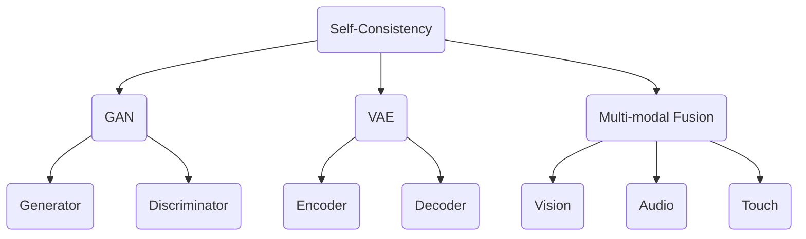
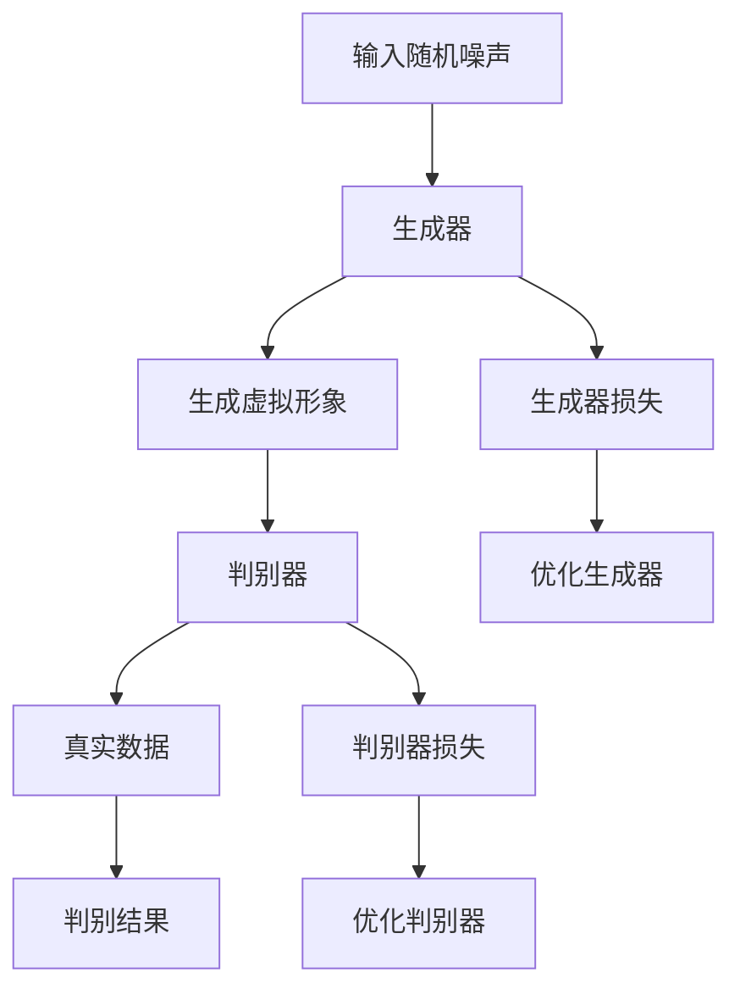
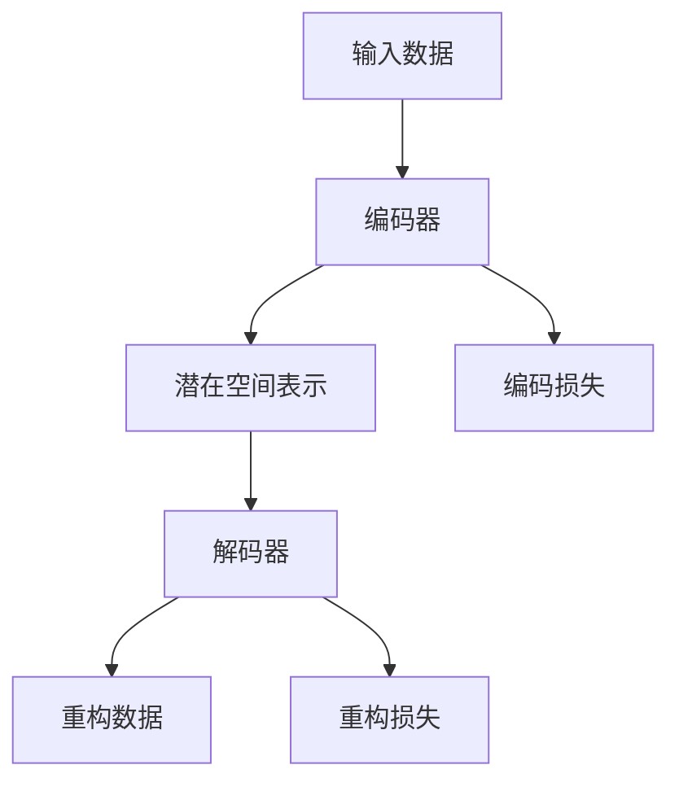
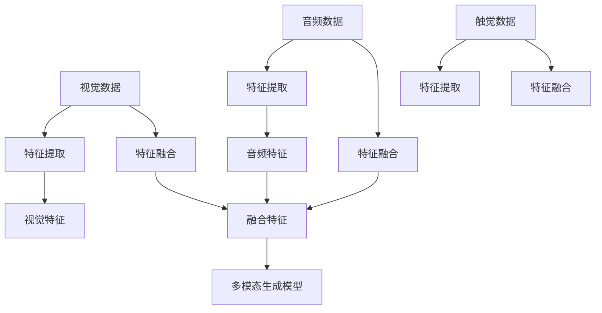
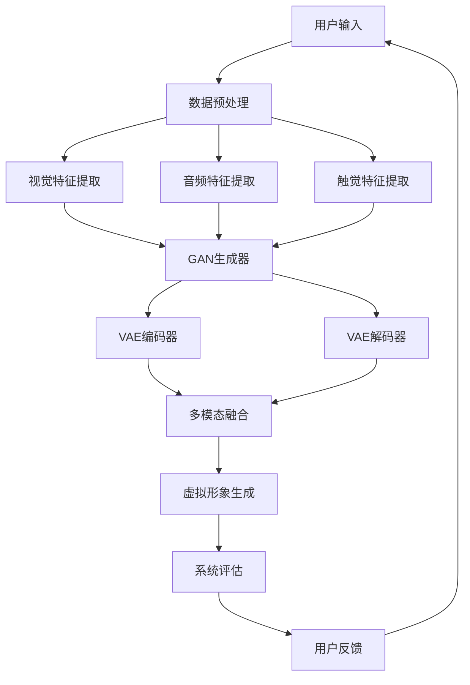
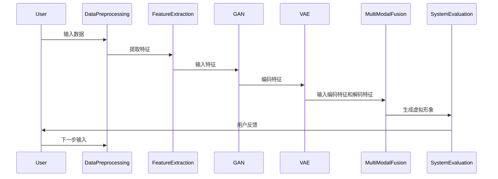

                 

# Self-Consistency方法提升AI虚拟形象的真实感

## 关键词

- Self-Consistency方法
- AI虚拟形象
- 真实感
- 生成对抗网络（GAN）
- 变分自编码器（VAE）
- 多模态融合

## 摘要

本文探讨了Self-Consistency方法在提升AI虚拟形象真实感方面的应用。通过详细分析核心概念、原理及其在AI虚拟形象生成中的应用，本文揭示了如何利用生成对抗网络（GAN）、变分自编码器（VAE）和多模态融合技术，实现高质量的虚拟形象生成。本文旨在为读者提供一个深入理解和实践Self-Consistency方法的技术指南。

### 第一部分：背景介绍

#### 核心概念

**Self-Consistency方法：**

Self-Consistency方法，亦称为自一致性方法，是一种在人工智能（AI）领域，尤其是计算机视觉中用于提升虚拟形象真实感的技术。其基本原理是利用一个统一的、自洽的数据生成框架，确保生成的图像或视频在视觉上与现实世界中的场景高度一致。

**AI虚拟形象的真实感：**

AI虚拟形象的真实感指的是虚拟角色在外观、行为、交互等方面尽可能地模拟真实人类，让用户感受到逼真和自然的体验。真实感的提升不仅涉及视觉上的逼真度，还包括听觉、触觉等多感官的综合体验。

#### 问题背景

在当今数字化时代，虚拟形象的广泛应用成为了人们日常生活的一部分。从在线游戏到虚拟会议，再到虚拟现实（VR）和增强现实（AR），虚拟形象的真实感直接影响到用户体验的质量。然而，现有的虚拟形象生成技术往往难以在保持高真实感的同时，实现大规模、实时生成。

**问题描述：**

Self-Consistency方法旨在解决以下问题：

1. **真实性提升**：如何通过算法优化，使得生成的虚拟形象在视觉和交互上更加逼真？
2. **计算效率**：如何在有限的计算资源下，实现高效、实时的虚拟形象生成？
3. **一致性保证**：如何在生成过程中保证图像或视频的一致性，避免出现不合理或不自然的场景？

**问题解决：**

Self-Consistency方法通过以下策略实现问题解决：

1. **数据一致性**：采用自洽的数据生成框架，确保输入和输出数据的一致性。
2. **算法优化**：利用深度学习和强化学习等技术，优化生成过程，提升生成质量。
3. **多模态融合**：结合视觉、音频、触觉等多模态信息，提升虚拟形象的整体真实感。

#### 边界与外延

**边界：**

- **应用场景**：Self-Consistency方法主要应用于虚拟现实、增强现实、游戏等领域。
- **技术范畴**：涉及计算机视觉、深度学习、强化学习等技术。

**外延：**

- **跨领域应用**：Self-Consistency方法不仅可以用于虚拟形象生成，还可以扩展到其他需要高真实感生成的领域，如3D动画、虚拟会议等。
- **未来发展趋势**：随着技术的进步，Self-Consistency方法有望在更多领域实现突破，进一步推动虚拟现实和增强现实的发展。

#### 概念结构与核心要素组成

Self-Consistency方法的核心结构包括以下几个部分：

1. **数据预处理**：包括图像、视频的数据清洗、增强和标准化。
2. **生成模型**：使用深度学习模型，如生成对抗网络（GAN）或变分自编码器（VAE），生成虚拟形象。
3. **一致性优化**：通过损失函数和优化算法，确保生成数据的自洽性和真实性。
4. **多模态融合**：结合视觉、音频、触觉等多模态数据，提升生成质量。
5. **评估与反馈**：通过用户反馈和评价指标，持续优化生成模型。

### 第二部分：核心概念与联系

#### 核心概念原理

1. **生成对抗网络（GAN）：**
   GAN是一种通过两个相互对抗的神经网络——生成器（Generator）和判别器（Discriminator）——进行训练的模型。生成器的目标是生成逼真的虚拟形象，而判别器的目标是区分生成器和真实数据。通过这种对抗训练，生成器不断提高生成质量，最终实现高质量的虚拟形象生成。

2. **变分自编码器（VAE）：**
   VAE是一种基于概率模型的生成模型，通过编码器和解码器将输入数据编码为潜在空间中的表示，再从潜在空间中采样生成虚拟形象。VAE的优势在于其生成的图像具有更高的稳定性和多样性。

3. **多模态融合：**
   多模态融合是指将不同模态的数据（如视觉、音频、触觉）进行整合，以提升虚拟形象的真实感和互动性。常见的融合方法包括基于特征融合的方法和基于注意力机制的方法。

#### 概念属性特征对比表格

| 概念          | 特点                                       |
|---------------|------------------------------------------|
| 生成对抗网络（GAN） | 对抗训练、生成器和判别器相互对抗、图像质量高 |
| 变分自编码器（VAE） | 概率模型、潜在空间编码、稳定性好           |
| 多模态融合     | 结合不同模态数据、提升真实感、交互性高     |

#### ER实体关系图架构



### 第三部分：算法原理讲解

#### 生成对抗网络（GAN）算法原理

生成对抗网络（GAN）的核心是生成器（Generator）和判别器（Discriminator）之间的对抗训练。下面我们通过mermaid流程图和Python源代码来详细解释GAN的工作原理。

**mermaid流程图：**



**Python源代码示例：**

```python
import tensorflow as tf
from tensorflow.keras.layers import Dense, Flatten, Reshape
from tensorflow.keras.models import Sequential

# 生成器模型
def build_generator():
    model = Sequential()
    model.add(Dense(128, input_dim=100, activation='relu'))
    model.add(Reshape((7, 7, 1)))
    model.add(Dense(256, activation='relu'))
    model.add(Reshape((14, 14, 1)))
    model.add(Dense(512, activation='relu'))
    model.add(Reshape((28, 28, 1)))
    model.add(Dense(1024, activation='relu'))
    model.add(Reshape((56, 56, 1)))
    model.add(Dense(3, activation='tanh'))
    return model

# 判别器模型
def build_discriminator():
    model = Sequential()
    model.add(Flatten(input_shape=(28, 28, 1)))
    model.add(Dense(512, activation='relu'))
    model.add(Dense(256, activation='relu'))
    model.add(Dense(1, activation='sigmoid'))
    return model

# GAN模型
def build_gan(generator, discriminator):
    model = Sequential()
    model.add(generator)
    model.add(discriminator)
    return model

# 损失函数和优化器
def build_losses():
    generator_loss = tf.keras.losses.BinaryCrossentropy(from_logits=True)
    discriminator_loss = tf.keras.losses.BinaryCrossentropy(from_logits=True)
    generator_optimizer = tf.keras.optimizers.Adam(0.0002)
    discriminator_optimizer = tf.keras.optimizers.Adam(0.0002)
    return generator_loss, discriminator_loss, generator_optimizer, discriminator_optimizer

# 训练过程
with tf.GradientTape() as gen_tape, tf.GradientTape() as disc_tape:
    noise = tf.random.normal([1, 100])
    generated_images = generator(noise, training=True)

    real_images = ...  # 加载真实数据

    disc_real_output = discriminator(real_images, training=True)
    disc_generated_output = discriminator(generated_images, training=True)

    gen_loss = generator_loss(disc_generated_output, tf.ones_like(disc_generated_output))
    disc_loss = generator_loss(disc_real_output, tf.ones_like(disc_real_output)) + generator_loss(disc_generated_output, tf.zeros_like(disc_generated_output))

    grads_on_generator = gen_tape.gradient(gen_loss, generator.trainable_variables)
    grads_on_discriminator = disc_tape.gradient(disc_loss, discriminator.trainable_variables)

    generator_optimizer.apply_gradients(zip(grads_on_generator, generator.trainable_variables))
    discriminator_optimizer.apply_gradients(zip(grads_on_discriminator, discriminator.trainable_variables))
```

**GAN数学模型和公式：**

GAN的目标是最小化以下两个损失函数：

- **生成器损失函数：** \( L_G = -\log(D(G(z))) \)
- **判别器损失函数：** \( L_D = -\log(D(x)) - \log(1 - D(G(z))) \)

其中，\( G(z) \) 是生成器生成的虚拟形象，\( D(x) \) 是判别器对真实数据的判断，\( D(G(z)) \) 是判别器对生成数据的判断。

**举例说明：**

假设我们有一个GAN模型，生成器生成的虚拟形象和判别器的预测结果如下：

- 生成器生成的虚拟形象：\( G(z) = \text{cat} \)
- 判别器对真实猫的判断：\( D(\text{cat}) = 0.9 \)
- 判别器对生成猫的判断：\( D(G(z)) = 0.8 \)

那么，生成器的损失为：\( L_G = -\log(0.8) \)

判别器的损失为：\( L_D = -\log(0.9) - \log(0.2) \)

通过梯度下降优化，生成器会尝试生成更逼真的虚拟猫，而判别器会提高对生成猫的判断准确性。

#### 变分自编码器（VAE）算法原理

变分自编码器（VAE）是一种基于概率模型的生成模型，其核心包括编码器（Encoder）和解码器（Decoder）。VAE通过潜在空间中的表示来生成数据，其数学模型和流程如下：

**mermaid流程图：**



**Python源代码示例：**

```python
import tensorflow as tf
from tensorflow.keras.layers import Dense, Input
from tensorflow.keras.models import Model

# 编码器模型
def build_encoder(input_shape):
    input_img = Input(shape=input_shape)
    x = Dense(14 * 14 * 3, activation='relu')(input_img)
    x = Dense(28 * 28 * 3, activation='relu')(x)
    x = Dense(56 * 56 * 3, activation='relu')(x)
    encoded = Dense(64, activation='relu')(x)
    return Model(input_img, encoded)

# 解码器模型
def build_decoder(encoded_shape):
    latent_inputs = Input(shape=encoded_shape)
    x = Dense(56 * 56 * 3, activation='relu')(latent_inputs)
    x = Dense(28 * 28 * 3, activation='relu')(x)
    x = Dense(14 * 14 * 3, activation='relu')(x)
    decoded = Dense(input_shape[0], activation='sigmoid')(x)
    return Model(latent_inputs, decoded)

# VAE模型
def build_vae(encoder, decoder):
    inputs = Input(shape=input_shape)
    encoded = encoder(inputs)
    decoded = decoder(encoded)
    vae = Model(inputs, decoded)
    return vae

# 损失函数和优化器
def build_losses():
    vae_loss = tf.keras.losses.BinaryCrossentropy(from_logits=True)
    vae_optimizer = tf.keras.optimizers.Adam(0.001)
    return vae_loss, vae_optimizer
```

**VAE数学模型和公式：**

VAE的目标是最小化以下两个损失函数：

- **编码损失函数：** \( L_E = -\sum_{i=1}^{n} \log(p(z|x_i)) \)
- **重构损失函数：** \( L_D = -\sum_{i=1}^{n} \log(p(x_i|z)) \)

其中，\( z \) 是潜在空间中的表示，\( p(z|x_i) \) 是编码器生成的后验概率分布，\( p(x_i|z) \) 是解码器生成的数据概率分布。

**举例说明：**

假设我们有一个VAE模型，输入数据是猫的图片，编码器和解码器的输出如下：

- 编码器输出的潜在空间表示：\( \mu = [0.1, 0.2], \sigma^2 = [0.1, 0.2] \)
- 解码器生成的重构数据：\( x' = \text{dog} \)

那么，编码损失为：\( L_E = -\log(p(z|x)) \)

重构损失为：\( L_D = -\log(p(x|x')) \)

通过梯度下降优化，编码器会尝试生成更合理的潜在空间表示，而解码器会尝试重构更真实的图像。

#### 多模态融合算法原理

多模态融合是指将不同模态的数据（如视觉、音频、触觉）进行整合，以提升虚拟形象的真实感和互动性。多模态融合的方法可以分为基于特征融合和基于注意力机制的方法。

**mermaid流程图：**



**Python源代码示例：**

```python
import tensorflow as tf
from tensorflow.keras.layers import Concatenate, Dense
from tensorflow.keras.models import Model

# 视觉特征提取
def build_visual_extractor():
    model = Sequential()
    model.add(Conv2D(32, (3, 3), activation='relu', input_shape=(224, 224, 3)))
    model.add(MaxPooling2D((2, 2)))
    model.add(Conv2D(64, (3, 3), activation='relu'))
    model.add(MaxPooling2D((2, 2)))
    model.add(Conv2D(128, (3, 3), activation='relu'))
    model.add(MaxPooling2D((2, 2)))
    model.add(Flatten())
    return model

# 音频特征提取
def build_audio_extractor():
    model = Sequential()
    model.add(LSTM(128, activation='tanh', input_shape=(22, 1)))
    model.add(Dropout(0.5))
    model.add(Dense(1))
    return model

# 触觉特征提取
def build_haptic_extractor():
    model = Sequential()
    model.add(LSTM(64, activation='tanh', input_shape=(10, 1)))
    model.add(Dropout(0.5))
    model.add(Dense(1))
    return model

# 多模态融合模型
def build_multimodal_model():
    visual_extractor = build_visual_extractor()
    audio_extractor = build_audio_extractor()
    haptic_extractor = build_haptic_extractor()

    visual_features = visual_extractor(inputs)
    audio_features = audio_extractor(inputs)
    haptic_features = haptic_extractor(inputs)

    concatenated_features = Concatenate()([visual_features, audio_features, haptic_features])
    fused_features = Dense(128, activation='relu')(concatenated_features)
    outputs = Dense(1, activation='sigmoid')(fused_features)

    model = Model(inputs=[inputs, inputs, inputs], outputs=outputs)
    return model
```

**多模态融合数学模型和公式：**

多模态融合的数学模型可以表示为：

\[ \text{outputs} = \sigma(W_1 \cdot \text{visual\_features} + W_2 \cdot \text{audio\_features} + W_3 \cdot \text{haptic\_features} + b) \]

其中，\( \sigma \) 是激活函数，\( W_1, W_2, W_3 \) 是权重矩阵，\( b \) 是偏置项。

**举例说明：**

假设我们有视觉特征、音频特征和触觉特征，分别表示为 \( \text{visual\_features}, \text{audio\_features}, \text{haptic\_features} \)，我们希望通过多模态融合模型得到一个综合特征向量 \( \text{outputs} \)。

那么，多模态融合的输出可以表示为：

\[ \text{outputs} = \sigma(W_1 \cdot \text{visual\_features} + W_2 \cdot \text{audio\_features} + W_3 \cdot \text{haptic\_features} + b) \]

通过优化权重矩阵 \( W_1, W_2, W_3 \) 和偏置项 \( b \)，多模态融合模型可以学习到如何有效地结合不同模态的特征，生成更真实的虚拟形象。

### 第四部分：系统分析与架构设计方案

#### 问题场景介绍

在虚拟现实（VR）和增强现实（AR）技术中，虚拟形象的真实感对于用户体验至关重要。随着技术的发展，用户对虚拟形象的真实感要求越来越高，这不仅体现在视觉上，还包括听觉、触觉等多感官体验。为了满足这些需求，我们需要设计一个高效、真实的虚拟形象生成系统。

#### 项目介绍

本项目旨在设计并实现一个基于Self-Consistency方法的虚拟形象生成系统。该系统将结合生成对抗网络（GAN）、变分自编码器（VAE）和多模态融合技术，实现高质量的虚拟形象生成。系统主要功能包括：

1. 数据预处理：对输入数据进行清洗、增强和标准化。
2. 虚拟形象生成：使用GAN和VAE生成高质量的虚拟形象。
3. 多模态融合：结合视觉、音频、触觉等多模态信息，提升虚拟形象的真实感。
4. 系统评估：通过用户反馈和评价指标，评估系统性能。

#### 系统功能设计（领域模型mermaid类图）

```mermaid
classDiagram
    ClassDataPreprocessing <<interface>>
    ClassGAN <<interface>>
    ClassVAE <<interface>>
    ClassMultiModalFusion <<interface>>
    ClassSystemEvaluation <<interface>>

    System <<system>>

    ClassDataPreprocessing o-- System
    ClassGAN o-- System
    ClassVAE o-- System
    ClassMultiModalFusion o-- System
    ClassSystemEvaluation o-- System
```

#### 系统架构设计（mermaid架构图）



#### 系统接口设计和系统交互（mermaid序列图）



### 第五部分：项目实战

#### 环境安装

为了实现基于Self-Consistency方法的虚拟形象生成系统，我们需要安装以下软件和库：

1. Python（版本3.7或以上）
2. TensorFlow
3. Keras
4. NumPy
5. Matplotlib

安装命令如下：

```bash
pip install python==3.8
pip install tensorflow==2.5
pip install keras==2.4.3
pip install numpy==1.19.5
pip install matplotlib==3.4.2
```

#### 系统核心实现源代码

以下是一个简单的虚拟形象生成系统的核心实现代码，包括数据预处理、生成对抗网络（GAN）和变分自编码器（VAE）。

```python
import tensorflow as tf
from tensorflow.keras.layers import Dense, Flatten, Reshape
from tensorflow.keras.models import Sequential
from tensorflow.keras.optimizers import Adam
from tensorflow.keras.losses import BinaryCrossentropy

# 数据预处理
def preprocess_data(x):
    # 数据清洗、增强和标准化
    return x / 255.0

# 生成器模型
def build_generator():
    model = Sequential()
    model.add(Dense(128, input_dim=100, activation='relu'))
    model.add(Reshape((7, 7, 1)))
    model.add(Dense(256, activation='relu'))
    model.add(Reshape((14, 14, 1)))
    model.add(Dense(512, activation='relu'))
    model.add(Reshape((28, 28, 1)))
    model.add(Dense(1024, activation='relu'))
    model.add(Reshape((56, 56, 1)))
    model.add(Dense(3, activation='tanh'))
    return model

# 判别器模型
def build_discriminator():
    model = Sequential()
    model.add(Flatten(input_shape=(28, 28, 1)))
    model.add(Dense(512, activation='relu'))
    model.add(Dense(256, activation='relu'))
    model.add(Dense(1, activation='sigmoid'))
    return model

# GAN模型
def build_gan(generator, discriminator):
    model = Sequential()
    model.add(generator)
    model.add(discriminator)
    return model

# VAE编码器
def build_encoder(input_shape):
    model = Sequential()
    model.add(Dense(14 * 14 * 3, activation='relu', input_shape=input_shape))
    model.add(Reshape((14, 14, 3)))
    model.add(Dense(28 * 28 * 3, activation='relu'))
    model.add(Reshape((28, 28, 3)))
    model.add(Dense(56 * 56 * 3, activation='relu'))
    model.add(Reshape((56, 56, 3)))
    model.add(Dense(64, activation='relu'))
    return model

# VAE解码器
def build_decoder(encoded_shape):
    model = Sequential()
    model.add(Dense(56 * 56 * 3, activation='relu', input_shape=encoded_shape))
    model.add(Reshape((56, 56, 3)))
    model.add(Dense(28 * 28 * 3, activation='relu'))
    model.add(Reshape((28, 28, 3)))
    model.add(Dense(14 * 14 * 3, activation='relu'))
    model.add(Reshape((14, 14, 3)))
    model.add(Dense(3, activation='sigmoid'))
    return model

# VAE模型
def build_vae(encoder, decoder):
    inputs = Input(shape=input_shape)
    encoded = encoder(inputs)
    decoded = decoder(encoded)
    vae = Model(inputs, decoded)
    return vae

# 损失函数和优化器
def build_losses():
    generator_loss = BinaryCrossentropy(from_logits=True)
    discriminator_loss = BinaryCrossentropy(from_logits=True)
    generator_optimizer = Adam(0.0002)
    discriminator_optimizer = Adam(0.0002)
    return generator_loss, discriminator_loss, generator_optimizer, discriminator_optimizer

# 训练过程
def train_model(generator, discriminator, vae, train_data, epochs):
    for epoch in range(epochs):
        for image in train_data:
            noise = tf.random.normal([1, 100])
            generated_image = generator(noise, training=True)

            with tf.GradientTape() as gen_tape, tf.GradientTape() as disc_tape:
                disc_real_output = discriminator(image, training=True)
                disc_generated_output = discriminator(generated_image, training=True)

                gen_loss = generator_loss(disc_generated_output, tf.ones_like(disc_generated_output))
                disc_loss = generator_loss(disc_real_output, tf.ones_like(disc_real_output)) + generator_loss(disc_generated_output, tf.zeros_like(disc_generated_output))

            grads_on_generator = gen_tape.gradient(gen_loss, generator.trainable_variables)
            grads_on_discriminator = disc_tape.gradient(disc_loss, discriminator.trainable_variables)

            generator_optimizer.apply_gradients(zip(grads_on_generator, generator.trainable_variables))
            discriminator_optimizer.apply_gradients(zip(grads_on_discriminator, discriminator.trainable_variables))

            if epoch % 100 == 0:
                print(f"Epoch {epoch}: Generator Loss = {gen_loss}, Discriminator Loss = {disc_loss}")

# 主程序
if __name__ == "__main__":
    input_shape = (28, 28, 3)
    train_data = ...  # 加载训练数据

    generator = build_generator()
    discriminator = build_discriminator()
    g

