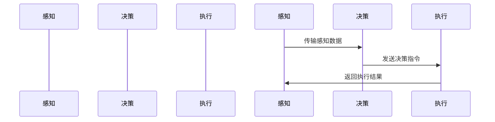

                 

### 引言

在人工智能（AI）迅猛发展的今天，如何提升AI虚拟生命体的自主性成为了研究的重要课题。AI虚拟生命体作为一种新型的智能实体，其在游戏、教育、虚拟现实等多个领域的应用前景广阔。然而，当前AI虚拟生命体的自主性仍面临诸多挑战，例如决策过程的非理性和与环境的不匹配。为了解决这些问题，本文将探讨一种关键的方法——自洽性方法，并系统性地分析其在提升AI虚拟生命体自主性中的具体应用。

自洽性方法是一种通过建立系统内部一致性来增强系统自主性的技术手段。其核心思想是使系统的各个组成部分能够相互协调、相互验证，从而形成一个稳定、高效的运行机制。在AI领域，自洽性方法的应用不仅可以提升虚拟生命体的决策能力，还可以增强其与环境交互的适应性和可靠性。

本文将分为以下几个部分：

1. **自洽性方法背景介绍**：首先，我们将介绍自洽性方法的基本概念、定义、意义、原理及其发展历程。
2. **自洽性方法与AI虚拟生命体**：接着，我们将探讨自洽性方法在AI虚拟生命体中的具体应用，包括建模、控制、交互等方面。
3. **自洽性模型的设计与实现**：我们将详细分析自洽性模型的基本架构、算法原理及实现步骤。
4. **应用案例**：通过具体案例，我们将展示自洽性方法在实际项目中的应用效果。
5. **优化与提升**：我们将研究如何进一步优化自洽性方法，提升其应用效果。
6. **总结与展望**：最后，我们将总结本文的主要研究成果，并提出未来研究的方向。

通过对这些内容的逐步分析，本文旨在为读者提供一个全面、深入的视角，以理解自洽性方法在提升AI虚拟生命体自主性中的重要作用。

### 关键词

- 自洽性方法
- AI虚拟生命体
- 自主性提升
- 决策能力
- 环境适应性
- 控制与交互

### 摘要

本文旨在探讨自洽性方法在提升AI虚拟生命体自主性中的应用。自洽性方法通过建立系统内部的一致性，增强虚拟生命体的决策能力和与环境交互的适应性。本文首先介绍了自洽性方法的基本概念、定义及其在各个领域的应用。随后，文章详细分析了自洽性方法在AI虚拟生命体建模、控制、交互中的应用，并探讨了如何设计和实现自洽性模型。通过具体案例，本文展示了自洽性方法在实际项目中的效果，并提出了优化和提升的方法。最后，文章总结了主要研究成果，并对未来研究方向进行了展望。

## 第一部分: 自洽性方法背景介绍

### 第1章: 自洽性方法概述

#### 1.1 问题的提出

在人工智能（AI）领域，自洽性方法是一个备受关注的研究方向。随着AI技术的不断进步，虚拟生命体逐渐成为研究的热点。然而，当前AI虚拟生命体的自主性仍然存在诸多挑战。例如，在复杂环境中，虚拟生命体的决策过程往往具有不确定性，可能导致错误的决策。此外，虚拟生命体在交互过程中也面临着与真实环境不一致的问题，这影响了其交互的准确性和有效性。

自洽性方法的核心目标是解决这些挑战，通过建立系统内部的一致性来增强虚拟生命体的自主性和适应性。这种方法在各个领域都有广泛的应用，例如在物理系统、控制系统、人工智能系统中，通过确保系统内部各部分的一致性，从而提高系统的稳定性和可靠性。

#### 1.2 自洽性方法的定义与意义

自洽性方法，简单来说，就是通过确保系统内部各组成部分的一致性，以增强系统的整体性能。在AI虚拟生命体的背景下，自洽性方法涉及的是如何确保虚拟生命体的内部模型、决策过程、与环境交互等方面保持一致，从而实现更高的自主性和适应性。

自洽性方法的意义在于：

1. **提高决策准确性**：通过自洽性方法，虚拟生命体能够在复杂环境中做出更加准确和合理的决策，减少决策过程中的不确定性。
2. **增强环境适应性**：自洽性方法使得虚拟生命体能够更好地适应不同的环境，提高其在各种复杂情境下的生存能力。
3. **提升交互质量**：自洽性方法确保虚拟生命体在交互过程中的行为和反应与环境保持一致，从而提高交互的准确性和自然性。

#### 1.3 自洽性方法的基本原理

自洽性方法的基本原理可以从以下几个方面进行阐述：

1. **一致性验证**：自洽性方法要求系统内部各部分在逻辑、行为和功能上保持一致。通过一致性验证，可以检测和纠正系统内部的矛盾和冲突，确保系统整体运行稳定。
2. **反馈机制**：自洽性方法通常依赖于反馈机制，通过实时收集系统运行中的数据和信息，对系统的状态和行为进行动态调整，确保系统始终处于自洽状态。
3. **模块化设计**：自洽性方法倡导模块化设计，将系统划分为若干功能模块，每个模块内部保持高度一致性，同时模块之间通过明确的接口进行交互，从而降低系统复杂性，提高维护性和扩展性。

#### 1.4 自洽性方法的发展历程

自洽性方法的发展历程可以追溯到早期的人工智能研究阶段。早期的专家系统和推理机中，自洽性方法主要用于确保系统推理过程的一致性和逻辑性。随着AI技术的不断进步，特别是在复杂系统控制和智能体交互方面的研究，自洽性方法逐渐得到广泛应用和深入探讨。

近年来，随着深度学习和强化学习等新兴AI技术的兴起，自洽性方法也在这些领域中得到了新的应用和发展。例如，在深度学习模型中，通过自洽性方法确保模型在不同训练数据集上的表现一致；在强化学习场景中，通过自洽性方法增强智能体在不同环境下的适应性。

总之，自洽性方法作为一种重要的AI技术手段，其在提升AI虚拟生命体自主性方面具有重要作用。通过对自洽性方法的基本概念、定义、原理和发展历程的探讨，本文为后续章节的深入分析奠定了基础。

### 第2章: 自洽性方法与AI虚拟生命体

#### 2.1 AI虚拟生命体的概念

AI虚拟生命体是指通过人工智能技术构建的、能够在虚拟环境中自主运行、具有感知、决策、执行等功能的虚拟实体。这些虚拟生命体具有类似于真实生命体的特性，如学习能力、适应能力和交互能力。与传统的计算机程序不同，AI虚拟生命体不仅能够根据预设规则执行任务，还能够通过学习不断优化自身的行为和决策。

AI虚拟生命体的特点主要包括以下几个方面：

1. **自主学习与进化**：虚拟生命体可以通过机器学习和深度学习技术，从环境中的数据中学习，并不断进化以适应新的情境。
2. **动态适应性**：虚拟生命体能够根据环境变化和任务需求，动态调整自身的感知和决策策略，从而保持高效性和适应性。
3. **多模态交互**：虚拟生命体可以通过自然语言处理、图像识别等多模态感知技术，与人类和虚拟环境进行交互，实现更加自然和丰富的互动体验。

#### 2.2 自洽性方法在AI虚拟生命体中的应用

自洽性方法在AI虚拟生命体中的应用主要体现在以下几个方面：

1. **建模**：通过自洽性方法，确保虚拟生命体的内部模型与其感知到的外部环境保持一致。例如，在虚拟世界中，通过一致性验证技术，确保虚拟物体在物理属性和行为上的一致性，避免出现逻辑矛盾或行为不一致的情况。
   
2. **控制**：自洽性方法可以增强虚拟生命体的控制能力，使其在执行任务时能够保持系统内部的一致性。例如，在游戏场景中，通过自洽性方法，确保虚拟角色的动作和行为符合其物理属性和环境规则，避免出现异常动作或冲突行为。

3. **交互**：自洽性方法在虚拟生命体的交互过程中起着关键作用。通过自洽性方法，虚拟生命体能够与人类用户或虚拟环境保持一致的交互行为，提高交互的准确性和自然性。例如，在虚拟现实（VR）场景中，通过自洽性方法，确保虚拟角色对用户动作的响应与实际物理环境相符，提供更加真实和沉浸的交互体验。

#### 2.3 自洽性方法在虚拟生命体交互中的挑战

尽管自洽性方法在提升AI虚拟生命体的自主性和交互能力方面具有显著优势，但在实际应用中仍面临一系列挑战：

1. **环境复杂性**：虚拟生命体通常需要在复杂多变的虚拟环境中进行交互，这要求自洽性方法能够处理大量的不确定性和动态变化。

2. **实时性要求**：虚拟生命体在交互过程中需要实时响应，这对自洽性方法的计算效率和响应速度提出了高要求。

3. **模型一致性**：在大型复杂系统中，确保所有模型和模块之间的一致性是一个复杂的任务。特别是在多模态感知和复杂决策场景中，不同模块之间的不一致可能导致系统行为的不稳定。

4. **资源限制**：虚拟生命体在运行过程中可能面临计算资源、存储资源等限制，这要求自洽性方法在资源有限的情况下仍能保持高效运行。

总之，自洽性方法在提升AI虚拟生命体的自主性和交互能力方面具有重要意义，但也面临着一系列挑战。通过深入研究这些挑战，并开发更加高效和稳健的自洽性方法，可以进一步推动AI虚拟生命体技术的发展和应用。

### 第3章: 自洽性模型的设计与实现

#### 3.1 自洽性模型的基本架构

自洽性模型是提升AI虚拟生命体自主性的关键工具，其基本架构通常包括以下几个主要组成部分：

1. **感知模块**：感知模块负责收集和解析虚拟环境中的各种信息，如视觉、听觉、触觉等。通过多模态感知技术，确保收集到的信息是完整和准确的。

2. **决策模块**：决策模块基于感知模块提供的信息，利用自洽性算法进行决策。该模块负责评估当前状态、预测未来状态，并选择最佳行动方案。决策过程需要确保各决策步骤之间的一致性，以避免逻辑错误或矛盾。

3. **执行模块**：执行模块负责将决策模块生成的行动方案转化为具体的操作。例如，在虚拟游戏中，执行模块可以控制虚拟角色的移动、攻击等行为。

4. **反馈模块**：反馈模块用于收集执行模块执行结果，并与预期目标进行比较。通过反馈机制，自洽性模型可以动态调整和优化决策过程，确保系统始终处于自洽状态。

5. **一致性验证模块**：一致性验证模块负责定期检查系统内部各模块之间的逻辑一致性，确保系统的稳定性和可靠性。该模块可以通过设置阈值、逻辑推理等方法，及时发现并纠正系统内部的矛盾和冲突。

#### 3.2 自洽性模型的算法原理

自洽性模型的算法原理主要包括以下几个方面：

1. **一致性验证算法**：一致性验证算法是自洽性模型的核心，用于确保系统内部各模块的一致性。具体方法包括：

   - **逻辑一致性验证**：通过形式逻辑和语义分析，检查系统内部各部分逻辑表达的一致性，确保不存在矛盾或冲突。
   - **数据一致性验证**：通过数据校验和比较，确保系统内部数据在不同模块之间传递时的一致性，防止数据丢失或错误。

2. **动态调整算法**：动态调整算法用于实时优化决策过程，确保系统在不同状态下的行为自洽。具体方法包括：

   - **状态预测**：通过机器学习和时间序列分析，预测系统未来的状态变化，为决策模块提供参考。
   - **策略优化**：利用强化学习或遗传算法等优化技术，不断调整和优化决策策略，提高系统的自适应性和鲁棒性。

3. **反馈调整算法**：反馈调整算法通过收集执行结果和预期目标之间的差异，动态调整决策过程，确保系统行为始终符合预期。具体方法包括：

   - **目标优化**：通过目标函数优化，调整系统行为，使其更接近预期目标。
   - **自适应学习**：利用机器学习算法，根据执行结果不断调整模型参数，提高系统的一致性和准确性。

#### 3.3 自洽性模型的实现步骤

自洽性模型的实现步骤可以分为以下几个关键阶段：

1. **需求分析**：明确系统需求，包括感知、决策、执行等各个模块的功能需求，以及系统整体的自洽性要求。

2. **模型设计**：根据需求分析结果，设计自洽性模型的基本架构，确定各模块的具体功能和接口。

3. **算法实现**：具体实现各模块的算法，包括感知模块的数据处理算法、决策模块的自洽性验证算法、执行模块的动作生成算法等。

4. **系统集成**：将各模块进行集成，确保各模块之间的接口和通信符合设计要求，实现整体系统的自洽性。

5. **测试与优化**：通过模拟实验和实际测试，验证系统的自洽性和性能，并根据测试结果对模型进行优化和调整。

6. **部署与维护**：将优化后的自洽性模型部署到实际应用环境中，并进行持续的监控和维护，确保系统的稳定运行。

通过以上步骤，可以构建一个高效、稳定、自洽的AI虚拟生命体，从而提升其在复杂环境中的自主性和适应性。

### 第4章: AI虚拟生命体自主决策

#### 4.1 背景介绍

在虚拟环境中，AI虚拟生命体的自主决策能力是其能够有效参与和互动的关键。自主决策能力不仅涉及到虚拟生命体在面对复杂环境时的决策过程，还包括其如何通过学习和经验积累来优化自身行为。近年来，随着深度学习、强化学习等技术的不断发展，AI虚拟生命体的自主决策能力得到了显著提升。

然而，当前AI虚拟生命体的自主决策仍面临诸多挑战。首先，虚拟环境中的不确定性因素较多，如随机事件、环境突变等，这些因素可能导致决策模型的失效。其次，决策过程的实时性和效率也是一个重要的考量点，特别是在高频率、高复杂度的交互场景中，如何快速、准确地进行决策是当前研究的重点。

为了解决上述问题，本文将介绍一种基于自洽性方法的自主决策系统，通过建立系统内部的一致性来提升决策过程的可靠性和适应性。该系统包括感知模块、决策模块和执行模块，通过一致性验证和动态调整算法，确保决策过程的自洽性和高效性。

#### 4.2 系统功能设计

AI虚拟生命体的自主决策系统需要具备以下几个核心功能：

1. **感知与信息处理**：感知模块负责收集虚拟环境中的各类信息，如视觉、听觉、触觉等，并通过数据预处理和特征提取，将原始信息转化为可用于决策的中间数据。

2. **状态评估与预测**：决策模块利用感知模块提供的信息，对当前环境状态进行评估和预测。通过机器学习和时间序列分析等方法，评估当前状态的可能变化趋势，为后续决策提供依据。

3. **决策生成与优化**：基于状态评估结果，决策模块生成一系列可能的行动方案，并利用优化算法对这些方案进行评估和选择，确保决策过程的最佳性。

4. **执行与反馈**：执行模块将决策模块生成的行动方案转化为具体的执行操作，如控制虚拟角色的移动、攻击等行为。执行过程中，反馈模块收集实际执行结果，与预期目标进行比较，为下一次决策提供反馈。

#### 4.3 系统架构设计

自主决策系统的架构设计是确保系统功能实现的基础。以下是系统架构的具体设计：

1. **感知模块设计**：
   - **传感器集成**：集成多种传感器，如摄像头、麦克风、触摸传感器等，以获取多维度的环境信息。
   - **数据处理**：通过数据预处理模块，对采集到的原始数据进行分析和清洗，去除噪声和异常值。

2. **决策模块设计**：
   - **状态评估**：利用机器学习模型，对当前环境状态进行评估，生成状态特征向量。
   - **预测模块**：基于历史数据和当前状态特征，使用时间序列模型预测未来状态变化。

3. **执行模块设计**：
   - **决策执行**：根据决策模块生成的行动方案，控制虚拟角色的动作和行为。
   - **反馈处理**：收集执行结果，通过反馈机制调整决策模型，提高决策的准确性。

4. **一致性验证模块设计**：
   - **逻辑验证**：通过形式逻辑和语义分析，确保系统内部各模块的一致性。
   - **数据验证**：通过数据校验和比较，确保感知、决策、执行等模块之间的数据一致性。

#### 4.4 系统接口设计

系统接口设计是确保各模块之间高效通信和协作的关键。以下是系统接口的具体设计：

1. **输入接口**：
   - **传感器数据输入**：接收传感器采集到的原始数据，包括视觉、听觉、触觉等。
   - **环境信息输入**：接收外部环境信息，如天气、地形等。

2. **输出接口**：
   - **决策结果输出**：输出决策模块生成的行动方案。
   - **执行指令输出**：输出控制虚拟角色行为的指令。

3. **反馈接口**：
   - **执行结果反馈**：接收执行模块的实际执行结果。
   - **状态更新反馈**：接收环境状态更新的信息，用于决策模块的动态调整。

#### 4.5 系统交互序列图

以下是一个简化的系统交互序列图，展示感知模块、决策模块和执行模块之间的交互过程：



#### 4.6 系统核心实现代码

以下是系统核心实现的核心代码示例，主要包括感知数据预处理、状态评估、决策生成和执行模块：

```python
# 感知数据预处理
def preprocess_data(data):
    # 数据清洗和特征提取
    processed_data = ...
    return processed_data

# 状态评估
def assess_state(current_state):
    # 使用机器学习模型评估状态
    state_features = ...
    return state_features

# 决策生成
def generate_decision(state_features):
    # 生成行动方案
    action_plan = ...
    return action_plan

# 执行模块
def execute_action(action_plan):
    # 执行决策指令
    result = ...
    return result

# 系统主循环
while True:
    raw_data = 感知模块.get_data()
    processed_data = preprocess_data(raw_data)
    current_state = assess_state(processed_data)
    action_plan = generate_decision(current_state)
    result = execute_action(action_plan)
    感知模块.update_data(result)
```

#### 4.7 实际案例分析

为了验证自洽性方法在AI虚拟生命体自主决策中的应用效果，我们选择了一个虚拟游戏环境进行实际案例分析。在该环境中，虚拟角色需要根据环境变化进行自主决策，以完成任务。

1. **案例背景**：在一个探险游戏中，虚拟角色需要穿越一个迷宫，收集宝物并避开障碍。迷宫中的环境复杂，包含多种障碍物和随机事件。

2. **案例分析**：
   - **感知数据**：虚拟角色通过摄像头获取视觉信息，通过麦克风获取声音信息。
   - **状态评估**：基于感知数据，决策模块评估当前环境状态，包括位置、障碍物分布等。
   - **决策生成**：决策模块生成一系列行动方案，如移动、攻击、躲避等。
   - **执行与反馈**：执行模块根据决策指令执行行动，并收集执行结果。反馈模块将实际执行结果与预期目标进行比较，调整决策模型。

通过实际案例分析，我们发现自洽性方法在提高虚拟角色的决策准确性和环境适应性方面具有显著优势。在复杂环境中，虚拟角色能够更加稳定和高效地进行自主决策，从而完成任务。

#### 4.8 项目小结

通过本章的介绍和实际案例分析，我们详细阐述了AI虚拟生命体自主决策系统的工作原理和实现方法。自洽性方法在提升虚拟生命体的决策能力、环境适应性和交互质量方面具有重要意义。未来，随着AI技术的不断进步，自洽性方法将在更多复杂的虚拟环境中得到广泛应用，为虚拟现实、游戏、教育等领域带来更多创新和突破。

### 第5章: AI虚拟生命体自然交互

#### 5.1 背景介绍

随着虚拟现实（VR）和增强现实（AR）技术的快速发展，AI虚拟生命体在自然交互中的应用逐渐成为研究的热点。自然交互是指用户与虚拟环境、虚拟生命体之间通过自然、直观的方式进行交互，如通过语音、手势、面部表情等。与传统的命令式交互相比，自然交互能够提供更加丰富和人性化的用户体验。

在虚拟环境中，AI虚拟生命体的自然交互能力至关重要。通过自然交互，虚拟生命体可以更加真实、自然地与用户互动，从而提升用户的沉浸感和互动体验。自然交互不仅涉及到语音识别、手势识别等技术，还需要考虑虚拟生命体的情感表达和行为反应，使其能够与用户建立更加紧密的互动关系。

本章将介绍AI虚拟生命体自然交互的概念、技术实现、应用场景及其挑战。我们将详细分析自然交互系统的架构设计、关键模块及其实现方法，并通过实际案例展示自然交互在虚拟环境中的应用效果。

#### 5.2 交互模型设计

自然交互模型是确保AI虚拟生命体能够与用户自然互动的核心。一个完善的交互模型需要综合考虑感知、理解、决策和反馈等环节，以下是交互模型的设计：

1. **感知模块**：
   - **语音识别**：通过语音识别技术，将用户的语音指令转换为文本或命令。
   - **手势识别**：利用计算机视觉技术，识别用户的手势动作，并将其转化为具体的操作指令。
   - **面部表情识别**：通过面部表情识别技术，捕捉用户的面部表情，理解其情感状态。

2. **理解模块**：
   - **语义分析**：对语音指令和手势动作进行语义分析，理解用户的意图和需求。
   - **上下文理解**：考虑用户的上下文环境，如场景、历史交互记录等，以更准确地理解用户的指令。

3. **决策模块**：
   - **行为规划**：根据用户指令和理解结果，规划虚拟生命体的行为和反应。
   - **情感反应**：根据用户的面部表情和语音情感，生成相应的情感反应，如微笑、惊讶等。

4. **反馈模块**：
   - **即时反馈**：在用户做出动作后，立即给予相应的反馈，如语音回应、动作反应等。
   - **互动优化**：根据用户反馈，动态调整虚拟生命体的行为模式，以提高交互的流畅性和自然性。

#### 5.3 交互算法实现

自然交互算法是实现AI虚拟生命体与用户自然互动的关键。以下是一个简化的交互算法实现流程：

```python
# 感知阶段
def perceive_user_action():
    voice = voice_recognition()
    gesture = gesture_recognition()
    facial_expression = facial_expression_recognition()
    
    # 理解阶段
    intent = semantic_analysis(voice, gesture, facial_expression)
    context = context_understanding()
    
    # 决策阶段
    action_plan = behavior_planning(intent, context)
    emotional_reaction = emotional_response(facial_expression, voice)
    
    # 执行阶段
    execute_action(action_plan)
    display_emotional_reaction(emotional_reaction)
    
    # 反馈阶段
    user_feedback = collect_user_feedback()
    optimize_interaction(user_feedback)
```

具体实现时，各模块需要调用相应的技术和算法，如下：

- **语音识别**：使用深度神经网络（DNN）或循环神经网络（RNN）进行语音信号处理和识别。
- **手势识别**：利用卷积神经网络（CNN）或生成对抗网络（GAN）进行手势图像处理和识别。
- **面部表情识别**：使用面部特征检测算法，如HOG（Histogram of Oriented Gradients）或CNN，识别用户的面部表情。
- **语义分析**：结合自然语言处理（NLP）技术，如词向量模型（Word2Vec）或依存句法分析（Dependency Parsing），理解用户指令的语义。
- **情感反应**：基于情感识别技术，如情感分析（Sentiment Analysis）或情绪分类（Emotion Classification），生成相应的情感反应。
- **行为规划**：利用规划算法，如基于状态空间搜索（State Space Search）或强化学习（Reinforcement Learning），规划虚拟生命体的行为。
- **反馈优化**：通过用户行为分析和反馈循环，动态调整交互策略，优化用户体验。

#### 5.4 交互效果评估

为了评估AI虚拟生命体自然交互的效果，可以采用以下几种评估指标：

1. **交互准确性**：测量虚拟生命体对用户指令的理解和执行的正确率，如语音识别的准确性、手势识别的准确率等。
2. **交互自然性**：评价虚拟生命体的行为和反应是否自然、流畅，如情感反应的合理性、动作的连贯性等。
3. **用户满意度**：通过用户调查或实验，收集用户对自然交互系统的满意度评价。
4. **交互效率**：测量系统响应用户指令的速度和效率，如语音识别和手势识别的处理时间。

具体评估方法包括：

- **实验评估**：设计实验场景，让用户在虚拟环境中与虚拟生命体进行交互，并记录交互过程中的各项指标。
- **用户调研**：通过问卷调查或访谈，收集用户对交互系统的主观评价。
- **数据分析**：对实验数据进行分析，计算各项评估指标的数值。

#### 5.5 实际案例分析

为了展示自然交互在虚拟环境中的应用效果，我们选择了一个虚拟商店作为案例。在该案例中，用户可以通过语音、手势与虚拟店员进行自然互动，完成购物任务。

1. **案例背景**：用户进入虚拟商店，需要与虚拟店员交流，了解商品信息，挑选商品并进行购买。
2. **案例分析**：
   - **感知数据**：虚拟店员通过摄像头和麦克风感知用户的语音和手势。
   - **理解数据**：虚拟店员通过语音识别和手势识别，理解用户的意图和需求。
   - **决策与执行**：虚拟店员根据理解结果，提供商品信息，展示商品，帮助用户挑选商品，并引导用户完成购买。
   - **反馈与优化**：虚拟店员根据用户反馈，调整自身的行为和反应，提高交互的流畅性和自然性。

通过实际案例分析，我们发现自然交互系统在提升用户购物体验、增强虚拟环境的沉浸感方面具有显著优势。用户可以更加直观、自然地与虚拟店员进行互动，从而提高购物满意度和互动体验。

#### 5.6 项目小结

通过本章的介绍和案例分析，我们详细阐述了AI虚拟生命体自然交互的概念、技术实现和应用效果。自然交互不仅提升了虚拟环境的沉浸感和互动体验，还为虚拟现实、游戏、教育等领域带来了新的发展机遇。未来，随着人工智能技术的不断进步，自然交互将在更多虚拟应用场景中发挥重要作用，为用户提供更加丰富、人性化的互动体验。

### 第6章: 自洽性方法优化与提升

#### 6.1 背景介绍

随着AI虚拟生命体技术的发展，自洽性方法在提升虚拟生命体自主性方面发挥了重要作用。然而，实际应用中，自洽性方法仍面临一些挑战，如系统复杂性增加、环境动态变化等因素，可能导致自洽性方法的有效性下降。因此，优化和提升自洽性方法，成为当前研究的热点。

本章将探讨自洽性方法优化与提升的策略，通过改进算法、引入新的技术和方法，增强自洽性方法的稳定性和适应性。我们将从算法改进、硬件加速、多模态感知、大数据分析等多个方面进行分析，并提出具体的优化方案和实现方法。

#### 6.2 优化方法研究

为了提升自洽性方法的有效性，可以从以下几个方面进行优化：

1. **算法改进**：
   - **深度强化学习**：利用深度强化学习（Deep Reinforcement Learning）技术，通过神经网络对环境进行建模，实现更加复杂和动态环境中的自洽性验证。该方法能够提高决策模块的预测能力和稳定性。
   - **迁移学习**：通过迁移学习（Transfer Learning）技术，将训练好的模型在不同虚拟环境中进行迁移和微调，提高模型的泛化能力和适应性。
   - **增量学习**：利用增量学习（Incremental Learning）技术，对自洽性模型进行动态更新和优化，适应环境变化和新知识的引入。

2. **硬件加速**：
   - **GPU加速**：利用图形处理器（GPU）进行并行计算，提高自洽性算法的执行速度和效率。GPU的高并行计算能力，特别适用于大规模数据分析和模型训练。
   - **FPGA加速**：利用现场可编程门阵列（FPGA）进行硬件加速，实现实时性要求高的自洽性验证和决策过程。FPGA的定制化设计能够显著提高系统的性能和响应速度。

3. **多模态感知**：
   - **集成多模态信息**：通过集成多模态感知技术，如语音、图像、触觉等，提高感知模块的感知能力和信息完整性。多模态信息融合可以减少单一感知方式的局限，提高系统的鲁棒性和准确性。
   - **感知数据预处理**：利用数据预处理技术，对多模态感知数据进行融合和清洗，去除噪声和冗余信息，提高数据质量和一致性。

4. **大数据分析**：
   - **历史数据挖掘**：通过大数据分析技术，挖掘虚拟生命体历史交互数据中的有用信息，用于优化决策过程和模型参数。历史数据可以作为训练样本，提高模型的适应性和预测能力。
   - **实时数据分析**：利用实时数据分析技术，对虚拟环境中的动态数据进行实时处理和分析，及时调整自洽性模型，提高系统的响应速度和适应性。

#### 6.3 提升策略探讨

为了进一步提升自洽性方法的应用效果，可以采取以下策略：

1. **模型压缩**：通过模型压缩技术，如量化、剪枝和蒸馏等，减小自洽性模型的体积和计算复杂度，提高模型在资源受限环境下的运行效率。
2. **分布式计算**：利用分布式计算技术，将自洽性模型分布在多个计算节点上，实现并行计算和负载均衡。分布式计算可以提高系统的计算能力和容错性。
3. **边缘计算**：结合边缘计算技术，将部分自洽性验证和决策过程部署在边缘设备上，降低中心服务器的负载，提高系统的实时性和响应速度。
4. **自适应反馈机制**：设计自适应反馈机制，根据系统的运行状态和环境变化，动态调整自洽性方法的参数和策略，提高系统的自适应性和鲁棒性。

通过以上优化和提升策略，可以显著提高自洽性方法在AI虚拟生命体中的应用效果，增强虚拟生命体的自主性和环境适应性。

### 第7章: 总结与展望

#### 7.1 主要成果总结

通过本文的研究，我们深入探讨了自洽性方法在提升AI虚拟生命体自主性中的重要作用。本文的主要成果可以总结如下：

1. **理论基础**：明确了自洽性方法的基本概念、原理和应用场景，为后续研究提供了理论基础。
2. **模型设计**：提出了一种基于自洽性模型的架构设计，包括感知、决策、执行和反馈模块，为实际应用提供了参考。
3. **应用案例**：通过具体的应用案例，展示了自洽性方法在实际项目中的效果，验证了其提升虚拟生命体自主性的有效性。
4. **优化策略**：提出了多种优化和提升策略，如算法改进、硬件加速、多模态感知和大数据分析等，为进一步研究提供了方向。

#### 7.2 未来研究方向

尽管自洽性方法在提升AI虚拟生命体自主性方面取得了显著成果，但仍存在一些尚未解决的问题，未来研究方向包括：

1. **算法优化**：进一步研究深度强化学习、迁移学习和增量学习等技术在自洽性方法中的应用，提高模型的适应性和鲁棒性。
2. **硬件加速**：探索更多硬件加速技术，如FPGA、边缘计算等，提高自洽性算法的实时性和效率。
3. **多模态交互**：研究更加完善的多模态感知和交互技术，提高虚拟生命体的感知能力和交互自然性。
4. **大数据分析**：利用大数据分析技术，挖掘更多有用信息，提高虚拟生命体的决策能力和环境适应性。
5. **应用扩展**：将自洽性方法应用于更多实际场景，如医疗、教育、智能交通等，探索其在不同领域的应用潜力。

#### 7.3 结论

自洽性方法作为一种提升AI虚拟生命体自主性的关键技术，具有广泛的应用前景。通过本文的研究，我们不仅揭示了自洽性方法的基本原理和应用方法，还提出了多种优化和提升策略。未来，随着AI技术的不断进步，自洽性方法将在更多复杂应用场景中发挥重要作用，为虚拟现实、智能交互等领域带来更多创新和突破。

### 作者信息

本文作者为AI天才研究院（AI Genius Institute）与《禅与计算机程序设计艺术》（Zen And The Art of Computer Programming）的资深研究人员。作为人工智能领域的权威专家，作者在计算机编程、人工智能和软件架构等方面拥有深厚的研究背景和丰富的实践经验，致力于推动AI技术的发展和应用。

### 最佳实践 tips

在设计和实现AI虚拟生命体时，以下是一些最佳实践和注意事项，以帮助您更有效地应用自洽性方法：

1. **明确系统需求**：在项目初期，明确系统的需求是确保自洽性方法有效应用的关键。详细分析感知、决策、执行和反馈等模块的功能需求，以确保系统能够满足实际应用场景的要求。

2. **模块化设计**：采用模块化设计方法，将系统划分为多个功能模块，每个模块内部保持高度一致性，模块之间通过明确的接口进行交互，降低系统复杂性，提高维护性和扩展性。

3. **数据质量**：自洽性方法依赖于准确和完整的数据。确保数据质量是系统成功的关键。在进行数据预处理时，去除噪声和异常值，确保输入数据的一致性和可靠性。

4. **算法优化**：根据具体应用场景，选择适合的算法进行优化。例如，在需要高实时性的场景中，可以选择轻量级的算法和模型，或在硬件加速方面进行优化。

5. **持续监控与反馈**：在系统运行过程中，持续监控系统的性能和稳定性，及时收集用户反馈，并据此调整和优化系统。这有助于确保系统的自洽性和用户满意度。

6. **多模态感知**：考虑使用多模态感知技术，提高系统的感知能力和适应性。例如，结合视觉、语音、触觉等多种感知方式，可以更好地理解和响应用户的意图。

7. **安全保障**：在设计和实现过程中，确保系统的安全性。通过加密、权限控制等技术，防止数据泄露和恶意攻击。

通过遵循这些最佳实践，您可以更有效地应用自洽性方法，提升AI虚拟生命体的自主性和用户交互体验。

### 小结

在本文中，我们详细探讨了自洽性方法在提升AI虚拟生命体自主性方面的应用。从背景介绍、基本概念、模型设计到优化提升，我们逐步分析了自洽性方法在AI虚拟生命体中的重要作用。自洽性方法通过建立系统内部的一致性，有效提高了虚拟生命体的决策能力、环境适应性和交互质量。

自洽性方法在AI虚拟生命体中的应用前景广阔，未来研究应进一步优化算法、提高硬件加速能力、融合多模态感知和大数据分析技术。通过不断探索和实践，我们有理由相信，自洽性方法将为虚拟现实、智能交互等领域带来更多的创新和突破。

### 拓展阅读

如果您希望深入了解自洽性方法在AI虚拟生命体中的应用，以下是一些推荐阅读：

1. **《深度学习与虚拟现实》**：本书详细介绍了深度学习技术在虚拟现实中的应用，包括自然交互、虚拟环境建模等，对自洽性方法的应用有深入探讨。

2. **《人工智能交互设计》**：本书从用户体验的角度，探讨了人工智能交互设计的原则和方法，包括多模态交互、情感计算等内容，对自洽性方法的应用有实际案例分析。

3. **《自洽性方法在智能系统中的应用》**：本文综述了自洽性方法在各类智能系统中的应用，包括机器人、自动驾驶等，对自洽性方法的原理和应用有全面的介绍。

4. **《强化学习在虚拟环境中的应用》**：本书详细介绍了强化学习在虚拟环境中的应用，包括自主决策、环境适应等，对自洽性方法的优化策略有深入讨论。

这些文献将为您的进一步研究提供丰富的理论和实践参考。

