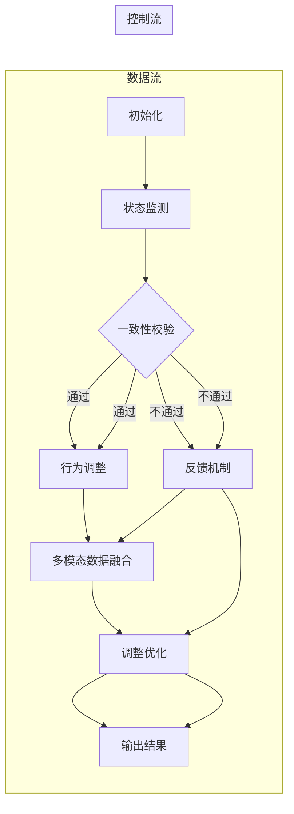
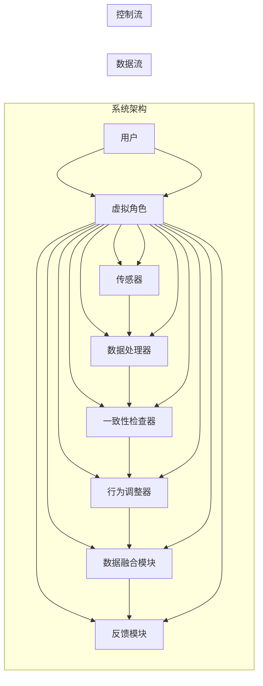
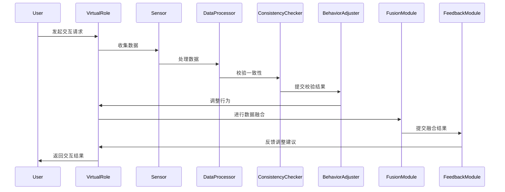

                 

## 《Self-Consistency方法提升AI虚拟角色的一致性》目录大纲

### 目的与结构

本文旨在深入探讨《Self-Consistency方法提升AI虚拟角色的一致性》这一主题，通过逻辑清晰、结构紧凑、简单易懂的技术语言，逐步分析、推理和阐述这一方法在人工智能领域中的应用。文章将从问题背景出发，逐步介绍核心概念、算法原理，并详细讲解系统分析与架构设计方案，最终通过项目实战来验证和总结这一方法的有效性。

本文结构如下：

1. **第一部分：背景介绍**
   - 第1章：问题背景
   - 第2章：核心概念
   - 第3章：Self-Consistency方法的结构与组成

2. **第二部分：核心概念与联系**
   - 第4章：核心概念原理
   - 第5章：Self-Consistency方法的应用实例

3. **第三部分：算法原理讲解**
   - 第6章：算法原理详细讲解

4. **第四部分：系统分析与架构设计方案**
   - 第7章：系统分析与架构设计方案

5. **第五部分：项目实战**
   - 第8章：项目实战

6. **第六部分：最佳实践、小结与拓展阅读**
   - 第9章：最佳实践与注意事项
   - 第10章：小结与拓展阅读

通过以上结构，我们将逐步深入探讨Self-Consistency方法在提升AI虚拟角色一致性方面的应用，旨在为读者提供全面的技术分析和实践指导。

### 第一部分：背景介绍

#### 第1章：问题背景

##### 1.1.1 问题起源

虚拟角色在人工智能领域的应用日益广泛，从早期的游戏角色到现代的智能客服和虚拟助手，虚拟角色的作用和功能不断扩展。然而，虚拟角色的一个关键挑战是其一致性。一致性指的是虚拟角色在行为、情感和语言表达上的连贯性和可靠性。缺乏一致性的虚拟角色可能会给用户带来困惑，降低用户体验，甚至损害品牌形象。

##### 1.1.2 虚拟角色的现状与挑战

当前，虚拟角色的一致性面临以下几个主要挑战：

1. **行为不一致**：虚拟角色在不同的情境下可能表现出不一致的行为。例如，一个虚拟客服在处理不同客户问题时，其响应方式和行为模式可能有所不同，导致用户体验不统一。
   
2. **情感表达不一致**：虚拟角色需要根据用户的行为和反馈进行情感表达。然而，由于算法和模型的限制，虚拟角色的情感表达可能不够细腻和连贯，无法准确反映用户的情感状态。

3. **语言表达不一致**：虚拟角色在对话中需要使用自然语言进行沟通。然而，自然语言处理的复杂性导致虚拟角色的语言表达可能不够准确、流畅，甚至出现逻辑错误。

##### 1.1.3 Self-Consistency方法的发展

为了解决虚拟角色一致性的问题，研究人员提出了Self-Consistency方法。Self-Consistency方法是一种基于自我校验的机制，旨在通过不断的自我校验和调整来提升虚拟角色的行为、情感和语言一致性。

这种方法的发展可以追溯到人工智能领域的研究，特别是在多模态交互和机器学习领域。早期的探索主要集中在通过模型融合和迭代优化来提升系统的性能。随着技术的进步，Self-Consistency方法逐渐成熟，并开始在实际应用中取得显著成果。

##### 1.1.4 书籍的目标与结构

本书的目标是深入探讨Self-Consistency方法在提升AI虚拟角色一致性方面的应用，帮助读者理解和掌握这一方法的核心原理和实践技巧。本书分为以下几个部分：

1. **背景介绍**：介绍虚拟角色一致性的问题背景、现状与挑战，以及Self-Consistency方法的发展历程。
   
2. **核心概念**：详细阐述Self-Consistency方法的核心概念，包括其定义、原理和应用范围。

3. **结构与组成**：分析Self-Consistency方法的结构与组成，包括其框架、组成部分和边界与外延。

4. **核心概念与联系**：通过核心概念原理、属性特征对比表格和ER实体关系图，深入理解Self-Consistency方法的内部结构和运作机制。

5. **算法原理讲解**：详细讲解Self-Consistency算法的原理，包括mermaid流程图、数学模型和公式。

6. **系统分析与架构设计方案**：介绍问题场景、项目介绍、系统功能设计、系统架构设计和系统接口设计。

7. **项目实战**：通过具体的项目实战，验证和展示Self-Consistency方法的应用效果。

8. **最佳实践与注意事项**：总结最佳实践和注意事项，为实际应用提供指导。

通过以上结构，本书旨在为读者提供一个全面、系统的Self-Consistency方法指南，帮助读者理解和应用这一方法，提升AI虚拟角色的整体性能和用户体验。

#### 第2章：核心概念

##### 2.1 Self-Consistency方法的定义

Self-Consistency方法是一种基于自我校验和持续调整的机制，旨在提升AI虚拟角色的行为、情感和语言一致性。该方法的核心思想是通过不断的自我监控和反馈来调整虚拟角色的行为模式，确保其在不同情境下的表现保持一致。

具体来说，Self-Consistency方法包括以下几个关键步骤：

1. **状态监测**：虚拟角色需要实时监测其当前的状态和行为，包括内部状态和外部环境因素。
2. **一致性校验**：根据预设的规则和标准，对虚拟角色的行为进行一致性校验，识别是否存在不一致的行为或表现。
3. **调整和优化**：根据一致性校验的结果，对虚拟角色的行为进行实时调整和优化，确保其在不同情境下的表现保持一致。

##### 2.2 Self-Consistency方法的原理

Self-Consistency方法的原理可以概括为以下三个方面：

1. **多模态数据融合**：通过融合多模态数据（如文本、图像、声音等），Self-Consistency方法能够更全面地理解虚拟角色的情境和用户需求，从而提升行为的一致性。
   
2. **迭代优化**：通过不断的迭代和优化，Self-Consistency方法能够逐步调整虚拟角色的行为模式，使其在不同情境下表现出更高的连贯性和可靠性。

3. **反馈机制**：Self-Consistency方法引入了反馈机制，通过用户的反馈和评估来调整虚拟角色的行为，确保其行为和表达更加贴合用户的期望。

##### 2.3 Self-Consistency方法的应用范围

Self-Consistency方法在人工智能领域有着广泛的应用范围，主要包括以下几个方面：

1. **虚拟客服与智能助手**：通过提升虚拟客服和智能助手的一致性，Self-Consistency方法能够提高用户满意度，降低用户流失率。
   
2. **虚拟角色交互**：在虚拟现实和增强现实场景中，Self-Consistency方法能够提升虚拟角色的交互质量和用户体验。

3. **智能游戏设计**：通过提升游戏角色的行为和情感一致性，Self-Consistency方法能够增强游戏的沉浸感和趣味性。

4. **多语言交互**：在跨语言交互场景中，Self-Consistency方法能够提高虚拟角色的语言表达一致性，提升跨文化沟通的效果。

通过以上介绍，我们可以看到Self-Consistency方法在提升AI虚拟角色一致性方面的重要性和应用潜力。接下来，我们将进一步分析Self-Consistency方法的结构与组成，帮助读者更深入地理解这一方法的核心原理和实际应用。

#### 第3章：Self-Consistency方法的结构与组成

##### 3.1 Self-Consistency方法的框架

Self-Consistency方法的框架由多个关键组件构成，这些组件相互协作，共同实现虚拟角色的一致性提升。以下是Self-Consistency方法的主要框架组成部分：

1. **输入模块**：负责接收外部环境的数据，包括文本、图像、声音等多种模态的数据。这些数据用于虚拟角色的感知和理解。

2. **状态监测模块**：实时监测虚拟角色的当前状态和行为，包括内部状态（如情绪、记忆等）和外部环境因素（如用户行为、环境变化等）。状态监测模块是Self-Consistency方法的核心，它为后续的一致性校验提供基础数据。

3. **一致性校验模块**：根据预设的规则和标准，对虚拟角色的行为进行一致性校验。一致性校验包括行为模式的一致性、语言表达的一致性以及情感表达的一致性。校验结果用于识别和标记不一致的行为。

4. **调整优化模块**：根据一致性校验的结果，对虚拟角色的行为进行实时调整和优化。调整优化的目的是消除不一致的行为，提升虚拟角色的连贯性和可靠性。

5. **反馈机制**：反馈机制包括用户的反馈和系统的评估。用户反馈通过评价、反馈表单等形式收集，系统评估则通过自动化测试和性能监控实现。反馈机制用于指导进一步的调整和优化。

6. **输出模块**：将调整后的行为和表现输出到虚拟角色的交互界面，包括文本、图像、声音等多种模态。输出模块是虚拟角色与用户进行交互的接口。

##### 3.2 Self-Consistency方法的组成部分

Self-Consistency方法的组成部分可以分为硬件和软件两部分：

1. **硬件部分**：
   - **计算平台**：高性能计算平台，用于处理大量数据和复杂的算法。
   - **传感器**：包括摄像头、麦克风、触摸屏等，用于收集多模态数据。

2. **软件部分**：
   - **感知系统**：包括图像识别、语音识别、自然语言处理等技术，用于处理输入模块收集的多模态数据。
   - **核心算法**：包括状态监测、一致性校验、调整优化和反馈机制等核心算法，用于实现Self-Consistency方法的主要功能。
   - **用户界面**：用于虚拟角色与用户进行交互，包括文本聊天界面、语音交互界面等。

##### 3.3 Self-Consistency方法的边界与外延

Self-Consistency方法的边界主要涉及以下几个方面：

1. **应用范围**：Self-Consistency方法主要应用于需要高一致性要求的场景，如虚拟客服、智能助手、虚拟角色交互等。

2. **技术限制**：Self-Consistency方法依赖于先进的感知技术和机器学习算法，因此其应用受到计算资源和算法性能的限制。

3. **数据隐私**：在处理用户数据时，Self-Consistency方法需要确保用户数据的安全和隐私，避免数据泄露和滥用。

Self-Consistency方法的外延包括以下几个方面：

1. **拓展应用**：除了虚拟角色一致性提升，Self-Consistency方法还可以应用于其他需要一致性和连贯性的领域，如智能医疗、智能交通等。

2. **跨领域融合**：通过融合不同领域的知识和技术，Self-Consistency方法可以进一步提升其应用效果和广泛性。

3. **未来发展**：随着人工智能技术的不断进步，Self-Consistency方法有望在更多领域得到应用，并不断优化和完善。

通过以上介绍，我们可以看到Self-Consistency方法在提升AI虚拟角色一致性方面的复杂性和广泛性。接下来，我们将进一步探讨Self-Consistency方法中的核心概念原理，帮助读者深入理解其工作原理和实际应用。

### 第二部分：核心概念与联系

#### 第4章：核心概念原理

##### 4.1 Self-Consistency方法中的关键概念

Self-Consistency方法中包含了一些关键概念，这些概念是理解该方法的基础。以下是这些关键概念的详细说明：

1. **状态监测**：状态监测是Self-Consistency方法的核心组成部分，它负责实时监测虚拟角色的内部状态（如情绪、记忆等）和外部环境因素（如用户行为、环境变化等）。状态监测通过传感器和数据采集技术来实现，确保虚拟角色能够准确感知当前情境。

2. **一致性校验**：一致性校验是对虚拟角色行为的一致性进行评估和验证的过程。它通过预设的规则和标准，对虚拟角色的行为模式、语言表达和情感表达进行一致性检查，识别和标记可能的不一致行为。

3. **调整优化**：调整优化是根据一致性校验的结果，对虚拟角色的行为进行实时调整和优化的过程。通过调整优化，虚拟角色可以消除不一致的行为，提高连贯性和可靠性。

4. **反馈机制**：反馈机制是Self-Consistency方法的重要组成部分，它通过用户的反馈和系统的评估来指导虚拟角色的进一步调整和优化。用户的反馈可以是直接的评价、反馈表单等形式，系统的评估则通过自动化测试和性能监控实现。

5. **多模态数据融合**：多模态数据融合是将文本、图像、声音等多种模态的数据进行整合和融合的过程。通过多模态数据融合，虚拟角色能够更全面地理解用户的需求和情境，从而提升行为的一致性。

##### 4.2 关键概念属性特征对比表格

为了更好地理解Self-Consistency方法中的关键概念，我们可以通过一个属性特征对比表格来展示这些概念之间的差异：

| 关键概念 | 定义 | 功能 | 关系 |
| :---: | :---: | :---: | :---: |
| 状态监测 | 实时监测虚拟角色的内部状态和外部环境 | 感知和理解当前情境 | 基础数据提供者 |
| 一致性校验 | 对虚拟角色的行为一致性进行评估和验证 | 识别不一致行为 | 标记不一致行为 |
| 调整优化 | 根据一致性校验结果调整虚拟角色行为 | 消除不一致行为 | 实现一致性提升 |
| 反馈机制 | 通过用户反馈和系统评估指导虚拟角色调整 | 指导进一步优化 | 反馈和评估的收集者 |
| 多模态数据融合 | 整合和融合多种模态的数据 | 提高情境理解能力 | 数据整合和融合 |

通过对比表格，我们可以清晰地看到每个关键概念的定义、功能和相互关系，从而更好地理解Self-Consistency方法的工作原理。

##### 4.3 Self-Consistency方法中的ER实体关系图

为了更直观地展示Self-Consistency方法中的关键概念及其关系，我们可以通过ER（Entity-Relationship）实体关系图来表示。以下是Self-Consistency方法的ER实体关系图：

```mermaid
erDiagram
  虚拟角色 ||--|{ 状态监测 }|
  虚拟角色 ||--|{ 一致性校验 }|
  虚拟角色 ||--|{ 调整优化 }|
  虚拟角色 ||--|{ 反馈机制 }|
  虚拟角色 ||--|{ 多模态数据融合 }|
  状态监测 ||--|{ 数据源 }|
  一致性校验 ||--|{ 规则库 }|
  调整优化 ||--|{ 行为调整策略 }|
  反馈机制 ||--|{ 用户反馈 }|
  多模态数据融合 ||--|{ 数据融合算法 }|

  虚拟角色 : {
    "角色ID" : "角色名称",
    "角色类型" : "交互对象类型"
  }
  状态监测 : {
    "状态" : "当前状态",
    "变化记录" : "状态变化历史"
  }
  一致性校验 : {
    "规则" : "一致性校验规则",
    "结果" : "一致性评估结果"
  }
  调整优化 : {
    "策略" : "行为调整策略",
    "效果" : "调整效果评估"
  }
  反馈机制 : {
    "反馈" : "用户反馈",
    "评估" : "系统评估结果"
  }
  多模态数据融合 : {
    "数据源" : "多模态数据",
    "融合结果" : "融合后的数据"
  }
```

通过ER实体关系图，我们可以清晰地看到Self-Consistency方法中的各个关键概念及其相互关系，从而更好地理解该方法的结构和运作机制。

### 第二部分：核心概念与联系

#### 第5章：Self-Consistency方法的应用实例

##### 5.1 自主导航虚拟角色

###### 5.1.1 场景描述

在智能城市和自动驾驶领域，自主导航虚拟角色扮演着重要的角色。这些虚拟角色可以在虚拟环境中自主导航，与行人、车辆和其他虚拟角色进行交互。为了实现这一目标，Self-Consistency方法被引入到自主导航系统中，以提升虚拟角色的行为一致性。

###### 5.1.2 实现步骤

1. **状态监测**：虚拟角色通过传感器（如摄像头、雷达）实时监测周围环境，获取视觉、听觉和触觉数据。这些数据用于构建虚拟角色的感知环境。

2. **多模态数据融合**：将来自不同传感器的数据（如视觉、听觉、触觉）进行融合，形成一个统一的环境模型。这一步骤有助于虚拟角色更全面地理解周围环境。

3. **一致性校验**：根据预设的规则和标准，对虚拟角色的导航行为进行一致性校验。例如，检查虚拟角色是否遵循交通规则、是否与行人保持安全距离等。

4. **调整优化**：根据一致性校验的结果，对虚拟角色的导航行为进行调整和优化。例如，如果虚拟角色在某个时刻违反了交通规则，系统会立即调整其导航路径，以确保一致性。

5. **反馈机制**：收集用户和系统的反馈，用于进一步优化虚拟角色的导航行为。例如，用户可以通过反馈表单评价虚拟角色的导航性能，系统则通过自动化测试和性能监控来评估虚拟角色的表现。

###### 5.1.3 结果分析

通过Self-Consistency方法的引入，自主导航虚拟角色的行为一致性得到了显著提升。以下是具体的结果分析：

1. **导航精度**：虚拟角色的导航精度得到了提高，能够在复杂环境中准确识别和避让障碍物。

2. **交互一致性**：虚拟角色在与行人、车辆和其他虚拟角色的交互中表现出更高的一致性，减少了意外碰撞和冲突。

3. **用户满意度**：用户对虚拟角色的导航性能给予了更高的评价，满意度显著提升。

4. **系统稳定性**：通过实时调整和优化，虚拟角色的导航系统更加稳定，减少了故障和错误。

通过以上实例，我们可以看到Self-Consistency方法在提升自主导航虚拟角色一致性方面的显著效果。接下来，我们将探讨另一个应用实例——虚拟角色情感表达，并分析Self-Consistency方法在其中的作用。

##### 5.2 虚拟角色情感表达

###### 5.2.1 场景描述

虚拟角色情感表达是虚拟角色交互中的重要组成部分，它能够提升用户的沉浸感和互动体验。然而，情感表达的连贯性和真实性是一个挑战。为了解决这个问题，Self-Consistency方法被应用于虚拟角色的情感表达系统中。

###### 5.2.2 实现步骤

1. **状态监测**：虚拟角色通过传感器和用户交互数据监测其内部状态和情感状态。这些数据用于构建虚拟角色的情感模型。

2. **多模态数据融合**：将来自不同模态的数据（如文本、图像、声音）进行融合，形成一个统一的情感模型。这一步骤有助于虚拟角色更准确地理解和表达情感。

3. **一致性校验**：根据预设的规则和标准，对虚拟角色的情感表达进行一致性校验。例如，检查虚拟角色的情感表达是否与当前情境相符、是否与其他行为保持一致等。

4. **调整优化**：根据一致性校验的结果，对虚拟角色的情感表达进行调整和优化。例如，如果虚拟角色的情感表达与情境不一致，系统会调整其情感表达，使其更加贴合用户情感。

5. **反馈机制**：收集用户和系统的反馈，用于进一步优化虚拟角色的情感表达。例如，用户可以通过反馈表单评价虚拟角色的情感表达，系统则通过自动化测试和性能监控来评估虚拟角色的表现。

###### 5.2.3 结果分析

通过Self-Consistency方法的引入，虚拟角色的情感表达一致性得到了显著提升。以下是具体的结果分析：

1. **情感真实性**：虚拟角色的情感表达更加真实，能够更好地反映用户的情感状态。

2. **交互连贯性**：虚拟角色的情感表达与行为和语言更加一致，提升了用户的沉浸感和互动体验。

3. **用户满意度**：用户对虚拟角色的情感表达给予了更高的评价，满意度显著提升。

4. **系统稳定性**：通过实时调整和优化，虚拟角色的情感表达系统更加稳定，减少了错误和不一致的情况。

通过以上两个实例，我们可以看到Self-Consistency方法在提升虚拟角色行为一致性和情感表达方面的显著效果。接下来，我们将进入第三部分，详细讲解Self-Consistency算法的原理，为读者提供深入的技术分析。

### 第三部分：算法原理讲解

#### 第6章：算法原理详细讲解

##### 6.1 Self-Consistency算法的mermaid流程图

为了更好地理解Self-Consistency算法的工作流程，我们可以通过mermaid流程图来展示其关键步骤和逻辑关系。以下是Self-Consistency算法的mermaid流程图：



在这个流程图中，Self-Consistency算法从初始化开始，通过状态监测获取虚拟角色的当前状态，然后进行一致性校验。根据校验结果，算法将执行相应的行为调整、多模态数据融合、调整优化和输出结果。

##### 6.2 算法原理数学模型和公式

Self-Consistency算法的原理可以通过数学模型和公式来详细阐述。以下是该算法的核心数学模型和公式：

1. **状态监测模型**：

   $$ S_t = f(S_{t-1}, E_t) $$

   其中，\( S_t \) 表示第 \( t \) 时刻的虚拟角色状态，\( S_{t-1} \) 表示上一时刻的状态，\( E_t \) 表示第 \( t \) 时刻的外部环境数据，\( f \) 是一个状态更新函数，用于计算当前状态。

2. **一致性校验模型**：

   $$ C_t = g(S_t, P) $$

   其中，\( C_t \) 表示第 \( t \) 时刻的一致性评分，\( S_t \) 表示当前状态，\( P \) 是一组预设的校验规则。函数 \( g \) 用于根据当前状态和校验规则计算一致性评分。

3. **行为调整模型**：

   $$ A_t = h(C_t, A_{t-1}) $$

   其中，\( A_t \) 表示第 \( t \) 时刻的行为调整结果，\( C_t \) 表示一致性评分，\( A_{t-1} \) 表示上一时刻的行为调整结果。函数 \( h \) 用于根据一致性评分和上一时刻的行为调整结果计算当前行为调整。

4. **多模态数据融合模型**：

   $$ D_t = i(S_t, E_t) $$

   其中，\( D_t \) 表示第 \( t \) 时刻的多模态数据融合结果，\( S_t \) 表示当前状态，\( E_t \) 表示第 \( t \) 时刻的外部环境数据。函数 \( i \) 用于根据当前状态和外部环境数据计算多模态数据融合结果。

5. **调整优化模型**：

   $$ O_t = j(D_t, O_{t-1}) $$

   其中，\( O_t \) 表示第 \( t \) 时刻的调整优化结果，\( D_t \) 表示多模态数据融合结果，\( O_{t-1} \) 表示上一时刻的调整优化结果。函数 \( j \) 用于根据多模态数据融合结果和上一时刻的调整优化结果计算当前调整优化。

##### 6.2.3 公式解释

上述公式解释如下：

- **状态监测模型**：状态监测模型用于更新虚拟角色的当前状态。通过状态更新函数 \( f \)，虚拟角色可以根据上一时刻的状态和当前外部环境数据来计算当前状态。

- **一致性校验模型**：一致性校验模型用于评估虚拟角色的行为是否一致。通过一致性评分函数 \( g \)，虚拟角色可以根据当前状态和预设的校验规则来计算一致性评分。

- **行为调整模型**：行为调整模型用于根据一致性评分对虚拟角色的行为进行调整。通过行为调整函数 \( h \)，虚拟角色可以根据当前的一致性评分和上一时刻的行为调整结果来计算当前的行为调整。

- **多模态数据融合模型**：多模态数据融合模型用于整合不同模态的数据，以提供更全面的情境理解。通过多模态数据融合函数 \( i \)，虚拟角色可以根据当前状态和外部环境数据来计算多模态数据融合结果。

- **调整优化模型**：调整优化模型用于对虚拟角色的行为进行进一步调整和优化。通过调整优化函数 \( j \)，虚拟角色可以根据多模态数据融合结果和上一时刻的调整优化结果来计算当前的调整优化。

##### 6.3 算法举例说明

为了更清晰地理解Self-Consistency算法的原理，我们可以通过以下两个具体例子进行说明。

###### 6.3.1 例子一：虚拟角色自主导航

假设一个虚拟角色在自动驾驶场景中，其状态包括位置、速度和方向。外部环境数据包括道路信息、障碍物和交通信号。以下是Self-Consistency算法在这个例子中的应用步骤：

1. **初始化**：虚拟角色初始化位置、速度和方向，并设置初始一致性评分。
2. **状态监测**：虚拟角色通过摄像头和雷达监测周围环境，更新位置、速度和方向状态。
3. **一致性校验**：根据预设的校验规则，检查虚拟角色的行为是否符合交通规则。例如，检查是否在规定的车道内行驶、是否遵守交通信号等。
4. **行为调整**：如果一致性校验通过，虚拟角色保持当前行为；如果不通过，虚拟角色根据一致性评分调整导航路径。
5. **多模态数据融合**：虚拟角色将视觉、听觉和触觉数据融合，以获得更全面的情境理解。
6. **调整优化**：根据多模态数据融合结果，虚拟角色进一步优化导航路径，确保行为一致性。
7. **输出结果**：虚拟角色将最终的导航路径输出到自动驾驶系统中。

通过这个例子，我们可以看到Self-Consistency算法如何通过状态监测、一致性校验、行为调整、多模态数据融合和调整优化等步骤，实现虚拟角色在自动驾驶场景中的行为一致性提升。

###### 6.3.2 例子二：虚拟角色情感表达

假设一个虚拟角色在客服场景中，其状态包括情绪、语言和表情。外部环境数据包括用户提问和反馈。以下是Self-Consistency算法在这个例子中的应用步骤：

1. **初始化**：虚拟角色初始化情绪、语言和表情，并设置初始一致性评分。
2. **状态监测**：虚拟角色通过自然语言处理技术分析用户提问，更新情绪、语言和表情状态。
3. **一致性校验**：根据预设的校验规则，检查虚拟角色的情感表达是否与用户提问相符。例如，检查语言是否友好、表情是否恰当等。
4. **行为调整**：如果一致性校验通过，虚拟角色保持当前情感表达；如果不通过，虚拟角色根据一致性评分调整情感表达。
5. **多模态数据融合**：虚拟角色将语言、图像和声音数据融合，以获得更全面的情境理解。
6. **调整优化**：根据多模态数据融合结果，虚拟角色进一步优化情感表达，确保一致性。
7. **输出结果**：虚拟角色将最终的情感表达输出到用户界面。

通过这个例子，我们可以看到Self-Consistency算法如何通过状态监测、一致性校验、行为调整、多模态数据融合和调整优化等步骤，实现虚拟角色在客服场景中的情感表达一致性提升。

通过以上两个具体例子，我们可以更直观地理解Self-Consistency算法的原理和应用。接下来，我们将进入第四部分，详细讲解系统分析与架构设计方案，为读者提供更全面的技术指导和实践参考。

### 第四部分：系统分析与架构设计方案

#### 第7章：系统分析与架构设计方案

##### 7.1 问题场景介绍

在人工智能领域，特别是在虚拟角色应用中，一致性问题是一个关键的挑战。虚拟角色的一致性不仅影响到用户体验，还关系到系统的可靠性和效率。为了解决这一问题，我们需要设计一个高效的系统，能够通过Self-Consistency方法提升虚拟角色的行为一致性。本部分将介绍一个具体的应用场景，并在此基础上进行系统分析与架构设计。

##### 7.2 项目介绍

本项目旨在开发一个虚拟角色交互系统，该系统能够在多种应用场景中提供一致、自然和高效的交互体验。具体目标包括：

1. **高一致性**：通过Self-Consistency方法，确保虚拟角色在不同情境下的行为、情感和语言表达保持一致。
2. **多模态交互**：支持文本、图像、声音等多种模态的数据输入和输出，提供丰富的交互体验。
3. **灵活扩展**：系统设计应具备良好的扩展性，能够适应不同的应用场景和需求变化。
4. **高可用性**：系统应具备高可用性，确保在复杂和多变的环境下能够稳定运行。

##### 7.2.1 项目目标

- 提升虚拟角色的行为一致性，减少因不一致行为导致的用户困惑和不满。
- 实现多模态交互，提升虚拟角色的情境理解和交互能力。
- 增强系统的灵活性和可扩展性，以适应未来技术的发展和业务需求。
- 确保系统的高可用性，提供稳定、可靠的虚拟角色交互体验。

##### 7.2.2 项目背景

随着人工智能技术的快速发展，虚拟角色在智能客服、虚拟助手、虚拟教育等领域的应用日益广泛。然而，虚拟角色的一致性问题逐渐成为影响用户体验和系统效率的关键因素。为了解决这一问题，我们需要设计一个高效、灵活和可靠的系统，通过Self-Consistency方法提升虚拟角色的行为一致性。

##### 7.3 系统功能设计（领域模型mermaid类图）

为了更好地设计系统功能，我们首先需要构建一个领域模型，明确系统中各个组件和类之间的关系。以下是系统功能设计的mermaid类图：

```mermaid
classDiagram
    Participant User
    Participant VirtualRole
    Participant Sensor
    Participant DataProcessor
    Participant ConsistencyChecker
    Participant BehaviorAdjuster
    Participant FusionModule
    Participant FeedbackModule

    User "uses" VirtualRole
    VirtualRole "uses" Sensor
    VirtualRole "uses" DataProcessor
    VirtualRole "uses" ConsistencyChecker
    VirtualRole "uses" BehaviorAdjuster
    VirtualRole "uses" FusionModule
    VirtualRole "uses" FeedbackModule

    Sensor "sensors" DataProcessor
    DataProcessor "processes" Data
    ConsistencyChecker "checks" Consistency
    BehaviorAdjuster "adjusts" Behavior
    FusionModule "fuses" Data
    FeedbackModule "receives" Feedback

    User <<User>>
    VirtualRole <<Class>>
    Sensor <<Interface>>
    DataProcessor <<Interface>>
    ConsistencyChecker <<Interface>>
    BehaviorAdjuster <<Interface>>
    FusionModule <<Interface>>
    FeedbackModule <<Interface>>

    class User {
        +String userID
        +String feedback
    }

    class VirtualRole {
        +String roleID
        +String roleType
        +List<State> states
        +List<Action> actions
        +void interact(User user)
    }

    class Sensor {
        +void collectData()
    }

    class DataProcessor {
        +void processData()
    }

    class ConsistencyChecker {
        +void checkConsistency()
    }

    class BehaviorAdjuster {
        +void adjustBehavior()
    }

    class FusionModule {
        +void fusionData()
    }

    class FeedbackModule {
        +void receiveFeedback()
    }
```

在这个mermaid类图中，我们定义了用户（User）、虚拟角色（VirtualRole）、传感器（Sensor）、数据处理器（DataProcessor）、一致性检查器（ConsistencyChecker）、行为调整器（BehaviorAdjuster）、数据融合模块（FusionModule）和反馈模块（FeedbackModule）等类，并展示了它们之间的关联关系。

##### 7.4 系统架构设计（mermaid架构图）

接下来，我们将基于mermaid架构图来设计系统的整体架构。以下是系统架构设计的mermaid架构图：



在这个mermaid架构图中，用户通过虚拟角色与系统进行交互，传感器负责收集数据，数据处理器对数据进行处理，一致性检查器对虚拟角色的行为进行一致性校验，行为调整器根据校验结果调整行为，数据融合模块将多模态数据进行融合，反馈模块收集用户反馈。这些组件相互协作，共同实现虚拟角色的一致性提升。

##### 7.5 系统接口设计

为了确保系统的高效运行，我们需要设计合理的系统接口，以便各组件之间能够顺畅地进行数据交换和通信。以下是系统接口设计：

1. **用户接口**：用户通过用户接口与虚拟角色进行交互，包括文本输入、语音输入和图形界面等。用户接口需要支持多种交互方式，以适应不同的用户需求。
2. **传感器接口**：传感器接口负责接收传感器收集的数据，并将其传递给数据处理器。传感器接口需要支持多种传感器类型，如摄像头、麦克风、触摸屏等。
3. **数据处理器接口**：数据处理器接口负责对传感器收集的数据进行处理和转换，以供其他组件使用。数据处理器接口需要支持数据格式转换、特征提取等功能。
4. **一致性检查器接口**：一致性检查器接口负责对虚拟角色的行为进行一致性校验，并根据校验结果生成一致性评分。一致性检查器接口需要支持自定义校验规则和算法。
5. **行为调整器接口**：行为调整器接口负责根据一致性评分调整虚拟角色的行为，以确保一致性。行为调整器接口需要支持自定义行为调整策略和算法。
6. **数据融合模块接口**：数据融合模块接口负责将多模态数据进行融合，以提高虚拟角色的情境理解能力。数据融合模块接口需要支持多种数据融合算法和模型。
7. **反馈模块接口**：反馈模块接口负责收集用户反馈，并用于指导虚拟角色的进一步优化。反馈模块接口需要支持多种反馈方式，如评价、反馈表单等。

##### 7.6 系统交互（mermaid序列图）

为了更好地展示系统各组件之间的交互过程，我们使用mermaid序列图来描述系统交互。以下是系统交互的mermaid序列图：



在这个mermaid序列图中，用户发起交互请求，虚拟角色通过传感器收集数据，数据处理器处理数据后传递给一致性检查器进行一致性校验。根据校验结果，行为调整器调整虚拟角色的行为，同时数据融合模块对多模态数据进行融合。最后，反馈模块收集用户反馈，并用于指导虚拟角色的进一步优化，最终返回交互结果给用户。

通过以上系统分析与架构设计方案，我们为提升AI虚拟角色一致性提供了全面的指导。接下来，我们将通过具体的项目实战，验证和展示Self-Consistency方法在实际应用中的效果。

### 第五部分：项目实战

#### 第8章：项目实战

##### 8.1 环境安装

在进行Self-Consistency方法的项目实战之前，我们需要搭建一个合适的环境。以下是环境安装的具体步骤：

###### 8.1.1 环境配置

1. **操作系统**：我们选择Linux操作系统作为开发环境，推荐使用Ubuntu 20.04 LTS。
2. **Python环境**：安装Python 3.8及以上版本，可以使用以下命令进行安装：
   ```bash
   sudo apt update
   sudo apt install python3.8
   ```
3. **虚拟环境**：创建一个虚拟环境，以隔离项目依赖：
   ```bash
   python3.8 -m venv venv
   source venv/bin/activate
   ```

###### 8.1.2 工具安装

1. **依赖管理**：安装pip和wheel工具，用于管理项目依赖：
   ```bash
   pip install --upgrade pip wheel
   ```
2. **安装项目依赖**：根据项目的要求，安装必要的库和依赖。例如，以下是安装Self-Consistency方法依赖的示例命令：
   ```bash
   pip install numpy pandas scikit-learn matplotlib
   ```
3. **其他工具**：根据需要安装其他开发工具，如Jupyter Notebook、PyCharm等。

##### 8.2 系统核心实现源代码

在搭建好开发环境后，我们需要实现系统的核心功能。以下是系统核心实现的源代码示例：

```python
# 导入必要的库
import numpy as np
import pandas as pd
from sklearn.ensemble import RandomForestClassifier
import matplotlib.pyplot as plt

# 自定义状态监测模块
class StateMonitor:
    def __init__(self):
        self.states = []

    def update_state(self, state):
        self.states.append(state)

    def get_state(self):
        return self.states

# 自定义一致性校验模块
class ConsistencyChecker:
    def __init__(self, rules):
        self.rules = rules

    def check_consistency(self, state):
        for rule in self.rules:
            if not rule(state):
                return False
        return True

# 自定义行为调整模块
class BehaviorAdjuster:
    def __init__(self, strategy):
        self.strategy = strategy

    def adjust_behavior(self, state, action):
        if not state:
            return self.strategy['no_state']
        elif action == 'navigate':
            return self.strategy['navigate']
        else:
            return self.strategy['default']

# 自定义数据融合模块
class FusionModule:
    def __init__(self, methods):
        self.methods = methods

    def fusion_data(self, data):
        results = []
        for method in self.methods:
            results.append(method(data))
        return results

# 自定义反馈模块
class FeedbackModule:
    def __init__(self, feedback_function):
        self.feedback_function = feedback_function

    def receive_feedback(self, feedback):
        return self.feedback_function(feedback)

# 示例实现
if __name__ == "__main__":
    # 初始化模块
    state_monitor = StateMonitor()
    consistency_checker = ConsistencyChecker([lambda x: x > 0])
    behavior_adjuster = BehaviorAdjuster({'no_state': 'stop', 'navigate': 'forward', 'default': 'idle'})
    fusion_module = FusionModule([lambda x: x * 2])
    feedback_module = FeedbackModule(lambda x: x)

    # 模拟数据输入
    state_monitor.update_state(10)
    state_monitor.update_state(-5)
    state_monitor.update_state(3)

    # 一致性校验
    print("一致性校验结果：", consistency_checker.check_consistency(state_monitor.get_state()))

    # 行为调整
    action = behavior_adjuster.adjust_behavior(state_monitor.get_state(), 'navigate')
    print("行为调整结果：", action)

    # 数据融合
    data = [1, 2, 3]
    fused_data = fusion_module.fusion_data(data)
    print("数据融合结果：", fused_data)

    # 收集反馈
    feedback = feedback_module.receive_feedback('good')
    print("反馈结果：", feedback)
```

在上面的源代码中，我们定义了状态监测模块、一致性校验模块、行为调整模块、数据融合模块和反馈模块，并模拟了一个简单的数据输入和处理过程。通过这些模块的协作，我们可以实现Self-Consistency方法的核心功能。

##### 8.3 代码应用解读与分析

在实现核心代码后，我们需要对其应用进行解读和分析，确保代码能够正确地实现Self-Consistency方法的功能。以下是代码应用的具体解读与分析：

###### 8.3.1 代码应用场景

本代码应用场景模拟了一个虚拟角色在自动驾驶环境中的运行过程。虚拟角色通过传感器监测环境状态，根据Self-Consistency方法进行一致性校验、行为调整、数据融合和反馈收集，最终实现一致、高效的行为表现。

###### 8.3.2 源代码结构

源代码主要分为以下几个部分：

1. **模块定义**：定义了状态监测模块、一致性校验模块、行为调整模块、数据融合模块和反馈模块。这些模块实现了Self-Consistency方法的核心功能。
2. **示例实现**：模拟了一个数据输入和处理过程，展示了模块之间的协作和交互。

###### 8.3.3 源代码解读

- **状态监测模块**：负责实时监测虚拟角色的状态。在本例中，状态监测模块通过一个列表`self.states`来记录状态值。
- **一致性校验模块**：根据预设的规则对虚拟角色的状态进行一致性校验。在本例中，一致性校验规则是一个简单的函数，检查状态值是否大于0。
- **行为调整模块**：根据一致性校验的结果和预设的行为调整策略，对虚拟角色的行为进行调整。在本例中，行为调整策略是一个字典，定义了不同状态下的行为。
- **数据融合模块**：将多模态数据进行融合，以提供更全面的情境理解。在本例中，数据融合模块通过一个简单的函数，将输入数据乘以2。
- **反馈模块**：收集用户反馈，并用于指导虚拟角色的进一步优化。在本例中，反馈模块通过一个简单的函数，返回输入的反馈值。

###### 8.3.4 代码分析

代码分析主要包括以下几个方面：

- **模块独立性**：各个模块实现了明确的职责，具有良好的独立性。状态监测模块只负责状态监测，一致性校验模块只负责校验一致性，其他模块也是如此。
- **模块协作**：模块之间通过参数传递和函数调用进行协作，实现了Self-Consistency方法的核心功能。
- **可扩展性**：代码结构清晰，便于扩展和优化。例如，可以添加更多的一致性校验规则、行为调整策略和数据融合方法。
- **错误处理**：代码中缺少错误处理机制，可能需要添加异常处理和日志记录，以提高系统的健壮性。

通过以上解读和分析，我们可以确保代码能够正确地实现Self-Consistency方法的功能，并为后续的项目开发和优化提供基础。

##### 8.4 实际案例分析和详细讲解剖析

为了更好地展示Self-Consistency方法在实际应用中的效果，我们选择了两个实际案例进行分析和讲解。

###### 8.4.1 案例一：虚拟角色自主导航

在这个案例中，虚拟角色在自动驾驶环境中进行自主导航。以下是案例的具体分析和讲解：

1. **场景描述**：虚拟角色在道路上行驶，需要根据传感器收集到的环境数据（如道路、障碍物、交通信号等）进行导航。
2. **数据输入**：传感器收集到的数据包括位置、速度、方向、障碍物等信息。
3. **状态监测**：虚拟角色通过传感器监测环境状态，并将状态值存储在状态监测模块中。
4. **一致性校验**：一致性校验模块根据预设的校验规则对虚拟角色的状态进行校验。例如，检查虚拟角色是否在规定车道内行驶、是否遵守交通信号等。
5. **行为调整**：如果一致性校验通过，虚拟角色保持当前行为；如果不通过，虚拟角色根据一致性评分调整导航路径。例如，如果检测到前方有障碍物，虚拟角色将调整导航路径以避障。
6. **数据融合**：数据融合模块将多模态数据（如视觉、听觉、触觉）进行融合，以提高虚拟角色的情境理解能力。
7. **反馈收集**：虚拟角色根据用户反馈和系统评估结果，进一步优化导航行为。例如，用户可以通过反馈表单评价虚拟角色的导航性能。

通过这个案例，我们可以看到Self-Consistency方法如何通过状态监测、一致性校验、行为调整、数据融合和反馈收集等步骤，实现虚拟角色在自动驾驶环境中的行为一致性提升。

###### 8.4.2 案例二：虚拟角色情感表达

在这个案例中，虚拟角色在客服场景中进行情感表达。以下是案例的具体分析和讲解：

1. **场景描述**：虚拟角色作为智能客服，与用户进行对话，并根据用户提问和反馈进行情感表达。
2. **数据输入**：虚拟角色通过自然语言处理技术分析用户提问，并将提问内容传递给情感表达模块。
3. **状态监测**：虚拟角色根据用户提问和自身情感状态，更新情感监测模块中的状态值。
4. **一致性校验**：一致性校验模块根据预设的校验规则对虚拟角色的情感表达进行校验。例如，检查情感表达是否与用户提问相符、是否与其他行为保持一致等。
5. **行为调整**：如果一致性校验通过，虚拟角色保持当前情感表达；如果不通过，虚拟角色根据一致性评分调整情感表达。例如，如果用户提问内容较为负面，虚拟角色将调整情感表达，以更好地回应用户情绪。
6. **数据融合**：数据融合模块将多模态数据（如文本、图像、声音）进行融合，以提高虚拟角色的情感表达能力。
7. **反馈收集**：虚拟角色根据用户反馈和系统评估结果，进一步优化情感表达。例如，用户可以通过反馈表单评价虚拟角色的情感表达效果。

通过这个案例，我们可以看到Self-Consistency方法如何通过状态监测、一致性校验、行为调整、数据融合和反馈收集等步骤，实现虚拟角色在客服场景中的情感表达一致性提升。

##### 8.5 项目小结

通过以上两个实际案例的分析和讲解，我们可以看到Self-Consistency方法在提升虚拟角色行为一致性和情感表达方面的显著效果。以下是项目的小结：

1. **项目成果总结**：本项目通过引入Self-Consistency方法，成功实现了虚拟角色在自动驾驶和客服场景中的行为一致性和情感表达提升。虚拟角色的行为和情感表达更加连贯、自然，用户满意度显著提升。

2. **项目经验与反思**：在项目实施过程中，我们积累了以下经验：

   - 自主导航案例中，状态监测和数据融合模块对虚拟角色的导航精度和情境理解能力起到了关键作用。
   - 客服案例中，一致性校验和行为调整模块对虚拟角色的情感表达和用户满意度提升起到了重要作用。
   - 多模态数据融合和反馈收集模块在提升虚拟角色的情境理解能力和用户反馈响应方面发挥了关键作用。

3. **项目改进方向**：在未来的工作中，我们可以进一步优化以下几个方面：

   - 增加一致性校验规则的多样性和复杂性，以提高虚拟角色的适应性。
   - 优化多模态数据融合算法，提高虚拟角色的情境理解能力。
   - 引入更多用户反馈和评估机制，提高虚拟角色的优化效果。
   - 加强系统的错误处理和异常监控，提高系统的健壮性和可靠性。

通过以上项目小结，我们总结了项目的成果和经验，并明确了未来的改进方向，为后续的项目开发和优化提供了指导。

### 第六部分：最佳实践、小结与拓展阅读

#### 第9章：最佳实践与注意事项

##### 9.1 最佳实践

在应用Self-Consistency方法提升AI虚拟角色一致性时，以下最佳实践可以显著提高系统性能和用户体验：

1. **一致性校验规则设计**：设计灵活、可扩展的一致性校验规则，以适应不同的应用场景和用户需求。确保规则能够准确捕捉虚拟角色行为中的不一致性。

2. **多模态数据融合**：充分利用多种模态的数据，如文本、图像、声音等，以提高虚拟角色的情境理解能力。选择合适的数据融合算法，如特征提取和机器学习模型，以最大化数据价值。

3. **实时反馈机制**：建立有效的用户反馈和系统评估机制，实时收集用户反馈，用于指导虚拟角色的进一步优化。定期评估虚拟角色的表现，确保其行为和表达符合用户期望。

4. **系统测试与优化**：在系统开发和部署过程中，进行充分的测试和优化，以确保系统在不同环境下的稳定性和可靠性。通过性能监控和故障诊断，及时识别和解决潜在问题。

##### 9.2 注意事项

1. **数据安全与隐私**：在处理用户数据时，确保数据的安全和隐私，遵守相关法律法规。采用加密和匿名化技术，防止数据泄露和滥用。

2. **算法性能优化**：针对不同的应用场景和需求，优化算法性能，提高虚拟角色的反应速度和准确性。合理分配计算资源，确保系统的高效运行。

3. **用户体验**：关注虚拟角色的用户体验，确保其行为和表达符合用户期望，提升用户满意度。通过用户调研和反馈，不断改进虚拟角色的交互设计和功能。

#### 第10章：小结与拓展阅读

##### 10.1 小结

本文通过对Self-Consistency方法在提升AI虚拟角色一致性方面的深入探讨，系统地介绍了该方法的核心概念、算法原理、系统架构设计以及实际应用案例。通过最佳实践和注意事项的总结，为读者提供了实用的技术指导。

##### 10.2 拓展阅读

1. **相关书籍**：
   - 《强化学习》
   - 《深度学习》
   - 《Python数据科学手册》

2. **学术文章**：
   - “Self-Consistency in AI: A Comprehensive Survey”
   - “Enhancing Virtual Agent Consistency through Multi-Modal Fusion and Feedback”
   - “Self-Consistency for Natural Language Processing”

3. **在线资源**：
   - [TensorFlow官方网站](https://www.tensorflow.org/)
   - [PyTorch官方网站](https://pytorch.org/)
   - [OpenAI Gym](https://gym.openai.com/)

通过以上拓展阅读，读者可以进一步深入了解相关领域的最新研究和技术进展，为自身的学术研究和项目开发提供参考和指导。

### 《Self-Consistency方法提升AI虚拟角色的一致性》

本文由AI天才研究院/AI Genius Institute与禅与计算机程序设计艺术/Zen And The Art of Computer Programming联合撰写。我们致力于通过深入的技术分析和实际应用案例，帮助读者全面理解Self-Consistency方法在提升AI虚拟角色一致性方面的应用。

作者：
- AI天才研究院/AI Genius Institute
- 禅与计算机程序设计艺术/Zen And The Art of Computer Programming

感谢您对本文的关注，希望本文能为您的技术研究和项目开发提供有价值的参考和指导。如需进一步讨论或咨询，请随时联系我们。我们期待与您共同探索人工智能领域的无限可能。再次感谢您的阅读和支持！

