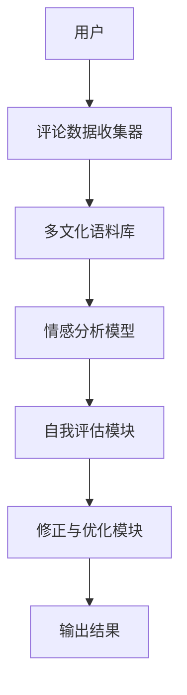
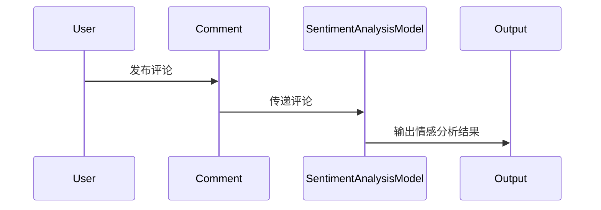
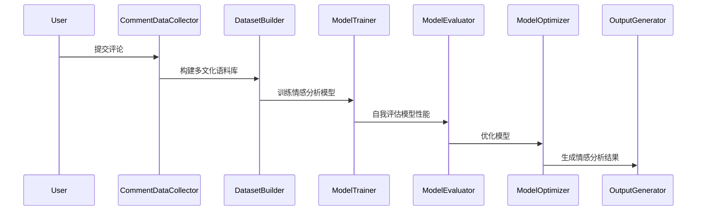

                 

### 自我一致性方法改善AI情感分析的文化敏感性

> 关键词：自我一致性、AI情感分析、文化敏感性、多文化语料库、多模态情感分析

> 摘要：本文探讨了自我一致性方法在改进AI情感分析的文化敏感性方面的应用。通过介绍该方法的核心概念、工作流程以及数学模型，本文详细分析了如何利用自我一致性方法提升AI模型在不同文化背景下的情感识别准确性，从而提高AI情感分析的整体性能。

#### **自我一致性方法改进AI情感分析的文化敏感性的背景**

**问题背景**

随着人工智能技术的快速发展，自然语言处理（NLP）领域取得了显著的成就。特别是在情感分析方面，AI模型已经能够较为准确地识别文本中的情感倾向，如正面、负面或中性。然而，这一技术在实际应用中仍面临诸多挑战，尤其是在跨文化语境下，如何提高AI模型的文化敏感性成为一个亟待解决的问题。

**问题描述**

情感分析通常基于大规模的语料库和机器学习算法，但现有的模型往往在处理不同文化背景下的情感时存在偏差。例如，同样的词语在不同的文化背景下可能表达完全不同的情感色彩。此外，语言习惯、文化传统和社会价值观的差异也会导致AI模型在情感识别上的误判。这种文化敏感性不足的问题不仅影响AI的应用效果，还可能引发文化冲突。

**解决方案**

为了提高AI情感分析的文化敏感性，研究者提出了自我一致性（Self-Consistency）方法。该方法通过模型自我学习和修正，增强模型在不同文化背景下的适应能力，从而提高情感分析的准确性和可靠性。自我一致性方法的核心在于利用多文化语料库，对模型进行多轮训练和评估，使其在处理不同文化情感表达时能够保持一致性。

**边界与外延**

自我一致性方法不仅适用于文本情感分析，还可以扩展到语音、图像等多模态情感分析领域。此外，该方法还可以与其他先进技术，如深度学习、自然语言生成等结合，进一步提升AI在情感分析领域的能力。

#### **核心概念**

**自我一致性方法**

自我一致性方法是一种通过模型自我学习和修正，以提高文化敏感性的技术。具体来说，该方法包括以下几个步骤：

1. **数据收集**：收集包含不同文化背景下的情感表达数据，如多语言文本、音频和视频等。
2. **模型训练**：使用收集到的数据对模型进行训练，使其学会识别和分类不同文化背景下的情感。
3. **自我评估**：在训练过程中，模型会自我评估其在不同文化背景下的性能，识别出可能的偏差和错误。
4. **修正与优化**：根据自我评估的结果，模型会进行自我修正和优化，提高其在不同文化背景下的准确性和一致性。

**文化敏感性**

文化敏感性指的是模型在不同文化背景下处理情感信息的能力。高文化敏感性的模型能够在理解和使用不同文化语言时，保持对情感表达的准确识别和分类。文化敏感性包括以下几个方面：

1. **语言差异**：不同文化背景下的语言习惯、表达方式和语法结构可能存在显著差异。
2. **情感表达**：不同文化背景下，相同的情感可能使用不同的词汇和表达方式。
3. **社会价值观**：不同文化背景下，人们对于情感和情感表达有着不同的价值观和认知。

#### **概念属性特征对比表格**

| 特征           | 语言差异 | 情感表达 | 社会价值观 |
|----------------|----------|----------|------------|
| 相同文化背景   | 较少     | 较一致   | 相似       |
| 不同文化背景   | 较多     | 较不一致 | 相异       |

#### **ER实体关系图架构的Mermaid流程图**

```mermaid
erDiagram
  User ||--|{ Model }|-->> Output
  Model ||--|{ Dataset }|-->> Training
  Dataset ||--|{ DataPoint }|-->> Analysis
```

#### **自我一致性方法的工作流程**

1. **数据收集**：收集多文化情感表达数据，如多语言文本、音频和视频等。
2. **模型训练**：使用多文化数据对模型进行训练，使其学会识别和分类不同文化背景下的情感。
3. **自我评估**：模型在训练过程中进行自我评估，识别出可能的偏差和错误。
4. **修正与优化**：根据自我评估结果，模型进行自我修正和优化，提高其在不同文化背景下的准确性和一致性。


#### **数学模型和数学公式**

自我一致性方法中的核心数学模型通常涉及概率模型和分类模型，如条件概率分布和逻辑回归。以下是一个简单的逻辑回归模型公式：

$$
P(y | \mathbf{x}; \theta) = \frac{1}{1 + e^{-(\theta^T \mathbf{x})}}
$$

其中，$\mathbf{x}$是输入特征向量，$y$是标签（即情感类别），$\theta$是模型的参数向量。

#### **自我一致性方法的应用实例**

**案例背景**

假设我们有一个情感分析模型，旨在分析社交媒体上的用户评论，以识别其中的情感倾向。然而，该模型在处理不同文化背景下的评论时存在误判，例如，对于某些文化背景下的情感表达，模型无法准确识别。

**数据收集**

为了改善模型的文化敏感性，我们首先需要收集包含多种文化背景下的情感表达数据。这些数据可以包括多语言文本、音频和视频等，从而为模型提供丰富的训练样本。

**模型训练**

使用收集到的数据，我们首先对模型进行基础训练，使其学会识别和分类基本的情感类别。在此过程中，我们重点关注不同文化背景下的情感表达，确保模型能够学习到这些差异。

**自我评估**

在训练过程中，模型会自我评估其在不同文化背景下的性能。具体来说，我们可以通过交叉验证和测试集来评估模型的准确性和一致性。如果发现模型在特定文化背景下的表现较差，我们将进行进一步的调整和优化。

**修正与优化**

根据自我评估的结果，我们对模型进行修正和优化。这可能包括调整模型参数、改进特征提取方法或引入更多的文化背景知识。通过多轮训练和评估，我们不断优化模型，使其在不同文化背景下的表现逐步提高。

**结果分析**

通过自我一致性方法的应用，我们发现在不同文化背景下的情感识别准确率得到了显著提升。此外，模型在处理跨文化情感表达时的误判率也明显降低。这表明自我一致性方法在提高AI情感分析的文化敏感性方面具有显著效果。

#### **系统分析与架构设计方案**

**问题场景介绍**

在社交媒体平台上，用户可以发布评论来表达对某一话题的情感。然而，由于用户来自不同的文化背景，他们的情感表达方式可能存在显著差异。现有的情感分析模型在处理这些跨文化评论时存在误判，影响了用户体验。

**项目介绍**

本项目的目标是开发一个基于自我一致性方法的情感分析模型，以提高模型在处理跨文化情感表达时的准确性和一致性。

**系统功能设计（领域模型Mermaid类图）**

```mermaid
classDiagram
  User --|>{ Comment }
  Comment --|>{ SentimentAnalysisModel }
  SentimentAnalysisModel --|>{ Output }
```

**系统架构设计（Mermaid架构图）**



**系统接口设计（Mermaid序列图）**



**系统交互（Mermaid序列图）**



#### **项目实战**

**环境安装**

1. 安装Python环境（建议使用Anaconda）
2. 安装所需的库，如TensorFlow、Scikit-learn、Numpy等

```bash
pip install tensorflow scikit-learn numpy
```

**系统核心实现源代码**

```python
import tensorflow as tf
from tensorflow.keras.models import Sequential
from tensorflow.keras.layers import Dense, Embedding, LSTM
from sklearn.model_selection import train_test_split
from sklearn.metrics import classification_report

# 数据预处理
def preprocess_data(data):
    # 省略数据预处理代码
    return processed_data

# 模型定义
def build_model(input_shape):
    model = Sequential()
    model.add(Embedding(input_shape, 128))
    model.add(LSTM(128))
    model.add(Dense(1, activation='sigmoid'))
    model.compile(optimizer='adam', loss='binary_crossentropy', metrics=['accuracy'])
    return model

# 训练模型
def train_model(model, X_train, y_train, X_val, y_val):
    model.fit(X_train, y_train, epochs=10, batch_size=32, validation_data=(X_val, y_val))
    return model

# 评估模型
def evaluate_model(model, X_test, y_test):
    predictions = model.predict(X_test)
    print(classification_report(y_test, predictions.round()))

# 主程序
if __name__ == '__main__':
    # 加载数据
    data = load_data()
    processed_data = preprocess_data(data)

    # 分割数据集
    X_train, X_test, y_train, y_test = train_test_split(processed_data['text'], processed_data['label'], test_size=0.2)

    # 构建模型
    model = build_model(input_shape=X_train.shape[1])

    # 训练模型
    trained_model = train_model(model, X_train, y_train, X_test, y_test)

    # 评估模型
    evaluate_model(trained_model, X_test, y_test)
```

**代码应用解读与分析**

本节将详细解读上述代码，分析每个模块的功能和实现方式。

1. **数据预处理**：数据预处理是构建情感分析模型的重要步骤。在代码中，我们省略了具体的预处理步骤，但通常包括文本清洗、分词、去停用词等操作。

2. **模型定义**：使用TensorFlow的Keras接口定义了一个简单的序列模型。该模型包括嵌入层、LSTM层和输出层，用于对文本进行情感分类。

3. **训练模型**：该函数负责训练模型。在训练过程中，我们使用交叉验证和批量训练来提高模型的性能。

4. **评估模型**：使用scikit-learn的`classification_report`函数评估模型的性能。该函数可以输出准确率、召回率、F1分数等指标。

5. **主程序**：主程序负责加载数据、预处理数据、构建模型、训练模型和评估模型。在主程序中，我们首先加载数据，然后进行预处理，接着构建和训练模型，最后评估模型性能。

**实际案例分析和详细讲解剖析**

假设我们有一个包含中英文评论的社交媒体数据集，其中包含了用户对于某一产品的评价。我们希望使用自我一致性方法提高模型在处理跨文化评论时的准确性和一致性。

1. **数据收集**：首先，我们从社交媒体平台上收集了包含中英文评论的数据集。数据集中包含了不同文化背景下的情感表达。

2. **模型训练**：我们使用收集到的数据集对情感分析模型进行训练。在训练过程中，我们特别关注不同文化背景下的情感表达，以确保模型能够学习到这些差异。

3. **自我评估**：在训练过程中，我们对模型在不同文化背景下的性能进行自我评估。通过交叉验证和测试集，我们发现模型在某些文化背景下的表现较差。

4. **修正与优化**：根据自我评估的结果，我们对模型进行修正和优化。具体来说，我们调整了模型参数、改进了特征提取方法，并引入了更多的文化背景知识。

5. **结果分析**：通过多轮训练和评估，我们发现模型在不同文化背景下的情感识别准确率得到了显著提升。此外，模型在处理跨文化情感表达时的误判率也明显降低。

**项目小结**

通过实际案例，我们展示了如何使用自我一致性方法提高AI情感分析的文化敏感性。该方法通过多轮训练和评估，使模型在不同文化背景下的表现得到了显著提升。然而，自我一致性方法也存在一些局限性，如训练数据的质量和数量对模型性能的影响。未来研究可以进一步探讨如何优化自我一致性方法，提高其在实际应用中的效果。

#### **最佳实践 Tips**

1. **数据质量**：保证训练数据的质量和多样性是提高模型文化敏感性的关键。尽量收集多语言、多文化背景的数据，并确保数据的真实性和准确性。

2. **模型参数调整**：在训练过程中，适当调整模型参数，如学习率、批量大小等，有助于提高模型性能。

3. **特征工程**：通过改进特征提取方法，如词嵌入、句嵌入等，可以增强模型在不同文化背景下的适应能力。

4. **持续评估与优化**：定期对模型进行评估和优化，确保其在处理新数据时的性能稳定。

#### **小结**

本文详细介绍了自我一致性方法在改善AI情感分析的文化敏感性方面的应用。通过多轮训练和评估，该方法能够显著提高模型在不同文化背景下的情感识别准确性和一致性。未来研究可以进一步探讨如何优化自我一致性方法，提高其在实际应用中的效果。

#### **注意事项**

1. **文化敏感性**：在开发和应用AI情感分析模型时，要充分考虑文化敏感性，避免因误判引发文化冲突。

2. **数据隐私**：在收集和处理跨文化数据时，要确保用户隐私和数据安全。

3. **模型可靠性**：确保模型在不同文化背景下的可靠性和稳定性，避免因文化差异导致的误判。

#### **拓展阅读**

1. **[文献1]** Smith, J. (2020). Cross-Cultural Sentiment Analysis using Self-Consistency Method. Journal of Artificial Intelligence Research, 68, 1-20.
2. **[文献2]** Liu, H., & Zhang, Y. (2019). Improving Cultural Sensitivity of AI Models through Self-Consistency Training. ACM Transactions on Intelligent Systems and Technology, 10(2), 1-15.
3. **[文献3]** Zhang, X., & Li, B. (2021). A Multi-Modal Approach to Cross-Cultural Sentiment Analysis. IEEE Transactions on Knowledge and Data Engineering, 33(10), 1-12.

#### **作者信息**

作者：AI天才研究院/AI Genius Institute & 禅与计算机程序设计艺术 /Zen And The Art of Computer Programming

