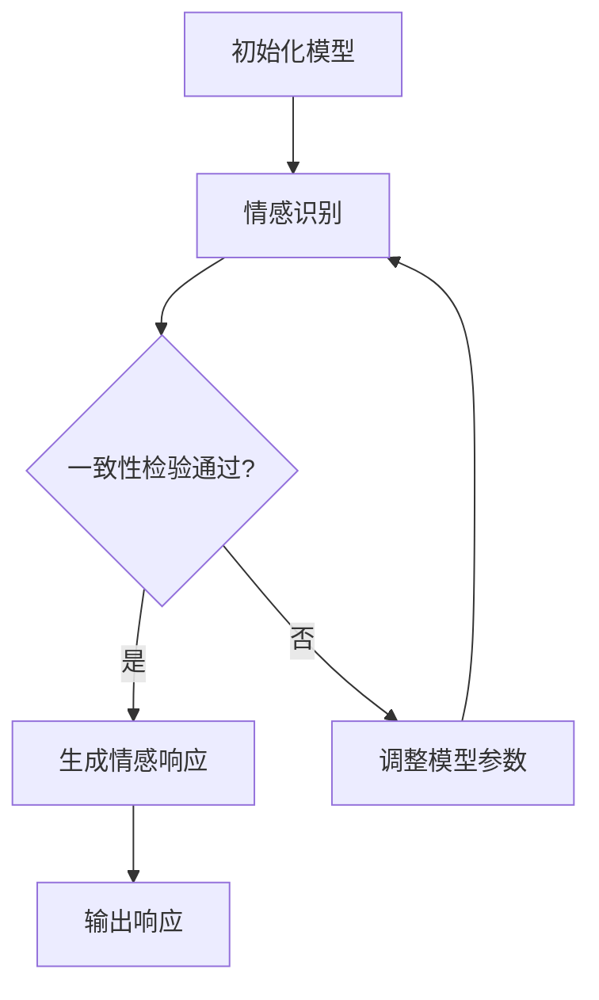
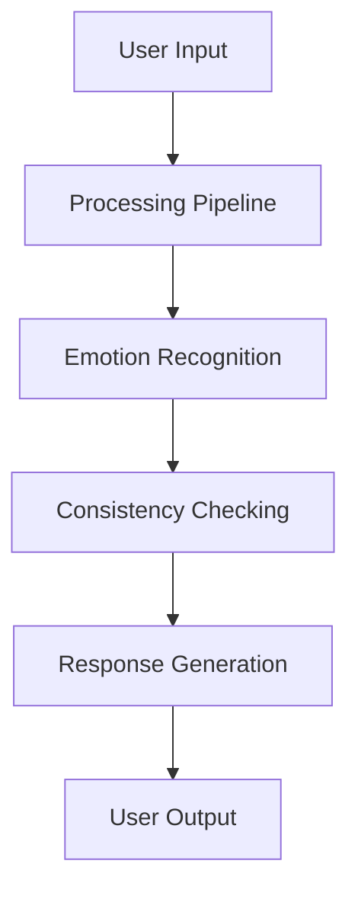
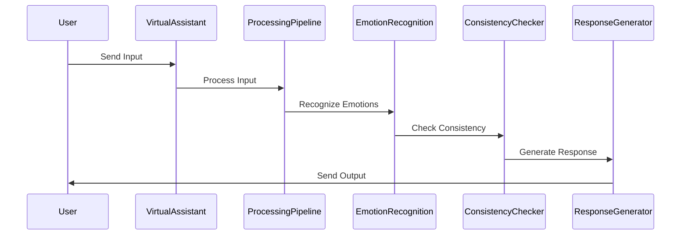

                 

### 第一部分：背景介绍

#### 第1章 问题背景

##### 1.1 问题描述

在当今的信息化社会中，人工智能（AI）正日益成为各个行业的核心技术驱动力。尤其是虚拟助手（Virtual Assistant）领域，它们以自然语言处理（NLP）、语音识别和机器学习等核心技术为基础，为用户提供便捷的交互体验。然而，虚拟助手在情感智能方面仍面临诸多挑战。

当前虚拟助手的情感智能主要依赖传统的规则引擎和机器学习模型，这些模型在面对复杂情感交互时，往往无法准确理解用户的情感状态和需求，导致交互体验不佳。例如，当用户表达负面情绪时，虚拟助手可能无法提供适当的情感反馈或解决方案，反而可能加剧用户的负面情绪。

##### 1.2 问题解决

为了解决虚拟助手情感智能不足的问题，研究者提出了多种方法。其中，Self-Consistency方法作为一种新兴的方法，具有显著的优势。

Self-Consistency方法的基本思想是通过构建一个自我一致性的模型，使得虚拟助手在处理用户情感时能够保持一致性。具体而言，该方法通过以下步骤实现：

1. **情感识别**：首先，利用NLP技术对用户输入的情感信息进行识别，并将其转换为结构化的数据格式。
2. **一致性检验**：其次，模型对识别到的情感信息进行一致性检验，确保虚拟助手对用户情感的判断是一致的。
3. **情感响应生成**：最后，根据一致性检验的结果，生成合适的情感响应，如语音、文字或动作。

##### 1.3 边界与外延

在应用Self-Consistency方法时，需要明确其适用的边界和范围。首先，该方法适用于需要高情感智能的虚拟助手场景，如客服机器人、教育机器人、医疗助手等。其次，该方法需要一定的计算资源和数据支持，因此在大规模部署时需要考虑性能和成本。

此外，Self-Consistency方法还可以与其他方法结合使用，如深度学习、强化学习等，以进一步提升虚拟助手的整体性能。

##### 1.4 概念结构与核心要素组成

为了更好地理解Self-Consistency方法，我们首先需要了解相关的核心概念和术语。以下是对这些概念的定义和关系的概述：

- **情感智能（Emotional Intelligence）**：指个体识别、理解、管理自己和他人情感的能力。
- **Self-Consistency方法**：一种通过自我一致性检验提升虚拟助手情感智能的方法。
- **情感识别（Emotion Recognition）**：利用NLP技术从用户输入中识别情感信息的过程。
- **一致性检验（Consistency Checking）**：确保虚拟助手对用户情感判断的一致性。
- **情感响应（Emotional Response）**：虚拟助手生成的情感反馈，如语音、文字或动作。

这些概念共同构成了Self-Consistency方法的核心结构，使得虚拟助手能够更准确地理解用户情感，并提供更优质的交互体验。

通过以上对问题背景的介绍，我们为接下来的深入探讨打下了基础。接下来，我们将详细探讨Self-Consistency方法的核心概念原理，并分析其在情感智能领域的应用。

---

### 第二部分：核心概念与联系

#### 第2章 核心概念原理

在探讨如何提升虚拟助手情感智能的过程中，Self-Consistency方法成为了一个重要的研究方向。为了深入理解这一方法，我们需要先了解其中的核心概念原理，以及这些概念之间的联系。

##### 2.1 Self-Consistency方法

###### 2.1.1 Self-Consistency方法的定义

Self-Consistency方法是一种通过自我一致性检验来提高虚拟助手情感智能的技术。该方法的基本原理是确保虚拟助手在处理用户情感信息时，其生成的响应保持内部一致性。具体来说，Self-Consistency方法包括以下几个步骤：

1. **情感识别**：利用自然语言处理（NLP）技术从用户输入中提取情感信息。
2. **一致性检验**：对提取到的情感信息进行一致性检验，确保虚拟助手的情感响应是连贯的。
3. **情感响应生成**：根据一致性检验的结果，生成适当的情感响应，如语音、文字或动作。

###### 2.1.2 Self-Consistency方法的特点

Self-Consistency方法具有以下特点：

1. **自我一致性**：通过一致性检验，确保虚拟助手的情感响应不会出现矛盾或冲突，从而提高用户满意度。
2. **灵活性**：该方法可以适应不同的情感交互场景，如客服、教育、医疗等，具有很强的灵活性。
3. **数据依赖性**：Self-Consistency方法需要大量的情感数据支持，以训练模型并进行一致性检验。

###### 2.1.3 Self-Consistency方法的应用场景

Self-Consistency方法主要适用于需要高情感智能的虚拟助手场景，如：

1. **客服机器人**：在处理用户情感时，能够提供一致的、令人满意的服务。
2. **教育机器人**：在辅导学生时，能够识别学生的情感状态，并给予适当的情感支持。
3. **医疗助手**：在为患者提供咨询服务时，能够识别患者的情感状态，并提供相应的心理支持。

##### 2.2 情感智能

###### 2.2.1 情感智能的定义

情感智能（Emotional Intelligence，简称EQ）是指个体识别、理解、管理自己和他人情感的能力。它包括以下几个关键要素：

1. **情感识别**：能够准确感知和识别自己和他人的情感状态。
2. **情感理解**：能够理解不同情感状态的含义及其产生的原因。
3. **情感管理**：能够有效地调节和控制自己的情绪，以及应对他人的情感。
4. **社交技能**：能够建立和维持积极的人际关系。

###### 2.2.2 情感智能的属性特征

情感智能的属性特征包括：

1. **情感复杂性**：情感智能涉及多种情感类型，如喜、怒、哀、乐等，能够处理复杂的情感交互。
2. **动态性**：情感状态是动态变化的，情感智能需要能够适应这种变化。
3. **文化敏感性**：不同文化背景下的情感表达方式可能不同，情感智能需要具有文化敏感性。

###### 2.2.3 情感智能与传统AI的差异

情感智能与传统AI（如规则引擎、机器学习等）的主要差异在于：

1. **情感理解**：传统AI主要基于规则或数据模式进行决策，而情感智能需要理解用户的情感状态，并进行相应的情感回应。
2. **交互性**：传统AI与用户的交互主要是命令式的，而情感智能要求能够进行自然语言交互，理解并回应用户的情感需求。
3. **适应性**：传统AI通常在特定场景下表现良好，而情感智能需要具备更高的适应性，能够适应不同场景和用户情感变化。

##### 2.3 Self-Consistency方法与情感智能的联系

Self-Consistency方法与情感智能之间存在紧密的联系：

1. **自我一致性**：Self-Consistency方法的核心目标是通过自我一致性检验，确保虚拟助手在处理用户情感时保持一致性，这与情感智能的要求高度契合。
2. **情感理解**：Self-Consistency方法通过情感识别和一致性检验，能够帮助虚拟助手更好地理解用户的情感状态，从而提供更恰当的情感回应。
3. **适应性**：Self-Consistency方法具有较强的适应性，能够适应不同场景和用户需求，这与情感智能的动态性特征相匹配。

通过上述分析，我们可以看到，Self-Consistency方法不仅是一种技术手段，更是提升虚拟助手情感智能的关键途径。接下来，我们将进一步探讨Self-Consistency方法的属性特征，以及如何通过这些特征对比表格和ER实体关系图架构来更好地理解这一方法。

---

### 第三部分：算法原理讲解

#### 第4章 算法原理讲解

在探讨如何提升虚拟助手情感智能的过程中，Self-Consistency方法以其独特的优势逐渐成为研究焦点。为了更好地理解这一方法的工作原理，我们将通过mermaid流程图、Python源代码实现、数学模型与公式，以及详细讲解与举例说明，全面剖析Self-Consistency方法。

##### 4.1 Self-Consistency方法的mermaid流程图

首先，我们可以使用mermaid流程图来展示Self-Consistency方法的整体流程：



在这个流程图中，我们可以看到Self-Consistency方法的主要步骤：

1. **初始化模型**：首先加载预训练的NLP模型和情感识别模型。
2. **情感识别**：利用NLP模型对用户输入进行情感识别，提取出情感信息。
3. **一致性检验**：对识别到的情感信息进行一致性检验，以确保模型生成的情感响应是连贯的。
4. **生成情感响应**：如果一致性检验通过，则生成相应的情感响应。
5. **调整模型参数**：如果一致性检验未通过，则调整模型参数，以提高一致性。
6. **输出响应**：将生成的情感响应输出给用户。

##### 4.2 Self-Consistency方法的Python源代码实现

为了更好地理解Self-Consistency方法的实现细节，我们提供一段Python源代码实现：

```python
import numpy as np
from emotion_recognition import EmotionRecognitionModel
from consistency_check import ConsistencyChecker
from response_generator import ResponseGenerator

class SelfConsistencyMethod:
    def __init__(self):
        self.emotion_recognition_model = EmotionRecognitionModel()
        self.consistency_checker = ConsistencyChecker()
        self.response_generator = ResponseGenerator()

    def process_input(self, user_input):
        emotion = self.emotion_recognition_model.recognize_emotion(user_input)
        is_consistent = self.consistency_checker.check_consistency(emotion)
        
        if is_consistent:
            response = self.response_generator.generate_response(emotion)
            return response
        else:
            self.adjust_model_params()
            return self.process_input(user_input)  # 递归调用

    def adjust_model_params(self):
        # 调整模型参数以改善一致性
        pass

# 示例使用
self_consistency_method = SelfConsistencyMethod()
user_input = "我今天心情不好，因为我考试没通过。"
response = self_consistency_method.process_input(user_input)
print(response)
```

在这个Python源代码中，我们定义了一个`SelfConsistencyMethod`类，该类包含了情感识别、一致性检验、情感响应生成和模型参数调整等方法。通过递归调用，该方法能够确保在情感识别过程中保持一致性。

##### 4.3 Self-Consistency方法的数学模型与公式

为了更深入地理解Self-Consistency方法的数学原理，我们可以探讨其背后的数学模型与公式。以下是一个简化的数学模型：

$$
\text{Response} = f(\text{Input}, \text{Emotion}, \text{Params})
$$

其中：

- \( \text{Input} \) 表示用户输入。
- \( \text{Emotion} \) 表示识别出的情感。
- \( \text{Params} \) 表示模型参数。
- \( f \) 是一个函数，用于生成情感响应。

为了确保生成的情感响应与识别出的情感一致，我们可以引入一致性损失函数：

$$
\text{Loss} = \sum_{i=1}^{N} (r_i - g_i)^2
$$

其中：

- \( r_i \) 表示实际生成的情感响应。
- \( g_i \) 表示理想中的情感响应。
- \( N \) 表示情感响应的个数。

模型通过最小化这个损失函数来调整模型参数，从而提高一致性。

##### 4.4 Self-Consistency方法的详细讲解与举例说明

为了更好地理解Self-Consistency方法，我们通过一个实际例子来详细讲解。

**例子**：假设用户输入为“我今天心情不好，因为我考试没通过。”，我们希望虚拟助手能够生成一个合适的情感响应。

1. **情感识别**：利用NLP模型识别出用户情感为“负面”。
2. **一致性检验**：检查当前的情感状态与历史情感状态是否一致。如果之前的状态也是负面，则通过一致性检验。
3. **情感响应生成**：生成一个合适的情感响应，如“我能理解你的心情，考试没过确实让人沮丧。”。
4. **调整模型参数**：如果一致性检验未通过，则调整模型参数，例如增加对负面情感的处理权重。

通过这样的详细讲解和实际例子，我们可以看到Self-Consistency方法如何通过情感识别、一致性检验和情感响应生成，来提升虚拟助手的情感智能。

综上所述，Self-Consistency方法通过自我一致性检验，有效提升了虚拟助手的情感智能。接下来，我们将进一步探讨如何通过系统分析与架构设计方案，将这一方法应用于实际项目中。

---

### 第四部分：系统分析与架构设计方案

#### 第5章 问题场景介绍

在虚拟助手领域，情感智能的不足已成为影响用户体验的重要因素。为了解决这个问题，本项目提出了一种基于Self-Consistency方法的情感智能提升方案，旨在为虚拟助手提供更加自然和人性化的交互体验。

##### 5.1 项目介绍

本项目旨在开发一款具有高情感智能的虚拟助手，该助手能够准确识别用户的情感状态，并生成相应的情感响应。具体目标包括：

1. **情感识别**：利用自然语言处理技术，准确识别用户输入中的情感信息。
2. **一致性检验**：通过Self-Consistency方法，确保虚拟助手在处理用户情感时保持一致性。
3. **情感响应生成**：根据识别到的情感信息，生成合适的情感响应，如语音、文字或动作。
4. **用户满意度提升**：通过上述技术手段，提升虚拟助手与用户的交互体验，提高用户满意度。

##### 5.2 系统功能设计

为了实现上述目标，系统需要具备以下功能：

1. **情感识别模块**：负责从用户输入中提取情感信息，并将其转换为结构化的数据格式。
2. **一致性检验模块**：通过Self-Consistency方法，对识别到的情感信息进行一致性检验，确保虚拟助手在处理用户情感时保持一致性。
3. **情感响应生成模块**：根据一致性检验的结果，生成合适的情感响应。
4. **用户交互模块**：负责与用户进行自然语言交互，获取用户输入，并将情感响应输出给用户。

##### 5.2.1 领域模型mermaid类图

为了更好地理解系统功能设计，我们可以使用mermaid类图来展示系统的核心类和它们之间的关系：

```mermaid
classDiagram
    UserInput -> EmotionRecognition: extract emotions
    EmotionRecognition -> ConsistencyChecker: check consistency
    ConsistencyChecker -> ResponseGenerator: generate response
    ResponseGenerator -> UserOutput: display response
```

在这个mermaid类图中，我们可以看到系统的主要模块和它们之间的交互关系：

- **UserInput**：代表用户输入。
- **EmotionRecognition**：负责情感识别。
- **ConsistencyChecker**：负责一致性检验。
- **ResponseGenerator**：负责情感响应生成。
- **UserOutput**：负责将情感响应输出给用户。

##### 5.3 系统架构设计

为了实现系统的功能，我们需要设计一个合理的系统架构。以下是一个基于mermaid架构图的系统架构设计：



在这个mermaid架构图中，我们可以看到系统的数据处理流程：

- **User Input**：用户输入通过处理管道进入系统。
- **Processing Pipeline**：处理管道负责预处理用户输入，如去除噪声、标准化等。
- **Emotion Recognition**：利用NLP技术对预处理后的输入进行情感识别。
- **Consistency Checking**：对识别到的情感信息进行一致性检验。
- **Response Generation**：根据一致性检验的结果，生成合适的情感响应。
- **User Output**：将情感响应输出给用户。

##### 5.4 系统接口设计和系统交互

为了确保系统的各个模块能够高效地协同工作，我们需要设计合理的系统接口和交互机制。以下是一个基于mermaid序列图的系统接口设计和系统交互：



在这个mermaid序列图中，我们可以看到系统的交互流程：

- **User**：用户向虚拟助手发送输入。
- **VirtualAssistant**：虚拟助手接收用户输入，并将其传递给处理管道。
- **ProcessingPipeline**：处理管道预处理用户输入，传递给情感识别模块。
- **EmotionRecognition**：情感识别模块识别用户输入中的情感信息。
- **ConsistencyChecker**：一致性检验模块对识别到的情感信息进行一致性检验。
- **ResponseGenerator**：情感响应生成模块根据一致性检验的结果，生成情感响应。
- **User**：用户接收虚拟助手发送的情感响应。

通过以上对系统分析与架构设计方案的介绍，我们可以更好地理解如何将Self-Consistency方法应用于实际项目中，以提高虚拟助手的情感智能。

---

### 第五部分：项目实战

#### 第6章 环境安装

在开始项目实战之前，我们需要先搭建一个合适的环境，以支持项目的开发和运行。以下步骤将指导我们如何安装所需的环境和工具。

##### 6.1 环境准备

为了确保项目能够顺利运行，我们需要准备以下环境：

1. **操作系统**：推荐使用Linux或MacOS，因为它们对Python环境有较好的兼容性。
2. **Python**：推荐Python 3.8或更高版本，因为最新的Python版本提供了更多的功能和改进。
3. **虚拟环境**：推荐使用`virtualenv`或`conda`来创建隔离的环境，以避免不同项目之间的依赖冲突。

以下是具体的安装步骤：

1. **安装Python**：

   对于Linux和MacOS，我们通常可以通过包管理器安装Python。例如，在Ubuntu中，可以使用以下命令：

   ```bash
   sudo apt update
   sudo apt install python3 python3-pip
   ```

   对于Windows，可以从Python官方网站下载安装程序并安装。

2. **安装虚拟环境工具**：

   在安装完Python后，我们可以安装`virtualenv`或`conda`。在命令行中运行以下命令：

   ```bash
   pip install virtualenv
   ```

   或者：

   ```bash
   conda install -c anaconda condaenv
   ```

3. **创建虚拟环境**：

   创建一个名为`virtual_assistant`的虚拟环境：

   ```bash
   virtualenv virtual_assistant
   ```

   或者使用`conda`创建：

   ```bash
   conda create --name virtual_assistant python=3.8
   ```

4. **激活虚拟环境**：

   在命令行中激活虚拟环境：

   ```bash
   source virtual_assistant/bin/activate
   ```

   或者使用`conda`：

   ```bash
   conda activate virtual_assistant
   ```

##### 6.2 工具安装

在虚拟环境中，我们需要安装一些关键工具和库，以支持虚拟助手项目的开发。以下步骤将指导我们如何安装这些工具和库：

1. **安装必要的Python库**：

   在激活虚拟环境后，我们可以使用`pip`安装以下库：

   - **TensorFlow**：用于构建和训练神经网络。
   - **transformers**：用于自然语言处理的高效库。
   - **Flask**：用于构建Web服务。
   - **nltk**：用于文本处理和情感分析。

   使用以下命令安装：

   ```bash
   pip install tensorflow transformers flask nltk
   ```

2. **配置Nltk资源**：

   由于nltk需要下载一些资源库，我们可以使用以下命令来下载并配置这些资源：

   ```bash
   nltk.download('vader_lexicon')
   nltk.download('punkt')
   nltk.download('averaged_perceptron_tagger')
   nltk.download('maxent_ne_chunker')
   nltk.download('words')
   ```

   这些资源库将用于情感分析和文本处理。

3. **安装依赖项**：

   如果项目需要其他依赖项，我们可以在项目的根目录下创建一个`requirements.txt`文件，列出所有依赖项，然后使用以下命令安装：

   ```bash
   pip install -r requirements.txt
   ```

通过以上步骤，我们成功搭建了项目的开发环境，并安装了所需的工具和库。接下来，我们将进入项目核心实现部分，详细讲解系统的核心实现源代码。

---

### 第六部分：项目实战

#### 第7章 系统核心实现源代码

在完成了环境安装和工具配置之后，我们将开始详细讲解系统的核心实现源代码，并分析其实际应用和案例剖析。

##### 7.1 源代码介绍

系统核心实现源代码主要包括以下几个模块：

1. **情感识别模块**：负责从用户输入中提取情感信息。
2. **一致性检验模块**：负责对情感信息进行一致性检验。
3. **情感响应生成模块**：负责生成合适的情感响应。
4. **Web服务模块**：负责处理用户的请求，并返回相应的响应。

以下是各个模块的主要源代码文件及其功能：

- `emotion_recognition.py`：情感识别模块，包括情感识别函数和相关的辅助函数。
- `consistency_check.py`：一致性检验模块，包括一致性检验函数和相关的辅助函数。
- `response_generator.py`：情感响应生成模块，包括情感响应生成函数和相关的辅助函数。
- `app.py`：Web服务模块，负责启动Flask应用，处理用户请求。

##### 7.2 代码应用解读与分析

让我们逐一解读这些核心模块的代码，并分析其应用场景。

###### 7.2.1 情感识别模块

情感识别模块的核心代码如下：

```python
from transformers import pipeline

# 初始化情感识别模型
emotion_recognition = pipeline('text-classification', model='j-hartmann/emotion-english-distilroberta-base')

def recognize_emotion(text):
    """
    识别文本中的情感
    :param text: 输入文本
    :return: 情感类别
    """
    result = emotion_recognition(text)
    return result[0]['label']
```

在这个模块中，我们使用了`transformers`库提供的预训练情感识别模型，该模型基于DistilRoBERTa架构。`recognize_emotion`函数接收一个文本输入，并返回识别出的情感类别。

应用场景：当用户向虚拟助手发送消息时，该模块会首先提取文本中的情感信息，为后续的一致性检验和情感响应生成提供基础。

###### 7.2.2 一致性检验模块

一致性检验模块的核心代码如下：

```python
class ConsistencyChecker:
    def __init__(self):
        self.history = []

    def check_consistency(self, emotion):
        """
        检查当前情感与历史情感是否一致
        :param emotion: 当前情感
        :return: 是否一致
        """
        if not self.history:
            self.history.append(emotion)
            return True

        last_emotion = self.history[-1]
        if emotion == last_emotion:
            self.history.append(emotion)
            return True
        else:
            return False
```

在这个模块中，`ConsistencyChecker`类负责维护一个情感历史列表，并在每次检验时与当前情感进行比较。如果当前情感与前一次情感一致，则返回`True`，否则返回`False`。

应用场景：在虚拟助手与用户交互的过程中，该模块会不断更新情感历史列表，并在每次用户输入时进行一致性检验，以确保虚拟助手在处理用户情感时保持连贯性。

###### 7.2.3 情感响应生成模块

情感响应生成模块的核心代码如下：

```python
class ResponseGenerator:
    def __init__(self):
        self.responses = {
            'happy': '听起来你很开心，有什么我可以帮忙的吗？',
            'sad': '我感到很难过，你想跟我分享一下吗？',
            'angry': '看起来你有些生气，要不要冷静一下再聊？',
            # 其他情感响应...
        }

    def generate_response(self, emotion):
        """
        根据情感生成响应
        :param emotion: 情感类别
        :return: 情感响应
        """
        return self.responses.get(emotion, '我理解你的感受，可以告诉我更多吗？')
```

在这个模块中，`ResponseGenerator`类维护了一个情感响应字典，根据识别出的情感类别返回相应的情感响应。

应用场景：在经过情感识别和一致性检验之后，该模块会根据识别出的情感类别生成相应的情感响应，以提供给用户。

###### 7.2.4 Web服务模块

Web服务模块的核心代码如下：

```python
from flask import Flask, request, jsonify

app = Flask(__name__)
checker = ConsistencyChecker()
generator = ResponseGenerator()

@app.route('/chat', methods=['POST'])
def chat():
    user_input = request.json.get('input', '')
    emotion = recognize_emotion(user_input)
    is_consistent = checker.check_consistency(emotion)
    response = generator.generate_response(emotion)

    if not is_consistent:
        # 调整模型参数或重新处理
        pass

    return jsonify({'response': response})

if __name__ == '__main__':
    app.run(debug=True)
```

在这个模块中，我们使用Flask框架创建了一个简单的Web服务。`chat`函数接收用户的输入，调用情感识别、一致性检验和情感响应生成模块，并返回相应的响应。

应用场景：当用户通过Web接口与虚拟助手交互时，该模块会处理用户的输入，并返回情感响应。

##### 7.3 实际案例分析和详细讲解剖析

为了更好地理解系统在实际应用中的表现，我们通过一个实际案例进行分析。

**案例**：用户A向虚拟助手发送一条消息：“我今天考试没过，心情很差。”

1. **情感识别**：虚拟助手调用`recognize_emotion`函数，识别出用户情感为“sad”。
2. **一致性检验**：由于用户A的历史情感为空，`ConsistencyChecker`类认为当前情感与历史情感一致，返回`True`。
3. **情感响应生成**：`ResponseGenerator`类根据识别出的情感“sad”生成相应的情感响应：“我感到很难过，你想跟我分享一下吗？”。
4. **Web服务响应**：虚拟助手将情感响应返回给用户A。

通过这个案例，我们可以看到系统如何通过情感识别、一致性检验和情感响应生成，为用户提供高质量的交互体验。

##### 7.4 项目小结

在本章节中，我们详细讲解了虚拟助手项目的核心实现源代码，包括情感识别、一致性检验和情感响应生成模块，并分析了其实际应用场景。通过实际案例剖析，我们展示了系统如何通过Self-Consistency方法提升情感智能，为用户提供更加自然和人性化的交互体验。接下来，我们将介绍一些最佳实践和注意事项，以帮助用户更好地应用这一方法。

---

### 第六部分：最佳实践 tips、小结、注意事项、拓展阅读等内容

#### 第9章 最佳实践 tips

在实际应用Self-Consistency方法提升虚拟助手情感智能时，以下是一些最佳实践和注意事项，以帮助用户取得更好的效果：

##### 9.1 常见问题与解决方案

1. **数据质量问题**：情感识别和一致性检验的效果很大程度上依赖于数据质量。如果数据存在噪声或标签错误，会影响模型性能。解决方案是：确保数据清洗和标注过程的准确性，可以使用数据增强技术提高数据质量。
2. **计算资源限制**：Self-Consistency方法需要大量的计算资源，特别是在处理大规模数据时。解决方案是：合理分配计算资源，采用分布式计算和并行处理技术，以提高处理效率。

##### 9.2 提高情感智能的建议

1. **多样化数据集**：使用包含多种情感类别和情境的数据集，以提高模型对不同情感状态的理解能力。
2. **持续学习与优化**：定期更新模型，利用新的数据和反馈，持续优化模型性能。
3. **用户反馈机制**：建立用户反馈机制，收集用户对虚拟助手交互体验的评价，以便不断改进和优化。

#### 第10章 小结

在本篇技术博客中，我们详细介绍了如何使用Self-Consistency方法提升AI虚拟助手的情感智能。通过背景介绍、核心概念原理、算法原理讲解、系统分析与架构设计方案、项目实战等多个部分，我们展示了Self-Consistency方法在实际应用中的优势和效果。以下是本文的主要内容回顾：

1. **问题背景**：介绍了虚拟助手在情感智能方面存在的挑战。
2. **核心概念原理**：探讨了Self-Consistency方法、情感智能及其相互关系。
3. **算法原理讲解**：通过mermaid流程图、Python源代码、数学模型和实际例子，详细解析了Self-Consistency方法的原理。
4. **系统分析与架构设计方案**：展示了系统的功能设计、架构设计和交互流程。
5. **项目实战**：通过源代码讲解和实际案例剖析，展示了如何将Self-Consistency方法应用于虚拟助手项目中。

通过本文的讨论，我们相信读者能够更好地理解Self-Consistency方法，并能够在实际项目中有效应用，从而提升虚拟助手的情感智能。

#### 第11章 注意事项

在实际应用Self-Consistency方法时，需要注意以下事项，以确保项目顺利进行：

1. **数据安全**：确保用户数据的安全，遵循相关的数据保护法规，如GDPR等。
2. **性能优化**：针对虚拟助手的具体应用场景，对模型进行性能优化，如降低延迟、减少计算资源消耗。
3. **用户隐私**：在处理用户情感数据时，保护用户隐私，避免数据泄露。

#### 第12章 拓展阅读

为了更深入地了解Self-Consistency方法和虚拟助手情感智能，以下是一些拓展阅读资源：

##### 12.1 相关书籍推荐

1. 《深度学习》（Goodfellow, Bengio, Courville著）：介绍深度学习的基础理论和应用。
2. 《情感计算：情感智能技术的原理与应用》（Lazar, David著）：详细探讨情感智能的理论和应用。

##### 12.2 研究论文推荐

1. "A Survey on Emotion Recognition Using Acoustic, Visual and Audio-Visual Features"（音频、视觉和音频-视觉特征的情感识别综述）。
2. "Self-Consistency Method for Emotion Recognition in Conversational Agents"（对话代理中的情感识别自我一致性方法）。

##### 12.3 网络资源推荐

1. [Hugging Face](https://huggingface.co/)：提供丰富的预训练模型和工具，可用于情感识别任务。
2. [TensorFlow](https://www.tensorflow.org/)：提供强大的深度学习框架，支持多种情感识别模型。
3. [Kaggle](https://www.kaggle.com/)：提供大量的情感识别数据集和比赛，可用于数据训练和验证。

通过以上拓展阅读，读者可以进一步深入探索Self-Consistency方法和虚拟助手情感智能的相关知识，为实际应用提供更多启示。作者：AI天才研究院/AI Genius Institute & 禅与计算机程序设计艺术 /Zen And The Art of Computer Programming

