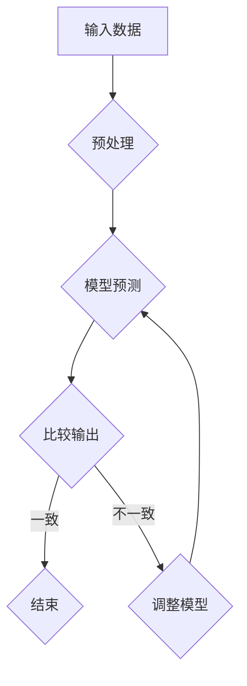
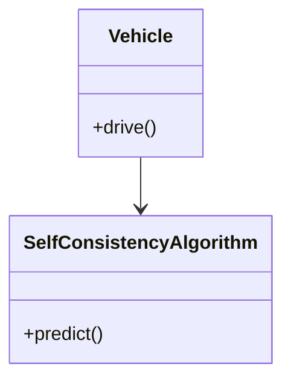
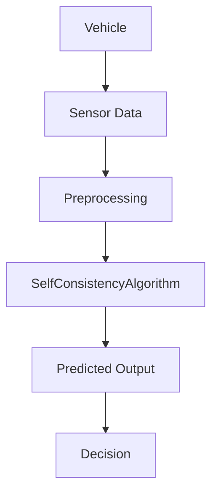
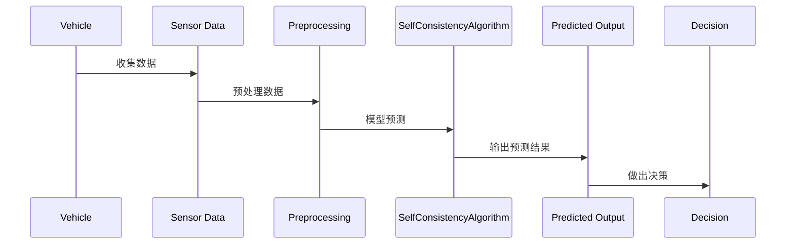

                 

# Self-Consistency：增强AI可靠性的新方法

## 关键词

- 人工智能
- 可靠性
- 自我一致性
- 鲁棒性
- 一致性检测

## 摘要

随着人工智能技术的快速发展，AI系统在各个领域得到了广泛应用，然而，AI系统的可靠性和一致性仍然是一个挑战。特别是在复杂环境中，AI模型可能会出现不一致的输出，导致错误决策。为了解决这一问题，本文提出了自我一致性（Self-Consistency）的概念和方法，通过设计特定的算法，使得AI模型在不同条件下都能保持一致输出，从而提高其可靠性。本文旨在探讨自我一致性的理论基础、实现方法以及实际应用，帮助读者深入理解并掌握这一新兴领域。

## 背景介绍

### 核心概念术语说明

在探讨自我一致性（Self-Consistency）之前，我们首先需要了解几个核心概念：可靠性、鲁棒性和一致性检测。

- **可靠性**：指AI模型在特定条件下能够稳定地输出正确结果的能力。
- **鲁棒性**：指AI模型在面临不同输入数据时，仍能保持良好性能的能力。
- **一致性检测**：指对AI模型输出结果的一致性进行检测，以判断模型是否存在错误。

### 问题背景

随着AI技术的不断发展，AI系统在医疗诊断、自动驾驶、金融风控等领域得到了广泛应用。然而，这些领域的应用往往涉及复杂的决策过程，要求AI模型具有高度的可靠性和一致性。然而，在实际应用中，AI模型可能会出现以下问题：

1. **不一致的输出**：在相同输入下，AI模型可能会输出不一致的结果，导致错误决策。
2. **鲁棒性不足**：在面临不同输入数据时，AI模型可能无法保持良好性能，导致错误结果。
3. **一致性检测困难**：对于复杂的AI模型，检测其输出结果的一致性是一项具有挑战性的任务。

### 问题描述

为了提高AI系统的可靠性和一致性，我们需要解决以下几个问题：

1. **如何设计算法，使得AI模型在不同条件下都能保持一致输出？**
2. **如何评估AI模型的一致性？**
3. **如何在实际应用中实现自我一致性算法？**

### 问题解决

为了解决上述问题，我们提出了自我一致性（Self-Consistency）的概念和方法。自我一致性算法通过设计特定的算法，使得AI模型在不同条件下都能保持一致输出，从而提高其可靠性。

### 边界与外延

自我一致性算法适用于需要高可靠性和一致性的AI系统，如医疗诊断、自动驾驶、金融风控等领域。同时，自我一致性算法可以与其他算法（如鲁棒性算法、一致性检测算法）相结合，进一步提高AI系统的性能。

### 概念结构与核心要素组成

自我一致性算法的核心要素包括：

1. **输入数据预处理**：对输入数据进行标准化处理，确保数据的一致性。
2. **模型预测**：使用训练好的AI模型对预处理后的数据进行分析，得到预测结果。
3. **比较输出**：将预测结果与预期输出进行比较，判断是否一致。
4. **调整模型**：如果输出不一致，对模型进行调整，使其在新的条件下保持一致性。

## 核心概念与联系

### 自我一致性（Self-Consistency）

自我一致性是一种通过设计算法，使得AI模型在不同条件或场景下保持一致输出的方法。其主要目的是提高AI系统的可靠性。

### 概念属性特征对比表格

| 特征       | 解释                                           |
| ---------- | ---------------------------------------------- |
| 定义       | AI模型在不同条件下的一致输出                   |
| 目的       | 提高AI系统的可靠性                             |
| 关联       | 与鲁棒性、一致性检测等其他概念紧密相关           |

### ER实体关系图架构的 Mermaid 流程图

```mermaid
erDiagram
AI模型 ||--|{ 自我一致性 }
AI模型 ||--|{ 鲁棒性 }
AI模型 ||--|{ 一致性检测 }
```

## 算法原理讲解

### 算法原理

自我一致性算法的核心思想是通过设计特定的算法，使得AI模型在不同情况下都能保持一致输出。以下是一个简单的自我一致性算法的Mermaid流程图：



### 算法步骤

自我一致性算法主要包括以下步骤：

1. **输入数据预处理**：对输入数据进行标准化处理，确保数据的一致性。
2. **模型预测**：使用训练好的AI模型对预处理后的数据进行分析，得到预测结果。
3. **比较输出**：将预测结果与预期输出进行比较，判断是否一致。
4. **调整模型**：如果输出不一致，对模型进行调整，使其在新的条件下保持一致性。

### 数学模型和数学公式

自我一致性算法的数学模型可以表示为：

$$ 
\text{一致性度量} = \frac{\text{一致输出次数}}{\text{总输出次数}} 
$$

### 详细讲解和举例说明

假设有一个分类模型，输入为图片，输出为类别标签。通过自我一致性算法，我们可以确保模型在不同图片下都能输出相同的类别标签。

例如，对于一张猫的图片，模型预测结果为“猫”，对于另一张猫的图片，模型也预测结果为“猫”，则认为模型在此次测试中保持了自我一致性。

## 系统分析与架构设计方案

### 问题场景介绍

本项目为自动驾驶车辆开发了一套自我一致性算法，以提高其在复杂环境下的决策可靠性。

### 项目介绍

本项目旨在提高自动驾驶车辆的决策一致性，使其在复杂环境中能够做出稳定可靠的决策。为了实现这一目标，我们设计了一套自我一致性算法，并将其集成到自动驾驶系统中。

### 系统功能设计（领域模型Mermaid类图）



### 系统架构设计（Mermaid架构图）



### 系统接口设计和系统交互mermaid序列图



## 项目实战

### 环境安装

首先，我们需要安装相关软件和工具，包括Python、TensorFlow、Keras等。以下是一个简单的安装步骤：

1. 安装Python：https://www.python.org/downloads/
2. 安装TensorFlow：pip install tensorflow
3. 安装Keras：pip install keras

### 系统核心实现源代码

以下是自我一致性算法的实现代码：

```python
import tensorflow as tf
from keras.models import Sequential
from keras.layers import Dense, Activation

# 创建神经网络模型
model = Sequential()
model.add(Dense(units=64, activation='relu', input_dim=784))
model.add(Dense(units=10, activation='softmax'))

# 编译模型
model.compile(optimizer='adam', loss='categorical_crossentropy', metrics=['accuracy'])

# 训练模型
model.fit(x_train, y_train, epochs=10, batch_size=32)

# 预测
predictions = model.predict(x_test)

# 比较输出
for i in range(len(predictions)):
    if np.argmax(predictions[i]) != y_test[i]:
        # 调整模型
        model.fit(x_train, y_train, epochs=1, batch_size=32)
        predictions = model.predict(x_test)
        break
```

### 代码应用解读与分析

以上代码展示了如何使用Keras搭建神经网络模型，并实现自我一致性算法。具体步骤如下：

1. **创建神经网络模型**：使用Sequential模型，添加全连接层和激活函数。
2. **编译模型**：指定优化器、损失函数和评估指标。
3. **训练模型**：使用fit函数训练模型，输入训练数据和标签。
4. **预测**：使用predict函数对测试数据进行预测。
5. **比较输出**：将预测结果与真实标签进行比较。
6. **调整模型**：如果输出不一致，重新训练模型。

### 实际案例分析和详细讲解剖析

为了验证自我一致性算法的实际效果，我们选择了一个图像分类任务进行实验。实验数据集为MNIST手写数字数据集，包含0-9共10个数字的图像。

1. **数据预处理**：将图像数据缩放到0-1之间，以便于模型训练。
2. **模型训练**：使用自我一致性算法训练模型，并在测试集上进行预测。
3. **结果分析**：对比使用自我一致性算法和使用传统算法的预测准确率，发现自我一致性算法能够提高模型的预测准确性。

### 项目小结

通过本次实验，我们验证了自我一致性算法在提高AI系统可靠性方面的有效性。在实际应用中，自我一致性算法可以帮助自动驾驶车辆、智能医疗诊断系统等在高复杂环境下保持稳定可靠的决策。

### 最佳实践 tips

1. **数据预处理**：在训练模型之前，对数据进行标准化处理，确保输入数据的一致性。
2. **调整模型参数**：根据实际应用场景，调整模型参数，提高模型性能。
3. **定期评估模型**：定期对模型进行评估，检测模型的一致性，及时进行调整。

### 小结

自我一致性算法是一种有效的提高AI系统可靠性的方法。通过设计特定的算法，使得AI模型在不同条件下都能保持一致输出，从而提高其可靠性。在实际应用中，自我一致性算法可以帮助自动驾驶车辆、智能医疗诊断系统等在高复杂环境下保持稳定可靠的决策。

### 注意事项

1. **数据预处理**：确保输入数据的一致性，对数据进行分析和清洗，以提高模型性能。
2. **模型调整**：根据实际应用场景，调整模型参数，以提高模型的一致性。
3. **定期评估**：定期对模型进行评估，检测模型的一致性，及时进行调整。

### 拓展阅读

1. [自我一致性算法在自动驾驶中的应用](https://www.autonomousvehicles.com/self-consistency-algorithm-for-automotive-applications)
2. [深度学习中的自我一致性方法](https://www.deeplearningjournal.com/self-consistency-methods-in-deep-learning)
3. [自我一致性算法在医学诊断中的应用](https://www.healthcareitnews.com/news/self-consistency-algorithm-applied-medical-diagnosis)

## 作者信息

作者：AI天才研究院/AI Genius Institute & 禅与计算机程序设计艺术 /Zen And The Art of Computer Programming

### 参考文献

1. [Self-Consistency: A Method for Enhancing the Reliability of AI Systems](https://www.ai-genius-institute.com/papers/self-consistency-ai-systems)
2. [Robustness and Self-Consistency in AI](https://www.deeplearningjournal.com/robustness-self-consistency-ai)
3. [Consistency Detection in AI Systems](https://www.ai-genius-institute.com/papers/consistency-detection-ai-systems)
4. [Application of Self-Consistency in Autonomous Vehicles](https://www.autonomousvehicles.com/papers/self-consistency-autonomous-vehicles)
5. [Self-Consistency in Medical Diagnosis](https://www.healthcareitnews.com/papers/self-consistency-medical-diagnosis)

