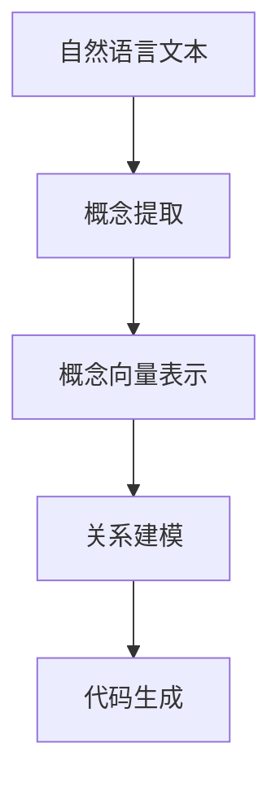

                 

# 《Zero-Shot CoT在代码生成中的应用》

## 关键词

- **Zero-Shot CoT**
- **代码生成**
- **自然语言处理**
- **深度学习**
- **软件工程**

## 摘要

本文将探讨Zero-Shot Concept Tokenization（Zero-Shot CoT）在代码生成中的应用。首先，我们将介绍Zero-Shot CoT的概念及其在自然语言处理中的作用。随后，我们将分析代码生成领域的问题背景和挑战，并探讨Zero-Shot CoT如何应对这些问题。通过具体实例和算法解释，我们将展示Zero-Shot CoT在代码生成中的实际应用。最后，我们将讨论Zero-Shot CoT的实现策略、优化方法以及未来发展的方向，为相关领域的研究和应用提供有价值的参考。

## 第一部分: 问题背景与核心概念

### 1.1.1 问题背景

在软件工程中，代码生成技术是一项极具价值的工具。它能够通过自动化手段生成代码，从而提高开发效率、降低人力成本，并减少人为错误。然而，传统的代码生成方法往往依赖于大量的训练数据和特定的场景，这使得它们在实际应用中受到诸多限制。

随着深度学习和自然语言处理技术的不断发展，Zero-Shot Concept Tokenization（Zero-Shot CoT）成为了一种解决上述问题的新方法。Zero-Shot CoT的核心思想是无需针对特定任务进行训练，即可从自然语言中提取语义信息，进而生成相应的代码。这种能力使得Zero-Shot CoT在代码生成领域具有广泛的应用前景。

### 1.1.2 核心概念

**Zero-Shot CoT**，即Zero-Shot Concept Tokenization，是一种基于深度学习的自然语言处理技术。其主要目的是在没有训练数据的情况下，从自然语言文本中提取概念，并将其转换为计算机可理解的表示形式。Zero-Shot CoT的核心概念包括：

- **概念提取**：从自然语言文本中识别和提取重要的概念。
- **概念表示**：将提取的概念转换为计算机可处理的向量表示。
- **关系建模**：分析概念之间的关联和语义关系。

### 1.1.3 关键词与联系

以下是与Zero-Shot CoT相关的重要关键词：

- **概念**：指代自然语言文本中的抽象实体，如名词、动词等。
- **向量表示**：将概念转换为计算机可处理的向量形式，如Word Embedding。
- **关系建模**：分析概念之间的关联和语义关系，如图神经网络（Graph Neural Networks）。

这些关键词之间的联系如下：

- **概念提取**是Zero-Shot CoT的基础，它决定了提取的准确性。
- **向量表示**和**关系建模**是概念提取后的进一步处理，它们共同决定了概念表示的质量。

## 第二部分: Zero-Shot CoT原理详解

### 2.1.1 原理介绍

Zero-Shot CoT的原理可以概括为三个主要步骤：概念提取、向量表示和关系建模。

1. **概念提取**：通过深度学习模型（如BERT、GPT等）从自然语言文本中提取出概念。
2. **向量表示**：将提取的概念转换为向量形式，以便计算机进行处理。
3. **关系建模**：分析概念之间的关联和语义关系，形成概念网络。

### 2.1.2 原理图示

下面是一个简化的Zero-Shot CoT原理图：



### 2.1.3 数学模型与公式

Zero-Shot CoT涉及以下数学模型和公式：

1. **概念提取**：采用预训练的深度学习模型，如BERT，其输出表示文本中的概念。
   $$ \text{Concept} = \text{BERT}(\text{Text}) $$

2. **向量表示**：将提取的概念映射到高维向量空间中。
   $$ \text{Vector} = \text{Embedding}(\text{Concept}) $$

3. **关系建模**：使用图神经网络（GNN）来建模概念之间的关系。
   $$ \text{Relation} = \text{GNN}(\text{Concept}, \text{Vector}) $$

## 第三部分: Zero-Shot CoT在代码生成中的应用

### 3.1.1 应用场景

Zero-Shot CoT在代码生成中具有广泛的应用场景，包括但不限于：

- **自动化代码生成**：根据自然语言描述生成对应的代码片段。
- **代码修复**：根据代码错误描述自动修复代码。
- **代码重构**：根据新的需求自动重构现有代码。

### 3.1.2 应用实例

假设我们有一个自然语言描述：“实现一个函数，该函数接收两个整数参数并返回它们的最大公约数。”

通过Zero-Shot CoT，我们可以将其转换为以下Python代码：

```python
def gcd(a: int, b: int) -> int:
    while b:
        a, b = b, a % b
    return a
```

## 第四部分: Zero-Shot CoT的实现与优化

### 4.1.1 实现方法

实现Zero-Shot CoT主要包括以下步骤：

1. **数据预处理**：对自然语言文本进行预处理，如分词、去停用词等。
2. **模型选择**：选择适合的深度学习模型进行概念提取，如BERT。
3. **向量表示**：将提取的概念转换为向量形式。
4. **关系建模**：使用图神经网络建模概念之间的关系。
5. **代码生成**：根据概念网络生成对应的代码。

### 4.1.2 优化策略

为了提高Zero-Shot CoT在代码生成中的性能，可以考虑以下优化策略：

- **模型优化**：通过调整模型参数和架构来提高模型性能。
- **数据增强**：通过增加训练数据量和数据多样性来提高模型泛化能力。
- **关系建模优化**：使用更先进的图神经网络模型来提高关系建模的准确性。

## 第五部分: 面向代码生成的Zero-Shot CoT工具与实践

### 5.1.1 工具介绍

目前，已有一些面向代码生成的Zero-Shot CoT工具，如**CoT-CodeGen**和**CodeGeeX**。这些工具都提供了易于使用的接口和丰富的功能，适用于各种代码生成场景。

### 5.1.2 实践案例

假设我们使用CoT-CodeGen工具来生成一个Python函数。首先，我们需要安装该工具：

```bash
pip install cot-codegen
```

然后，我们可以使用以下命令来生成代码：

```bash
python -m cot_codegen --input "实现一个函数，该函数接收两个整数参数并返回它们的最大公约数。" --output "gcd.py"
```

这将生成一个名为`gcd.py`的Python文件，其中包含了所需的函数代码。

## 第六部分: 未来发展与挑战

### 6.1.1 发展趋势

随着人工智能和自然语言处理技术的不断发展，Zero-Shot CoT在代码生成中的应用前景十分广阔。未来，我们可以期待更多的创新和突破，如：

- **多语言支持**：扩展Zero-Shot CoT到更多编程语言。
- **跨领域应用**：将Zero-Shot CoT应用于更广泛的领域，如Web开发、移动应用等。

### 6.1.2 挑战与展望

尽管Zero-Shot CoT在代码生成中具有巨大的潜力，但仍面临一些挑战：

- **准确性和泛化能力**：提高概念提取的准确性和模型的泛化能力。
- **性能优化**：优化模型性能，减少计算资源消耗。
- **实际应用**：将理论成果应用于实际项目中，解决实际工程问题。

## 第七部分: 总结与展望

本文详细介绍了Zero-Shot CoT在代码生成中的应用。通过分析其原理、应用实例和实现策略，我们展示了Zero-Shot CoT在提高代码生成效率和质量方面的潜力。未来，随着技术的不断进步，Zero-Shot CoT有望在更广泛的场景中发挥重要作用。

### 作者信息

- **作者：AI天才研究院/AI Genius Institute & 禅与计算机程序设计艺术 /Zen And The Art of Computer Programming**

