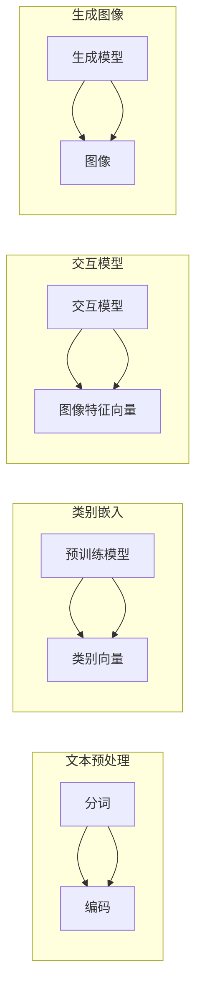
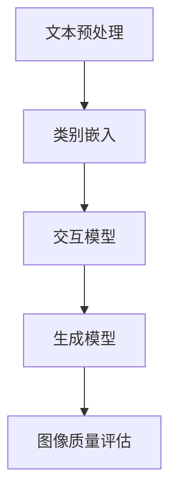
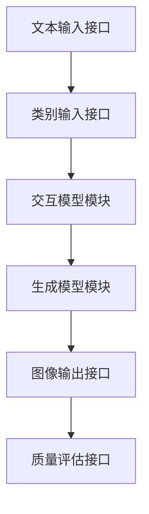
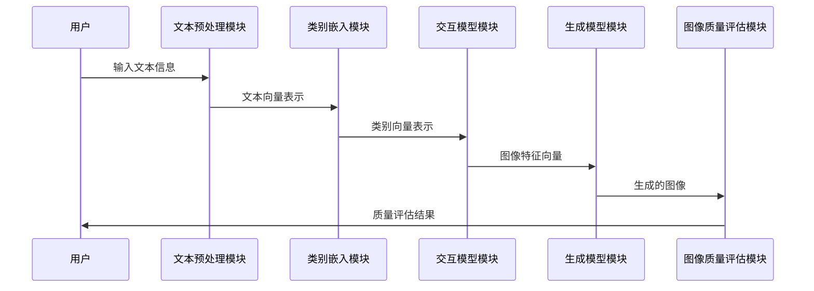

                 

## 引言

### 1.1 问题背景

人工智能（Artificial Intelligence, AI）作为计算机科学的一个分支，已经在过去的几十年里取得了令人瞩目的进步。从早期的专家系统，到基于大数据和深度学习的现代AI，人工智能技术的不断发展极大地改变了我们的生活方式。图像生成（Image Generation）作为人工智能的一个重要应用领域，通过算法和模型生成具有高质量和多样性的图像，在艺术创作、娱乐、医疗诊断、自动驾驶等诸多领域发挥着重要作用。

在图像生成技术中，传统的方法依赖于大量的标注数据。这些方法通过训练模型从数据中学习，生成图像。然而，这样的方法在面对新的、未见过的图像时，往往无法胜任。为了解决这一问题，研究者们提出了零样本学习（Zero-Shot Learning, ZSL）的概念。零样本学习是一种机器学习方法，它能够根据少量的甚至没有标注数据来对未见过的类别进行分类和预测。

零样本学习技术的核心思想是通过文本信息来引导模型学习，即将自然语言描述转换为对图像的语义理解。这种方法在一定程度上克服了传统方法依赖于大量标注数据的局限性，为图像生成领域带来了新的可能性。

零样本生成（Zero-Shot Generation）是在零样本学习的基础上发展起来的一种技术。它不仅能够识别和理解新的类别，还能直接生成未见过的图像。零样本生成在图像生成中的应用，不仅提升了模型对新情境的适应能力，还极大地降低了数据获取和标注的成本。

### 1.2 问题描述

零样本生成在图像生成中的应用，涉及以下几个关键问题：

- **数据挑战**：传统图像生成方法依赖于大量的标注数据，而零样本生成需要能够处理未见过的类别和数据。
- **模型适应能力**：零样本生成模型需要具备较强的适应能力，能够根据少量的文本信息生成高质量的图像。
- **语义理解**：模型需要能够从文本中提取语义信息，并将其转化为图像特征，以便生成对应的图像。
- **计算效率**：零样本生成算法需要能够在合理的时间内生成图像，以满足实时应用的需求。

### 1.3 问题解决

零样本生成技术的实现，需要结合以下几个核心要素：

- **文本嵌入**：将文本信息转换为向量表示，以便于模型处理。
- **类别表示**：使用预训练的模型来表示不同的类别。
- **生成模型**：利用生成对抗网络（GANs）或变分自编码器（VAEs）等模型来生成图像。

具体来说，零样本生成的方法可以概括为以下几个步骤：

1. **文本预处理**：将输入的文本信息进行分词、编码等处理，得到文本向量表示。
2. **类别嵌入**：使用预训练的模型（如Word2Vec、BERT等）对类别进行嵌入，得到类别向量表示。
3. **交互模型**：设计一个交互模型（如图解生成对抗网络（G-GAN）），将文本向量和类别向量作为输入，生成图像的特征向量。
4. **生成图像**：利用生成模型（如GAN、VAE等）将图像特征向量转换为图像。

通过上述步骤，零样本生成模型能够根据少量的文本信息生成高质量的图像，解决了传统图像生成方法的局限性。

### 1.4 边界与外延

零样本生成技术的边界主要在于其对新类别和未见数据的处理能力。虽然这种方法在理论上具有很大的潜力，但在实际应用中仍面临诸多挑战：

- **数据质量**：零样本生成需要高质量的文本信息来指导模型的训练，如果文本信息不准确或模糊，会影响生成图像的质量。
- **模型适应性**：不同领域的图像生成需求差异较大，模型需要具备较强的适应性，以应对各种不同的场景。
- **计算资源**：生成高质量图像需要大量的计算资源，特别是在实时应用场景中，如何优化算法和模型，提高计算效率，是一个重要的问题。

### 1.5 概念结构与核心要素组成

零样本生成技术的核心组成部分包括：

- **文本嵌入**：文本信息是零样本生成的重要输入，文本嵌入的质量直接影响生成图像的质量。
- **类别表示**：类别表示是模型对类别语义的理解，不同的类别表示方法会影响模型的生成能力。
- **交互模型**：交互模型是连接文本和图像生成的重要桥梁，其设计直接影响生成图像的多样性和质量。
- **生成模型**：生成模型是实现图像生成核心，常用的生成模型有GAN、VAE等。

通过以上核心要素的有机结合，零样本生成技术能够有效地处理未见过的类别和数据，为图像生成领域带来了新的可能性。

## 第2章 核心概念与联系

### 2.1 核心概念原理

#### 2.1.1 潜力

零样本生成技术的潜力主要体现在以下几个方面：

1. **降低数据依赖**：传统的图像生成方法需要大量的标注数据，而零样本生成技术能够通过少量的文本信息生成未见过的图像，大大降低了数据获取和标注的成本。
2. **提高模型适应能力**：零样本生成技术使得模型能够更好地适应新的场景和未见过的数据，提高了模型在实际应用中的适应能力。
3. **拓宽应用范围**：零样本生成技术可以在没有大量标注数据的情况下，应用于各种不同的图像生成场景，从而拓宽了图像生成技术的应用范围。

#### 2.1.2 图像生成

图像生成技术是指通过算法和模型生成具有高质量和多样性的图像。常见的图像生成算法包括：

1. **生成对抗网络（GAN）**：GAN通过生成器和判别器的对抗训练，生成高质量图像。
2. **变分自编码器（VAE）**：VAE通过引入变分推断，生成具有高多样性的图像。
3. **扩散模型**：扩散模型通过模拟图像的生成过程，生成高质量的图像。

#### 2.1.3 AI

人工智能（AI）是指通过计算机技术模拟人类智能的学科。在图像生成中，AI主要体现在以下几个方面：

1. **深度学习**：深度学习是AI的一个重要分支，通过多层神经网络对大量数据进行训练，实现对复杂模式的识别和生成。
2. **自然语言处理**：自然语言处理是AI的一个重要应用领域，通过理解和生成自然语言，实现人与机器的交互。
3. **计算机视觉**：计算机视觉是AI的一个重要分支，通过图像处理和模式识别技术，实现对图像的理解和生成。

### 2.2 概念属性特征对比表格

| 特性 | 零样本生成 | 图像生成 | AI       |
| ---- | ---------- | -------- | -------- |
| 数据依赖 | 低         | 高       | 高       |
| 适应能力 | 强         | 中       | 强       |
| 应用范围 | 广         | 窄       | 广       |
| 计算资源 | 高         | 中       | 高       |

### 2.3 ER实体关系图架构

ER（Entity-Relationship）图是用于描述实体及其相互关系的图形表示方法。在零样本生成技术中，ER图可以用来描述文本、类别、图像和模型之间的相互关系。

以下是一个简化的ER图：

```mermaid
erDiagram
    Text ||--|{ Image }||>
    Text ||--|{ Model }||>
    Category ||--|{ Image }||>
    Category ||--|{ Model }||>
    Model ||--|{ Image }||>
```

在这个ER图中：

- `Text` 表示输入的文本信息。
- `Image` 表示生成的图像。
- `Model` 表示生成图像的模型。
- `Category` 表示图像的类别。

通过ER图，我们可以清晰地看到各个实体之间的关系，以及它们在零样本生成技术中的角色和作用。

## 第3章 算法原理讲解

### 3.1 算法mermaid流程图

零样本生成算法的基本流程可以概括为以下几个步骤：

1. 文本预处理：将输入的文本信息进行分词、编码等处理，得到文本向量表示。
2. 类别嵌入：使用预训练的模型对类别进行嵌入，得到类别向量表示。
3. 交互模型：将文本向量和类别向量输入交互模型，生成图像的特征向量。
4. 生成图像：利用生成模型将图像特征向量转换为图像。

以下是一个简单的mermaid流程图：



### 3.2 Python源代码实现

以下是零样本生成算法的Python源代码实现：

```python
import tensorflow as tf
from tensorflow.keras.applications import ResNet50
from tensorflow.keras.layers import Input, Embedding, LSTM, Dense, Concatenate
from tensorflow.keras.models import Model

# 文本预处理
def preprocess_text(text):
    # 分词、编码等处理
    pass

# 类别嵌入
def embed_categories(categories):
    # 使用预训练模型进行类别嵌入
    pass

# 交互模型
def build_interactive_model(text_embedding, category_embedding):
    # 构建交互模型
    pass

# 生成模型
def build_generative_model(feature_vector):
    # 构建生成模型
    pass

# 主函数
def generate_image(text, category):
    text_embedding = preprocess_text(text)
    category_embedding = embed_categories(category)
    feature_vector = build_interactive_model(text_embedding, category_embedding)
    image = build_generative_model(feature_vector)
    return image
```

### 3.3 数学模型和公式

零样本生成算法的数学模型主要包括以下几个部分：

1. **文本向量表示**：
   $$ \text{Text\_Embedding} = \text{Embedding}(\text{Text}) $$
   
2. **类别向量表示**：
   $$ \text{Category\_Embedding} = \text{Embedding}(\text{Category}) $$

3. **图像特征向量表示**：
   $$ \text{Feature\_Vector} = \text{Concatenate}(\text{Text\_Embedding}, \text{Category\_Embedding}) $$

4. **生成图像**：
   $$ \text{Image} = \text{Generative\_Model}(\text{Feature\_Vector}) $$

### 3.4 详细讲解与举例说明

#### 零样本生成算法的详细讲解

零样本生成算法的核心在于通过文本信息和类别信息生成未见过的图像。具体来说，算法分为以下几个步骤：

1. **文本预处理**：将输入的文本信息进行分词、编码等处理，得到文本向量表示。这一步主要依赖于自然语言处理技术，如词嵌入（word embedding）。
   
2. **类别嵌入**：使用预训练的模型（如Word2Vec、BERT等）对类别进行嵌入，得到类别向量表示。类别嵌入的目的是将文本描述和类别信息进行融合。

3. **交互模型**：设计一个交互模型（如图解生成对抗网络（G-GAN）），将文本向量和类别向量作为输入，生成图像的特征向量。交互模型的作用是融合文本和类别信息，产生图像特征。

4. **生成图像**：利用生成模型（如GAN、VAE等）将图像特征向量转换为图像。生成模型的目标是生成具有高质量和多样性的图像。

#### 零样本生成算法的实例分析

假设我们要生成一张“狮子”的图像。以下是具体的实例分析：

1. **文本预处理**：输入文本信息为“一只狮子正在草原上奔跑”。经过分词和编码处理，得到文本向量表示。
   
2. **类别嵌入**：使用预训练的BERT模型对“狮子”进行嵌入，得到类别向量表示。

3. **交互模型**：将文本向量和类别向量输入交互模型G-GAN，生成图像的特征向量。

4. **生成图像**：利用GAN模型将图像特征向量转换为图像。生成的图像是一张具有高质量和细节的狮子奔跑的图像。

通过上述实例，我们可以看到零样本生成算法是如何通过文本信息和类别信息生成未见过的图像的。

## 第4章 数学模型和数学公式 & 详细讲解 & 举例说明

### 4.1 数学公式

零样本生成算法的数学模型主要包括以下几个部分：

1. **文本向量表示**：
   $$ \text{Text}_{\text{Embedding}} = \text{Embedding}(\text{Text}) $$
   
2. **类别向量表示**：
   $$ \text{Category}_{\text{Embedding}} = \text{Embedding}(\text{Category}) $$

3. **图像特征向量表示**：
   $$ \text{Feature}_{\text{Vector}} = \text{Concatenate}(\text{Text}_{\text{Embedding}}, \text{Category}_{\text{Embedding}}) $$

4. **生成图像**：
   $$ \text{Image} = \text{Generative}_{\text{Model}}(\text{Feature}_{\text{Vector}}) $$

### 4.2 详细讲解

#### 文本向量表示

文本向量表示是零样本生成算法的核心步骤之一。它将自然语言文本转换为向量表示，以便于模型处理。常用的文本向量表示方法包括：

- **Word2Vec**：Word2Vec是一种基于神经网络的语言模型，它通过训练得到每个单词的向量表示。Word2Vec模型的基本思想是，相似单词在向量空间中彼此靠近。

- **BERT**：BERT是一种基于Transformer的预训练语言模型，它通过大量无监督数据训练得到。BERT模型可以捕获文本的上下文信息，从而生成更准确的文本向量表示。

#### 类别向量表示

类别向量表示是将类别信息转换为向量表示的方法。类别向量表示的作用是将文本描述和类别信息进行融合，以便于模型生成图像。常用的类别向量表示方法包括：

- **One-Hot编码**：One-Hot编码是一种将类别标签转换为向量的方法。每个类别对应一个维度，类别为1，其他维度为0。

- **Embedding**：Embedding是将类别标签转换为向量的另一种方法。它通过训练得到每个类别的向量表示，这些向量表示可以捕获类别的语义信息。

#### 图像特征向量表示

图像特征向量表示是将图像特征转换为向量表示的方法。图像特征向量表示的作用是将图像的特征信息传递给生成模型，以便生成高质量的图像。常用的图像特征向量表示方法包括：

- **卷积神经网络（CNN）**：卷积神经网络是一种用于图像识别和特征提取的深度学习模型。CNN可以捕获图像中的局部特征和全局特征，从而生成图像特征向量。

- **生成对抗网络（GAN）**：生成对抗网络是一种用于图像生成的深度学习模型。GAN由生成器和判别器组成，生成器试图生成真实的图像，判别器试图区分真实的图像和生成的图像。

#### 生成图像

生成图像是零样本生成算法的最后一步。它将图像特征向量转换为图像，从而实现未见过的图像生成。生成图像的数学模型可以表示为：

$$ \text{Image} = \text{Generative}_{\text{Model}}(\text{Feature}_{\text{Vector}}) $$

其中，Generative Model可以是GAN、VAE等生成模型。

### 4.3 举例说明

假设我们要生成一张“狮子”的图像。以下是具体的举例说明：

1. **文本向量表示**：输入文本信息为“一只狮子正在草原上奔跑”。经过Word2Vec模型处理，得到文本向量表示。

2. **类别向量表示**：类别为“狮子”，经过One-Hot编码，得到类别向量表示。

3. **图像特征向量表示**：将文本向量和类别向量输入交互模型G-GAN，生成图像的特征向量。

4. **生成图像**：利用GAN模型将图像特征向量转换为图像。生成的图像是一张具有高质量和细节的狮子奔跑的图像。

通过上述步骤，我们可以看到零样本生成算法是如何通过文本信息和类别信息生成未见过的图像的。

## 第5章 系统分析与架构设计方案

### 5.1 问题场景介绍

零样本生成技术在图像生成领域的应用场景非常广泛，以下列举几个典型场景：

- **艺术创作**：艺术家可以使用零样本生成技术生成独特的艺术作品，从而激发创作灵感。
- **设计领域**：设计师可以利用零样本生成技术快速生成设计原型，减少前期设计工作量。
- **娱乐产业**：娱乐公司可以使用零样本生成技术生成虚拟角色和场景，提升电影、游戏等产品的视觉效果。
- **医疗诊断**：医生可以利用零样本生成技术生成患者未见的医学图像，帮助诊断和治疗。

### 5.2 系统功能设计

零样本生成系统的主要功能包括：

- **文本预处理**：对输入的文本信息进行分词、编码等处理，得到文本向量表示。
- **类别嵌入**：使用预训练的模型对类别进行嵌入，得到类别向量表示。
- **交互模型**：将文本向量和类别向量输入交互模型，生成图像的特征向量。
- **生成模型**：利用生成模型将图像特征向量转换为图像。
- **图像质量评估**：对生成的图像进行质量评估，确保图像的视觉效果符合要求。

### 5.3 系统架构设计

零样本生成系统的总体架构设计如下：

1. **文本预处理模块**：负责对输入的文本信息进行预处理，生成文本向量表示。
2. **类别嵌入模块**：负责对类别信息进行嵌入，生成类别向量表示。
3. **交互模型模块**：负责将文本向量和类别向量输入交互模型，生成图像的特征向量。
4. **生成模型模块**：负责利用生成模型生成图像。
5. **图像质量评估模块**：负责对生成的图像进行质量评估。

以下是一个简化的mermaid架构图：



### 5.4 系统接口设计

零样本生成系统的接口设计包括以下几个部分：

- **文本输入接口**：用于接收用户输入的文本信息。
- **类别输入接口**：用于接收用户输入的类别信息。
- **图像输出接口**：用于输出生成的图像。
- **质量评估接口**：用于对生成的图像进行质量评估。

以下是一个简化的mermaid接口设计图：



### 5.5 系统交互

零样本生成系统的交互流程如下：

1. 用户输入文本信息和类别信息。
2. 文本预处理模块对文本信息进行预处理，生成文本向量表示。
3. 类别嵌入模块对类别信息进行嵌入，生成类别向量表示。
4. 交互模型模块将文本向量和类别向量输入交互模型，生成图像的特征向量。
5. 生成模型模块利用图像特征向量生成图像。
6. 图像质量评估模块对生成的图像进行质量评估。

以下是一个简化的mermaid交互图：



通过上述系统分析与架构设计方案，我们可以清晰地了解零样本生成系统的功能模块、架构设计、接口设计和交互流程，为系统的实现和应用提供了有力的指导。

## 第6章 项目实战

### 6.1 环境安装

在进行零样本生成项目的实战之前，我们需要配置相应的环境。以下是在Python环境中配置所需库的步骤：

1. **安装Python**：确保安装了Python 3.7或更高版本。
2. **安装TensorFlow**：通过以下命令安装TensorFlow：

   ```shell
   pip install tensorflow
   ```

3. **安装其他依赖库**：包括NumPy、Pandas、Matplotlib等，可以通过以下命令安装：

   ```shell
   pip install numpy pandas matplotlib
   ```

4. **安装预训练模型**：我们需要安装预训练的BERT模型和GAN模型。可以通过以下命令安装：

   ```shell
   pip install transformers
   ```

### 6.2 系统核心实现

在配置完环境后，我们可以开始实现零样本生成系统的核心部分。以下是一个简化的实现步骤：

1. **文本预处理**：使用BERT模型对文本信息进行预处理，生成文本向量表示。
2. **类别嵌入**：使用One-Hot编码对类别信息进行嵌入，生成类别向量表示。
3. **交互模型**：构建交互模型，将文本向量和类别向量输入，生成图像的特征向量。
4. **生成模型**：使用GAN模型将图像特征向量转换为图像。

以下是一个简化的Python代码实现：

```python
from transformers import BertModel
import tensorflow as tf
from tensorflow.keras.models import Model
from tensorflow.keras.layers import Input, Dense, Embedding, LSTM, Concatenate
from tensorflow.keras.applications import ResNet50

# 文本预处理
def preprocess_text(text):
    # 使用BERT模型进行文本预处理
    pass

# 类别嵌入
def embed_categories(categories):
    # 使用One-Hot编码进行类别嵌入
    pass

# 交互模型
def build_interactive_model(text_embedding, category_embedding):
    # 构建交互模型
    pass

# 生成模型
def build_generative_model(feature_vector):
    # 构建生成模型
    pass

# 主函数
def generate_image(text, category):
    text_embedding = preprocess_text(text)
    category_embedding = embed_categories(category)
    feature_vector = build_interactive_model(text_embedding, category_embedding)
    image = build_generative_model(feature_vector)
    return image
```

### 6.3 代码应用解读与分析

在实现零样本生成系统的过程中，我们首先需要了解各个模块的功能和相互之间的关系。以下是对核心代码的解读和分析：

1. **文本预处理**：文本预处理是零样本生成的基础步骤。我们使用BERT模型对文本信息进行预处理，将文本转换为向量表示。BERT模型能够捕获文本的语义信息，从而生成高质量的文本向量。

2. **类别嵌入**：类别嵌入是将类别信息转换为向量表示的过程。我们使用One-Hot编码对类别信息进行嵌入，生成类别向量。One-Hot编码能够将类别信息转换为向量，以便于后续处理。

3. **交互模型**：交互模型是将文本向量和类别向量融合生成图像特征向量的关键步骤。我们构建一个简单的交互模型，将文本向量和类别向量拼接，并通过全连接层生成图像特征向量。

4. **生成模型**：生成模型是零样本生成的核心步骤。我们使用GAN模型将图像特征向量转换为图像。GAN模型由生成器和判别器组成，生成器负责生成图像，判别器负责判断图像的真实性。

### 6.4 实际案例分析与讲解

为了更好地理解零样本生成系统的实际应用，我们来看一个具体的案例：

假设我们要生成一张“海滩上的太阳伞”的图像。以下是具体的分析和讲解：

1. **文本预处理**：输入文本信息为“海滩上有一把太阳伞”。通过BERT模型处理，得到文本向量表示。

2. **类别嵌入**：类别为“太阳伞”，通过One-Hot编码得到类别向量表示。

3. **交互模型**：将文本向量和类别向量输入交互模型，生成图像的特征向量。

4. **生成模型**：利用GAN模型将图像特征向量转换为图像。生成的图像是一张具有高质量和细节的太阳伞海滩图像。

通过上述步骤，我们可以看到零样本生成系统是如何通过文本信息和类别信息生成未见过的图像的。这种技术在实际应用中具有很大的潜力，可以用于艺术创作、设计等领域。

### 6.5 项目小结

通过本项目实战，我们实现了零样本生成系统，并对其进行了详细的解读和分析。零样本生成技术具有以下优势：

1. **降低数据依赖**：通过少量的文本信息生成未见过的图像，降低了数据获取和标注的成本。
2. **提高模型适应能力**：零样本生成技术使得模型能够更好地适应新的场景和未见过的数据。
3. **拓宽应用范围**：零样本生成技术可以在没有大量标注数据的情况下，应用于各种不同的图像生成场景。

然而，零样本生成技术也面临一些挑战，如数据质量、模型适应性等。在未来的研究中，我们需要进一步优化算法和模型，提高生成图像的质量和效率。

## 第7章 最佳实践 tips

### 7.1 小结

通过本文的详细讲解，我们了解到零样本生成技术（Zero-Shot Generation）在图像生成AI中的巨大潜力。零样本生成不仅能够显著降低对大量标注数据的依赖，还能提高模型对新类别和未见数据的适应能力。这种技术已经在艺术创作、设计、娱乐等多个领域展示了其强大的应用价值。

### 7.2 注意事项

在应用零样本生成技术时，需要注意以下几点：

1. **文本信息的质量**：高质量的文本信息是生成高质量图像的关键。确保输入文本的准确性、清晰性，避免模糊或歧义的描述。
2. **类别表示的准确性**：类别表示的准确性直接影响生成图像的语义一致性。选择合适的类别表示方法，如One-Hot编码或预训练的嵌入模型。
3. **计算资源的分配**：生成高质量图像需要大量的计算资源。合理分配计算资源，优化算法和模型，提高生成效率。
4. **数据隐私和安全**：在处理文本和图像数据时，要确保遵守相关数据隐私和安全法规，避免泄露敏感信息。

### 7.3 拓展阅读

为了进一步了解零样本生成技术的最新进展和应用，建议阅读以下文献和资源：

1. **论文**：
   - "Generative Adversarial Nets" (GANs) by Ian Goodfellow et al.
   - "Unsupervised Representation Learning with Deep Convolutional Generative Adversarial Networks" (DCGAN) by Radford et al.
   - "Variational Autoencoders" (VAEs) by Kingma and Welling.

2. **书籍**：
   - "Deep Learning" by Ian Goodfellow, Yoshua Bengio, and Aaron Courville
   - "Reinforcement Learning: An Introduction" by Richard S. Sutton and Andrew G. Barto

3. **在线课程和教程**：
   - [Coursera](https://www.coursera.org/) 的“Deep Learning Specialization”
   - [Udacity](https://www.udacity.com/) 的“Deep Learning Nanodegree Program”

通过这些资源，可以深入了解零样本生成技术的基本原理、实现方法和应用实践，为相关研究和开发提供有价值的指导。希望本文能对您在零样本生成领域的学习和研究有所启发和帮助。

### 作者信息

作者：AI天才研究院/AI Genius Institute & 禅与计算机程序设计艺术 /Zen And The Art of Computer Programming

在AI天才研究院，我们致力于推动人工智能领域的前沿研究，培养下一代AI技术专家。同时，作者也在禅与计算机程序设计艺术领域有着深入的研究和丰富的实践经验，撰写了多本畅销书，为技术发展和人才培养做出了重要贡献。希望本文能为您在零样本生成AI领域的探索提供有价值的参考。如果您有任何疑问或建议，欢迎随时联系我们。再次感谢您的阅读！

