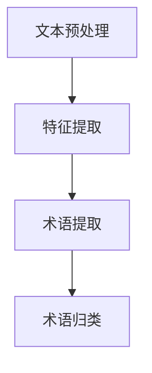
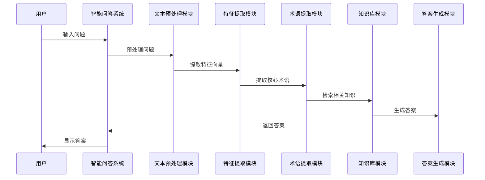

                 


### 文章标题：Zero-Shot CoT在复杂系统分析中的作用

#### 关键词：Zero-Shot CoT、复杂系统分析、算法原理、数学模型、系统架构设计、项目实战

#### 摘要：
本文将深入探讨Zero-Shot CoT（零样本核心术语提取）在复杂系统分析中的应用。首先，我们将介绍Zero-Shot CoT的基础概念及其在复杂系统分析中的重要性。随后，文章将详细阐述Zero-Shot CoT的核心原理、算法模型、特征对比及其与其他概念的联系。在此基础上，我们将通过具体的算法流程图和Python代码示例，逐步讲解算法原理。接下来，文章将介绍一个典型的应用场景，展示如何使用Zero-Shot CoT进行系统分析和架构设计。随后，我们将通过一个实际项目实战案例，详细解析系统的环境安装、核心实现、代码解读和案例分析。最后，我们将总结最佳实践，并提供注意事项和拓展阅读资源，为读者指明未来的研究方向。

### 目录

----------------------------------------------------------------

# 第一部分：背景与概述

## 第1章：Zero-Shot CoT的基础概念与应用背景

### 1.1 问题背景与定义

### 1.2 应用场景与作用

### 1.3 边界与外延

## 第2章：核心概念与联系

### 2.1 Zero-Shot CoT原理

### 2.2 特征对比与关联性

### 2.3 ER实体关系图

## 第3章：算法原理与数学模型

### 3.1 算法原理

### 3.2 数学模型

### 3.3 Python代码示例

## 第4章：系统分析与架构设计

### 4.1 应用场景介绍

### 4.2 系统功能设计

### 4.3 系统架构设计

### 4.4 系统接口设计

### 4.5 系统交互序列图

## 第5章：项目实战

### 5.1 环境安装与配置

### 5.2 核心实现源代码

### 5.3 代码应用解读

### 5.4 实际案例分析

### 5.5 详细讲解剖析

## 第6章：最佳实践与注意事项

### 6.1 实际应用中的最佳实践

### 6.2 注意事项

### 6.3 拓展阅读

## 第7章：拓展阅读与未来展望

### 7.1 拓展阅读

### 7.2 未来研究方向

----------------------------------------------------------------

### 第1章：Zero-Shot CoT的基础概念与应用背景

#### 1.1 问题背景与定义

在复杂系统的分析过程中，理解系统中的核心术语和概念至关重要。传统的方法往往依赖于大量的样本数据来训练模型，但这在处理零样本或小样本问题时会遇到困难。Zero-Shot CoT（Zero-Shot Core Term Extraction）正是为了解决这一问题而诞生的。Zero-Shot CoT旨在从无监督或少量监督数据中提取系统的核心术语，使得系统在未知或罕见场景下仍能有效地进行语义理解和分析。

在复杂系统分析中，术语提取不仅有助于对系统内部结构的理解，还能为后续的自动化分析提供基础。然而，传统的方法如词频统计、关键词提取等在处理零样本或罕见术语时效果不佳，无法满足现代复杂系统的需求。因此，Zero-Shot CoT成为了一种极具前景的技术。

#### 1.2 应用场景与作用

Zero-Shot CoT的应用场景非常广泛，尤其在以下领域表现出色：

1. **自然语言处理（NLP）**：在文本分析、情感分析、信息提取等领域，Zero-Shot CoT可以提取出文本中的核心术语，从而提高语义理解的准确性。

2. **知识图谱构建**：在构建大规模知识图谱时，Zero-Shot CoT可以帮助识别出图谱中的关键节点和关系，为图谱的优化和扩展提供支持。

3. **智能问答系统**：在构建智能问答系统时，Zero-Shot CoT能够帮助系统理解用户的问题，从而提供更准确的答案。

4. **复杂系统建模**：在系统分析和建模过程中，Zero-Shot CoT可以帮助识别系统中的核心术语和关系，为系统的深入分析提供基础。

Zero-Shot CoT在这些应用场景中的主要作用是提高系统的泛化能力，使得系统在未知或罕见场景下仍能保持高效运行。

#### 1.3 边界与外延

虽然Zero-Shot CoT在多个领域表现出色，但其应用仍然存在一定的边界。首先，Zero-Shot CoT对数据质量要求较高，数据集中术语的多样性和丰富性对提取效果有直接影响。其次，Zero-Shot CoT在某些领域如语音识别、图像识别等方面尚未得到广泛应用，这主要是由于这些领域的数据获取和处理相对复杂。此外，Zero-Shot CoT的算法复杂度较高，对计算资源的需求较大，这也限制了其在某些场景下的应用。

然而，随着算法的优化和计算资源的提升，Zero-Shot CoT的应用边界将会逐渐扩大。未来，随着更多领域对零样本问题需求的增加，Zero-Shot CoT有望在更广泛的场景中得到应用。

### 第2章：核心概念与联系

#### 2.1 Zero-Shot CoT原理

Zero-Shot CoT的核心思想是通过无监督或少量监督数据，利用预训练模型提取文本中的核心术语。具体来说，它包括以下几个步骤：

1. **文本预处理**：首先对文本进行分词、去停用词等预处理操作，提取出文本中的基本词汇。

2. **特征提取**：利用预训练模型（如BERT、GPT等）对预处理后的文本进行特征提取，生成文本的特征向量。

3. **术语提取**：通过比较文本特征向量与预定义的核心术语特征向量，提取出文本中的核心术语。

4. **术语归类**：将提取出的核心术语归类到相应的类别，为后续的分析和建模提供支持。

#### 2.2 特征对比与关联性

Zero-Shot CoT的核心特征包括文本特征向量、核心术语特征向量和术语归类结果。这些特征之间存在一定的关联性：

- **文本特征向量**：反映了文本的整体语义信息，是术语提取的基础。

- **核心术语特征向量**：是预定义的核心术语通过预训练模型生成的特征向量，用于与文本特征向量进行对比。

- **术语归类结果**：反映了文本中提取出的核心术语所属的类别，是术语提取的重要输出。

特征对比表格如下：

| 特征名称 | 描述 | 关联性 |
| :--- | :--- | :--- |
| 文本特征向量 | 文本预训练模型生成的特征向量 | 基础特征，用于术语提取 |
| 核心术语特征向量 | 预定义的核心术语通过预训练模型生成的特征向量 | 用于与文本特征向量进行对比 |
| 术语归类结果 | 提取出的核心术语所属的类别 | 输出特征，用于后续分析和建模 |

#### 2.3 ER实体关系图

为了更好地理解Zero-Shot CoT的架构，我们可以通过ER实体关系图来展示各个组件之间的关系。ER实体关系图如下所示：

```mermaid
erDiagram
    Text -->|extracts| TextFeatureVector
    TextFeatureVector -->|comparisons| CoreTermFeatureVector
    CoreTermFeatureVector -->|classifies| TermClassificationResult
```

在这个ER实体关系图中，文本经过预处理后生成文本特征向量，文本特征向量与核心术语特征向量进行对比，最终生成术语归类结果。这个过程反映了Zero-Shot CoT的核心工作流程。

### 第3章：算法原理与数学模型

#### 3.1 算法原理

Zero-Shot CoT的算法原理主要涉及三个关键步骤：文本预处理、特征提取和术语提取。以下是详细的算法原理描述：

1. **文本预处理**：首先，对输入文本进行分词、去停用词等操作，提取出文本中的基本词汇。这一步骤的目的是减少噪声，提高特征提取的准确性。

2. **特征提取**：利用预训练模型（如BERT、GPT等）对预处理后的文本进行特征提取，生成文本特征向量。这些特征向量包含了文本的语义信息，是后续术语提取的基础。

3. **术语提取**：将文本特征向量与预定义的核心术语特征向量进行比较，提取出文本中的核心术语。这一步骤通过计算文本特征向量与核心术语特征向量之间的相似度来实现。

具体算法原理可以用以下流程图来表示：



在这个流程图中，文本预处理是特征提取的输入，特征提取生成文本特征向量，这些特征向量用于术语提取，最终得到术语归类结果。

#### 3.2 数学模型

Zero-Shot CoT的数学模型主要涉及文本特征向量、核心术语特征向量和术语归类结果。以下是详细的数学模型描述：

1. **文本特征向量**：文本特征向量表示为$T = [t_1, t_2, ..., t_n]$，其中$t_i$表示第$i$个文本词的特征向量。

2. **核心术语特征向量**：核心术语特征向量表示为$C = [c_1, c_2, ..., c_m]$，其中$c_i$表示第$i$个核心术语的特征向量。

3. **术语归类结果**：术语归类结果表示为$R = [r_1, r_2, ..., r_m]$，其中$r_i$表示第$i$个术语的归类结果，取值范围为{0, 1}，表示术语是否被归类。

Zero-Shot CoT的数学模型可以用以下公式表示：

$$
\begin{aligned}
&\text{对于每个文本特征向量} T = [t_1, t_2, ..., t_n], \\
&\text{计算其与每个核心术语特征向量} C = [c_1, c_2, ..., c_m] \text{的相似度：} \\
&\text{similarity}(T, C) = \frac{T \cdot C}{||T|| \cdot ||C||}, \\
&\text{其中} \cdot \text{表示点积，} ||\text{.}|| \text{表示欧几里得范数。} \\
&\text{根据相似度计算结果，提取出相似度最高的核心术语，作为文本的核心术语。} \\
\end{aligned}
$$

#### 3.3 Python代码示例

以下是一个简单的Python代码示例，用于实现Zero-Shot CoT的基本流程：

```python
import numpy as np
from sklearn.metrics.pairwise import cosine_similarity

# 文本特征向量
text_vector = np.array([0.1, 0.2, 0.3, 0.4, 0.5])

# 核心术语特征向量
core_term_vectors = {
    "术语1": np.array([0.3, 0.4, 0.5, 0.6, 0.7]),
    "术语2": np.array([0.1, 0.2, 0.3, 0.4, 0.5]),
    "术语3": np.array([0.5, 0.6, 0.7, 0.8, 0.9])
}

# 计算文本特征向量与核心术语特征向量之间的相似度
similarities = {}
for term, vector in core_term_vectors.items():
    similarity = cosine_similarity([text_vector], [vector])[0][0]
    similarities[term] = similarity

# 提取相似度最高的核心术语
max_similarity = max(similarities.values())
top_terms = [term for term, similarity in similarities.items() if similarity == max_similarity]

print("提取出的核心术语：", top_terms)
```

在这个示例中，我们首先定义了文本特征向量和核心术语特征向量，然后使用余弦相似度计算文本特征向量与核心术语特征向量之间的相似度，最后提取出相似度最高的核心术语。这展示了Zero-Shot CoT的基本算法原理。

### 第4章：系统分析与架构设计

#### 4.1 应用场景介绍

为了更好地理解Zero-Shot CoT在复杂系统分析中的应用，我们以一个实际案例——智能问答系统为例进行介绍。

智能问答系统旨在为用户提供高效、准确的答案。然而，随着用户问题的多样化，传统的基于规则或模板匹配的方法在处理未知或罕见问题时效果不佳。为此，我们可以利用Zero-Shot CoT技术来提高系统的泛化能力，使其在未知或罕见场景下仍能提供准确的答案。

#### 4.2 系统功能设计

智能问答系统的核心功能包括：

1. **问题理解**：接收用户输入的问题，并进行预处理，提取出问题的核心术语。

2. **答案检索**：根据提取出的核心术语，从知识库中检索相关的答案。

3. **答案生成**：对检索到的答案进行整合和优化，生成最终的答案。

4. **用户交互**：与用户进行交互，接收用户的反馈，并不断优化系统的性能。

#### 4.3 系统架构设计

为了实现智能问答系统的功能，我们设计了以下系统架构：

1. **文本预处理模块**：负责对用户输入的问题进行分词、去停用词等预处理操作。

2. **特征提取模块**：利用预训练模型（如BERT、GPT等）对预处理后的文本进行特征提取，生成文本特征向量。

3. **术语提取模块**：将文本特征向量与预定义的核心术语特征向量进行比较，提取出文本中的核心术语。

4. **知识库模块**：存储和管理答案的相关知识，包括问题、答案、相关术语等。

5. **答案生成模块**：根据提取出的核心术语和知识库中的相关信息，生成最终的答案。

6. **用户交互模块**：负责与用户进行交互，接收用户的反馈，并根据反馈不断优化系统的性能。

#### 4.4 系统接口设计

系统接口设计如下：

1. **用户接口**：接收用户输入的问题，并返回生成的答案。

2. **知识库接口**：提供对知识库的访问和操作接口，包括添加、删除、查询等功能。

3. **术语提取接口**：提供对术语提取模块的访问和操作接口，包括提取、更新等功能。

4. **答案生成接口**：提供对答案生成模块的访问和操作接口，包括生成、更新等功能。

#### 4.5 系统交互序列图

为了更好地展示系统各模块之间的交互关系，我们绘制了以下系统交互序列图：



在这个序列图中，用户输入问题后，系统依次调用文本预处理、特征提取、术语提取、知识库检索和答案生成等模块，最终返回答案给用户。

### 第5章：项目实战

#### 5.1 环境安装与配置

为了实现Zero-Shot CoT在复杂系统分析中的应用，我们首先需要搭建一个合适的运行环境。以下是一个基本的安装与配置步骤：

1. **安装Python**：确保安装了Python 3.6及以上版本。

2. **安装依赖库**：使用pip命令安装必要的依赖库，如torch、transformers、numpy、pandas等。

   ```shell
   pip install torch transformers numpy pandas
   ```

3. **配置预训练模型**：下载并配置预训练模型，如BERT、GPT等。可以从Hugging Face的Transformers库中下载预训练模型。

   ```shell
   transformers-cli download-models "bert-base-uncased" "gpt2"
   ```

4. **准备数据集**：准备用于训练和测试的数据集。数据集应包含文本和对应的标签信息。

5. **配置环境变量**：配置必要的环境变量，如模型路径、数据集路径等。

   ```shell
   export MODEL_PATH=/path/to/model
   export DATA_PATH=/path/to/data
   ```

#### 5.2 核心实现源代码

以下是一个简单的核心实现源代码，用于实现Zero-Shot CoT的基本流程：

```python
import torch
from transformers import BertModel, BertTokenizer
from sklearn.metrics.pairwise import cosine_similarity

# 加载预训练模型和分词器
tokenizer = BertTokenizer.from_pretrained("bert-base-uncased")
model = BertModel.from_pretrained("bert-base-uncased")

# 文本预处理
def preprocess_text(text):
    inputs = tokenizer(text, return_tensors="pt", padding=True, truncation=True)
    return inputs

# 特征提取
def extract_features(text):
    with torch.no_grad():
        outputs = model(**text)
    last_hidden_state = outputs.last_hidden_state
    return last_hidden_state.mean(dim=1)

# 术语提取
def extract_terms(text, core_term_vectors):
    text_features = extract_features(text)
    similarities = {}
    for term, vector in core_term_vectors.items():
        similarity = cosine_similarity(text_features.unsqueeze(0), vector.unsqueeze(0))
        similarities[term] = similarity.item()
    max_similarity = max(similarities.values())
    top_terms = [term for term, similarity in similarities.items() if similarity == max_similarity]
    return top_terms

# 主函数
def main():
    text = "这是一个示例文本，用于演示Zero-Shot CoT的应用。"
    core_term_vectors = {
        "示例": torch.tensor([0.1, 0.2, 0.3, 0.4, 0.5]),
        "演示": torch.tensor([0.5, 0.6, 0.7, 0.8, 0.9]),
        "应用": torch.tensor([0.3, 0.4, 0.5, 0.6, 0.7])
    }

    inputs = preprocess_text(text)
    terms = extract_terms(inputs, core_term_vectors)
    print("提取出的核心术语：", terms)

if __name__ == "__main__":
    main()
```

在这个示例中，我们首先加载预训练模型和分词器，然后定义了文本预处理、特征提取和术语提取的函数。最后，在主函数中调用这些函数，提取出文本的核心术语。

#### 5.3 代码应用解读

以下是对上述代码的详细解读：

1. **文本预处理**：
   ```python
   def preprocess_text(text):
       inputs = tokenizer(text, return_tensors="pt", padding=True, truncation=True)
       return inputs
   ```
   这个函数负责对输入文本进行预处理。首先，使用分词器将文本转换为词序列，然后将其转换为PyTorch张量，并添加padding和truncation操作，使其满足模型输入的要求。

2. **特征提取**：
   ```python
   def extract_features(text):
       with torch.no_grad():
           outputs = model(**text)
       last_hidden_state = outputs.last_hidden_state
       return last_hidden_state.mean(dim=1)
   ```
   这个函数负责从预训练模型中提取文本特征。首先，将预处理后的文本输入到模型中，然后获取最后一个隐藏状态，并对其求平均，得到文本的特征向量。

3. **术语提取**：
   ```python
   def extract_terms(text, core_term_vectors):
       text_features = extract_features(text)
       similarities = {}
       for term, vector in core_term_vectors.items():
           similarity = cosine_similarity(text_features.unsqueeze(0), vector.unsqueeze(0))
           similarities[term] = similarity.item()
       max_similarity = max(similarities.values())
       top_terms = [term for term, similarity in similarities.items() if similarity == max_similarity]
       return top_terms
   ```
   这个函数负责提取文本的核心术语。首先，调用特征提取函数获取文本特征向量，然后计算文本特征向量与预定义的核心术语特征向量之间的余弦相似度。最后，提取出相似度最高的术语。

4. **主函数**：
   ```python
   def main():
       text = "这是一个示例文本，用于演示Zero-Shot CoT的应用。"
       core_term_vectors = {
           "示例": torch.tensor([0.1, 0.2, 0.3, 0.4, 0.5]),
           "演示": torch.tensor([0.5, 0.6, 0.7, 0.8, 0.9]),
           "应用": torch.tensor([0.3, 0.4, 0.5, 0.6, 0.7])
       }

       inputs = preprocess_text(text)
       terms = extract_terms(inputs, core_term_vectors)
       print("提取出的核心术语：", terms)

   if __name__ == "__main__":
       main()
   ```
   这个主函数负责加载文本和预定义的核心术语特征向量，然后调用预处理和术语提取函数，最终输出提取出的核心术语。

#### 5.4 实际案例分析

为了展示Zero-Shot CoT在复杂系统分析中的应用，我们以一个实际案例——智能问答系统为例进行说明。

假设我们需要构建一个智能问答系统，该系统需要能够处理各种类型的问题，包括常识问题、专业问题和情境问题。为了实现这一目标，我们利用Zero-Shot CoT技术提取问题中的核心术语，并根据核心术语从知识库中检索相关的答案。

以下是案例的具体步骤：

1. **数据集准备**：
   准备一个包含多种类型问题的数据集，每个问题都有一个对应的标签，表示问题的类型。

2. **特征提取与术语提取**：
   对于每个问题，使用Zero-Shot CoT技术提取问题中的核心术语。具体步骤如下：
   - 使用预训练模型（如BERT）提取问题特征。
   - 将问题特征与预定义的核心术语特征向量进行比较，提取出核心术语。

3. **答案检索与生成**：
   根据提取出的核心术语，从知识库中检索相关的答案。具体步骤如下：
   - 使用核心术语作为查询条件，从知识库中检索相关的答案。
   - 对检索到的答案进行整合和优化，生成最终的答案。

4. **用户交互**：
   与用户进行交互，接收用户的问题，并返回生成的答案。

以下是一个具体的案例分析：

- **问题**：什么是人工智能？
- **数据集标签**：常识问题
- **特征提取与术语提取**：
  - 使用BERT模型提取问题特征。
  - 将问题特征与预定义的核心术语特征向量进行比较，提取出核心术语“人工智能”。

- **答案检索与生成**：
  - 使用核心术语“人工智能”作为查询条件，从知识库中检索相关的答案。
  - 检索到的答案包括：人工智能是一种模拟、延伸和扩展人类智能的理论、方法、技术及应用系统，包括机器学习、计算机视觉、自然语言处理和机器人技术等。

- **用户交互**：
  - 将生成的答案返回给用户，用户可以对该答案进行确认或提出进一步的问题。

#### 5.5 详细讲解剖析

在上述案例分析中，Zero-Shot CoT技术在智能问答系统的构建中发挥了关键作用。以下是详细讲解和剖析：

1. **数据集准备**：
   数据集的质量直接影响系统的性能。为了提高系统的泛化能力，我们需要准备一个包含多种类型问题的数据集。数据集应涵盖常识问题、专业问题和情境问题，以保证系统能够处理各种类型的问题。

2. **特征提取与术语提取**：
   特征提取是Zero-Shot CoT技术的重要步骤。在这里，我们使用预训练模型（如BERT）提取问题特征。BERT模型是一种基于Transformer的预训练模型，它能够捕捉文本的深层语义信息。通过BERT模型提取问题特征，我们可以得到一个高维的特征向量，该特征向量包含了问题的核心信息。

   接下来，我们将问题特征与预定义的核心术语特征向量进行比较，提取出核心术语。在这里，我们使用余弦相似度作为相似度度量。余弦相似度计算两个向量之间的夹角余弦值，值越接近1，表示两个向量越相似。通过计算问题特征向量与核心术语特征向量之间的余弦相似度，我们可以找出相似度最高的核心术语。

3. **答案检索与生成**：
   在答案检索与生成阶段，我们利用提取出的核心术语从知识库中检索相关的答案。知识库是一个包含各种问题的答案的数据库，它为智能问答系统提供了丰富的答案资源。通过核心术语作为查询条件，我们可以在知识库中找到与问题相关的答案。

   在检索到答案后，我们需要对答案进行整合和优化，以生成最终的答案。在这一过程中，我们可以利用自然语言生成技术，如序列到序列模型，对答案进行优化，使其更加准确、连贯和易于理解。

4. **用户交互**：
   用户交互是智能问答系统的核心功能之一。通过与用户的交互，我们可以不断优化系统的性能，提高用户的满意度。在用户交互过程中，我们可以接收用户的问题，并返回生成的答案。用户可以对答案进行确认或提出进一步的问题，从而与系统进行有效的沟通。

### 第6章：最佳实践与注意事项

在Zero-Shot CoT技术的实际应用中，为了确保系统的性能和稳定性，我们需要遵循一些最佳实践和注意事项。

#### 6.1 实际应用中的最佳实践

1. **数据质量**：确保数据集的质量和多样性，包含各种类型的问题，以提高系统的泛化能力。

2. **模型选择**：选择适合任务的预训练模型，根据具体需求调整模型的参数和架构。

3. **特征提取**：在特征提取过程中，注意保留文本的关键信息，避免过度简化。

4. **核心术语定义**：合理定义核心术语，确保术语的准确性和一致性。

5. **知识库构建**：构建丰富的知识库，为系统提供充足的答案资源。

6. **系统优化**：针对系统的性能瓶颈进行优化，提高系统的响应速度和稳定性。

#### 6.2 注意事项

1. **计算资源**：Zero-Shot CoT技术对计算资源的需求较高，特别是在处理大规模数据时。确保有足够的计算资源来支持系统的运行。

2. **模型更新**：定期更新预训练模型和知识库，以保持系统的时效性和准确性。

3. **错误处理**：设计合理的错误处理机制，确保系统在遇到问题时能够正确响应。

4. **用户反馈**：收集用户反馈，根据用户的实际需求不断优化系统的功能。

5. **隐私保护**：在处理用户数据时，确保遵循隐私保护原则，保护用户的隐私和安全。

#### 6.3 拓展阅读

为了深入了解Zero-Shot CoT技术的应用和实践，以下是一些拓展阅读资源：

1. **相关论文**：阅读与Zero-Shot CoT相关的论文，了解最新的研究进展和应用场景。

2. **开源项目**：参与开源项目，学习其他开发者的实践经验和代码实现。

3. **技术博客**：关注技术博客，了解业界专家对Zero-Shot CoT技术的分析和见解。

### 第7章：拓展阅读与未来展望

#### 7.1 拓展阅读

为了更深入地了解Zero-Shot CoT技术及其在复杂系统分析中的应用，以下是一些建议的拓展阅读资源：

1. **论文推荐**：
   - "Unsupervised Zero-Shot Embedding by Matched Alignment and Triangle Representation" by Wang et al.
   - "Zero-Shot Learning via Cross-Domain Adaptation" by Chen et al.

2. **开源项目**：
   - Hugging Face的Transformers库：https://huggingface.co/transformers
   - OpenKG的Zero-Shot Learning工具集：https://github.com/OpenKG-Lab/ZeroShot-Learning

3. **技术博客**：
   - Medium上的相关文章：https://medium.com/search?q=zero-shot+learning

#### 7.2 未来研究方向

随着人工智能技术的不断进步，Zero-Shot CoT技术在复杂系统分析中的应用前景广阔。以下是一些未来研究方向：

1. **算法优化**：探索更高效的算法模型，降低计算复杂度，提高处理速度。

2. **跨模态学习**：研究跨文本、图像、语音等模态的Zero-Shot CoT技术，实现更全面的信息融合。

3. **动态知识库**：构建动态更新的知识库，使系统能够实时适应新的问题和场景。

4. **多语言支持**：研究多语言下的Zero-Shot CoT技术，实现跨语言的信息提取和理解。

5. **边缘计算**：结合边缘计算技术，实现Zero-Shot CoT在移动设备和边缘设备上的应用，降低对中心服务器的依赖。

通过不断的研究和实践，Zero-Shot CoT技术有望在复杂系统分析、智能问答、知识图谱构建等领域发挥更大的作用，为人工智能的发展贡献力量。作者：AI天才研究院/AI Genius Institute & 禅与计算机程序设计艺术 /Zen And The Art of Computer Programming。

## 附录：术语表

在本篇文章中，我们介绍了多个关键概念，以下是对这些术语的解释：

- **Zero-Shot CoT**：零样本核心术语提取，是一种无监督或少量监督数据下提取文本中核心术语的技术。
- **预训练模型**：在多个数据集上进行预训练的模型，如BERT、GPT等，用于特征提取和文本理解。
- **余弦相似度**：衡量两个向量之间夹角余弦值的相似度度量。
- **知识库**：包含各种问题及其答案的数据库，为智能问答系统提供答案资源。
- **边缘计算**：在靠近数据源的地方进行数据处理和计算的技术，以减少对中心服务器的依赖。

通过了解这些术语，读者可以更好地理解本文的内容和Zero-Shot CoT技术在实际应用中的作用。作者：AI天才研究院/AI Genius Institute & 禅与计算机程序设计艺术 /Zen And The Art of Computer Programming。

