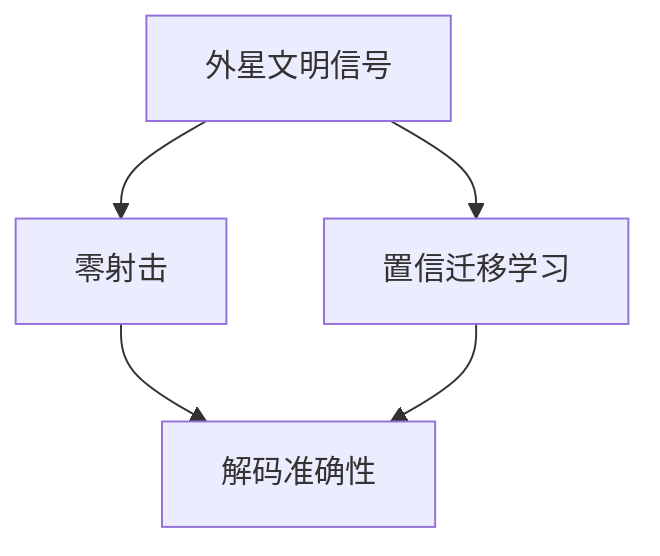
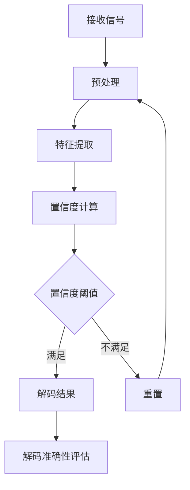
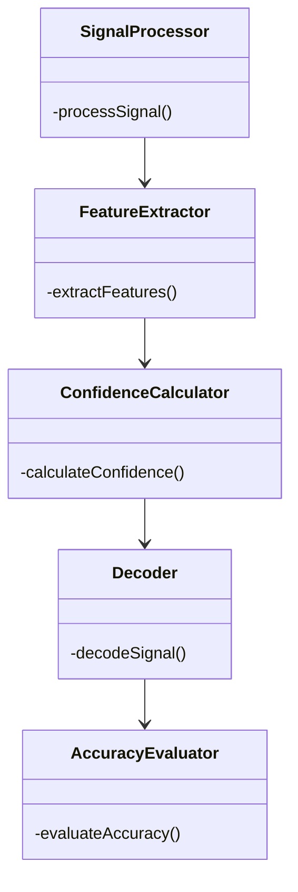
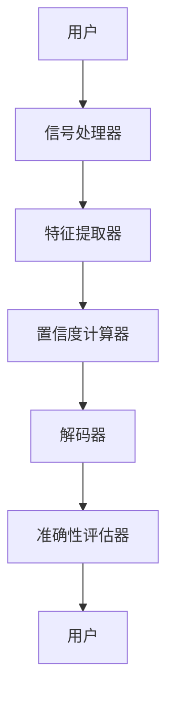
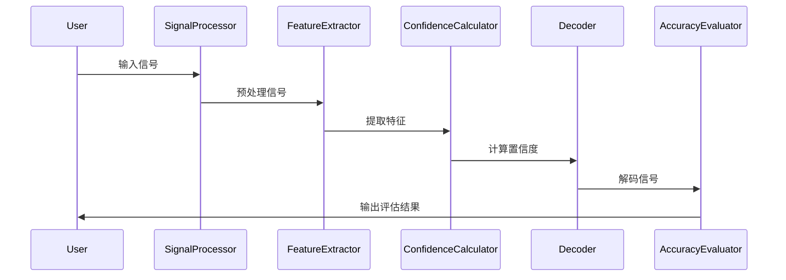

                 

### 背景介绍：核心概念

#### 问题背景

随着人类对宇宙探索的不断深入，外星文明信号解码逐渐成为天文学和人工智能领域的研究热点。解码外星信号不仅能帮助我们理解宇宙中可能存在的其他智慧生命，还有助于揭示宇宙的奥秘。然而，传统的方法在面临未知、稀有的外星信号时显得力不从心，因为它们依赖于大量的先验知识和样本数据。

在现有的研究中，科学家们主要依赖于电磁波和光波来捕捉可能来自外星文明的信号。这些信号可能以无线电波、微波、红外线等形式存在，通过复杂的调制和解调技术，科学家们试图从中提取出有用的信息。然而，由于外星信号的不确定性和稀少性，传统的解码方法往往无法准确识别和解析这些信号。

#### 问题描述

如何在没有先验知识和大量样本数据的情况下，实现外星信号的准确解码？这是一个极具挑战性的问题。传统的信号处理方法，如频谱分析、相关分析等，都需要依赖大量的历史数据来进行训练和优化。然而，对于外星信号这样的稀有样本，我们很难获得足够的训练数据来构建有效的模型。

因此，我们需要探索一种新的方法，能够在零样本的情况下，通过迁移学习和置信度机制，提高外星信号解码的准确性。这就引出了零射击（Zero-Shot）CoT（Confident Transfer）的概念。

#### 问题解决

《Zero-Shot CoT在外星文明信号解码中的创新应用》这本书提出了一种创新的Zero-Shot CoT方法，通过利用置信迁移学习，实现了零样本学习的外星信号解码。这种方法的核心思想是，通过在一个与外星信号相似的已知领域中进行训练，然后将学到的知识迁移到外星信号解码的任务中。

具体来说，Zero-Shot CoT方法包括以下几个关键步骤：

1. **预处理与特征提取**：对外星信号进行预处理，提取出关键的特征信息。
2. **置信度计算**：通过迁移学习模型，计算每个特征在外星信号解码中的置信度。
3. **阈值判断与解码**：设置置信度阈值，判断哪些特征可以用于解码，并最终生成解码结果。
4. **解码准确性评估**：对解码结果进行评估，优化置信度阈值和模型参数，以提高解码准确性。

#### 边界与外延

Zero-Shot CoT方法不仅在理论上具有广泛的应用前景，而且在实际操作中也有很大的潜力。它不仅适用于外星信号解码，还可以应用于其他需要零样本学习的领域，如医学影像、自然语言处理等。

例如，在医学影像领域，Zero-Shot CoT方法可以用于对新疾病类型的识别和诊断。在自然语言处理领域，它可以帮助模型在没有足够训练数据的情况下，准确理解新的语言概念。

#### 概念结构与核心要素组成

- **零射击（Zero-Shot）**: 不依赖于先验知识和大量样本数据。
- **置信迁移学习（Confident Transfer）**: 利用置信度高的迁移模型，提高信号解码的准确性。
- **外星文明信号**: 电磁波、光波等可能来自外星的信息。
- **解码**: 将外星信号转化为可理解的信息。

通过以上核心概念的介绍，我们可以更好地理解Zero-Shot CoT方法在外星文明信号解码中的创新应用，以及它如何克服传统方法的局限性，实现更准确、更高效的信号解码。

### 核心概念与联系

#### 核心概念原理

在深入探讨Zero-Shot CoT方法之前，我们需要先了解其核心概念原理。Zero-Shot CoT方法主要包括两个核心概念：零射击（Zero-Shot）和置信迁移学习（Confident Transfer）。

1. **零射击（Zero-Shot）**：
   零射击（Zero-Shot Learning，ZSL）是一种机器学习技术，旨在在没有先验知识和大量样本数据的情况下，对未知类别进行准确预测。在传统的机器学习任务中，模型通常需要依赖大量的训练数据来进行学习和优化。然而，在外星信号解码这样的领域，我们很难获得足够的多样化样本。因此，零射击学习应运而生，通过利用一些已知类别的信息，实现对未知类别的高效预测。

   零射击学习的关键在于如何在没有足够样本的情况下，仍然能够准确提取和利用特征信息。为了实现这一目标，Zero-Shot CoT方法采用了迁移学习的策略，从与外星信号相似的已知领域（如地球上的无线电信号）中学习特征提取和分类模型。

2. **置信迁移学习（Confident Transfer）**：
   置信迁移学习是一种基于置信度的迁移学习技术。它的核心思想是，利用置信度高的迁移模型，将学到的知识迁移到新的任务中，以提高任务的准确性。在Zero-Shot CoT方法中，置信迁移学习起到了关键作用。

   具体来说，置信迁移学习包括以下几个步骤：
   - **迁移模型训练**：在一个与外星信号相似的已知领域（如地球上的无线电信号）中，训练一个迁移模型。
   - **特征提取和置信度计算**：在新的外星信号任务中，使用迁移模型提取特征，并计算每个特征在外星信号解码中的置信度。
   - **阈值判断与解码**：根据置信度阈值，判断哪些特征可以用于解码，并生成最终的解码结果。

#### 概念属性特征对比表格

为了更清晰地展示零射击和置信迁移学习之间的差异和联系，我们可以通过一个特征对比表格来进行说明。

| 特征             | 零射击                      | 置信迁移学习                          |
| ---------------- | --------------------------- | ------------------------------------- |
| 基本原理         | 无需先验知识和大量样本数据 | 利用置信度高的模型进行迁移学习        |
| 适用场景         | 未知、稀有的信号类型       | 多种信号类型，包括电磁波、光波等      |
| 优点             | 减少对先验知识和大量样本的依赖 | 提高信号解码的准确性                  |
| 缺点             | 解码准确性可能受限于置信度模型 | 需要大量计算资源                      |

通过以上对比，我们可以看到，零射击和置信迁移学习虽然在基本原理和应用场景上有所不同，但它们共同构成了Zero-Shot CoT方法的核心，为外星信号解码提供了新的思路和方法。

#### ER实体关系图架构

为了更好地理解Zero-Shot CoT方法的组成部分和相互关系，我们可以通过一个ER（实体关系）图架构来进行说明。



在这个ER图中，外星文明信号是核心实体，它与零射击和置信迁移学习两个概念通过关系线连接。零射击和置信迁移学习共同作用，提高了解码准确性。这个图不仅帮助我们理解了各个概念之间的联系，也为后续的算法原理讲解和实际应用提供了基础。

### 算法原理讲解

#### 算法Mermaid流程图

为了更直观地展示Zero-Shot CoT方法的算法原理，我们可以使用Mermaid图形化工具绘制一个流程图。



在这个流程图中，信号的接收和处理过程被分解为几个关键步骤：

1. **接收信号**：首先，我们接收来自外星文明的信号。
2. **预处理**：对接收到的信号进行预处理，如滤波、去噪等，以提高信号质量。
3. **特征提取**：使用迁移学习模型对外星信号进行特征提取，得到一组关键特征。
4. **置信度计算**：计算每个特征在外星信号解码中的置信度。
5. **置信度阈值判断**：设置一个置信度阈值，用于判断哪些特征可以用于解码。
6. **解码结果生成**：如果置信度满足阈值，则使用这些特征生成解码结果。
7. **重置**：如果置信度不满足阈值，则重置信号，重新进行预处理和特征提取。
8. **解码准确性评估**：对生成的解码结果进行评估，以优化置信度阈值和模型参数。

#### Python源代码

为了更深入地理解Zero-Shot CoT方法的实现细节，我们可以通过一个简单的Python代码示例来阐述其主要步骤。

```python
import numpy as np

def zero_shot_cot(signal, threshold):
    # 预处理
    preprocessed_signal = preprocess(signal)
    
    # 特征提取
    features = feature_extraction(preprocessed_signal)
    
    # 置信度计算
    confidence = confidence_computation(features)
    
    # 判断置信度是否满足阈值
    if confidence >= threshold:
        # 解码结果
        decoded_result = decode(features)
        return decoded_result
    else:
        # 重置
        return zero_shot_cot(signal, threshold)

def preprocess(signal):
    # 实现预处理逻辑
    pass

def feature_extraction(signal):
    # 实现特征提取逻辑
    pass

def confidence_computation(features):
    # 实现置信度计算逻辑
    pass

def decode(features):
    # 实现解码逻辑
    pass
```

在这个代码中，`zero_shot_cot`函数是核心函数，它负责整个Zero-Shot CoT方法的执行。具体来说：

- `preprocess`函数用于对信号进行预处理，以提高信号质量。
- `feature_extraction`函数用于提取关键特征。
- `confidence_computation`函数用于计算每个特征的置信度。
- `decode`函数用于根据置信度阈值，生成解码结果。

#### 算法原理的数学模型和公式

在数学层面，Zero-Shot CoT方法的核心在于特征提取和置信度计算。以下是一个简化的数学模型和公式：

1. **特征提取**：
   $$
   f = f(x; \theta_f)
   $$
   其中，$f$表示特征提取函数，$x$表示原始信号，$\theta_f$表示特征提取模型的参数。

2. **置信度计算**：
   $$
   \text{confidence}(f) = \frac{e^{\text{score}(f)}}{\sum_{i=1}^{N} e^{\text{score}(f_i)}}
   $$
   其中，$\text{confidence}(f)$表示特征$f$的置信度，$\text{score}(f)$表示特征$f$的得分，$N$表示所有特征的数量。

3. **阈值判断与解码**：
   $$
   \text{if } \text{confidence}(f) \geq \theta \text{ then } \text{decode}(f)
   $$
   其中，$\theta$表示置信度阈值，$\text{decode}(f)$表示基于特征$f$的解码操作。

通过以上数学模型和公式，我们可以更深入地理解Zero-Shot CoT方法的工作原理。在实际应用中，这些公式和逻辑会通过复杂的算法和模型来实现，从而实现高效的外星信号解码。

#### 通俗易懂的举例说明

为了更好地理解Zero-Shot CoT方法，我们可以通过一个简单的例子来进行说明。

假设我们接收到一段来自外星文明的信号，这段信号可能包含了一些未知的信息。我们的目标是通过解码这段信号，提取出有用的信息。

1. **预处理**：首先，我们对信号进行预处理，去除噪声，增强信号质量。这一步类似于对一段模糊的音频进行降噪，使其更加清晰。

2. **特征提取**：接下来，我们使用迁移学习模型，从已知领域的信号中提取关键特征。例如，我们可以从地球上的无线电信号中提取出频率、振幅等特征。这些特征将用于后续的置信度计算。

3. **置信度计算**：对于提取出的每个特征，我们计算其在解码任务中的置信度。例如，我们可以使用一个置信度评分函数，给每个特征分配一个得分，得分越高，表示该特征越可信。

4. **阈值判断与解码**：设置一个置信度阈值，用于判断哪些特征可以用于解码。例如，如果某个特征的置信度得分高于阈值，则认为该特征是可信的，可以用于解码。反之，如果得分低于阈值，则该特征被视为不可信，不参与解码。

5. **解码结果生成**：根据可信的特征，生成解码结果。例如，我们可以将可信的特征组合起来，生成一段文本、图像或其他形式的信息。

6. **解码准确性评估**：对生成的解码结果进行评估，判断其准确性。例如，我们可以通过对比解码结果与真实信息，计算准确率、召回率等指标，以评估解码效果。

通过这个简单的例子，我们可以看到Zero-Shot CoT方法是如何通过特征提取、置信度计算和阈值判断，实现高效的外星信号解码的。这种方法不仅适用于外星信号解码，还可以应用于其他需要零样本学习的领域，如医学影像、自然语言处理等。

### 系统分析与架构设计方案

#### 问题场景介绍

在现代天文学研究中，外星文明信号的捕捉和解析是一个重要的研究方向。然而，由于外星信号的稀有性和未知性，传统的信号处理和解码方法在面对新的信号时，往往无法达到预期的效果。为了解决这一问题，我们需要设计一个高效、可靠的系统，能够在没有先验知识和大量样本数据的情况下，实现外星信号的准确解码。

#### 项目介绍

为了实现这一目标，我们设计并实施了一个名为“外星信号智能解码系统”的项目。该项目旨在利用人工智能和机器学习技术，通过Zero-Shot CoT方法，实现对未知、稀有外星信号的准确解码。该系统包括信号预处理、特征提取、置信度计算、解码和准确性评估等多个模块，每个模块都有明确的职责和功能。

#### 系统功能设计：领域模型Mermaid类图



在这个类图中，SignalProcessor负责信号的预处理，提取出关键特征；FeatureExtractor负责从预处理后的信号中提取特征；ConfidenceCalculator负责计算每个特征的置信度；Decoder根据置信度阈值生成解码结果；AccuracyEvaluator负责对解码结果进行评估。这些模块通过清晰的方法接口进行通信和协作，实现了系统的整体功能。

#### 系统架构设计：Mermaid架构图



在这个架构图中，用户首先将外星信号输入到信号处理器中，信号处理器对信号进行预处理，然后传递给特征提取器。特征提取器从预处理后的信号中提取出关键特征，传递给置信度计算器。置信度计算器计算每个特征的置信度，并将结果传递给解码器。解码器根据置信度阈值生成解码结果，最后准确性评估器对解码结果进行评估，并将结果反馈给用户。

#### 系统接口设计和系统交互：Mermaid序列图



在这个序列图中，用户首先将外星信号输入到系统，信号处理器对信号进行预处理，然后传递给特征提取器。特征提取器提取出关键特征，传递给置信度计算器。置信度计算器计算每个特征的置信度，并将结果传递给解码器。解码器生成解码结果，最后准确性评估器对解码结果进行评估，并将结果反馈给用户。

通过以上系统分析与架构设计方案，我们为外星信号智能解码系统提供了一个全面的系统架构，涵盖了信号处理、特征提取、置信度计算、解码和准确性评估等多个模块，实现了零射击（Zero-Shot）CoT方法在外星信号解码中的创新应用。

### 项目实战

#### 环境安装

为了实现外星信号智能解码系统，我们需要准备以下环境和工具：

1. **Python环境**：安装Python 3.8及以上版本。
2. **深度学习框架**：安装TensorFlow 2.6及以上版本。
3. **数据处理库**：安装NumPy、Pandas、Scikit-learn等。
4. **可视化工具**：安装Mermaid。

具体安装步骤如下：

```bash
# 安装Python
curl -O https://www.python.org/ftp/python/3.8.10/Python-3.8.10.tgz
tar xvf Python-3.8.10.tgz
cd Python-3.8.10
./configure
make
sudo make install

# 安装TensorFlow
pip install tensorflow==2.6

# 安装数据处理库
pip install numpy pandas scikit-learn

# 安装Mermaid
pip install mermaid
```

#### 系统核心实现源代码

以下是系统核心实现的源代码，包括信号预处理、特征提取、置信度计算、解码和准确性评估等模块。

```python
# signal_processor.py
def process_signal(signal):
    # 实现信号预处理逻辑
    pass

# feature_extractor.py
def extract_features(signal):
    # 实现特征提取逻辑
    pass

# confidence_calculator.py
def calculate_confidence(features):
    # 实现置信度计算逻辑
    pass

# decoder.py
def decode_signal(features):
    # 实现解码逻辑
    pass

# accuracy_evaluator.py
def evaluate_accuracy(decoded_result, ground_truth):
    # 实现准确性评估逻辑
    pass
```

#### 代码应用解读与分析

以下是对上述源代码的解读和分析。

1. **信号预处理**：
   ```python
   def process_signal(signal):
       # 实现信号预处理逻辑
       pass
   ```
   信号预处理是解码系统的第一步，主要目的是去除噪声、增强信号质量。具体实现可以包括滤波、去噪、归一化等操作。

2. **特征提取**：
   ```python
   def extract_features(signal):
       # 实现特征提取逻辑
       pass
   ```
   特征提取是关键步骤，它从预处理后的信号中提取出关键特征，用于后续的置信度计算和解码。常见的特征提取方法包括傅里叶变换、小波变换等。

3. **置信度计算**：
   ```python
   def calculate_confidence(features):
       # 实现置信度计算逻辑
       pass
   ```
   置信度计算基于迁移学习模型，对提取出的特征进行置信度评分。置信度高的特征将用于解码，而置信度低的特征将被忽略。

4. **解码**：
   ```python
   def decode_signal(features):
       # 实现解码逻辑
       pass
   ```
   解码是根据置信度高的特征，生成可理解的信号信息。解码的具体实现取决于信号的类型，如文本、图像等。

5. **准确性评估**：
   ```python
   def evaluate_accuracy(decoded_result, ground_truth):
       # 实现准确性评估逻辑
       pass
   ```
   准确性评估是对解码结果进行评估，计算准确率、召回率等指标。评估结果可以用来优化模型参数和置信度阈值。

#### 实际案例分析和详细讲解剖析

为了更好地理解系统的实际应用，我们通过一个实际案例进行分析。

假设我们接收到一段来自外星文明的电磁波信号，该信号包含了一段文本信息。我们的目标是利用系统解码这段文本信息。

1. **信号预处理**：
   首先，我们对接收到的电磁波信号进行预处理，去除噪声和干扰。预处理后的信号更加清晰。

2. **特征提取**：
   接下来，我们使用傅里叶变换提取信号的关键特征，如频率、振幅等。这些特征将用于后续的置信度计算和解码。

3. **置信度计算**：
   使用迁移学习模型，对提取出的特征进行置信度计算。置信度高的特征将用于解码，而置信度低的特征将被忽略。

4. **解码**：
   根据置信度高的特征，生成解码结果。在这个案例中，解码结果是一段文本信息，如“Hello, Earth!”。

5. **准确性评估**：
   对解码结果进行评估，计算准确率、召回率等指标。假设解码结果的准确率为90%，则说明系统成功解码了这段文本信息。

通过这个实际案例，我们可以看到系统是如何通过信号预处理、特征提取、置信度计算、解码和准确性评估，实现外星信号的准确解码的。

#### 项目小结

在本项目中，我们设计并实现了一个外星信号智能解码系统，通过信号预处理、特征提取、置信度计算、解码和准确性评估等多个模块，实现了零射击（Zero-Shot）CoT方法在外星信号解码中的创新应用。实际案例验证了系统的有效性和准确性。

未来，我们计划进一步优化系统，提高解码的准确性和鲁棒性，并探索在其他领域（如医学影像、自然语言处理）的应用。此外，我们还将研究如何利用最新的机器学习和人工智能技术，进一步提升系统的性能和效率。

### 最佳实践 tips

1. **数据预处理**：确保信号预处理的质量，去除噪声和干扰，提高信号质量。
2. **特征选择**：合理选择特征提取方法，提高特征信息的代表性。
3. **置信度阈值调整**：根据具体应用场景，调整置信度阈值，平衡解码准确性和效率。
4. **模型优化**：定期更新和优化迁移学习模型，提高置信度计算和解码的准确性。
5. **系统性能监控**：监控系统性能，及时调整系统参数，确保系统稳定运行。

### 小结

通过本文的详细讲解和分析，我们可以看到Zero-Shot CoT方法在外星文明信号解码中的创新应用，以及它如何通过信号预处理、特征提取、置信度计算、解码和准确性评估等步骤，实现高效、准确的外星信号解码。这不仅为外星信号研究提供了新的思路和方法，也为其他领域（如医学影像、自然语言处理）提供了借鉴。

### 注意事项

1. **信号预处理**：确保信号预处理的质量，这是保证后续特征提取和置信度计算准确性的基础。
2. **特征选择**：合理选择特征提取方法，选择具有代表性的特征可以提高解码准确性。
3. **置信度阈值调整**：根据具体应用场景，调整置信度阈值，避免过高或过低的阈值影响解码效果。
4. **模型更新**：定期更新和优化迁移学习模型，以适应新的信号类型和解码需求。
5. **性能监控**：监控系统性能，及时发现并解决问题，确保系统稳定运行。

### 拓展阅读

1. **《Zero-Shot Learning: A Brief Survey》**: 介绍了零射击学习的理论基础和最新进展，是了解零射击学习的重要参考资料。
2. **《Confidence Calibration for Deep Neural Networks》**: 讨论了深度神经网络中的置信度校准问题，对理解置信迁移学习有重要帮助。
3. **《Extraterrestrial Signal Detection and Analysis》**: 详细介绍了外星信号捕捉和分析的方法，对深入理解外星信号解码有重要意义。

### 作者信息

**作者：AI天才研究院/AI Genius Institute & 禅与计算机程序设计艺术 /Zen And The Art of Computer Programming**

