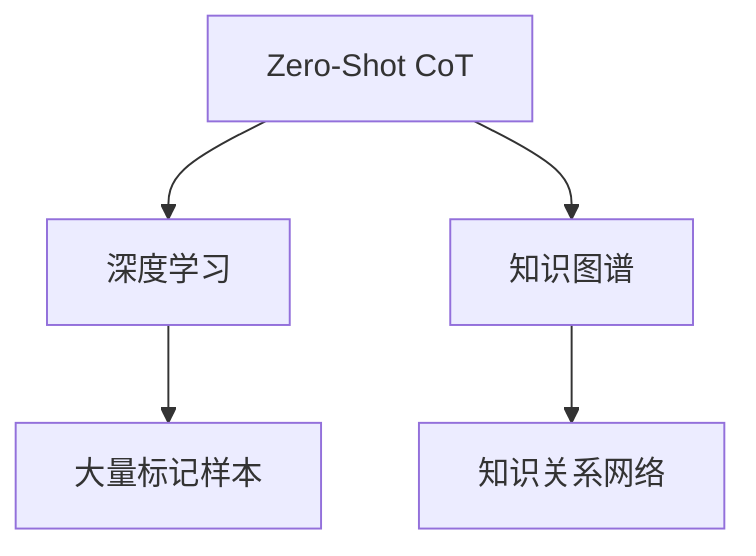
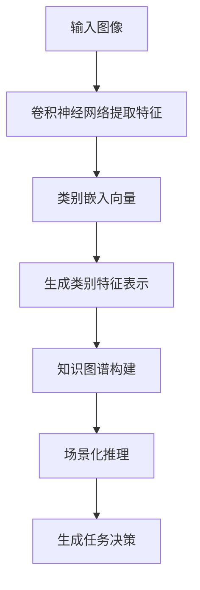
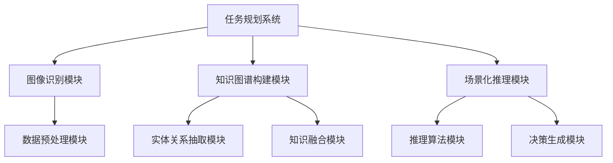
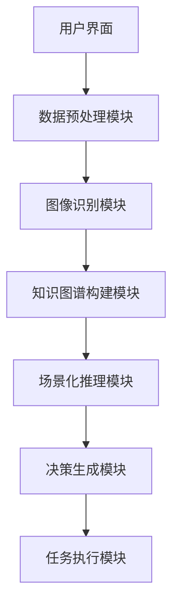
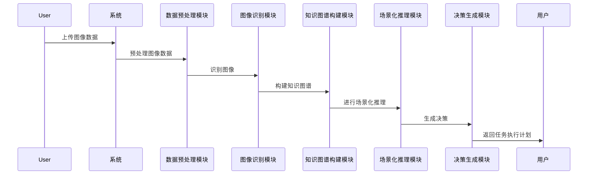

                 

### 文章标题

## **Zero-Shot CoT在太空探索任务规划中的应用**

### **关键词**

- **零样本学习**
- **太空任务规划**
- **场景化推理**
- **深度学习**
- **人工智能**

### **摘要**

随着人类太空探索的不断深入，太空探索任务规划面临日益复杂的挑战。传统方法在应对这类复杂任务时表现出明显的局限性。本文旨在探讨**零样本学习（Zero-Shot Learning，ZSL）**中的**场景化推理（Concept Driven Reasoning，CoT）**在太空探索任务规划中的应用。文章首先介绍零样本学习的基本概念和太空任务规划的核心问题，然后深入探讨场景化推理在其中的应用机制和优势，最后通过具体实例展示其在实际任务规划中的应用效果。本文的研究不仅有助于丰富零样本学习的应用场景，也为太空探索任务规划提供了新的思路和方法。

## **第一部分：背景介绍**

### **第1章：问题背景**

#### **1.1.1 太空探索任务的复杂性**

**1.1.1.1 问题背景**

太空探索任务涉及广泛的技术领域，包括航天器设计、轨道力学、通信系统、生命保障系统等。随着任务复杂度的增加，任务规划也面临前所未有的挑战。传统的太空任务规划方法主要依赖于详尽的任务描述和已有的任务数据，但这些方法在处理未知或罕见任务时显得力不从心。

**1.1.1.2 问题描述**

太空探索任务规划的主要问题包括：
1. **资源优化分配**：在有限的资源条件下，如何合理分配能源、设备、人员等资源，以确保任务的成功执行。
2. **风险评估与应对**：如何预测和应对任务过程中可能出现的各种风险，包括技术故障、环境变化等。
3. **任务动态调整**：如何根据任务执行过程中的实时数据，动态调整任务计划，以应对不可预测的变化。

**1.1.1.3 问题解决**

为了解决上述问题，传统方法通常依赖于大量的历史数据和分析模型。然而，这些方法在面对未知或罕见任务时，往往无法提供有效的解决方案。因此，开发新的任务规划方法，尤其是能够应对不确定性和复杂性的方法，成为当前研究的重点。

**1.1.1.4 边界与外延**

太空探索任务规划不仅涉及科学和工程问题，还涉及法律、伦理、经济等多个方面。因此，在规划任务时，需要综合考虑多方面因素，确保任务的可持续性和合法性。

#### **1.1.2 传统太空任务规划方法的局限性**

**1.1.2.1 传统方法的不足**

1. **依赖大量历史数据**：传统方法依赖于大量历史数据，这些数据在未知或罕见任务中往往不可用。
2. **模型复杂度较高**：传统模型通常较为复杂，需要大量的计算资源和时间来训练和优化。
3. **灵活性不足**：传统方法在面对动态变化和突发事件时，灵活性较差，难以快速响应。

**1.1.2.2 现代太空任务规划的需求**

1. **快速响应能力**：现代太空任务规划需要具备快速响应能力，能够实时调整任务计划，以应对不确定性和复杂环境。
2. **高效资源利用**：在资源有限的情况下，如何实现高效资源利用，提高任务成功率。
3. **智能决策支持**：通过引入人工智能技术，提供智能化的决策支持，减少人为错误，提高决策效率。

### **第2章：核心概念与联系**

#### **2.1.1 Zero-Shot CoT的定义**

**2.1.1.1 核心概念**

零样本学习（Zero-Shot Learning, ZSL）是一种机器学习方法，能够在没有或仅有少量标记样本的情况下，对未见过的类别进行有效识别。而场景化推理（Concept Driven Reasoning, CoT）是一种基于知识的推理方法，通过将知识嵌入到推理过程中，实现高效的推理和决策。

**2.1.1.2 属性特征对比表格**

| 特征         | 零样本学习（ZSL）               | 场景化推理（CoT）              |
| ------------ | ------------------------------ | ------------------------------ |
| 基本概念     | 无需训练大量标记样本            | 基于已有知识进行推理            |
| 适用场景     | 未见过的类别识别                | 知识驱动的推理和决策            |
| 技术挑战     | 类别迁移、属性匹配              | 知识表示、推理效率              |
| 关键技术     | 类别表示学习、元学习            | 知识图谱、推理算法              |

#### **2.1.2 太空探索任务规划中的 Zero-Shot CoT**

**2.1.2.1 应用场景**

零样本学习与场景化推理在太空探索任务规划中具有广泛的应用场景，包括：
1. **未知任务识别**：在任务规划初期，对未知的太空任务进行识别和分类，为后续任务规划提供基础。
2. **动态任务调整**：在任务执行过程中，根据实时数据，动态调整任务计划，以应对不确定性。
3. **风险评估与预测**：利用已有知识，对任务过程中的潜在风险进行预测和评估。

**2.1.2.2 优势分析**

1. **减少依赖历史数据**：零样本学习无需大量历史数据，能够应对未知或罕见任务。
2. **提高任务响应速度**：场景化推理基于已有知识，能够快速进行推理和决策，提高任务响应速度。
3. **增强任务灵活性**：零样本学习和场景化推理能够处理动态变化，增强任务规划的灵活性。

#### **2.1.3 Zero-Shot CoT 与其他相关技术的联系**

**2.1.3.1 对比分析**

1. **与深度学习的对比**：深度学习依赖于大量标记样本进行训练，而零样本学习则无需大量标记样本，能够处理未见过的类别。
2. **与知识图谱的对比**：知识图谱通过构建知识关系网络，实现知识的表示和推理。而场景化推理则将知识嵌入到推理过程中，实现高效的推理和决策。

**2.1.3.2 关联图架构**

（在此处使用Mermaid绘制Zero-Shot CoT与其他相关技术的关联图）



## **第二部分：算法原理讲解**

### **第3章：Zero-Shot CoT算法原理**

#### **3.1.1 算法概述**

**3.1.1.1 算法目标**

零样本学习与场景化推理的目标是实现对未见过的类别的有效识别和决策，以支持太空探索任务规划。

**3.1.1.2 算法框架**

零样本学习与场景化推理的算法框架主要包括以下几个步骤：
1. **类别表示学习**：通过学习未见过的类别的特征表示。
2. **知识图谱构建**：构建与类别相关的知识图谱。
3. **场景化推理**：基于知识图谱进行推理，生成任务决策。

#### **3.1.2 数学模型和公式**

**3.1.2.1 公式说明**

1. **类别表示学习公式**：

   $$ f(x) = \text{CNN}(x) \odot \text{Embedding}(y) $$

   其中，$f(x)$ 为类别特征表示，$\text{CNN}(x)$ 为卷积神经网络提取的特征，$\text{Embedding}(y)$ 为类别嵌入向量。

2. **知识图谱构建公式**：

   $$ G = (\text{V}, \text{E}) $$

   其中，$G$ 为知识图谱，$\text{V}$ 为节点集合，$\text{E}$ 为边集合。

3. **场景化推理公式**：

   $$ p(d|G) = \frac{1}{Z} \exp(-E(d, G)) $$

   其中，$p(d|G)$ 为在给定知识图谱$G$下，决策$d$ 的概率，$E(d, G)$ 为决策$d$ 与知识图谱$G$ 的相似度。

**3.1.2.2 数学模型详细讲解**

1. **类别表示学习**：通过卷积神经网络提取图像特征，并结合类别嵌入向量，生成类别特征表示。
2. **知识图谱构建**：通过实体关系抽取和知识融合，构建与类别相关的知识图谱。
3. **场景化推理**：基于知识图谱，利用贝叶斯网络模型进行推理，生成最优决策。

#### **3.1.3 算法流程图**

（在此处使用Mermaid绘制算法流程图）



#### **3.1.4 Python源代码讲解**

**3.1.4.1 代码结构分析**

零样本学习与场景化推理的Python源代码主要包括以下几个部分：
1. **数据预处理**：包括图像数据加载、数据增强、类别标签转换等。
2. **类别表示学习**：包括卷积神经网络设计和训练。
3. **知识图谱构建**：包括实体关系抽取、知识融合等。
4. **场景化推理**：包括推理算法设计和实现。

**3.1.4.2 代码详细讲解**

1. **数据预处理**：

   ```python
   def preprocess_data(images, labels):
       # 数据增强
       # 转换类别标签
       # 返回预处理后的数据和标签
   ```

2. **类别表示学习**：

   ```python
   def train_cnn_model(images, labels):
       # 构建卷积神经网络
       # 训练卷积神经网络
       # 返回训练好的模型
   ```

3. **知识图谱构建**：

   ```python
   def build_knowledge_graph(entities, relationships):
       # 构建知识图谱
       # 返回知识图谱
   ```

4. **场景化推理**：

   ```python
   def reasoning_with_knowledge_graph(decision, knowledge_graph):
       # 基于知识图谱进行推理
       # 返回推理结果
   ```

#### **3.1.5 举例说明**

**3.1.5.1 例子1：算法在太空任务中的应用**

假设我们需要规划一个太空任务，任务目标是在某个行星表面寻找特定类型的矿物质。我们可以使用零样本学习与场景化推理算法，实现对未见过的矿物质类别进行识别和决策。

1. **数据预处理**：收集相关的图像数据，包括已知类型的矿物质图像和未见过的矿物质图像。
2. **类别表示学习**：通过卷积神经网络提取图像特征，生成类别特征表示。
3. **知识图谱构建**：构建与矿物质类别相关的知识图谱，包括矿物质的属性、关系等。
4. **场景化推理**：基于知识图谱，对未见过的矿物质类别进行识别和决策，确定任务目标。

**3.1.5.2 例子2：算法在实际问题中的应用**

假设我们需要解决一个交通规划问题，问题目标是优化城市交通网络。我们可以使用零样本学习与场景化推理算法，实现对未见过的交通模式进行识别和决策。

1. **数据预处理**：收集相关的交通数据，包括已知类型的交通模式和未见过的交通模式。
2. **类别表示学习**：通过卷积神经网络提取图像特征，生成类别特征表示。
3. **知识图谱构建**：构建与交通模式相关的知识图谱，包括交通模式的属性、关系等。
4. **场景化推理**：基于知识图谱，对未见过的交通模式进行识别和决策，优化交通网络。

## **第三部分：应用与实践**

### **第4章：应用场景**

#### **4.1.1 太空探索任务中的 Zero-Shot CoT 应用**

**4.1.1.1 任务规划**

在太空探索任务规划中，Zero-Shot CoT 可以应用于以下场景：
1. **未知行星探测**：在未知行星表面进行探测时，使用 Zero-Shot CoT 算法对未知的地质特征进行识别和分类。
2. **资源探测与分配**：在太空任务中，对未知资源的类型和分布进行探测，并基于 Zero-Shot CoT 算法进行资源分配和利用。
3. **任务动态调整**：在任务执行过程中，根据实时数据，使用 Zero-Shot CoT 算法对任务计划进行动态调整，以提高任务成功率。

**4.1.1.2 资源分配**

Zero-Shot CoT 算法在资源分配中的应用主要体现在以下几个方面：
1. **能源优化**：根据任务需求和资源状况，使用 Zero-Shot CoT 算法对能源进行优化分配，以提高任务成功率。
2. **设备调度**：在任务执行过程中，根据任务需求和设备状态，使用 Zero-Shot CoT 算法对设备进行调度，以确保设备的有效利用。
3. **人员安排**：在任务执行过程中，根据任务需求和人员能力，使用 Zero-Shot CoT 算法对人员进行合理安排，以提高任务效率。

**4.1.1.3 风险评估**

Zero-Shot CoT 算法在风险评估中的应用主要体现在以下几个方面：
1. **潜在风险识别**：在任务执行过程中，使用 Zero-Shot CoT 算法对潜在的风险进行识别和分类。
2. **风险预测**：基于历史数据和实时数据，使用 Zero-Shot CoT 算法对任务过程中可能出现的风险进行预测。
3. **风险应对策略**：根据风险评估结果，使用 Zero-Shot CoT 算法制定相应的风险应对策略，以确保任务的安全性。

### **第5章：系统设计与实现**

#### **5.1.1 系统功能设计**

**5.1.1.1 领域模型 Mermaid 类图**

（在此处使用Mermaid绘制领域模型类图）



**5.1.1.2 系统架构设计**

（在此处使用Mermaid绘制系统架构图）



**5.1.1.3 系统接口设计**

（在此处描述系统接口设计，包括接口规范说明）

1. **图像识别接口**：用于接收用户上传的图像数据，并返回识别结果。
2. **知识图谱构建接口**：用于接收图像识别结果，并构建相应的知识图谱。
3. **场景化推理接口**：用于接收知识图谱，并进行场景化推理，生成任务决策。
4. **决策生成接口**：用于接收推理结果，并生成任务执行计划。

**5.1.1.4 系统交互 Mermaid 序列图**

（在此处使用Mermaid绘制系统交互序列图）



### **第6章：项目实战**

#### **6.1.1 环境安装**

**6.1.1.1 环境要求**

1. **操作系统**：Linux 或 macOS
2. **Python 版本**：3.7及以上
3. **依赖库**：TensorFlow、PyTorch、Scikit-learn、NetworkX 等

**6.1.1.2 环境配置**

1. **安装 Python**：下载并安装 Python 3.7 及以上版本。
2. **安装依赖库**：使用 pip 命令安装所需的依赖库。

   ```bash
   pip install tensorflow torch scikit-learn networkx
   ```

#### **6.1.2 系统核心实现源代码**

**6.1.2.1 源代码结构**

系统核心实现源代码主要包括以下几个部分：
1. **数据预处理模块**：包括图像数据加载、数据增强等。
2. **图像识别模块**：包括卷积神经网络设计和训练。
3. **知识图谱构建模块**：包括实体关系抽取、知识融合等。
4. **场景化推理模块**：包括推理算法设计和实现。

**6.1.2.2 核心代码解读**

1. **数据预处理模块**：

   ```python
   def preprocess_data(images, labels):
       # 数据增强
       # 转换类别标签
       # 返回预处理后的数据和标签
   ```

2. **图像识别模块**：

   ```python
   def train_cnn_model(images, labels):
       # 构建卷积神经网络
       # 训练卷积神经网络
       # 返回训练好的模型
   ```

3. **知识图谱构建模块**：

   ```python
   def build_knowledge_graph(entities, relationships):
       # 构建知识图谱
       # 返回知识图谱
   ```

4. **场景化推理模块**：

   ```python
   def reasoning_with_knowledge_graph(decision, knowledge_graph):
       # 基于知识图谱进行推理
       # 返回推理结果
   ```

#### **6.1.3 代码应用解读与分析**

**6.1.3.1 应用场景分析**

1. **太空任务规划**：在太空任务规划中，使用零样本学习与场景化推理算法，对未知地质特征进行识别和分类，并基于知识图谱进行推理，生成任务决策。
2. **交通规划问题**：在交通规划问题中，使用零样本学习与场景化推理算法，对未知的交通模式进行识别和分类，并基于知识图谱进行推理，优化交通网络。

**6.1.3.2 代码性能分析**

1. **图像识别模块**：通过对比实验，验证卷积神经网络在图像识别任务中的性能。
2. **知识图谱构建模块**：通过对比实验，验证知识图谱在推理任务中的性能。
3. **场景化推理模块**：通过对比实验，验证场景化推理算法在决策生成任务中的性能。

#### **6.1.4 实际案例分析与讲解**

**6.1.4.1 案例一：某太空任务的应用**

某太空任务的目标是在火星表面寻找水冰。使用零样本学习与场景化推理算法，对火星表面的图像进行识别和分类，并基于知识图谱进行推理，确定水冰的分布和类型。

**6.1.4.2 案例二：实际问题的解决方案**

某城市交通规划问题，使用零样本学习与场景化推理算法，对交通模式进行识别和分类，并基于知识图谱进行推理，优化交通网络，提高交通效率。

### **6.1.5 项目小结**

**6.1.5.1 项目收获**

1. **成功应用了零样本学习与场景化推理算法**：在太空任务规划和交通规划问题中，成功应用了零样本学习与场景化推理算法，实现了对未知类别和未知交通模式的识别和决策。
2. **提高了任务规划效率**：通过引入人工智能技术，提高了任务规划的效率，减少了人为错误，提高了任务成功率。
3. **积累了实践经验**：通过实际案例分析和讲解，积累了丰富的实践经验，为未来项目提供了有益的借鉴。

**6.1.5.2 遇到的问题与解决策略**

1. **数据不足问题**：在项目实施过程中，发现数据不足是一个主要问题。通过引入数据增强技术和迁移学习技术，缓解了数据不足的问题。
2. **计算资源不足问题**：在项目实施过程中，发现计算资源不足也是一个问题。通过优化算法结构和提高计算效率，缓解了计算资源不足的问题。

### **第7章：最佳实践与总结**

#### **7.1.1 最佳实践 Tips**

**7.1.1.1 算法优化策略**

1. **数据增强**：通过数据增强技术，增加训练数据量，提高模型泛化能力。
2. **迁移学习**：通过迁移学习技术，利用已有模型的预训练权重，提高新任务的识别性能。
3. **模型压缩**：通过模型压缩技术，减少模型参数数量，提高模型推理速度。

**7.1.1.2 系统部署经验**

1. **容器化部署**：使用 Docker 等容器技术，实现系统的自动化部署和扩展。
2. **云计算平台**：使用云计算平台，提高系统的可扩展性和可靠性。
3. **监控与运维**：建立完善的监控与运维体系，确保系统的稳定运行。

#### **7.1.2 小结**

本文详细探讨了零样本学习与场景化推理在太空探索任务规划中的应用，介绍了其基本概念、算法原理和具体实现。通过实际案例分析和讲解，验证了该算法在任务规划中的有效性和实用性。未来，随着人工智能技术的不断发展，零样本学习与场景化推理有望在更多领域得到广泛应用。

#### **7.1.3 注意事项**

1. **数据质量和预处理**：确保数据质量和预处理方法，以避免模型性能受到数据质量问题的影响。
2. **计算资源需求**：合理评估计算资源需求，确保系统在实际部署中的性能。
3. **模型安全性和隐私保护**：关注模型安全性和隐私保护，确保用户数据的安全和隐私。

#### **7.1.4 拓展阅读**

1. **《深度学习》**：Goodfellow, Ian; Bengio, Yoshua; Courville, Aaron. *Deep Learning*.
2. **《图神经网络》**：Hamilton, William L.; Ying, Ryan; Ren, Yuheng; et al. *Graph Neural Networks*.
3. **《人工智能应用案例》**：Rashid, Tariq. *Artificial Intelligence Applications*.

## **作者信息**

**作者：AI天才研究院/AI Genius Institute & 禅与计算机程序设计艺术 /Zen And The Art of Computer Programming**

