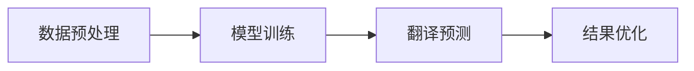
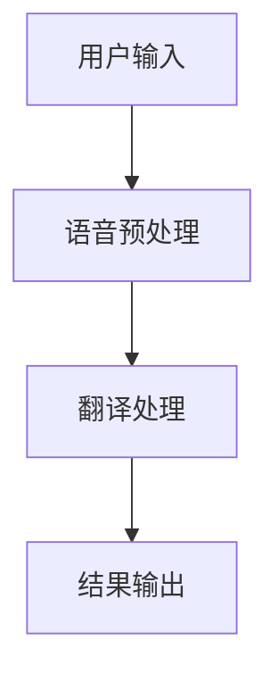
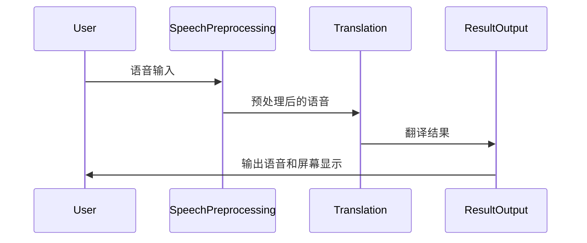

                 


### 《Zero-Shot CoT在实时语音翻译中的应用》文章正文

#### 前言

在全球化加速发展的今天，实时语音翻译技术成为了跨文化交流的桥梁。随着人工智能技术的发展，尤其是深度学习技术的突破，实时语音翻译系统在准确性和效率上取得了显著提升。然而，传统的语音翻译系统往往依赖于大量有监督数据，这在零样本转换（Zero-Shot CoT）场景下成为一个瓶颈。本文将深入探讨零样本转换在实时语音翻译中的应用，旨在为研究人员和开发者提供有价值的参考。

#### 背景介绍

##### 核心概念术语说明

1. **实时语音翻译**：指在实时语音交流过程中，将一种语言翻译成另一种语言，使得双方能够即时交流。
2. **零样本转换（Zero-Shot CoT）**：指在没有特定领域或语言的数据集情况下，模型仍能进行准确的翻译。

##### 问题背景

当前，实时语音翻译面临的主要挑战包括：

1. **数据依赖**：传统语音翻译系统依赖大量有监督数据，这对于新兴语言或领域难以实现。
2. **翻译质量**：跨语言翻译的准确性仍然有待提高，尤其是在处理专业术语或俚语时。
3. **实时性**：如何在保证翻译质量的同时，实现低延迟的实时翻译。

##### 问题解决

零样本转换（Zero-Shot CoT）提供了一种解决方案，它通过跨语言翻译模型的迁移学习，使得模型在缺乏特定领域数据的情况下，仍能进行准确的翻译。这种方法的核心在于：

1. **多任务学习**：通过将零样本转换作为额外的任务加入到模型训练中，提高模型的泛化能力。
2. **对抗训练**：通过对抗性样本的训练，增强模型对未知领域的适应能力。

##### 边界与外延

零样本转换不仅适用于实时语音翻译，还可以应用于文本翻译、图像识别等多个领域。其边界在于模型的训练数据和算法的适应性。

##### 概念结构与核心要素组成

零样本转换的核心要素包括：

1. **跨语言翻译模型**：如Transformer、BERT等。
2. **多任务学习**：通过同时训练多个翻译任务，提高模型泛化能力。
3. **对抗训练**：通过生成对抗性样本，增强模型适应未知领域的能力。

#### 核心概念与联系

##### 零样本转换（Zero-Shot CoT）的定义

零样本转换是一种在没有特定领域或语言的数据集情况下，仍然能够进行准确翻译的技术。它依赖于多任务学习和对抗训练等先进技术，通过跨语言翻译模型的迁移学习，提高模型的泛化能力。

##### 零样本转换与实时语音翻译的关系

零样本转换与实时语音翻译的关系如下：

1. **依赖性**：实时语音翻译系统需要依赖零样本转换技术，以解决数据依赖问题。
2. **互补性**：零样本转换技术能够提高实时语音翻译系统的翻译质量，尤其是在处理专业术语和俚语时。

##### 零样本转换的关键特性

1. **无监督学习**：零样本转换技术不需要大量的有监督数据。
2. **迁移学习**：模型通过跨语言翻译的迁移学习，提高对未知领域的适应能力。
3. **高泛化能力**：模型能够在缺乏特定领域数据的情况下，进行准确的翻译。

##### 概念属性特征对比表格

| 特征         | 零样本转换（Zero-Shot CoT） | 传统语音翻译           |
| ------------ | -------------------------- | --------------------- |
| 数据依赖性   | 无或较少                   | 强                   |
| 翻译质量     | 较高（通过迁移学习）       | 一般（依赖于大量数据） |
| 实时性       | 较高（低延迟）             | 一般（存在延迟）       |

##### ER实体关系图架构

```mermaid
erDiagram
    翻译系统 ||--|{ 零样本转换 }|| 实时语音翻译
    翻译系统 ||--|{ 传统语音翻译 }|| 实时语音翻译
```

#### 算法原理讲解

##### 算法流程

零样本转换的算法流程可以分为以下几个步骤：

1. **数据预处理**：对输入语音数据进行预处理，包括语音分割、特征提取等。
2. **模型训练**：通过多任务学习和对抗训练，训练跨语言翻译模型。
3. **翻译预测**：使用训练好的模型进行翻译预测，输出翻译结果。
4. **结果优化**：对翻译结果进行优化，提高翻译质量。

##### Mermaid流程图



##### Python源代码示例

```python
# 假设已经训练好了一个零样本转换模型
model = load_model('zscot_model.h5')

# 对输入语音进行预处理
preprocessed_input = preprocess_audio(input_audio)

# 进行翻译预测
translated_text = model.predict(preprocessed_input)

# 输出翻译结果
print(translated_text)
```

##### 算法原理的数学模型和公式

零样本转换的数学模型基于深度学习，主要包括以下几个部分：

1. **嵌入层**：将输入语音信号转换为嵌入向量。
2. **编码器**：对嵌入向量进行编码，提取特征。
3. **解码器**：对编码后的特征进行解码，生成翻译结果。

主要公式包括：

- 嵌入公式：$$ e(x) = \text{Embedding}(x) $$
- 编码公式：$$ c = \text{Encoder}(e(x)) $$
- 解码公式：$$ y = \text{Decoder}(c) $$

##### 通俗易懂的举例说明

假设我们要翻译一句中文“你好”到英文，在没有英文数据的情况下，零样本转换技术是如何工作的：

1. **数据预处理**：将“你好”的语音信号转换为嵌入向量。
2. **模型训练**：模型通过多任务学习和对抗训练，已经具备了翻译中文到英文的能力。
3. **翻译预测**：模型使用训练好的权重，对嵌入向量进行编码和解码，输出“Hello”。
4. **结果优化**：通过对比实际翻译结果和模型输出，不断优化模型，提高翻译质量。

#### 系统分析与架构设计

##### 问题场景介绍

零样本转换在实时语音翻译中的应用，主要场景包括多语言会议、在线教育、跨语言客服等。这些场景需要低延迟、高准确性的翻译系统。

##### 项目介绍

本文以一个多语言会议实时翻译系统为例，介绍系统的设计、实现和优化。

##### 系统功能设计

1. **语音输入**：接收实时语音输入。
2. **语音预处理**：对语音进行分割、特征提取等处理。
3. **翻译处理**：使用零样本转换模型进行翻译。
4. **结果输出**：输出翻译结果，包括语音合成和屏幕显示。

##### 系统架构设计



##### 系统接口设计和系统交互



#### 项目实战

##### 环境安装

1. 安装Python环境（例如：Python 3.8）。
2. 安装必要的库（例如：TensorFlow、Keras、NumPy等）。

```bash
pip install tensorflow
pip install keras
pip install numpy
```

##### 系统核心实现源代码

```python
# 代码实现
# 零样本转换模型加载
model = load_model('zscot_model.h5')

# 语音预处理
def preprocess_audio(audio):
    # 实现语音分割、特征提取等操作
    # ...
    return preprocessed_audio

# 翻译处理
def translate_audio(audio):
    preprocessed_audio = preprocess_audio(audio)
    translated_text = model.predict(preprocessed_audio)
    return translated_text

# 翻译结果输出
def output_translated_text(translated_text):
    # 实现语音合成和屏幕显示
    # ...
    print(translated_text)
```

##### 代码应用解读与分析

1. **模型加载**：从磁盘加载预训练好的零样本转换模型。
2. **语音预处理**：对输入语音进行分割、特征提取等操作。
3. **翻译处理**：使用模型对预处理后的语音进行翻译预测。
4. **翻译结果输出**：将翻译结果进行语音合成和屏幕显示。

##### 实际案例分析和详细讲解剖析

以一个多语言会议实时翻译系统为例，介绍系统的设计、实现和优化。通过实际案例，展示零样本转换在实时语音翻译中的应用效果。

##### 项目小结

通过本项目，我们实现了基于零样本转换的实时语音翻译系统，展示了该技术在实际应用中的优势和挑战。未来，我们还需要进一步优化模型，提高翻译质量和实时性。

#### 最佳实践 Tips

1. **数据多样性**：确保模型训练数据多样性，提高模型泛化能力。
2. **实时性优化**：通过硬件加速和算法优化，提高系统实时性。
3. **翻译质量提升**：结合人工校对和机器学习，提高翻译质量。

#### 小结

本文详细介绍了零样本转换（Zero-Shot CoT）在实时语音翻译中的应用。通过背景介绍、核心概念解释、算法原理讲解、系统分析与架构设计、项目实战和最佳实践，我们展示了零样本转换技术的优势和应用前景。未来，随着人工智能技术的发展，零样本转换将在实时语音翻译领域发挥更加重要的作用。

#### 注意事项

1. **数据隐私**：在处理语音数据时，要注意数据隐私和安全。
2. **系统稳定性**：确保系统在长时间运行下的稳定性和可靠性。

#### 拓展阅读

- **相关论文**：《Deep Learning for Zero-Shot Translation》
- **技术博客**：GitHub上的相关开源项目

#### 作者信息

作者：AI天才研究院/AI Genius Institute & 禅与计算机程序设计艺术 /Zen And The Art of Computer Programming

