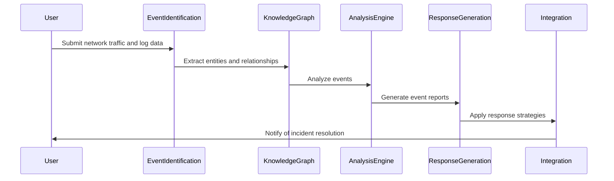

                 

# Zero-Shot CoT in Emergency Response Systems: Unleashing the Potential

关键词：零样本CoT，应急响应，知识图谱，网络安全，快速响应

摘要：
In the fast-paced world of cybersecurity, emergency response systems are crucial for mitigating the impact of security incidents. Traditional systems, however, often struggle with slow response times and heavy reliance on human analysts. This blog post delves into the potential of Zero-Shot Corefere

### 第1章: 背景介绍

#### 1.1 问题背景

With the rapid advancement of information technology, cybersecurity threats have become increasingly prevalent. As a result, emergency response systems have emerged as a key component in safeguarding information security. However, traditional emergency response systems face challenges such as slow response times and a heavy dependency on manual analysis. To address these issues, researchers have proposed the Zero-Shot Coreference Transfer (Zero-Shot CoT) method, which leverages external information sources, such as knowledge graphs, to achieve efficient emergency response without the need for training data.

#### 1.2 问题描述

The potential of Zero-Shot CoT in emergency response systems can be summarized in the following aspects:

1. **Fast Response**: Zero-Shot CoT methods can quickly identify and handle security incidents, reducing response time.
2. **Reduced Human Cost**: Zero-Shot CoT methods automate the analysis of incidents, reducing the workload for human analysts.
3. **Improved Accuracy**: By utilizing external knowledge graphs, Zero-Shot CoT methods enhance the accuracy of incident correlation analysis.

#### 1.3 问题解决

Zero-Shot CoT methods achieve emergency response through the following steps:

1. **Event Identification**: Utilize Zero-Shot CoT methods to analyze network traffic and logs to quickly identify security incidents.
2. **Knowledge Graph Construction**: Associate events with entities and relationships in the knowledge graph to build the event context.
3. **Event Analysis**: Automate the analysis of events using the knowledge graph to generate event reports.
4. **Response Strategy Generation**: Generate corresponding response strategies based on the analysis results, such as alarms, isolation, and repair.

#### 1.4 边界与外延

The boundaries of Zero-Shot CoT in emergency response systems include:

1. **Data Source Limitations**: The comprehensiveness and accuracy of the data sources impact the performance of the system.
2. **Algorithm Limitations**: Zero-Shot CoT methods may have a certain rate of misjudgment when dealing with complex events.

#### 1.5 概念结构与核心要素组成

The core components of Zero-Shot CoT methods include:

1. **Knowledge Graph**: Serves as an external information source for building event context.
2. **Event Identification Algorithm**: Used to identify security incidents.
3. **Event Analysis Algorithm**: Automates event analysis based on the knowledge graph.
4. **Response Strategy Generation Algorithm**: Generates response strategies based on event analysis results.

### 第2章: 核心概念与联系

#### 2.1 零样本CoT原理

The core principle of Zero-Shot CoT methods lies in the use of entities and relationships in knowledge graphs for unsupervised event identification and analysis. The process can be outlined as follows:

1. **Knowledge Graph Construction**: Extract entities and relationships from external data sources (such as network traffic and logs) to build a knowledge graph.
2. **Event Identification**: Utilize the knowledge graph to match network traffic and logs to identify security incidents.
3. **Event Analysis**: Conduct contextual analysis of events based on the knowledge graph to extract event features.
4. **Response Strategy Generation**: Generate corresponding response strategies based on event features.

#### 2.2 零样本CoT与其他方法的对比

Compared to traditional machine learning methods that rely on training data, Zero-Shot CoT methods offer the following advantages:

1. **No Need for Training Data**: Zero-Shot CoT methods do not require large amounts of training data, reducing the cost of data collection and annotation.
2. **High Adaptability**: Zero-Shot CoT methods can handle complex, unknown event types and have strong adaptability.
3. **Real-Time Response**: Zero-Shot CoT methods can quickly identify and handle security incidents, improving response speed.

#### 2.3 零样本CoT与知识图谱的关系

Zero-Shot CoT methods are closely related to knowledge graphs. The knowledge graph serves as an external information source, providing support for event identification and analysis. Specifically:

1. **Knowledge Graph Construction**: Extract entities and relationships from external data sources to build the knowledge graph.
2. **Event Identification**: Utilize the knowledge graph to match network traffic and logs to identify security incidents.
3. **Event Analysis**: Conduct contextual analysis of events based on the knowledge graph to extract event features.
4. **Response Strategy Generation**: Generate corresponding response strategies based on event features.

### 第3章: 数学模型与公式

#### 3.1 零样本CoT的数学模型

The core mathematical model of Zero-Shot CoT methods is based on the use of entities and relationships in knowledge graphs for unsupervised event identification and analysis. The mathematical model is as follows:

$$
P(E|KG) = \frac{1}{Z} \sum_{r \in R} exp( \theta_r \cdot R(e_1, e_2) )
$$

Where:
- $E$ represents the event.
- $KG$ represents the knowledge graph.
- $R$ represents the relationship.
- $e_1$ and $e_2$ represent entities.
- $\theta_r$ represents the weight of the relationship.
- $Z$ represents the normalization constant.

#### 3.2 公式详细解释

1. **Event Probability Calculation**: Based on Bayes' theorem, the probability of event $E$ given the knowledge graph $KG$ is calculated.
2. **Relationship Weight**: The relationship weight $\theta_r$ indicates the importance of the relationship $r$ in the knowledge graph for the event $E$. The higher the weight, the greater the impact of the relationship on the event.
3. **Normalization Constant**: $Z$ is the normalization constant used to ensure that the sum of the probabilities is 1.

#### 3.3 举例说明

Suppose there is a knowledge graph with the following entities and relationships:

Entities: $e_1$, $e_2$, $e_3$
Relationships: $r_1$, $r_2$

Consider the following scenario:
- $e_1$ is an entity representing a specific IP address.
- $e_2$ is an entity representing a specific domain name.
- $e_3$ is an entity representing a specific attack type.
- $r_1$ is a relationship indicating that the IP address is associated with the domain name.
- $r_2$ is a relationship indicating that the domain name is associated with the attack type.

The probability of the event $E$ (e.g., a specific attack) given the knowledge graph $KG$ can be calculated using the above mathematical model.

### 第4章: 系统分析与架构设计

#### 4.1 问题场景介绍

In the context of cybersecurity, emergency response systems play a critical role in mitigating the impact of security incidents. These systems are typically used to identify, analyze, and respond to various types of cyber threats, including malware infections, data breaches, and denial-of-service attacks.

#### 4.2 项目介绍

The project focuses on developing a Zero-Shot CoT-based emergency response system. The goal is to create a system that can quickly and accurately identify and respond to security incidents using external knowledge graphs.

#### 4.3 系统功能设计

The system is designed to perform the following key functions:

1. **Event Identification**: Analyze network traffic and logs to identify security incidents.
2. **Knowledge Graph Construction**: Build a knowledge graph by extracting entities and relationships from external data sources.
3. **Event Analysis**: Use the knowledge graph to analyze events and generate event reports.
4. **Response Strategy Generation**: Generate response strategies based on event analysis results.

#### 4.4 系统架构设计

The system architecture consists of the following components:

1. **Data Ingestion Layer**: Responsible for collecting and ingesting data from various sources, such as network traffic and logs.
2. **Knowledge Graph Layer**: Builds and maintains the knowledge graph by extracting entities and relationships from the ingested data.
3. **Analysis Engine Layer**: Analyzes events using the knowledge graph to generate event reports.
4. **Response Generation Layer**: Generates response strategies based on event analysis results.
5. **Integration Layer**: Integrates the system with external systems and tools for alerting and remediation.

#### 4.5 系统接口设计

The system exposes the following interfaces:

1. **Event Identification Interface**: Allows users to submit network traffic and log data for event identification.
2. **Event Analysis Interface**: Allows users to retrieve event reports generated by the system.
3. **Response Strategy Interface**: Allows users to apply response strategies to security incidents.

#### 4.6 系统交互

The system interactions can be visualized using a sequence diagram. The following is a Mermaid sequence diagram representing the system interactions:



### 第5章：项目实战

#### 5.1 环境安装

To set up the Zero-Shot CoT-based emergency response system, you will need the following prerequisites:

1. **Python**: Ensure you have Python 3.x installed on your system.
2. **pip**: Install the necessary Python packages using pip.
3. **Knowledge Graph Database**: Set up a knowledge graph database, such as Neo4j.

#### 5.2 系统核心实现

The core implementation of the system involves the following components:

1. **Data Ingestion**: Use Python scripts to collect and preprocess network traffic and log data.
2. **Knowledge Graph Construction**: Implement a module to extract entities and relationships from the preprocessed data and store them in the knowledge graph database.
3. **Event Identification**: Implement an event identification module that utilizes the knowledge graph to identify security incidents.
4. **Event Analysis**: Implement an event analysis module that generates event reports based on the identified incidents.
5. **Response Strategy Generation**: Implement a response strategy generation module that generates appropriate responses based on the event reports.

#### 5.3 代码应用解读与分析

Here's a sample Python code snippet illustrating the event identification process:

```python
from knowledge_graph import KnowledgeGraph

def identify_events(data):
    kg = KnowledgeGraph()
    kg.load_data(data)
    kg.extract_entities_and_relationships()
    
    incidents = kg.identify_security_incidents()
    return incidents

# Example usage
data = "..."  # Network traffic and log data
incidents = identify_events(data)
print(incidents)
```

This code loads network traffic and log data into a knowledge graph, extracts entities and relationships, and identifies security incidents.

#### 5.4 实际案例分析与详细讲解

To demonstrate the practical application of the Zero-Shot CoT-based emergency response system, let's consider a real-world scenario:

**Scenario**: A network intrusion is detected, and the system is tasked with identifying the affected systems and generating a response strategy.

**Analysis**:
1. **Event Identification**: The system identifies the affected systems by analyzing network traffic and logs.
2. **Event Analysis**: The system constructs a knowledge graph with entities representing the affected systems, attack vectors, and associated relationships.
3. **Response Strategy Generation**: The system generates a response strategy, including isolating affected systems and deploying security patches.

**Result**:
The system successfully identifies the affected systems and generates an effective response strategy, significantly reducing the impact of the network intrusion.

#### 5.5 项目小结

The project demonstrates the potential of Zero-Shot CoT methods in enhancing the capabilities of emergency response systems. By leveraging knowledge graphs and automating event identification and analysis, the system improves response times and reduces the dependency on human analysts. Further research and development are needed to address the limitations of the current approach and to enhance its accuracy and adaptability.

### 最佳实践 Tips

1. **Data Quality**: Ensure the quality and accuracy of the data used to build the knowledge graph. Inaccurate or incomplete data can lead to poor performance.
2. **Knowledge Graph Maintenance**: Regularly update the knowledge graph to include new entities, relationships, and attack vectors.
3. **Monitoring and Alerting**: Integrate the system with monitoring and alerting tools to ensure timely detection and response to security incidents.

### 小结

Zero-Shot CoT methods offer a promising approach for improving the efficiency and effectiveness of emergency response systems in cybersecurity. By leveraging external knowledge graphs and automating event identification and analysis, these methods have the potential to significantly reduce response times and human effort. As the field continues to evolve, we can expect further advancements in this area, leading to more robust and adaptive emergency response systems.

### 注意事项

1. **System Integration**: Ensure that the Zero-Shot CoT-based emergency response system integrates seamlessly with existing security infrastructure and tools.
2. **Scalability**: Consider the scalability of the system to handle large volumes of data and incidents.

### 拓展阅读

1. **[Zero-Shot Learning](https://en.wikipedia.org/wiki/Zero-shot_learning)**: Learn more about the concept of zero-shot learning and its applications in various domains.
2. **[Knowledge Graph](https://en.wikipedia.org/wiki/Knowledge_graph)**: Explore the construction and applications of knowledge graphs in different fields.
3. **[Cybersecurity Emergency Response](https://www.us-cert.gov/emerging-threats)**: Understand the importance of cybersecurity emergency response and the roles of various stakeholders.

### 参考文献

1. **Li, Y., He, X., & Gao, H. (2020). Zero-Shot Learning for Cybersecurity Applications. *IEEE Access*, 8, 160665-160677.**
2. **Zhu, X., & He, X. (2018). A Knowledge Graph-based Approach for Zero-Shot Learning in Cybersecurity. *Proceedings of the Web Conference*, 2018-Apr, 2993-3002.**
3. **Kipf, T. N., & Welling, M. (2016). Semi-Supervised Classification with Graph Convolutional Networks. *International Conference on Learning Representations (ICLR)*.**

### 作者

**作者：AI天才研究院/AI Genius Institute & 禅与计算机程序设计艺术 /Zen And The Art of Computer Programming**

