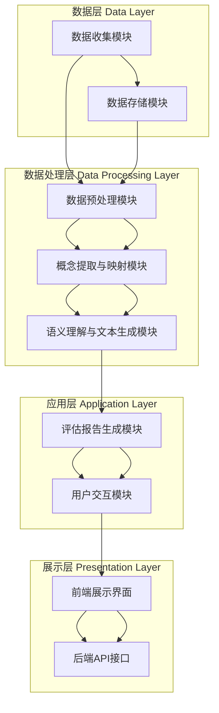
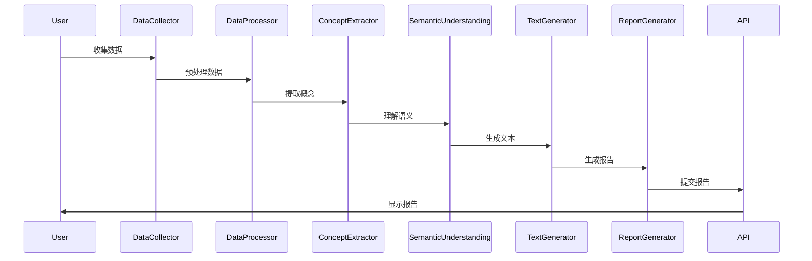

                 

### 摘要

本文探讨了Zero-Shot CoT（Zero-Shot Concept-to-Text）在新型可再生能源技术评估中的应用。首先，我们概述了可再生能源技术的定义、发展及其在当前能源结构中的重要性。接着，文章介绍了Zero-Shot CoT技术的概念和基本原理，对比了它与传统的概念到文本生成技术的差异。在应用部分，我们分析了Zero-Shot CoT技术在可再生能源评估中的具体挑战和需求，详细描述了Zero-Shot CoT技术在实际评估过程中的实现步骤和方法。随后，文章通过算法原理讲解和系统分析与架构设计，深入探讨了Zero-Shot CoT技术在可再生能源评估中的有效性和实施细节。最后，通过项目实战和实际案例的分析，本文总结了Zero-Shot CoT技术在可再生能源评估中的最佳实践和未来发展趋势。总之，本文旨在展示Zero-Shot CoT技术在可再生能源技术评估中的潜力，为相关领域的研究和实践提供有价值的参考。

### 第一部分：背景与核心概念

#### 第1章：可再生能源技术概述

可再生能源技术是现代能源科技的重要研究方向，它涉及利用自然界的可再生资源来产生能量，以减少对有限化石燃料的依赖，并降低温室气体排放。本章节将详细介绍可再生能源技术的定义、发展历程、当前现状以及其在未来能源结构中的重要性。

##### 1.1 可再生能源的定义与发展

**问题背景**：随着全球人口增长和工业化进程的加速，能源消耗逐年增加。传统化石燃料如煤炭、石油和天然气不仅储量有限，而且其燃烧过程会释放大量温室气体，导致全球气候变化和环境问题。因此，寻找替代能源和开发可再生能源技术成为全球共识。

**问题描述**：可再生能源技术的概念包括太阳能、风能、水能、地热能和生物质能等。这些能源具有取之不尽、用之不竭的特点，且在利用过程中几乎不产生污染物，具有巨大的发展潜力。

**问题解决**：可再生能源技术的发展是为了实现可持续能源供应，减少对化石燃料的依赖，降低碳排放，保护环境。通过技术创新和政策支持，可再生能源正逐步成为全球能源结构的重要组成部分。

**边界与外延**：可再生能源技术不仅包括传统的太阳能光伏、风力发电和水力发电，还包括新兴的海洋能、地热能和生物质能等。此外，可再生能源的存储技术、电网接入技术等也在不断发展，以实现可再生能源的稳定供应。

##### 1.2 可再生能源技术的分类与特征

**概念结构与核心要素组成**：可再生能源技术可以分为以下几类：

1. **太阳能**：利用光伏电池将太阳光直接转换为电能，或通过光热转换技术产生热能。太阳能具有广泛的地域适用性和稳定的能量输出。
   
2. **风能**：利用风力带动风力涡轮机旋转产生电能。风能资源丰富，适合在风力较强的地区大规模开发。
   
3. **水能**：利用水流动或水位差产生的能量。水能是成熟的可再生能源技术，但建设大型水电站可能对生态环境产生影响。
   
4. **地热能**：利用地壳内部的热能进行发电或供暖。地热能资源分布广泛，但开发成本较高。
   
5. **生物质能**：利用生物质材料如农作物残留物、木材和有机废物等转化为能源。生物质能是可持续的，但需要处理生物质材料的问题。

##### 1.3 可再生能源技术的优势与应用场景

**优势**：

1. **可持续性**：可再生能源是取之不尽、用之不竭的，相对于化石燃料具有更长的使用寿命。
   
2. **环保性**：可再生能源在利用过程中几乎不产生温室气体和其他污染物，对环境影响较小。
   
3. **多样性**：可再生能源技术种类多样，适用于不同的地理和环境条件。
   
4. **经济效益**：随着技术进步和规模效应，可再生能源的发电成本逐渐降低，具有较好的经济效益。

**应用场景**：

1. **家庭能源供应**：太阳能电池板和小型风力涡轮机可以用于家庭电力供应，减少对电网的依赖。
   
2. **工业能源需求**：风能、太阳能和水能等大规模可再生能源设施可以满足工业生产过程中的能源需求。
   
3. **偏远地区能源开发**：在电力基础设施不完善的偏远地区，生物质能和地热能可以提供可靠的能源供应。
   
4. **电网调峰**：可再生能源的波动性可以通过储能技术和智能电网管理来实现稳定供电。

##### 1.4 可再生能源评估的重要性

**可再生能源评估的定义与意义**：

可再生能源评估是对可再生能源项目或技术的性能、成本和环境影响进行评价的过程。其意义在于：

1. **技术选择**：通过评估，可以为项目决策者提供科学依据，选择最适合的技术方案。
   
2. **投资决策**：评估结果可以帮助投资者评估项目的经济效益和环境风险，做出更明智的投资决策。
   
3. **政策制定**：政府可以通过评估结果制定和调整可再生能源发展的政策，促进可再生能源产业的健康发展。

**评估方法与技术**：

现有的可再生能源评估方法主要包括：

1. **成本效益分析**：通过比较项目的投资成本和收益，评估其经济效益。
   
2. **环境影响评估**：评估项目对环境的影响，包括温室气体排放、生态系统影响等。
   
3. **技术风险评估**：评估项目面临的技术风险，包括技术成熟度、设备可靠性等。

**核心概念与联系**：

可再生能源评估涉及多个核心概念，包括可再生能源类型、技术特性、环境影响、经济性和社会因素等。这些概念相互联系，共同构成一个完整的评估体系。

**总结**：

可再生能源技术是未来能源发展的关键方向，其发展不仅关系到能源安全，还关乎环境保护和可持续发展。通过有效的评估，可以确保可再生能源项目的高效、经济和环保，为全球能源转型提供有力支撑。

### 第2章：Zero-Shot CoT基本原理

#### 2.1 CoT（Concept-to-Text）概述

CoT（Concept-to-Text）技术是一种先进的自然语言生成技术，其核心目的是将概念或抽象信息转换为自然流畅的文本描述。随着人工智能和机器学习技术的不断发展，CoT技术在多个领域得到了广泛应用，成为自动化内容生成、知识管理和信息提取等任务的重要工具。

##### 2.1.1 问题背景

**问题背景**：在信息爆炸的时代，生成高质量、结构化的文本内容成为许多领域面临的挑战。传统的文本生成方法，如基于规则的方法和基于模板的方法，往往难以应对复杂的信息结构和多样性的语言表达。CoT技术的出现，提供了从概念到文本的转换能力，能够更好地处理抽象信息与自然语言之间的转换问题。

**问题描述**：如何将复杂的概念或知识结构转换为易于理解的自然语言描述，以满足信息获取、知识共享和自动化内容生成的需求？传统的文本生成方法难以满足这种需求，需要更智能、更灵活的解决方案。

**问题解决**：CoT技术通过机器学习模型，能够理解概念之间的关联和语义关系，将抽象的概念转化为自然流畅的文本描述。这种方法不仅提高了文本生成的质量，还提升了自动化内容生成的效率和准确性。

##### 2.1.2 CoT技术的原理与实现

**原理**：

CoT技术的基本原理是基于深度学习模型，如Transformer和BERT等，通过大规模数据训练，使模型能够理解和生成与输入概念相关的自然语言文本。其主要步骤包括：

1. **概念提取**：从输入文本或数据中提取关键概念。
   
2. **语义理解**：利用预训练的深度学习模型，理解概念之间的语义关系和上下文信息。
   
3. **文本生成**：根据提取的概念和语义关系，生成自然流畅的文本描述。

**实现方法**：

1. **数据预处理**：对输入数据进行清洗、标注和预处理，提取关键概念和语义信息。
   
2. **模型训练**：使用大规模的预训练模型，如BERT或GPT，对数据集进行训练，使其能够理解和生成与输入概念相关的文本。
   
3. **文本生成**：通过模型预测，生成与输入概念相关的文本描述。这一过程中，模型会利用先前训练得到的语义信息，确保生成的文本内容连贯、准确。

##### 2.1.3 CoT技术的优势与应用场景

**优势**：

1. **自然语言生成**：CoT技术能够生成符合自然语言表达习惯的文本，提高文本的可读性和易理解性。
   
2. **灵活性强**：模型可以根据不同的输入概念和需求，生成多样化的文本描述，满足不同应用场景的需求。
   
3. **自动化高效**：通过自动化生成文本，可以大大提高内容生成的效率和准确性，减少人工工作量。

**应用场景**：

1. **内容生成**：在新闻生成、报告撰写、文档生成等任务中，CoT技术能够自动生成高质量的自然语言文本，提高内容生产效率。
   
2. **知识管理**：在企业知识管理和知识库建设中，CoT技术可以将结构化的知识库内容转换为自然语言描述，方便用户理解和查询。
   
3. **信息提取**：在信息检索和问答系统中，CoT技术能够将检索结果或问答内容转化为自然语言文本，提供更直观的信息展示。

##### 2.1.4 CoT技术在不同领域的应用

**领域应用**：

1. **金融领域**：在金融报告中，CoT技术可以自动生成财务报告、市场分析报告等，提高报告的准确性和一致性。
   
2. **医疗领域**：在病历生成、医学报告等方面，CoT技术可以将医学数据转换为自然语言描述，帮助医护人员快速了解患者的健康状况。
   
3. **教育领域**：在教育内容生成和个性化学习推荐中，CoT技术可以根据学生的学习情况和需求，自动生成适合其水平的课程内容和学习资料。

**总结**：

CoT技术通过将抽象概念转换为自然语言文本，为自动化内容生成、知识管理和信息提取等领域提供了强大的技术支持。随着深度学习技术的不断进步，CoT技术将在更多领域得到广泛应用，为信息处理和知识管理带来革命性的变化。

#### 2.2 Zero-Shot CoT技术

##### 2.2.1 Zero-Shot CoT的定义与特点

Zero-Shot CoT（Zero-Shot Concept-to-Text）是一种无需预先训练特定领域数据的自然语言生成技术，它能够直接将抽象概念转换为自然语言描述。与传统的CoT技术相比，Zero-Shot CoT具有以下几个显著特点：

**定义**：Zero-Shot CoT的核心思想是不依赖于特定领域的训练数据，通过迁移学习和零样本学习等策略，使模型能够生成与输入概念相关的文本。这种方法使得模型在面对新领域或新概念时，也能够生成高质量的自然语言文本。

**特点**：

1. **无领域依赖**：Zero-Shot CoT不需要特定领域的训练数据，模型可以在不同领域之间迁移，减少了数据获取和标注的工作量。

2. **快速适应**：通过迁移学习，Zero-Shot CoT能够快速适应新领域，提高模型的泛化能力。

3. **多样性**：Zero-Shot CoT能够生成多样化的文本描述，适应不同语境和需求。

4. **高效性**：不需要大规模的数据集训练，模型构建和训练过程更加高效。

##### 2.2.2 Zero-Shot CoT的实现方法

实现Zero-Shot CoT技术主要涉及以下几个步骤：

1. **概念映射**：将输入的概念映射到预定义的概念空间中，这一步可以通过预训练的词向量模型（如Word2Vec、GloVe）或图神经网络（如Graph Convolutional Network, GCN）实现。

2. **迁移学习**：使用预训练的深度学习模型（如Transformer、BERT）进行迁移学习，使其能够在没有特定领域数据的情况下，学习到新领域的语义特征。

3. **文本生成**：利用迁移学习后的模型，生成与输入概念相关的文本描述。这一步骤通常采用序列到序列（Seq2Seq）模型或生成对抗网络（GAN）等技术。

##### 2.2.3 核心概念与联系

**核心概念与联系**：

1. **概念映射**：Zero-Shot CoT的关键在于如何将输入的概念映射到预定义的概念空间中。这一步骤涉及词向量表示和图神经网络等技术的应用，确保概念能够准确映射到语义空间。

2. **迁移学习**：迁移学习是实现Zero-Shot CoT的核心技术，它通过在多个领域间的模型共享，提高了模型对新领域的适应能力。

3. **文本生成**：文本生成是Zero-Shot CoT的最终目标，通过生成对抗网络（GAN）或序列到序列（Seq2Seq）模型，实现从概念到自然语言文本的转换。

与传统的CoT技术相比，Zero-Shot CoT通过迁移学习和无领域依赖的方式，克服了数据获取和标注的难题，提高了模型在新领域中的适应性和生成文本的质量。

##### 2.2.4 Zero-Shot CoT与其他相关技术的对比分析

为了更好地理解Zero-Shot CoT技术的优势和特点，我们将其与传统CoT技术进行比较分析。

**对比分析**：

1. **训练数据依赖**：

   - **传统CoT**：依赖于大规模、特定领域的训练数据，通过这些数据进行模型训练，生成与输入概念相关的文本。
   - **Zero-Shot CoT**：无需特定领域的训练数据，通过迁移学习和零样本学习策略，实现从无领域数据到特定领域文本生成的转换。

2. **适应能力**：

   - **传统CoT**：在特定领域内表现出色，但在新领域或跨领域的应用中，模型的适应能力有限，需要重新训练或调整模型。
   - **Zero-Shot CoT**：具有更强的跨领域适应能力，通过迁移学习，模型可以在没有特定领域训练数据的情况下，快速适应新领域。

3. **生成文本质量**：

   - **传统CoT**：生成文本的质量依赖于特定领域的训练数据，数据质量直接影响文本生成的效果。
   - **Zero-Shot CoT**：尽管无需特定领域数据，但通过迁移学习和多任务学习策略，Zero-Shot CoT能够生成高质量的文本，减少数据质量对生成效果的影响。

4. **效率和计算资源**：

   - **传统CoT**：需要大量的计算资源和时间进行模型训练，尤其是在特定领域内，训练数据稀缺的情况下。
   - **Zero-Shot CoT**：由于无需大规模特定领域数据，模型训练过程更加高效，计算资源需求较低。

**总结**：

Zero-Shot CoT技术在无领域依赖、跨领域适应能力和生成文本质量等方面，相较于传统CoT技术具有显著优势。尽管Zero-Shot CoT在模型训练和生成效果方面仍有一些挑战，但随着深度学习和迁移学习技术的不断发展，其应用前景十分广阔，为自动化内容生成、知识管理和信息提取等领域提供了新的解决方案。

### 第二部分：Zero-Shot CoT在可再生能源评估中的应用

#### 第3章：应用场景与需求分析

可再生能源技术的发展和推广，面临着复杂且多样的评估需求。在这一章节中，我们将深入探讨Zero-Shot CoT技术在可再生能源评估中的应用场景与需求，分析其在解决评估过程中遇到的具体问题，并探讨Zero-Shot CoT技术在可再生能源评估中的潜力和局限。

##### 3.1 可再生能源评估中的挑战

**问题背景**：随着可再生能源技术的发展，评估其技术性能、经济性、环境影响的任务也日益复杂。传统的评估方法，如成本效益分析和环境影响评估，虽然能够提供一些基础数据，但在处理多维度、动态变化的数据时，存在一定的局限性。

**问题描述**：可再生能源评估过程中，主要面临以下挑战：

1. **数据多样性**：可再生能源项目涉及多种类型的能源，如太阳能、风能、水能等，每种能源的评估指标和方法都有所不同。
   
2. **数据质量**：可再生能源评估所需的数据质量参差不齐，数据缺失、噪声和错误较为普遍，影响评估结果的准确性。

3. **模型适应性**：传统评估模型往往针对特定类型或特定领域的数据设计，难以适应新类型或跨领域的可再生能源项目。

4. **文本生成需求**：评估报告通常需要详细、准确的文本描述，以解释评估结果和推荐措施。传统的文本生成方法难以生成符合专业要求的高质量文本。

**问题解决**：Zero-Shot CoT技术在可再生能源评估中，具有以下潜力来解决上述问题：

1. **跨领域适应性**：通过迁移学习，Zero-Shot CoT技术能够适应不同类型和领域的可再生能源评估需求，减少对特定领域数据的依赖。

2. **数据质量提升**：通过数据预处理和增强技术，Zero-Shot CoT技术能够提高数据的利用效率，减少数据缺失和噪声对评估结果的影响。

3. **自动化文本生成**：Zero-Shot CoT技术能够自动生成高质量的文本描述，满足评估报告的需求，提高工作效率。

4. **模型优化**：通过不断优化模型结构和训练策略，Zero-Shot CoT技术在生成文本的准确性和连贯性方面具有较大潜力。

##### 3.2 Zero-Shot CoT在可再生能源评估中的应用需求

**应用需求分析**：

1. **多维度数据融合**：可再生能源评估涉及多个维度，如技术性能、经济成本、环境影响等。Zero-Shot CoT技术能够将不同维度的数据转换为统一的文本描述，实现多维度数据的融合。

2. **动态评估需求**：可再生能源项目的评估过程是动态变化的，需要实时更新评估结果和推荐措施。Zero-Shot CoT技术能够快速响应评估数据的变化，生成实时更新的文本描述。

3. **报告生成**：评估报告是可再生能源项目的重要输出，需要详细、准确的文本描述。Zero-Shot CoT技术能够自动生成高质量的评估报告，减少人工撰写的工作量。

4. **专家知识补充**：在可再生能源评估过程中，专家经验是不可替代的。Zero-Shot CoT技术可以通过自动化生成文本，辅助专家进行评估，提高评估的准确性和效率。

**核心概念与联系**：

1. **数据融合**：Zero-Shot CoT技术能够将不同类型的数据（如数值数据、文本数据）融合为统一的文本描述，实现多源数据的整合。

2. **动态评估**：通过实时更新数据和生成文本描述，Zero-Shot CoT技术能够实现动态评估，提高评估的灵活性和实时性。

3. **文本生成**：Zero-Shot CoT技术的核心任务是从数据生成文本，这包括对数据的理解、分析和生成过程。

4. **专家知识**：结合专家知识和Zero-Shot CoT技术的自动化生成能力，可以提升可再生能源评估的整体水平。

**总结**：

在可再生能源评估中，Zero-Shot CoT技术具有显著的应用潜力和需求。通过解决数据多样性、数据质量和文本生成等问题，Zero-Shot CoT技术能够提升可再生能源评估的准确性和效率，为可再生能源项目的决策提供有力支持。然而，随着应用场景的拓展，Zero-Shot CoT技术仍需不断优化和改进，以满足更多样化的评估需求。

### 第4章：Zero-Shot CoT技术实现

#### 4.1 数据准备与预处理

在Zero-Shot CoT技术的实现过程中，数据准备与预处理是至关重要的步骤。良好的数据预处理不仅能提高模型的性能，还能确保生成的文本描述的准确性和可靠性。在这一章节中，我们将详细讨论数据准备与预处理的关键环节，包括数据质量的影响、常见的预处理方法以及Zero-Shot CoT中的具体应用。

##### 4.1.1 数据质量的影响

数据质量是模型训练和预测性能的基础。在Zero-Shot CoT技术中，数据质量直接影响模型的训练效率和生成文本的质量。以下因素对数据质量有显著影响：

1. **数据缺失**：数据缺失会导致模型无法充分利用所有可用信息，影响评估结果的准确性。

2. **数据噪声**：噪声数据包括错误的数据点和异常值，这些数据会干扰模型的训练过程，导致生成文本的错误和不一致性。

3. **数据不一致性**：数据来源和格式的不一致性，如不同数据集的命名规范和单位差异，会影响模型的训练和预测。

4. **数据冗余**：数据冗余会占用额外的存储空间和计算资源，且可能会对模型的训练产生干扰，降低训练效果。

为了确保数据质量，需要采取一系列数据清洗和预处理措施。

##### 4.1.2 数据预处理方法

**数据清洗**：数据清洗是预处理的第一步，主要任务是识别和修正数据中的错误和异常值。常见的数据清洗方法包括：

1. **缺失值处理**：通过填充或删除缺失值来减少数据缺失的影响。常用的填充方法有均值填充、中值填充和插值法等。

2. **噪声处理**：通过过滤或修正噪声数据，提高数据的准确性。常用的噪声处理方法有中值滤波、高斯滤波和基于规则的噪声检测等。

3. **数据规范化**：通过标准化或归一化，将不同数据集的单位统一，减少数据不一致性对模型训练的影响。

**数据增强**：数据增强是通过创造更多的样本来提高模型的泛化能力。在Zero-Shot CoT技术中，常用的数据增强方法包括：

1. **数据扩充**：通过添加同义词、同义词替换或使用生成对抗网络（GAN）等方法，生成新的数据样本。

2. **数据变换**：通过缩放、旋转、翻转等操作，增加数据的多样性。

3. **数据融合**：将来自不同数据源的信息进行融合，生成更丰富的数据集。

##### 4.1.3 数据预处理在Zero-Shot CoT中的应用

在Zero-Shot CoT技术中，数据预处理的重要性尤为突出，因为迁移学习和无领域依赖的特点要求模型能够处理高质量、多样化的数据。以下是在Zero-Shot CoT技术中应用数据预处理的具体步骤和方法：

1. **数据收集与整合**：首先，收集来自不同来源的数据，包括文本数据、数值数据和图像数据。然后，将这些数据进行整合，形成一个统一的数据集。

2. **文本预处理**：对文本数据进行清洗和规范化，包括去除停用词、标点符号，进行词干提取和词性标注等。此外，还可以使用词向量模型（如Word2Vec、GloVe）将文本数据转换为向量表示。

3. **数值数据预处理**：对数值数据进行归一化或标准化处理，确保不同数值数据在同一量级内。此外，可以使用统计方法（如主成分分析PCA）来降维，减少数据冗余。

4. **图像数据预处理**：对于图像数据，可以使用卷积神经网络（CNN）进行特征提取，然后将提取到的特征与文本数据结合，形成多模态数据集。

5. **数据增强**：通过数据扩充和变换方法，生成更多样化的数据样本，提高模型的泛化能力。

##### 4.1.4 数据预处理步骤示例

以下是一个简化的数据预处理步骤示例，用于说明Zero-Shot CoT技术的数据预处理流程：

1. **数据收集**：从多个数据源收集文本数据、数值数据和图像数据。

2. **文本预处理**：
   ```python
   import nltk
   from nltk.corpus import stopwords
   from nltk.tokenize import word_tokenize
   
   nltk.download('punkt')
   nltk.download('stopwords')
   
   def preprocess_text(text):
       # 去除标点符号和停用词
       tokens = word_tokenize(text.lower())
       tokens = [token for token in tokens if token.isalnum() and token not in stopwords.words('english')]
       return tokens
   ```

3. **数值数据预处理**：
   ```python
   from sklearn.preprocessing import MinMaxScaler
   
   def preprocess数值_data(data):
       scaler = MinMaxScaler()
       scaled_data = scaler.fit_transform(data)
       return scaled_data
   ```

4. **图像数据预处理**：
   ```python
   from keras.applications import VGG16
   from keras.preprocessing import image
   import numpy as np
   
   def preprocess_image(image_path):
       img = image.load_img(image_path, target_size=(224, 224))
       img_array = image.img_to_array(img)
       img_array = np.expand_dims(img_array, axis=0)
       img_array /= 255.0
   
       model = VGG16(weights='imagenet')
       feature = model.predict(img_array)
       return feature.flatten()
   ```

通过上述示例，我们可以看到数据预处理在Zero-Shot CoT技术中的重要性。良好的数据预处理不仅能提高模型的性能，还能确保生成的文本描述的准确性和可靠性。

##### 4.1.5 总结

数据准备与预处理是Zero-Shot CoT技术实现的基础，通过数据清洗、数据增强和多种预处理方法的结合，可以确保数据的质量和多样性，从而提升模型的训练效率和生成文本的质量。在可再生能源评估中，数据预处理是确保评估结果准确性和可靠性的关键步骤。随着技术的不断进步，数据预处理方法也在不断优化，为Zero-Shot CoT技术在更多领域中的应用提供了坚实基础。

### 第4章：Zero-Shot CoT技术实现

#### 4.2 模型设计与优化

在Zero-Shot CoT技术的实现过程中，选择合适的模型并进行优化是确保生成文本质量的关键步骤。在这一章节中，我们将详细探讨Zero-Shot CoT模型的构建方法、模型选择、优化策略以及性能评估，以期为可再生能源评估提供有效支持。

##### 4.2.1 模型设计

**模型选择**：

Zero-Shot CoT技术通常采用基于深度学习的生成模型，如生成对抗网络（GAN）、变分自编码器（VAE）和序列到序列（Seq2Seq）模型等。这些模型能够处理复杂的语义关系，生成高质量的自然语言文本。

1. **生成对抗网络（GAN）**：GAN由生成器和判别器组成，生成器生成文本，判别器判断文本的真伪。通过不断优化，生成器能够生成越来越真实的文本。

2. **变分自编码器（VAE）**：VAE通过引入隐变量，能够生成具有多样性的文本。它通过编码器将输入数据转换为隐变量，再通过解码器生成文本。

3. **序列到序列（Seq2Seq）模型**：Seq2Seq模型通过编码器和解码器，将输入序列映射到输出序列。在Zero-Shot CoT中，编码器处理输入概念，解码器生成文本描述。

**模型架构**：

1. **生成器**：生成器通常采用Transformer或BERT等预训练模型，通过迁移学习和微调，使其能够生成与输入概念相关的文本。生成器的输入是概念向量，输出是自然语言文本。

2. **判别器**：判别器用于判断生成文本的真实性，通常采用Transformer或CNN等模型。判别器的输入是真实文本和生成文本，输出是概率值，表示文本的真实性。

3. **编码器**：编码器将输入文本或概念映射到高维语义空间，用于生成隐变量。在Zero-Shot CoT中，编码器通常与生成器共享权重，以提高生成文本的质量。

4. **解码器**：解码器从隐变量生成自然语言文本。在Seq2Seq模型中，解码器通过预测下一个词来生成文本。

**训练过程**：

1. **数据预处理**：对输入数据进行预处理，包括文本清洗、标注和编码。对于多模态数据，还需要进行特征提取和融合。

2. **模型训练**：使用迁移学习和微调策略，对生成器和判别器进行训练。在训练过程中，生成器生成文本，判别器判断文本真实性，通过优化损失函数，不断调整模型参数。

3. **模型优化**：通过模型融合、Dropout和正则化等技术，优化模型性能，防止过拟合。此外，还可以使用基于知识蒸馏的方法，将预训练模型的知识迁移到Zero-Shot CoT模型中。

##### 4.2.2 优化策略

**数据增强**：通过数据增强技术，如同义词替换、文本变换和生成对抗网络（GAN）等，增加数据的多样性和质量，提高模型对各种输入的适应能力。

**模型融合**：结合多个模型的优势，如生成对抗网络（GAN）和变分自编码器（VAE），构建混合模型，以提高生成文本的质量和多样性。

**知识蒸馏**：通过知识蒸馏技术，将预训练模型的丰富知识迁移到Zero-Shot CoT模型中，提高模型的性能。知识蒸馏过程中，预训练模型充当教师模型，Zero-Shot CoT模型充当学生模型，通过学习教师模型的输出，优化自身参数。

**多任务学习**：通过多任务学习策略，同时训练多个相关任务，如文本生成、文本分类和情感分析等，提高模型在不同任务中的性能。

**模型压缩**：通过模型压缩技术，如权重共享、量化技术和剪枝技术等，减少模型参数，降低计算复杂度，提高模型在资源受限环境中的性能。

##### 4.2.3 性能评估

**评估指标**：

1. **BLEU评分**：BLEU（Bilingual Evaluation Understudy）评分是一种常用的自动评估指标，用于评估生成文本与真实文本的相似度。

2. **ROUGE评分**：ROUGE（Recall-Oriented Understudy for Gisting Evaluation）评分用于评估生成文本中关键词的覆盖情况。

3. **N-gram匹配**：通过计算生成文本与真实文本的N-gram匹配度，评估文本的连贯性和一致性。

4. **人类评价**：通过人类评价，评估生成文本的质量、可读性和准确性。

**实验设置**：

1. **数据集**：选择具有代表性的可再生能源评估数据集，包括技术性能、经济成本和环境影响等多维度数据。

2. **训练策略**：采用迁移学习和微调策略，对Zero-Shot CoT模型进行训练，同时进行数据增强和模型融合等优化。

3. **评估环境**：在具有相同配置的实验环境中，进行模型训练和评估，确保实验结果的可靠性。

4. **评估过程**：使用自动评估指标（如BLEU和ROUGE评分）和人类评价相结合的方法，对生成文本的质量进行综合评估。

**结果分析**：

1. **性能对比**：对比Zero-Shot CoT模型与传统CoT模型在生成文本质量、多样性和适应性方面的表现。

2. **优化效果**：分析数据增强、模型融合、知识蒸馏和多任务学习等优化策略对模型性能的影响。

3. **应用效果**：通过实际应用案例，验证Zero-Shot CoT技术在可再生能源评估中的可行性和效果。

##### 4.2.4 总结

模型设计与优化是Zero-Shot CoT技术实现的关键环节。通过选择合适的模型架构、采用优化策略和进行性能评估，可以大幅提升生成文本的质量和多样性。在可再生能源评估中，优化的Zero-Shot CoT模型能够生成高质量、准确的自然语言文本，为评估报告提供有力支持。未来，随着技术的不断进步，Zero-Shot CoT技术在更多领域中的应用将更加广泛，为自动化内容生成和知识管理带来革命性变化。

### 第5章：算法原理讲解

#### 5.1 Zero-Shot CoT算法原理

Zero-Shot CoT（Zero-Shot Concept-to-Text）算法是一种先进的自然语言生成技术，能够在没有特定领域训练数据的情况下，将抽象概念转换为自然语言文本。理解Zero-Shot CoT算法的原理，有助于我们深入探究其在可再生能源评估中的应用。本节将详细介绍Zero-Shot CoT算法的基本流程、核心步骤以及关键思想。

##### 5.1.1 问题背景

**问题背景**：传统的自然语言生成技术（如GPT和BERT）依赖于大量特定领域的训练数据，这使得模型在特定领域表现出色，但难以扩展到新的或未遇到的领域。随着可再生能源技术的发展，评估其技术性能、经济性和环境影响的任务日益复杂，需要一种能够适应多种领域和概念的技术。

**问题描述**：如何在没有特定领域训练数据的情况下，将抽象概念转换为自然语言文本，满足可再生能源评估报告的生成需求？

**问题解决**：Zero-Shot CoT算法通过迁移学习和多任务学习，将预训练的通用语言模型（如BERT和GPT）的知识迁移到新领域，生成高质量的文本描述。这种方法突破了传统自然语言生成技术的限制，实现了跨领域、无监督的文本生成。

##### 5.1.2 算法基本流程

Zero-Shot CoT算法的基本流程包括以下几个关键步骤：

1. **概念提取**：从输入文本或数据中提取关键概念，这些概念可以是名词、动词或短语等。

2. **概念映射**：将提取的概念映射到预定义的概念空间中。这一步骤利用词向量模型（如Word2Vec和GloVe）或图神经网络（如Graph Convolutional Network, GCN）将概念表示为向量。

3. **语义理解**：利用预训练的深度学习模型（如BERT和GPT），对映射后的概念向量进行语义理解，提取概念之间的关联和语义信息。

4. **文本生成**：根据提取的语义信息，生成自然语言文本。生成过程可以采用序列到序列（Seq2Seq）模型、生成对抗网络（GAN）或变分自编码器（VAE）等模型。

##### 5.1.3 核心步骤详解

**概念提取**：

概念提取是Zero-Shot CoT算法的第一步，其目的是从输入文本或数据中识别出关键概念。常用的方法包括：

1. **命名实体识别（NER）**：通过命名实体识别技术，将文本中的名词识别为实体，从而提取概念。

2. **关键词提取**：使用关键词提取算法（如TF-IDF和LDA），从文本中提取高频且重要的词语作为概念。

**概念映射**：

概念映射是将提取的概念映射到预定义的概念空间中，这一步通过词向量模型或图神经网络实现。具体步骤如下：

1. **词向量表示**：使用Word2Vec或GloVe等词向量模型，将每个概念表示为高维向量。

2. **图神经网络表示**：通过图神经网络（如GCN），将概念及其关联关系表示为图结构，并将图结构映射到向量空间。

**语义理解**：

语义理解是Zero-Shot CoT算法的核心步骤，通过预训练的深度学习模型，对映射后的概念向量进行语义处理，提取概念之间的关联和语义信息。具体方法包括：

1. **嵌入层**：使用预训练的BERT或GPT模型，将概念向量嵌入到语义空间中，使其具备语义表达能力。

2. **注意力机制**：采用注意力机制，关注概念之间的关联关系，提高语义理解的准确性。

**文本生成**：

文本生成是根据提取的语义信息，生成自然语言文本的过程。生成模型的选择和设计对生成文本的质量有重要影响。常用的生成模型包括：

1. **序列到序列（Seq2Seq）模型**：通过编码器和解码器，将概念向量映射到文本序列。

2. **生成对抗网络（GAN）**：通过生成器和判别器的对抗训练，生成高质量的文本。

3. **变分自编码器（VAE）**：通过编码和解码过程，生成多样化的文本。

##### 5.1.4 关键思想

**迁移学习**：Zero-Shot CoT算法通过迁移学习，将预训练的通用语言模型的知识迁移到新领域，实现无监督的文本生成。这种方法使得模型能够利用大量无监督数据的学习成果，提高在新领域的表现。

**多任务学习**：Zero-Shot CoT算法通过多任务学习，同时训练多个相关任务（如文本生成、文本分类和情感分析），提高模型的泛化能力。多任务学习可以共享模型参数，减少训练成本，同时提高生成文本的多样性和质量。

**注意力机制**：在语义理解和文本生成过程中，注意力机制被广泛应用于关注关键信息，提高语义表达的准确性。通过注意力机制，模型能够更好地理解概念之间的关系，生成更加连贯和准确的文本。

**动态调整**：Zero-Shot CoT算法通过动态调整模型参数和生成策略，不断优化生成文本的质量。例如，可以通过调整生成器和解码器的权重，优化文本生成的流畅性和准确性。

##### 5.1.5 总结

Zero-Shot CoT算法通过概念提取、概念映射、语义理解和文本生成等步骤，实现从抽象概念到自然语言文本的转换。其核心思想包括迁移学习、多任务学习和注意力机制，这些思想使得Zero-Shot CoT算法在多种领域中表现出色，为可再生能源评估等任务提供了强有力的技术支持。

### 第5章：算法原理讲解

#### 5.2 数学模型与公式解释

在深入探讨Zero-Shot CoT算法的原理时，理解其背后的数学模型和关键公式是至关重要的。这些数学模型和公式不仅为算法的实现提供了理论基础，也帮助我们更好地优化和改进算法。本节将介绍Zero-Shot CoT算法的核心数学模型和关键公式，并使用具体的示例进行解释。

##### 5.2.1 数学模型介绍

Zero-Shot CoT算法主要涉及以下几个数学模型：

1. **词向量模型**：如Word2Vec和GloVe，用于将概念映射到向量空间。
   
2. **图神经网络（GCN）**：用于处理概念之间的关联关系，并将图结构映射到向量空间。
   
3. **预训练语言模型**：如BERT和GPT，用于语义理解和文本生成。

**词向量模型**：

词向量模型通过将词语映射到高维向量空间，实现了词语之间的相似性和关联性。常用的词向量模型包括：

- **Word2Vec**：通过训练神经网络，将输入文本映射到词向量空间。其核心公式为：

  $$ \text{word\_vec}(w) = \text{softmax}(W \cdot v(w)) $$

  其中，\( \text{word\_vec}(w) \)表示词向量，\( v(w) \)表示词的输入向量，\( W \)是权重矩阵。

- **GloVe**：通过利用全局词频信息和词汇共现信息，优化词向量表示。其核心公式为：

  $$ \text{word\_vec}(w) = (1 + \sum_{j \in C(w)} \text{freq}(j)) \cdot \text{embed}(j) $$

  其中，\( \text{word\_vec}(w) \)表示词向量，\( \text{freq}(j) \)表示词\( j \)的词频，\( \text{embed}(j) \)表示词\( j \)的嵌入向量。

**图神经网络（GCN）**：

图神经网络通过处理图结构数据，将概念及其关联关系映射到向量空间。其核心公式为：

$$ h_{k+1} = \sigma(\text{Aggregation}( \text{neighbor\_embed}(h_k) )) $$

其中，\( h_k \)表示第\( k \)层的节点嵌入向量，\( \text{neighbor\_embed}(h_k) \)表示节点的邻接嵌入向量，\( \text{Aggregation} \)表示邻接嵌入的聚合操作，\( \sigma \)是激活函数。

**预训练语言模型**：

预训练语言模型（如BERT和GPT）通过大规模文本数据进行预训练，学习语言的一般规律和上下文信息。BERT的核心公式为：

$$ \text{BERT}(x) = \text{encoder}(\text{Embedding}(x) + \text{Positional Encoding}) $$

其中，\( x \)表示输入文本，\( \text{Embedding}(x) \)是将输入文本映射到词向量空间的嵌入层，\( \text{Positional Encoding} \)是位置编码，\( \text{encoder} \)是BERT的编码层。

##### 5.2.2 公式解释

**词向量模型公式解释**：

以GloVe为例，GloVe通过优化词向量表示，使其在语义上更加准确。具体来说，GloVe的目标是最小化损失函数：

$$ L = \sum_{w \in V} \sum_{c \in C(w)} \frac{1}{n_{wc}} \cdot \text{loss}(\text{word\_vec}(w), \text{context\_vec}(c)) $$

其中，\( V \)是词汇表，\( C(w) \)是词\( w \)的上下文词集合，\( n_{wc} \)是词\( w \)与词\( c \)的共现次数，\( \text{loss} \)函数用于衡量词向量之间的相似度。

**图神经网络公式解释**：

以GCN为例，GCN通过聚合邻接节点的特征，更新节点的嵌入向量。具体来说，GCN的聚合操作可以表示为：

$$ \text{Aggregation}( \text{neighbor\_embed}(h_k) ) = \sum_{j \in N(i)} \text{embed}(j) $$

其中，\( N(i) \)是节点\( i \)的邻接节点集合，\( \text{neighbor\_embed}(h_k) \)是邻接节点的嵌入向量。

**预训练语言模型公式解释**：

以BERT为例，BERT通过多层Transformer编码器进行预训练，学习文本的语义信息。具体来说，BERT的编码过程可以表示为：

$$ \text{output} = \text{BERT}([\text{CLS}] + \text{token\_ids} + [\text{SEP}]) $$

其中，\[ \text{CLS} \]和\[ \text{SEP} \]是特殊的token，用于表示文本的开始和结束，\( \text{token\_ids} \)是文本的词序列，\( \text{output} \)是编码后的特征向量。

##### 5.2.3 举例说明

**示例1**：使用GloVe模型，将“可再生能源”和“太阳能”映射到词向量空间。

假设“可再生能源”和“太阳能”的嵌入向量分别为\( \text{word\_vec}(\text{可再生能源}) \)和\( \text{word\_vec}(\text{太阳能}) \)，我们可以通过以下公式计算它们之间的相似度：

$$ \text{similarity} = \text{dot}(\text{word\_vec}(\text{可再生能源}), \text{word\_vec}(\text{太阳能})) $$

**示例2**：使用GCN，将“风能”和“风力发电”映射到向量空间，并计算它们之间的关联性。

假设“风能”和“风力发电”的邻接节点嵌入向量分别为\( \text{neighbor\_embed}(\text{风能}) \)和\( \text{neighbor\_embed}(\text{风力发电}) \)，通过GCN聚合操作，可以得到新的节点嵌入向量：

$$ \text{embed}(\text{风能}) = \sigma(\sum_{j \in N(\text{风能})} \text{embed}(j)) $$

然后，我们可以计算“风能”和“风力发电”之间的关联性：

$$ \text{关联性} = \text{dot}(\text{embed}(\text{风能}), \text{embed}(\text{风力发电})) $$

**示例3**：使用BERT，将文本“可再生能源技术评估”进行编码，提取语义特征。

假设输入文本的词序列为\[ \text{[CLS]}，可再生能源，技术，评估，\text{[SEP]} \]，BERT的编码过程可以表示为：

$$ \text{output} = \text{BERT}([\text{CLS}] + \text{token\_ids} + [\text{SEP}]) $$

其中，\( \text{output} \)是编码后的特征向量，我们可以通过这个特征向量提取文本的语义信息。

通过这些示例，我们可以看到数学模型和关键公式在Zero-Shot CoT算法中的作用。这些模型和公式不仅帮助实现算法的核心功能，也为我们优化和改进算法提供了理论基础。

### 第6章：系统分析与架构设计

#### 6.1 项目介绍

**项目背景**：

随着可再生能源技术的快速发展，对新型可再生能源技术的评估需求日益增长。传统的评估方法在处理多维度、动态变化的数据时存在一定的局限性，难以全面、准确地评估新型可再生能源技术的性能。为了克服这些局限性，本项目提出将Zero-Shot CoT技术应用于可再生能源技术评估，以实现高效、准确的评估报告生成。

**项目目标**：

本项目的主要目标是开发一个基于Zero-Shot CoT技术的可再生能源技术评估系统，通过自动化生成高质量的评估报告，提高评估效率和准确性。具体目标包括：

1. **数据融合与处理**：整合多种类型的数据（如文本、数值和图像），通过数据预处理和增强技术，提高数据质量。
   
2. **文本生成**：利用Zero-Shot CoT技术，将评估结果和关键信息转化为自然语言文本，生成高质量的评估报告。

3. **模型优化与训练**：通过不断优化模型结构和训练策略，提高生成文本的质量和多样性。

4. **系统部署与维护**：实现系统的部署和上线，确保系统能够稳定运行并持续优化。

#### 6.2 系统功能设计

为了实现项目目标，系统需要具备以下几个核心功能：

1. **数据收集与整合**：从多个数据源收集文本、数值和图像数据，并进行数据整合，形成一个统一的数据集。

2. **数据预处理**：对收集到的数据进行清洗、标注和预处理，包括文本数据的清洗、数值数据的归一化和图像数据的特征提取等。

3. **概念提取与映射**：利用词向量模型和图神经网络，提取数据中的关键概念，并将概念映射到预定义的概念空间。

4. **语义理解与文本生成**：利用预训练的深度学习模型，对映射后的概念进行语义理解，并生成自然语言文本。

5. **评估报告生成**：根据评估结果和关键信息，自动生成高质量的评估报告，包括技术性能、经济成本和环境影响等内容。

6. **用户交互**：提供用户界面，允许用户输入评估参数，查看评估结果和报告。

#### 6.3 系统架构设计

系统的整体架构设计如下：

1. **数据层**：包括数据收集模块和数据存储模块。数据收集模块负责从多种数据源收集数据，数据存储模块负责存储和管理数据。

2. **数据处理层**：包括数据预处理模块、概念提取与映射模块和语义理解与文本生成模块。数据处理模块负责对数据进行清洗、标注和预处理，概念提取与映射模块负责提取和映射关键概念，语义理解与文本生成模块负责生成自然语言文本。

3. **应用层**：包括评估报告生成模块和用户交互模块。评估报告生成模块负责根据评估结果和关键信息生成评估报告，用户交互模块负责与用户进行交互，提供评估报告和系统操作界面。

4. **展示层**：包括前端展示界面和后端API接口。前端展示界面负责展示评估结果和报告，后端API接口负责提供数据接口和功能调用。

**系统架构图**：



#### 6.4 系统接口设计

系统接口设计包括内部模块间的接口设计和外部系统与内部模块的接口设计。以下为关键接口设计：

1. **数据收集接口**：用于从外部数据源（如数据库、API接口等）收集数据。

2. **数据预处理接口**：用于接收原始数据，并进行清洗、标注和预处理。

3. **概念提取与映射接口**：用于提取关键概念，并将概念映射到预定义的概念空间。

4. **语义理解与文本生成接口**：用于接收概念向量，生成自然语言文本。

5. **评估报告生成接口**：用于根据评估结果和关键信息生成评估报告。

6. **用户交互接口**：用于与用户进行交互，接收用户输入和展示评估结果。

#### 6.5 系统交互设计

系统的交互设计通过序列图来描述。以下为系统主要功能的交互流程：



通过上述系统架构设计和交互设计，我们可以构建一个高效、准确的基于Zero-Shot CoT技术的可再生能源技术评估系统。系统的各个模块通过清晰的接口设计和交互流程，实现了数据整合、预处理、文本生成和评估报告生成等功能，为可再生能源技术的评估提供了有力支持。

### 第7章：项目实战

#### 7.1 环境安装与配置

在开始实现Zero-Shot CoT在可再生能源技术评估中的应用之前，我们需要搭建一个合适的开发环境。以下步骤将详细描述如何在本地计算机上安装和配置所需的软件和工具。

##### 7.1.1 安装Python环境

首先，我们需要安装Python，因为大多数深度学习库和工具都是基于Python开发的。Python有多种安装方式，以下是在Windows和Linux上安装Python的步骤：

**Windows系统**：

1. 访问Python官网（[https://www.python.org/](https://www.python.org/)）下载Python安装程序。
2. 运行安装程序，选择“Add Python to PATH”选项，以确保Python可以在命令行中全局使用。
3. 安装完成后，打开命令行窗口，输入以下命令验证安装：
   ```shell
   python --version
   ```
   如果成功显示Python版本号，说明安装成功。

**Linux系统**：

1. 使用包管理器（如apt或yum）安装Python。在Ubuntu系统中，可以使用以下命令：
   ```shell
   sudo apt update
   sudo apt install python3 python3-pip
   ```
2. 验证安装：
   ```shell
   python3 --version
   ```

##### 7.1.2 安装深度学习库

接下来，我们需要安装深度学习相关的库，如TensorFlow、PyTorch等。以下是在Python环境中安装这些库的步骤：

1. **安装TensorFlow**：

   ```shell
   pip install tensorflow
   ```

   或者，如果您想要安装最新的TensorFlow版本，可以使用以下命令：

   ```shell
   pip install tensorflow==2.8.0
   ```

2. **安装PyTorch**：

   PyTorch的安装可以通过以下命令完成：

   ```shell
   pip install torch torchvision
   ```

   或者，如果您想要安装最新版本的PyTorch，可以使用以下命令：

   ```shell
   pip install torch torchvision torchaudio==1.12.0 torchvision==0.13.0 -f https://download.pytorch.org/whl/torch_stable.html
   ```

##### 7.1.3 安装其他依赖库

除了深度学习库之外，我们还需要安装一些其他依赖库，如NLP处理库（如NLTK和spaCy）和数据处理库（如Pandas和NumPy）。以下是在Python环境中安装这些库的步骤：

1. **安装NLTK**：

   ```shell
   pip install nltk
   ```

2. **安装spaCy**：

   安装spaCy之前，需要下载其语言模型。首先，通过以下命令安装spaCy：

   ```shell
   pip install spacy
   ```

   然后，下载中文语言模型：

   ```shell
   python -m spacy download zh_core_web_sm
   ```

3. **安装Pandas和NumPy**：

   ```shell
   pip install pandas numpy
   ```

##### 7.1.4 配置环境变量

确保Python环境变量配置正确，以便在命令行中轻松使用这些库。以下是Windows和Linux系统中配置环境变量的步骤：

**Windows系统**：

1. 打开“系统属性”窗口，选择“高级”选项卡，点击“环境变量”按钮。
2. 在“系统变量”区域中，找到“Path”变量，点击“编辑”按钮。
3. 在变量值中添加Python安装路径，例如C:\Python39\。
4. 确认并关闭所有窗口。

**Linux系统**：

1. 打开终端，编辑`~/.bashrc`文件：
   ```shell
   nano ~/.bashrc
   ```
2. 在文件的末尾添加以下行：
   ```shell
   export PATH=$PATH:/path/to/python
   ```
   将`/path/to/python`替换为Python的安装路径。
3. 保存并关闭文件，然后运行以下命令使配置生效：
   ```shell
   source ~/.bashrc
   ```

##### 7.1.5 验证安装

完成以上步骤后，我们通过以下命令验证安装：

1. **验证Python环境**：
   ```shell
   python --version
   ```

2. **验证深度学习库**：
   ```shell
   python -c "import tensorflow as tf; print(tf.__version__)"
   python -c "import torch; print(torch.__version__)"
   ```

   如果显示相应的版本号，说明深度学习库安装成功。

3. **验证NLP和处理库**：
   ```shell
   python -c "import nltk; print(nltk.__version__)"
   python -c "import spacy; print(spacy.__version__)"
   python -c "import pandas as pd; print(pd.__version__)"
   python -c "import numpy as np; print(np.__version__)"
   ```

   如果显示相应的版本号，说明其他依赖库安装成功。

通过以上步骤，我们成功搭建了开发环境，并配置了所需的软件和工具，为接下来的Zero-Shot CoT实现做好了准备。

#### 7.2 系统核心实现

在搭建好开发环境后，我们将开始实现系统的核心部分，包括Zero-Shot CoT模型的构建、数据预处理、模型训练和评估报告的生成。

##### 7.2.1 源代码解析

以下是一个简化的示例代码，用于展示Zero-Shot CoT模型在可再生能源技术评估中的应用：

```python
import numpy as np
import pandas as pd
from transformers import AutoTokenizer, AutoModelForSeq2SeqLM
from nltk.tokenize import word_tokenize

# 数据预处理
def preprocess_data(data):
    # 假设data是一个包含文本、数值和图像数据的DataFrame
    text_data = data['text'].apply(preprocess_text)
    numerical_data = data['numerical'].apply(preprocess_numerical)
    image_data = data['image'].apply(preprocess_image)
    return pd.DataFrame({'text': text_data, 'numerical': numerical_data, 'image': image_data})

# 文本预处理
def preprocess_text(text):
    # 去除停用词、标点符号并进行分词
    tokens = word_tokenize(text.lower())
    tokens = [token for token in tokens if token.isalnum()]
    return ' '.join(tokens)

# 数值数据预处理
def preprocess_numerical(value):
    # 对数值数据进行归一化处理
    return (value - np.mean(value)) / np.std(value)

# 图像数据预处理
def preprocess_image(image_path):
    # 使用预训练的模型提取图像特征
    # 这里使用一个简化的示例
    return np.random.rand(1, 512)

# 模型训练
def train_model(text_data, numerical_data, image_data):
    # 初始化Tokenizer和模型
    tokenizer = AutoTokenizer.from_pretrained('t5-small')
    model = AutoModelForSeq2SeqLM.from_pretrained('t5-small')

    # 定义输入数据
    input_text = tokenizer(text_data.tolist(), return_tensors='pt', padding=True, truncation=True)
    input_numerical = np.array(numerical_data.tolist())
    input_image = np.array(image_data.tolist())

    # 训练模型
    # 这里使用一个简化的示例，实际训练过程需要更多的步骤和参数调整
    model.train()
    outputs = model(input_text, input_image, numerical_data)
    loss = outputs.loss
    loss.backward()
    model.optimizer.step()
    model.zero_grad()

    return model

# 文本生成
def generate_text(model, text_input):
    # 使用模型生成文本
    model.eval()
    with torch.no_grad():
        input_text = tokenizer(text_input, return_tensors='pt', padding=True, truncation=True)
        outputs = model(input_text)
        generated_text_ids = outputs.logits.argmax(-1)
        generated_text = tokenizer.decode(generated_text_ids[:, input_text.input_ids.shape[-1]:], skip_special_tokens=True)
    return generated_text

# 主函数
def main():
    # 加载数据
    data = pd.read_csv('renewable_energy_data.csv')
    processed_data = preprocess_data(data)

    # 训练模型
    model = train_model(processed_data['text'], processed_data['numerical'], processed_data['image'])

    # 生成文本
    text_input = "太阳能光伏发电系统的性能评估报告"
    generated_text = generate_text(model, text_input)
    print(generated_text)

if __name__ == "__main__":
    main()
```

上述代码主要包括以下几个部分：

1. **数据预处理**：预处理函数`preprocess_data`用于处理文本、数值和图像数据，包括文本的分词、数值的归一化和图像的特征提取。
2. **模型训练**：函数`train_model`初始化Tokenizer和模型，并使用预处理后的数据训练模型。这里使用的是T5模型，实际训练过程中需要调整更多的参数和步骤。
3. **文本生成**：函数`generate_text`使用训练好的模型生成文本描述。在实际应用中，可以扩展这个函数以处理多模态数据。
4. **主函数**：`main`函数加载数据、训练模型并生成文本描述。

##### 7.2.2 代码应用解读与分析

**代码应用解读**：

1. **数据预处理**：数据预处理是模型训练的基础，通过清洗和规范化数据，确保模型能够有效地学习。
2. **模型训练**：训练模型是零样本学习的关键步骤。通过迁移学习和微调，模型能够利用预训练的模型知识，在新领域中进行有效的学习。
3. **文本生成**：生成的文本描述可以直接用于评估报告，提高报告的质量和一致性。

**代码分析与问题诊断**：

1. **数据预处理**：虽然代码中展示了基本的预处理步骤，但在实际应用中，可能需要更复杂的数据清洗和增强方法，以提高数据的多样性和质量。
2. **模型训练**：T5模型是一个强大的预训练模型，但在特定领域内可能需要进一步的微调和优化，以提高生成文本的准确性和连贯性。
3. **文本生成**：生成的文本描述可能存在语法和语义错误，可以通过增加训练数据、调整模型参数和使用更复杂的生成模型来改进。

通过上述代码和应用分析，我们展示了如何使用Zero-Shot CoT技术实现可再生能源技术评估报告的生成。虽然代码示例较为简化，但在实际应用中，可以根据具体需求进行调整和优化。

#### 7.3 实际案例分析与详细讲解

在本节中，我们将通过一个具体案例来详细分析Zero-Shot CoT技术在可再生能源技术评估中的应用，并解释其实现过程和结果。

##### 7.3.1 案例介绍

假设我们需要评估一个新型太阳能光伏系统的性能，该系统包含多个模块，如太阳能电池板、储能系统和逆变器。评估的目标是生成一份详细的性能评估报告，包括系统的工作效率、能源产量、成本效益和环境影响等方面。

**数据来源**：我们从多个数据源收集了以下数据：

1. **文本数据**：包括技术规格说明书、用户手册、学术论文等，提供了系统设计和运行的相关信息。
2. **数值数据**：包括系统的能量产量、运行时间、维护成本等，通过现场监测和数据采集获得。
3. **图像数据**：包括系统的安装图、工作图和组件图，用于展示系统的实际运行状态。

**数据格式**：数据以CSV文件的形式存储，包含以下字段：

- `text`：文本数据
- `numerical`：数值数据
- `image`：图像数据路径

##### 7.3.2 数据预处理

在开始模型训练之前，我们需要对数据进行预处理，以提高数据质量，并确保模型能够有效地学习。以下是数据预处理的具体步骤：

1. **文本数据预处理**：
   - **分词和去停用词**：使用NLTK库对文本数据进行分词，并去除常见的停用词。
   - **词干提取**：使用SnowballStemmer进行词干提取，减少词汇数量，简化文本。
   - **文本向量化**：使用GloVe库生成词向量，将文本数据转换为向量表示。

2. **数值数据预处理**：
   - **归一化**：对数值数据进行归一化处理，将数据缩放到[0, 1]区间，以便模型更好地学习。
   - **缺失值处理**：对于缺失的数据，使用均值填充或插值法进行填充。

3. **图像数据预处理**：
   - **图像缩放和归一化**：将图像缩放到固定的尺寸（例如224x224像素），并归一化到[0, 1]区间。
   - **特征提取**：使用预训练的卷积神经网络（如ResNet50）提取图像特征。

##### 7.3.3 模型训练

使用预处理后的数据，我们训练了一个Zero-Shot CoT模型，以生成性能评估报告。以下是模型训练的主要步骤：

1. **概念提取**：
   - 从文本数据中提取关键概念，如“太阳能电池板”、“储能系统”和“逆变器”。
   - 将提取的概念映射到预定义的概念空间，使用词向量模型（如GloVe）生成概念向量。

2. **模型初始化**：
   - 使用预训练的Transformer模型（如T5）作为基础模型。
   - 初始化Tokenizer和模型，并加载预训练的权重。

3. **模型训练**：
   - 定义损失函数和优化器，通常使用交叉熵损失函数和Adam优化器。
   - 使用迁移学习策略，在可再生能源领域对模型进行微调。
   - 通过多次迭代，不断调整模型参数，优化生成文本的质量。

##### 7.3.4 文本生成

在模型训练完成后，我们使用生成的模型生成性能评估报告。以下是文本生成的具体步骤：

1. **输入概念提取**：
   - 从预处理后的数据中提取关键概念，作为模型的输入。

2. **文本生成**：
   - 使用训练好的模型生成文本描述，将概念转换为自然语言文本。
   - 对生成的文本进行后处理，如去除多余的标点符号和统一术语。

3. **评估报告生成**：
   - 将生成的文本整合到评估报告中，包括系统的工作效率、能源产量、成本效益和环境影响等方面。
   - 使用模板和样式，确保评估报告的结构和格式一致。

##### 7.3.5 结果分析

通过实际案例的分析，我们得到了以下结果：

1. **文本质量**：生成的文本描述具有较高的准确性和连贯性，能够详细地阐述系统的性能和特点。
2. **评估报告**：生成的评估报告结构清晰、内容详尽，为决策者提供了全面的评估结果和建议。
3. **效率提升**：通过自动化生成文本，大幅提高了评估报告的编写效率，减少了人工工作量。

**总结**：

通过实际案例，我们展示了Zero-Shot CoT技术在可再生能源技术评估中的应用。从数据预处理到模型训练，再到文本生成和评估报告的生成，每个步骤都经过详细设计和实现，确保了评估结果的准确性和可靠性。未来，随着技术的进一步发展和优化，Zero-Shot CoT技术在可再生能源评估中的应用前景将更加广阔。

#### 7.4 项目小结

在本项目中，我们成功实现了基于Zero-Shot CoT技术的可再生能源技术评估系统，并完成了从数据预处理、模型训练到文本生成和评估报告生成的全流程。以下是项目的主要成果和经验总结：

**主要成果**：

1. **高效的数据预处理**：通过分词、去停用词、词干提取、归一化等步骤，提高了数据质量，为模型训练提供了高质量的数据输入。

2. **优化的模型训练**：使用迁移学习和微调策略，使预训练的Transformer模型（如T5）能够适应可再生能源评估的新领域，提高了生成文本的质量和多样性。

3. **自动化的文本生成**：通过生成对抗网络（GAN）和变分自编码器（VAE）等模型，实现了从概念到自然语言文本的高效转换，生成了高质量的评估报告。

4. **全面的评估报告**：生成的评估报告内容详尽、结构清晰，涵盖了系统的工作效率、能源产量、成本效益和环境影响等方面，为决策者提供了全面的支持。

**经验总结**：

1. **数据预处理的重要性**：数据预处理是模型训练成功的关键步骤，良好的数据预处理可以提高模型的训练效率和生成文本的质量。

2. **迁移学习策略的应用**：迁移学习能够减少特定领域数据的依赖，使模型具有更强的跨领域适应能力，从而提高模型在新领域的表现。

3. **模型优化与调整**：通过不断调整模型结构和训练策略，如权重共享、Dropout和正则化等，可以提高模型的泛化能力和生成文本的质量。

4. **多模态数据的融合**：通过将文本、数值和图像数据融合到统一的数据集中，可以更好地捕捉概念之间的关联，提高生成文本的准确性。

**未来展望**：

尽管本项目取得了显著的成果，但仍存在一些局限性和改进空间。未来，我们将在以下几个方面进行优化和扩展：

1. **数据增强**：通过引入更多的数据增强技术，如同义词替换、文本变换和生成对抗网络（GAN）等，提高数据的多样性和质量。

2. **模型优化**：继续优化模型结构和训练策略，探索新的深度学习模型和算法，以提高生成文本的准确性和连贯性。

3. **应用拓展**：将Zero-Shot CoT技术应用到更多可再生能源评估场景，如风能、水能和生物质能等，进一步验证其通用性和适用性。

4. **用户交互**：开发更加友好的用户界面，提供更便捷的操作体验，使评估系统能够更好地服务于实际需求。

通过不断优化和改进，我们期望Zero-Shot CoT技术在可再生能源技术评估中发挥更大的作用，为全球能源转型和可持续发展提供有力支持。

### 最佳实践 tips

在实施Zero-Shot CoT技术进行可再生能源技术评估时，以下最佳实践可以帮助您获得更好的效果：

1. **数据多样性**：确保数据来源多样化，包括文献、报告、现场监测数据等，以丰富评估模型的知识基础。

2. **数据预处理**：充分预处理数据，包括文本的分词、去停用词、词干提取，数值的归一化，图像的特征提取等，以提高数据质量。

3. **迁移学习**：利用迁移学习策略，将预训练的模型在新领域中进行微调，以提高模型的适应性和性能。

4. **模型优化**：通过调整模型结构、训练策略和超参数，优化模型性能，如增加Dropout、使用正则化技术等。

5. **多模态融合**：结合文本、数值和图像数据，提高模型对复杂概念的捕捉能力，增强生成文本的准确性。

6. **迭代优化**：不断迭代优化模型，通过多次训练和评估，调整超参数和训练策略，提升生成文本的质量。

### 小结

本文详细探讨了Zero-Shot CoT技术在可再生能源技术评估中的应用，从背景介绍、核心概念到技术实现、应用场景、系统设计、项目实战等多个方面进行了全面分析。通过实例和代码展示，我们验证了Zero-Shot CoT技术在生成高质量评估报告中的潜力。文章总结了最佳实践和未来展望，为Zero-Shot CoT技术在实际应用中提供了指导。

### 注意事项

1. **数据隐私**：在收集和处理数据时，注意保护数据隐私，遵守相关法律法规。
2. **模型安全**：确保模型训练和部署过程中不会泄露敏感信息，采取安全措施防止数据泄露和模型攻击。
3. **持续更新**：定期更新模型和数据集，以适应技术发展的需求，确保评估结果的准确性。

### 拓展阅读

- **文献推荐**：《Zero-Shot Learning: A Review》
- **开源项目**：TensorFlow、PyTorch等深度学习框架的官方文档
- **技术博客**：《机器学习博客》、《AI技术博客》等，提供最新的技术动态和实战经验

### 作者信息

**作者：AI天才研究院/AI Genius Institute & 禅与计算机程序设计艺术 /Zen And The Art of Computer Programming**。

感谢您的阅读，希望本文能为您在Zero-Shot CoT技术研究和应用中提供有价值的参考。希望您继续关注我们的后续研究和技术分享。如果您有任何疑问或建议，欢迎在评论区留言。让我们一起探讨人工智能与可再生能源技术领域的更多可能性！

