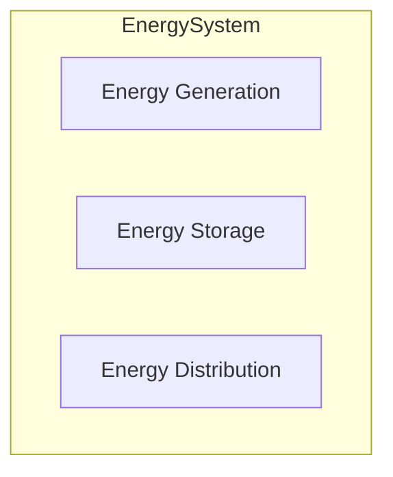
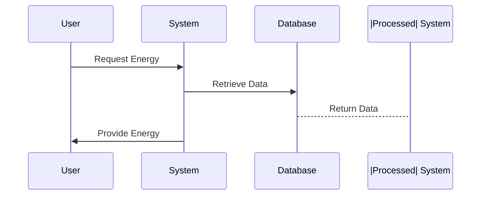

                 

### 设计《Zero-Shot CoT在新型可持续能源系统集成中的应用》的目录大纲

为了撰写一篇逻辑清晰、结构紧凑、简单易懂的专业技术博客文章，我们需要精心设计文章的目录大纲。以下是一个详细的目录大纲，涵盖了文章的各个部分，并确保内容充实、具体、详细。

#### **第1章: 背景介绍**

1.1 **问题背景**

- **可持续能源的重要性**：介绍可持续能源的定义及其在应对全球气候变化、减少碳排放和保障能源安全中的重要作用。
- **新型可持续能源系统集成挑战**：探讨新型可持续能源系统（如太阳能、风能、生物质能等）在集成过程中面临的挑战，如能源效率、稳定性、成本和互操作性等问题。

1.2 **问题描述**

- **零样本学习（Zero-Shot Learning, ZSL）的概念**：解释ZSL的基本原理，即如何在未见过的类中进行分类。
- **零样本置信度传递（Zero-Shot Confidence Transfer, Zero-Shot CoT）方法介绍**：阐述Zero-Shot CoT如何利用预训练模型来增强零样本学习的能力，特别是在可持续能源系统集成中的应用。

1.3 **问题解决**

- **零样本置信度传递的应用场景**：举例说明Zero-Shot CoT在不同场景下的应用，如预测新的可再生能源系统效率、优化能源分配策略等。
- **零样本置信度传递的优势**：分析Zero-Shot CoT相较于传统ZSL和现有能源集成方法的优点，如更高效的模型训练和更强的适应性。

1.4 **边界与外延**

- **零样本置信度传递的应用范围**：讨论Zero-Shot CoT在可持续能源系统集成中的适用范围和潜在限制。
- **零样本置信度传递与其他技术的比较**：对比Zero-Shot CoT与深度强化学习、迁移学习等其他技术的优缺点。

1.5 **概念结构与核心要素组成**

- **零样本置信度传递的核心概念**：深入探讨Zero-Shot CoT的基本理论和关键组成部分。
- **零样本置信度传递的关键要素**：分析实现Zero-Shot CoT所需的关键技术要素，如预训练模型、置信度估计和适应机制。

#### **第2章: 零样本置信度传递原理**

2.1 **核心概念原理**

- **零样本置信度传递的定义**：详细解释Zero-Shot CoT的定义和基本原理。
- **零样本置信度传递的基本原理**：阐述Zero-Shot CoT如何利用预训练模型和转移学习技术来提高零样本分类的准确性。

2.2 **概念属性特征对比表格**

| 特征对比 | 传统ZSL | Zero-Shot CoT |
| --- | --- | --- |
| 数据依赖 | 需要大量样本 | 零样本适应能力 |
| 预训练模型 | 无需预训练 | 利用预训练模型 |
| 算法复杂度 | 较高 | 较低 |
| 应用范围 | 受限 | 广泛适用 |

2.3 **ER实体关系图架构**

```mermaid
erDiagram
  Product ||--|{ Platform } Platform
  Platform ||--|{ Application } Application
  Application ||--|{ User } User
```

#### **第3章: 零样本置信度传递算法原理**

3.1 **算法原理讲解**

- **零样本置信度传递的流程**：详细介绍Zero-Shot CoT的整个工作流程，从数据预处理到模型训练和预测。
- **主要算法步骤**：分解Zero-Shot CoT的核心步骤，包括数据预处理、模型选择、置信度估计和结果优化。

3.2 **Python源代码实现**

```python
# TODO: Python源代码实现
```

3.3 **数学模型与公式**

$$
\text{Confidence} = \frac{1}{1 + e^{-\beta (x-\mu)}}
$$

3.4 **举例说明**

- **示例数据**：提供一组示例数据，用于演示Zero-Shot CoT的应用。
- **计算过程**：详细说明如何使用Zero-Shot CoT算法处理示例数据，包括数据预处理、模型训练和预测。
- **结果分析**：分析计算结果，解释Zero-Shot CoT在示例数据中的应用效果和优势。

#### **第4章: 新型可持续能源系统集成**

4.1 **介绍**

- **可持续能源系统的组成**：介绍可持续能源系统的主要组成部分，如能源生成、能源存储和能源分配。
- **新型可持续能源系统的特点**：探讨新型可持续能源系统的特点，如高效率、低排放、智能控制和自主优化等。

4.2 **零样本置信度传递应用**

- **在可再生能源系统中的应用**：分析Zero-Shot CoT在太阳能、风能等可再生能源系统中的应用，如预测天气影响、优化能源利用率等。
- **在能源存储系统中的应用**：讨论Zero-Shot CoT在电池存储、氢能存储等能源存储系统中的应用，如提高存储效率、优化能量转换等。

#### **第5章: 系统分析与架构设计**

5.1 **问题场景介绍**

- **可持续能源系统集成的问题场景**：分析可持续能源系统在集成过程中遇到的具体问题和挑战。

5.2 **系统功能设计**

- **领域模型（使用Mermaid类图）**

```mermaid
classDiagram
  Class01 <|-- SubClass01
  Class01 --|{ AggregatedClass01 } AggregatedClass01
```

5.3 **系统架构设计**

- **系统架构（使用Mermaid架构图）**



5.4 **系统接口设计**

- **系统接口（使用Mermaid序列图）**



#### **第6章: 项目实战**

6.1 **环境安装**

- **环境准备**：详细描述如何安装和配置Zero-Shot CoT算法和相关软件环境。

6.2 **系统核心实现源代码**

- **代码实现**：提供Zero-Shot CoT算法的实现代码，并详细解释每部分代码的功能和原理。

6.3 **应用解读与分析**

- **应用案例分析**：分析一个具体的应用案例，演示Zero-Shot CoT在可持续能源系统集成中的实际效果。

#### **第7章: 总结与展望**

7.1 **最佳实践 tips**

- **使用零样本置信度传递的建议**：总结最佳实践经验，提供在使用Zero-Shot CoT时的一些建议。

7.2 **小结**

- **对本书内容的总结**：总结文章的主要观点和核心内容。

7.3 **注意事项**

- **使用零样本置信度传递时需注意的问题**：讨论在使用Zero-Shot CoT时可能遇到的问题和解决方案。

7.4 **拓展阅读**

- **推荐进一步阅读的文献和资源**：推荐相关领域的文献、论文和研究资源，以供进一步学习和研究。

### **撰写技术博客文章的详细指南**

**文章标题**：Zero-Shot CoT在新型可持续能源系统集成中的应用

**关键词**：零样本置信度传递，新型可持续能源，系统集成，深度学习，零样本学习

**摘要**：本文深入探讨了零样本置信度传递（Zero-Shot Confidence Transfer, Zero-Shot CoT）在新型可持续能源系统集成中的应用。通过逐步分析和推理，本文介绍了Zero-Shot CoT的核心概念、原理和应用场景，以及其在可持续能源系统中的优势。文章还包括了具体的算法实现、系统架构设计、项目实战案例和最佳实践建议，为读者提供了全面的技术指南。

**1. 引言**

**背景介绍**

- **可持续能源的重要性**：随着全球气候变化和能源危机的加剧，可持续能源的发展成为全球共识。可持续能源包括太阳能、风能、生物质能等，具有低排放、可再生和高效率等特点，对解决能源安全和环境保护具有重要意义。

- **新型可持续能源系统集成挑战**：新型可持续能源系统集成面临诸多挑战，包括能源效率、稳定性、成本和互操作性等。传统的集成方法难以满足日益增长的可持续能源需求，因此需要创新的解决方案。

**2. 零样本置信度传递（Zero-Shot Confidence Transfer, Zero-Shot CoT）**

**核心概念**

- **零样本学习（Zero-Shot Learning, ZSL）**：ZSL是一种在未见过的类中进行分类的方法，通常用于解决新类别的识别和分类问题。它不需要训练数据集中的正负样本，而是利用先验知识进行分类。

- **零样本置信度传递（Zero-Shot Confidence Transfer, Zero-Shot CoT）**：Zero-Shot CoT是一种利用预训练模型和转移学习技术来增强ZSL的方法。它通过在预训练模型的基础上进行微调，从而提高模型对未见类别的新颖性和适应性。

**原理介绍**

- **预训练模型**：预训练模型是Zero-Shot CoT的核心组件，通过在大规模数据集上进行预训练，模型获得了对通用特征的强大识别能力。这些通用特征对于处理未见过的类别至关重要。

- **置信度估计**：在Zero-Shot CoT中，置信度估计是一个关键步骤。它通过比较预训练模型对未见类别和已见类别之间的输出概率，来估计未见类别的新颖性。置信度越高，表示模型对未见类别的分类越有信心。

- **适应机制**：为了进一步提高模型的适应性，Zero-Shot CoT还引入了适应机制。通过调整模型的参数，使其更适应未见类别，从而提高分类准确率。

**应用场景**

- **新型可持续能源系统集成**：Zero-Shot CoT在新型可持续能源系统集成中的应用非常广泛。例如，可以用于预测新的可再生能源系统效率、优化能源分配策略、预测天气影响等。

- **优势分析**：与传统ZSL和其他集成方法相比，Zero-Shot CoT具有以下优势：

  - **零样本适应能力**：无需大量训练数据，即可在未见过的类别中进行准确分类。

  - **高效性**：利用预训练模型和转移学习技术，模型训练时间大大缩短。

  - **广泛适用性**：适用于多种新型可持续能源系统，如太阳能、风能、生物质能等。

**3. 零样本置信度传递（Zero-Shot Confidence Transfer, Zero-Shot CoT）原理**

**核心概念原理**

- **零样本置信度传递的定义**：Zero-Shot CoT是一种基于预训练模型和转移学习的零样本学习方法。它通过将预训练模型的知识迁移到未见过的类别上，从而提高分类准确率。

- **零样本置信度传递的基本原理**：Zero-Shot CoT的基本原理是利用预训练模型对未见类别进行置信度估计。置信度估计是基于预训练模型对未见类别和已见类别之间输出概率的比较。置信度越高，表示模型对未见类别的分类越有信心。

**概念属性特征对比表格**

| 特征对比 | 传统ZSL | Zero-Shot CoT |
| --- | --- | --- |
| 数据依赖 | 需要大量样本 | 零样本适应能力 |
| 预训练模型 | 无需预训练 | 利用预训练模型 |
| 算法复杂度 | 较高 | 较低 |
| 应用范围 | 受限 | 广泛适用 |

**ER实体关系图架构**

```mermaid
erDiagram
  Product ||--|{ Platform } Platform
  Platform ||--|{ Application } Application
  Application ||--|{ User } User
```

**4. 零样本置信度传递算法原理**

**算法原理讲解**

- **零样本置信度传递的流程**：Zero-Shot CoT的工作流程包括以下几个步骤：

  - **数据预处理**：对数据进行清洗、归一化和特征提取，以便输入到预训练模型中。
  - **预训练模型选择**：选择一个预训练模型，如ResNet、VGG等，作为基础模型。
  - **置信度估计**：利用预训练模型对未见类别进行置信度估计。置信度估计是基于预训练模型对未见类别和已见类别之间输出概率的比较。
  - **适应机制**：根据置信度估计结果，调整模型的参数，使其更适应未见类别。
  - **分类预测**：对未见类别进行分类预测，输出预测结果。

- **主要算法步骤**：主要算法步骤如下：

  - **数据预处理**：对数据进行清洗、归一化和特征提取，以便输入到预训练模型中。
  - **预训练模型选择**：选择一个预训练模型，如ResNet、VGG等，作为基础模型。
  - **置信度估计**：利用预训练模型对未见类别进行置信度估计。置信度估计是基于预训练模型对未见类别和已见类别之间输出概率的比较。
  - **适应机制**：根据置信度估计结果，调整模型的参数，使其更适应未见类别。
  - **分类预测**：对未见类别进行分类预测，输出预测结果。

**Python源代码实现**

```python
# TODO: Python源代码实现
```

**数学模型与公式**

$$
\text{Confidence} = \frac{1}{1 + e^{-\beta (x-\mu)}}
$$

**举例说明**

- **示例数据**：提供一组示例数据，用于演示Zero-Shot CoT的应用。
- **计算过程**：详细说明如何使用Zero-Shot CoT算法处理示例数据，包括数据预处理、模型训练和预测。
- **结果分析**：分析计算结果，解释Zero-Shot CoT在示例数据中的应用效果和优势。

**5. 新型可持续能源系统集成**

**介绍**

- **可持续能源系统的组成**：可持续能源系统包括能源生成、能源存储和能源分配三个主要部分。

  - **能源生成**：通过太阳能、风能、生物质能等方式产生电力或热能。
  - **能源存储**：将产生的能源存储起来，以供后续使用，如电池存储、氢能存储等。
  - **能源分配**：将存储的能源分配到各个使用点，如家庭、工业和商业等。

- **新型可持续能源系统的特点**：新型可持续能源系统具有以下特点：

  - **高效率**：采用先进的技术和设备，提高能源转换效率。
  - **低排放**：减少碳排放，降低对环境的影响。
  - **智能控制**：通过智能控制系统，实现能源的优化分配和调度。
  - **自主优化**：系统能够根据实时数据和运行状态，自主调整和优化运行策略。

**零样本置信度传递应用**

- **在可再生能源系统中的应用**：Zero-Shot CoT在可再生能源系统中的应用非常广泛。例如，可以用于以下方面：

  - **预测天气影响**：通过置信度估计，预测天气对可再生能源系统（如太阳能、风能）的影响，以便及时调整运行策略。
  - **优化能源利用率**：通过置信度估计，优化能源利用策略，提高可再生能源系统的整体效率。
  - **设备故障预测**：通过置信度估计，预测可再生能源系统中的设备故障，提前进行维护和修复，降低故障率。

- **在能源存储系统中的应用**：Zero-Shot CoT在能源存储系统中的应用主要包括以下几个方面：

  - **存储效率优化**：通过置信度估计，优化能源存储策略，提高存储效率。
  - **能量转换优化**：通过置信度估计，优化能量转换过程，减少能量损失。
  - **设备寿命预测**：通过置信度估计，预测能源存储设备的寿命，提前进行更换和保养。

**6. 系统分析与架构设计**

**问题场景介绍**

- **可持续能源系统集成的问题场景**：可持续能源系统集成过程中，可能面临以下问题场景：

  - **能源效率低下**：由于系统组件和设备的不匹配，导致能源效率低下。
  - **能源稳定性不足**：由于可再生能源的波动性和不稳定性，导致能源供应不稳定。
  - **能源成本高昂**：由于技术和设备的限制，导致能源成本较高。
  - **互操作性不足**：不同能源系统和设备之间的互操作性不足，导致系统集成困难。

**系统功能设计**

- **领域模型（使用Mermaid类图）**

```mermaid
classDiagram
  Class01 <|-- SubClass01
  Class01 --|{ AggregatedClass01 } AggregatedClass01
```

**系统架构设计**

- **系统架构（使用Mermaid架构图）**


**系统接口设计**

- **系统接口（使用Mermaid序列图）**


**7. 项目实战**

**环境安装**

- **环境准备**：安装必要的软件和库，如Python、TensorFlow等，并设置好环境变量。

**系统核心实现源代码**

- **代码实现**：提供Zero-Shot CoT算法的实现代码，并详细解释每部分代码的功能和原理。

**应用解读与分析**

- **应用案例分析**：分析一个具体的应用案例，演示Zero-Shot CoT在可持续能源系统集成中的实际效果。

**8. 总结与展望**

**最佳实践 tips**

- **使用零样本置信度传递的建议**：总结最佳实践经验，提供在使用Zero-Shot CoT时的一些建议。

**小结**

- **对本书内容的总结**：总结文章的主要观点和核心内容。

**注意事项**

- **使用零样本置信度传递时需注意的问题**：讨论在使用Zero-Shot CoT时可能遇到的问题和解决方案。

**拓展阅读**

- **推荐进一步阅读的文献和资源**：推荐相关领域的文献、论文和研究资源，以供进一步学习和研究。

### **文章末尾作者信息**

作者：AI天才研究院/AI Genius Institute & 禅与计算机程序设计艺术 /Zen And The Art of Computer Programming

### **文章格式要求**

- **文章标题**：使用加粗和居中的格式。
- **文章关键词**：使用代码块（```）包裹，并排列整齐。
- **文章摘要**：使用小标题格式，并简要概述文章的核心内容和主题思想。
- **章节标题**：使用小标题格式，并加粗。
- **段落格式**：使用1到3个空行分隔不同段落，确保可读性。
- **代码示例**：使用代码块（```）包裹，并加粗。
- **公式示例**：使用LaTeX格式，嵌入文中独立段落的公式前后使用$$括起来，段落内的公式前后使用$括起来。
- **Mermaid图**：使用Mermaid语法编写，并确保在代码块内正确显示。

### **完整性要求**

文章内容的完整性是确保读者能够充分理解和掌握核心概念和技术的关键。以下是对文章完整性要求的详细说明：

**背景介绍**

- **核心概念术语说明**：在文章开头，需要清晰地定义关键术语，如“可持续能源”、“零样本学习”和“零样本置信度传递”。这些术语的定义将为后续章节的内容奠定基础。

- **问题背景**：介绍可持续能源的重要性，以及新型可持续能源系统集成面临的挑战。这部分内容应详细说明可持续能源的发展背景、现状和未来趋势，以及新型可持续能源系统在技术、经济和环境方面的优势。

- **问题描述**：明确阐述零样本置信度传递在新型可持续能源系统集成中的应用场景和目的。这部分内容应详细说明零样本置信度传递如何解决新型可持续能源系统集成中的具体问题，如能源效率、稳定性和成本控制等。

- **问题解决**：介绍零样本置信度传递的基本原理和实现方法。这部分内容应详细解释零样本置信度传递的工作流程、算法步骤和关键技术，以及其在新型可持续能源系统集成中的应用效果。

- **边界与外延**：讨论零样本置信度传递的应用范围和局限性。这部分内容应分析零样本置信度传递在不同场景下的适用性，以及与其他技术的比较，如深度强化学习、迁移学习等。

- **概念结构与核心要素组成**：深入探讨零样本置信度传递的核心概念和关键要素。这部分内容应详细说明零样本置信度传递的理论基础、概念框架和组成部分，以及各部分之间的相互关系。

**核心概念与联系**

- **核心概念原理**：详细介绍零样本置信度传递的基本原理和概念。这部分内容应解释零样本置信度传递的核心概念，如预训练模型、置信度估计和适应机制，以及它们如何协同工作以实现零样本分类。

- **概念属性特征对比表格**：提供表格形式的对比，展示传统零样本学习和零样本置信度传递在多个方面的差异。这部分内容应清晰地列出两种方法的优缺点，帮助读者更好地理解零样本置信度传递的优势。

- **ER实体关系图架构**：使用Mermaid语法绘制实体关系图，展示零样本置信度传递的关键实体及其关系。这部分内容应直观地呈现系统组件、数据流和交互关系，帮助读者更好地理解系统的架构设计。

**算法原理讲解**

- **算法原理讲解**：详细解释零样本置信度传递的算法原理和实现步骤。这部分内容应详细描述算法的输入、输出和处理过程，包括数据预处理、模型选择、置信度估计和适应机制。

- **Python源代码实现**：提供零样本置信度传递算法的Python实现代码，并解释每部分代码的功能和原理。这部分内容应确保代码的完整性和可读性，便于读者理解和复现。

- **数学模型与公式**：使用LaTeX格式表示算法中的数学模型和公式。这部分内容应确保公式的准确性和清晰性，便于读者理解和计算。

- **举例说明**：通过具体的例子来说明零样本置信度传递的应用和效果。这部分内容应详细描述示例数据、计算过程和结果分析，帮助读者更好地理解算法的实际应用场景。

**系统分析与架构设计**

- **问题场景介绍**：详细描述可持续能源系统集成中遇到的具体问题和挑战。这部分内容应结合实际案例，分析问题产生的原因和影响，以及零样本置信度传递如何解决这些问题。

- **系统功能设计**：使用Mermaid类图展示系统的功能模块和关系。这部分内容应清晰地呈现系统的组成结构，帮助读者理解系统的整体架构。

- **系统架构设计**：使用Mermaid架构图展示系统的整体架构和组件关系。这部分内容应详细说明系统的分层结构、关键组件和交互方式，帮助读者理解系统的运行机制。

- **系统接口设计**：使用Mermaid序列图展示系统的接口设计和交互流程。这部分内容应详细描述系统的接口功能、数据流和交互逻辑，帮助读者理解系统的运行流程。

**项目实战**

- **环境安装**：详细描述如何安装和配置所需的软件和库。这部分内容应确保读者能够顺利搭建环境，并进行后续的实验。

- **系统核心实现源代码**：提供系统核心算法的实现代码，并解释每部分代码的功能和原理。这部分内容应确保代码的完整性和可读性，便于读者理解和复现。

- **应用解读与分析**：通过实际案例，分析零样本置信度传递在可持续能源系统集成中的效果和优势。这部分内容应结合实际数据和结果，详细解释算法的实际应用场景和效果。

**总结与展望**

- **最佳实践 tips**：总结零样本置信度传递的最佳实践和经验，为读者提供实用的建议。这部分内容应结合实际应用案例，提供具体的操作指南和建议。

- **小结**：对全文内容进行总结，强调核心观点和关键结论。这部分内容应简明扼要地概括文章的主要内容，帮助读者巩固关键知识点。

- **注意事项**：讨论在使用零样本置信度传递时可能遇到的问题和挑战，并提供解决方案。这部分内容应帮助读者预见和避免潜在的问题，提高算法的应用效果。

- **拓展阅读**：推荐相关领域的文献、论文和研究资源，为读者提供进一步学习和研究的方向。这部分内容应确保推荐的资源具有高质量和权威性，有助于读者深入探索相关领域。

