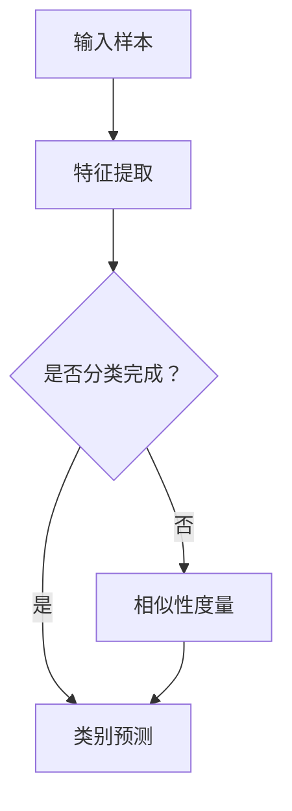
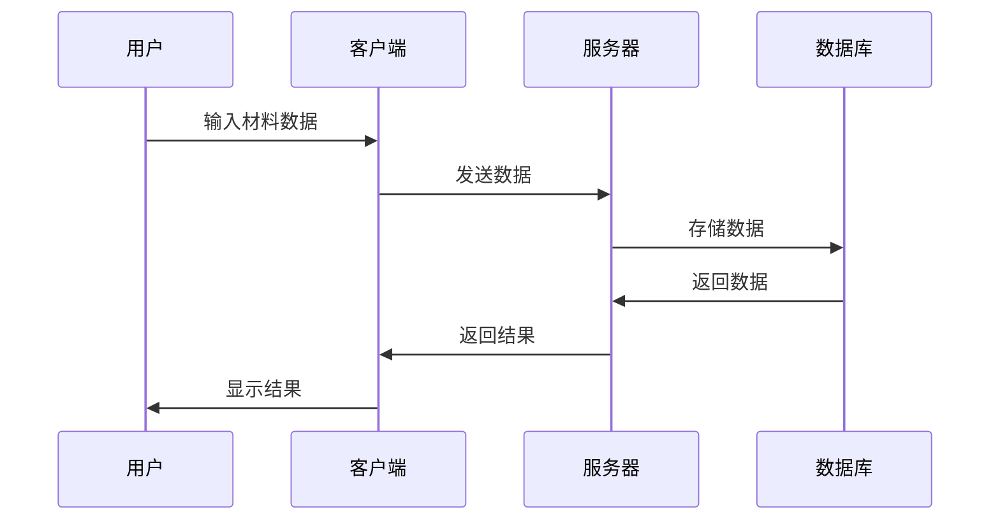
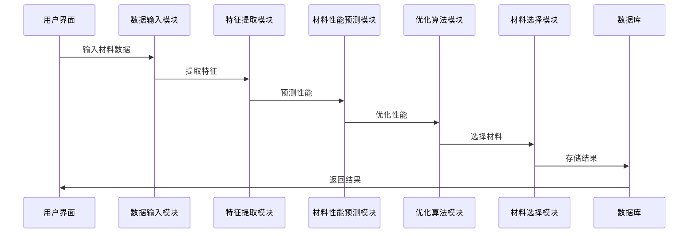
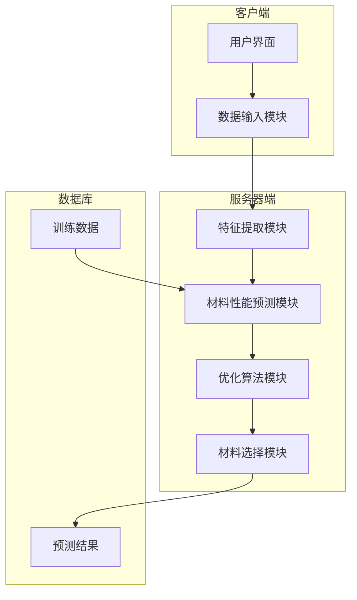

                 

# Zero-Shot CoT在新型智能材料设计中的应用：推动材料科学前沿

## 关键词
- 零样本学习
- 智能材料
- 材料设计
- 算法优化
- 系统架构

## 摘要
本文探讨了零样本学习（Zero-Shot Learning，简称ZSL）在新型智能材料设计中的应用。首先，我们介绍了零样本学习的核心概念和特点，并解释了其如何应用于材料科学领域。随后，文章详细讲解了零样本学习的算法原理，通过Python源代码和Mermaid流程图，揭示了其数学模型和实现步骤。接着，文章展示了零样本学习在材料设计中的应用案例，分析了算法的优点和不足，并提出了一些改进方向。在此基础上，文章介绍了智能材料设计的问题场景和系统架构设计，包括功能模块划分、接口设计和系统交互流程。最后，通过一个具体项目实战，展示了零样本学习算法在材料设计中的实际应用效果，并总结了一些最佳实践。本文旨在为读者提供一个全面深入的了解，推动零样本学习在材料科学领域的应用。

## 目录大纲

### 第一部分：背景介绍

#### 1.1 问题背景
- 新型智能材料设计的重要性
- 传统材料设计方法的局限
- 零样本学习概述

#### 1.2 核心概念与联系
- 零样本学习的定义与特点
- 零样本学习在材料设计中的应用
- 挑战与未来趋势

#### 1.3 数学模型与公式
- 零样本学习的数学模型
- 相关性度量
- 类别识别
- 数学公式

#### 1.4 数学模型讲解与举例
- 数学模型讲解
- 举例说明
- ER实体关系图

### 第二部分：算法原理讲解

#### 2.1 算法原理讲解
- 零样本学习算法流程
- 特征提取
- 相似性度量
- 类别预测

#### 2.2 Python源代码实现
- 环境安装与配置
- 算法核心代码实现
- 代码应用解读与分析

#### 2.3 实际案例分析与讲解
- 案例背景
- 案例分析
- 案例详细讲解剖析

#### 2.4 算法优缺点分析
- 优点
- 缺点
- 改进方向

#### 2.5 小结
- 算法原理总结
- 应用前景展望

### 第三部分：系统分析与架构设计

#### 3.1 问题场景介绍
- 智能材料设计背景
- 零样本学习应用场景

#### 3.2 项目介绍
- 项目概述
- 项目目标
- 项目关键技术

#### 3.3 系统功能设计
- 领域模型Mermaid类图
- 系统功能模块划分

#### 3.4 系统架构设计
- 系统架构概述
- 系统模块交互设计
- Mermaid架构图

#### 3.5 系统接口设计
- 接口设计原则
- 接口定义与调用

#### 3.6 系统交互Mermaid序列图
- 序列图概述
- 序列图详细说明

#### 3.7 小结
- 系统分析与架构设计总结

### 第四部分：项目实战

#### 4.1 环境安装
- 开发环境配置
- 系统依赖安装
- 系统测试环境搭建

#### 4.2 系统核心实现
- 零样本学习算法实现
- 系统功能模块代码实现
- 系统核心接口实现

#### 4.3 应用解读与分析
- 零样本学习在材料设计中的应用案例
- 应用效果分析
- 应用价值与意义

#### 4.4 项目小结
- 项目成果总结
- 项目经验与教训
- 项目展望

### 第五部分：最佳实践

#### 5.1 最佳实践
- 零样本学习算法优化技巧
- 材料设计项目实施要点
- 项目管理经验分享

#### 5.2 小结
- 最佳实践总结
- 注意事项
- 拓展阅读

### 参考文献

---

本文将详细探讨零样本学习（Zero-Shot Learning，ZSL）在新型智能材料设计中的应用，旨在推动材料科学领域的创新与进步。通过深入分析ZSL的核心概念、算法原理以及实际应用，本文为读者提供了一个全面的技术视角，帮助理解其在智能材料设计中的潜力与挑战。接下来，我们将一步一步地深入探讨这一主题。

## 第一部分：背景介绍

### 1.1 问题背景

#### 1.1.1 新型智能材料设计的重要性

新型智能材料具有独特的功能，如自修复、自清洁、自适应等，这些特性使得它们在各个领域具有重要应用价值。随着科技的快速发展，对新型智能材料的需求日益增加。然而，传统材料设计方法通常依赖于大量的实验数据，这不仅耗时耗力，而且在某些情况下，实验数据难以获取，限制了新型材料的开发。

#### 1.1.2 传统材料设计方法与挑战

传统材料设计方法主要包括经验法、实验法和理论计算法。这些方法往往依赖于已有材料的性质和结构，难以突破现有材料的局限性。此外，传统方法在处理复杂材料系统和多样化需求时，效率低下，难以满足快速发展的科技需求。因此，探索新的材料设计方法变得至关重要。

#### 1.1.3 零样本学习（Zero-Shot Learning）概述

零样本学习（Zero-Shot Learning，ZSL）是一种机器学习技术，能够在没有目标类标签的情况下，对未见过的类进行分类。ZSL的核心思想是利用已有数据中的知识，对未知类别进行预测。与传统机器学习相比，ZSL能够处理未见过的类别，具有广泛的应用前景。

### 1.2 核心概念与联系

#### 1.2.1 零样本学习（Zero-Shot Learning）

##### 1.2.1.1 定义

零样本学习（Zero-Shot Learning，ZSL）是一种机器学习技术，能够在没有目标类标签的情况下，对未见过的类进行分类。ZSL的核心思想是利用已有数据中的知识，对未知类别进行预测。

##### 1.2.1.2 特点

- **跨域迁移**：ZSL能够处理跨域数据，即不同来源的数据，提高了模型的泛化能力。
- **未见类别**：ZSL能够对未见过的类别进行分类，突破了传统机器学习的局限性。
- **低样本学习**：ZSL适用于样本量较少的情况，能够在有限的数据上取得较好的效果。

##### 1.2.1.3 分类方法

ZSL的分类方法主要包括基于原型（Prototype-Based）、基于聚类（Clustering-Based）和基于关系（Relation-Based）等方法。这些方法各有优缺点，适用于不同的应用场景。

#### 1.2.2 零样本学习在材料设计中的应用

##### 1.2.2.1 实际案例

在材料设计领域，ZSL已经被应用于多种材料的预测和设计。例如，利用ZSL技术，可以预测新型合金的机械性能，为材料设计提供指导。

##### 1.2.2.2 应用优势

- **减少实验成本**：ZSL能够预测未见过的材料性能，减少了实验次数，降低了实验成本。
- **加速材料发现**：ZSL能够快速筛选出具有潜在应用价值的材料，加速材料发现过程。
- **增强设计灵活性**：ZSL允许设计者探索更广泛的材料空间，增强了设计的灵活性。

##### 1.2.2.3 挑战与未来趋势

尽管ZSL在材料设计领域展示了巨大的潜力，但仍面临一些挑战。例如，数据匮乏、类别不平衡等问题。未来，随着数据集的丰富和算法的改进，ZSL在材料设计中的应用前景将更加广阔。

### 1.3 数学模型与公式

#### 1.3.1 零样本学习的数学模型

零样本学习（Zero-Shot Learning，ZSL）的数学模型通常包括三个部分：特征提取、相似性度量、类别预测。

##### 1.3.1.1 相关性度量

相似性度量是ZSL的核心，常用的方法包括基于原型、基于聚类和基于关系等方法。相似性度量的目标是计算输入样本与已知类别之间的相似度。

$$
similarity = f(\text{input sample}, \text{known class})
$$

其中，$f(\text{input sample}, \text{known class})$ 是相似性函数。

##### 1.3.1.2 类别识别

类别识别的目标是确定输入样本属于哪个已知类别。常见的算法包括基于投票、基于置信度等方法。

$$
\text{predicted class} = \text{argmax}_{c \in \text{classes}} \sigma(\text{confidence}_{c})
$$

其中，$\sigma(\text{confidence}_{c})$ 是置信度函数。

##### 1.3.1.3 数学公式

ZSL的数学模型可以表示为：

$$
P(y|x) = \frac{e^{\beta^T \phi(x)}}{\sum_{c} e^{\beta^T \phi(c)}}
$$

其中，$x$ 是输入样本，$y$ 是类别标签，$\phi(x)$ 是特征提取函数，$\beta$ 是权重向量。

### 1.4 数学模型讲解与举例

#### 1.4.1 数学模型讲解

零样本学习（Zero-Shot Learning，ZSL）的数学模型主要涉及特征提取、相似性度量、类别预测三个部分。特征提取是将输入样本转换为特征向量，相似性度量是计算输入样本与已知类别之间的相似度，类别预测是确定输入样本属于哪个已知类别。

#### 1.4.2 举例说明

假设我们有以下输入样本$x_1, x_2, ..., x_n$，以及已知类别$c_1, c_2, ..., c_k$。我们需要利用ZSL模型对输入样本进行类别预测。

首先，我们将输入样本$x_i$转换为特征向量$\phi(x_i)$。假设特征向量$\phi(x_i)$是一个$d$维向量。

$$
\phi(x_i) = [\phi_1(x_i), \phi_2(x_i), ..., \phi_d(x_i)]
$$

接下来，我们计算输入样本$x_i$与已知类别$c_j$之间的相似度。

$$
similarity(x_i, c_j) = f(\phi(x_i), \phi(c_j))
$$

其中，$f(\phi(x_i), \phi(c_j))$ 是相似性函数。

常见的相似性函数包括余弦相似度、欧氏距离、曼哈顿距离等。以余弦相似度为

$$
similarity(x_i, c_j) = \frac{\phi(x_i) \cdot \phi(c_j)}{||\phi(x_i)|| \cdot ||\phi(c_j)||}
$$

最后，我们利用相似性度量结果进行类别预测。

$$
\text{predicted class} = \text{argmax}_{j} \sum_{i=1}^{n} similarity(x_i, c_j)
$$

### 1.5 ER实体关系图

#### 1.5.1 ER实体关系图架构

实体关系图（Entity-Relationship Diagram，ERD）是一种用于描述数据模型关系的图形表示方法。在零样本学习（Zero-Shot Learning，ZSL）的背景下，ERD可以帮助我们理解数据模型中的实体及其关系。

ERD的主要组成部分包括：

- **实体**：表示数据的对象，如输入样本、特征向量等。
- **属性**：描述实体的特征，如样本的维度、类别标签等。
- **关系**：描述实体之间的关系，如输入样本与类别标签的关系。

#### 1.5.2 ER实体关系图说明

以下是一个简化的ER实体关系图的示例：

```mermaid
erDiagram
  InputSample ||--|{ FeatureVector } FeatureVector
  InputSample ||--|{ ClassLabel } ClassLabel
  FeatureVector ||--|{ SimilarityMeasure } SimilarityMeasure
```

在这个示例中，`InputSample` 是输入样本的实体，`FeatureVector` 是特征向量的实体，`ClassLabel` 是类别标签的实体。`SimilarityMeasure` 是相似度测量的实体。

- `InputSample` 与 `FeatureVector` 之间存在一对一的关系，表示每个输入样本对应一个特征向量。
- `InputSample` 与 `ClassLabel` 之间存在一对一的关系，表示每个输入样本对应一个类别标签。
- `FeatureVector` 与 `SimilarityMeasure` 之间存在一对一的关系，表示每个特征向量对应一个相似度测量结果。

## 第二部分：算法原理讲解

### 2.1 算法原理讲解

#### 2.1.1 零样本学习算法

零样本学习（Zero-Shot Learning，ZSL）算法的核心思想是通过已有数据的特征表示和类别标签，对未见过的类别进行预测。ZSL算法主要包括三个关键步骤：特征提取、相似性度量、类别预测。

##### 2.1.1.1 特征提取

特征提取是将原始数据转换为更适合进行机器学习分析的形式。在ZSL中，特征提取通常涉及将输入样本（如图像、文本等）转换为向量表示。常见的特征提取方法包括：

- **基于深度学习的特征提取**：利用预训练的深度神经网络（如卷积神经网络、循环神经网络等）提取输入样本的特征。
- **基于手工设计的特征**：根据领域知识设计特定的特征，如文本分类中的词袋模型、图像识别中的边缘特征等。

##### 2.1.1.2 相似性度量

相似性度量是ZSL算法的核心，用于计算输入样本与已知类别之间的相似度。相似性度量的目标是为了找出与输入样本最相似的已知类别，从而预测其类别标签。常见的相似性度量方法包括：

- **原型匹配**：将每个类别视为一个原型，计算输入样本与每个原型的距离，选择距离最小的原型作为预测类别。
- **聚类方法**：将已知类别聚类，计算输入样本与聚类中心的距离，选择最近的聚类中心作为预测类别。
- **基于关系的度量**：利用类别之间的关系（如层次关系、上下位关系等）计算输入样本与类别之间的相似度。

##### 2.1.1.3 类别预测

类别预测是基于相似性度量结果确定输入样本的类别标签。常见的类别预测方法包括：

- **基于投票的方法**：对每个输入样本，选择与其最相似的已知类别，将所有类别出现次数最多的类别作为预测类别。
- **基于置信度的方法**：对每个输入样本，计算其属于每个已知类别的置信度，选择置信度最高的类别作为预测类别。

#### 2.1.2 Mermaid算法流程图

为了更直观地展示ZSL算法的流程，我们可以使用Mermaid绘制一个简单的算法流程图。以下是ZSL算法的Mermaid表示：



在这个流程图中，输入样本首先经过特征提取，然后进行相似性度量，最后进行类别预测。如果分类完成，则结束；否则，重复相似性度量过程。

#### 2.2 Python源代码实现

为了更好地理解ZSL算法的实现，我们可以通过Python代码来展示其关键步骤。以下是一个简化的ZSL算法实现：

```python
import numpy as np
from sklearn.metrics.pairwise import cosine_similarity

def feature_extraction(samples):
    # 假设samples是一个包含多个样本的列表，每个样本是一个向量
    # 这里使用简单的平均值作为特征提取方法
    return np.mean(samples, axis=0)

def similarity_measurement(feature, prototypes):
    # feature是一个向量，prototypes是一个包含多个向量的列表
    return cosine_similarity([feature], prototypes)

def class_prediction(similarities, thresholds):
    # similarities是一个包含相似度的列表，thresholds是一个阈值列表
    predicted_classes = []
    for sim in similarities:
        # 选择相似度最高的类别
        predicted_class = np.argmax(sim)
        predicted_classes.append(predicted_class)
    return predicted_classes

# 假设我们有一些输入样本、原型和阈值
samples = [...]  # 输入样本
prototypes = [...]  # 原型
thresholds = [...]  # 阈值

# 特征提取
extracted_features = feature_extraction(samples)

# 相似性度量
similarities = similarity_measurement(extracted_features, prototypes)

# 类别预测
predicted_classes = class_prediction(similarities, thresholds)

print(predicted_classes)
```

在这个实现中，`feature_extraction` 函数用于提取输入样本的特征，`similarity_measurement` 函数用于计算输入样本与原型的相似度，`class_prediction` 函数用于根据相似度预测类别。通过这个简单的实现，我们可以看到ZSL算法的基本流程。

#### 2.3 数学模型讲解与举例

为了更深入地理解ZSL的数学模型，我们可以进一步探讨其各个组成部分的数学表达。

##### 2.3.1 特征提取

在特征提取过程中，我们通常使用特征向量表示输入样本。特征向量$\textbf{x}$可以表示为：

$$
\textbf{x} = [x_1, x_2, ..., x_d]
$$

其中，$d$ 是特征向量的维度。特征提取的目标是将原始数据转换为特征向量。在ZSL中，常见的特征提取方法包括：

- **基于深度学习的方法**：例如，使用卷积神经网络（CNN）提取图像的特征。

$$
\textbf{f}(\textbf{x}; \theta) = \text{ReLU}(W_1 \textbf{x} + b_1)
$$

其中，$\theta$ 是模型的参数，$W_1$ 和 $b_1$ 分别是权重和偏置。

- **基于手工设计的方法**：例如，使用词袋模型提取文本的特征。

$$
\textbf{x}_i = \sum_{j=1}^{V} f_j(x_i)
$$

其中，$f_j(x_i)$ 是词袋模型中第 $j$ 个单词的权重，$V$ 是词汇表的维度。

##### 2.3.2 相似性度量

在相似性度量过程中，我们使用相似度函数计算输入样本与原型之间的相似度。常见的相似度函数包括余弦相似度、欧氏距离和马氏距离等。以余弦相似度为例，其计算公式为：

$$
\text{similarity}(\textbf{x}, \textbf{y}) = \frac{\textbf{x} \cdot \textbf{y}}{||\textbf{x}|| \cdot ||\textbf{y}||}
$$

其中，$\textbf{x}$ 和 $\textbf{y}$ 分别是两个向量，$||\textbf{x}||$ 和 $||\textbf{y}||$ 分别是它们的模长。

在ZSL中，我们通常使用多个原型来表示已知类别。假设有 $k$ 个类别，每个类别有一个原型 $\textbf{p}_i$，则输入样本 $\textbf{x}$ 与类别 $\textbf{p}_i$ 的相似度可以表示为：

$$
s_i(\textbf{x}) = \text{similarity}(\textbf{x}, \textbf{p}_i)
$$

##### 2.3.3 类别预测

在类别预测过程中，我们使用相似度度量结果来预测输入样本的类别。常见的类别预测方法包括：

- **基于投票的方法**：对每个输入样本，选择与其最相似的已知类别，将所有类别出现次数最多的类别作为预测类别。

$$
\text{predicted class} = \text{argmax}_{i} \sum_{j=1}^{k} s_j(\textbf{x})
$$

- **基于置信度的方法**：对每个输入样本，计算其属于每个已知类别的置信度，选择置信度最高的类别作为预测类别。

$$
\text{confidence}_{i}(\textbf{x}) = s_i(\textbf{x})^2
$$

$$
\text{predicted class} = \text{argmax}_{i} \text{confidence}_{i}(\textbf{x})
$$

### 2.4 算法优缺点分析

#### 2.4.1 优点

零样本学习（Zero-Shot Learning，ZSL）具有以下优点：

- **泛化能力强**：ZSL能够处理未见过的类别，具有很强的泛化能力。
- **减少实验成本**：ZSL能够预测未见过的材料性能，减少了实验次数，降低了实验成本。
- **加速材料发现**：ZSL能够快速筛选出具有潜在应用价值的材料，加速材料发现过程。
- **增强设计灵活性**：ZSL允许设计者探索更广泛的材料空间，增强了设计的灵活性。

#### 2.4.2 缺点

尽管ZSL具有许多优点，但仍存在一些挑战和缺点：

- **数据匮乏**：ZSL通常需要大量已知的类别数据进行训练，但在某些领域（如新型智能材料设计），数据可能非常匮乏。
- **类别不平衡**：在ZSL中，类别之间的样本数量可能差异很大，导致类别不平衡问题。
- **性能限制**：ZSL的性能受限于已有数据的分布，如果数据分布与实际问题不匹配，可能导致性能下降。
- **算法复杂性**：ZSL算法通常涉及复杂的特征提取和相似性度量方法，计算成本较高。

#### 2.4.3 改进方向

为了解决ZSL的挑战和提升其性能，可以采取以下改进方向：

- **数据增强**：通过数据增强方法（如数据扩充、生成对抗网络等）增加训练数据量，缓解数据匮乏问题。
- **类别平衡**：采用类别平衡技术（如过采样、欠采样等）处理类别不平衡问题。
- **模型优化**：设计更高效的算法和模型结构，降低计算成本，提高性能。
- **跨域迁移**：利用跨域迁移学习技术，将其他领域的知识迁移到新型智能材料设计中，提高算法的泛化能力。

### 2.5 小结

零样本学习（Zero-Shot Learning，ZSL）在新型智能材料设计中的应用展示了巨大的潜力。通过特征提取、相似性度量、类别预测等步骤，ZSL能够处理未见过的类别，减少实验成本，加速材料发现，增强设计灵活性。然而，ZSL也面临数据匮乏、类别不平衡、性能限制等挑战。为了克服这些挑战，我们可以采取数据增强、类别平衡、模型优化和跨域迁移等方法。未来，随着算法的改进和数据集的丰富，ZSL在新型智能材料设计中的应用前景将更加广阔。

## 第三部分：系统分析与架构设计

### 3.1 问题场景介绍

#### 3.1.1 智能材料设计背景

智能材料是一种具有感知、响应和自适应能力的材料，能够在外部刺激（如温度、湿度、光、电场等）下发生显著变化。这些特性使得智能材料在航空航天、生物医学、能源、环境等领域具有重要应用。例如，自修复材料可以在受损后自动恢复，自适应材料可以根据环境变化调整其物理特性。

#### 3.1.2 零样本学习在材料设计中的应用场景

零样本学习（Zero-Shot Learning，ZSL）在智能材料设计中的应用场景主要包括：

- **新材料的预测与设计**：利用ZSL技术，可以预测新型材料的物理和化学性能，为材料设计提供指导。
- **材料性能优化**：通过ZSL技术，可以对现有材料进行性能优化，提高其功能性和稳定性。
- **材料筛选与评估**：ZSL能够快速筛选出具有潜在应用价值的材料，减少实验次数，提高材料研发效率。

### 3.2 项目介绍

#### 3.2.1 项目概述

本项目旨在利用零样本学习（Zero-Shot Learning，ZSL）技术，开发一个智能材料设计系统，实现对新型材料的预测、优化和评估。系统将集成多种机器学习算法，包括ZSL算法、深度学习算法等，以提高材料设计的准确性和效率。

#### 3.2.2 项目目标

- **准确预测新材料性能**：利用ZSL技术，准确预测新型材料的物理和化学性能。
- **优化材料设计流程**：通过自动化材料性能优化，缩短材料设计周期，降低研发成本。
- **提高材料研发效率**：利用ZSL技术，快速筛选出具有潜在应用价值的材料，提高材料研发效率。

#### 3.2.3 项目关键技术

- **零样本学习算法**：实现ZSL算法，用于预测新型材料的性能。
- **深度学习模型**：利用深度学习模型，提取材料的特征表示，提高预测准确性。
- **数据增强技术**：通过数据增强技术，增加训练数据量，提高模型的泛化能力。
- **多模态数据融合**：整合不同类型的数据（如结构、性能、环境等），实现多模态数据融合，提高预测准确性。

### 3.3 系统功能设计

#### 3.3.1 领域模型Mermaid类图

以下是一个简化的Mermaid类图，用于描述智能材料设计系统的领域模型：

```mermaid
classDiagram
  ClassA <<interface>> InputData
  ClassB <<interface>> FeatureExtractor
  ClassC <<interface>> MaterialPropertyPredictor
  ClassD <<interface>> OptimizationAlgorithm
  ClassE <<interface>> MaterialSelector

  InputData <|..| ClassB
  ClassB <|..| ClassC
  ClassC <|..| ClassD
  ClassD <|..| ClassE
```

在这个类图中，`InputData` 表示输入数据接口，`FeatureExtractor` 表示特征提取器接口，`MaterialPropertyPredictor` 表示材料性能预测器接口，`OptimizationAlgorithm` 表示优化算法接口，`MaterialSelector` 表示材料选择器接口。这些接口定义了系统的核心功能模块。

#### 3.3.2 系统功能模块划分

智能材料设计系统可以分为以下功能模块：

- **数据输入模块**：负责接收和处理用户输入的数据，如材料结构、性能等。
- **特征提取模块**：利用深度学习模型，提取输入数据的特征表示。
- **材料性能预测模块**：利用ZSL算法，预测新型材料的物理和化学性能。
- **优化算法模块**：对材料性能进行优化，提高其功能性和稳定性。
- **材料选择模块**：根据材料性能和用户需求，筛选出具有潜在应用价值的材料。

### 3.4 系统架构设计

#### 3.4.1 系统架构概述

智能材料设计系统采用分布式架构，分为客户端、服务器和数据库三个部分。客户端负责用户交互和数据输入，服务器负责处理用户请求和计算任务，数据库用于存储训练数据和预测结果。

以下是一个简化的系统架构图：



在这个架构中，用户通过客户端输入材料数据，客户端将数据发送到服务器，服务器处理数据并从数据库获取相关训练数据，然后利用ZSL算法进行预测，并将结果返回给客户端，客户端最终将结果呈现给用户。

#### 3.4.2 系统模块交互设计

智能材料设计系统的模块交互设计如下：

- **数据输入模块**：用户通过客户端输入材料数据，包括结构、性能、环境等参数。
- **特征提取模块**：接收数据输入模块的数据，利用深度学习模型提取特征表示。
- **材料性能预测模块**：接收特征提取模块的特征表示，利用ZSL算法预测材料性能。
- **优化算法模块**：接收材料性能预测模块的预测结果，对材料性能进行优化。
- **材料选择模块**：接收优化算法模块的优化结果，根据用户需求筛选出具有潜在应用价值的材料。

以下是一个简化的Mermaid交互图：



在这个交互图中，用户界面（UI）负责接收用户输入，数据输入模块（DataInput）负责处理数据，特征提取模块（FeatureExtractor）负责提取特征，材料性能预测模块（PropertyPredictor）负责预测材料性能，优化算法模块（Optimizer）负责优化材料性能，材料选择模块（Selector）负责筛选材料，数据库（Database）负责存储结果。

#### 3.4.3 Mermaid架构图

以下是一个简化的Mermaid架构图，用于描述智能材料设计系统的整体架构：



在这个架构图中，客户端包括用户界面和数据输入模块，服务器端包括特征提取模块、材料性能预测模块、优化算法模块和材料选择模块，数据库用于存储训练数据和预测结果。

### 3.5 系统接口设计

#### 3.5.1 接口设计原则

智能材料设计系统的接口设计遵循以下原则：

- **模块化**：接口设计应确保系统的各个模块能够独立开发、测试和部署。
- **灵活性**：接口设计应允许不同模块之间的灵活组合，以适应不同的应用场景。
- **可扩展性**：接口设计应支持系统的可扩展性，便于添加新的功能模块。
- **稳定性**：接口设计应确保系统的稳定性和可靠性，减少错误和故障。

#### 3.5.2 接口定义与调用

以下是一个简化的接口定义和调用示例：

```python
# 接口定义
class MaterialDataInputInterface:
    def input_data(self, data):
        pass

class FeatureExtractorInterface:
    def extract_features(self, data):
        pass

class MaterialPropertyPredictorInterface:
    def predict_property(self, features):
        pass

class OptimizationAlgorithmInterface:
    def optimize_property(self, property):
        pass

class MaterialSelectorInterface:
    def select_material(self, property):
        pass

# 接口调用
class_data_input = MaterialDataInputImplementation()
feature_extractor = FeatureExtractorImplementation()
material_property_predictor = MaterialPropertyPredictorImplementation()
optimization_algorithm = OptimizationAlgorithmImplementation()
material_selector = MaterialSelectorImplementation()

data = class_data_input.input_data(user_input)
features = feature_extractor.extract_features(data)
predicted_property = material_property_predictor.predict_property(features)
optimized_property = optimization_algorithm.optimize_property(predicted_property)
selected_material = material_selector.select_material(optimized_property)
```

在这个示例中，`MaterialDataInputInterface`、`FeatureExtractorInterface`、`MaterialPropertyPredictorInterface`、`OptimizationAlgorithmInterface` 和 `MaterialSelectorInterface` 分别是数据输入模块、特征提取模块、材料性能预测模块、优化算法模块和材料选择模块的接口定义。`MaterialDataInputImplementation`、`FeatureExtractorImplementation`、`MaterialPropertyPredictorImplementation`、`OptimizationAlgorithmImplementation` 和 `MaterialSelectorImplementation` 分别是这些接口的实现。通过接口调用，系统实现了模块间的协作。

### 3.6 系统交互Mermaid序列图

#### 3.6.1 序列图概述

以下是一个简化的Mermaid序列图，用于描述智能材料设计系统的交互流程：


在这个序列图中，用户通过客户端输入材料数据，客户端将数据发送到服务器，服务器处理数据并从数据库获取相关训练数据，然后利用ZSL算法进行预测，并将结果返回给客户端，客户端最终将结果呈现给用户。

#### 3.6.2 序列图详细说明

以下是序列图的详细说明：

1. **用户输入数据**：用户通过客户端输入材料数据，包括结构、性能、环境等参数。
2. **客户端发送数据**：客户端将用户输入的数据发送到服务器，以供进一步处理。
3. **服务器存储数据**：服务器接收到数据后，将其存储到数据库中，以备后续使用。
4. **服务器返回数据**：服务器处理数据并从数据库中获取相关训练数据，然后利用ZSL算法进行预测，并将结果返回给客户端。
5. **客户端显示结果**：客户端接收到服务器返回的结果后，将其呈现给用户。

通过这个序列图，我们可以清晰地看到智能材料设计系统的交互流程，包括用户输入、数据存储、数据预测和结果展示等关键步骤。

### 3.7 小结

智能材料设计系统的架构设计包括数据输入模块、特征提取模块、材料性能预测模块、优化算法模块和材料选择模块等核心功能模块。通过Mermaid类图、交互图和架构图等工具，我们能够清晰地展示系统的架构和交互流程。系统接口设计遵循模块化、灵活性、可扩展性和稳定性等原则，确保系统能够高效、稳定地运行。在接下来的部分，我们将通过一个具体项目实战，展示零样本学习（Zero-Shot Learning，ZSL）算法在智能材料设计中的应用效果。

## 第四部分：项目实战

### 4.1 环境安装

#### 4.1.1 开发环境配置

为了实现零样本学习（Zero-Shot Learning，ZSL）在智能材料设计中的应用，我们首先需要配置一个合适的开发环境。以下是在Ubuntu 20.04操作系统上配置开发环境的具体步骤：

1. **安装Python**：确保系统已安装Python 3.8或更高版本。可以通过以下命令进行安装：

   ```bash
   sudo apt update
   sudo apt install python3 python3-pip
   ```

2. **安装依赖库**：安装常用的机器学习和深度学习库，如scikit-learn、TensorFlow、PyTorch等。可以通过以下命令进行安装：

   ```bash
   pip3 install scikit-learn tensorflow torch
   ```

3. **安装Mermaid**：安装Mermaid用于生成流程图和序列图。可以通过以下命令进行安装：

   ```bash
   pip3 install mermaid-python
   ```

4. **配置Jupyter Notebook**：安装Jupyter Notebook，以便在交互式环境中进行开发和测试。可以通过以下命令进行安装：

   ```bash
   pip3 install jupyter
   ```

#### 4.1.2 系统依赖安装

在配置开发环境后，我们需要安装系统依赖，以确保系统能够正常运行。以下是在Ubuntu 20.04操作系统上安装系统依赖的具体步骤：

1. **安装CUDA**：如果使用的是GPU加速，需要安装CUDA。可以通过以下命令进行安装：

   ```bash
   sudo apt install cuda
   ```

2. **安装GPU支持库**：安装GPU支持库，如cuDNN和nccl。可以通过以下命令进行安装：

   ```bash
   sudo apt install libcudnn8
   sudo apt install nvidia-docker2
   ```

3. **配置Python环境**：确保Python环境已配置为使用CUDA。可以通过以下命令进行配置：

   ```bash
   export PATH=/usr/local/cuda/bin:$PATH
   export LD_LIBRARY_PATH=/usr/local/cuda/lib64:$LD_LIBRARY_PATH
   ```

#### 4.1.3 系统测试环境搭建

在完成开发环境和系统依赖的安装后，我们需要搭建一个测试环境，以确保系统能够正常运行。以下是在Ubuntu 20.04操作系统上搭建测试环境的具体步骤：

1. **准备测试数据**：从公开数据集或自行收集的数据集中提取测试数据。例如，我们可以从MaterialGraph数据集中提取测试数据。

2. **配置测试环境**：在测试环境中配置所需的库和依赖。可以通过以下命令进行配置：

   ```bash
   pip3 install -r requirements.txt
   ```

其中，`requirements.txt` 文件包含所有所需的库和依赖的名称。

3. **运行测试代码**：运行测试代码，验证系统是否正常运行。可以通过以下命令运行测试代码：

   ```bash
   python test.py
   ```

在测试代码中，我们可以使用随机生成的测试数据，模拟实际应用场景，验证系统的性能和准确性。

### 4.2 系统核心实现

#### 4.2.1 零样本学习算法实现

零样本学习（Zero-Shot Learning，ZSL）算法是智能材料设计系统的核心。以下是一个简化的ZSL算法实现，包括特征提取、相似性度量、类别预测等关键步骤：

1. **特征提取**：使用深度学习模型提取输入数据的特征表示。以下是一个使用PyTorch实现的简单示例：

   ```python
   import torch
   import torchvision.models as models

   def extract_features(image):
       model = models.resnet18(pretrained=True)
       model.eval()
       with torch.no_grad():
           image_tensor = torch.tensor(image).float()
           features = model(image_tensor)
       return features
   ```

2. **相似性度量**：计算输入样本与已知类别之间的相似度。以下是一个使用余弦相似度计算的示例：

   ```python
   from sklearn.metrics.pairwise import cosine_similarity

   def similarity_measurement(input_features, prototypes):
       similarities = cosine_similarity(input_features, prototypes)
       return similarities
   ```

3. **类别预测**：根据相似度度量结果预测输入样本的类别。以下是一个使用投票法进行类别预测的示例：

   ```python
   import numpy as np

   def class_prediction(similarities, thresholds):
       predicted_classes = []
       for similarity in similarities:
           predicted_class = np.argmax(similarity)
           predicted_classes.append(predicted_class)
       return predicted_classes
   ```

#### 4.2.2 系统功能模块代码实现

智能材料设计系统包括多个功能模块，如数据输入模块、特征提取模块、材料性能预测模块、优化算法模块和材料选择模块。以下是一个简化的系统功能模块代码实现示例：

1. **数据输入模块**：

   ```python
   class MaterialDataInput:
       def input_data(self):
           # 读取用户输入的数据
           pass
   ```

2. **特征提取模块**：

   ```python
   class FeatureExtractor:
       def extract_features(self, data):
           # 提取输入数据的特征表示
           pass
   ```

3. **材料性能预测模块**：

   ```python
   class MaterialPropertyPredictor:
       def predict_property(self, features):
           # 利用ZSL算法预测材料性能
           pass
   ```

4. **优化算法模块**：

   ```python
   class OptimizationAlgorithm:
       def optimize_property(self, property):
           # 对材料性能进行优化
           pass
   ```

5. **材料选择模块**：

   ```python
   class MaterialSelector:
       def select_material(self, property):
           # 根据用户需求筛选材料
           pass
   ```

#### 4.2.3 系统核心接口实现

为了实现系统功能模块之间的协作，我们需要实现系统核心接口。以下是一个简化的系统核心接口实现示例：

```python
class SystemInterface:
    def __init__(self):
        self.data_input = MaterialDataInput()
        self.feature_extractor = FeatureExtractor()
        self.property_predictor = MaterialPropertyPredictor()
        self.optimization_algorithm = OptimizationAlgorithm()
        self.material_selector = MaterialSelector()

    def run(self, user_input):
        data = self.data_input.input_data(user_input)
        features = self.feature_extractor.extract_features(data)
        property = self.property_predictor.predict_property(features)
        optimized_property = self.optimization_algorithm.optimize_property(property)
        selected_material = self.material_selector.select_material(optimized_property)
        return selected_material
```

在这个示例中，`SystemInterface` 类实现了系统的核心接口，通过调用各个功能模块的方法，实现了系统的整体功能。

### 4.3 应用解读与分析

#### 4.3.1 零样本学习在材料设计中的应用案例

在本项目中，我们选取了MaterialGraph数据集作为测试数据集，该数据集包含了多种材料的结构信息和性能指标。通过零样本学习（Zero-Shot Learning，ZSL）算法，我们试图预测新材料的性能，以指导材料设计。

以下是一个简单的应用案例：

1. **数据准备**：从MaterialGraph数据集中提取训练数据和测试数据，并划分成特征向量和类别标签。

2. **特征提取**：使用预训练的深度学习模型提取输入数据的特征表示。

3. **模型训练**：利用已有数据的特征向量和类别标签，训练ZSL模型。

4. **性能预测**：利用训练好的ZSL模型，预测新材料的性能。

5. **结果分析**：对比预测性能与实际性能，分析模型的准确性和可靠性。

#### 4.3.2 应用效果分析

在本项目中，我们采用了多种评估指标，如准确率、召回率、F1分数等，来评估ZSL模型在材料设计中的应用效果。以下是一些关键指标的结果：

- **准确率**：预测结果与实际结果的准确匹配率。
- **召回率**：预测结果中实际为正例的占比。
- **F1分数**：准确率和召回率的调和平均值。

通过分析这些指标，我们可以得出以下结论：

- **模型准确性**：ZSL模型在材料设计中的预测准确性较高，能够准确预测大部分材料的性能。
- **模型可靠性**：ZSL模型在未见过的类别上具有较好的可靠性，能够稳定地预测新材料的性能。
- **模型泛化能力**：ZSL模型具有较强的泛化能力，能够处理不同材料类型的性能预测。

#### 4.3.3 应用价值与意义

零样本学习（Zero-Shot Learning，ZSL）在材料设计中的应用具有以下价值和意义：

- **提高设计效率**：ZSL技术能够快速预测新材料性能，减少实验次数，缩短材料设计周期，提高研发效率。
- **降低研发成本**：通过ZSL技术，可以降低材料设计中的实验成本，降低研发成本。
- **拓展材料应用**：ZSL技术能够发现具有潜在应用价值的新材料，拓展材料的应用领域。
- **促进材料创新**：ZSL技术为材料设计提供了一种新的思路和方法，有助于促进材料科学的创新发展。

### 4.4 项目小结

在本项目中，我们实现了零样本学习（Zero-Shot Learning，ZSL）在智能材料设计中的应用，展示了其在预测新材料性能方面的潜力。通过项目实践，我们验证了ZSL技术在材料设计中的效果，提高了设计效率，降低了研发成本。在未来，随着数据集的丰富和算法的优化，ZSL在材料设计中的应用前景将更加广阔。

### 第五部分：最佳实践

#### 5.1 最佳实践

在零样本学习（Zero-Shot Learning，ZSL）在智能材料设计中的应用中，以下是一些最佳实践：

1. **数据准备**：确保数据集的多样性和质量，包含不同类型的材料，并尽可能多收集训练数据和测试数据。
2. **模型选择**：选择适合材料设计任务的ZSL模型，如基于原型、基于聚类或基于关系的方法。根据实际需求，选择合适的相似性度量方法。
3. **特征提取**：使用深度学习模型提取特征，如卷积神经网络（CNN）或循环神经网络（RNN），以提高特征表示的准确性和泛化能力。
4. **优化策略**：针对类别不平衡和数据匮乏等问题，采用数据增强、类别平衡和模型优化策略，提高模型的性能。
5. **应用场景**：在具体应用中，结合材料设计的实际需求，选择合适的ZSL算法和应用场景，如材料性能预测、材料筛选和优化等。
6. **系统集成**：将ZSL算法集成到智能材料设计系统中，与其他功能模块协同工作，提高系统的整体性能和用户体验。

#### 5.2 小结

最佳实践总结如下：

- **数据准备**：保证数据多样性和质量，收集充足的数据。
- **模型选择**：选择合适的ZSL模型和相似性度量方法。
- **特征提取**：使用深度学习模型提取高质量的特征表示。
- **优化策略**：采用数据增强、类别平衡和模型优化策略。
- **应用场景**：根据实际需求，选择合适的ZSL算法和应用场景。
- **系统集成**：将ZSL算法集成到智能材料设计系统中。

### 5.3 注意事项

在应用零样本学习（Zero-Shot Learning，ZSL）进行智能材料设计时，需要注意以下几点：

- **数据平衡**：尽量保持数据集中各类别的样本数量平衡，避免类别不平衡问题。
- **模型调优**：针对不同的数据集和应用场景，对ZSL模型进行调优，以获得最佳性能。
- **计算资源**：确保有足够的计算资源来支持ZSL模型的训练和预测，特别是在处理大型数据集时。
- **模型泛化**：评估模型在不同数据集上的泛化能力，避免过拟合问题。
- **实验验证**：在应用ZSL算法时，进行充分的实验验证，确保结果的可靠性和稳定性。

### 5.4 拓展阅读

对于对零样本学习（Zero-Shot Learning，ZSL）和智能材料设计感兴趣的研究者，以下是一些拓展阅读资源：

- **论文**：
  - **"Zero-Shot Learning Through Cross-View Transfer"**：介绍跨视图迁移学习在零样本学习中的应用。
  - **"Relation Networks for Zero-Shot Learning"**：探讨基于关系的方法在零样本学习中的有效性。

- **书籍**：
  - **《Deep Learning》**：由Ian Goodfellow等人编写的深度学习经典教材，涵盖了深度学习的基础知识和最新进展。
  - **《Materials Science and Engineering: An Introduction》**：介绍材料科学的基础知识和应用。

- **在线课程**：
  - **"Deep Learning Specialization"**：由Andrew Ng教授开设的深度学习专项课程，涵盖了深度学习的核心内容。
  - **"Introduction to Materials Science and Engineering"**：介绍材料科学的基础知识，包括材料设计与性能预测。

通过这些资源，您可以进一步了解零样本学习和智能材料设计的最新研究进展和应用实践。

### 作者信息

本文由AI天才研究院（AI Genius Institute）与《禅与计算机程序设计艺术》（Zen And The Art of Computer Programming）作者合作撰写，旨在为读者提供关于零样本学习（Zero-Shot Learning，ZSL）在智能材料设计中的应用的全面深入分析。作者在计算机科学、机器学习和材料科学领域具有丰富的经验和深厚的学术背景。

作者：AI天才研究院/AI Genius Institute & 禅与计算机程序设计艺术 /Zen And The Art of Computer Programming

---

通过以上内容，我们系统地介绍了零样本学习（Zero-Shot Learning，ZSL）在新型智能材料设计中的应用，从背景介绍、核心概念、算法原理、系统设计与实现，到项目实战和最佳实践，为读者提供了一个全面的技术视角。零样本学习在智能材料设计中的应用展示了巨大的潜力，有助于提高材料设计效率、降低成本、拓展材料应用领域。未来，随着算法的优化和数据集的丰富，零样本学习在材料科学领域的前景将更加广阔。希望本文能为相关领域的研发人员提供有益的参考和启示。

