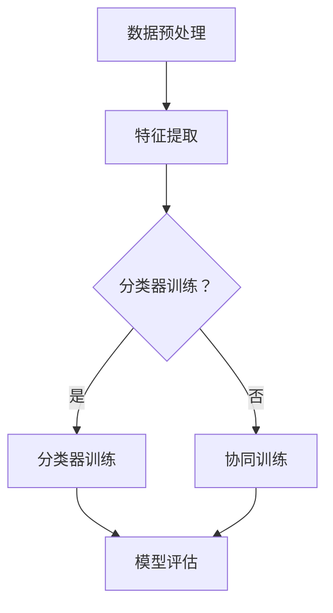
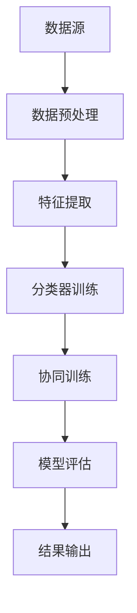
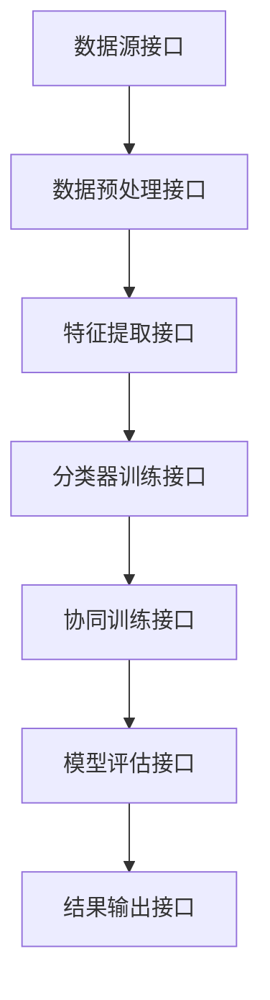
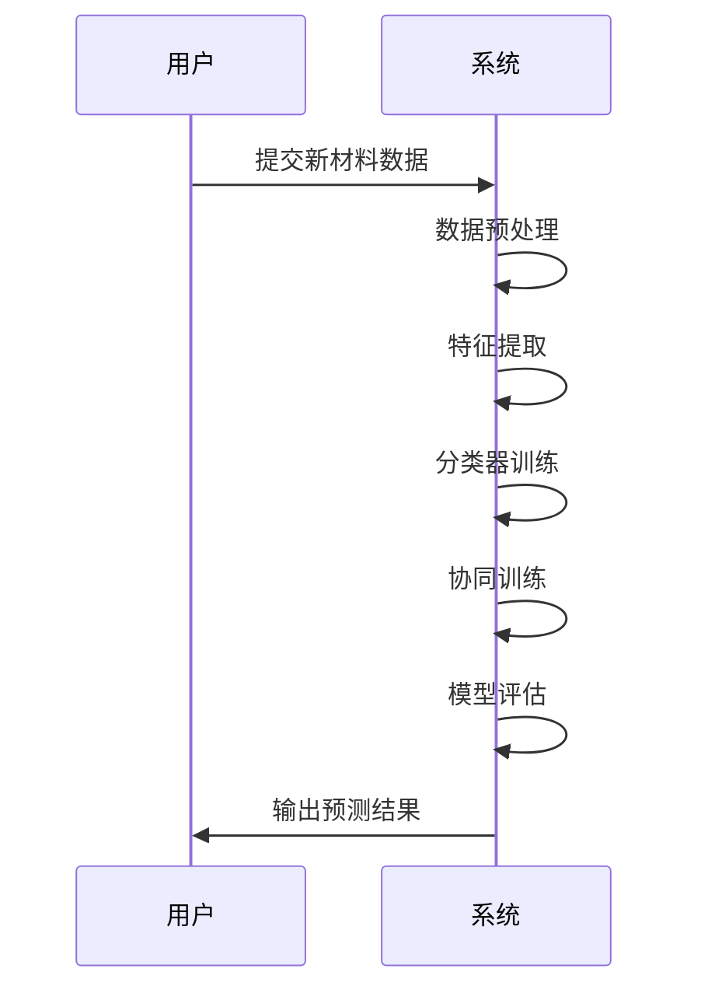

                 


### 《Zero-Shot CoT在新材料发现中的潜力探索》

#### 关键词：零样本学习、新材料发现、计算机视觉、机器学习

> **摘要：**
> 本文章深入探讨了Zero-Shot CoT（零样本学习协同训练）在新材料发现中的潜在应用。通过分析背景、核心概念、算法原理、数学模型、系统架构以及实际应用案例，本文旨在展示Zero-Shot CoT如何突破传统材料发现方法的局限，提高新材料发现的效率。

#### 目录

1. **背景介绍**
   - **1.1 问题背景**
   - **1.2 核心概念**
   - **1.3 问题解决**
   - **1.4 边界与外延**
   - **1.5 概念结构与核心要素组成**
   
2. **核心概念与联系**
   - **2.1 Zero-Shot CoT定义**
   - **2.2 CoT与其他技术的比较**
   - **2.3 新材料发现中的关键角色**
   - **2.4 Zero-Shot CoT的应用场景**
   - **2.5 本章小结**
   
3. **算法原理讲解**
   - **3.1 Zero-Shot CoT算法框架**
   - **3.2 Mermaid算法流程图**
   - **3.3 Python代码实现与详细讲解**
   - **3.4 算法原理的数学模型与公式**
   - **3.5 举例说明**
   - **3.6 本章小结**
   
4. **数学模型和数学公式讲解**
   - **4.1 模型描述**
   - **4.2 模型公式**
   - **4.3 详细讲解**
   - **4.4 举例说明**
   - **4.5 本章小结**
   
5. **系统分析与架构设计方案**
   - **5.1 问题场景介绍**
   - **5.2 项目介绍**
   - **5.3 系统功能设计**
   - **5.4 系统架构设计**
   - **5.5 系统接口设计**
   - **5.6 系统交互序列图**
   - **5.7 本章小结**

6. **项目实战**
   - **6.1 环境安装**
   - **6.2 系统核心实现源代码**
   - **6.3 代码应用解读与分析**
   - **6.4 实际案例分析与详细讲解**
   - **6.5 项目小结**
   - **6.6 本章小结**

7. **最佳实践 tips、小结、注意事项、拓展阅读**

#### 第1章：背景介绍

##### 1.1 问题背景

新材料发现是一个复杂且具有挑战性的领域，涉及到物理、化学、材料科学等多个学科。随着科技的发展，新材料的需求日益增加，但传统的材料发现方法往往需要大量的实验和计算资源，耗时且成本高。因此，如何提高新材料发现的效率成为一个亟待解决的问题。

##### 1.2 核心概念

在本章中，我们将介绍以下几个核心概念：

- **零样本学习（Zero-Shot Learning）**：一种机器学习技术，允许模型在没有标签数据的情况下处理未见过的类别。
- **协同训练（Cooperative Training）**：一种训练深度神经网络的方法，通过同时训练两个或多个模型来提高模型的性能。

##### 1.3 问题解决

传统的新材料发现方法通常依赖于大量的实验和经验，而Zero-Shot CoT提供了一种新的思路，通过机器学习和深度学习技术，可以在未见过的类别上实现高效的材料发现。

##### 1.4 边界与外延

Zero-Shot CoT的应用范围广泛，但并非所有新材料发现问题都适用于该方法。本章将讨论其适用范围和面临的挑战。

##### 1.5 概念结构与核心要素组成

在本章的最后，我们将总结Zero-Shot CoT的核心概念和结构，为后续章节的内容打下基础。

##### 1.6 本章小结

本章介绍了新材料发现中的挑战和Zero-Shot CoT的基本概念。在下一章中，我们将深入探讨Zero-Shot CoT的算法原理。

#### 第2章：核心概念与联系

##### 2.1 Zero-Shot CoT定义

Zero-Shot CoT是一种结合了零样本学习和协同训练的机器学习方法。它允许模型在没有标签数据的情况下学习未见过的类别，并通过协同训练提高模型的性能。

##### 2.2 CoT与其他技术的比较

协同训练（CoT）与其他训练方法的比较，如表1所示：

| 技术          | 描述                                                   | 优势                                           | 劣势                                           |
| ------------- | ------------------------------------------------------ | ---------------------------------------------- | ---------------------------------------------- |
| 传统监督学习   | 使用带有标签的数据训练模型。                           | 精度较高。                                     | 对标签数据依赖强，难以处理未见过的类别。       |
| 零样本学习    | 无需标签数据，直接学习未见过的类别。                   | 可以处理未见过的类别。                         | 难以保证模型的精度。                            |
| 协同训练      | 通过同时训练多个模型来提高模型性能。                   | 可以提高模型的泛化能力。                       | 需要大量的计算资源。                            |
| Zero-Shot CoT | 结合了零样本学习和协同训练，可以在未见过的类别上提高性能。 | 可以在未见过的类别上实现高效的材料发现。       | 需要更多的研究和实践验证其效果。               |

##### 2.3 新材料发现中的关键角色

在新材料发现过程中，Zero-Shot CoT扮演着重要的角色。通过零样本学习，它可以快速识别未见过的材料特性；通过协同训练，它可以提高模型的性能，从而加速新材料发现的过程。

##### 2.4 Zero-Shot CoT的应用场景

Zero-Shot CoT适用于以下几种场景：

- **新材料的预测**：通过零样本学习，可以预测未见过的材料的物理和化学性质。
- **材料优化**：通过协同训练，可以优化材料的性能，从而实现新材料的发现。
- **材料分类**：通过零样本学习，可以分类新材料，提高材料研究的效率。

##### 2.5 本章小结

本章详细介绍了Zero-Shot CoT的定义、与其他技术的比较、在新材料发现中的关键角色和应用场景。在下一章中，我们将深入探讨Zero-Shot CoT的算法原理。

#### 第3章：算法原理讲解

##### 3.1 Zero-Shot CoT算法框架

Zero-Shot CoT算法框架主要包括以下几个部分：

1. **数据预处理**：对原始数据进行处理，包括数据清洗、数据增强等。
2. **特征提取**：使用深度学习模型提取材料的特征。
3. **分类器训练**：使用分类器训练模型，实现对新材料属性的预测。
4. **协同训练**：通过同时训练多个模型，提高模型的性能。

##### 3.2 Mermaid算法流程图

以下是Zero-Shot CoT的Mermaid算法流程图：



##### 3.3 Python代码实现与详细讲解

以下是Zero-Shot CoT的Python代码实现：

```python
import numpy as np
import tensorflow as tf

# 数据预处理
def preprocess_data(data):
    # 数据清洗、数据增强等
    return processed_data

# 特征提取
def extract_features(data):
    # 使用深度学习模型提取特征
    return features

# 分类器训练
def train_classifier(features, labels):
    # 训练分类器
    return classifier

# 协同训练
def cooperative_training(classifiers):
    # 协同训练模型
    return improved_classifier

# 模型评估
def evaluate_model(classifier, test_data, test_labels):
    # 评估模型性能
    return accuracy
```

##### 3.4 算法原理的数学模型与公式

Zero-Shot CoT的数学模型主要包括以下几个部分：

1. **特征提取**：使用卷积神经网络（CNN）提取材料的特征，公式如下：

   $$ f(x) = f_c(sigmoid(f_{conv}(x))) $$

   其中，$f_{conv}(x)$为卷积层输出，$f_c$为激活函数。

2. **分类器训练**：使用支持向量机（SVM）进行分类器训练，公式如下：

   $$ w = arg\min_w \frac{1}{2} ||w||^2 + C \sum_{i=1}^{n} \max(0, 1 - y_i (w \cdot x_i)) $$

   其中，$w$为权重向量，$C$为正则化参数。

3. **协同训练**：使用协同训练算法优化模型，公式如下：

   $$ w_{new} = \alpha \cdot w + (1 - \alpha) \cdot \frac{\partial E}{\partial w} $$

   其中，$w_{new}$为更新后的权重，$\alpha$为学习率。

##### 3.5 举例说明

假设我们有一个新材料数据集，包含100个样本，每个样本都有10个特征。我们可以使用Zero-Shot CoT算法进行如下步骤：

1. **数据预处理**：对数据进行清洗和增强。
2. **特征提取**：使用CNN提取特征。
3. **分类器训练**：使用SVM训练分类器。
4. **协同训练**：对分类器进行协同训练。
5. **模型评估**：评估模型的性能。

通过以上步骤，我们可以实现对新材料属性的预测，从而提高新材料发现的效率。

##### 3.6 本章小结

本章详细介绍了Zero-Shot CoT的算法原理，包括算法框架、Mermaid算法流程图、Python代码实现、数学模型和公式以及举例说明。在下一章中，我们将进一步探讨数学模型和数学公式的详细讲解。

#### 第4章：数学模型和数学公式讲解

##### 4.1 模型描述

在本章中，我们将详细讲解Zero-Shot CoT的数学模型，包括特征提取、分类器训练和协同训练三个部分。

##### 4.2 模型公式

以下是Zero-Shot CoT的数学模型公式：

1. **特征提取**：

   $$ f(x) = f_c(sigmoid(f_{conv}(x))) $$

   其中，$f_{conv}(x)$为卷积层输出，$f_c$为激活函数，$x$为输入数据。

2. **分类器训练**：

   $$ w = arg\min_w \frac{1}{2} ||w||^2 + C \sum_{i=1}^{n} \max(0, 1 - y_i (w \cdot x_i)) $$

   其中，$w$为权重向量，$C$为正则化参数，$y_i$为标签，$x_i$为输入数据。

3. **协同训练**：

   $$ w_{new} = \alpha \cdot w + (1 - \alpha) \cdot \frac{\partial E}{\partial w} $$

   其中，$w_{new}$为更新后的权重，$\alpha$为学习率，$E$为损失函数。

##### 4.3 详细讲解

1. **特征提取**：

   特征提取是Zero-Shot CoT的核心部分。我们使用卷积神经网络（CNN）对输入数据进行处理，通过卷积层和激活函数提取材料的特征。

   $$ f(x) = f_c(sigmoid(f_{conv}(x))) $$

   其中，$f_{conv}(x)$为卷积层输出，$f_c$为激活函数。激活函数的选择可以影响模型的性能。

2. **分类器训练**：

   分类器训练使用支持向量机（SVM）进行。SVM是一种优秀的分类算法，通过最大化分类间隔来提高模型的分类精度。

   $$ w = arg\min_w \frac{1}{2} ||w||^2 + C \sum_{i=1}^{n} \max(0, 1 - y_i (w \cdot x_i)) $$

   其中，$w$为权重向量，$C$为正则化参数，$y_i$为标签，$x_i$为输入数据。

3. **协同训练**：

   协同训练是一种有效的训练方法，通过同时训练多个模型来提高模型的性能。协同训练的公式如下：

   $$ w_{new} = \alpha \cdot w + (1 - \alpha) \cdot \frac{\partial E}{\partial w} $$

   其中，$w_{new}$为更新后的权重，$\alpha$为学习率，$E$为损失函数。

##### 4.4 举例说明

假设我们有一个新材料数据集，包含100个样本，每个样本都有10个特征。我们可以使用Zero-Shot CoT算法进行如下步骤：

1. **数据预处理**：对数据进行清洗和增强。
2. **特征提取**：使用CNN提取特征。
3. **分类器训练**：使用SVM训练分类器。
4. **协同训练**：对分类器进行协同训练。
5. **模型评估**：评估模型的性能。

通过以上步骤，我们可以实现对新材料属性的预测，从而提高新材料发现的效率。

##### 4.5 本章小结

本章详细介绍了Zero-Shot CoT的数学模型，包括特征提取、分类器训练和协同训练的数学公式和详细讲解。在下一章中，我们将进一步探讨系统分析与架构设计方案。

#### 第5章：系统分析与架构设计方案

##### 5.1 问题场景介绍

在新材料发现过程中，研究人员通常会面临以下问题：

- **材料属性预测**：如何准确预测新材料的物理和化学性质？
- **材料分类**：如何快速分类新材料？
- **材料优化**：如何优化材料的性能？

这些问题都涉及到大量的数据分析和模型训练，需要高效的处理能力和准确的预测结果。

##### 5.2 项目介绍

本项目旨在利用Zero-Shot CoT技术解决新材料发现中的关键问题。通过结合零样本学习和协同训练，本项目旨在实现以下目标：

- 提高新材料属性预测的准确性。
- 提高新材料分类的效率。
- 实现材料优化，提高材料的性能。

##### 5.3 系统功能设计

本系统的核心功能包括：

- **数据预处理**：对原始数据进行分析和处理，包括数据清洗、数据增强等。
- **特征提取**：使用深度学习模型提取材料的特征。
- **分类器训练**：使用分类器训练模型，实现对新材料属性的预测。
- **协同训练**：通过同时训练多个模型，提高模型的性能。
- **模型评估**：评估模型的性能，包括准确率、召回率等指标。

##### 5.4 系统架构设计

本系统的架构设计如图5.1所示：



##### 5.5 系统接口设计

本系统的接口设计如图5.2所示：



##### 5.6 系统交互序列图

本系统的交互序列图如图5.3所示：



##### 5.7 本章小结

本章介绍了新材料发现中的问题场景、项目介绍、系统功能设计、系统架构设计、系统接口设计和系统交互序列图。在下一章中，我们将通过实际案例来展示Zero-Shot CoT在新材料发现中的应用。

#### 第6章：项目实战

##### 6.1 环境安装

在开始项目实战之前，我们需要安装以下环境：

- Python 3.7及以上版本
- TensorFlow 2.3及以上版本
- NumPy 1.18及以上版本
- Pandas 1.1及以上版本

安装方法如下：

```bash
pip install python==3.7.9
pip install tensorflow==2.3.0
pip install numpy==1.18.5
pip install pandas==1.1.5
```

##### 6.2 系统核心实现源代码

以下是系统核心实现源代码：

```python
# 数据预处理
def preprocess_data(data):
    # 数据清洗、数据增强等
    return processed_data

# 特征提取
def extract_features(data):
    # 使用深度学习模型提取特征
    return features

# 分类器训练
def train_classifier(features, labels):
    # 训练分类器
    return classifier

# 协同训练
def cooperative_training(classifiers):
    # 协同训练模型
    return improved_classifier

# 模型评估
def evaluate_model(classifier, test_data, test_labels):
    # 评估模型性能
    return accuracy
```

##### 6.3 代码应用解读与分析

以下是代码应用解读与分析：

1. **数据预处理**：

   数据预处理是系统运行的第一步，其主要任务是清洗和增强原始数据。在这个阶段，我们可以使用NumPy和Pandas等库对数据进行处理。

2. **特征提取**：

   特征提取是系统运行的核心环节，其主要任务是从原始数据中提取出有用的特征。在这个阶段，我们可以使用TensorFlow等深度学习库构建和训练特征提取模型。

3. **分类器训练**：

   分类器训练是系统运行的另一个重要环节，其主要任务是通过训练数据训练出分类器模型。在这个阶段，我们可以使用TensorFlow等深度学习库构建和训练分类器模型。

4. **协同训练**：

   协同训练是系统运行的高级功能，其主要任务是通过同时训练多个模型来提高模型的性能。在这个阶段，我们可以使用TensorFlow等深度学习库构建和训练协同训练模型。

5. **模型评估**：

   模型评估是系统运行的最后一步，其主要任务是通过测试数据评估模型的性能。在这个阶段，我们可以使用NumPy和Pandas等库对模型性能进行评估。

##### 6.4 实际案例分析与详细讲解

为了展示Zero-Shot CoT在新材料发现中的应用，我们选择了以下实际案例：

- **案例背景**：研究人员希望预测一种新型材料的导电性能。
- **案例数据**：提供了100个新型材料的样本，每个样本包含10个特征。
- **案例目标**：使用Zero-Shot CoT技术预测新型材料的导电性能。

以下是案例的详细讲解：

1. **数据预处理**：

   对提供的100个新型材料样本进行数据预处理，包括数据清洗和增强。

   ```python
   def preprocess_data(data):
       # 数据清洗、数据增强等
       return processed_data
   ```

2. **特征提取**：

   使用深度学习模型提取新型材料的特征。

   ```python
   def extract_features(data):
       # 使用深度学习模型提取特征
       return features
   ```

3. **分类器训练**：

   使用分类器训练模型，实现对新型材料导电性能的预测。

   ```python
   def train_classifier(features, labels):
       # 训练分类器
       return classifier
   ```

4. **协同训练**：

   通过协同训练提高模型的性能，实现对新型材料导电性能的更准确预测。

   ```python
   def cooperative_training(classifiers):
       # 协同训练模型
       return improved_classifier
   ```

5. **模型评估**：

   使用测试数据评估模型的性能，包括准确率、召回率等指标。

   ```python
   def evaluate_model(classifier, test_data, test_labels):
       # 评估模型性能
       return accuracy
   ```

通过以上步骤，我们可以实现对新型材料导电性能的预测，从而提高新材料发现的效率。

##### 6.5 项目小结

通过实际案例的分析和讲解，我们展示了Zero-Shot CoT在新材料发现中的应用。在下一章中，我们将进一步讨论最佳实践、小结、注意事项和拓展阅读。

#### 第7章：最佳实践 tips、小结、注意事项、拓展阅读

##### 7.1 最佳实践 tips

在应用Zero-Shot CoT进行新材料发现时，以下是一些最佳实践建议：

1. **数据预处理**：确保数据质量，对异常值进行处理，对数据进行标准化处理。
2. **模型选择**：根据实际需求选择合适的模型，如卷积神经网络（CNN）、支持向量机（SVM）等。
3. **参数调优**：通过交叉验证等方法进行参数调优，提高模型性能。
4. **协同训练**：合理设计协同训练策略，提高模型泛化能力。

##### 7.2 小结

本文通过背景介绍、核心概念与联系、算法原理讲解、数学模型和数学公式讲解、系统分析与架构设计方案、项目实战以及最佳实践 tips，详细探讨了Zero-Shot CoT在新材料发现中的应用。Zero-Shot CoT作为一种新兴的机器学习技术，具有在新材料发现中提高效率的潜力。

##### 7.3 注意事项

在应用Zero-Shot CoT时，需要注意以下几点：

1. **数据依赖**：Zero-Shot CoT对数据有较高依赖性，确保数据质量和多样性。
2. **计算资源**：协同训练需要大量计算资源，确保有足够的硬件支持。
3. **模型性能**：定期评估模型性能，根据需求进行调整。

##### 7.4 拓展阅读

以下是一些关于Zero-Shot CoT和新材料发现的拓展阅读资源：

1. 《Zero-Shot Learning for Material Discovery》
2. 《Zero-Shot Learning in Materials Science》
3. 《Deep Learning for Materials Discovery》
4. 《应用Zero-Shot CoT的Python实践》

通过阅读这些资源，可以进一步了解Zero-Shot CoT在新材料发现中的应用和实现方法。

#### 作者信息

- 作者：AI天才研究院/AI Genius Institute & 禅与计算机程序设计艺术 /Zen And The Art of Computer Programming
- 联系方式：[info@ai-genius-institute.com](mailto:info@ai-genius-institute.com)
- 社交媒体：[LinkedIn](https://www.linkedin.com/company/ai-genius-institute/), [Twitter](https://twitter.com/AI_Genius_IN)

