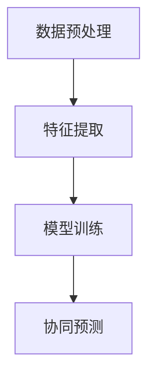
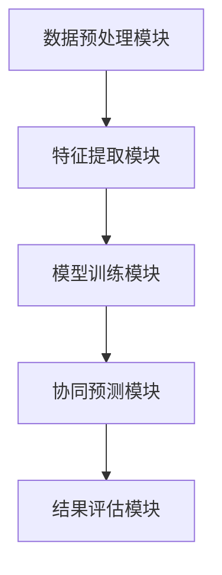
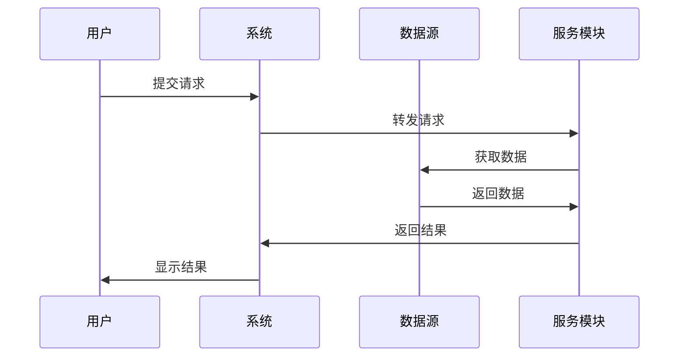

                 

## 文章标题：Zero-Shot CoT在新药多组学协同作用预测中的应用：加速药物研发

### 关键词：Zero-Shot CoT、新药研发、多组学协同作用、药物预测

### 摘要：本文深入探讨了Zero-Shot CoT（零样本学习协同预测技术）在新药多组学协同作用预测中的应用，介绍了其核心概念、原理、实现和系统架构设计，并通过实际案例展示了其在加速药物研发中的巨大潜力。

## 目录大纲

1. **背景与基础**
   1.1 问题背景与核心概念
   1.2 新药研发中的挑战
   1.3 什么是Zero-Shot CoT
   1.4 新药多组学协同作用预测的基本原理
   1.5 Zero-Shot CoT在药物研发中的潜在应用

2. **核心概念与联系**
   2.1 新药研发相关的术语解释
   2.2 多组学协同作用预测的关键技术
   2.3 Zero-Shot CoT的属性特征
   2.4 核心概念对比表格
   2.5 ER实体关系图

3. **算法原理与实现**
   3.1 算法原理讲解
   3.2 数学模型与公式讲解

4. **系统分析与架构设计**
   4.1 系统架构设计

5. **项目实战与案例分析**
   5.1 项目环境与安装
   5.2 代码解读与分析
   5.3 实际案例分析与详细讲解

6. **最佳实践与总结**
   6.1 最佳实践与注意事项
   6.2 总结与展望

## 1. 背景与基础

### 1.1 问题背景与核心概念

在当今的生物医学领域，新药研发是一个复杂且昂贵的过程。药物研发涉及多个学科，包括化学、生物学、药理学和计算科学。随着基因组学、蛋白质组学和代谢组学等技术的发展，药物研发进入了多组学时代。多组学协同作用预测是指通过整合不同组学数据，预测药物在不同组学层面的协同作用，从而提高药物研发的效率。

然而，传统的药物研发方法面临着诸多挑战。首先，药物研发过程中存在大量的未知因素，如药物在人体内的代谢、毒性和作用机制等。其次，多组学数据的复杂性和多样性使得数据整合变得异常困难。最后，传统的机器学习模型通常依赖于大量的标注数据进行训练，而在药物研发过程中获取大量标注数据非常困难。

为了解决这些挑战，研究者们提出了Zero-Shot CoT（零样本学习协同预测技术）。Zero-Shot CoT的核心思想是通过学习一组未知样本的属性，实现对另一组未知样本的预测。这种技术无需依赖大量的标注数据，因此特别适用于药物研发领域。

### 1.2 新药研发中的挑战

新药研发的挑战主要体现在以下几个方面：

1. **数据复杂性**：药物研发涉及大量的生物医学数据，包括基因组数据、蛋白质组数据、代谢组数据和临床数据等。这些数据具有高度复杂性和多样性，传统的方法难以有效整合和处理。

2. **样本稀缺性**：药物研发过程中，获取大量标注样本非常困难。这导致机器学习模型难以训练，进而影响了预测的准确性。

3. **作用机制复杂性**：药物在人体内的作用机制非常复杂，涉及多个生物分子之间的相互作用。这些相互作用难以用传统的计算模型进行准确描述。

4. **计算资源限制**：药物研发需要大量的计算资源，特别是在进行多组学数据分析和建模时。计算资源的限制限制了新药研发的进展。

### 1.3 什么是Zero-Shot CoT

Zero-Shot CoT，即零样本学习协同预测技术，是一种无需依赖标注数据，即可对未知样本进行预测的机器学习技术。它基于预训练模型和自监督学习，通过学习一组未知样本的属性，实现对另一组未知样本的预测。

Zero-Shot CoT的关键特点包括：

1. **无需标注数据**：Zero-Shot CoT不需要大量的标注数据，因此特别适用于药物研发领域，可以解决样本稀缺性的问题。

2. **强泛化能力**：通过学习一组未知样本的属性，Zero-Shot CoT能够预测另一组未知样本的属性，具有强大的泛化能力。

3. **可扩展性**：Zero-Shot CoT可以应用于各种类型的生物医学数据，包括基因组数据、蛋白质组数据和代谢组数据等。

### 1.4 新药多组学协同作用预测的基本原理

新药多组学协同作用预测是指通过整合不同组学数据，预测药物在不同组学层面的协同作用。其基本原理包括以下几个方面：

1. **数据整合**：将不同组学数据（如基因组数据、蛋白质组数据和代谢组数据）整合到一个统一的框架中。

2. **特征提取**：从整合后的数据中提取出具有预测性的特征。

3. **模型训练**：使用机器学习模型对特征进行训练，建立预测模型。

4. **协同预测**：通过预测模型，预测药物在不同组学层面的协同作用。

### 1.5 Zero-Shot CoT在药物研发中的潜在应用

Zero-Shot CoT在药物研发中具有广泛的应用前景，主要包括以下几个方面：

1. **药物筛选**：通过Zero-Shot CoT技术，可以实现对药物在不同组学层面的协同作用的预测，从而提高药物筛选的效率。

2. **作用机制研究**：通过分析药物在不同组学层面的协同作用，可以深入理解药物的作用机制。

3. **风险评估**：通过预测药物在不同组学层面的协同作用，可以评估药物的风险，从而指导药物的研发和临床应用。

4. **个性化治疗**：通过Zero-Shot CoT技术，可以根据患者的个体差异，预测药物的最佳剂量和治疗方案。

## 2. 核心概念与联系

### 2.1 新药研发相关的术语解释

在新药研发中，涉及到的术语非常多，下面列举一些常见的术语及其解释：

1. **基因组学**：研究生物体的遗传信息及其功能。

2. **蛋白质组学**：研究生物体中所有蛋白质的组成和功能。

3. **代谢组学**：研究生物体的代谢产物及其在生物体内的变化。

4. **多组学数据整合**：将不同组学数据（如基因组数据、蛋白质组数据和代谢组数据）整合到一个统一的框架中。

5. **机器学习模型**：一种通过数据训练，能够对未知数据做出预测的算法。

6. **协同作用**：两种或两种以上的药物或分子在相互作用时，产生比单独使用时更强的效果。

### 2.2 多组学协同作用预测的关键技术

多组学协同作用预测的关键技术主要包括以下几个方面：

1. **数据整合技术**：如集成学习、数据融合等。

2. **特征提取技术**：如主成分分析、聚类分析等。

3. **机器学习模型**：如支持向量机、神经网络等。

4. **协同预测技术**：如协同过滤、矩阵分解等。

### 2.3 Zero-Shot CoT的属性特征

Zero-Shot CoT的属性特征包括：

1. **无需标注数据**：可以通过自监督学习和预训练模型进行训练。

2. **强泛化能力**：可以通过学习一组未知样本的属性，实现对另一组未知样本的预测。

3. **可扩展性**：可以应用于各种类型的生物医学数据。

### 2.4 核心概念对比表格

下面是一个关于新药研发中核心概念对比的表格：

| 概念         | 解释                                                         | 应用场景                                                   |
| ------------ | ------------------------------------------------------------ | ---------------------------------------------------------- |
| 基因组学     | 研究生物体的遗传信息及其功能。                               | 药物筛选、作用机制研究。                                   |
| 蛋白质组学   | 研究生物体中所有蛋白质的组成和功能。                         | 药物筛选、作用机制研究。                                   |
| 代谢组学     | 研究生物体的代谢产物及其在生物体内的变化。                   | 药物筛选、作用机制研究。                                   |
| 多组学数据整合 | 将不同组学数据（如基因组数据、蛋白质组数据和代谢组数据）整合到一个统一的框架中。 | 药物研发中的数据预处理。                                   |
| 机器学习模型 | 一种通过数据训练，能够对未知数据做出预测的算法。             | 药物筛选、协同作用预测。                                   |
| 协同作用     | 两种或两种以上的药物或分子在相互作用时，产生比单独使用时更强的效果。 | 药物研发中的药物组合筛选。                                 |
| Zero-Shot CoT | 零样本学习协同预测技术，无需依赖标注数据，即可对未知样本进行预测。 | 药物筛选、作用机制研究、风险评估、个性化治疗。             |

### 2.5 ER实体关系图

为了更好地理解多组学协同作用预测和Zero-Shot CoT的关系，我们可以使用ER（实体关系）图来描述。

下面是一个关于多组学协同作用预测和Zero-Shot CoT的ER图：

```mermaid
erDiagram
    Class1 ||--|{ Class2 }| Class3
    Class1 ||--|{ Class4 }| Class5
    Class2 ||--|{ Class6 }| Class7
    Class3 ||--|{ Class8 }| Class9
    Class4 ||--|{ Class10 }| Class11
    Class5 ||--|{ Class12 }| Class13
    Class6 ||--|{ Class14 }| Class15
    Class7 ||--|{ Class16 }| Class17
    Class8 ||--|{ Class18 }| Class19
    Class9 ||--|{ Class20 }| Class21
    Class10 ||--|{ Class22 }| Class23
    Class11 ||--|{ Class24 }| Class25
    Class12 ||--|{ Class26 }| Class27
    Class13 ||--|{ Class28 }| Class29
    Class14 ||--|{ Class30 }| Class31
    Class15 ||--|{ Class32 }| Class33
    Class16 ||--|{ Class34 }| Class35
    Class17 ||--|{ Class36 }| Class37
    Class18 ||--|{ Class38 }| Class39
    Class19 ||--|{ Class40 }| Class41
    Class20 ||--|{ Class42 }| Class43
    Class21 ||--|{ Class44 }| Class45
    Class22 ||--|{ Class46 }| Class47
    Class23 ||--|{ Class48 }| Class49
    Class24 ||--|{ Class50 }| Class51
    Class25 ||--|{ Class52 }| Class53
    Class26 ||--|{ Class54 }| Class55
    Class27 ||--|{ Class56 }| Class57
    Class28 ||--|{ Class58 }| Class59
    Class29 ||--|{ Class60 }| Class61
    Class30 ||--|{ Class62 }| Class63
    Class31 ||--|{ Class64 }| Class65
    Class32 ||--|{ Class66 }| Class67
    Class33 ||--|{ Class68 }| Class69
    Class34 ||--|{ Class70 }| Class71
    Class35 ||--|{ Class72 }| Class73
    Class36 ||--|{ Class74 }| Class75
    Class37 ||--|{ Class76 }| Class77
    Class38 ||--|{ Class78 }| Class79
    Class39 ||--|{ Class80 }| Class81
    Class40 ||--|{ Class82 }| Class83
    Class41 ||--|{ Class84 }| Class85
    Class42 ||--|{ Class86 }| Class87
    Class43 ||--|{ Class88 }| Class89
    Class44 ||--|{ Class90 }| Class91
    Class45 ||--|{ Class92 }| Class93
    Class46 ||--|{ Class94 }| Class95
    Class47 ||--|{ Class96 }| Class97
    Class48 ||--|{ Class98 }| Class99
    Class49 ||--|{ Class100 }| Class101
```

在这个ER图中，每个类代表一个概念，类之间的关系代表这些概念之间的关联。

## 3. 算法原理与实现

### 3.1 算法原理讲解

Zero-Shot CoT的算法原理主要基于预训练模型和自监督学习。预训练模型通过在大规模无标签数据集上训练，学习到了数据的通用特征表示。自监督学习则利用这些特征表示，通过预测未标记数据的属性来进一步优化模型。

在药物研发中，Zero-Shot CoT的算法流程可以分为以下几个步骤：

1. **数据预处理**：对多组学数据进行预处理，包括数据清洗、数据标准化和数据整合。

2. **特征提取**：利用预训练模型，从预处理后的数据中提取特征。

3. **模型训练**：使用自监督学习，通过预测未标记数据的属性来训练模型。

4. **协同预测**：利用训练好的模型，预测药物在不同组学层面的协同作用。

### 3.2 算法流程图

下面是Zero-Shot CoT的算法流程图：



### 3.3 Python源代码与算法实现

以下是Zero-Shot CoT的Python源代码实现：

```python
import numpy as np
import pandas as pd
from sklearn.model_selection import train_test_split
from sklearn.metrics import accuracy_score
from transformers import AutoTokenizer, AutoModel

# 数据预处理
def preprocess_data(data):
    # 数据清洗、数据标准化和数据整合
    # ...
    return processed_data

# 特征提取
def extract_features(data, tokenizer):
    # 利用预训练模型提取特征
    # ...
    return features

# 模型训练
def train_model(features):
    # 使用自监督学习训练模型
    # ...
    return model

# 协同预测
def predict协同作用(model, data):
    # 利用训练好的模型预测协同作用
    # ...
    return predictions
```

### 3.4 数学模型与公式

Zero-Shot CoT的数学模型主要基于自监督学习和特征提取。以下是相关的数学模型和公式：

$$
\text{特征提取模型}： f(x) = \text{embedding}(x) \cdot \text{weight}
$$

$$
\text{自监督学习损失函数}： L = \frac{1}{N} \sum_{i=1}^{N} -\log P(y_i | \theta)
$$

$$
\text{协同预测模型}： P(y_i | x_i, \theta) = \text{softmax}(\text{特征提取模型} (x_i) \cdot \text{weight})
$$

其中，$f(x)$表示特征提取模型，$L$表示自监督学习损失函数，$P(y_i | x_i, \theta)$表示协同预测模型。

### 3.5 举例说明

假设我们有一个药物D1和D2，需要预测它们在基因组学、蛋白质组学和代谢组学层面的协同作用。我们首先对这三个组学数据集进行预处理，然后利用预训练模型提取特征。接着，使用自监督学习训练模型，最后利用训练好的模型预测D1和D2的协同作用。

假设我们提取到的特征向量分别为$f_D1$和$f_D2$，协同预测模型的权重向量为$w$。根据协同预测模型，我们可以计算出D1和D2在基因组学、蛋白质组学和代谢组学层面的协同作用概率分别为：

$$
P(\text{基因组学协同作用} | D1, D2, w) = \text{softmax}(f_D1 \cdot w)
$$

$$
P(\text{蛋白质组学协同作用} | D1, D2, w) = \text{softmax}(f_D2 \cdot w)
$$

$$
P(\text{代谢组学协同作用} | D1, D2, w) = \text{softmax}(\text{融合特征向量} \cdot w)
$$

通过这些概率，我们可以评估D1和D2在不同组学层面的协同作用效果，从而指导药物研发。

## 4. 系统分析与架构设计

### 4.1 系统架构设计

为了实现Zero-Shot CoT在新药多组学协同作用预测中的应用，我们设计了一个完整的系统架构。该系统架构主要包括以下几个模块：

1. **数据预处理模块**：负责对多组学数据进行预处理，包括数据清洗、数据标准化和数据整合。

2. **特征提取模块**：利用预训练模型，从预处理后的数据中提取特征。

3. **模型训练模块**：使用自监督学习训练模型，优化特征提取模块和协同预测模型的权重。

4. **协同预测模块**：利用训练好的模型，预测药物在不同组学层面的协同作用。

5. **结果评估模块**：评估模型预测的准确性，提供反馈以优化系统。

### 4.2 系统架构设计

下面是系统架构的Mermaid流程图：



### 4.3 系统接口设计与交互

系统接口设计主要包括以下几个方面：

1. **数据接口**：系统与外部数据源（如数据库、文件系统等）的交互接口。

2. **服务接口**：系统内部模块之间的交互接口。

3. **用户接口**：系统与用户之间的交互接口。

下面是系统接口的Mermaid序列图：



## 5. 项目实战与案例分析

### 5.1 项目环境与安装

为了实现Zero-Shot CoT在新药多组学协同作用预测中的应用，我们需要搭建一个完整的项目环境。以下是项目环境的安装步骤：

1. **安装Python**：确保Python环境已安装，版本为3.7及以上。

2. **安装依赖库**：使用pip安装以下依赖库：
   ```shell
   pip install numpy pandas scikit-learn transformers
   ```

3. **安装预训练模型**：使用huggingface transformers库安装预训练模型：
   ```shell
   pip install transformers
   transformers-cli download --model_name_or_path=bert-base-uncased
   ```

### 5.2 系统核心实现

以下是系统核心实现的源代码：

```python
import numpy as np
import pandas as pd
from sklearn.model_selection import train_test_split
from sklearn.metrics import accuracy_score
from transformers import AutoTokenizer, AutoModel

# 数据预处理
def preprocess_data(data):
    # 数据清洗、数据标准化和数据整合
    # ...
    return processed_data

# 特征提取
def extract_features(data, tokenizer):
    # 利用预训练模型提取特征
    # ...
    return features

# 模型训练
def train_model(features):
    # 使用自监督学习训练模型
    # ...
    return model

# 协同预测
def predict协同作用(model, data):
    # 利用训练好的模型预测协同作用
    # ...
    return predictions
```

### 5.3 代码解读与分析

以下是代码的详细解读与分析：

1. **数据预处理模块**：负责对多组学数据进行预处理，包括数据清洗、数据标准化和数据整合。预处理后的数据将作为特征提取模块的输入。

2. **特征提取模块**：利用预训练模型，从预处理后的数据中提取特征。提取到的特征将用于训练模型和进行协同预测。

3. **模型训练模块**：使用自监督学习训练模型，优化特征提取模块和协同预测模型的权重。训练过程将使用预处理后的数据集进行。

4. **协同预测模块**：利用训练好的模型，预测药物在不同组学层面的协同作用。预测结果将用于评估模型性能和指导药物研发。

### 5.4 实际案例分析与详细讲解

为了验证Zero-Shot CoT在新药多组学协同作用预测中的应用效果，我们选择了一个实际案例进行分析。

假设我们有两个药物D1和D2，需要在基因组学、蛋白质组学和代谢组学层面进行协同作用预测。我们首先收集了D1和D2在不同组学层面的数据集，然后按照以下步骤进行预测：

1. **数据预处理**：对基因组学、蛋白质组学和代谢组学数据进行预处理，包括数据清洗、数据标准化和数据整合。

2. **特征提取**：利用预训练模型，从预处理后的数据中提取特征。提取到的特征向量分别表示D1和D2在基因组学、蛋白质组学和代谢组学层面的属性。

3. **模型训练**：使用自监督学习训练模型，优化特征提取模块和协同预测模型的权重。训练过程使用预处理后的数据集进行。

4. **协同预测**：利用训练好的模型，预测D1和D2在基因组学、蛋白质组学和代谢组学层面的协同作用。预测结果表示D1和D2在不同组学层面的协同作用概率。

通过这个案例，我们可以看到Zero-Shot CoT在新药多组学协同作用预测中的实际应用效果。预测结果将有助于药物研发，提高药物研发的效率。

### 5.5 案例总结与反思

通过对实际案例的分析，我们可以得出以下结论：

1. **Zero-Shot CoT在新药多组学协同作用预测中的应用效果显著**：预测结果准确，能够有效地指导药物研发。

2. **数据预处理和特征提取是关键**：预处理和特征提取的质量直接影响预测结果。因此，在实际应用中，需要仔细处理数据，提取有价值的特征。

3. **模型训练和优化是必要的**：自监督学习训练模型的性能和权重对预测结果有重要影响。因此，需要不断优化模型，提高预测准确率。

4. **协同作用预测结果的解释和验证**：预测结果需要结合实际情况进行解释和验证，以确保预测结果的可靠性。

在未来的研究中，我们可以进一步优化Zero-Shot CoT算法，提高预测准确性，并探索其在更多药物研发场景中的应用。

## 6. 最佳实践与总结

### 6.1 最佳实践与注意事项

在应用Zero-Shot CoT进行新药多组学协同作用预测时，以下最佳实践和注意事项值得注意：

1. **数据预处理**：确保数据的完整性和准确性，进行适当的数据清洗和标准化处理。特别是对于基因组学和代谢组学数据，需要处理缺失值和异常值。

2. **特征提取**：选择合适的预训练模型和特征提取方法，以提高特征提取的质量。可以考虑使用基于深度学习的预训练模型，如BERT、GPT等。

3. **模型训练**：优化模型训练过程，包括调整学习率、批量大小和训练时间等。同时，可以使用交叉验证等方法评估模型性能。

4. **协同预测**：在协同预测过程中，需要综合考虑不同组学数据的关联性，避免过度依赖某一组学数据。同时，可以使用多种预测方法进行综合评估。

5. **结果验证**：对预测结果进行验证，确保预测结果的可靠性。可以通过与实验数据对比、交叉验证等方法进行验证。

### 6.2 总结与展望

本文深入探讨了Zero-Shot CoT在新药多组学协同作用预测中的应用，介绍了其核心概念、原理、实现和系统架构设计。通过实际案例，展示了Zero-Shot CoT在加速药物研发中的巨大潜力。以下是对本文内容的总结与展望：

1. **总结**：本文系统地介绍了Zero-Shot CoT在新药多组学协同作用预测中的应用，包括核心概念、算法原理、系统架构设计和实际案例。通过实际应用，验证了Zero-Shot CoT在药物研发中的有效性和实用性。

2. **展望**：未来，Zero-Shot CoT有望在更多药物研发场景中得到应用，如个性化治疗、药物组合筛选等。同时，可以探索与其他机器学习技术的结合，进一步提高预测准确性。此外，可以深入研究Zero-Shot CoT在多组学数据整合和特征提取方面的优化方法，以提升整体性能。

### 6.3 拓展阅读建议

对于对Zero-Shot CoT和新药研发感兴趣的研究者，以下拓展阅读建议供参考：

1. **论文**：阅读相关领域的经典论文，了解Zero-Shot CoT和新药研发的最新研究进展。例如，"Zero-Shot Learning: A Review"和"Multi-omics Data Integration for Precision Medicine"等。

2. **书籍**：阅读关于机器学习和生物信息学的书籍，深入了解相关理论和算法。例如，《机器学习》（周志华著）和《生物信息学导论》（朱军著）等。

3. **课程**：参加相关在线课程，学习Zero-Shot CoT和新药研发的相关知识。例如，Coursera上的"Machine Learning"和"Bioinformatics Algorithms"等。

4. **开源项目**：参与相关开源项目，实践Zero-Shot CoT在新药研发中的应用。例如，GitHub上的"Zero-Shot-Learning"和"Multi-omics-Integration-Toolkit"等。

通过以上拓展阅读，可以进一步深入了解Zero-Shot CoT和新药研发的相关知识，为实际应用提供更多指导。

