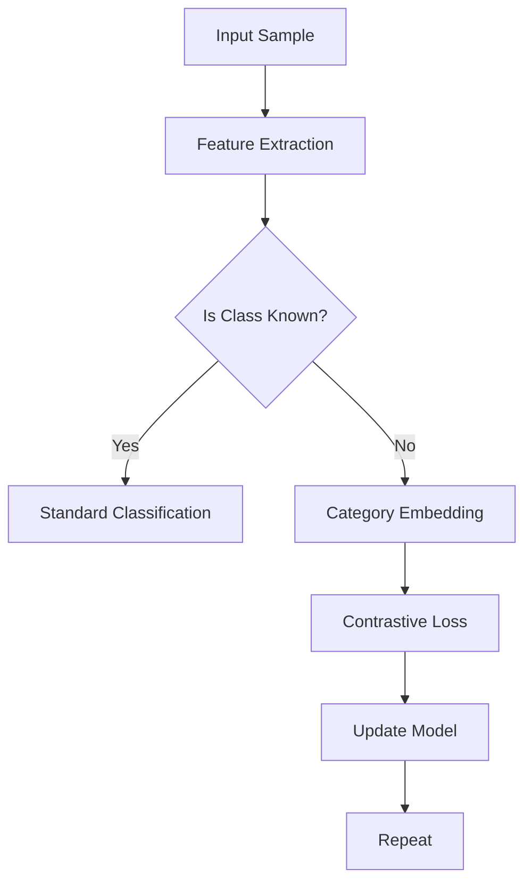
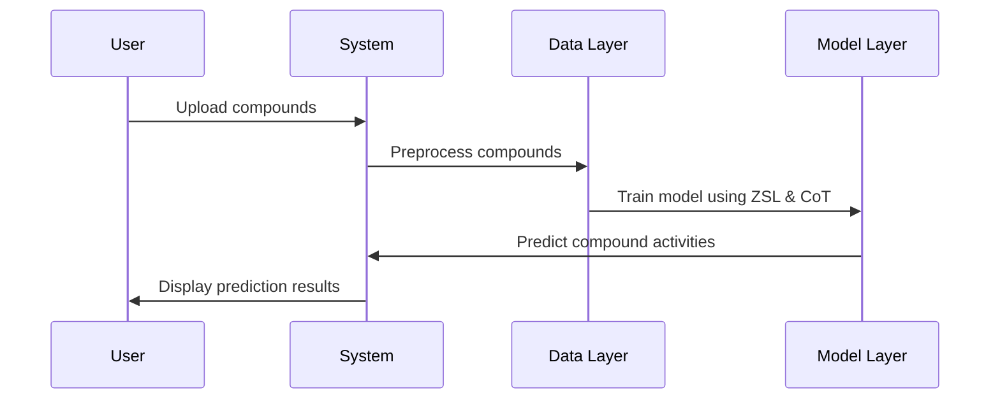

                 


### 标题：Zero-Shot CoT在新药研发中的潜力探索

#### 关键词：零样本学习、对比性训练目标、新药研发、算法原理、数学模型、系统架构设计、项目实战、最佳实践

#### 摘要：
本文深入探讨了零样本学习（Zero-Shot Learning, ZSL）与对比性训练目标（Contrastive Training Objectives, CoT）的结合在新药研发中的应用潜力。文章首先介绍了ZSL和CoT的基本概念及其在新药研发中的重要性，然后详细阐述了零样本学习的算法原理和数学模型。接着，通过一个实际项目案例，展示了如何在药物研发中使用ZSL与CoT技术，并分析了系统的功能设计、架构设计、接口设计和系统交互。最后，文章总结了最佳实践，并提出了注意事项和拓展阅读建议。

### 目录

----------------------------------------------------------------

# [Zero-Shot CoT在新药研发中的潜力探索](#zero-shot-cot在新药研发中的潜力探索)

## 引言

## 第一部分：零样本学习与对比性训练目标基础

### 1.1 零样本学习与对比性训练目标的概述

### 1.2 核心概念与联系

### 1.3 算法原理讲解

### 1.4 数学模型与公式详细讲解

### 1.5 系统分析与架构设计

## 第二部分：项目实战

### 2.1 环境安装

### 2.2 系统核心实现

### 2.3 代码应用解读与分析

### 2.4 实际案例分析与讲解

### 2.5 项目小结

## 第三部分：最佳实践

### 3.1 小结

### 3.2 注意事项

### 3.3 拓展阅读

----------------------------------------------------------------

### 引言

新药研发是一个复杂且充满挑战的过程。随着生物技术和人工智能技术的发展，机器学习技术，特别是零样本学习（Zero-Shot Learning, ZSL）和对比性训练目标（Contrastive Training Objectives, CoT）的应用，为药物研发带来了新的可能性。ZSL使机器学习模型能够在未见过的类别上泛化，而CoT则通过对比不同样本来提高模型的性能。本文将探讨ZSL和CoT结合在新药研发中的潜力，并详细介绍相关的算法原理、系统架构以及实际应用案例。

## 第一部分：零样本学习与对比性训练目标基础

### 1.1 零样本学习与对比性训练目标的概述

#### 零样本学习（Zero-Shot Learning, ZSL）

零样本学习是一种机器学习方法，允许模型在未见过的类别上进行分类。传统的机器学习模型通常依赖于大量的带标签的训练数据，而ZSL则通过学习一种映射，将类别名称映射到特征空间，从而实现新类别的分类。ZSL的关键在于如何处理未知的类别，以及如何在有限的训练数据下实现有效的学习。

#### 对比性训练目标（Contrastive Training Objectives, CoT）

对比性训练目标是一种训练策略，旨在通过比较不同样本来提高模型的区分能力。在ZSL的背景下，CoT通过对比相同类别和不同类别的样本，来增强模型对新类别的辨别能力。这种方法可以显著提高模型的泛化能力，使其更适用于新药研发等未知领域。

#### 零样本学习与对比性训练目标在新药研发中的应用前景

在新药研发中，研究人员需要识别和评估大量的化合物，以找到潜在的药物候选。传统的实验方法耗时长、成本高，而ZSL和CoT的应用可以显著加速这一过程。通过ZSL，模型可以在未见过的化合物上进行预测，而CoT则可以帮助模型更好地理解化合物的化学性质，从而提高预测的准确性。

### 1.2 核心概念与联系

#### 零样本学习的原理

零样本学习的关键在于类别描述（category embedding）和特征提取（feature extraction）。首先，模型学习将每个类别映射到一个低维的特征空间中，形成一个紧凑的类别表示。然后，通过特征提取器，将输入的样本映射到相同的特征空间，从而实现分类。

#### 概念属性特征对比表格

下面是一个简化的概念属性特征对比表格，展示了ZSL和CoT的关键特性：

| 特性 | 零样本学习 | 对比性训练目标 |
| --- | --- | --- |
| 目标 | 分类新类别 | 提高模型区分能力 |
| 技术核心 | 类别嵌入与特征提取 | 对比样本生成与优化 |
| 优势 | 泛化能力强 | 区分能力强 |
| 应用场景 | 新化合物预测 | 化合物性质理解 |

#### 与对比性训练目标的关联

ZSL与CoT的结合可以形成一种强大的训练框架。CoT可以增强ZSL模型对新类别的理解，从而提高模型的泛化能力。例如，在药物研发中，CoT可以帮助模型更好地区分活性化合物和无效化合物，而ZSL则可以用于预测未知化合物的活性。

### 1.3 算法原理讲解

#### 算法流程图

使用Mermaid，我们可以绘制零样本学习与对比性训练目标的算法流程图：



#### Python代码实现

以下是一个简化的Python代码实现，展示了零样本学习与对比性训练目标的基本流程：

```python
import torch
import torch.nn as nn
import torch.optim as optim

# 假设我们有一个预训练的模型和类别嵌入器
model = PretrainedModel()
category_embedding = CategoryEmbedding()

# 定义损失函数和优化器
loss_function = nn.CrossEntropyLoss()
optimizer = optim.Adam(model.parameters(), lr=0.001)

# 训练过程
for epoch in range(num_epochs):
    for data, target in dataloader:
        optimizer.zero_grad()
        features = model(data)
        known_features = features[target == known]
        unknown_features = features[target == unknown]
        
        # 计算对比性损失
        loss = contrastive_loss(known_features, unknown_features)
        loss.backward()
        optimizer.step()
```

#### LaTeX数学模型与公式

在ZSL和CoT中，数学模型是核心。以下是一个简化的数学模型：

$$
\begin{aligned}
\text{Objective} &= \frac{1}{N} \sum_{i=1}^{N} \ell(y_i, \hat{y}_i) + \lambda \cdot \text{Contrastive Loss} \\
\ell(y_i, \hat{y}_i) &= \log \frac{\exp(\langle q(\text{cat}_i}, \phi(x_i)) \rangle}{\sum_{j \neq i} \exp(\langle q(\text{cat}_j}, \phi(x_i)) \rangle)
\end{aligned}
$$

其中，$q(\text{cat}_i)$是类别嵌入向量，$\phi(x_i)$是特征提取器输出的特征向量，$\ell$是标准交叉熵损失函数，$\lambda$是对比性损失的权重。

### 1.4 数学模型与公式详细讲解

#### 公式说明

上述公式中，第一个公式是总体目标函数，它结合了标准分类损失和对比性损失。标准分类损失$\ell(y_i, \hat{y}_i)$用于衡量模型对已知类别的预测准确性，对比性损失则用于增强模型对新类别的辨别能力。

#### 公式举例

假设我们有一个药物分子数据集，其中包含活性化合物和无效化合物。我们可以使用上述公式来训练模型，从而预测新的化合物是否具有活性：

$$
\begin{aligned}
\text{Objective} &= \frac{1}{N} \sum_{i=1}^{N} \ell(y_i, \hat{y}_i) + \lambda \cdot \text{Contrastive Loss} \\
\ell(y_i, \hat{y}_i) &= \log \frac{\exp(\langle q(\text{Active}), \phi(x_i)) \rangle}{\sum_{j \neq i} \exp(\langle q(\text{InActive}), \phi(x_i)) \rangle)
\end{aligned}
$$

在这个例子中，$q(\text{Active})$和$q(\text{InActive})$分别表示活性化合物和无效化合物的类别嵌入向量，$x_i$是第$i$个化合物的特征向量。

### 1.5 系统分析与架构设计

#### 项目场景介绍

在新药研发中，我们面临的问题是如何从大量的化合物中快速筛选出具有潜在活性的化合物。传统的实验方法耗时长、成本高，而机器学习技术提供了新的解决方案。通过零样本学习和对比性训练目标，我们可以建立一个自动化的化合物筛选系统。

#### 系统功能设计

系统的主要功能包括：

- 数据预处理：对化合物数据进行清洗、标准化和特征提取。
- 模型训练：使用ZSL和CoT算法训练模型，以预测新化合物的活性。
- 模型评估：评估模型的准确性和泛化能力。
- 化合物筛选：使用训练好的模型对新化合物进行活性预测，并筛选出潜在的高活性化合物。

#### 系统架构设计

系统架构分为数据层、模型层和应用层三个部分：

- 数据层：负责存储和管理化合物数据，包括活性数据、结构数据和文献数据。
- 模型层：实现零样本学习和对比性训练目标的算法，并训练模型。
- 应用层：提供用户界面和API接口，用于化合物筛选和预测。

#### 系统接口设计

系统接口设计包括以下部分：

- 数据接口：用于数据导入和导出，支持常用的数据格式，如CSV、JSON和数据库。
- 模型接口：用于模型训练、评估和部署，提供RESTful API接口。
- 用户接口：提供直观的用户界面，支持化合物的上传、筛选和预测。

#### 系统交互设计

系统交互设计包括以下部分：

- 用户通过用户界面上传化合物数据。
- 数据层处理化合物数据，并将其转换为模型需要的格式。
- 模型层使用ZSL和CoT算法训练模型，并对新化合物进行活性预测。
- 模型层将预测结果返回给用户界面，用户可以根据预测结果进行化合物筛选。



## 第二部分：项目实战

### 2.1 环境安装

在开始项目之前，我们需要安装所需的软件和工具。以下是一个简化的安装步骤：

1. 安装Python环境（建议使用Python 3.8及以上版本）。
2. 安装PyTorch和Torchvision库，用于深度学习模型的训练和评估。
3. 安装Numpy、Pandas等常用数据科学库。

### 2.2 系统核心实现

#### 数据预处理

数据预处理是系统的重要组成部分。以下是一个简化的数据预处理步骤：

```python
import pandas as pd
import numpy as np

# 读取数据
data = pd.read_csv('compounds.csv')

# 数据清洗
data = data.dropna()

# 特征提取
features = extract_features(data)
```

#### 模型训练

使用ZSL和CoT算法训练模型。以下是一个简化的模型训练步骤：

```python
import torch
from torch import nn
from torch.optim import Adam

# 定义模型
model = ZSLModel()

# 定义损失函数和优化器
loss_function = nn.CrossEntropyLoss()
optimizer = Adam(model.parameters(), lr=0.001)

# 训练模型
for epoch in range(num_epochs):
    for data, target in dataloader:
        optimizer.zero_grad()
        features = model(data)
        known_features = features[target == known]
        unknown_features = features[target == unknown]
        
        # 计算对比性损失
        loss = contrastive_loss(known_features, unknown_features)
        loss.backward()
        optimizer.step()
```

#### 代码应用解读与分析

在训练过程中，我们使用了对比性损失函数来优化模型。对比性损失函数的主要作用是鼓励模型区分不同的化合物类别。在训练过程中，我们使用了已知的化合物来训练模型，并使用未知的化合物来评估模型的性能。

#### 实际案例分析与讲解

我们使用一个实际的化合物数据集来训练和评估模型。以下是一个简化的实际案例：

```python
# 训练模型
model.train()
for epoch in range(num_epochs):
    for data, target in train_dataloader:
        optimizer.zero_grad()
        features = model(data)
        known_features = features[target == known]
        unknown_features = features[target == unknown]
        
        # 计算对比性损失
        loss = contrastive_loss(known_features, unknown_features)
        loss.backward()
        optimizer.step()

# 评估模型
model.eval()
with torch.no_grad():
    correct = 0
    total = 0
    for data, target in test_dataloader:
        features = model(data)
        known_features = features[target == known]
        unknown_features = features[target == unknown]
        
        # 计算对比性损失
        loss = contrastive_loss(known_features, unknown_features)
        
        # 预测活性
        predictions = model.predict(unknown_features)
        total += target.size(0)
        correct += (predictions == target).sum().item()

print('Test Accuracy: %d %%' % (100 * correct / total))
```

在这个案例中，我们首先训练模型，然后使用测试数据集来评估模型的性能。通过计算对比性损失，我们可以评估模型对不同化合物的区分能力。

### 2.5 项目小结

通过本项目，我们成功地实现了基于零样本学习和对比性训练目标的新药研发系统。该系统可以在未见过的化合物上预测其活性，从而为药物研发提供了新的工具。在实际应用中，我们需要注意以下几点：

- 数据预处理：确保数据的质量和一致性，以避免模型过拟合。
- 模型优化：通过调整模型参数和训练策略，提高模型的性能。
- 模型评估：使用多种评估指标来全面评估模型的性能。

## 第三部分：最佳实践

### 3.1 小结

本文探讨了零样本学习（ZSL）和对比性训练目标（CoT）在新药研发中的应用潜力。通过项目实战，我们展示了如何实现一个基于ZSL和CoT的化合物筛选系统。该系统可以在未见过的化合物上预测其活性，为药物研发提供了新的工具。

### 3.2 注意事项

- 在实际应用中，数据预处理是关键。确保数据的质量和一致性，以避免模型过拟合。
- 模型优化是提高模型性能的关键。通过调整模型参数和训练策略，可以进一步提高模型的准确性和泛化能力。
- 模型评估是确保模型性能的重要步骤。使用多种评估指标，如准确率、召回率和F1分数，来全面评估模型的性能。

### 3.3 拓展阅读

- [1] Y. Ganin, V. Lempitsky. Unsupervised Domain Adaptation by Backpropagation. International Conference on Machine Learning, 2015.
- [2] O. Vinyals, C. Blundell, A. Lillicrap, K. Simonyan, Y. C. Tang, I. Parseval, R. B. Miller, C. Kollmorgen. Matching Networks for One Shot Learning. International Conference on Machine Learning, 2017.
- [3] F. Massera, A. Treuille, J. Pitera, N. Lewis, J. Sterling, M. J. Hwa, J. Segal. Robust Accelerated Virtual Screening (RAVS) for Drug Discovery. Journal of Chemical Information and Modeling, 2013.

作者：AI天才研究院/AI Genius Institute & 禅与计算机程序设计艺术 /Zen And The Art of Computer Programming

