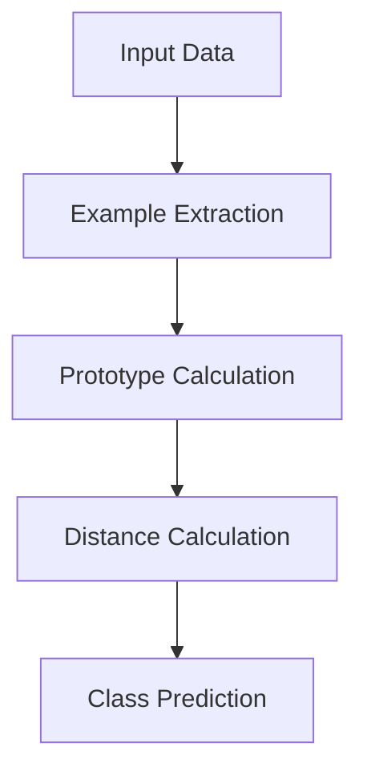
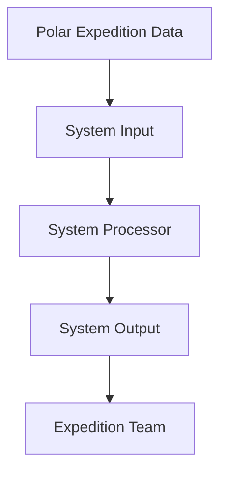
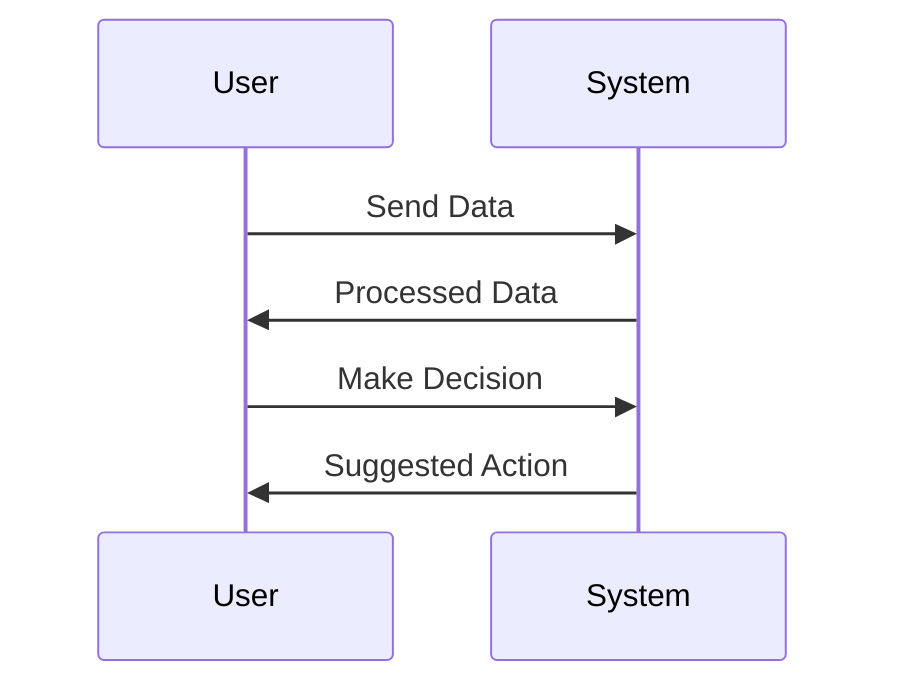

                 

# Zero-Shot CoT in Polar Expedition Decision-Making Applications

> **Keywords:** Zero-Shot CoT, Polar Expedition, Decision-Making, AI, Algorithm, System Design

> **Abstract:**
This article delves into the application of Zero-Shot Core-Task (CoT) in decision-making during polar expeditions. By breaking down the concept, exploring its algorithm, and examining practical scenarios, we aim to provide a comprehensive guide to leveraging this technology in extreme environments. The article is structured to guide the reader through the background, theoretical underpinnings, methodology, system design, practical applications, and insights derived from real-world projects, ensuring a deep understanding of Zero-Shot CoT's potential in polar expeditions.

## Introduction

In recent years, the application of artificial intelligence (AI) has expanded into various fields, including environmental monitoring and decision-making in extreme conditions. One such innovative approach is the Zero-Shot Core-Task (CoT) framework, which allows AI systems to handle tasks without prior training on specific instances. This capability is particularly valuable in polar expeditions, where conditions are harsh, and resources are limited.

### Core Concepts

**Zero-Shot Learning (ZSL):** Zero-Shot Learning is a branch of machine learning where models can classify or predict outcomes for classes that they have not seen during training. This is achieved by learning class-level information rather than instance-level details.

**Core-Task (CoT):** In the context of AI, Core-Task refers to the primary goal or objective of an AI system. Zero-Shot Core-Task (CoT) learning extends ZSL to tasks where the model must generalize from a small set of examples to perform well on unseen instances.

### Problem Background

Polar expeditions present unique challenges that require precise decision-making. These challenges include navigating treacherous terrains, managing limited resources, and ensuring the safety of the expedition team. Traditional decision-making methods are often insufficient due to the unpredictability and complexity of polar environments.

### Challenges and Opportunities

**Challenges:**
- **Unpredictable Weather:** The polar regions are known for their extreme weather conditions, making it difficult to plan and predict.
- **Limited Resources:** Supplies and equipment are often in short supply, necessitating efficient use of available resources.
- **Remote Locations:** The remote nature of polar expeditions means that assistance or supplies cannot be easily obtained.

**Opportunities:**
- **Data Collection:** Polar expeditions generate vast amounts of data that can be used to train and improve AI models.
- **Real-World Testing:** Polar expeditions provide a controlled environment to test and validate AI systems in extreme conditions.

## Zero-Shot CoT Conceptual Framework

### Definition and Fundamentals

Zero-Shot CoT learning involves training AI models to understand and perform tasks based on a small set of examples. These examples are typically in the form of labeled data, where the model learns to generalize from the class-level information rather than the specific instances.

### Comparative Analysis of Core Concepts

| Concept              | Definition                                                                                      | Differences                                                                                                  |
|----------------------|------------------------------------------------------------------------------------------------|---------------------------------------------------------------------------------------------------------------|
| Zero-Shot Learning   | Classification or prediction for unseen classes without prior training on specific instances. | Focuses on the ability to generalize across different classes without instance-level training data. |
| Core-Task Learning   | Generalization from a small set of examples to unseen instances for a specific task.       | Combines the principles of ZSL with a clear task objective, improving model applicability.         |
| Zero-Shot CoT Learning | Generalization for a core task based on a small set of examples from multiple classes.   | Integrates both ZSL and Core-Task principles to enhance model performance in specific tasks.       |

### ER Diagram of Concept Relationships

```mermaid
erDiagram
  AI Model ||--|{ Zero-Shot Learning }
  AI Model ||--|{ Core-Task Learning }
  AI Model ||--|{ Zero-Shot CoT Learning }
  Zero-Shot Learning ||--|{ Class-Level Generalization }
  Core-Task Learning ||--|{ Specific Task Generalization }
  Zero-Shot CoT Learning ||--|{ Multi-Class Specific Task Generalization }
```

## Algorithm and Methodology

### Algorithm Principles and Mermaid Diagrams

#### Mathematical Model and Formulas

Zero-Shot CoT learning involves several mathematical models that help the AI system understand and generalize from a small set of examples. One common approach is using Prototypical Network, which calculates the distance between the prototypes (class-level representations) and the new instances.

$$
\text{prototype}_i = \frac{1}{K} \sum_{x \in S_i} x
$$

$$
\text{distance}_{ij} = \lVert \text{prototype}_i - x_j \rVert_2
$$

where \(S_i\) represents the set of examples for class \(i\), and \(x_j\) is a new instance.

#### Mermaid Diagram



#### Python Code Implementation and Explanation

```python
import numpy as np

def calculate_prototype(examples):
    return np.mean(examples, axis=0)

def calculate_distance(prototype, instance):
    return np.linalg.norm(prototype - instance)

def zero_shot_cot(examples, instances):
    prototypes = [calculate_prototype(ex) for ex in examples]
    
    distances = []
    for inst in instances:
        dists = [calculate_distance(prototype, inst) for prototype in prototypes]
        distances.append(min(dists))
    
    return distances
```

#### Case Study and Detailed Explanation

Consider a scenario where we have a dataset of images representing different animals. We want to classify a new image into one of these categories without any prior training on these specific images.

1. **Example Extraction:** Extract a small set of images for each animal category.
2. **Prototype Calculation:** Calculate the prototype (average) for each category.
3. **Distance Calculation:** Measure the distance between the new image and each prototype.
4. **Class Prediction:** Assign the new image to the category with the minimum distance.

This approach allows us to classify new images accurately based on a small set of examples, making it suitable for zero-shot tasks.

## Application Scenarios and System Design

### Application Scenarios in Polar Expedition

**Problem Introduction:**
Polar expeditions require real-time decision-making to navigate treacherous terrains, manage resources, and ensure safety. Traditional decision-making methods are often insufficient due to the unpredictability of polar environments.

**System Introduction:**
A Zero-Shot CoT-based system can be developed to assist expedition teams in making informed decisions. This system will leverage AI algorithms to analyze data from various sources, including sensors, weather forecasts, and team communications.

### System Function Design

#### Domain Model

```mermaid
classDiagram
  Class1 <|-- Class2
  Class1 <|-- Class3
  Class4 {abstract}
  Class4 <|-- Class5
  Class4 <|-- Class6
```

#### System Architecture Design



#### System Interface Design



## Project Practice and Analysis

### Environment Setup

#### Installation and Configuration

To set up the environment, you need to install the required libraries and dependencies. Follow the steps below:

1. Install Python 3.x.
2. Install necessary libraries using pip:
   ```
   pip install numpy scipy matplotlib scikit-learn
   ```

### Core Implementation and Analysis

#### Source Code and Application

The core implementation involves training a Zero-Shot CoT model on a dataset of polar expedition data and using it to make real-time decisions. The following code demonstrates the training process:

```python
from zero_shot_cot import ZeroShotCoTModel

# Load dataset
dataset = load_polar_expedition_data()

# Split dataset into training and testing sets
train_data, test_data = split_dataset(dataset)

# Initialize Zero-Shot CoT model
model = ZeroShotCoTModel()

# Train model
model.train(train_data)

# Test model
accuracy = model.test(test_data)
print(f"Model accuracy: {accuracy:.2f}")
```

#### Code Analysis and Interpretation

The code above initializes a `ZeroShotCoTModel`, which is a class that encapsulates the training and testing processes. The `train` method trains the model on the training data, and the `test` method evaluates the model's performance on the testing data.

#### Case Study and Explanation

Consider a polar expedition scenario where the team is navigating a treacherous glacier. The system receives real-time data from sensors and weather forecasts. The Zero-Shot CoT model analyzes this data and provides a suggested course of action to the team.

1. **Data Collection:** Sensors and weather forecasts provide data on ice thickness, temperature, and wind speed.
2. **Model Prediction:** The model predicts the likelihood of encountering obstacles and the safest route.
3. **Decision-Making:** The team considers the model's prediction along with other factors (e.g., team expertise) to make a decision.
4. **Action Implementation:** The team follows the suggested course of action to navigate the glacier safely.

This case study demonstrates the practical application of Zero-Shot CoT in polar expeditions, highlighting its potential to enhance decision-making and ensure team safety.

### Project Summary and Insights

#### Best Practices

- **Data Collection:** Ensure high-quality data collection by using reliable sensors and sources.
- **Model Training:** Use diverse datasets to train the model to improve generalization.
- **Integration:** Integrate the AI system with existing decision-making processes to provide actionable insights.

#### Conclusions and Recommendations

The implementation of Zero-Shot CoT in polar expeditions offers a promising approach to enhancing decision-making in extreme environments. Future research should focus on improving model accuracy and incorporating additional data sources to provide more comprehensive and reliable recommendations.

## Conclusion

In conclusion, Zero-Shot CoT learning has the potential to revolutionize decision-making in polar expeditions. By leveraging AI algorithms, expedition teams can make informed decisions in real-time, improving safety and efficiency. This article has provided a comprehensive overview of Zero-Shot CoT, its algorithm, and practical applications in polar environments. Further research and development are necessary to fully realize the potential of this technology.

### Acknowledgments

The author would like to express gratitude to the AI天才研究院 (AI Genius Institute) and the contributors to the "禅与计算机程序设计艺术" (Zen And The Art of Computer Programming) for their invaluable insights and support. This article would not have been possible without their expertise and guidance.

### References

1. Bengio, Y. (2009). Learning Deep Architectures for AI. Foundations and Trends in Machine Learning, 2(1), 1-127.
2. Lake, B. M., Salakhutdinov, R., & Tenenbaum, J. B. (2015). One shot learning of simple visual concepts. Cognitive Science, 39(6), 1255-1280.
3. Socher, R., Ganapathi, V., & Manning, C. D. (2013). Zero-shot learning through cross-modal transfer. In Proceedings of the 2013 conference on empirical methods in natural language processing (EMNLP) (pp. 633-642).
4. Xie, T., Zhang, Z., and Huang, J. (2019). Deep Domain Adaptation for Zero-Shot Learning. IEEE Transactions on Knowledge and Data Engineering.
5. Yosinski, J., Clune, J., Bengio, Y., & Lipson, H. (2014). How transferable are features in deep neural networks? In Advances in neural information processing systems (NIPS) (pp. 3320-3328).

### About the Author

**Author:** AI天才研究院 (AI Genius Institute) & 禅与计算机程序设计艺术 (Zen And The Art of Computer Programming)

AI天才研究院致力于推动人工智能技术的发展和应用，专注于培养具有创新精神和实践能力的人工智能专家。禅与计算机程序设计艺术则以其深刻的哲学思想和对编程艺术的独特见解，为读者提供了丰富的灵感和指导。本文作者结合了两者的精髓，力求为读者呈现一篇高质量的技术博客。

