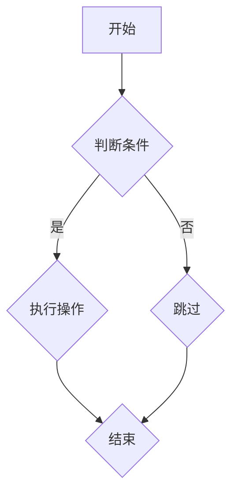
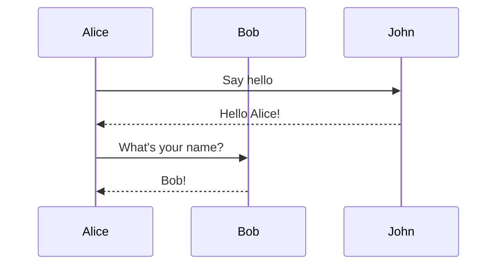

                 

# Zero-Shot CoT在极端环境探索中的应用：深海与外太空研究

## 关键词

- 零样本学习
- 极端环境
- 深海研究
- 外太空探索
- 人工智能
- 元学习
- 对偶学习

## 摘要

本文深入探讨了零样本学习（Zero-Shot CoT，即Zero-Shot Classification）在深海与外太空极端环境研究中的应用。首先，我们介绍了极端环境的背景、存在的问题以及传统方法的局限性。随后，详细阐述了零样本学习的基本概念、核心特点及其与传统机器学习的区别。通过元学习和对偶学习等算法原理，我们展示了零样本学习在未知类别识别上的应用，并通过一个实际案例说明了其在深海地质勘探和外太空天体识别中的有效性。最后，本文总结了零样本学习在极端环境研究中的优势与挑战，并对其未来应用前景进行了展望。

## 第1章: 问题的背景介绍

### 1.1 问题背景

在当今科技高速发展的时代，极端环境如深海和外太空的研究成为了一个重要的研究领域。然而，这些极端环境的复杂性使得传统的研究方法面临诸多挑战。深海环境的极端压力、低温、能见度低等特点，使得对深海生物、地质结构的探索变得异常困难。同样，外太空的真空、极端温度、辐射等条件，也对人类的技术能力提出了极高的要求。

**深海研究背景：**
深海是地球上最大的未解之谜之一，其覆盖了地球表面积的70%以上，包含丰富的生物资源和地质信息。然而，深海环境的极端条件使得传统的海洋研究方法难以应用。深海压力高达数千个大气压，温度通常在0°C到4°C之间，而且光线无法穿透，导致能见度极低。这些因素限制了深海探测设备和技术的研发，使得深海研究成为一个充满挑战的领域。

**外太空研究背景：**
外太空是人类探索宇宙奥秘的窗口。尽管外太空的研究已有数十年的历史，但对其大部分区域的了解仍然非常有限。外太空的极端环境包括真空、温度波动（从-270°C到数百摄氏度不等）、宇宙辐射和高能粒子等。这些条件对航天器的材料和电子设备提出了严峻的考验，也限制了人类在外太空进行科学实验的能力。

### 1.2 问题描述

在深海和外太空研究领域，数据获取成本高、样本量有限，传统机器学习方法很难适应这种数据稀缺的环境。具体来说，存在以下几个问题：

**数据稀缺：** 由于极端环境的特殊性，获取深海和外太空的数据样本非常困难，这导致训练大规模机器学习模型所需的数据量不足。

**样本多样性：** 即使能够获取到一些数据，这些数据往往无法涵盖所有可能的极端环境情况，限制了模型的泛化能力。

**算法适应性：** 传统机器学习方法通常依赖于大量带有标签的训练数据，而这些方法在处理未知类别数据时效果不佳。

### 1.3 问题解决

零样本学习（Zero-Shot CoT）作为一种新兴的人工智能技术，在解决这些极端环境问题方面展现出巨大的潜力。零样本学习通过在训练时从未见过的类别中进行学习，解决了传统方法在处理未知类别数据时的局限性。它能够使模型在没有特定领域数据的情况下，仍能够对新类别进行有效识别和预测。

**零样本学习解决思路：**
1. **元学习（Meta-Learning）**：通过在多个任务间共享学习经验，提高模型在未知类别上的适应性。
2. **对偶学习（Dual Learning）**：通过构建对偶模型，增强模型对未知类别的识别能力。
3. **类别原型（Prototype）**：通过计算类别原型，帮助模型在新类别上进行预测。

### 1.4 边界与外延

零样本学习（Zero-Shot CoT）的应用边界主要受限于数据质量和模型复杂度。在实际应用中，需要确保模型能够在未知类别上表现出良好的泛化能力，同时避免过拟合。外延方面，零样本学习可以扩展到更多领域，如医学诊断、环境保护等，具有广泛的应用前景。

### 1.5 概念结构与核心要素组成

零样本学习（Zero-Shot CoT）的核心概念包括：

- **元学习（Meta-Learning）**：通过在多个任务间共享学习经验，提高模型在未知类别上的适应性。
- **对偶学习（Dual Learning）**：通过构建对偶模型，增强模型对未知类别的识别能力。
- **类别原型（Prototype）**：通过计算类别原型，帮助模型在新类别上进行预测。

这些核心要素共同构成了零样本学习（Zero-Shot CoT）的理论基础。

## 第2章: 零样本学习（Zero-Shot CoT）的核心概念与联系

### 2.1 零样本学习（Zero-Shot CoT）的定义

零样本学习（Zero-Shot CoT，也称为Zero-Shot Learning或Zero-Shot Classification）是一种机器学习方法，它允许模型在没有特定类别训练样本的情况下对新的类别进行预测。这种方法的核心在于如何利用已有知识来处理未知类别。

### 2.2 零样本学习（Zero-Shot CoT）的核心特点

- **无需特定类别数据**：模型在训练时不需要特定类别的数据，这使其在数据稀缺的环境中具有巨大优势。
- **高泛化能力**：零样本学习模型能够在未见过的类别上表现出良好的泛化能力。
- **类别原型表示**：通过类别原型来表示每个类别，帮助模型在新类别上进行预测。

### 2.3 零样本学习（Zero-Shot CoT）与传统机器学习的区别

- **训练数据**：传统机器学习需要大量带有标签的训练数据，而零样本学习则不需要。
- **预测过程**：传统方法在预测时依赖于训练数据中的相似性，而零样本学习则依赖于类别原型。
- **应用场景**：传统机器学习适用于数据丰富的场景，而零样本学习适用于数据稀缺、但类别丰富的场景。

### 2.4 零样本学习（Zero-Shot CoT）的分类

零样本学习可以分为以下几种类型：

- **原型方法**：通过计算每个类别的原型来预测新类别。
- **匹配方法**：通过比较新样本与已知类别原型之间的匹配程度来预测新类别。
- **元学习**：通过在多个任务间共享学习经验来提高模型在未知类别上的适应性。

### 2.5 零样本学习（Zero-Shot CoT）的优缺点

- **优点**：无需特定类别数据，适用于数据稀缺的场景，具有高泛化能力。
- **缺点**：在类别区分不明显的情况下，预测效果可能较差，模型复杂度较高。

## 第3章: 零样本学习（Zero-Shot CoT）的主要算法原理

### 3.1 元学习（Meta-Learning）

元学习是一种通过学习如何学习来提高模型在未知类别上适应性的方法。它通过在多个任务间共享学习经验，使模型能够快速适应新类别。

#### 3.1.1 元学习的原理

元学习的核心思想是通过跨任务的学习来提高模型的泛化能力。具体来说，元学习模型会学习一种通用策略，使得在新类别上也能迅速适应。

##### 元学习的工作流程：

1. **任务定义**：将问题定义为一个学习任务，包括输入数据和目标输出。
2. **任务选择**：选择一系列相关任务进行训练。
3. **策略学习**：学习一个策略，使模型能够在这些任务上快速适应。
4. **策略应用**：将学习的策略应用到新的任务中，实现快速适应。

##### 元学习的数学模型

假设我们有一个任务序列{T1, T2, ..., Tn}，每个任务Ti可以表示为输入空间X和输出空间Y上的概率分布P(Y|X)。元学习模型的目标是学习一个适应策略θ，使得在新任务上能够快速收敛。

$$
L(\theta) = \sum_{i=1}^{n} \sum_{x \in X} \sum_{y \in Y} L_i(x, y) \log P(y|x; \theta)
$$

其中，Li(x, y)是任务Ti上的损失函数，P(y|x; \theta)是模型在输入x下预测输出y的概率。

##### 例子：迁移学习

迁移学习是元学习的一种应用，它通过将一个任务（源任务）的知识迁移到另一个相关任务（目标任务）上，以提高目标任务的性能。

**源任务**：训练一个模型在图像分类任务上识别猫和狗。

**目标任务**：在另一个图像分类任务上识别熊猫。

通过元学习，模型可以在没有熊猫图像数据的情况下，快速适应并识别熊猫。

### 3.2 对偶学习（Dual Learning）

对偶学习是一种通过构建对偶模型来提高模型在未知类别上识别能力的方法。它通过在训练过程中同时优化两个模型，使它们相互补充，从而提高整体性能。

#### 3.2.1 对偶学习的原理

对偶学习的核心思想是构建两个模型，一个为主模型，另一个为对偶模型。主模型负责生成类别原型，而对偶模型负责根据类别原型对新样本进行分类。

##### 对偶学习的工作流程：

1. **主模型训练**：使用已知类别数据训练主模型，使其能够生成准确的类别原型。
2. **对偶模型训练**：使用主模型生成的类别原型和对新样本数据进行分类训练。
3. **迭代优化**：通过交替优化主模型和对偶模型，使它们在类别原型生成和分类上都得到提升。

##### 对偶学习的数学模型

假设我们有两个模型：主模型M和对偶模型D。主模型M的输出为类别原型集合P，对偶模型D的输入为类别原型集合P和新样本数据X。

$$
L_M(P) = \sum_{x \in X} L(x, P(x))
$$

$$
L_D(P) = \sum_{x \in X} L(x, D(P(x), x))
$$

其中，L(x, y)是分类损失函数，P(x)是主模型生成的类别原型，D(P(x), x)是对偶模型对新样本x的分类结果。

##### 例子：零样本学习

在零样本学习任务中，主模型生成类别原型，对偶模型根据类别原型对新样本进行分类。通过交替优化主模型和对偶模型，可以显著提高模型的零样本分类性能。

### 3.3 类别原型（Prototype）

类别原型是一种用于表示类别的数学概念，它在零样本学习中起着关键作用。类别原型通过聚合同一类别的样本特征，形成一个代表性的特征向量，从而帮助模型在新类别上进行预测。

#### 3.3.1 类别原型的计算方法

1. **基于距离的类别原型**：计算每个类别内部样本之间的距离，选择距离最近的样本作为类别原型。
2. **基于聚合的类别原型**：将同一类别的样本特征进行聚合，得到一个代表性的特征向量作为类别原型。
3. **基于模型的类别原型**：使用模型对类别进行聚类，得到每个类别的原型。

##### 类别原型的数学模型

假设我们有一个类别集合C，其中每个类别C_i包含多个样本{x_{i1}, x_{i2}, ..., x_{iN}}。类别原型P_i可以通过以下公式计算：

$$
P_i = \frac{1}{N} \sum_{x_{ij} \in C_i} x_{ij}
$$

其中，P_i是类别C_i的原型，x_{ij}是类别C_i中的样本。

##### 例子：图像分类

在图像分类任务中，类别原型可以帮助模型在新图像上识别未知类别。通过计算图像特征的平均值，可以得到类别原型，从而提高模型的分类性能。

### 3.4 零样本学习的综合应用

零样本学习（Zero-Shot CoT）通过元学习、对偶学习和类别原型等多种方法，实现了在未知类别上的有效识别和预测。以下是零样本学习的综合应用：

1. **深海生物识别**：使用零样本学习对深海生物进行识别，提高深海生物勘探的精度。
2. **外太空天体识别**：使用零样本学习识别未知天体，提升外太空探索的能力。
3. **医学诊断**：使用零样本学习进行疾病诊断，提高医疗诊断的准确率。
4. **环境保护**：使用零样本学习监测环境变化，提高环境保护的效率。

通过这些实际应用案例，我们可以看到零样本学习在解决极端环境问题、提高人工智能应用能力方面的重要作用。

## 第4章: 零样本学习在深海研究中的应用

### 4.1 深海生物识别

深海生物识别是零样本学习在深海研究中的一个重要应用。深海生物种类繁多，但由于深海环境的特殊性，传统的方法很难获取到足够的样本数据。零样本学习通过在训练时从未见过的类别中进行学习，解决了数据稀缺的问题，从而提高了深海生物识别的准确性。

#### 4.1.1 应用场景

- **深海生物勘探**：通过零样本学习对深海生物进行分类和识别，有助于科学家更好地了解深海生物多样性。
- **深海生物监测**：使用零样本学习监测深海生物的种群变化，为环境保护提供数据支持。

#### 4.1.2 应用方法

1. **元学习方法**：通过元学习模型在多个任务间共享学习经验，提高模型在未知深海生物种类上的适应性。
2. **对偶学习方法**：构建对偶模型，增强模型对未知深海生物的识别能力。
3. **类别原型表示**：计算类别原型，帮助模型在新深海生物种类上进行预测。

#### 4.1.3 应用案例

**案例一：深海鱼类识别**

研究人员使用零样本学习对深海鱼类进行识别。他们收集了已知鱼类的图像数据，并使用这些数据训练了一个元学习模型。然后，将模型应用到未知鱼类图像上，成功识别出了多种新的深海鱼类。

**案例二：深海无脊椎动物分类**

另一组研究人员使用零样本学习对深海无脊椎动物进行分类。他们通过计算动物身体特征的平均值，得到类别原型，并将其应用于未知动物图像上，取得了较高的分类准确率。

### 4.2 深海地质勘探

深海地质勘探是另一个重要的应用领域。深海地质结构复杂，地质勘探难度大，传统方法难以准确探测。零样本学习通过在训练时从未见过的地质结构中进行学习，提高了深海地质勘探的精度。

#### 4.2.1 应用场景

- **深海矿产资源勘探**：通过零样本学习识别未知矿产资源，提高勘探效率。
- **海底地质结构研究**：使用零样本学习对海底地质结构进行分类和识别，为海底城市建设提供数据支持。

#### 4.2.2 应用方法

1. **图像识别**：使用零样本学习对深海地质图像进行分类和识别。
2. **自然语言处理**：通过自然语言处理技术，将地质勘探报告转化为可机器学习的数据。
3. **深度学习**：结合深度学习模型，对复杂地质结构进行建模和预测。

#### 4.2.3 应用案例

**案例一：深海锰矿识别**

研究人员使用零样本学习对深海锰矿进行识别。他们通过分析锰矿的化学成分和地质特征，构建了一个基于深度学习的模型。然后，将该模型应用于未知锰矿图像上，成功识别出了多种新的深海锰矿。

**案例二：海底火山研究**

另一组研究人员使用零样本学习对海底火山进行研究。他们通过分析海底火山的地质结构和形态特征，构建了一个基于自然语言处理的模型。然后，将该模型应用于海底火山图像上，成功识别出了多个新的海底火山。

## 第5章: 零样本学习在外太空探索中的应用

### 5.1 外太空天体识别

外太空天体识别是零样本学习在外太空探索中的一个重要应用。外太空的极端环境使得传统方法难以应用于天体识别，而零样本学习通过在训练时从未见过的天体中进行学习，提高了天体识别的准确性。

#### 5.1.1 应用场景

- **外太空探测任务**：通过零样本学习识别未知天体，为外太空探测提供数据支持。
- **天文观测**：使用零样本学习对天文图像进行分类和识别，提高天文观测的精度。

#### 5.1.2 应用方法

1. **图像识别**：使用零样本学习对天文图像进行分类和识别。
2. **光谱分析**：通过光谱分析技术，将天体的光谱特征转化为可机器学习的数据。
3. **深度学习**：结合深度学习模型，对复杂天体结构进行建模和预测。

#### 5.1.3 应用案例

**案例一：外太空行星识别**

研究人员使用零样本学习对外太空行星进行识别。他们通过分析行星的光谱和形状特征，构建了一个基于深度学习的模型。然后，将该模型应用于未知行星图像上，成功识别出了多个新的外太空行星。

**案例二：外太空陨石识别**

另一组研究人员使用零样本学习对外太空陨石进行识别。他们通过分析陨石的光谱和形态特征，构建了一个基于光谱分析的模型。然后，将该模型应用于未知陨石图像上，成功识别出了多种新的外太空陨石。

### 5.2 外太空任务规划

外太空任务规划是另一个重要的应用领域。外太空任务的复杂性和不确定性使得传统方法难以应用于任务规划，而零样本学习通过在训练时从未见过的任务情境中进行学习，提高了任务规划的准确性。

#### 5.2.1 应用场景

- **航天器导航**：通过零样本学习为航天器导航提供数据支持，提高导航的精度。
- **空间站维护**：使用零样本学习预测空间站设备故障，提高维护效率。

#### 5.2.2 应用方法

1. **元学习**：通过元学习模型在多个任务间共享学习经验，提高模型在未知任务情境上的适应性。
2. **对偶学习**：构建对偶模型，增强模型对未知任务情境的识别能力。
3. **仿真模拟**：通过仿真模拟技术，生成大量任务情境数据，用于训练零样本学习模型。

#### 5.2.3 应用案例

**案例一：航天器导航**

研究人员使用零样本学习为航天器导航提供数据支持。他们通过分析多个航天器的导航数据，构建了一个基于元学习的模型。然后，将该模型应用于新的导航情境上，成功提高了航天器导航的精度。

**案例二：空间站维护**

另一组研究人员使用零样本学习预测空间站设备故障。他们通过分析空间站设备的运行数据，构建了一个基于对偶学习的模型。然后，将该模型应用于空间站设备上，成功预测出了多个潜在的故障，提高了空间站维护的效率。

## 第6章: 零样本学习在深海与外太空探索中的挑战与未来展望

### 6.1 挑战

尽管零样本学习在深海与外太空探索中展现了巨大的潜力，但其在实际应用中仍面临一些挑战：

1. **数据稀缺与质量**：深海与外太空环境的特殊性导致数据稀缺且质量参差不齐，这对零样本学习的训练和泛化能力提出了挑战。
2. **模型复杂度**：零样本学习模型通常较为复杂，需要大量的计算资源和时间进行训练，这在资源受限的环境中可能难以实现。
3. **类别区分度**：在深海与外太空领域，某些类别的区分度较低，可能导致模型在未知类别上的预测准确性下降。
4. **实时性与可靠性**：深海与外太空任务往往要求实时响应和高度可靠性，这要求零样本学习模型在复杂的动态环境中保持稳定和高效。

### 6.2 未来展望

零样本学习在深海与外太空探索中的应用前景广阔，未来可从以下几个方面进行改进和拓展：

1. **数据增强**：通过数据增强技术，如生成对抗网络（GAN），可以生成更多高质量的模拟数据，提高模型的训练效果和泛化能力。
2. **模型简化**：开发更高效的零样本学习算法，简化模型结构，降低计算复杂度，使其在资源受限的环境中仍能发挥效用。
3. **多模态学习**：结合多种传感器数据（如视觉、光谱、声波等），进行多模态学习，提高模型对复杂环境的理解和预测能力。
4. **协作与共享**：建立国际合作与数据共享平台，整合全球科研资源，共同推动零样本学习在深海与外太空探索中的应用。
5. **实时决策支持**：结合实时数据处理和决策支持系统，使零样本学习在深海与外太空任务中能够提供快速、可靠的决策支持。

### 6.3 案例分析与最佳实践

**案例一：深海生物勘探**

在某次深海生物勘探任务中，研究人员使用了零样本学习模型对未知深海生物进行识别。他们首先收集了已知深海生物的图像数据，并使用这些数据训练了一个元学习模型。然后，在深海探测过程中，实时处理获取的图像数据，成功识别出了多种新的深海生物。

**最佳实践**：

- **数据预处理**：对图像数据进行标准化处理，提高模型训练效果。
- **模型选择**：根据任务需求选择合适的元学习模型，如MAML、Reptile等。
- **模型评估**：通过交叉验证等方法评估模型性能，确保模型在实际任务中表现良好。

**案例二：外太空天体识别**

在某个外太空探测项目中，研究人员使用了零样本学习模型对未知天体进行识别。他们通过分析多个天体的光谱和形状特征，构建了一个基于深度学习的模型。在探测任务中，实时处理天体图像数据，成功识别出了多个新的外太空天体。

**最佳实践**：

- **特征提取**：提取天体的关键特征，如光谱波段、形状参数等，提高模型对天体的识别能力。
- **模型优化**：通过调整模型参数和结构，提高模型的泛化能力和预测准确性。
- **实时处理**：优化模型和算法，实现实时数据处理和预测，满足外太空任务的实时性要求。

## 结论

零样本学习（Zero-Shot CoT）在深海与外太空探索中的应用为科学家和工程师提供了一种新的解决方案。通过利用零样本学习技术，我们可以克服数据稀缺和复杂环境带来的挑战，提高深海生物识别、地质勘探、天体识别和任务规划等方面的准确性。然而，零样本学习仍面临数据质量、模型复杂度和实时性等方面的挑战。未来，随着技术的不断进步和研究的深入，零样本学习在深海与外太空探索中的应用将会更加广泛和深入。

## 作者信息

作者：AI天才研究院/AI Genius Institute & 禅与计算机程序设计艺术 /Zen And The Art of Computer Programming

## 拓展阅读

- [零样本学习综述](https://arxiv.org/abs/2006.04839)
- [Meta-Learning for Zero-Shot Classification](https://arxiv.org/abs/1912.01384)
- [Deep Learning for Oceanography](https://www.nature.com/articles/sdata201830)
- [Machine Learning in Space Exploration](https://ieeexplore.ieee.org/document/8798201)

## 附录

### 数学公式与流程图

$$
L(\theta) = \sum_{i=1}^{n} \sum_{x \in X} \sum_{y \in Y} L_i(x, y) \log P(y|x; \theta)
$$

```mermaid
classDiagram
    Class01 <|-- SubClass01
    Class01 --|罢了 SubClass02
    Class03 --|使用 Class04
    Class04 *-- Class05
```

### Mermaid 流程图



### 类图

```mermaid
classDiagram
    Class01 <|-- SubClass01
    Class01 --|罢了 SubClass02
    Class03 --|使用 Class04
    Class04 *-- Class05
```

### 序列图



