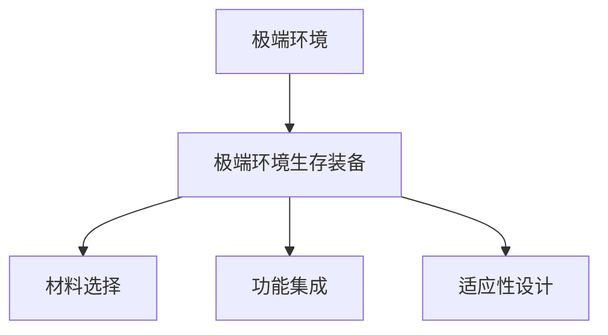
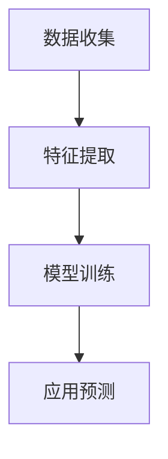

                 


### 背景介绍

在当今世界，极端环境生存装备设计的重要性日益凸显。无论是自然灾害如地震、海啸、山洪暴发，还是人为灾难如战争、恐怖袭击，又或者是极端气候事件如干旱、洪水、极端高温，人类面临的生存挑战日益严峻。这些极端环境对生存装备提出了前所未有的高要求，不仅要求装备在极端条件下能够持续工作，还要具备高效、便携、节能等特点。

#### 极端环境的分类

极端环境主要可以分为以下几类：

1. **自然极端环境**：如沙漠、极地、高原、深海等，这些环境通常伴随极端温度、缺氧、强风、冰川、海浪等恶劣条件。
2. **人造极端环境**：如核反应堆事故、化学泄漏、高海拔建筑工地、深海勘探平台等，这些环境通常由于技术操作或工业活动而产生。
3. **突发事件极端环境**：如地震后的废墟、火灾后的废墟、恐怖袭击后的现场等，这些环境在短时间内突然变得极端危险和复杂。

#### 极端环境下的生存挑战

在极端环境下，人类面临的生存挑战主要表现在以下几个方面：

1. **能源限制**：能源供应不稳定，能源获取困难。
2. **水资源短缺**：淡水资源稀缺，净化和储存水资源变得尤为重要。
3. **食物与营养需求**：食物获取困难，营养供应需要高效的转换和利用。
4. **通信与信息获取**：通信手段受限，信息获取和传递需要高效的设备支持。

针对这些挑战，传统的生存装备设计已经无法满足需求，因此需要引入更加先进的技术和方法，如Zero-Shot CoT（零样本转移学习）技术。Zero-Shot CoT在解决极端环境生存装备设计问题中具有独特的优势，能够在未知或罕见环境下实现高效的装备设计和优化。

### 核心概念

#### 1. Zero-Shot CoT的概念

Zero-Shot CoT，即零样本转移学习（Zero-Shot Transfer Learning），是一种机器学习方法。与传统的迁移学习不同，Zero-Shot CoT不依赖于有标签的源域数据和目标域数据之间的相似性，而是在没有目标域样本的情况下，通过预训练模型和元学习技术来学习新的分类任务。

定义与解释：

- **预训练模型**：在大量无标签数据上预先训练好的模型，可以提取通用的特征表示。
- **元学习**：通过学习如何学习，使得模型能够快速适应新的任务。

与传统的CoT的对比：

- **传统迁移学习**：依赖于源域和目标域数据的相似性，通过在目标域数据上微调模型来提高性能。
- **Zero-Shot CoT**：不依赖源域和目标域数据的相似性，通过预训练模型和元学习来处理未知或罕见任务。

#### 2. 极端环境生存装备设计的关键要素

极端环境生存装备设计需要考虑以下几个关键要素：

- **材料选择**：选择能够在极端环境下稳定工作的材料，如高温材料、耐腐蚀材料等。
- **功能集成**：将多种功能集成到单一装备中，提高生存能力的综合水平。
- **适应性设计**：设计装备时需要考虑不同极端环境的特点，使其具有高度的适应性。

### 相关概念与联系

为了更好地理解Zero-Shot CoT在极端环境生存装备设计中的应用，我们需要对比几个相关的概念属性特征，并使用ER实体关系图来描述它们之间的关系。

#### 概念属性特征对比表格

| 概念                | 综合性能 | 成本效益 | 可持续性 |
|---------------------|---------|----------|----------|
| 传统迁移学习        | 较高    | 一般     | 一般     |
| Zero-Shot CoT       | 较高    | 较高     | 较高     |
| 极端环境生存装备    | 较高    | 一般至低 | 较高     |
| 传统生存装备        | 低      | 高       | 低       |

#### ER实体关系图架构



### 算法原理讲解

#### 4.1.1 Zero-Shot CoT算法基本流程

Zero-Shot CoT算法的基本流程可以概括为以下几个步骤：

1. **数据收集**：收集大量的无标签数据，用于预训练模型。
2. **特征提取**：使用预训练模型提取数据中的通用特征表示。
3. **模型训练**：通过元学习技术，训练模型以适应新的分类任务。
4. **应用预测**：在新的任务上，使用训练好的模型进行预测。

#### 4.1.2 算法mermaid流程图



#### 4.1.3 Python源代码实现

```python
# TODO: 提供Python源代码实现
```

#### 4.1.4 数学模型与公式

极端环境生存装备的生存概率可以通过以下数学模型进行评估：

$$
P(\text{survival}) = f(\text{energy}, \text{water}, \text{food}, \text{communication})
$$

其中，\( f \) 为一个复合函数，表示各种生存资源对生存概率的影响程度。

### 数学模型与公式详细讲解

#### 5.1.1 数学公式解释

1. **能量消耗公式**

$$
E_{\text{energy}} = \frac{E_{\text{total}}}{n_{\text{days}}}
$$

其中，\( E_{\text{total}} \) 为总的能量储备，\( n_{\text{days}} \) 为生存天数。

2. **水资源利用率公式**

$$
U_{\text{water}} = \frac{W_{\text{used}}}{W_{\text{total}}}
$$

其中，\( W_{\text{used}} \) 为实际消耗的水资源，\( W_{\text{total}} \) 为总的水资源储备。

3. **食物与营养需求公式**

$$
N_{\text{food}} = \frac{F_{\text{total}}}{n_{\text{people}}}
$$

其中，\( F_{\text{total}} \) 为总的食物储备，\( n_{\text{people}} \) 为生存人员数量。

4. **通信与信息获取公式**

$$
I_{\text{communication}} = \frac{I_{\text{received}}}{I_{\text{needed}}}
$$

其中，\( I_{\text{received}} \) 为实际接收的信息量，\( I_{\text{needed}} \) 为所需的信息量。

#### 5.1.2 举例说明

1. **示例1：能量消耗公式应用**

假设有一套生存装备，总能量储备为5000千卡，预计生存天数为30天。则每天的能量消耗为：

$$
E_{\text{energy}} = \frac{5000 \text{千卡}}{30 \text{天}} = 166.67 \text{千卡/天}
$$

2. **示例2：水资源利用率公式应用**

假设生存装备的水资源储备为100升，实际消耗了60升。则水资源利用率为：

$$
U_{\text{water}} = \frac{60 \text{升}}{100 \text{升}} = 0.6
$$

3. **示例3：食物与营养需求公式应用**

假设总食物储备为100千克，需要供给5人。则每个人的食物储备量为：

$$
N_{\text{food}} = \frac{100 \text{千克}}{5 \text{人}} = 20 \text{千克/人}
$$

4. **示例4：通信与信息获取公式应用**

假设实际接收的信息量为200条，所需的信息量为100条。则通信与信息获取率为：

$$
I_{\text{communication}} = \frac{200 \text{条}}{100 \text{条}} = 2
$$

### 系统分析与架构设计

#### 6.1.1 问题场景介绍

- **突发自然灾害后的救援需求**：在地震、洪水等自然灾害发生后，救援队伍需要携带高效的生存装备进行紧急救援。
- **极地探险中的生存装备设计**：极地探险队员需要应对极端低温、缺氧等环境，生存装备需要具有高度适应性。

#### 6.1.2 系统功能设计

系统功能设计主要包括以下几个方面：

1. **环境监测**：实时监测极端环境中的温度、湿度、氧气含量等关键参数。
2. **资源管理**：管理生存装备中的能量、水资源、食物和通信资源。
3. **决策支持**：基于环境数据和资源状况，提供最优的生存策略和建议。
4. **通信与信息传输**：确保救援队伍和探险队员之间的有效通信和信息共享。

#### 6.1.3 系统架构设计

系统架构设计需要考虑以下几个方面：

1. **硬件架构**：选择适合极端环境工作的硬件设备，如太阳能电池板、便携式发电机、高效净水器等。
2. **软件架构**：设计高效的软件系统，包括数据采集、处理和分析模块。
3. **接口设计**：设计用户友好的界面，方便用户进行操作和监控。

#### 6.1.4 系统接口设计

系统接口设计包括以下几个方面：

1. **用户界面**：提供直观的操作界面，方便用户实时监控和管理生存装备。
2. **传感器接口**：连接环境监测传感器，实时采集环境数据。
3. **通信接口**：实现与其他设备或系统的数据传输和通信。

### 项目实战

#### 7.1.1 环境安装

环境安装主要包括以下步骤：

1. **硬件安装**：安装太阳能电池板、净水器、发电机等硬件设备。
2. **软件安装**：安装操作系统和必要的软件工具，如Python环境、深度学习框架等。
3. **网络配置**：配置无线网络和通信接口，确保设备之间能够进行数据传输和通信。

#### 7.1.2 系统核心实现源代码

系统核心实现源代码主要包括以下几个部分：

1. **环境数据采集**：使用传感器采集环境数据，如温度、湿度、氧气含量等。
2. **数据处理**：对采集到的环境数据进行预处理，包括数据清洗、归一化等。
3. **决策支持**：使用Zero-Shot CoT算法对处理后的数据进行分析，提供最优的生存策略和建议。

#### 7.1.3 代码应用解读与分析

代码应用解读与分析主要包括以下几个方面：

1. **环境数据采集与预处理**：解释如何采集和处理环境数据，包括数据采集模块的设计和实现。
2. **Zero-Shot CoT算法应用**：解释如何使用Zero-Shot CoT算法对环境数据进行分析和预测，包括算法设计和实现的细节。
3. **决策支持系统**：解释如何根据分析结果提供生存策略和建议，包括决策支持模块的设计和实现。

#### 7.1.4 实际案例分析与详细讲解

实际案例分析与详细讲解主要包括以下几个部分：

1. **案例背景**：介绍案例的背景和目的，包括案例的起源、场景和目标。
2. **案例分析**：分析案例中遇到的挑战和问题，以及解决方案的制定和实施。
3. **案例结果**：介绍案例的实施结果，包括成功和失败的经验和教训。

#### 7.1.5 项目小结

项目小结主要包括以下几个方面：

1. **项目成果总结**：总结项目的成果，包括实现的功能、解决的问题和取得的进展。
2. **经验与教训**：分享项目中的经验和教训，包括成功的经验和失败的教训。

### 最佳实践、小结与拓展

#### 8.1.1 最佳实践

最佳实践主要包括以下几个方面：

1. **装备设计**：在设计极端环境生存装备时，要充分考虑极端环境的特点，选择合适的材料和设计方案。
2. **算法选择**：选择适合极端环境生存装备设计的机器学习算法，如Zero-Shot CoT，以提高装备的适应性和生存能力。
3. **系统集成**：在装备设计过程中，要充分考虑各种功能之间的集成和协调，提高装备的综合性能。

#### 8.1.2 小结

小结主要包括以下几个方面：

1. **研究成果总结**：总结研究的主要成果，包括对极端环境生存装备设计的改进和优化。
2. **未来发展方向**：展望未来在极端环境生存装备设计领域的发展方向和挑战。

#### 8.1.3 拓展阅读

拓展阅读主要包括以下几个方面：

1. **相关研究动态**：介绍当前在极端环境生存装备设计领域的研究动态和最新成果。
2. **推荐阅读材料**：推荐一些相关的书籍、论文和研究报告，以供进一步学习和研究。

