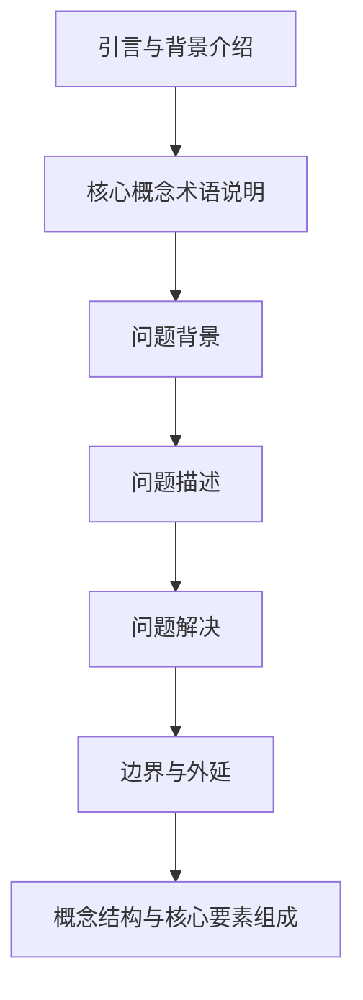

                 

### 第零部分：引言与背景介绍

在当今信息化时代，人工智能（AI）技术正在迅速改变着我们的生活方式和工作方式。然而，随着应用场景的复杂性和多样性增加，传统的机器学习模型在处理复杂任务时面临着性能瓶颈。在这种情况下，零样本学习（Zero-Shot Learning, ZSL）和基于上下文的决策理论（Contextual Decision Theory, CDT）成为了解决这一问题的有力工具。

#### 1.1.1 问题背景

传统的机器学习模型依赖于大量的训练数据来学习和适应。然而，在某些特殊场景下，如极限环境决策中，获取足够的训练数据变得极其困难。例如，在极端气候事件、资源匮乏场景等极限环境中，数据采集不仅成本高昂，而且可能存在安全隐患。这就需要我们寻找新的方法，使模型能够在没有直接训练数据的情况下，依然能够做出有效的决策。

零样本学习（ZSL）作为一种新兴的机器学习技术，旨在解决模型在没有直接训练数据的情况下，对未见过的类别进行有效学习的问题。而基于上下文的决策理论（CDT）则是一种在不确定环境中进行决策的理论框架，能够帮助我们在复杂、多变的环境中做出更加合理的决策。

#### 1.1.2 问题描述

在极限环境中，例如极端气候事件、资源匮乏场景等，传统决策模型往往无法胜任。这是因为传统模型依赖于大量的历史数据来训练，而极限环境下的数据稀缺且分布不均。因此，如何利用ZSL和CDT来提升极限环境下的决策能力，成为一个亟待解决的问题。

#### 1.1.3 问题解决

本书将深入探讨ZSL和CDT在极限环境决策中的应用。首先，我们将介绍ZSL的核心概念、原理及其在极限环境中的适用性。然后，我们将详细阐述CDT的基本理论，并探讨其在极限环境决策中的优势。接下来，通过具体案例，我们将展示如何将ZSL和CDT结合起来，解决极限环境决策中的实际问题。

#### 1.1.4 边界与外延

本书主要关注ZSL和CDT在极限环境决策中的应用，但这两个理论在其他领域（如医学诊断、自动驾驶等）也有广泛应用。因此，本书的研究不仅具有理论价值，也有一定的实际应用前景。

#### 1.1.5 概念结构与核心要素组成

- **零样本学习（ZSL）**：核心概念、原理、方法及应用。
- **基于上下文的决策理论（CDT）**：基本理论、方法及应用。
- **极限环境决策**：环境特点、挑战及解决方案。

### 核心概念术语说明

在深入探讨ZSL和CDT之前，我们需要对一些核心概念进行定义和说明。

- **零样本学习（Zero-Shot Learning, ZSL）**：一种机器学习技术，旨在让模型在没有直接训练数据的情况下，能够对未见过的类别进行有效学习。
- **基于上下文的决策理论（Contextual Decision Theory, CDT）**：一种在不确定环境中进行决策的理论框架，它考虑了决策环境中的各种因素，并通过概率模型进行决策。
- **极限环境决策**：指在极端条件下，如极端气候事件、资源匮乏场景等，需要模型进行决策的场景。

### 1.1.6 逻辑流程图

为了更好地理解ZSL和CDT在极限环境决策中的应用，我们可以使用Mermaid绘制一个逻辑流程图：

通过这个流程图，我们可以清晰地看到本书的结构和内容布局。

### 1.1.7 简要总结

本文首先介绍了ZSL和CDT在极限环境决策中的应用背景和核心概念，明确了本书的研究内容和目标。接下来，我们将分别介绍ZSL和CDT的基本原理，并通过具体案例展示它们在极限环境决策中的应用效果。通过这样的逻辑流程，读者可以逐步深入理解这两个理论，并掌握它们在复杂环境中的应用方法。

---

在接下来的章节中，我们将分别详细探讨ZSL和CDT的基本原理、应用案例以及它们在极限环境决策中的结合方法。敬请期待！

---

## 第零部分：引言与背景介绍

### 1.1.1 问题背景

随着人工智能技术的飞速发展，传统机器学习模型在处理复杂任务时面临着性能瓶颈。为了解决这一问题，零样本学习（Zero-Shot Learning, ZSL）和基于上下文的决策理论（Contextual Decision Theory, CDT）应运而生。ZSL旨在让模型在没有直接训练数据的情况下，能够对未见过的类别进行有效学习，而CDT则是一种在不确定环境中进行决策的理论框架。两者在极限环境决策中的应用具有重要意义。

#### ZSL的发展历程

零样本学习（ZSL）起源于机器学习领域，其核心思想是让模型在没有直接训练数据的情况下，能够对新类别进行识别和预测。这一概念最早由Lampert等人于2003年提出。ZSL的研究目标是在没有直接标记的样本数据的情况下，利用已有的知识库和有限的训练数据，对新的、未知的类别进行有效学习和预测。

ZSL的发展历程可以分为几个关键阶段：

1. **基于原型的方法**：最早期的ZSL方法主要基于原型表示，即将新类别的特征与训练数据中的原型进行比较。这种方法简单直观，但在处理复杂任务时效果不佳。
2. **基于语义的表示学习方法**：随着深度学习技术的发展，基于语义的表示学习方法逐渐成为主流。这种方法利用深度神经网络学习特征表示，将新类别的特征与训练数据中的语义表示进行比较，从而实现零样本学习。
3. **基于匹配度的方法**：近年来，基于匹配度的方法也开始得到广泛关注。这种方法通过计算新类别特征与训练数据特征之间的匹配度，来实现对新类别的预测。

#### CDT的理论框架

基于上下文的决策理论（CDT）是20世纪80年代由Richard C..atkinson和Richard B.aeculeian提出的。CDT旨在解决在不确定环境中进行决策的问题，其核心思想是通过考虑决策环境中的各种因素，构建一个概率模型，以支持决策者做出最优的选择。

CDT的理论框架主要包括以下几个关键组成部分：

1. **情境**：情境是决策过程中的基本单位，它包括决策者面临的选项、可能的结果以及概率分布。
2. **偏好**：偏好反映了决策者对各个选项和结果的偏好程度，通常可以用效用函数来表示。
3. **决策模型**：决策模型用于计算在不同情境下决策者应采取的最优行动。常见的决策模型包括最大期望效用模型（Maximin Expected Utility Model）和最大期望模型（Maximin Expected Utility Model）。
4. **概率模型**：概率模型用于预测不同情境下可能的结果和概率分布。常见的概率模型包括贝叶斯网络和马尔可夫决策过程。

#### 极限环境决策的意义

极限环境决策是指在极端条件下，如极端气候事件、资源匮乏场景等，需要模型进行决策的场景。这些场景具有数据稀缺、环境多变、决策难度大等特点，传统机器学习模型往往无法胜任。

极限环境决策的意义主要体现在以下几个方面：

1. **资源优化**：在资源匮乏场景下，如何合理分配有限的资源，是一个重要的决策问题。通过ZSL和CDT，我们可以构建高效的资源分配模型，实现资源的最优利用。
2. **灾害预测与应对**：极端气候事件如台风、洪水等对人类社会造成了巨大的损失。通过ZSL和CDT，我们可以提前预测灾害的发生，制定有效的应对策略，减少灾害损失。
3. **安全决策**：在安全领域，如网络安全、公共安全等，通过ZSL和CDT，我们可以构建智能决策系统，提高决策的准确性和响应速度。

### 1.1.2 问题描述

在极限环境中，例如极端气候事件、资源匮乏场景等，传统决策模型往往无法胜任。这是因为传统模型依赖于大量的历史数据来训练，而极限环境下的数据稀缺且分布不均。这就需要我们寻找新的方法，使模型能够在没有直接训练数据的情况下，依然能够做出有效的决策。

具体来说，极限环境决策面临以下几个主要问题：

1. **数据稀缺**：在极限环境下，如极端气候事件、资源匮乏场景等，数据采集非常困难，导致训练数据稀缺。这使得传统机器学习模型难以获得足够的信息，从而影响决策效果。
2. **环境多变**：极限环境下的情况复杂多变，决策环境不断变化。传统模型往往难以适应这种动态变化，导致决策失效。
3. **决策难度大**：极限环境下的决策通常涉及多个因素，且因素之间的关系复杂。传统模型难以处理这种复杂的决策问题，导致决策结果不理想。

### 1.1.3 问题解决

为了解决极限环境决策中的问题，我们可以利用零样本学习（ZSL）和基于上下文的决策理论（CDT）。以下是问题解决的详细方法：

1. **利用ZSL解决数据稀缺问题**：ZSL允许模型在没有直接训练数据的情况下，通过学习已有的知识库和有限的训练数据，对新类别进行有效学习和预测。这样可以大大减少对训练数据的依赖，提高模型在极限环境下的适用性。
   
2. **利用CDT解决环境多变和决策难度大问题**：CDT提供了一种在不确定环境中进行决策的理论框架，通过考虑决策环境中的各种因素，构建概率模型，实现最优决策。这样可以帮助我们应对极限环境下的复杂决策问题，提高决策的准确性和响应速度。

### 1.1.4 边界与外延

尽管本书主要关注ZSL和CDT在极限环境决策中的应用，但这两个理论在其他领域（如医学诊断、自动驾驶等）也有广泛应用。例如，在医学诊断中，ZSL可以帮助模型在没有直接患者数据的情况下，通过对已有的医学知识库进行学习，实现对新病例的准确诊断。在自动驾驶领域，CDT可以帮助车辆在复杂交通环境中，做出实时、最优的行驶决策。

### 1.1.5 概念结构与核心要素组成

为了更清晰地理解ZSL和CDT在极限环境决策中的应用，我们可以从以下几个核心概念和要素出发：

1. **零样本学习（ZSL）**：核心概念、原理、方法及应用。
2. **基于上下文的决策理论（CDT）**：基本理论、方法及应用。
3. **极限环境决策**：环境特点、挑战及解决方案。

通过以上核心概念和要素的阐述，我们可以为后续章节的深入讨论打下坚实的基础。在接下来的章节中，我们将分别详细探讨ZSL和CDT的基本原理、应用案例以及它们在极限环境决策中的结合方法。敬请期待！

---

在下一部分，我们将深入探讨零样本学习（ZSL）的基础概念和原理。通过了解ZSL的核心思想、方法和技术，我们将为后续的应用讨论提供坚实的理论基础。请继续关注！

