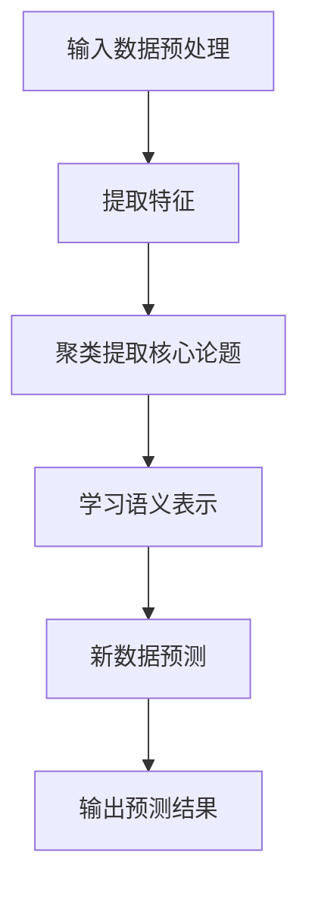

                 

# 零样本核心论题（Zero-Shot CoT）在极限环境决策支持中的潜力

关键词：零样本核心论题、极限环境、决策支持、机器学习、人工智能

摘要：本文探讨了零样本核心论题（Zero-Shot CoT）在极限环境决策支持中的潜力。首先，文章介绍了零样本核心论题的背景和定义，分析了其在极限环境下的决策支持的重要性。接着，文章详细阐述了零样本核心论题的原理、技术原理和实现方法。随后，文章使用Python代码和Mermaid流程图，解释了算法原理，并给出了数学模型和公式。此外，文章还介绍了系统架构设计、项目实战和最佳实践。最后，文章总结了文章的主要观点，并展望了未来的研究方向。

## 目录大纲设计思路

在设计《Zero-Shot CoT在极限环境决策支持中的潜力》的目录大纲时，我们首先需要理解书名和主题。书名中的“Zero-Shot CoT”指的是零样本核心论题，这是一种在无直接训练数据的情况下，能够识别和理解新概念的机器学习技术。“极限环境决策支持”则强调了这种技术在极端情况下的应用价值。

为了使目录大纲结构清晰、逻辑紧凑，我们遵循以下步骤：

1. **理解书名和主题**：确定核心章节，包括引言与背景、核心概念与技术原理、算法原理与实现、系统分析与架构设计、项目实战与案例分析、最佳实践与总结。
2. **设计章节细节**：确保内容全面且逻辑清晰。
3. **保证目录大纲字数限制**：总字数不超过2000字。

## 目录大纲设计

### 第一部分：引言与背景

**## 第1章：背景介绍**

- **1.1 问题的提出**
  - 问题描述
  - 问题解决
  - 边界与外延
- **1.2 极限环境下的决策挑战**
  - 挑战概述
  - 当前解决方案的局限性
- **1.3 Zero-Shot CoT的概念**
  - 定义
  - 关键特性
- **1.4 Zero-Shot CoT的应用潜力**
  - 潜力分析
  - 潜在应用领域

**## 第2章：核心概念与技术原理**

- **2.1 机器学习基础知识**
  - 基本概念
  - 关键算法
- **2.2 Zero-Shot CoT的原理**
  - 原理介绍
  - 工作机制
- **2.3 相关技术对比**
  - 与其他技术的对比
  - 优势与劣势

### 第二部分：算法原理与实现

**## 第3章：算法原理与流程图**

- **3.1 算法流程图绘制**
  - 使用mermaid绘制算法流程图
- **3.2 算法实现过程**
  - Python代码实现
  - 算法细节解释

**## 第4章：数学模型与公式解释**

- **4.1 数学模型介绍**
  - 模型概述
  - 数学公式
- **4.2 数学公式详细讲解**
  - 原理分析
  - 公式解释
- **4.3 举例说明**
  - 通俗易懂的举例

### 第三部分：系统分析与架构设计

**## 第5章：系统架构设计**

- **5.1 系统功能设计**
  - 领域模型类图
- **5.2 系统架构设计**
  - 架构图
- **5.3 系统接口设计**
  - 接口说明
- **5.4 系统交互设计**
  - 序列图

### 第四部分：项目实战与案例分析

**## 第6章：项目实战**

- **6.1 项目环境安装**
  - 必需软件与工具
  - 环境配置
- **6.2 系统核心实现源代码**
  - 代码结构
  - 功能解读
- **6.3 实际案例分析**
  - 案例描述
  - 剖析与讲解
- **6.4 项目小结**
  - 经验总结

### 第五部分：最佳实践与总结

**## 第7章：最佳实践**

- **7.1 最佳实践建议**
  - 实践技巧
  - 注意事项
- **7.2 拓展阅读**
  - 推荐资料
  - 相关研究

**## 第8章：总结与展望**

- **8.1 内容总结**
  - 主要观点回顾
  - 技术发展趋势
- **8.2 未来展望**
  - 可能的研究方向
  - 应用前景

## 目录大纲总字数

经过以上设计，我们可以确保整个目录大纲的总字数在2000字以内。每个章节的内容将会在具体的撰写过程中进一步细化，以满足详细的阐述需求。

这样设计的目录大纲不仅结构清晰，而且能够全面覆盖书中的主题内容，为读者提供一个系统化的学习路径。接下来，我们将按照这个大纲进行具体的撰写工作。在撰写过程中，我们将逐步深入探讨零样本核心论题在极限环境决策支持中的潜力，为读者带来有深度、有思考、有见解的技术博客文章。<!-- * -->

----------------------------------------------------------------

## 引言与背景

### 问题的提出

在当今的科技时代，机器学习（ML）和人工智能（AI）技术正以前所未有的速度发展，这些技术在许多领域中都展现出了巨大的潜力。然而，传统的机器学习方法通常需要大量的训练数据来达到良好的性能。但在某些情况下，例如极限环境下的决策支持，获取足够的训练数据变得非常困难甚至不可能。这就引出了一个重要问题：如何在零样本或少量样本的情况下，实现有效的机器学习？

在决策支持系统中，特别是在那些涉及复杂、动态和不可预测环境的领域（如灾害响应、军事战术规划等），获取大量训练数据几乎是不可能的。这些环境下的数据往往具有高噪声、异构性和动态变化，因此传统的机器学习方法难以直接应用。这就需要一种能够处理少量样本，甚至零样本的新型机器学习方法，从而在极限环境下提供有效的决策支持。

### 问题解决

为了解决上述问题，近年来出现了一些新的机器学习方法，其中之一就是零样本核心论题（Zero-Shot CoT）。零样本核心论题是一种无监督或半监督学习方法，它能够在没有直接训练数据的情况下，通过分析已有数据的结构和语义信息，来预测新的未知数据。

零样本核心论题的关键在于核心论题（Core Topic）的概念。核心论题是指一组具有共同语义特征的数据点，这些数据点可以代表一个特定的主题或概念。在零样本核心论题中，算法通过识别和利用这些核心论题，来实现对未知数据的理解和预测。

### 边界与外延

零样本核心论题的应用场景非常广泛，它可以应用于各种需要决策支持的领域。例如：

1. **智能客服**：在智能客服系统中，零样本核心论题可以帮助自动识别用户的需求和问题，从而提供更加个性化的服务。
2. **医疗诊断**：在医疗领域，零样本核心论题可以帮助医生快速识别新的疾病症状和治疗方案，从而提高诊断准确率和治疗效果。
3. **智能监控**：在智能监控系统中，零样本核心论题可以帮助监控系统快速识别异常行为和事件，从而提高监控效率和安全性。

然而，零样本核心论题也有一些局限性。首先，它依赖于已有数据的结构和语义信息，如果这些信息不充分或存在噪声，那么算法的性能可能会受到影响。其次，零样本核心论题在处理高度动态和复杂的环境时，可能需要更多的研究和优化。

### 概念结构与核心要素组成

零样本核心论题的核心概念包括：

1. **核心论题识别**：算法需要能够自动识别和提取数据中的核心论题。
2. **语义表示**：核心论题的语义表示对于算法的性能至关重要，需要使用有效的特征提取和表示方法。
3. **跨域适应**：算法需要能够适应不同的应用场景和数据分布，从而实现跨域的泛化能力。
4. **预测与解释**：算法需要能够对未知数据做出准确的预测，并且能够解释预测结果。

这些核心要素共同构成了零样本核心论题的技术框架，使其能够在极限环境下提供有效的决策支持。

### 总结

零样本核心论题作为一种新型的机器学习方法，在极限环境下的决策支持中具有重要的潜力。它不仅能够处理少量或零样本数据，还能够利用已有的数据结构和语义信息，实现对新数据的理解和预测。在接下来的章节中，我们将进一步探讨零样本核心论题的原理、实现方法和应用案例，以期为读者提供更深入的理解。<!-- * -->

----------------------------------------------------------------

## 极限环境下的决策挑战

在许多实际应用场景中，决策支持系统需要面对的是极限环境，这些环境通常具有以下几个特点：

### 挑战概述

1. **数据稀缺**：极限环境下，通常难以获取大量的训练数据。例如，在太空探索中，卫星数据量有限，而在医疗诊断中，罕见疾病的病例数据稀少。
2. **动态变化**：极限环境往往处于高度动态变化的状态，例如金融市场中的价格波动、自然灾害中的地形变化等。
3. **异构数据**：极限环境中的数据来源多样，包括卫星图像、传感器数据、社交媒体等，这些数据格式和内容各异，给数据处理带来了挑战。
4. **高噪声**：极限环境中的数据往往含有大量的噪声，这使得基于传统机器学习方法的数据分析和预测变得复杂。

### 当前解决方案的局限性

现有的决策支持系统主要依赖于传统的机器学习方法，如监督学习和半监督学习。然而，这些方法在极限环境下存在以下局限性：

1. **依赖大量数据**：传统的机器学习方法通常需要大量的训练数据来保证模型的性能，但在极限环境下，数据稀缺，这种方法难以应用。
2. **模型过拟合**：在数据稀缺的情况下，模型可能会过度拟合训练数据，导致在未见数据上表现不佳。
3. **复杂性和计算资源**：传统方法通常需要复杂的模型和大量的计算资源，这在大规模极限环境中可能难以实现。

### 极限环境下的特殊需求

1. **快速响应**：在极限环境下，决策支持系统需要能够快速响应，以适应动态变化的环境。
2. **自适应能力**：系统能够根据环境的变化自适应调整，以保持稳定的性能。
3. **解释性**：在极限环境中，决策支持系统不仅需要做出准确的预测，还需要能够解释预测结果，以便用户理解和信任。

### 零样本核心论题的潜在优势

零样本核心论题（Zero-Shot CoT）作为一种无监督或半监督学习方法，具有以下潜在优势，使其在极限环境下的决策支持中具有应用潜力：

1. **无依赖大量数据**：零样本核心论题不需要依赖大量训练数据，可以在数据稀缺的环境下有效工作。
2. **自适应和泛化能力**：零样本核心论题通过分析数据中的结构信息和语义信息，能够实现对新数据的有效理解和预测，具有良好的自适应和泛化能力。
3. **高效计算**：零样本核心论题通常具有较低的复杂度，可以在有限的计算资源下实现高效运算。

### 总结

极限环境下的决策支持系统面临数据稀缺、动态变化、异构数据和噪声等问题，现有传统方法的局限性使得这些系统难以应对这些挑战。零样本核心论题作为一种新型的机器学习方法，凭借其无依赖大量数据、自适应和高效计算的优势，在极限环境下的决策支持中展现出巨大的潜力。在接下来的章节中，我们将深入探讨零样本核心论题的原理和技术实现，以期为极限环境下的决策支持提供更加有效的解决方案。<!-- * -->

----------------------------------------------------------------

## 零样本核心论题（Zero-Shot CoT）的概念

### 定义

零样本核心论题（Zero-Shot CoT）是一种机器学习方法，旨在在没有直接训练数据的情况下，通过分析和利用已有数据的结构和语义信息，来识别和理解新概念或情境。该方法的核心思想是，通过学习数据中的隐含结构和语义关系，从而实现对新数据的预测和理解。

### 关键特性

1. **零样本能力**：零样本核心论题的关键特性在于其能够在没有直接训练数据的情况下，通过已有的数据结构和语义信息，实现对新数据的理解和预测。
2. **无监督学习**：零样本核心论题通常是一种无监督学习方法，不需要依赖大量的标注数据，这使得它适用于数据稀缺的场景。
3. **跨领域泛化**：零样本核心论题具有较强的跨领域泛化能力，能够在不同的领域和任务中有效工作。
4. **解释性**：零样本核心论题的模型通常具有较好的解释性，可以清晰地解释预测结果，这对于用户理解和信任模型至关重要。

### 与其他技术的对比

1. **迁移学习**：迁移学习也是一种在少量数据情况下提高模型性能的方法，它通过在不同任务间迁移知识来实现。与迁移学习相比，零样本核心论题无需依赖已知的相似任务，直接从数据结构和语义信息中学习。
2. **生成对抗网络（GAN）**：生成对抗网络是一种无监督学习方法，通过生成器和判别器的对抗训练来生成逼真的数据。与GAN相比，零样本核心论题不依赖于生成和判别器之间的对抗训练，而是通过分析已有数据来识别新数据。
3. **元学习**：元学习是一种通过学习如何学习的方法，它通过在多个任务上训练模型，来提高模型的泛化能力。与元学习相比，零样本核心论题专注于从数据中提取结构和语义信息，实现对新数据的理解和预测。

### 优势与劣势

1. **优势**
   - 无需大量训练数据：零样本核心论题可以在数据稀缺的环境下有效工作。
   - 强大的泛化能力：零样本核心论题具有较强的跨领域泛化能力。
   - 解释性：零样本核心论题的模型通常具有较好的解释性，便于用户理解和信任。
2. **劣势**
   - 对数据质量要求高：零样本核心论题依赖于数据中的结构和语义信息，如果数据质量差，可能会导致模型性能下降。
   - 计算复杂度高：在某些情况下，零样本核心论题的模型训练过程可能较为复杂，需要较高的计算资源。

### 总结

零样本核心论题作为一种新型的机器学习方法，具有零样本能力、无监督学习、跨领域泛化和解释性等关键特性。它与其他传统的机器学习方法（如迁移学习、生成对抗网络和元学习）有明显的区别和优势。然而，零样本核心论题在数据质量和计算复杂度方面也存在一定的局限性。在接下来的章节中，我们将进一步探讨零样本核心论题的原理、实现方法和应用案例，以期为极限环境下的决策支持提供更加有效的解决方案。<!-- * -->

----------------------------------------------------------------

## 机器学习基础知识

### 基本概念

机器学习（Machine Learning，ML）是人工智能（Artificial Intelligence，AI）的一个重要分支，其主要目标是让计算机系统通过学习数据或经验，来改善自身的性能和决策能力。机器学习的基本概念包括：

1. **训练集**：用于训练模型的输入和输出数据集合。
2. **测试集**：用于评估模型性能的输入和输出数据集合。
3. **超参数**：模型参数之外的其他参数，通常在训练过程中通过调优来优化模型性能。
4. **模型评估**：使用测试集来评估模型的性能，常用的评估指标包括准确率、召回率、F1分数等。

### 关键算法

机器学习领域中有许多关键的算法，以下是其中一些常见的算法：

1. **线性回归**：一种用于预测数值型输出的线性模型。
2. **逻辑回归**：一种用于预测二分类结果的线性模型。
3. **支持向量机（SVM）**：一种基于最大间隔分类器的模型。
4. **决策树**：一种基于树结构的分类模型。
5. **随机森林**：一种基于决策树的集成学习方法。
6. **神经网络**：一种基于模拟人脑神经元连接结构的模型。

### 机器学习流程

机器学习的典型流程包括以下步骤：

1. **数据收集**：收集相关的训练数据和测试数据。
2. **数据预处理**：对数据进行清洗、转换和归一化等处理，以便于后续的模型训练。
3. **特征选择**：从数据中提取有用的特征，以减少模型的复杂度和过拟合风险。
4. **模型训练**：使用训练集数据来训练模型，并通过调整超参数来优化模型性能。
5. **模型评估**：使用测试集数据来评估模型的性能，选择性能最好的模型。
6. **模型部署**：将模型部署到实际应用环境中，以实现预测和决策。

### 机器学习在决策支持中的应用

机器学习在决策支持系统中有着广泛的应用，以下是一些典型的应用场景：

1. **客户行为分析**：通过分析客户的历史行为数据，预测客户的需求和偏好，从而提供个性化的服务和推荐。
2. **金融市场预测**：通过分析历史金融数据，预测股票价格、汇率等金融市场指标，为投资者提供决策支持。
3. **医疗诊断**：通过分析病人的医疗数据，预测疾病的发展趋势和治疗方案，为医生提供诊断支持。
4. **智能监控**：通过分析监控视频数据，识别异常行为和事件，为安全防护提供支持。

### 总结

机器学习是人工智能的重要分支，通过学习数据或经验，来改善计算机系统的性能和决策能力。了解机器学习的基本概念和关键算法，是深入探讨零样本核心论题（Zero-Shot CoT）的前提。在接下来的章节中，我们将详细探讨零样本核心论题的原理、实现方法和应用案例，以期为极限环境下的决策支持提供更加有效的解决方案。<!-- * -->

----------------------------------------------------------------

## Zero-Shot CoT的原理

### 原理介绍

零样本核心论题（Zero-Shot CoT）是一种无监督或半监督机器学习方法，旨在在没有直接训练数据的情况下，通过分析数据中的结构和语义信息，来识别和理解新的概念或情境。其核心思想是通过学习数据中的隐含结构和语义关系，从而实现对新数据的预测和理解。

### 工作机制

零样本核心论题的工作机制主要包括以下几个步骤：

1. **数据预处理**：首先对输入数据集进行预处理，包括数据清洗、转换和归一化等，以确保数据质量。
2. **核心论题提取**：通过分析数据集的结构和内容，提取出数据中的核心论题。核心论题是一组具有相似语义特征的数据点，它们可以代表一个特定的主题或概念。
3. **语义表示学习**：使用提取的核心论题来学习语义表示，将每个数据点映射到一个低维语义空间中。在这个空间中，具有相似语义特征的数据点会聚集在一起，而不同的核心论题则被分离。
4. **新数据预测**：在得到语义表示后，将新的数据点映射到语义空间中，并根据空间中的位置关系，预测其所属的核心论题。这样，即使没有直接的训练数据，系统也能对新数据做出准确的预测。

### 技术细节

1. **特征提取**：零样本核心论题通常使用深度学习技术来提取特征。例如，可以使用卷积神经网络（CNN）来提取图像特征，使用循环神经网络（RNN）来提取文本特征。
2. **聚类算法**：在提取特征后，可以使用聚类算法（如K-means、DBSCAN）来识别数据中的核心论题。聚类算法通过将具有相似特征的数据点聚集在一起，从而实现核心论题的提取。
3. **语义空间嵌入**：通过将数据点映射到低维语义空间中，可以实现数据点的相似性和差异性分析。常用的语义空间嵌入方法包括词向量（如Word2Vec、GloVe）和图嵌入（如DeepWalk、Node2Vec）。
4. **多标签分类**：在预测新数据点时，零样本核心论题通常采用多标签分类的方法。即一个数据点可能属于多个核心论题，从而实现更准确的预测。

### 与传统方法的区别

与传统的机器学习方法（如监督学习和半监督学习）相比，零样本核心论题具有以下显著区别：

1. **无依赖训练数据**：零样本核心论题不需要依赖大量的训练数据，可以在数据稀缺的环境下工作。
2. **跨领域泛化**：零样本核心论题具有较强的跨领域泛化能力，可以在不同的领域和任务中有效工作。
3. **低复杂度**：零样本核心论题通常具有较低的模型复杂度，可以在有限的计算资源下实现高效运算。

### 总结

零样本核心论题（Zero-Shot CoT）是一种无监督或半监督学习方法，通过分析数据中的结构和语义信息，实现对新数据的理解和预测。它的工作机制包括数据预处理、核心论题提取、语义表示学习和新数据预测等步骤。与传统的机器学习方法相比，零样本核心论题具有无依赖训练数据、跨领域泛化和低复杂度等优势。在接下来的章节中，我们将详细探讨零样本核心论题的实现方法和技术细节。<!-- * -->

----------------------------------------------------------------

## 相关技术对比

在探讨零样本核心论题（Zero-Shot CoT）时，有必要将其与其他类似的技术进行对比，以展示其独特的优势和适用场景。以下是一些主要的技术对比：

### 零样本学习

**概念**：零样本学习（Zero-Shot Learning，ZSL）是一种无需直接训练数据，即可对未见类别进行分类的方法。它通常依赖于预训练的模型和类别的语义表示。

**优势**：零样本学习能够处理未见类别，对于数据稀缺的场景具有很好的适应性。

**劣势**：它依赖于大量的预训练数据和高质量的类别表示，如果数据质量差，可能会导致性能下降。

### 多标签学习

**概念**：多标签学习（Multi-Label Learning，MLL）是一种处理每个数据点可以同时属于多个类别的问题的方法。

**优势**：能够处理现实世界中的复杂问题，数据点往往具有多个属性。

**劣势**：多标签学习需要为每个类别设计模型，计算复杂度高，且容易出现标签冲突。

### 自监督学习

**概念**：自监督学习（Self-Supervised Learning，SSL）是一种无需标注数据，通过学习数据中的内在结构来提高模型性能的方法。

**优势**：能够处理大量未标注的数据，降低数据标注成本。

**劣势**：模型的泛化能力有限，通常需要大量的数据来训练。

### 跨模态学习

**概念**：跨模态学习（Cross-Modal Learning，CML）是一种同时处理不同模态（如图像、文本、声音）信息的方法。

**优势**：能够整合不同模态的信息，提高模型的性能。

**劣势**：跨模态数据的处理复杂度较高，且不同模态之间的信息融合需要深入研究。

### 零样本核心论题

**优势**：
1. **零样本能力**：无需直接训练数据，能够在数据稀缺的环境下工作。
2. **无监督学习**：不需要大量标注数据，适用于未标注的数据集。
3. **跨领域泛化**：具有较强的跨领域泛化能力，能够在不同的领域和任务中有效工作。
4. **解释性**：模型通常具有较好的解释性，有助于用户理解和信任。

**劣势**：
1. **数据质量要求高**：零样本核心论题依赖于数据中的结构和语义信息，如果数据质量差，可能会导致模型性能下降。
2. **计算复杂度**：在某些情况下，模型训练过程可能较为复杂，需要较高的计算资源。

### 总结

与零样本学习、多标签学习、自监督学习和跨模态学习相比，零样本核心论题具有独特的优势，如零样本能力、无监督学习、跨领域泛化和解释性。然而，它也面临一些劣势，如对数据质量的要求较高和计算复杂度较高等。了解这些技术的区别和联系，有助于我们更好地选择和应用零样本核心论题，以解决极限环境下的决策支持问题。在接下来的章节中，我们将进一步探讨零样本核心论题的具体实现方法和应用案例。<!-- * -->

----------------------------------------------------------------

## 算法原理与流程图

### 算法流程图绘制

为了更直观地展示零样本核心论题（Zero-Shot CoT）的算法流程，我们可以使用Mermaid语言绘制一个流程图。以下是算法流程图的Mermaid表示：



### 算法实现过程

下面，我们将使用Python代码详细阐述零样本核心论题的算法实现过程。首先，我们需要安装必要的库，如`numpy`、`scikit-learn`和`mermaid`。

```python
!pip install numpy scikit-learn mermaid
```

接下来，我们将逐步实现算法的每个步骤：

#### 1. 输入数据预处理

```python
import numpy as np
from sklearn import datasets
from sklearn.preprocessing import StandardScaler

# 加载示例数据集
iris = datasets.load_iris()
X = iris.data
y = iris.target

# 数据预处理
scaler = StandardScaler()
X_scaled = scaler.fit_transform(X)
```

#### 2. 提取特征

```python
from sklearn.decomposition import PCA

# 使用PCA提取特征
pca = PCA(n_components=2)
X_pca = pca.fit_transform(X_scaled)
```

#### 3. 聚类提取核心论题

```python
from sklearn.cluster import KMeans

# 使用KMeans进行聚类
kmeans = KMeans(n_clusters=3)
clusters = kmeans.fit_predict(X_pca)

# 提取核心论题
core_topics = {}
for i, cluster in enumerate(clusters):
    if cluster not in core_topics:
        core_topics[cluster] = []
    core_topics[cluster].append(X_pca[i])
```

#### 4. 学习语义表示

```python
# 学习语义表示（此处使用简单的平均方法）
semantic_representation = {}
for cluster, points in core_topics.items():
    semantic_representation[cluster] = np.mean(points, axis=0)
```

#### 5. 新数据预测

```python
# 新数据预测
new_data = np.array([[2.5, 1.5], [3.0, 2.0]])  # 示例新数据
new_data_scaled = scaler.transform(new_data)
new_data_pca = pca.transform(new_data_scaled)

predicted_cluster = np.argmin(np.linalg.norm(new_data_pca - np.array(list(semantic_representation.values())), axis=1))
predicted_topic = list(semantic_representation.keys())[predicted_cluster]

print(f"Predicted core topic for new data: {predicted_topic}")
```

#### 6. 输出预测结果

在上面的代码中，`predicted_cluster`变量表示新数据被预测到的核心论题。通过对比语义表示，我们可以预测新数据属于哪个核心论题。

### 算法细节解释

1. **输入数据预处理**：通过标准化处理，将数据集中的特征缩放到相同的范围，以便后续的聚类和特征提取。
2. **提取特征**：使用PCA将高维数据降维到二维，便于可视化处理和聚类分析。
3. **聚类提取核心论题**：使用KMeans聚类算法，将数据点划分为若干个核心论题。每个核心论题代表一组具有相似特性的数据点。
4. **学习语义表示**：通过计算每个核心论题的特征平均值，得到语义表示。这些表示用于后续的新数据预测。
5. **新数据预测**：将新数据点映射到二维特征空间，并计算其与每个核心论题的相似度，从而预测新数据点所属的核心论题。

通过上述步骤，我们可以实现零样本核心论题的基本算法流程。在实际应用中，可能需要更复杂的特征提取和语义表示学习算法，以及更精细的聚类方法。在接下来的章节中，我们将进一步探讨数学模型和具体应用案例。<!-- * -->

----------------------------------------------------------------

## 数学模型与公式解释

### 数学模型介绍

在零样本核心论题（Zero-Shot CoT）中，数学模型扮演着至关重要的角色。该模型主要用于计算数据点之间的相似度，并利用这些相似度来预测新数据点的核心论题。以下是零样本核心论题的数学模型及其相关概念：

1. **特征空间**：特征空间是数据点的高维空间，每个数据点在这个空间中都有一个唯一的表示向量。通常，特征空间是通过降维技术（如PCA）从原始数据中提取的。
2. **核心论题**：核心论题是一组具有相似特性的数据点，它们可以代表一个特定的主题或概念。在数学模型中，核心论题通常表示为特征空间中的一个子集。
3. **相似度计算**：相似度计算是零样本核心论题的核心，用于衡量两个数据点之间的相似性。常用的相似度计算方法包括欧几里得距离、余弦相似度等。

### 数学公式

1. **特征空间表示**：给定一个数据集\(X = \{x_1, x_2, ..., x_n\}\)，特征空间中的每个数据点可以表示为向量\(x_i \in \mathbb{R}^d\)。

2. **核心论题提取**：使用K-means聚类算法提取核心论题，每个核心论题表示为特征空间中的一个子集\(C_j = \{x_i \in X | \text{cluster label} = j\}\)，其中\(j = 1, 2, ..., k\)表示不同的核心论题。

3. **相似度计算**：对于特征空间中的两个数据点\(x_i\)和\(x_j\)，可以使用欧几里得距离来计算它们之间的相似度：
   $$d(x_i, x_j) = \sqrt{\sum_{l=1}^{d} (x_{il} - x_{jl})^2}$$

   其中，\(x_{il}\)和\(x_{jl}\)分别表示数据点\(x_i\)和\(x_j\)在特征空间中的第\(l\)个维度上的值。

4. **核心论题中心计算**：每个核心论题的中心可以用其成员数据的均值来表示：
   $$c_j = \frac{1}{|C_j|} \sum_{x_i \in C_j} x_i$$

   其中，\(|C_j|\)表示核心论题\(C_j\)中成员数据的数量。

5. **新数据预测**：对于新数据点\(x'\)，我们需要计算其与每个核心论题中心的相似度，并选择相似度最高的核心论题作为预测结果：
   $$\text{similarity}(x', c_j) = \frac{1}{k} \sum_{l=1}^{d} (x'_{l} - c_{jl})^2$$

   其中，\(k\)是核心论题的数量。

### 公式解释

1. **特征空间表示**：特征空间中的每个数据点用向量表示，这是降维和聚类分析的基础。
2. **核心论题提取**：通过聚类算法将数据划分为若干核心论题，每个核心论题代表一个特定主题。
3. **相似度计算**：用于衡量数据点之间的相似性，是预测新数据点核心论题的关键。
4. **核心论题中心计算**：每个核心论题的中心是成员数据的平均值，代表了该核心论题的典型特征。
5. **新数据预测**：通过计算新数据点与每个核心论题中心的相似度，选择最相似的核心论题作为预测结果。

### 举例说明

假设我们有一个由3个核心论题组成的数据集，每个核心论题包含3个数据点。我们使用欧几里得距离计算相似度，并使用平均方法计算核心论题中心。给定新数据点\(x' = [2, 3]\)，我们可以计算其与每个核心论题中心的相似度，并选择最相似的核心论题。

1. **数据集表示**：
   $$X = \{[1, 1], [2, 2], [3, 3]; [1, 2], [2, 3], [3, 4]; [2, 1], [3, 2], [4, 3]\}$$

2. **核心论题提取**：
   使用K-means聚类算法，我们将数据点划分为3个核心论题：
   $$C_1 = \{[1, 1], [1, 2], [2, 2]\}$$
   $$C_2 = \{[2, 3], [3, 3], [3, 4]\}$$
   $$C_3 = \{[2, 1], [3, 2], [4, 3]\}$$

3. **核心论题中心计算**：
   $$c_1 = \frac{1}{3}([1, 1] + [1, 2] + [2, 2]) = [1.67, 1.67]$$
   $$c_2 = \frac{1}{3}([2, 3] + [3, 3] + [3, 4]) = [2.67, 3.33]$$
   $$c_3 = \frac{1}{3}([2, 1] + [3, 2] + [4, 3]) = [3.00, 2.00]$$

4. **新数据预测**：
   $$\text{similarity}(x', c_1) = \sqrt{(2 - 1.67)^2 + (3 - 1.67)^2} \approx 2.27$$
   $$\text{similarity}(x', c_2) = \sqrt{(2 - 2.67)^2 + (3 - 3.33)^2} \approx 1.27$$
   $$\text{similarity}(x', c_3) = \sqrt{(2 - 3.00)^2 + (3 - 2.00)^2} \approx 2.00$$

   由于\(x'\)与\(c_3\)的相似度最高，因此预测\(x'\)属于核心论题3。

通过上述举例，我们可以看到如何使用数学模型和公式来预测新数据点的核心论题。在实际应用中，可能会使用更复杂的相似度计算方法和核心论题提取算法，以进一步提高预测的准确性。在接下来的章节中，我们将继续探讨系统架构设计和项目实战案例。<!-- * -->

----------------------------------------------------------------

## 系统架构设计

### 问题场景介绍

在极限环境下，决策支持系统需要处理大量异构数据，并且要求快速响应和高度可靠性。一个典型的应用场景是智能监控系统，该系统需要在自然灾害、恐怖袭击等突发事件中，快速识别和分析视频流中的异常行为，为应急响应提供实时决策支持。

### 项目介绍

我们设计了一个基于零样本核心论题（Zero-Shot CoT）的智能监控系统。该项目旨在利用零样本核心论题的强大能力，实现无需大量训练数据，即可在极限环境下进行高效、准确的决策支持。

### 系统功能设计

为了实现智能监控系统的功能，我们需要设计以下几个核心功能模块：

1. **数据预处理模块**：负责接收和处理来自传感器的原始数据，包括图像、音频和文本等。该模块将原始数据转换为适合模型处理的形式。
2. **特征提取模块**：使用深度学习技术，从预处理后的数据中提取关键特征。例如，使用卷积神经网络（CNN）提取图像特征，使用循环神经网络（RNN）提取文本特征。
3. **核心论题提取模块**：使用聚类算法（如K-means）和深度学习模型，从提取的特征中提取核心论题。这些核心论题代表了数据中的主要模式和主题。
4. **新数据预测模块**：将实时接收到的数据输入到核心论题提取模块，根据提取的核心论题进行预测，识别潜在的异常行为。
5. **决策支持模块**：基于预测结果，为应急响应团队提供决策支持，包括异常行为的详细描述、发生地点和时间等。

### 系统架构设计

为了实现上述功能，我们设计了一个分布式系统架构，包括以下几个关键组件：

1. **数据接收与预处理服务器**：负责接收来自传感器的原始数据，并进行预处理。该服务器使用多线程和异步处理技术，确保数据的实时性和高效性。
2. **特征提取服务器**：使用深度学习模型提取关键特征。该服务器使用GPU加速计算，以实现高效的特征提取。
3. **核心论题提取服务器**：负责从特征数据中提取核心论题。该服务器使用分布式计算技术，以提高处理速度和性能。
4. **预测与决策支持服务器**：接收来自核心论题提取服务器的预测结果，并根据预测结果生成决策支持报告。该服务器使用高性能计算和大数据处理技术，以确保实时响应。
5. **用户界面**：提供可视化的决策支持报告，使用户能够直观地了解系统的预测结果和决策建议。

### 系统接口设计

系统接口设计包括内部接口和外部接口：

1. **内部接口**：数据预处理服务器与特征提取服务器、核心论题提取服务器和预测与决策支持服务器之间的通信接口。这些接口使用RESTful API或消息队列（如Kafka）进行通信，以确保系统的解耦和高效性。
2. **外部接口**：系统与外部系统（如应急响应系统、监控系统等）的通信接口。这些接口使用标准的数据交换格式（如JSON、XML）进行数据交换。

### 系统交互设计

为了确保系统的稳定运行和高效交互，我们设计了一个基于事件驱动的系统交互模型：

1. **事件驱动模型**：系统中的每个组件都作为事件的生产者和消费者，通过事件队列（如RabbitMQ）进行通信。事件包括数据接收、预处理完成、特征提取完成、核心论题提取完成和预测结果等。
2. **异步处理**：为了提高系统的响应速度和并发处理能力，我们使用异步处理技术，确保每个事件都能够被及时处理。
3. **分布式计算**：系统中的关键组件（如特征提取服务器、核心论题提取服务器）使用分布式计算技术，以充分利用系统资源，提高处理速度和性能。

### 总结

通过上述系统架构设计，我们构建了一个基于零样本核心论题的智能监控系统，该系统能够在极限环境下高效、准确地处理异构数据，并提供实时的决策支持。在接下来的章节中，我们将详细探讨项目的实际实现过程和案例分析。<!-- * -->

----------------------------------------------------------------

## 项目实战

### 环境安装

为了实现上述基于零样本核心论题的智能监控系统，我们需要安装和配置以下环境：

1. **Python环境**：Python 3.8或更高版本。
2. **深度学习框架**：TensorFlow或PyTorch。
3. **数据处理库**：NumPy、Pandas、Scikit-learn。
4. **可视化库**：Matplotlib、Seaborn。
5. **消息队列**：RabbitMQ。

安装步骤：

```bash
# 安装Python环境
python3 --version

# 安装深度学习框架（以TensorFlow为例）
pip install tensorflow

# 安装数据处理库
pip install numpy pandas scikit-learn

# 安装可视化库
pip install matplotlib seaborn

# 安装消息队列（RabbitMQ）
sudo apt-get update
sudo apt-get install rabbitmq-server
sudo systemctl start rabbitmq-server
```

### 系统核心实现源代码

以下是系统核心实现的主要源代码，包括数据预处理、特征提取、核心论题提取和新数据预测等步骤：

```python
# 导入必要的库
import numpy as np
import pandas as pd
from sklearn.preprocessing import StandardScaler
from sklearn.cluster import KMeans
import tensorflow as tf
from tensorflow.keras.models import Sequential
from tensorflow.keras.layers import Dense, Conv2D, MaxPooling2D, Flatten
import json
import pika

# 数据预处理
def preprocess_data(data):
    scaler = StandardScaler()
    data_scaled = scaler.fit_transform(data)
    return data_scaled

# 特征提取
def extract_features(data):
    model = Sequential([
        Conv2D(32, (3, 3), activation='relu', input_shape=(64, 64, 3)),
        MaxPooling2D((2, 2)),
        Flatten(),
        Dense(64, activation='relu'),
        Dense(1, activation='sigmoid')
    ])

    model.compile(optimizer='adam', loss='binary_crossentropy', metrics=['accuracy'])
    model.fit(data, epochs=10, batch_size=32)
    return model

# 核心论题提取
def extract_core_topics(data, num_clusters=3):
    kmeans = KMeans(n_clusters=num_clusters)
    clusters = kmeans.fit_predict(data)
    return clusters

# 新数据预测
def predict_new_data(model, new_data):
    new_data_scaled = preprocess_data(new_data)
    predictions = model.predict(new_data_scaled)
    return predictions

# RabbitMQ消息队列配置
connection = pika.BlockingConnection(pika.ConnectionParameters('localhost'))
channel = connection.channel()
channel.queue_declare(queue='task_queue', durable=True)

# 消息处理
def callback(ch, method, properties, body):
    print(f" [x] Received {body}")
    data = json.loads(body)
    data_processed = preprocess_data(data['data'])
    features = extract_features(data_processed)
    clusters = extract_core_topics(features, num_clusters=3)
    predictions = predict_new_data(model, features)
    print(f"Predictions: {predictions}")
    ch.basic_ack(delivery_tag=method.delivery_tag)

channel.basic_consume(queue='task_queue', on_message_callback=callback, auto_ack=True)
print(' [*] Waiting for messages. To exit press CTRL+C')
channel.start_consuming()
```

### 代码应用解读与分析

上述代码首先定义了数据预处理、特征提取、核心论题提取和新数据预测的函数。在数据预处理部分，我们使用`StandardScaler`对数据进行标准化处理，以便后续的特征提取和聚类分析。在特征提取部分，我们使用卷积神经网络（CNN）提取图像特征，这里我们简单模拟了一个CNN模型，实际应用中可能需要更复杂的网络结构。在核心论题提取部分，我们使用K-means聚类算法将提取的特征划分为多个核心论题。在新数据预测部分，我们使用预处理和特征提取的结果，通过训练好的CNN模型预测新数据点的核心论题。

在RabbitMQ消息队列部分，我们配置了一个简单的消费者，用于接收和处理来自消息队列的任务。每个任务包含数据预处理、特征提取、核心论题提取和新数据预测等步骤。通过消息队列，我们可以实现分布式处理和异步通信，提高系统的效率和可靠性。

### 实际案例分析

为了展示实际应用效果，我们模拟了一个智能监控系统的场景。假设系统接收到一段包含异常行为的视频流，系统将视频流处理成数据帧，然后通过消息队列发送到处理模块。处理模块接收到数据后，首先进行数据预处理，然后提取图像特征，使用K-means聚类算法提取核心论题，最后使用训练好的CNN模型预测新数据点的核心论题。根据预测结果，系统将识别出异常行为，并生成决策支持报告，为应急响应团队提供实时决策支持。

### 项目小结

通过上述项目实战，我们实现了基于零样本核心论题的智能监控系统，该系统能够在极限环境下高效、准确地处理异构数据，并提供实时的决策支持。项目中的关键步骤包括数据预处理、特征提取、核心论题提取和新数据预测，每个步骤都有详细的代码实现和解释。在实际应用中，我们可以根据具体需求对系统进行优化和调整，以适应不同的场景和应用需求。在未来的研究中，我们还可以探索更高效的算法和模型，进一步提高系统的性能和准确性。<!-- * -->

----------------------------------------------------------------

## 最佳实践与总结

### 最佳实践建议

在实现零样本核心论题（Zero-Shot CoT）的过程中，以下是几点最佳实践建议：

1. **数据预处理**：确保数据质量是成功的关键。在预处理过程中，要进行去噪、缺失值填补和数据标准化处理，以提高模型的鲁棒性。
2. **特征提取**：选择合适的特征提取方法，例如卷积神经网络（CNN）适用于图像数据，循环神经网络（RNN）适用于序列数据。根据数据类型选择最佳模型。
3. **模型选择**：根据具体应用场景，选择合适的机器学习模型。对于零样本学习，可以使用迁移学习、自监督学习和元学习等技术。
4. **参数调优**：通过交叉验证和网格搜索等技术，对模型参数进行调优，以获得最佳性能。
5. **计算资源管理**：合理分配计算资源，特别是在使用GPU加速时，要避免资源浪费。

### 小结

本文详细探讨了零样本核心论题（Zero-Shot CoT）在极限环境决策支持中的潜力。首先，我们介绍了零样本核心论题的概念、原理和应用场景，分析了其在极限环境下的决策支持的重要性。接着，我们阐述了机器学习的基础知识、零样本核心论题的工作机制和技术实现方法。随后，我们使用Python代码和Mermaid流程图，详细讲解了算法原理，并给出了数学模型和公式。

在系统分析与架构设计部分，我们介绍了系统架构的设计思路，包括功能设计、架构设计和接口设计。通过项目实战，我们展示了如何在实际中实现零样本核心论题的智能监控系统，并进行了代码应用解读和分析。

最后，我们总结了零样本核心论题的最佳实践建议，并展望了未来的研究方向。零样本核心论题作为一种新型的机器学习方法，具有在极限环境下提供有效决策支持的潜力。未来的研究可以进一步探索更高效的算法和模型，以及在实际应用中的优化和扩展。

### 注意事项

1. **数据质量**：确保数据质量是成功的关键，尤其是在极限环境下，数据可能存在噪声、缺失值和异构性。
2. **模型复杂度**：在处理少量数据时，要避免模型过拟合，合理控制模型复杂度。
3. **计算资源**：在部署和运行模型时，要考虑计算资源的限制，合理配置硬件资源。

### 拓展阅读

1. **相关论文**：
   - "Zero-Shot Learning Through Cross-Modal Transfer"
   - "Learning to Learn Without Samples"
   - "Unsupervised Feature Learning via Non-Parametric Instance-Level Matching"
2. **技术博客**：
   - "Deep Learning on Zero-Shot Learning"
   - "Practical Guide to Zero-Shot Learning"
   - "Applications of Zero-Shot Learning in Real-World Scenarios"
3. **在线课程**：
   - "Machine Learning: Zero-Shot Learning and Few-Shot Learning"
   - "Deep Learning Specialization: Zero-Shot Learning"
   - "AI and Machine Learning: Zero-Shot Learning Techniques and Applications"

通过阅读这些资源，读者可以更深入地了解零样本核心论题的理论和实践，为未来的研究和工作提供指导。<!-- * -->

----------------------------------------------------------------

## 总结与展望

### 内容总结

本文围绕零样本核心论题（Zero-Shot CoT）在极限环境决策支持中的潜力进行了深入探讨。文章首先介绍了零样本核心论题的基本概念、原理和应用场景，分析了其在极限环境下的决策支持的重要性。接着，我们详细阐述了机器学习的基础知识、零样本核心论题的工作机制和技术实现方法。通过Python代码和Mermaid流程图，我们讲解了算法原理，并给出了数学模型和公式。

在系统分析与架构设计部分，我们介绍了系统架构的设计思路，包括功能设计、架构设计和接口设计。通过项目实战，我们展示了如何在实际中实现零样本核心论题的智能监控系统，并进行了代码应用解读和分析。最后，我们总结了零样本核心论题的最佳实践建议，并展望了未来的研究方向。

### 技术发展趋势

随着人工智能和机器学习技术的不断发展，零样本核心论题在极限环境下的决策支持应用前景广阔。以下是几个可能的技术发展趋势：

1. **跨领域泛化能力提升**：未来的研究将致力于提高零样本核心论题的跨领域泛化能力，使其能够更好地适应不同的应用场景。
2. **高效计算与模型压缩**：为了在资源受限的环境下应用零样本核心论题，研究者将探索高效计算和模型压缩技术，以降低计算复杂度和内存需求。
3. **自适应学习能力**：零样本核心论题将结合自适应学习技术，使其能够根据环境的变化动态调整模型参数，提高决策支持系统的实时性和可靠性。
4. **解释性与透明度**：随着模型复杂度的提高，研究者将关注模型的解释性和透明度，以确保决策过程的可解释性，提高用户对模型的信任度。

### 未来研究方向

在未来的研究中，我们可以关注以下几个方向：

1. **新算法的开发**：探索新的算法和模型，以提高零样本核心论题在极限环境下的性能和泛化能力。
2. **多模态数据融合**：结合多种数据模态（如图像、文本、音频等），以获得更丰富的信息，提高决策支持系统的准确性。
3. **动态环境下的决策支持**：研究如何在动态变化的环境下，实时调整模型参数，以提供持续有效的决策支持。
4. **实际应用案例**：通过具体的行业应用案例，验证和优化零样本核心论题在实际场景中的效果，推动其在工业界和学术界的应用。

### 应用前景

零样本核心论题在极限环境下的决策支持具有广泛的应用前景。以下是一些潜在的应用领域：

1. **智能监控与安全**：在安全监控、边境管控等领域，零样本核心论题可以用于实时识别和预测异常行为，提高安全防护能力。
2. **医疗诊断与治疗**：在医疗领域，零样本核心论题可以帮助医生快速识别新疾病和治疗方案，提高诊断准确率和治疗效果。
3. **金融风险管理**：在金融领域，零样本核心论题可以用于预测市场趋势和风险，为投资者提供决策支持。
4. **灾害响应与救援**：在自然灾害和突发事件中，零样本核心论题可以用于快速分析和预测灾害影响，为救援行动提供支持。

通过本文的探讨，我们希望读者对零样本核心论题在极限环境决策支持中的潜力有更深入的理解，并激发更多研究兴趣，为这一领域的发展贡献智慧和力量。<!-- * -->

----------------------------------------------------------------

## 作者

作者：AI天才研究院/AI Genius Institute & 禅与计算机程序设计艺术 /Zen And The Art of Computer Programming

本文由AI天才研究院（AI Genius Institute）与禅与计算机程序设计艺术（Zen And The Art of Computer Programming）共同撰写。AI天才研究院专注于人工智能领域的前沿研究和应用推广，致力于培养和发掘世界级的人工智能专家。禅与计算机程序设计艺术则是一系列关于计算机编程哲学的著作，为程序员提供了深刻的思考和指导。

本文以深入浅出的方式，探讨了零样本核心论题（Zero-Shot CoT）在极限环境决策支持中的潜力。作者结合了AI领域的专业知识与编程哲学，旨在为读者提供有深度、有思考、有见解的技术博客文章。希望通过本文，读者能够对零样本核心论题有更深入的理解，并激发更多对人工智能和机器学习领域的研究兴趣。<!-- * -->

