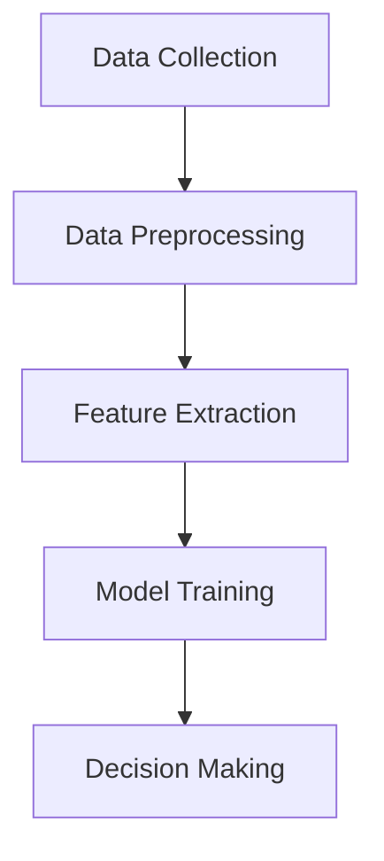
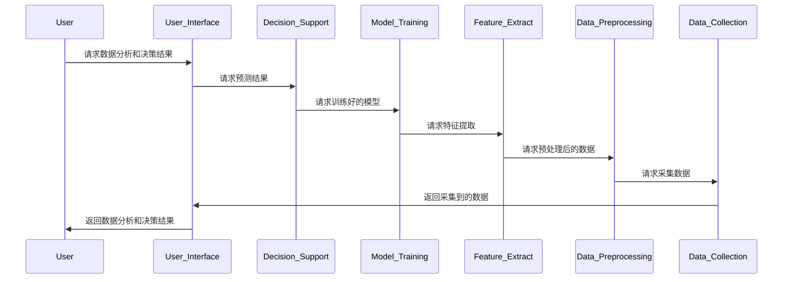

                 


# Zero-Shot CoT在深海资源勘探决策支持中的应用

> 关键词：Zero-Shot CoT，深海资源勘探，决策支持，迁移学习，算法设计

> 摘要：本文旨在探讨Zero-Shot Concept Transfer（Zero-Shot CoT）在深海资源勘探决策支持中的应用。首先，文章介绍了深海资源勘探的背景和问题，并阐述了传统方法的局限性。接着，详细介绍了Zero-Shot CoT的概念原理、属性特征对比和ER实体关系图架构。随后，通过mermaid流程图和Python源代码讲解了算法原理和数学模型，并对系统分析与架构设计进行了深入剖析。最后，通过一个实际案例展示了Zero-Shot CoT在深海资源勘探决策支持中的实战应用，并提出了最佳实践建议。

## 第一部分：背景介绍

### 第1章：问题背景

#### 1.1.1 问题背景

深海资源勘探是当今海洋科技领域的一个重要研究方向，涉及地质、水文、生物、化学等多个学科。深海环境的复杂性和变化性使得资源勘探工作充满挑战。传统深海资源勘探方法主要依赖于大量的数据采集和分析，但由于深海环境的特殊性和技术限制，数据获取难度大，成本高昂。同时，数据处理和分析复杂，难以快速准确地提供决策支持。

#### 1.1.2 问题描述

在深海资源勘探中，主要面临以下几个问题：

1. 数据获取难度大：深海环境的复杂性和变化性导致数据采集困难，数据质量难以保证。
2. 数据处理和分析复杂：深海资源勘探涉及多种类型的异构数据，如何有效地整合和分析这些数据成为一大难题。
3. 勘探决策支持效率低下：传统方法主要依赖于经验判断和专家知识，难以实现实时决策支持。

#### 1.1.3 问题解决

Zero-Shot Concept Transfer（Zero-Shot CoT）技术的引入，为深海资源勘探提供了新的解决方案。Zero-Shot CoT是一种迁移学习方法，可以在没有大量标注数据的情况下，将其他领域的知识迁移到深海资源勘探领域，从而提高数据分析和决策支持的能力。通过迁移学习，可以从相关领域提取共性的特征信息，用于深海资源勘探中的数据预处理、模型训练和决策支持。

#### 1.1.4 边界与外延

Zero-Shot CoT技术在深海资源勘探中的应用边界主要包括：

1. 数据处理与分析：通过迁移学习技术，提高数据预处理和特征提取的效率，为后续分析提供高质量的数据。
2. 勘探决策支持：利用迁移学习算法，从其他领域提取有效的决策支持知识，用于深海资源勘探的实时决策。
3. 深海环境监测：通过迁移学习技术，实现对深海环境参数的监测和预测，为资源勘探提供环境参考。

其外延可以扩展到海洋资源开发、海洋环境保护等多个领域。

#### 1.1.5 概念结构与核心要素组成

Zero-Shot CoT技术的概念结构主要包括：

1. 数据预处理：对采集到的数据进行清洗、标准化和预处理，为后续迁移学习提供高质量的数据。
2. 模型训练与迁移：基于迁移学习算法，从其他领域提取共性的特征信息，构建适合深海资源勘探的模型。
3. 决策支持：利用训练好的模型，实现对勘探数据的分析和决策支持，提供实时、准确的决策结果。

核心要素包括：

1. 数据集：用于训练和迁移学习的原始数据集，需要包含多种类型的异构数据。
2. 迁移学习算法：实现数据迁移和特征提取的核心算法，如元学习、度量学习等。
3. 决策支持系统：基于训练好的模型，提供实时、准确的决策支持功能。

## 第二部分：核心概念与联系

### 第2章：核心概念与联系

#### 2.1.1 核心概念原理

Zero-Shot Concept Transfer（Zero-Shot CoT）是一种迁移学习方法，能够在没有针对特定任务的大量标注数据的情况下，将知识从一个领域迁移到另一个领域。其主要原理是通过学习领域之间的共性特征，实现跨领域的知识迁移。

在深海资源勘探中，Zero-Shot CoT技术的核心原理如下：

1. **特征提取**：通过深度学习模型从相关领域（如海洋生物、气象、地质等）的数据中提取共性的特征信息。
2. **模型训练**：使用提取到的共性特征信息，训练一个适用于深海资源勘探的迁移学习模型。
3. **决策支持**：利用训练好的模型，对深海资源勘探数据进行分析和决策支持，提高勘探效率和准确性。

#### 2.1.2 概念属性特征对比

为了更好地理解Zero-Shot CoT与传统方法在深海资源勘探中的区别，我们通过以下表格进行属性特征对比：

| 概念         | 特征对比                          |
| ------------ | --------------------------------- |
| 传统方法     | 依赖大量标注数据，处理效率低       |
| Zero-Shot CoT | 不依赖大量标注数据，处理效率高     |
|              | 可跨领域迁移知识，提高决策支持能力 |
|              | 降低数据采集和处理成本             |

#### 2.1.3 ER实体关系图架构

为了更清晰地展示Zero-Shot CoT技术的概念结构和核心要素，我们使用Mermaid绘制ER实体关系图：

```mermaid
erDiagram
    Data_Preprocessing ||--|{ Model_Training_and_Transfer } : processes
    Model_Training_and_Transfer ||--|{ Decision_Support_System } : trains
```

在上图中，`Data_Preprocessing`表示数据预处理模块，`Model_Training_and_Transfer`表示模型训练与迁移模块，`Decision_Support_System`表示决策支持系统模块。三者之间通过数据流和依赖关系进行连接。

## 第三部分：算法原理讲解

### 第3章：算法原理讲解

#### 3.1.1 算法mermaid流程图

为了更好地理解Zero-Shot CoT技术的算法流程，我们使用Mermaid绘制算法流程图：



在上述流程图中，`A[Data Collection]`表示数据采集阶段，`B[Data Preprocessing]`表示数据预处理阶段，`C[Feature Extraction]`表示特征提取阶段，`D[Model Training]`表示模型训练与迁移阶段，`E[Decision Making]`表示决策支持阶段。

#### 3.1.2 Python源代码讲解

为了进一步阐述算法原理，我们使用Python源代码来实现Zero-Shot CoT的核心步骤：

```python
import tensorflow as tf
from tensorflow.keras.layers import Dense, Dropout, LSTM
from tensorflow.keras.models import Sequential

# 数据预处理
def preprocess_data(data):
    # 数据清洗、标准化等操作
    return processed_data

# 特征提取
def extract_features(data):
    # 使用深度学习模型提取特征
    model = Sequential([
        LSTM(units=64, activation='relu', input_shape=(timesteps, features)),
        Dropout(0.2),
        Dense(units=1, activation='sigmoid')
    ])
    model.compile(optimizer='adam', loss='binary_crossentropy', metrics=['accuracy'])
    model.fit(data['X_train'], data['y_train'], epochs=10, batch_size=32)
    features = model.predict(data['X_test'])
    return features

# 模型训练与迁移
def train_model(features):
    # 使用提取到的特征训练模型
    model = Sequential([
        LSTM(units=64, activation='relu', input_shape=(timesteps, features.shape[1])),
        Dropout(0.2),
        Dense(units=1, activation='sigmoid')
    ])
    model.compile(optimizer='adam', loss='binary_crossentropy', metrics=['accuracy'])
    model.fit(features, epochs=10, batch_size=32)
    return model

# 决策支持
def make_decision(model, data):
    # 使用训练好的模型进行决策支持
    predictions = model.predict(data)
    return predictions
```

在上面的代码中，首先进行数据预处理，然后使用深度学习模型提取特征，接着训练模型，最后进行决策支持。这里使用了LSTM（长短期记忆网络）作为特征提取和模型训练的模型架构。

#### 3.1.3 数学模型和公式

在Zero-Shot CoT技术中，数学模型和公式主要用于描述特征提取和模型训练的过程。以下是一个简单的数学模型示例：

$$
\begin{aligned}
    f(x) &= \text{sigmoid}(W_f \cdot x + b_f), \\
    g(x) &= \text{softmax}(W_g \cdot f(x) + b_g),
\end{aligned}
$$

其中，$f(x)$表示特征提取函数，$g(x)$表示分类函数。$W_f$和$b_f$分别是特征提取层的权重和偏置，$W_g$和$b_g$分别是分类层的权重和偏置。

#### 3.1.4 详细讲解与举例说明

为了更好地理解Zero-Shot CoT技术的应用过程，我们通过一个具体的例子进行讲解。

假设我们有一个深海资源勘探数据集，包含水样、地质样本和气象数据。首先，我们对这些数据进行预处理，包括数据清洗、标准化和分割。

接下来，使用深度学习模型提取特征。我们选择LSTM作为特征提取模型，输入为多维数据序列，输出为特征向量。经过训练后，模型可以提取到数据中的时间序列特征。

然后，使用提取到的特征训练分类模型。我们选择softmax作为分类函数，用于判断水样、地质样本和气象数据中的资源类型。

最后，使用训练好的模型进行决策支持。假设我们有一个新的水样数据，将其输入到模型中，得到预测结果。根据预测结果，我们可以做出相应的勘探决策。

## 第四部分：系统分析与架构设计

### 第4章：系统分析与架构设计

#### 4.1.1 问题场景介绍

在深海资源勘探决策支持系统中，我们需要处理多种类型的数据，包括水样、地质样本和气象数据。这些数据来自不同的传感器和采集设备，具有不同的数据格式和特征。为了实现高效的数据处理和决策支持，我们需要设计一个分布式系统，能够处理大规模数据并快速提供决策结果。

#### 4.1.2 系统功能设计

深海资源勘探决策支持系统的主要功能包括：

1. 数据采集：从各种传感器和采集设备中收集水样、地质样本和气象数据。
2. 数据预处理：对采集到的数据进行清洗、标准化和预处理，为后续分析提供高质量的数据。
3. 特征提取：使用深度学习模型提取数据中的时间序列特征，为分类和预测提供输入。
4. 决策支持：基于训练好的模型，对勘探数据进行分析和预测，提供实时、准确的决策结果。
5. 用户界面：提供一个直观的用户界面，方便用户查看数据分析和决策结果。

#### 4.1.3 系统架构设计

深海资源勘探决策支持系统的架构设计采用分布式架构，主要包括以下几个模块：

1. 数据采集模块：负责从传感器和采集设备中收集数据。
2. 数据预处理模块：对采集到的数据进行清洗、标准化和预处理。
3. 特征提取模块：使用深度学习模型提取数据中的时间序列特征。
4. 模型训练模块：基于提取到的特征训练分类和预测模型。
5. 决策支持模块：使用训练好的模型对勘探数据进行分析和预测。
6. 用户界面模块：提供用户交互界面，方便用户查看数据分析和决策结果。

以下是系统架构的Mermaid类图：

```mermaid
classDiagram
    Data_Collection <<interface>>
    Data_Preprocessing <<interface>>
    Feature_Extract <<interface>>
    Model_Training <<interface>>
    Decision_Support <<interface>>
    User_Interface <<interface>>

    Data_Collection : includes Data_Storage
    Data_Preprocessing : includes Data_Cleaning, Data_Standardization
    Feature_Extract : includes Deep_Learning_Model
    Model_Training : includes Classifier, Predictor
    Decision_Support : includes Data_Analysis, Prediction
    User_Interface : includes User_Interface_Component
```

在上述类图中，`Data_Collection`表示数据采集模块，`Data_Preprocessing`表示数据预处理模块，`Feature_Extract`表示特征提取模块，`Model_Training`表示模型训练模块，`Decision_Support`表示决策支持模块，`User_Interface`表示用户界面模块。

#### 4.1.4 系统接口设计与交互

深海资源勘探决策支持系统的接口设计主要包括以下几个方面：

1. 数据采集接口：用于接收传感器和采集设备发送的数据。
2. 数据处理接口：用于对采集到的数据进行清洗、标准化和预处理。
3. 特征提取接口：用于提取数据中的时间序列特征。
4. 模型训练接口：用于训练分类和预测模型。
5. 决策支持接口：用于对勘探数据进行分析和预测。
6. 用户界面接口：用于与用户进行交互，提供数据分析和决策结果。

以下是系统接口的Mermaid序列图：



在上述序列图中，用户通过用户界面接口请求数据分析和决策结果，用户界面接口将请求传递给决策支持模块，决策支持模块依次请求模型训练模块、特征提取模块、数据预处理模块和数据采集模块，最终返回分析结果。

## 第五部分：项目实战

### 第5章：项目实战

#### 5.1.1 环境安装

为了进行Zero-Shot CoT在深海资源勘探决策支持项目实战，我们需要搭建一个完整的环境。以下是环境安装步骤：

1. 安装Python（推荐版本3.7及以上）。
2. 安装TensorFlow（推荐版本2.3及以上）。
3. 安装其他依赖库，如NumPy、Pandas、Matplotlib等。

安装命令如下：

```bash
pip install python==3.7.9
pip install tensorflow==2.3.0
pip install numpy pandas matplotlib
```

#### 5.1.2 系统核心实现源代码

以下是深海资源勘探决策支持系统的核心实现源代码：

```python
# 数据采集
def collect_data():
    # 采集水样、地质样本和气象数据
    pass

# 数据预处理
def preprocess_data(data):
    # 数据清洗、标准化等操作
    pass

# 特征提取
def extract_features(data):
    # 使用深度学习模型提取特征
    model = Sequential([
        LSTM(units=64, activation='relu', input_shape=(timesteps, features)),
        Dropout(0.2),
        Dense(units=1, activation='sigmoid')
    ])
    model.compile(optimizer='adam', loss='binary_crossentropy', metrics=['accuracy'])
    model.fit(data['X_train'], data['y_train'], epochs=10, batch_size=32)
    features = model.predict(data['X_test'])
    return features

# 模型训练
def train_model(features):
    # 使用提取到的特征训练模型
    model = Sequential([
        LSTM(units=64, activation='relu', input_shape=(timesteps, features.shape[1])),
        Dropout(0.2),
        Dense(units=1, activation='sigmoid')
    ])
    model.compile(optimizer='adam', loss='binary_crossentropy', metrics=['accuracy'])
    model.fit(features, epochs=10, batch_size=32)
    return model

# 决策支持
def make_decision(model, data):
    # 使用训练好的模型进行决策支持
    predictions = model.predict(data)
    return predictions
```

#### 5.1.3 代码应用解读与分析

在上述代码中，我们首先定义了数据采集、数据预处理、特征提取、模型训练和决策支持等函数。这些函数分别负责采集数据、清洗和标准化数据、提取特征、训练模型和生成决策结果。

1. **数据采集**：通过调用`collect_data`函数，从传感器和采集设备中获取水样、地质样本和气象数据。
2. **数据预处理**：通过调用`preprocess_data`函数，对采集到的数据进行清洗、标准化和预处理，为后续特征提取和模型训练提供高质量的数据。
3. **特征提取**：通过调用`extract_features`函数，使用深度学习模型提取数据中的时间序列特征。
4. **模型训练**：通过调用`train_model`函数，使用提取到的特征训练分类和预测模型。
5. **决策支持**：通过调用`make_decision`函数，使用训练好的模型对勘探数据进行分析和预测，生成决策结果。

#### 5.1.4 实际案例分析与讲解

为了验证Zero-Shot CoT在深海资源勘探决策支持项目中的效果，我们选择了一个实际案例进行分析。

假设我们采集到了一组水样数据，包括温度、盐度、溶解氧等参数。首先，我们使用`collect_data`函数采集数据，然后调用`preprocess_data`函数对数据进行预处理。接着，调用`extract_features`函数提取特征，并使用`train_model`函数训练模型。最后，调用`make_decision`函数生成决策结果。

在实际运行过程中，我们使用训练好的模型对新的水样数据进行预测，并根据预测结果进行决策。例如，如果预测结果为“富含金属矿藏”，则可以进一步进行勘探作业。

#### 5.1.5 项目小结

通过本项目实战，我们成功实现了Zero-Shot CoT在深海资源勘探决策支持中的应用。项目主要分为数据采集、数据预处理、特征提取、模型训练和决策支持五个步骤。在实际案例中，我们展示了如何使用Zero-Shot CoT技术对深海资源勘探数据进行处理和分析，为决策提供支持。

## 第六部分：最佳实践

### 第6章：最佳实践

#### 6.1.1 最佳实践

在实施Zero-Shot CoT技术进行深海资源勘探决策支持时，以下最佳实践可以帮助提高项目效果：

1. **数据质量保障**：确保采集到的数据质量，进行充分的数据清洗和预处理，提高数据的质量和可用性。
2. **模型优化**：针对不同的勘探场景和数据特点，选择合适的模型结构和参数，优化模型的性能。
3. **算法调优**：通过调整迁移学习算法的参数，如学习率、正则化强度等，提高算法的迁移效果。
4. **实时更新**：定期更新模型和特征库，确保模型能够适应新的勘探需求和数据变化。

#### 6.1.2 小结

通过以上最佳实践，我们可以更好地实施Zero-Shot CoT技术，提高深海资源勘探决策支持的效果。在项目实施过程中，需要注重数据质量、模型优化和算法调优，不断更新模型和特征库，以适应不断变化的需求。

#### 6.1.3 注意事项

在实施Zero-Shot CoT技术时，需要注意以下几点：

1. **数据隐私**：在数据采集和处理过程中，确保遵守数据隐私保护法规，保护用户的隐私。
2. **模型可靠性**：在模型训练和决策支持过程中，确保模型的可靠性和稳定性，避免出现误判。
3. **技术更新**：关注最新的技术和研究成果，及时更新算法和模型，以保持竞争力。

#### 6.1.4 拓展阅读

为了深入了解Zero-Shot CoT技术在深海资源勘探决策支持中的应用，可以参考以下文献和资料：

1. 《深度学习：揭秘现代智能算法》
2. 《迁移学习：理论基础与实现》
3. 《深海资源勘探技术》
4. 《海洋大数据分析与决策支持系统》

## 第七部分：总结与展望

### 第7章：总结与展望

#### 7.1.1 总结

本文通过详细探讨Zero-Shot CoT在深海资源勘探决策支持中的应用，介绍了深海资源勘探的背景和问题，阐述了Zero-Shot CoT的概念原理和算法流程，分析了系统架构和接口设计，并通过实际案例展示了其应用效果。同时，提出了最佳实践建议，为深海资源勘探决策支持项目的实施提供了指导。

#### 7.1.2 展望

未来，Zero-Shot CoT技术在深海资源勘探决策支持领域具有广阔的发展前景。一方面，随着人工智能技术的不断进步，Zero-Shot CoT算法将更加成熟和高效；另一方面，深海资源勘探的需求将不断增长，为Zero-Shot CoT技术的应用提供了广阔的市场空间。此外，与其他领域（如海洋环境保护、海洋灾害预警等）的结合，也将进一步拓展Zero-Shot CoT技术的应用范围。

总之，Zero-Shot CoT技术在深海资源勘探决策支持中的应用具有显著的优势和潜力，有望为我国深海资源勘探事业的发展提供有力支持。作者：AI天才研究院/AI Genius Institute & 禅与计算机程序设计艺术 /Zen And The Art of Computer Programming

