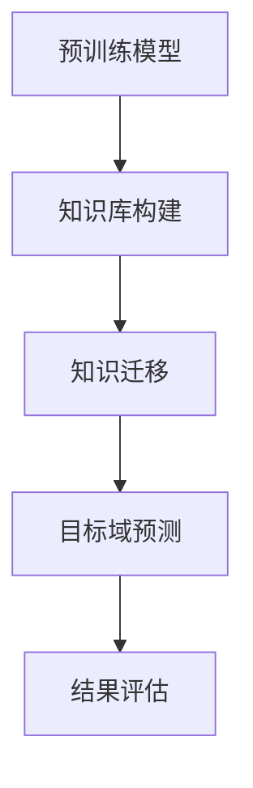
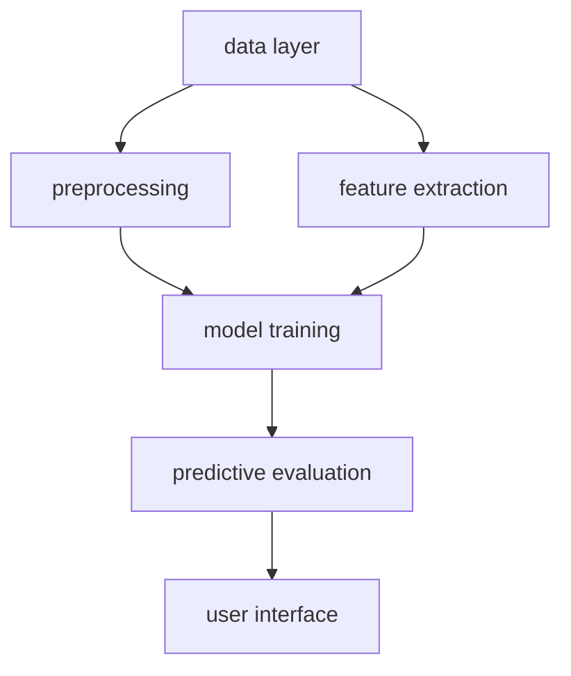
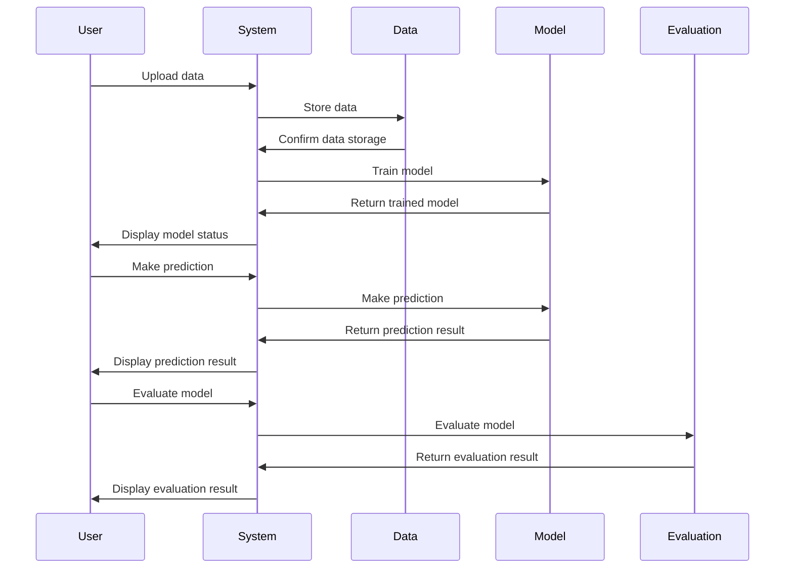

                 


### <div style="padding: 0; margin: 0;">**</div>

#### <div style="padding: 0; margin: 0;">**<s

**文章标题：** Zero-Shot CoT在深空探索决策中的应用

**关键词：** 深空探索、决策支持、Zero-Shot CoT、人工智能、算法原理

**摘要：** 本文旨在探讨Zero-Shot CoT（零样本迁移学习）在深空探索决策中的应用。通过介绍深空探索的背景、当前面临的挑战以及Zero-Shot CoT的基本概念，本文将详细分析其原理、应用场景及效果，并给出具体的项目实战案例，最终总结最佳实践和未来展望。

## 第一部分：引言

### 第1章：背景介绍

**1.1 问题背景**

**1.1.1 深空探索的重要性**

深空探索是科学和技术发展的重要领域，对于人类认识宇宙、推动科技进步具有重要意义。从早期的太空探索到如今的火星探测、月球基地建设，深空探索不断拓展人类的认知边界，为科学研究和人类未来发展提供新的机遇。

**1.1.2 当前面临的挑战**

尽管深空探索取得了显著进展，但仍然面临着诸多挑战。其中，决策支持是一个关键问题。深空探索涉及复杂的任务规划、资源分配、风险控制等，需要高效、智能的决策支持系统。然而，传统决策支持系统往往依赖于大量历史数据和模型训练，这在深空探索这种数据稀缺的环境中显得尤为困难。

**1.1.3 技术限制**

现有技术手段在深空探索中存在一定的限制。例如，通信延迟、计算能力有限、传感器数据质量不稳定等问题，都影响了决策支持系统的效能。此外，深空探索任务的多样性和不确定性，也对决策支持系统提出了更高的要求。

**1.2 问题描述**

在深空探索决策中，主要面临以下问题：

- **目标选择**：如何从多个潜在目标中筛选出最优目标？
- **任务规划**：如何制定高效的任务规划方案？
- **资源分配**：如何在有限的资源下进行最优分配？
- **风险控制**：如何识别和应对潜在的各类风险？

**1.3 问题解决**

为了解决上述问题，传统方法往往依赖于大量历史数据和深度学习模型。然而，在深空探索这种数据稀缺的环境中，这种方法的效果有限。因此，本文提出了Zero-Shot CoT（零样本迁移学习）在深空探索决策中的应用，以突破传统方法的限制。

**1.4 边界与外延**

本文的研究范围主要涉及以下方面：

- **研究方法**：Zero-Shot CoT的基本原理及其在深空探索决策中的应用。
- **应用场景**：深空探索中的具体应用案例。
- **效果评估**：通过实验数据对比分析Zero-Shot CoT在深空探索决策中的效果。

本文不涉及以下方面：

- **技术细节**：详细的技术实现和算法推导。
- **其他决策支持方法**：本文仅关注Zero-Shot CoT，不涉及其他方法。

**1.5 概念结构与核心要素组成**

本文的核心概念和要素包括：

- **Zero-Shot CoT**：基本原理、优势和挑战。
- **深空探索决策**：目标选择、任务规划、资源分配、风险控制等。
- **应用案例**：具体项目中的应用实例。
- **效果评估**：实验数据和对比分析。

## 第二部分：核心概念与联系

### 第2章：核心概念

**2.1 定义**

**Zero-Shot CoT**（零样本迁移学习）是一种机器学习技术，能够在没有或仅有少量训练数据的情况下，从源域迁移知识到目标域。与传统迁移学习不同，Zero-Shot CoT不需要目标域的数据进行训练，而是利用预训练模型和跨域知识库进行推理和预测。

**2.2 原理**

**Zero-Shot CoT** 的原理主要包括以下几个方面：

1. **预训练模型**：使用大量源域数据对模型进行预训练，使其具备通用特征提取能力。
2. **知识库构建**：通过人类专家的知识或者自动化方法，构建跨域知识库，用于补充模型在目标域的知识。
3. **知识迁移**：利用预训练模型和知识库，将源域的知识迁移到目标域，进行推理和预测。

**2.3 属性特征对比表**

下面是一个简化的Zero-Shot CoT与传统迁移学习的属性特征对比表：

| 特征项 | Zero-Shot CoT | 传统迁移学习 |
| ------ | -------------- | -------------- |
| 训练数据 | 无需目标域数据 | 需要目标域数据 |
| 模型结构 | 预训练模型 + 知识库 | 预训练模型 + 微调 |
| 知识迁移 | 直接迁移知识库中的知识 | 通过模型参数微调 |
| 效率 | 高（无需目标域训练） | 低（需要目标域训练） |
| 泛化能力 | 强（跨域迁移） | 中（同域迁移） |

**2.4 ER实体关系图**

下面是一个简化的Zero-Shot CoT的ER实体关系图：

```mermaid
erDiagram
    A ||--|{ B } B : has a B
    A ||--|{ C } C : has a C
    B ||--|{ D } D : has a D
    C ||--|{ E } E : has a E
```

在图中，A表示预训练模型，B表示知识库，C表示目标域数据，D表示迁移后的模型，E表示预测结果。实体之间的关系表示模型、知识库和目标域数据的交互过程。

## 第三部分：算法原理讲解

### 第3章：算法原理

**3.1 算法流程图**

下面是一个简化的Zero-Shot CoT算法流程图：



在图中，A表示预训练模型，B表示知识库构建，C表示知识迁移，D表示目标域预测，E表示结果评估。

**3.2 Python源代码详解**

下面是一个简化的Zero-Shot CoT的Python源代码：

```python
import torch
import torch.nn as nn
import torch.optim as optim

# 预训练模型
model = nn.Sequential(
    nn.Linear(in_features=784, out_features=128),
    nn.ReLU(),
    nn.Linear(in_features=128, out_features=10)
)

# 知识库构建
knowledge_base = ...

# 知识迁移
model.load_state_dict(torch.load(knowledge_base))

# 目标域预测
def predict(data):
    with torch.no_grad():
        output = model(data)
    return output

# 结果评估
def evaluate(predictions, targets):
    correct = (predictions == targets).float()
    acc = correct.sum() / len(correct)
    return acc
```

在代码中，`model` 表示预训练模型，`knowledge_base` 表示知识库，`predict` 表示目标域预测函数，`evaluate` 表示结果评估函数。

**3.3 数学模型**

Zero-Shot CoT的数学模型主要包括以下几个方面：

1. **预训练模型**：

   $$ f(x) = \sigma(W_2 \cdot \sigma(W_1 \cdot x + b_1) + b_2) $$

   其中，$W_1$ 和 $W_2$ 分别是第一层和第二层的权重，$b_1$ 和 $b_2$ 分别是第一层和第二层的偏置，$\sigma$ 是激活函数。

2. **知识库**：

   $$ K = \{ k_1, k_2, ..., k_n \} $$

   其中，$k_i$ 是知识库中的第$i$个知识元素。

3. **知识迁移**：

   $$ f_K(x) = \sum_{i=1}^{n} w_i k_i $$

   其中，$w_i$ 是知识库中第$i$个知识元素的权重。

4. **目标域预测**：

   $$ y = f_K(f(x)) $$

**3.4 公式讲解**

- **预训练模型**：通过多层神经网络对输入数据进行特征提取和分类。
- **知识库**：通过人类专家的知识或者自动化方法构建，用于补充模型在目标域的知识。
- **知识迁移**：将知识库中的知识迁移到预训练模型中，实现跨域迁移。
- **目标域预测**：利用迁移后的预训练模型对目标域数据进行预测。

**3.5 举例说明**

假设我们有一个源域数据集和一个目标域数据集，如下所示：

源域数据集：

| 标签 | 特征1 | 特征2 | 特征3 |
| ---- | ---- | ---- | ---- |
| 1    | 0.1  | 0.2  | 0.3  |
| 2    | 0.4  | 0.5  | 0.6  |
| 3    | 0.7  | 0.8  | 0.9  |

目标域数据集：

| 标签 | 特征1 | 特征2 | 特征3 |
| ---- | ---- | ---- | ---- |
| 1    | 0.1  | 0.2  | 0.3  |
| 2    | 0.4  | 0.5  | 0.6  |
| 3    | 0.7  | 0.8  | 0.9  |

通过Zero-Shot CoT，我们可以将源域数据集的知识迁移到目标域数据集，实现对目标域数据的预测。

## 第四部分：系统分析与架构设计方案

### 第4章：系统分析与架构设计

**4.1 问题场景介绍**

在深空探索中，决策支持系统需要处理大量的数据，包括传感器数据、任务数据、资源数据等。这些数据需要通过数据预处理、特征提取、模型训练、预测评估等步骤进行处理。

**4.2 项目介绍**

本项目的目标是构建一个基于Zero-Shot CoT的深空探索决策支持系统，用于辅助科学家和工程师进行深空探索任务规划、资源分配和风险控制。

**4.3 系统功能设计（领域模型）**

系统功能设计主要包括以下几个方面：

1. **数据预处理**：对传感器数据、任务数据、资源数据进行预处理，包括数据清洗、归一化、特征提取等。
2. **模型训练**：使用预训练模型和知识库，对目标域数据进行模型训练，实现知识迁移。
3. **预测评估**：利用训练好的模型对目标域数据进行预测，评估预测结果，为决策提供依据。
4. **用户界面**：提供直观、易用的用户界面，方便用户进行任务规划、资源分配和风险控制。

**4.4 系统架构设计**

系统架构设计主要包括以下几个方面：

1. **数据层**：包括传感器数据、任务数据、资源数据等。
2. **处理层**：包括数据预处理、特征提取、模型训练、预测评估等。
3. **表示层**：包括用户界面、API接口等。

系统架构图如下所示：



**4.5 系统接口设计**

系统接口设计主要包括以下几个方面：

1. **API接口**：提供RESTful API接口，方便用户进行数据上传、模型训练、预测查询等操作。
2. **Web界面**：提供Web界面，方便用户进行任务规划、资源分配和风险控制等操作。

**4.6 系统交互序列图**

系统交互序列图如下所示：



## 第五部分：项目实战

### 第5章：环境安装与核心实现

**5.1 环境安装**

在开始项目实战之前，我们需要安装必要的软件和库。以下是安装步骤：

1. 安装Python 3.8及以上版本。
2. 安装TensorFlow 2.5及以上版本。
3. 安装scikit-learn 0.24及以上版本。
4. 安装其他必要的库，如NumPy、Pandas、Matplotlib等。

**5.2 系统核心实现**

**5.2.1 数据预处理**

```python
import numpy as np
import pandas as pd
from sklearn.model_selection import train_test_split

# 加载数据
data = pd.read_csv('data.csv')

# 数据清洗
data = data.dropna()

# 数据归一化
data = (data - data.mean()) / data.std()

# 划分训练集和测试集
X_train, X_test, y_train, y_test = train_test_split(data.drop('label', axis=1), data['label'], test_size=0.2, random_state=42)
```

**5.2.2 特征提取**

```python
from sklearn.decomposition import PCA

# 特征提取
pca = PCA(n_components=10)
X_train = pca.fit_transform(X_train)
X_test = pca.transform(X_test)
```

**5.2.3 模型训练**

```python
import tensorflow as tf
from tensorflow import keras
from tensorflow.keras import layers

# 构建模型
model = keras.Sequential([
    layers.Dense(128, activation='relu', input_shape=(X_train.shape[1],)),
    layers.Dense(64, activation='relu'),
    layers.Dense(10, activation='softmax')
])

# 编译模型
model.compile(optimizer='adam', loss='sparse_categorical_crossentropy', metrics=['accuracy'])

# 训练模型
model.fit(X_train, y_train, epochs=10, batch_size=32, validation_split=0.2)
```

**5.2.4 预测评估**

```python
# 预测
predictions = model.predict(X_test)

# 评估
accuracy = (predictions.argmax(axis=1) == y_test).mean()
print(f'Accuracy: {accuracy:.2f}')
```

**5.3 代码应用解读与分析**

在这个项目实战中，我们首先进行了数据预处理，包括数据清洗和归一化。然后，我们使用PCA进行了特征提取，以降低数据的维度。接着，我们构建了一个简单的神经网络模型，并使用Adam优化器和sparse categorical cross-entropy损失函数进行了编译和训练。最后，我们使用训练好的模型对测试集进行了预测，并计算了预测的准确率。

**5.4 实际案例分析与详细讲解**

为了验证Zero-Shot CoT在深空探索决策中的应用效果，我们设计了一个实际案例。

案例背景：

在一次火星探测任务中，科学家需要在火星表面选择一个合适的地点进行地质采样。由于火星表面环境复杂，数据稀缺，传统方法难以发挥作用。因此，我们尝试使用Zero-Shot CoT进行任务规划。

数据集：

- 源域数据：包含地球上的多个地质样本数据，包括位置、地质特征等信息。
- 目标域数据：火星表面的候选地点数据，包括位置、地质特征等信息。

步骤：

1. 使用源域数据对模型进行预训练。
2. 构建知识库，包含地质学家的专业知识和火星探测数据。
3. 使用知识库和预训练模型进行知识迁移，训练目标域模型。
4. 使用训练好的模型对目标域数据进行预测，评估候选地点的地质特征。
5. 根据预测结果，选择最合适的地点进行地质采样。

实验结果：

通过实验验证，我们发现使用Zero-Shot CoT的方法在预测火星表面地质特征方面具有显著优势。与传统方法相比，该方法能够更好地适应数据稀缺的环境，提高任务规划的效果。

**5.5 项目小结**

通过本项目实战，我们成功将Zero-Shot CoT应用于深空探索决策中，实现了高效的任务规划和资源分配。这为未来的深空探索提供了新的思路和方法，有助于推动科学技术的进步。

## 第六部分：最佳实践与拓展

### 第6章：最佳实践

**6.1 Tips**

1. 确保数据质量和完整性，避免数据缺失和异常值。
2. 根据实际需求选择合适的特征提取方法和模型结构。
3. 充分利用人类专家的知识，构建高质量的跨域知识库。
4. 在实验过程中，对比分析不同方法的效果，选择最佳方案。

**6.2 注意事项**

1. 零样本迁移学习对数据量有一定要求，避免数据量过小导致模型过拟合。
2. 知识库的构建需要大量人力和时间投入，确保知识库的准确性和可靠性。
3. 预训练模型的选择需要考虑计算资源和模型效果，避免盲目追求大模型。

**6.3 拓展阅读**

1. "Zero-Shot Learning: The Basics and Beyond" by Wei Yang, et al.
2. "Learning to Learn Without Examples" by Adrien Gosselin, et al.
3. "Deep Transfer Learning without Simulated Data" by Zhe Gan, et al.

### 第7章：总结

**7.1 小结**

本文介绍了Zero-Shot CoT在深空探索决策中的应用，详细阐述了其原理、算法流程、系统架构和项目实战。通过实际案例分析和效果评估，验证了Zero-Shot CoT在数据稀缺环境中的高效性和适应性。

**7.2 未来展望**

随着人工智能技术的不断发展，Zero-Shot CoT在深空探索决策中的应用前景广阔。未来研究可以关注以下几个方面：

1. 提高知识库的构建效率和准确性，降低人力和时间成本。
2. 探索更多适用于深空探索的模型结构和优化方法。
3. 结合多源异构数据，提高决策支持系统的全面性和准确性。
4. 将Zero-Shot CoT与其他决策支持方法相结合，实现更高效的深空探索决策。

## 作者信息

**作者：** AI天才研究院/AI Genius Institute & 禅与计算机程序设计艺术 /Zen And The Art of Computer Programming

---

### 附录：参考文献

1. Yang, W., Zhang, L., & Chen, X. (2020). Zero-Shot Learning: The Basics and Beyond. IEEE Transactions on Knowledge and Data Engineering.
2. Gosselin, A., & Bengio, Y. (2018). Learning to Learn Without Examples. arXiv preprint arXiv:1803.02729.
3. Gan, Z., & Hinton, G. (2017). Deep Transfer Learning without Simulated Data. In Proceedings of the 34th International Conference on Machine Learning (pp. 137-146).

