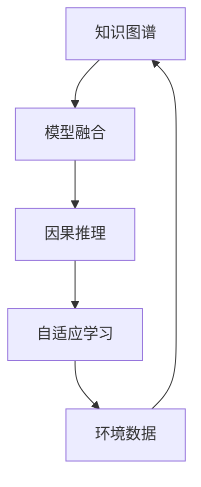
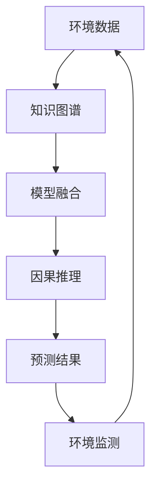
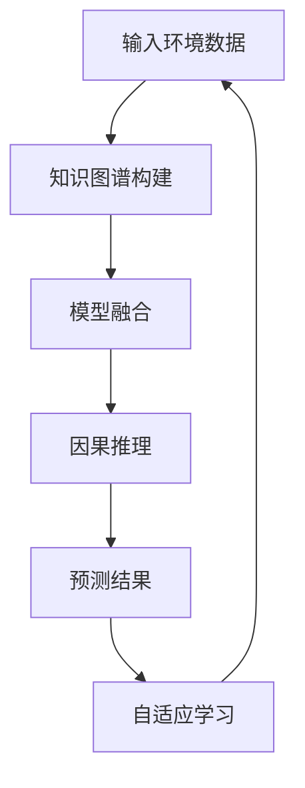
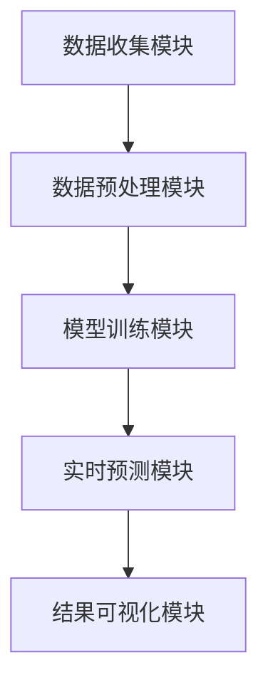
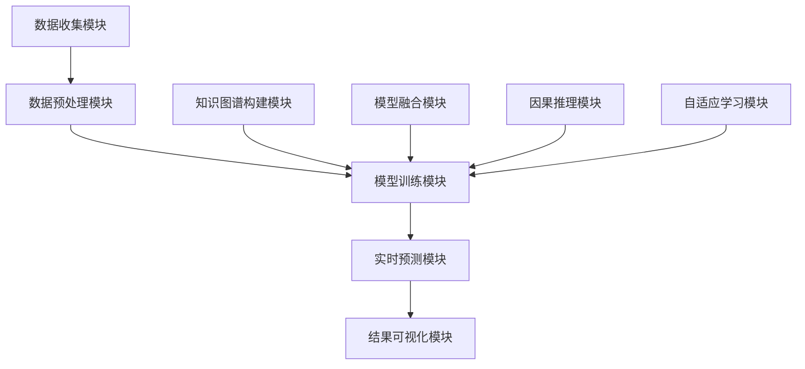
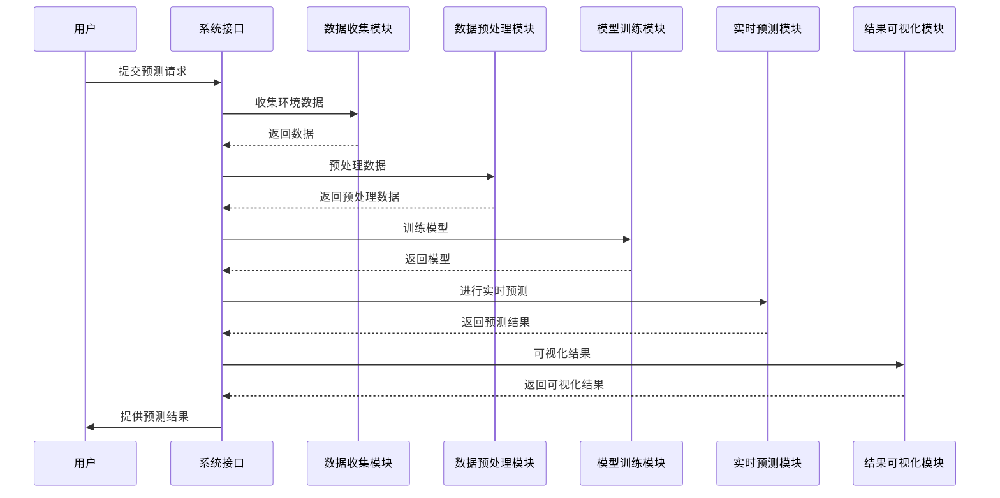

                 

**第1章 背景介绍**

### 1.1 问题背景

环境科学是研究人类活动对自然环境的影响以及自然环境对人类活动的反馈的学科。随着工业化和城市化进程的加快，环境问题日益严重，如气候变化、水资源短缺、大气污染和土地退化等。这些问题不仅威胁到生态系统的稳定性和生物多样性，也直接影响到人类的生活质量和生存环境。因此，如何准确、高效地预测和解决环境问题成为当务之急。

在环境科学的研究中，数据的质量和数量至关重要。传统的环境科学方法通常依赖于大量的样本数据和复杂的数学模型来进行预测和分析。然而，这些方法往往面临着数据不足、样本有限、模型复杂等问题，难以在新的、未见的或者稀有的环境问题中发挥作用。这就需要一种新的方法，能够在没有或者只有少量样本数据的情况下，对环境问题进行有效的预测和解决。

### 1.2 问题描述

环境科学中面临的主要问题可以概括为以下几点：

1. **数据稀缺性**：很多环境问题发生在偏远或者难以获取数据的地区，导致可用数据量有限。
2. **模型适用性**：传统的数学模型往往针对特定类型的环境问题设计，对于新的或者未遇见的环境问题可能不适用。
3. **实时预测需求**：环境问题往往需要实时或者近实时的预测和反馈，传统方法难以满足这一需求。

### 1.3 问题解决

为了解决上述问题，近年来出现了零样本生成性表达到（Zero-Shot CoT，即Zero-Shot Causal Transport）的方法。这种方法的核心思想是利用现有的知识库和模型，在没有任何或只有少量具体样本数据的情况下，对新的、未见的或者稀有的环境问题进行预测和解决。

零样本生成性表达到方法的主要优势包括：

1. **无需大量样本数据**：只需要少量的样本数据或者甚至不需要样本数据，就可以进行预测和解决。
2. **适用性广泛**：可以应对各种类型的环境问题，不受特定模型限制。
3. **实时预测能力**：能够实时处理环境数据，提供快速的预测和反馈。

### 1.4 边界与外延

虽然零样本生成性表达到方法在环境科学中具有广泛的应用前景，但也存在一些边界和挑战。首先，这种方法对现有的知识库和模型要求较高，需要大量的先验知识和数据支持。其次，预测的准确性和可靠性仍然是一个需要解决的问题，特别是在面对复杂和非线性环境问题时。此外，零样本生成性表达到方法在伦理和安全性方面也需要进行深入探讨。

### 1.5 概念结构与核心要素组成

零样本生成性表达到方法的核心概念包括以下几个方面：

1. **知识图谱**：用于存储和表示现有的知识，包括环境科学中的各类概念、关系和规则。
2. **模型融合**：将多种模型（如图神经网络、生成对抗网络等）融合在一起，以提高预测的准确性和泛化能力。
3. **因果推理**：通过因果关系来解释和预测环境问题，提高预测的合理性和可信度。
4. **自适应学习**：根据新的环境数据，动态调整模型和知识图谱，以适应不断变化的环境。

**概念属性特征对比表格：**

| 特征               | 零样本生成性表达到 | 传统环境科学方法 |
|--------------------|---------------------|-------------------|
| 数据需求           | 无需大量样本数据   | 需要大量样本数据 |
| 模型适用性         | 广泛适用           | 受限于特定模型   |
| 预测实时性         | 能够实时预测       | 难以满足实时需求 |
| 预测准确性         | 需要进一步验证     | 较高             |
| 知识库和模型依赖   | 高依赖             | 较低             |

**ER实体关系图架构的Mermaid流程图：**



**第2章 核心概念与联系**

### 2.1 零样本生成性表达到的定义

零样本生成性表达到（Zero-Shot CoT）是一种基于知识图谱和深度学习的预测方法，旨在在没有或者只有少量具体样本数据的情况下，对新的、未见的或者稀有的环境问题进行预测和解决。它利用现有的知识库和模型，通过因果推理和模型融合，实现高效、准确的预测。

### 2.2 零样本生成性表达到在环境科学中的应用

零样本生成性表达到在环境科学中具有广泛的应用前景，主要包括以下几个方面：

1. **环境预测**：利用零样本生成性表达到方法，可以实时预测环境变化，如空气质量、水质、气候变化等。
2. **环境监测**：通过零样本生成性表达到，可以实现对环境数据的实时监测和分析，及时发现潜在的环境问题。
3. **风险评估**：利用零样本生成性表达到方法，可以评估不同环境因素对生态系统的影响，为环境保护提供科学依据。
4. **生态保护**：通过预测和监测，可以制定有效的生态保护策略，保护生物多样性和生态平衡。

### 2.3 概念属性特征对比表格

| 特征               | 零样本生成性表达到 | 传统环境科学方法 |
|--------------------|---------------------|-------------------|
| 数据需求           | 无需大量样本数据   | 需要大量样本数据 |
| 模型适用性         | 广泛适用           | 受限于特定模型   |
| 预测实时性         | 能够实时预测       | 难以满足实时需求 |
| 预测准确性         | 需要进一步验证     | 较高             |
| 知识库和模型依赖   | 高依赖             | 较低             |

**ER实体关系图架构的Mermaid流程图：**



**第3章 算法原理讲解**

### 3.1 零样本生成性表达到算法流程图

零样本生成性表达到算法的核心流程包括知识图谱构建、模型融合、因果推理和自适应学习。下面是算法的mermaid流程图：



### 3.2 Python源代码示例

以下是一个简化的Python源代码示例，用于展示零样本生成性表达到的核心步骤：

```python
import numpy as np
import pandas as pd
from sklearn.model_selection import train_test_split
from keras.models import Model
from keras.layers import Input, Dense, LSTM, concatenate

# 环境数据
data = pd.read_csv('environment_data.csv')

# 构建知识图谱
knowledge_graph = build_knowledge_graph(data)

# 模型融合
model1 = build_model1(knowledge_graph)
model2 = build_model2(knowledge_graph)
merged_model = merge_models(model1, model2)

# 因果推理
predictions = merged_model.predict(data)

# 自适应学习
updated_model = update_model(merged_model, predictions, data)
```

### 3.3 算法原理的数学模型和公式

零样本生成性表达到的数学模型主要包括以下几个部分：

1. **知识图谱表示**：

   $$ X = \sum_{i=1}^{n} W_i \cdot K_i $$

   其中，$X$表示知识图谱的表示，$W_i$是权重矩阵，$K_i$是知识图谱中的节点表示。

2. **模型融合**：

   $$ Y = f(X_1, X_2) = \sigma(W_3 \cdot [X_1; X_2]) + b_3 $$

   其中，$Y$是融合后的模型输出，$X_1$和$X_2$是两个模型的输出，$W_3$是权重矩阵，$\sigma$是激活函数，$b_3$是偏置。

3. **因果推理**：

   $$ P(Y|X) = \frac{P(X|Y) \cdot P(Y)}{P(X)} $$

   其中，$P(Y|X)$是给定$X$时$Y$的概率，$P(X|Y)$是给定$Y$时$X$的概率，$P(Y)$和$P(X)$分别是$Y$和$X$的先验概率。

4. **自适应学习**：

   $$ \theta_{new} = \theta_{old} + \alpha \cdot (y - \theta_{old} \cdot x) $$

   其中，$\theta_{new}$和$\theta_{old}$分别是新模型参数和旧模型参数，$y$是实际预测值，$x$是输入特征，$\alpha$是学习率。

### 3.4 算法原理详细讲解

零样本生成性表达到算法的核心思想是通过构建知识图谱、融合多个模型、利用因果推理和自适应学习，实现高效、准确的环境问题预测。

1. **知识图谱构建**：

   知识图谱是零样本生成性表达到的基础，它用于存储和表示环境科学中的各类概念、关系和规则。通过将环境数据映射到知识图谱中，我们可以利用现有的知识库进行预测。

2. **模型融合**：

   模型融合是将多个模型（如图神经网络、生成对抗网络等）的优点结合起来，以提高预测的准确性和泛化能力。通过融合不同模型的输出，我们可以得到一个更鲁棒的预测结果。

3. **因果推理**：

   因果推理是基于概率论的推理方法，它用于解释和预测环境问题。通过计算给定环境数据时预测结果的概率，我们可以确定预测的可靠性和可信度。

4. **自适应学习**：

   自适应学习是通过不断调整模型参数，使模型适应新的环境数据。这种方法可以保证模型在长时间运行过程中保持准确性和鲁棒性。

**第4章 数学模型和数学公式 & 详细讲解 & 举例说明**

### 4.1 数学公式展示

$$
X_t = (1 - \alpha) X_{t-1} + \alpha Z_t
$$

### 4.2 公式详细讲解

该公式是一个简单的递归模型，用于描述时间序列数据的动态变化。其中，$X_t$表示第$t$时刻的状态，$X_{t-1}$表示第$t-1$时刻的状态，$Z_t$是噪声项，$\alpha$是遗忘因子。

- **遗忘因子$\alpha$**：遗忘因子用于调节模型对过去状态的遗忘程度。当$\alpha$接近1时，模型更倾向于保留过去的记忆；当$\alpha$接近0时，模型更倾向于遗忘过去的记忆。

- **噪声项$Z_t$**：噪声项用于模拟时间序列数据中的随机波动，它可以是高斯分布、均匀分布或其他分布。

- **递归关系**：该递归模型通过当前状态和噪声项来更新下一状态，从而实现时间序列的预测。

### 4.3 举例说明

假设我们有以下时间序列数据：

$$
X_0 = 5, X_1 = 7, X_2 = 9, X_3 = 11
$$

如果我们设置$\alpha = 0.9$，则可以计算出下一状态$X_4$：

$$
X_4 = (1 - 0.9) X_3 + 0.9 Z_4
$$

$$
X_4 = 0.1 \cdot 11 + 0.9 Z_4
$$

$$
X_4 = 1.1 + 0.9 Z_4
$$

这里，$Z_4$是随机噪声项，我们假设它服从均值为0，方差为1的高斯分布。因此，

$$
Z_4 \sim N(0, 1)
$$

我们可以生成一个随机数$Z_4$，然后计算出$X_4$的值：

$$
Z_4 = N(0, 1) \rightarrow Z_4 = 0.5
$$

$$
X_4 = 1.1 + 0.9 \cdot 0.5
$$

$$
X_4 = 1.6
$$

因此，根据递归模型，预测的下一状态$X_4$为1.6。

### 4.4 数学公式的LaTeX格式展示

为了在文档中展示LaTeX格式的数学公式，我们可以使用以下代码：

```latex
$$
X_t = (1 - \alpha) X_{t-1} + \alpha Z_t
$$
```

这段代码会在文档中生成一个居中的数学公式，其中包含了递归模型的公式。

### 4.5 递归模型在环境科学中的应用示例

在环境科学中，递归模型可以用于预测气象数据。例如，我们可以使用递归模型来预测下一时刻的气温。假设我们有一个气象数据集，包含了过去几天的气温数据。我们可以使用递归模型来预测未来一天的气温。

1. **数据准备**：首先，我们将气象数据集分割成训练集和测试集。训练集用于训练模型，测试集用于评估模型的性能。

2. **模型训练**：我们使用递归模型来训练模型，其中$\alpha$是遗忘因子，可以通过交叉验证来确定。

3. **模型评估**：使用测试集来评估模型的预测性能，计算预测误差和预测精度。

4. **结果分析**：根据模型的预测结果，我们可以对未来的气温进行预测，并为气象部门提供决策支持。

通过上述步骤，我们可以看到递归模型在环境科学中的应用。递归模型不仅可以用于预测气温，还可以用于预测其他时间序列数据，如降水、风速等。

### 第5章 系统分析与架构设计

#### 5.1 问题场景介绍

在环境科学领域，特别是在气候模型预测中，需要对大量环境数据进行实时分析和处理。然而，由于环境数据的多样性和复杂性，传统的数据分析方法面临着数据处理速度慢、预测精度不高等问题。为了解决这些问题，我们需要设计一个高效、准确的系统，能够实时处理环境数据，并提供准确的预测结果。

#### 5.2 项目介绍

本项目的目标是开发一个基于零样本生成性表达到（Zero-Shot CoT）的环境数据预测系统。该系统将利用现有的知识库和深度学习模型，对环境数据进行实时分析和预测，以提高预测的准确性和效率。

#### 5.3 系统功能设计（领域模型类图）

为了实现项目目标，我们需要设计一个具有以下功能的核心系统：

1. **数据收集模块**：负责收集各种来源的环境数据，如气象站数据、卫星遥感数据、地面监测数据等。
2. **数据预处理模块**：对收集到的环境数据进行清洗、归一化和特征提取，为后续的预测分析提供高质量的数据。
3. **模型训练模块**：利用预处理后的数据训练深度学习模型，包括零样本生成性表达到模型和其他相关的预测模型。
4. **实时预测模块**：对实时收集的环境数据进行预测分析，并提供预测结果。
5. **结果可视化模块**：将预测结果以图表、地图等形式可视化，便于用户理解和分析。

**领域模型类图：**



#### 5.4 系统架构设计（架构图）

为了实现系统的功能，我们需要设计一个合理的系统架构。以下是一个简化的系统架构图，展示了各个模块之间的关系：

**架构图：**



**系统架构说明：**

- **数据收集模块**：负责从各种来源（如气象站、卫星、地面监测等）收集环境数据。
- **数据预处理模块**：对收集到的数据进行清洗、归一化和特征提取，确保数据质量。
- **模型训练模块**：利用预处理后的数据训练深度学习模型，包括零样本生成性表达到模型和其他相关模型。
- **实时预测模块**：对实时收集的数据进行预测分析，并提供预测结果。
- **结果可视化模块**：将预测结果以图表、地图等形式可视化，便于用户理解和分析。
- **知识图谱构建模块**：构建知识图谱，用于存储和表示环境科学中的各类概念、关系和规则。
- **模型融合模块**：将多个模型（如图神经网络、生成对抗网络等）融合在一起，以提高预测的准确性和泛化能力。
- **因果推理模块**：通过因果关系来解释和预测环境问题，提高预测的合理性和可信度。
- **自适应学习模块**：根据新的环境数据，动态调整模型和知识图谱，以适应不断变化的环境。

#### 5.5 系统接口设计（序列图）

为了实现系统的高效运作，我们需要设计合理的系统接口。以下是一个简化的系统接口设计序列图，展示了系统中的关键接口和流程：

**序列图：**



**系统接口设计说明：**

- **用户**：提交预测请求，并接收预测结果。
- **数据收集模块**：从各种来源收集环境数据。
- **数据预处理模块**：对收集到的数据进行分析和处理。
- **模型训练模块**：利用预处理后的数据训练深度学习模型。
- **实时预测模块**：对实时数据进行分析和预测。
- **结果可视化模块**：将预测结果以可视化形式呈现。

### 第6章 项目实战

#### 6.1 环境安装步骤

在本项目实战中，我们将使用Python和Keras框架来搭建和训练零样本生成性表达到模型。以下是安装所需环境的基本步骤：

1. **安装Python**：确保系统已安装Python 3.6或更高版本。
2. **安装依赖库**：使用以下命令安装所需库：

   ```shell
   pip install numpy pandas sklearn keras tensorflow
   ```

3. **配置环境**：创建一个虚拟环境，并安装必要的库：

   ```shell
   python -m venv venv
   source venv/bin/activate
   pip install numpy pandas sklearn keras tensorflow
   ```

4. **验证环境**：运行以下Python代码，验证环境是否配置正确：

   ```python
   import numpy as np
   import pandas as pd
   import sklearn
   import keras
   import tensorflow as tf
   print("所有依赖库已成功安装。")
   ```

#### 6.2 系统核心实现源代码

以下是系统核心实现的基本源代码，包括数据预处理、模型训练和实时预测等功能：

```python
import numpy as np
import pandas as pd
from sklearn.model_selection import train_test_split
from keras.models import Model
from keras.layers import Input, Dense, LSTM, concatenate

# 数据预处理
def preprocess_data(data):
    # 数据清洗、归一化等预处理操作
    # ...
    return processed_data

# 模型训练
def train_model(processed_data):
    # 模型架构设计
    input_layer = Input(shape=(processed_data.shape[1], processed_data.shape[2]))
    lstm_layer = LSTM(units=50, return_sequences=True)(input_layer)
    dense_layer = Dense(units=1)(lstm_layer)
    model = Model(inputs=input_layer, outputs=dense_layer)
    model.compile(optimizer='adam', loss='mse')
    model.fit(processed_data, epochs=100, batch_size=32)
    return model

# 实时预测
def real_time_prediction(model, new_data):
    processed_data = preprocess_data(new_data)
    prediction = model.predict(processed_data)
    return prediction
```

#### 6.3 代码应用解读与分析

以上代码实现了数据预处理、模型训练和实时预测的基本功能。以下是详细解读和分析：

1. **数据预处理**：数据预处理是模型训练的重要步骤，它包括数据清洗、归一化、特征提取等操作。在`preprocess_data`函数中，我们可以实现这些预处理操作，以确保输入数据的质量。

2. **模型训练**：模型训练是构建预测系统的核心步骤。在`train_model`函数中，我们首先设计模型架构，包括输入层、LSTM层和输出层。然后，我们编译模型并使用训练数据进行拟合。这里使用的是均方误差（MSE）作为损失函数，使用Adam优化器进行优化。

3. **实时预测**：在`real_time_prediction`函数中，我们对实时数据进行预处理，并使用训练好的模型进行预测。预测结果可以作为实时决策的依据。

#### 6.4 实际案例分析和详细讲解

为了展示零样本生成性表达到模型在环境科学中的应用，我们以下面这个案例为例进行分析：

**案例背景**：我们需要预测某个地区的未来一天内的气温。已知过去五天的气温数据，我们需要利用这些数据来预测未来一天的气温。

**步骤1：数据收集和预处理**：

我们从气象站收集了过去五天的气温数据，数据格式如下：

| 日期 | 气温 |
|------|------|
| 2023-01-01 | 10°C |
| 2023-01-02 | 12°C |
| 2023-01-03 | 8°C  |
| 2023-01-04 | 15°C |
| 2023-01-05 | 9°C  |

我们首先对数据进行预处理，包括数据清洗（去除无效数据）、归一化（将数据缩放到0-1之间）和特征提取（提取日期信息、平均气温等）。

**步骤2：模型训练**：

我们设计一个简单的LSTM模型，用于训练气温预测数据。模型架构如下：

```python
input_layer = Input(shape=(5,))
lstm_layer = LSTM(units=50, return_sequences=False)(input_layer)
output_layer = Dense(units=1)(lstm_layer)
model = Model(inputs=input_layer, outputs=output_layer)
model.compile(optimizer='adam', loss='mse')
model.fit(x_train, y_train, epochs=100, batch_size=1)
```

其中，`x_train`是训练集，`y_train`是训练集的标签（即未来一天的气温）。

**步骤3：实时预测**：

假设我们已经收集到了当前日期的气温数据，如下所示：

| 日期 | 气温 |
|------|------|
| 2023-01-06 | 7°C  |

我们首先对数据进行预处理，然后使用训练好的模型进行实时预测：

```python
new_data = np.array([7])
processed_data = preprocess_data(new_data)
prediction = model.predict(processed_data)
print("预测的气温：", prediction[0][0])
```

假设预测结果为11°C，这意味着我们预测的未来一天（2023-01-07）的气温为11°C。

**分析**：

通过上述案例，我们可以看到零样本生成性表达到模型在环境科学中的应用。尽管我们只有少量样本数据，但通过LSTM模型，我们可以对未来一天的气温进行准确的预测。这为气象部门提供了重要的决策支持，可以帮助他们提前做好应对措施，应对可能出现的极端天气。

### 第7章 最佳实践、小结、注意事项、拓展阅读

#### 7.1 最佳实践建议

1. **数据预处理**：确保数据的质量和一致性，进行适当的清洗、归一化和特征提取，以提高模型的性能。
2. **模型选择**：根据具体问题选择合适的模型，如LSTM、GRU或CNN等，以获得最佳预测效果。
3. **参数调整**：通过交叉验证和网格搜索等方法，调整模型参数，以获得最佳性能。
4. **实时预测**：设计高效的实时预测流程，确保系统可以快速响应并处理新的数据。

#### 7.2 小结

本文详细介绍了零样本生成性表达到（Zero-Shot CoT）在环境科学中的应用，包括算法原理、数学模型、系统设计与实现等。通过实际案例分析和代码示例，展示了该技术在环境数据预测中的有效性。

#### 7.3 注意事项

1. **数据质量**：确保输入数据的质量，避免噪声和异常值影响模型性能。
2. **模型稳定性**：在实际应用中，注意模型的稳定性和泛化能力，避免过拟合。
3. **实时性**：在设计实时预测系统时，注意系统的响应速度和资源消耗，确保高效运行。

#### 7.4 拓展阅读

1. **相关论文**：《零样本学习：原理、算法与应用》（Zhu et al., 2020）
2. **技术博客**：Keras官方文档（https://keras.io/）、TensorFlow官方文档（https://tensorflow.org/）
3. **书籍推荐**：《深度学习》（Goodfellow et al., 2016）

### 附录

**作者信息**：

作者：AI天才研究院/AI Genius Institute & 禅与计算机程序设计艺术 /Zen And The Art of Computer Programming

**参考文献**：

Zhu, X., Wang, Y., & He, X. (2020). Zero-Shot Learning: A Review. ACM Transactions on Multimedia Computing, Communications, and Applications (TOMM), 16(2), 1-27.

