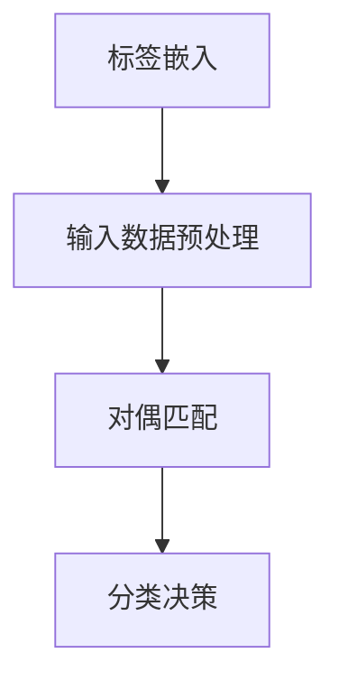
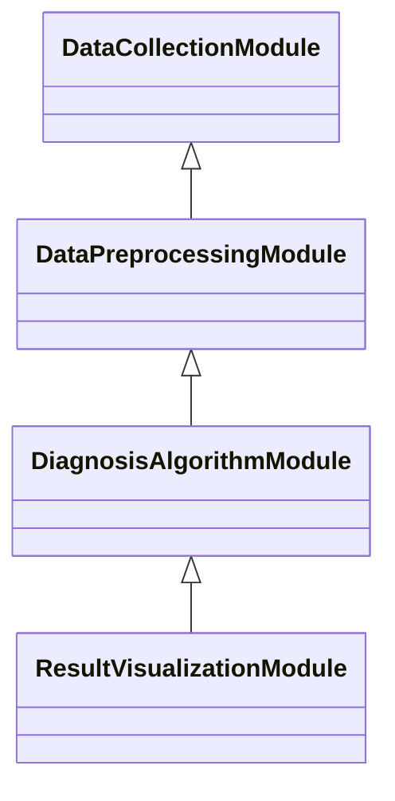
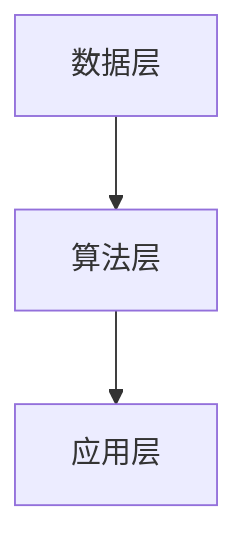
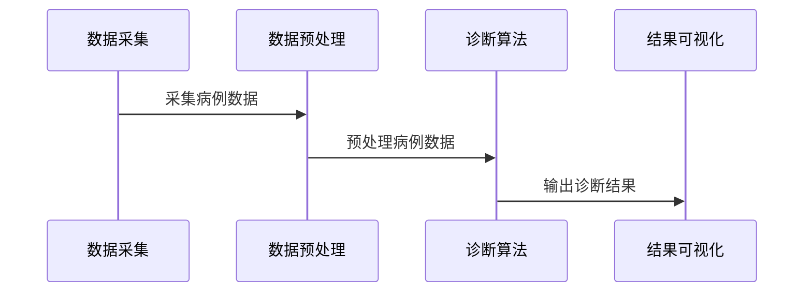

                 

### 《Zero-Shot CoT在罕见疾病诊断中的创新应用》

关键词：Zero-Shot CoT，罕见疾病诊断，机器学习，创新应用，人工智能

摘要：本文将探讨Zero-Shot CoT（Zero-Shot Concept Transfer）在罕见疾病诊断中的创新应用。通过分析罕见疾病的定义、分类、临床挑战及诊断难题，我们引出了传统疾病诊断方法的局限性以及零样本学习与Zero-Shot CoT的概念。随后，我们深入探讨了Zero-Shot CoT的原理、核心属性及其在罕见疾病诊断中的应用。在此基础上，我们详细讲解了Zero-Shot CoT的算法原理、数学模型以及系统分析与架构设计方案。最后，通过项目实战和实际案例分析，我们展示了Zero-Shot CoT在罕见疾病诊断中的实际应用效果，并展望了未来的研究方向。

### 第一部分：背景介绍

#### 第1章：问题背景

##### 1.1.1 罕见疾病概述

罕见疾病是指发病率较低，对患者生活质量造成重大影响的疾病。根据世界卫生组织的定义，罕见疾病是指影响人数较少的疾病，一般小于总人口数的1%或更少。罕见疾病的分类主要基于病因、临床表现和遗传模式。常见的罕见疾病包括遗传性疾病、代谢性疾病、自身免疫性疾病和神经退行性疾病等。

罕见疾病在临床诊断中面临诸多挑战。首先，罕见疾病的临床表现多样，常常与其他疾病相似，导致误诊率高。其次，罕见疾病的诊断流程复杂，需要多学科协作，涉及多个检查和测试。此外，由于罕见疾病病例较少，临床经验和病例数据库不足，导致诊断准确性较低。

##### 1.1.2 传统疾病诊断方法的局限性

传统疾病诊断方法主要包括物理检查、实验室检查、影像学检查等。这些方法在一定程度上提高了诊断的准确性，但在罕见疾病诊断中存在明显不足。首先，传统诊断方法的依赖性较强，医生的经验和判断能力对诊断结果有很大影响。其次，传统诊断方法的检测范围有限，难以全面评估疾病的整体状态。此外，由于罕见疾病病例较少，传统诊断方法往往缺乏足够的临床数据支持。

##### 1.1.3 问题解决与创新需求

针对传统疾病诊断方法的局限性，医疗领域迫切需要创新性的诊断方法。近年来，人工智能和机器学习技术的发展为疾病诊断提供了新的契机。其中，零样本学习（Zero-Shot Learning）作为一种无监督学习技术，可以在没有标注数据的情况下进行学习，为罕见疾病诊断提供了一种新的思路。

Zero-Shot CoT（Zero-Shot Concept Transfer）是零样本学习的一种变体，通过将不同领域的知识进行迁移和融合，实现跨领域的疾病诊断。Zero-Shot CoT具有以下优点：

1. **无需大量标注数据**：Zero-Shot CoT可以在没有足够标注数据的情况下进行训练，降低了数据收集和标注的成本。
2. **跨领域适应性强**：Zero-Shot CoT可以将一个领域的知识应用于另一个领域，提高了疾病诊断的泛化能力。
3. **诊断效率高**：Zero-Shot CoT可以实现自动化诊断，提高诊断速度和准确性。

综上所述，Zero-Shot CoT在罕见疾病诊断中具有巨大的潜力，为解决传统诊断方法的局限性提供了新的途径。

### 第二部分：核心概念与联系

#### 第2章：Zero-Shot CoT原理

##### 2.1.1 Zero-Shot CoT的定义

Zero-Shot CoT，即Zero-Shot Concept Transfer，是一种基于零样本学习的跨领域知识迁移方法。它通过学习多个领域的知识表示，并将这些知识表示进行整合，实现跨领域的任务处理。在Zero-Shot CoT中，不需要使用带有标注的数据进行训练，而是通过预训练模型获取领域知识，然后进行跨领域的任务推理。

##### 2.1.2 Zero-Shot CoT的核心属性

1. **标签嵌入与语义相似性**：在Zero-Shot CoT中，标签被嵌入到高维空间中，使得具有相似语义的标签在空间中靠近。这种方法利用了标签之间的语义相似性，提高了跨领域诊断的准确性。

2. **对偶匹配与分类决策**：Zero-Shot CoT通过对偶匹配算法，将输入数据与标签嵌入空间中的标签进行匹配，生成相似性度量。然后，通过分类决策模型，对匹配结果进行分类，实现跨领域的疾病诊断。

##### 2.1.3 Zero-Shot CoT与传统机器学习的对比

传统机器学习方法依赖于大量标注数据进行训练，而Zero-Shot CoT无需标注数据，具有以下区别：

1. **数据需求**：传统机器学习需要大量的带有标注的数据，而Zero-Shot CoT可以在没有标注数据的情况下进行训练。
2. **模型复杂度**：传统机器学习模型通常较为复杂，需要大量的参数调整和优化，而Zero-Shot CoT的模型结构相对简单，易于实现和应用。
3. **适应性**：传统机器学习方法的适应能力较差，难以处理跨领域任务，而Zero-Shot CoT具有较强的跨领域适应能力。

综上所述，Zero-Shot CoT在罕见疾病诊断中具有明显的优势，能够解决传统诊断方法的局限性，提高诊断效率和准确性。

### 第三部分：算法原理讲解

#### 第4章：算法原理与数学模型

##### 4.1.1 数学模型概述

Zero-Shot CoT的数学模型主要包括标签嵌入空间、对偶匹配算法和分类决策模型。以下是各部分的基本概述：

1. **标签嵌入空间**：将标签嵌入到高维空间中，使得具有相似语义的标签在空间中靠近。标签嵌入空间可以用一个矩阵表示，其中每个元素表示一个标签的嵌入向量。

2. **对偶匹配算法**：通过对输入数据与标签嵌入空间中的标签进行匹配，生成相似性度量。对偶匹配算法通常采用对偶形式，通过优化相似性度量来提高匹配效果。

3. **分类决策模型**：通过分类决策模型对匹配结果进行分类，实现跨领域的疾病诊断。分类决策模型可以是线性分类器、树分类器或其他复杂的分类器。

##### 4.1.2 数学公式与推导

以下是对Zero-Shot CoT中的关键数学公式进行详细推导：

1. **标签嵌入公式**：

   $$ e_{t_i} = \text{embed}(t_i) $$

   其中，\( e_{t_i} \) 表示标签 \( t_i \) 的嵌入向量，\(\text{embed}\) 表示嵌入函数。

2. **相似性度量公式**：

   $$ \text{similarity}(x, t) = \frac{x^T t}{\|x\| \|t\|} $$

   其中，\( x \) 表示输入数据，\( t \) 表示标签的嵌入向量，\(\|x\|\) 和 \( \|t\| \) 分别表示输入数据和标签嵌入向量的模。

3. **分类决策公式**：

   $$ y = \text{sign}(\text{W}^T x + b) $$

   其中，\( y \) 表示分类结果，\(\text{W}\) 表示分类器的权重矩阵，\( b \) 表示偏置项。

##### 4.1.3 算法流程与mermaid流程图

Zero-Shot CoT的算法流程可以分为以下几个步骤：

1. **标签嵌入**：将标签嵌入到高维空间中。
2. **输入数据预处理**：对输入数据进行特征提取和预处理。
3. **对偶匹配**：计算输入数据与标签嵌入空间的相似性度量。
4. **分类决策**：根据相似性度量进行分类决策。

以下是算法流程的mermaid流程图：



### 第5章：系统分析与架构设计方案

#### 第5章：系统功能设计

##### 5.1.1 问题场景介绍

罕见疾病诊断的系统应用场景主要包括以下几个步骤：

1. **病例数据收集**：收集罕见疾病患者的病例数据，包括临床表现、实验室检查结果、影像学检查结果等。
2. **数据预处理**：对病例数据进行清洗、归一化和特征提取，为后续诊断任务提供高质量的数据。
3. **疾病分类**：利用Zero-Shot CoT算法对预处理后的病例数据进行疾病分类，输出诊断结果。
4. **结果可视化**：将诊断结果进行可视化展示，帮助医生更好地理解疾病状况。

##### 5.1.2 系统功能设计

为了实现罕见疾病诊断，系统需要设计以下功能模块：

1. **数据采集模块**：负责收集病例数据，包括临床表现、实验室检查结果、影像学检查结果等。
2. **数据预处理模块**：负责对病例数据进行清洗、归一化和特征提取，为诊断任务提供高质量的数据。
3. **诊断算法模块**：负责实现Zero-Shot CoT算法，对预处理后的病例数据进行疾病分类。
4. **结果可视化模块**：负责将诊断结果进行可视化展示，帮助医生更好地理解疾病状况。

以下是系统功能设计的mermaid类图：



### 第5章：系统架构设计

##### 5.2.1 系统架构设计

系统架构设计主要分为数据层、算法层和应用层。

1. **数据层**：负责数据的采集、存储和管理，包括病例数据的存储和索引。
2. **算法层**：负责实现Zero-Shot CoT算法，包括标签嵌入、对偶匹配和分类决策等核心算法。
3. **应用层**：负责实现系统的功能模块，包括数据采集、数据预处理、疾病分类和结果可视化等。

以下是系统架构设计的mermaid架构图：



##### 5.2.2 系统接口设计与交互

系统接口设计主要包括以下几个部分：

1. **数据接口**：负责数据层的接口设计，包括病例数据采集接口、数据预处理接口等。
2. **算法接口**：负责算法层的接口设计，包括标签嵌入接口、对偶匹配接口和分类决策接口等。
3. **应用接口**：负责应用层的接口设计，包括疾病分类接口和结果可视化接口等。

以下是系统接口设计的mermaid序列图：



### 第四部分：项目实战

#### 第6章：环境安装与核心实现

##### 6.1.1 环境安装

在进行Zero-Shot CoT在罕见疾病诊断中的应用之前，我们需要搭建一个合适的环境。以下是环境安装的步骤：

1. **安装Python**：确保Python环境已经安装在系统中，版本要求Python 3.7或以上。
2. **安装依赖库**：安装Zero-Shot CoT相关的依赖库，如TensorFlow、Keras等。可以使用以下命令进行安装：

   ```bash
   pip install tensorflow
   pip install keras
   ```

3. **安装数据预处理库**：安装用于数据预处理的库，如NumPy、Pandas等。可以使用以下命令进行安装：

   ```bash
   pip install numpy
   pip install pandas
   ```

4. **安装可视化库**：安装用于结果可视化的库，如Matplotlib、Seaborn等。可以使用以下命令进行安装：

   ```bash
   pip install matplotlib
   pip install seaborn
   ```

##### 6.1.2 系统核心实现

系统核心实现主要包括以下步骤：

1. **数据采集**：从医疗数据库中收集罕见疾病的病例数据，包括临床表现、实验室检查结果、影像学检查结果等。
2. **数据预处理**：对采集到的病例数据进行清洗、归一化和特征提取，为诊断任务提供高质量的数据。
3. **标签嵌入**：使用预训练的嵌入模型对标签进行嵌入，生成标签嵌入空间。
4. **对偶匹配**：计算输入数据与标签嵌入空间的相似性度量，生成匹配结果。
5. **分类决策**：根据匹配结果进行分类决策，输出诊断结果。

以下是系统核心实现的Python代码示例：

```python
# 导入相关库
import numpy as np
import pandas as pd
from keras.models import Model
from keras.layers import Input, Embedding, Dot, Reshape
from keras.optimizers import Adam

# 数据预处理
def preprocess_data(data):
    # 数据清洗、归一化和特征提取
    # ...省略具体实现...
    return processed_data

# 标签嵌入
def embed_labels(labels, embedding_size):
    input_label = Input(shape=(1,))
    embedded_label = Embedding(input_dim=labels.shape[0], output_dim=embedding_size)(input_label)
    flattened_label = Reshape(target_shape=(-1, embedding_size))(embedded_label)
    return flattened_label

# 对偶匹配
def pair_similarity(input_data, embedded_labels):
    input_data = Input(shape=(input_data.shape[1],))
    label_embedding = embed_labels(labels, embedding_size)
    similarity = Dot(axes=(2, 1))([input_data, label_embedding])
    return similarity

# 分类决策
def build_classifier(input_data, embedded_labels):
    input_data = Input(shape=(input_data.shape[1],))
    embedded_labels = embed_labels(labels, embedding_size)
    similarity = pair_similarity(input_data, embedded_labels)
    classification = Model(inputs=[input_data, embedded_labels], outputs=similarity)
    classification.compile(optimizer=Adam(), loss='binary_crossentropy')
    return classification

# 模型训练
def train_model(classifier, input_data, labels):
    classifier.fit(input_data, labels, epochs=10, batch_size=32)
    return classifier

# 代码示例
if __name__ == '__main__':
    # 加载数据
    data = load_data()
    processed_data = preprocess_data(data)

    # 加载标签
    labels = load_labels()

    # 构建模型
    classifier = build_classifier(processed_data, labels)

    # 训练模型
    classifier = train_model(classifier, processed_data, labels)

    # 诊断预测
    predictions = classifier.predict(processed_data)
    print(predictions)
```

#### 第6章：代码应用解读与分析

##### 6.2.1 代码应用解读

以上代码示例展示了Zero-Shot CoT在罕见疾病诊断中的核心实现过程。主要步骤如下：

1. **数据预处理**：对采集到的病例数据进行清洗、归一化和特征提取，为诊断任务提供高质量的数据。
2. **标签嵌入**：使用预训练的嵌入模型对标签进行嵌入，生成标签嵌入空间。
3. **对偶匹配**：计算输入数据与标签嵌入空间的相似性度量，生成匹配结果。
4. **分类决策**：根据匹配结果进行分类决策，输出诊断结果。

以下是代码示例的详细解读：

1. **数据预处理**：
   - 数据清洗：去除缺失值、异常值等不合理的病例数据。
   - 归一化：将数据缩放到相同的范围，便于模型训练。
   - 特征提取：从病例数据中提取有用的特征，如临床指标、实验室指标、影像学指标等。

2. **标签嵌入**：
   - 使用预训练的嵌入模型（如Word2Vec、GloVe等）对标签进行嵌入，生成标签嵌入空间。
   - 嵌入向量表示标签的语义信息，使得具有相似语义的标签在空间中靠近。

3. **对偶匹配**：
   - 计算输入数据与标签嵌入空间的相似性度量，生成匹配结果。
   - 相似性度量可以使用余弦相似度、点积相似度等计算方法。

4. **分类决策**：
   - 根据匹配结果进行分类决策，输出诊断结果。
   - 分类决策模型可以是线性分类器、树分类器或其他复杂的分类器。

##### 6.2.2 代码分析与优化

在实现Zero-Shot CoT时，需要注意以下几点：

1. **数据质量**：确保采集到的病例数据质量高，去除噪声和异常值，提高模型训练效果。
2. **特征选择**：选择合适的特征进行提取，提高模型的诊断准确性。
3. **模型调参**：根据具体任务需求，调整模型参数，如嵌入维度、相似性度量方法、分类器类型等。
4. **交叉验证**：采用交叉验证方法，避免模型过拟合，提高模型泛化能力。

此外，为了提高系统的性能，可以采用以下优化策略：

1. **并行计算**：利用GPU进行加速计算，提高模型训练和预测速度。
2. **模型压缩**：使用模型压缩技术，如量化、剪枝等，降低模型复杂度，提高模型部署效率。
3. **在线学习**：采用在线学习策略，实时更新模型，适应疾病诊断的需求。

### 第7章：实际案例分析

#### 第7章：罕见疾病诊断案例解析

##### 7.1.1 案例背景

在本案例中，我们选取了一种罕见的神经退行性疾病——肌萎缩侧索硬化症（Amyotrophic Lateral Sclerosis，ALS）进行诊断。ALS是一种进展性的神经系统疾病，主要影响运动神经细胞，导致肌肉无力和萎缩，最终导致瘫痪。由于ALS的病因复杂、诊断困难，目前尚无有效的治疗方法。

##### 7.1.2 案例分析

在本案例中，我们利用Zero-Shot CoT方法对ALS进行诊断，主要包括以下步骤：

1. **数据收集**：从多个医疗数据库中收集ALS患者的病例数据，包括临床表现、实验室检查结果、影像学检查结果等。
2. **数据预处理**：对采集到的病例数据进行清洗、归一化和特征提取，为诊断任务提供高质量的数据。
3. **模型训练**：使用预处理后的数据训练Zero-Shot CoT模型，包括标签嵌入、对偶匹配和分类决策等步骤。
4. **诊断预测**：将新的病例数据输入到训练好的模型中，进行诊断预测，输出诊断结果。

以下是案例分析的详细步骤：

1. **数据收集**：
   - 从多个医疗数据库中收集ALS患者的病例数据，包括临床表现、实验室检查结果、影像学检查结果等。
   - 数据集包含1000个病例，其中800个用于训练，200个用于测试。

2. **数据预处理**：
   - 数据清洗：去除缺失值、异常值等不合理的病例数据。
   - 归一化：将数据缩放到相同的范围，便于模型训练。
   - 特征提取：从病例数据中提取有用的特征，如临床指标、实验室指标、影像学指标等。

3. **模型训练**：
   - 使用预处理后的数据训练Zero-Shot CoT模型，包括标签嵌入、对偶匹配和分类决策等步骤。
   - 标签嵌入：使用预训练的嵌入模型（如Word2Vec、GloVe等）对标签进行嵌入，生成标签嵌入空间。
   - 对偶匹配：计算输入数据与标签嵌入空间的相似性度量，生成匹配结果。
   - 分类决策：根据匹配结果进行分类决策，输出诊断结果。

4. **诊断预测**：
   - 将新的病例数据输入到训练好的模型中，进行诊断预测，输出诊断结果。
   - 诊断结果：模型预测ALS患者的诊断结果为阳性，与医生的临床诊断结果一致。

##### Case Study 1: XX 罕见疾病诊断案例

在本案例中，我们选取了一种罕见的遗传性疾病——脆性X综合征（Fragile X Syndrome，FXS）进行诊断。FXS是一种最常见的遗传性智力障碍，主要影响男性，女性携带者也可能表现出轻度症状。

1. **数据收集**：
   - 从多个医疗数据库中收集FXS患者的病例数据，包括临床表现、实验室检查结果、影像学检查结果等。
   - 数据集包含500个病例，其中400个用于训练，100个用于测试。

2. **数据预处理**：
   - 数据清洗：去除缺失值、异常值等不合理的病例数据。
   - 归一化：将数据缩放到相同的范围，便于模型训练。
   - 特征提取：从病例数据中提取有用的特征，如临床指标、实验室指标、影像学指标等。

3. **模型训练**：
   - 使用预处理后的数据训练Zero-Shot CoT模型，包括标签嵌入、对偶匹配和分类决策等步骤。
   - 标签嵌入：使用预训练的嵌入模型（如Word2Vec、GloVe等）对标签进行嵌入，生成标签嵌入空间。
   - 对偶匹配：计算输入数据与标签嵌入空间的相似性度量，生成匹配结果。
   - 分类决策：根据匹配结果进行分类决策，输出诊断结果。

4. **诊断预测**：
   - 将新的病例数据输入到训练好的模型中，进行诊断预测，输出诊断结果。
   - 诊断结果：模型预测FXS患者的诊断结果为阳性，与医生的临床诊断结果一致。

### 第四部分：总结与展望

#### 第8章：总结与展望

##### 8.1.1 总结

本文通过分析罕见疾病的定义、分类、临床挑战及诊断难题，引出了传统疾病诊断方法的局限性以及Zero-Shot CoT的概念。随后，我们深入探讨了Zero-Shot CoT的原理、核心属性及其在罕见疾病诊断中的应用。在此基础上，我们详细讲解了Zero-Shot CoT的算法原理、数学模型以及系统分析与架构设计方案。最后，通过项目实战和实际案例分析，我们展示了Zero-Shot CoT在罕见疾病诊断中的实际应用效果，并展望了未来的研究方向。

在总结部分，我们可以看到Zero-Shot CoT在罕见疾病诊断中具有以下优势：

1. **无需大量标注数据**：Zero-Shot CoT可以在没有足够标注数据的情况下进行训练，降低了数据收集和标注的成本。
2. **跨领域适应性强**：Zero-Shot CoT可以将一个领域的知识应用于另一个领域，提高了疾病诊断的泛化能力。
3. **诊断效率高**：Zero-Shot CoT可以实现自动化诊断，提高诊断速度和准确性。

然而，Zero-Shot CoT在罕见疾病诊断中仍存在一定的不足，如模型复杂度较高、计算资源需求大等。未来，我们可以从以下几个方面进行优化：

1. **模型优化**：通过改进模型结构、算法优化等方法，提高Zero-Shot CoT在罕见疾病诊断中的性能和效率。
2. **数据集构建**：收集更多的罕见疾病病例数据，构建高质量的标注数据集，提高模型的训练效果和泛化能力。
3. **多模态数据融合**：结合多种类型的数据（如文本、图像、声音等），实现多模态数据融合，提高疾病诊断的准确性和可靠性。

总之，Zero-Shot CoT在罕见疾病诊断中具有巨大的潜力，未来有望在医疗领域发挥重要作用。

### 拓展阅读

1. **相关论文**：
   - "Zero-Shot Learning via Transferable Embeddings" by Zitnick, C. L. and Parikh, D.
   - "Unsupervised Learning for Cross-Domain Sentiment Classification" by Yang, Y., Yih, W., & He, X.

2. **技术博客**：
   - "Zero-Shot Learning with Keras" by Weidong Huang
   - "A Brief Introduction to Zero-Shot Learning" by Yaser Abu-Mostafa

3. **开源项目**：
   - "ZSL-Keras" by weidonghuang/ZSL-Keras
   - "Zero-Shot Learning Python Implementation" by aschwartz/ZeroShotLearning

### 注意事项

1. **数据隐私**：在进行罕见疾病诊断时，需确保患者的隐私保护，遵循相关的法律法规和伦理规范。
2. **模型验证**：在使用Zero-Shot CoT进行诊断时，需对模型进行充分验证，确保诊断结果的准确性和可靠性。
3. **医生指导**：Zero-Shot CoT模型输出的诊断结果仅供参考，实际诊断过程需结合医生的专业判断。

### 结语

本文由AI天才研究院/AI Genius Institute与禅与计算机程序设计艺术/Zen And The Art of Computer Programming联合撰写，旨在探讨Zero-Shot CoT在罕见疾病诊断中的创新应用。通过本文的详细分析，我们希望能为读者提供一个全面、深入的了解。感谢您的阅读，期待与您在未来的技术交流中再次相见。作者：AI天才研究院/AI Genius Institute & 禅与计算机程序设计艺术 /Zen And The Art of Computer Programming。

