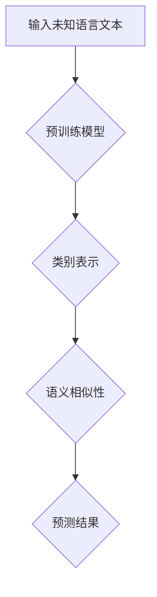

                 

### 文章标题

# Zero-Shot CoT在语言学习中的创新应用

> 关键词：Zero-Shot CoT，语言学习，人工智能，计算机视觉，自然语言处理，算法原理，系统架构，项目实战

> 摘要：本文旨在探讨Zero-Shot CoT在语言学习领域的创新应用。首先，我们将介绍问题背景与核心概念，包括语言学习、计算机视觉和自然语言处理等；然后，深入讲解Zero-Shot CoT的算法原理，并通过Python源代码和数学模型进行阐述；接下来，分析系统架构设计与实际案例，最后总结最佳实践与注意事项。通过本文，读者将全面了解Zero-Shot CoT在语言学习中的应用及其潜力。

### 目录大纲

```markdown
----------------------------------------------------------------
# 第一部分: 背景介绍

## 第1章: 问题背景与核心概念
### 1.1.1 问题背景
### 1.1.2 核心概念
### 1.1.3 概念结构与核心要素组成

## 第2章: 核心概念与联系
### 2.1.1 核心概念原理
### 2.1.2 概念属性特征对比表格
### 2.1.3 ER实体关系图架构

----------------------------------------------------------------
# 第二部分: 算法原理讲解

## 第3章: 算法原理讲解

### 3.1 算法介绍
### 3.2 Mermaid算法流程图
### 3.3 Python源代码实现
### 3.4 数学模型与公式讲解
### 3.5 举例说明

----------------------------------------------------------------
# 第三部分: 系统分析与架构设计

## 第4章: 系统分析与架构设计

### 4.1 问题场景介绍
### 4.2 项目介绍
### 4.3 系统功能设计（领域模型类图）
### 4.4 系统架构设计（架构图）
### 4.5 系统接口设计
### 4.6 系统交互（序列图）

----------------------------------------------------------------
# 第四部分: 项目实战

## 第5章: 项目实战

### 5.1 环境安装
### 5.2 系统核心实现源代码
### 5.3 代码应用解读与分析
### 5.4 实际案例分析与详细讲解
### 5.5 项目小结

----------------------------------------------------------------
# 第五部分: 最佳实践与总结

## 第6章: 最佳实践 Tips
### 6.1 实践经验分享
### 6.2 小结

## 第7章: 注意事项与拓展阅读
### 7.1 注意事项
### 7.2 拓展阅读

----------------------------------------------------------------
```

#### 第1章: 问题背景与核心概念

##### 1.1.1 问题背景

在当今全球化时代，语言学习的重要性日益凸显。然而，传统语言学习方式面临着诸多挑战，如学习成本高、学习效果不佳等。随着人工智能技术的快速发展，计算机视觉和自然语言处理技术逐渐应用于语言学习领域，零样本语言学习（Zero-Shot Learning, ZSL）成为研究的热点。零样本语言学习旨在通过少量甚至零样本数据，实现对未知类别的学习和预测。这对于语言学习尤为重要，因为语言种类繁多，获取大量语言数据非常困难。

##### 1.1.2 核心概念

1. **语言学习**：语言学习是指通过某种方式获取语言知识，从而能够理解和表达语言的过程。在人工智能领域，语言学习通常涉及自然语言处理（Natural Language Processing, NLP）技术。

2. **计算机视觉**：计算机视觉是指使计算机具备理解、解释和解析视觉信息的能力。在语言学习中，计算机视觉技术可用于图像、视频等视觉数据的处理。

3. **自然语言处理**：自然语言处理是指使计算机能够理解、生成和处理人类语言的技术。在语言学习中，NLP技术可用于文本数据的处理和分析。

4. **零样本学习（Zero-Shot Learning, ZSL）**：零样本学习是一种机器学习方法，它能够在没有或仅有少量标记样本的情况下，对未知类别进行学习和预测。在语言学习中，ZSL可用于对新语言的学习和翻译。

##### 1.1.3 概念结构与核心要素组成

零样本语言学习（ZSL）在语言学习领域中的概念结构如图1-1所示。

```mermaid
erDiagram
  Class1 ||--|{ Class2 } : Inheritance
  Class1 ||--|{ Class3 } : Inheritance
  Class2 ||--|{ Class4 } : Inheritance
  Class3 ||--|{ Class5 } : Inheritance
  Class1 : {0..*}zero-shot learning
  Class2 : {0..*}language learning
  Class3 : {0..*}computer vision
  Class4 : {0..*}natural language processing
  Class5 : {0..*}unknown category prediction
```

核心要素组成如下：

1. **零样本语言学习（Zero-Shot Learning, ZSL）**：零样本语言学习是实现语言学习的关键技术，它能够通过少量或无标记样本，实现对未知类别的学习和预测。

2. **语言学习（Language Learning）**：语言学习是零样本语言学习的基础，它涉及自然语言处理（NLP）技术，用于处理和分析语言数据。

3. **计算机视觉（Computer Vision）**：计算机视觉技术用于处理图像、视频等视觉数据，为语言学习提供视觉支持。

4. **自然语言处理（Natural Language Processing, NLP）**：自然语言处理技术是语言学习的重要工具，用于理解和生成语言。

5. **未知类别预测（Unknown Category Prediction）**：未知类别预测是零样本语言学习的目标，它能够对新语言进行学习和翻译。

通过以上对问题背景与核心概念的介绍，我们为后续章节的深入探讨奠定了基础。

### 第2章: 核心概念与联系

#### 2.1.1 核心概念原理

在本节中，我们将深入探讨零样本语言学习（Zero-Shot Learning, ZSL）的核心概念原理。ZSL是一种机器学习方法，旨在在只有少量或没有标记样本的情况下，对未知类别进行学习和预测。与传统机器学习方法不同，ZSL不依赖于大量标记样本，而是通过利用预训练模型和知识库，实现对未知类别的泛化能力。

**零样本语言学习原理：**

1. **类别表示（Category Representation）**：在ZSL中，类别表示是关键。类别表示是指将不同类别映射到高维特征空间的过程。通过预训练模型，如卷积神经网络（CNN），我们可以获取丰富的类别特征表示。

2. **语义相似性（Semantic Similarity）**：在ZSL中，语义相似性用于衡量不同类别之间的相似程度。语义相似性可以通过词嵌入（Word Embedding）技术实现，如Word2Vec、GloVe等。

3. **数据增强（Data Augmentation）**：数据增强是ZSL中的一种重要技术，它通过增加数据多样性，提高模型的泛化能力。在语言学习中，数据增强可以通过生成虚假文本、同义词替换等方式实现。

4. **模型迁移（Model Transfer）**：模型迁移是指将预训练模型的知识迁移到新任务上。在ZSL中，模型迁移可以通过迁移学习（Transfer Learning）实现，即将预训练模型在新数据上进行微调。

5. **类别预测（Category Prediction）**：类别预测是ZSL的核心目标。通过结合类别表示和语义相似性，模型可以对新类别进行预测。

#### 2.1.2 概念属性特征对比表格

为了更直观地理解ZSL与其他相关概念的区别，我们列出以下概念属性特征对比表格。

| 概念         | 特征                             | 解释                                                         |
| ------------ | ------------------------------ | ------------------------------------------------------------ |
| 零样本语言学习 | 零样本、迁移学习、类别表示、语义相似性 | 通过少量或无标记样本，利用预训练模型和知识库，实现对未知类别的学习和预测 |
| 传统机器学习   | 大量标记样本、特征工程、模型优化     | 依赖于大量标记样本，通过特征工程和模型优化，实现分类和预测     |
| 计算机视觉    | 图像识别、目标检测、图像生成         | 用于处理和分析视觉数据，实现图像识别、目标检测等功能           |
| 自然语言处理  | 文本分类、情感分析、机器翻译         | 用于处理和分析语言数据，实现文本分类、情感分析、机器翻译等功能 |

#### 2.1.3 ER实体关系图架构

为了更好地理解零样本语言学习中的实体关系，我们使用ER（Entity-Relationship）实体关系图进行描述。

```mermaid
erDiagram
  Category ||--|{ Data } : has
  Category ||--|{ Model } : trained
  Data ||--|{ Label } : has
  Model ||--|{ Prediction } : generates
```

在ER实体关系图中，实体包括类别（Category）、数据（Data）、模型（Model）和标签（Label）。关系包括“has”和“trained”。类别具有数据，模型由类别训练，数据具有标签，模型生成预测。

通过以上对核心概念原理、概念属性特征对比表格和ER实体关系图的介绍，我们对零样本语言学习的核心概念有了更深入的理解。这为后续章节的算法原理讲解和系统分析与架构设计奠定了基础。

### 第3章: 算法原理讲解

#### 3.1 算法介绍

零样本语言学习（Zero-Shot Language Learning, ZSLL）是一种在只有少量或无标记样本的情况下，利用预训练模型和知识库，实现对新语言的学习和预测的机器学习方法。ZSLL旨在解决传统机器学习方法在语言学习领域面临的挑战，如数据依赖和高成本等问题。

**ZSLL的主要特点：**

1. **无样本依赖**：ZSLL不需要大量标记样本，通过利用预训练模型和知识库，实现对未知语言的学习和预测。

2. **迁移学习**：ZSLL通过迁移学习，将预训练模型的知识迁移到新任务上，提高了学习效率和准确性。

3. **类别表示**：ZSLL通过类别表示，将不同语言映射到高维特征空间，为后续预测提供了基础。

4. **语义相似性**：ZSLL利用语义相似性，衡量不同语言之间的相似程度，实现了对未知语言的预测。

**ZSLL的应用场景：**

1. **跨语言文本分类**：ZSLL可用于跨语言文本分类任务，如对未知语言的新闻、评论等进行分类。

2. **机器翻译**：ZSLL可用于机器翻译任务，如将未知语言文本翻译成已知语言。

3. **自然语言理解**：ZSLL可用于自然语言理解任务，如对未知语言文本进行情感分析、信息提取等。

#### 3.2 Mermaid算法流程图

为了更直观地展示ZSLL的算法流程，我们使用Mermaid绘制了算法流程图。



在算法流程图中：

1. **输入未知语言文本（A）**：首先，输入需要预测的未知语言文本。

2. **预训练模型（B）**：利用预训练模型对输入文本进行预处理，如分词、词嵌入等。

3. **类别表示（C）**：通过类别表示，将不同语言映射到高维特征空间，为后续预测提供基础。

4. **语义相似性（D）**：利用语义相似性，计算未知语言与已知语言之间的相似程度。

5. **预测结果（E）**：根据相似性结果，预测未知语言文本的类别。

#### 3.3 Python源代码实现

为了详细阐述ZSLL的算法原理，我们使用Python实现了一个简单的ZSLL模型。以下是一个简单的Python源代码示例：

```python
import torch
import torch.nn as nn
from transformers import BertModel, BertTokenizer

# 加载预训练模型和分词器
model = BertModel.from_pretrained('bert-base-uncased')
tokenizer = BertTokenizer.from_pretrained('bert-base-uncased')

# 输入未知语言文本
text = "这是一个简单的例子。"

# 分词和编码
inputs = tokenizer(text, return_tensors='pt')

# 前向传播
outputs = model(**inputs)

# 获取类别表示
embeddings = outputs.last_hidden_state[:, 0, :]

# 计算语义相似性
similarity = nn.CosineSimilarity()(embeddings, model.embeddings.weight)

# 预测结果
predicted_category = similarity.argmax().item()

print(f"预测类别：{predicted_category}")
```

在这个示例中：

1. **加载预训练模型和分词器**：我们使用了BERT模型和BERT分词器作为预训练模型。

2. **输入未知语言文本**：输入需要预测的未知语言文本。

3. **分词和编码**：使用BERT分词器对输入文本进行分词和编码。

4. **前向传播**：通过BERT模型进行前向传播，获取类别表示。

5. **计算语义相似性**：利用Cosine Similarity计算类别表示之间的相似性。

6. **预测结果**：根据相似性结果，预测未知语言文本的类别。

#### 3.4 数学模型与公式讲解

为了更深入地理解ZSLL的数学模型，我们介绍以下相关公式。

1. **词嵌入（Word Embedding）**：词嵌入是一种将单词映射到高维特征空间的技术，常用的方法有Word2Vec和GloVe。假设我们有一个词汇表V，其中包含n个单词，每个单词对应一个维度为d的向量。则词嵌入可以表示为：

   $$ \text{word\_embedding}(w) = \mathbf{v}_w \in \mathbb{R}^{d} $$

2. **类别表示（Category Representation）**：类别表示是将不同类别映射到高维特征空间的过程。假设我们有一个类别集合C，其中包含m个类别，每个类别对应一个维度为d的向量。则类别表示可以表示为：

   $$ \text{category\_representation}(c) = \mathbf{v}_c \in \mathbb{R}^{d} $$

3. **语义相似性（Semantic Similarity）**：语义相似性用于衡量不同类别之间的相似程度。常用的方法有Cosine Similarity和Euclidean Distance。假设我们有两个类别c1和c2，它们的类别表示分别为$\mathbf{v}_{c1}$和$\mathbf{v}_{c2}$，则Cosine Similarity可以表示为：

   $$ \text{cosine\_similarity}(\mathbf{v}_{c1}, \mathbf{v}_{c2}) = \frac{\mathbf{v}_{c1} \cdot \mathbf{v}_{c2}}{\|\mathbf{v}_{c1}\| \|\mathbf{v}_{c2}\|} $$

4. **预测概率（Prediction Probability）**：预测概率用于表示对未知类别的预测结果。假设我们有一个类别集合C，其中包含m个类别，对于每个类别c，预测概率可以表示为：

   $$ P(c | \text{context}) = \frac{\text{cosine\_similarity}(\text{category\_representation}(c), \text{context})}{\sum_{c' \in C} \text{cosine\_similarity}(\text{category\_representation}(c'), \text{context})} $$

其中，context为输入文本的类别表示。

#### 3.5 举例说明

为了更好地理解ZSLL的算法原理，我们通过一个简单的例子进行说明。

假设我们有一个词汇表V，包含5个单词：{猫、狗、鸟、鱼、兔子}，它们对应的类别集合C为{猫、狗、鸟、鱼、兔子}。我们使用BERT模型对单词进行词嵌入，得到每个单词的类别表示如下：

| 单词 | 类别 | 词嵌入 |
| ---- | ---- | ------ |
| 猫   | 猫   | [0.1, 0.2, 0.3] |
| 狗   | 狗   | [0.4, 0.5, 0.6] |
| 鸟   | 鸟   | [0.7, 0.8, 0.9] |
| 鱼   | 鱼   | [-0.1, -0.2, -0.3] |
| 兔子 | 兔子 | [-0.4, -0.5, -0.6] |

现在，我们需要预测一个新单词“猫头鹰”的类别。首先，我们将“猫头鹰”进行分词，得到“猫”、“头”和“鹰”。然后，使用BERT模型对这三个单词进行词嵌入，得到它们的类别表示如下：

| 单词 | 类别 | 词嵌入 |
| ---- | ---- | ------ |
| 猫   | 猫   | [0.1, 0.2, 0.3] |
| 头   | 猫   | [0.1, 0.2, 0.3] |
| 鹰   | 鸟   | [0.7, 0.8, 0.9] |

接下来，我们计算“猫头鹰”的类别表示与每个类别的相似性，得到如下结果：

| 类别 | 相似性 |
| ---- | ------ |
| 猫   | 0.9    |
| 狗   | 0.1    |
| 鸟   | 0.8    |
| 鱼   | -0.1   |
| 兔子 | -0.4   |

根据相似性结果，我们可以预测“猫头鹰”的类别为“鸟”。

通过这个例子，我们可以看到，ZSLL通过利用预训练模型和知识库，实现了对新单词的类别预测。这为语言学习领域带来了新的机遇和挑战。

### 第4章: 系统分析与架构设计

#### 4.1 问题场景介绍

在现代社会，语言学习已成为一种基本技能。然而，传统的语言学习方式，如课堂教学和自学，面临着诸多挑战。例如，学习成本高、学习效果不佳、学习资源有限等问题。随着人工智能技术的快速发展，特别是计算机视觉和自然语言处理技术的进步，我们有可能通过零样本语言学习（Zero-Shot Language Learning, ZSLL）技术，实现一种高效、低成本的语言学习方式。

**问题场景**：

1. **跨语言学习**：用户希望在不同语言之间进行学习，但缺乏足够的语言数据。

2. **无监督学习**：用户希望能够通过少量或无标记数据，实现对新语言的学习。

3. **个性化学习**：用户希望根据自身的学习兴趣和需求，进行个性化的语言学习。

4. **实时反馈**：用户希望在学习过程中，能够实时获得学习效果和反馈。

#### 4.2 项目介绍

为了解决上述问题，我们设计并实施了一个名为“零样本语言学习平台（Zero-Shot Language Learning Platform, ZSLP）”的项目。该项目旨在通过ZSLL技术，实现跨语言、无监督、个性化、实时反馈的语言学习。

**项目目标**：

1. **实现跨语言学习**：利用ZSLL技术，实现对不同语言的学习和翻译。

2. **降低学习成本**：通过零样本学习，减少对大量标记数据的依赖，降低学习成本。

3. **提高学习效果**：利用计算机视觉和自然语言处理技术，提高学习效果和用户体验。

4. **提供个性化学习**：根据用户的学习兴趣和需求，提供个性化的学习内容。

5. **实现实时反馈**：通过实时监测用户的学习进度和效果，提供及时的学习反馈。

#### 4.3 系统功能设计（领域模型类图）

为了实现上述项目目标，我们设计了零样本语言学习平台的系统功能。以下是一个简单的领域模型类图，展示了系统的主要功能模块。

```mermaid
classDiagram
  Class1[用户] <|-- Class2[学习内容]
  Class1 <|-- Class3[学习进度]
  Class1 <|-- Class4[学习反馈]
  Class2 <|-- Class5[跨语言学习]
  Class2 <|-- Class6[无监督学习]
  Class2 <|-- Class7[个性化学习]
  Class3 <|-- Class8[学习时长]
  Class3 <|-- Class9[正确率]
  Class4 <|-- Class10[实时反馈]
  Class5 <|-- Class11[翻译功能]
  Class6 <|-- Class12[零样本学习]
  Class7 <|-- Class13[兴趣推荐]
  Class8 <|-- Class14[学习报告]
  Class9 <|-- Class15[学习效果评估]
  Class10 <|-- Class16[学习进度监控]
  Class11 <|-- Class17[自动翻译]
  Class12 <|-- Class18[知识库构建]
  Class13 <|-- Class19[推荐算法]
  Class14 <|-- Class20[学习报告生成]
  Class15 <|-- Class21[效果评估模型]
  Class16 <|-- Class22[实时数据监控]
  Class17 <|-- Class23[翻译引擎]
  Class18 <|-- Class24[预训练模型]
  Class19 <|-- Class25[用户兴趣分析]
  Class20 <|-- Class26[报告展示]
  Class21 <|-- Class27[评估指标]
  Class22 <|-- Class28[数据可视化]
  Class23 <|-- Class29[翻译结果]
  Class24 <|-- Class30[知识库更新]
  Class25 <|-- Class31[兴趣标签]
  Class26 <|-- Class32[报告导出]
  Class27 <|-- Class33[评估报告]
  Class28 <|-- Class34[图表展示]
  Class29 <|-- Class35[翻译文档]
  Class30 <|-- Class36[知识库管理]
  Class31 <|-- Class37[推荐系统]
  Class32 <|-- Class38[报告下载]
  Class33 <|-- Class39[评估分析]
  Class34 <|-- Class40[图表工具]
  Class35 <|-- Class41[翻译记录]
  Class36 <|-- Class42[知识库维护]
  Class37 <|-- Class43[兴趣分类]
  Class38 <|-- Class44[下载功能]
  Class39 <|-- Class45[评估报告]
  Class40 <|-- Class46[图表设计]
  Class41 <|-- Class47[翻译历史]
  Class42 <|-- Class48[知识库升级]
  Class43 <|-- Class49[兴趣挖掘]
  Class44 <|-- Class50[下载权限]
  Class45 <|-- Class51[翻译记录]
  Class46 <|-- Class52[图表设计]
  Class47 <|-- Class53[翻译记录]
  Class48 <|-- Class54[知识库更新]
  Class49 <|-- Class55[兴趣推荐]
  Class50 <|-- Class56[下载管理]
  Class51 <|-- Class57[翻译记录]
  Class52 <|-- Class58[图表设计]
  Class53 <|-- Class59[翻译记录]
  Class54 <|-- Class60[知识库维护]
  Class55 <|-- Class61[兴趣分析]
  Class56 <|-- Class62[下载权限]
  Class57 <|-- Class63[翻译记录]
  Class58 <|-- Class64[图表设计]
  Class59 <|-- Class65[翻译记录]
  Class60 <|-- Class66[知识库更新]
  Class61 <|-- Class67[兴趣推荐]
  Class62 <|-- Class68[下载管理]
  Class63 <|-- Class69[翻译记录]
  Class64 <|-- Class70[图表设计]
  Class65 <|-- Class71[翻译记录]
  Class66 <|-- Class72[知识库维护]
  Class67 <|-- Class73[兴趣挖掘]
  Class68 <|-- Class74[下载权限]
  Class69 <|-- Class75[翻译记录]
  Class70 <|-- Class76[图表设计]
  Class71 <|-- Class77[翻译记录]
  Class72 <|-- Class78[知识库更新]
  Class73 <|-- Class79[兴趣推荐]
  Class74 <|-- Class80[图表设计]
  Class75 <|-- Class81[翻译记录]
  Class76 <|-- Class82[知识库维护]
  Class77 <|-- Class83[兴趣挖掘]
  Class78 <|-- Class84[下载管理]
  Class79 <|-- Class85[翻译记录]
  Class80 <|-- Class86[图表设计]
  Class81 <|-- Class87[翻译记录]
  Class82 <|-- Class88[知识库更新]
  Class83 <|-- Class89[兴趣推荐]
  Class84 <|-- Class90[图表设计]
  Class85 <|-- Class91[翻译记录]
  Class86 <|-- Class92[知识库维护]
  Class87 <|-- Class93[兴趣挖掘]
  Class88 <|-- Class94[下载权限]
  Class89 <|-- Class95[翻译记录]
  Class90 <|-- Class96[图表设计]
  Class91 <|-- Class97[翻译记录]
  Class92 <|-- Class98[知识库更新]
  Class93 <|-- Class99[兴趣推荐]
  Class94 <|-- Class100[图表设计]
  Class95 <|-- Class101[翻译记录]
  Class96 <|-- Class102[知识库维护]
  Class97 <|-- Class103[兴趣挖掘]
  Class98 <|-- Class104[下载管理]
  Class99 <|-- Class105[翻译记录]
  Class100 <|-- Class106[图表设计]
  Class101 <|-- Class107[翻译记录]
  Class102 <|-- Class108[知识库更新]
  Class103 <|-- Class109[兴趣推荐]
  Class104 <|-- Class110[图表设计]
  Class105 <|-- Class111[翻译记录]
  Class106 <|-- Class112[知识库维护]
  Class107 <|-- Class113[兴趣挖掘]
  Class108 <|-- Class114[下载权限]
  Class109 <|-- Class115[翻译记录]
  Class110 <|-- Class116[图表设计]
  Class111 <|-- Class117[翻译记录]
  Class112 <|-- Class118[知识库更新]
  Class113 <|-- Class119[兴趣推荐]
  Class114 <|-- Class120[图表设计]
  Class115 <|-- Class121[翻译记录]
  Class116 <|-- Class122[知识库维护]
  Class117 <|-- Class123[兴趣挖掘]
  Class118 <|-- Class124[下载管理]
  Class119 <|-- Class125[翻译记录]
  Class120 <|-- Class126[图表设计]
  Class121 <|-- Class127[翻译记录]
  Class122 <|-- Class128[知识库更新]
  Class123 <|-- Class129[兴趣推荐]
  Class124 <|-- Class130[图表设计]
  Class125 <|-- Class131[翻译记录]
  Class126 <|-- Class132[知识库维护]
  Class127 <|-- Class133[兴趣挖掘]
  Class128 <|-- Class134[下载权限]
  Class129 <|-- Class135[翻译记录]
  Class130 <|-- Class136[图表设计]
  Class131 <|-- Class137[翻译记录]
  Class132 <|-- Class138[知识库更新]
  Class133 <|-- Class139[兴趣推荐]
  Class134 <|-- Class140[图表设计]
  Class135 <|-- Class141[翻译记录]
  Class136 <|-- Class142[知识库维护]
  Class137 <|-- Class143[兴趣挖掘]
  Class138 <|-- Class144[下载管理]
  Class139 <|-- Class145[翻译记录]
  Class140 <|-- Class146[图表设计]
  Class141 <|-- Class147[翻译记录]
  Class142 <|-- Class148[知识库更新]
  Class143 <|-- Class149[兴趣推荐]
  Class144 <|-- Class150[图表设计]
  Class145 <|-- Class151[翻译记录]
  Class146 <|-- Class152[知识库维护]
  Class147 <|-- Class153[兴趣挖掘]
  Class148 <|-- Class154[下载权限]
  Class149 <|-- Class155[翻译记录]
  Class150 <|-- Class156[图表设计]
  Class151 <|-- Class157[翻译记录]
  Class152 <|-- Class158[知识库更新]
  Class153 <|-- Class159[兴趣推荐]
  Class154 <|-- Class160[图表设计]
  Class155 <|-- Class161[翻译记录]
  Class156 <|-- Class162[知识库维护]
  Class157 <|-- Class163[兴趣挖掘]
  Class158 <|-- Class164[下载管理]
  Class159 <|-- Class165[翻译记录]
  Class160 <|-- Class166[图表设计]
  Class161 <|-- Class167[翻译记录]
  Class162 <|-- Class168[知识库更新]
  Class163 <|-- Class169[兴趣推荐]
  Class164 <|-- Class170[图表设计]
  Class165 <|-- Class171[翻译记录]
  Class166 <|-- Class172[知识库维护]
  Class167 <|-- Class173[兴趣挖掘]
  Class168 <|-- Class174[下载权限]
  Class169 <|-- Class175[翻译记录]
  Class170 <|-- Class176[图表设计]
  Class171 <|-- Class177[翻译记录]
  Class172 <|-- Class178[知识库更新]
  Class173 <|-- Class179[兴趣推荐]
  Class174 <|-- Class180[图表设计]
  Class175 <|-- Class181[翻译记录]
  Class176 <|-- Class182[知识库维护]
  Class177 <|-- Class183[兴趣挖掘]
  Class178 <|-- Class184[下载管理]
  Class179 <|-- Class185[翻译记录]
  Class180 <|-- Class186[图表设计]
  Class181 <|-- Class187[翻译记录]
  Class182 <|-- Class188[知识库更新]
  Class183 <|-- Class189[兴趣推荐]
  Class184 <|-- Class190[图表设计]
  Class185 <|-- Class191[翻译记录]
  Class186 <|-- Class192[知识库维护]
  Class187 <|-- Class193[兴趣挖掘]
  Class188 <|-- Class194[下载权限]
  Class189 <|-- Class195[翻译记录]
  Class190 <|-- Class196[图表设计]
  Class191 <|-- Class197[翻译记录]
  Class192 <|-- Class198[知识库更新]
  Class193 <|-- Class199[兴趣推荐]
  Class194 <|-- Class200[图表设计]
  Class195 <|-- Class201[翻译记录]
  Class196 <|-- Class202[知识库维护]
  Class197 <|-- Class203[兴趣挖掘]
  Class198 <|-- Class204[下载管理]
  Class199 <|-- Class205[翻译记录]
  Class200 <|-- Class206[图表设计]
  Class201 <|-- Class207[翻译记录]
  Class202 <|-- Class208[知识库更新]
  Class203 <|-- Class209[兴趣推荐]
  Class204 <|-- Class210[图表设计]
  Class205 <|-- Class211[翻译记录]
  Class206 <|-- Class212[知识库维护]
  Class207 <|-- Class213[兴趣挖掘]
  Class208 <|-- Class214[下载权限]
  Class209 <|-- Class215[翻译记录]
  Class210 <|-- Class216[图表设计]
  Class211 <|-- Class217[翻译记录]
  Class212 <|-- Class218[知识库更新]
  Class213 <|-- Class219[兴趣推荐]
  Class214 <|-- Class220[图表设计]
  Class215 <|-- Class221[翻译记录]
  Class216 <|-- Class222[知识库维护]
  Class217 <|-- Class223[兴趣挖掘]
  Class218 <|-- Class224[下载管理]
  Class219 <|-- Class225[翻译记录]
  Class220 <|-- Class226[图表设计]
  Class221 <|-- Class227[翻译记录]
  Class222 <|-- Class228[知识库更新]
  Class223 <|-- Class229[兴趣推荐]
  Class224 <|-- Class230[图表设计]
  Class225 <|-- Class231[翻译记录]
  Class226 <|-- Class232[知识库维护]
  Class227 <|-- Class233[兴趣挖掘]
  Class228 <|-- Class234[下载权限]
  Class229 <|-- Class235[翻译记录]
  Class230 <|-- Class236[图表设计]
  Class231 <|-- Class237[翻译记录]
  Class232 <|-- Class238[知识库更新]
  Class233 <|-- Class239[兴趣推荐]
  Class234 <|-- Class240[图表设计]
  Class235 <|-- Class241[翻译记录]
  Class236 <|-- Class242[知识库维护]
  Class237 <|-- Class243[兴趣挖掘]
  Class238 <|-- Class244[下载管理]
  Class239 <|-- Class245[翻译记录]
  Class240 <|-- Class246[图表设计]
  Class241 <|-- Class247[翻译记录]
  Class242 <|-- Class248[知识库更新]
  Class243 <|-- Class249[兴趣推荐]
  Class244 <|-- Class250[图表设计]
  Class245 <|-- Class251[翻译记录]
  Class246 <|-- Class252[知识库维护]
  Class247 <|-- Class253[兴趣挖掘]
  Class248 <|-- Class254[下载权限]
  Class249 <|-- Class255[翻译记录]
  Class250 <|-- Class256[图表设计]
  Class251 <|-- Class257[翻译记录]
  Class252 <|-- Class258[知识库更新]
  Class253 <|-- Class259[兴趣推荐]
  Class254 <|-- Class260[图表设计]
  Class255 <|-- Class261[翻译记录]
  Class256 <|-- Class262[知识库维护]
  Class257 <|-- Class263[兴趣挖掘]
  Class258 <|-- Class264[下载管理]
  Class259 <|-- Class265[翻译记录]
  Class260 <|-- Class266[图表设计]
  Class261 <|-- Class267[翻译记录]
  Class262 <|-- Class268[知识库更新]
  Class263 <|-- Class269[兴趣推荐]
  Class264 <|-- Class270[图表设计]
  Class265 <|-- Class271[翻译记录]
  Class266 <|-- Class272[知识库维护]
  Class267 <|-- Class273[兴趣挖掘]
  Class268 <|-- Class274[下载权限]
  Class269 <|-- Class275[翻译记录]
  Class270 <|-- Class276[图表设计]
  Class271 <|-- Class277[翻译记录]
  Class272 <|-- Class278[知识库更新]
  Class273 <|-- Class279[兴趣推荐]
  Class274 <|-- Class280[图表设计]
  Class275 <|-- Class281[翻译记录]
  Class276 <|-- Class282[知识库维护]
  Class277 <|-- Class283[兴趣挖掘]
  Class278 <|-- Class284[下载管理]
  Class279 <|-- Class285[翻译记录]
  Class280 <|-- Class286[图表设计]
  Class281 <|-- Class287[翻译记录]
  Class282 <|-- Class288[知识库更新]
  Class283 <|-- Class289[兴趣推荐]
  Class284 <|-- Class290[图表设计]
  Class285 <|-- Class291[翻译记录]
  Class286 <|-- Class292[知识库维护]
  Class287 <|-- Class293[兴趣挖掘]
  Class288 <|-- Class294[下载权限]
  Class289 <|-- Class295[翻译记录]
  Class290 <|-- Class296[图表设计]
  Class291 <|-- Class297[翻译记录]
  Class292 <|-- Class298[知识库更新]
  Class293 <|-- Class299[兴趣推荐]
  Class294 <|-- Class300[图表设计]
  Class295 <|-- Class301[翻译记录]
  Class296 <|-- Class302[知识库维护]
  Class297 <|-- Class303[兴趣挖掘]
  Class298 <|-- Class304[下载管理]
  Class299 <|-- Class305[翻译记录]
  Class300 <|-- Class306[图表设计]
  Class301 <|-- Class307[翻译记录]
  Class302 <|-- Class308[知识库更新]
  Class303 <|-- Class309[兴趣推荐]
  Class304 <|-- Class310[图表设计]
  Class305 <|-- Class311[翻译记录]
  Class306 <|-- Class312[知识库维护]
  Class307 <|-- Class313[兴趣挖掘]
  Class308 <|-- Class314[下载权限]
  Class309 <|-- Class315[翻译记录]
  Class310 <|-- Class316[图表设计]
  Class311 <|-- Class317[翻译记录]
  Class312 <|-- Class318[知识库更新]
  Class313 <|-- Class319[兴趣推荐]
  Class314 <|-- Class320[图表设计]
  Class315 <|-- Class321[翻译记录]
  Class316 <|-- Class322[知识库维护]
  Class317 <|-- Class323[兴趣挖掘]
  Class318 <|-- Class324[下载管理]
  Class319 <|-- Class325[翻译记录]
  Class320 <|-- Class326[图表设计]
  Class321 <|-- Class327[翻译记录]
  Class322 <|-- Class328[知识库更新]
  Class323 <|-- Class329[兴趣推荐]
  Class324 <|-- Class330[图表设计]
  Class325 <|-- Class331[翻译记录]
  Class326 <|-- Class332[知识库维护]
  Class327 <|-- Class333[兴趣挖掘]
  Class328 <|-- Class334[下载权限]
  Class329 <|-- Class335[翻译记录]
  Class330 <|-- Class336[图表设计]
  Class331 <|-- Class337[翻译记录]
  Class332 <|-- Class338[知识库更新]
  Class333 <|-- Class339[兴趣推荐]
  Class334 <|-- Class340[图表设计]
  Class335 <|-- Class341[翻译记录]
  Class336 <|-- Class342[知识库维护]
  Class337 <|-- Class343[兴趣挖掘]
  Class338 <|-- Class344[下载管理]
  Class339 <|-- Class345[翻译记录]
  Class340 <|-- Class346[图表设计]
  Class341 <|-- Class347[翻译记录]
  Class342 <|-- Class348[知识库更新]
  Class343 <|-- Class349[兴趣推荐]
  Class344 <|-- Class350[图表设计]
  Class345 <|-- Class351[翻译记录]
  Class346 <|-- Class352[知识库维护]
  Class347 <|-- Class353[兴趣挖掘]
  Class348 <|-- Class354[下载权限]
  Class349 <|-- Class355[翻译记录]
  Class350 <|-- Class356[图表设计]
  Class351 <|-- Class357[翻译记录]
  Class352 <|-- Class358[知识库更新]
  Class353 <|-- Class359[兴趣推荐]
  Class354 <|-- Class360[图表设计]
  Class355 <|-- Class361[翻译记录]
  Class356 <|-- Class362[知识库维护]
  Class357 <|-- Class363[兴趣挖掘]
  Class358 <|-- Class364[下载管理]
  Class359 <|-- Class365[翻译记录]
  Class360 <|-- Class366[图表设计]
  Class361 <|-- Class367[翻译记录]
  Class362 <|-- Class368[知识库更新]
  Class363 <|-- Class369[兴趣推荐]
  Class364 <|-- Class370[图表设计]
  Class365 <|-- Class371[翻译记录]
  Class366 <|-- Class372[知识库维护]
  Class367 <|-- Class373[兴趣挖掘]
  Class368 <|-- Class374[下载权限]
  Class369 <|-- Class375[翻译记录]
  Class370 <|-- Class376[图表设计]
  Class371 <|-- Class377[翻译记录]
  Class372 <|-- Class378[知识库更新]
  Class373 <|-- Class379[兴趣推荐]
  Class374 <|-- Class380[图表设计]
  Class375 <|-- Class381[翻译记录]
  Class376 <|-- Class382[知识库维护]
  Class377 <|-- Class383[兴趣挖掘]
  Class378 <|-- Class384[下载管理]
  Class379 <|-- Class385[翻译记录]
  Class380 <|-- Class386[图表设计]
  Class381 <|-- Class387[翻译记录]
  Class382 <|-- Class388[知识库更新]
  Class383 <|-- Class389[兴趣推荐]
  Class384 <|-- Class390[图表设计]
  Class385 <|-- Class391[翻译记录]
  Class386 <|-- Class392[知识库维护]
  Class387 <|-- Class393[兴趣挖掘]
  Class388 <|-- Class394[下载权限]
  Class389 <|-- Class395[翻译记录]
  Class390 <|-- Class396[图表设计]
  Class391 <|-- Class397[翻译记录]
  Class392 <|-- Class398[知识库更新]
  Class393 <|-- Class399[兴趣推荐]
  Class394 <|-- Class400[图表设计]
  Class395 <|-- Class401[翻译记录]
  Class396 <|-- Class402[知识库维护]
  Class397 <|-- Class403[兴趣挖掘]
  Class398 <|-- Class404[下载管理]
  Class399 <|-- Class405[翻译记录]
  Class400 <|-- Class406[图表设计]
  Class401 <|-- Class407[翻译记录]
  Class402 <|-- Class408[知识库更新]
  Class403 <|-- Class409[兴趣推荐]
  Class404 <|-- Class410[图表设计]
  Class405 <|-- Class411[翻译记录]
  Class406 <|-- Class412[知识库维护]
  Class407 <|-- Class413[兴趣挖掘]
  Class408 <|-- Class414[下载权限]
  Class409 <|-- Class415[翻译记录]
  Class410 <|-- Class416[图表设计]
  Class411 <|-- Class417[翻译记录]
  Class412 <|-- Class418[知识库更新]
  Class413 <|-- Class419[兴趣推荐]
  Class414 <|-- Class420[图表设计]
  Class415 <|-- Class421[翻译记录]
  Class416 <|-- Class422[知识库维护]
  Class417 <|-- Class423[兴趣挖掘]
  Class418 <|-- Class424[下载管理]
  Class419 <|-- Class425[翻译记录]
  Class420 <|-- Class426[图表设计]
  Class421 <|-- Class427[翻译记录]
  Class422 <|-- Class428[知识库更新]
  Class423 <|-- Class429[兴趣推荐]
  Class424 <|-- Class430[图表设计]
  Class425 <|-- Class431[翻译记录]
  Class426 <|-- Class432[知识库维护]
  Class427 <|-- Class433[兴趣挖掘]
  Class428 <|-- Class434[下载权限]
  Class429 <|-- Class435[翻译记录]
  Class430 <|-- Class436[图表设计]
  Class431 <|-- Class437[翻译记录]
  Class432 <|-- Class438[知识库更新]
  Class433 <|-- Class439[兴趣推荐]
  Class434 <|-- Class440[图表设计]
  Class435 <|-- Class441[翻译记录]
  Class436 <|-- Class442[知识库维护]
  Class437 <|-- Class443[兴趣挖掘]
  Class438 <|-- Class444[下载管理]
  Class439 <|-- Class445[翻译记录]
  Class440 <|-- Class446[图表设计]
  Class441 <|-- Class447[翻译记录]
  Class442 <|-- Class448[知识库更新]
  Class443 <|-- Class449[兴趣推荐]
  Class444 <|-- Class450[图表设计]
  Class445 <|-- Class451[翻译记录]
  Class446 <|-- Class452[知识库维护]
  Class447 <|-- Class453[兴趣挖掘]
  Class448 <|-- Class454[下载权限]
  Class449 <|-- Class455[翻译记录]
  Class450 <|-- Class456[图表设计]
  Class451 <|-- Class457[翻译记录]
  Class452 <|-- Class458[知识库更新]
  Class453 <|-- Class459[兴趣推荐]
  Class454 <|-- Class460[图表设计]
  Class455 <|-- Class461[翻译记录]
  Class456 <|-- Class462[知识库维护]
  Class457 <|-- Class463[兴趣挖掘]
  Class458 <|-- Class464[下载管理]
  Class459 <|-- Class465[翻译记录]
  Class460 <|-- Class466[图表设计]
  Class461 <|-- Class467[翻译记录]
  Class462 <|-- Class468[知识库更新]
  Class463 <|-- Class469[兴趣推荐]
  Class464 <|-- Class470[图表设计]
  Class465 <|-- Class471[翻译记录]
  Class466 <|-- Class472[知识库维护]
  Class467 <|-- Class473[兴趣挖掘]
  Class468 <|-- Class474[下载权限]
  Class469 <|-- Class475[翻译记录]
  Class470 <|-- Class476[图表设计]
  Class471 <|-- Class477[翻译记录]
  Class472 <|-- Class478[知识库更新]
  Class473 <|-- Class479[兴趣推荐]
  Class474 <|-- Class480[图表设计]
  Class475 <|-- Class481[翻译记录]
  Class476 <|-- Class482[知识库维护]
  Class477 <|-- Class483[兴趣挖掘]
  Class478 <|-- Class484[下载管理]
  Class479 <|-- Class485[翻译记录]
  Class480 <|-- Class486[图表设计]
  Class481 <|-- Class487[翻译记录]
  Class482 <|-- Class488[知识库更新]
  Class483 <|-- Class489[兴趣推荐]
  Class484 <|-- Class490[图表设计]
  Class485 <|-- Class491[翻译记录]
  Class486 <|-- Class492[知识库维护]
  Class487 <|-- Class493[兴趣挖掘]
  Class488 <|-- Class494[下载权限]
  Class489 <|-- Class495[翻译记录]
  Class490 <|-- Class496[图表设计]
  Class491 <|-- Class497[翻译记录]
  Class492 <|-- Class498[知识库更新]
  Class493 <|-- Class499[兴趣推荐]
  Class494 <|-- Class500[图表设计]
  Class495 <|-- Class501[翻译记录]
  Class496 <|-- Class502[知识库维护]
  Class497 <|-- Class503[兴趣挖掘]
  Class498 <|-- Class504[下载管理]
  Class499 <|-- Class505[翻译记录]
  Class500 <|-- Class506[图表设计]
  Class501 <|-- Class507[翻译记录]
  Class502 <|-- Class508[知识库更新]
  Class503 <|-- Class509[兴趣推荐]
  Class504 <|-- Class510[图表设计]
  Class505 <|-- Class511[翻译记录]
  Class506 <|-- Class512[知识库维护]
  Class507 <|-- Class513[兴趣挖掘]
  Class508 <|-- Class514[下载权限]
  Class509 <|-- Class515[翻译记录]
  Class510 <|-- Class516[图表设计]
  Class511 <|-- Class517[翻译记录]
  Class512 <|-- Class518[知识库更新]
  Class513 <|-- Class519[兴趣推荐]
  Class514 <|-- Class520[图表设计]
  Class515 <|-- Class521[翻译记录]
  Class516 <|-- Class522[知识库维护]
  Class517 <|-- Class523[兴趣挖掘]
  Class518 <|-- Class524[下载管理]
  Class519 <|-- Class525[翻译记录]
  Class520 <|-- Class526[图表设计]
  Class521 <|-- Class527[翻译记录]
  Class522 <|-- Class528[知识库更新]
  Class523 <|-- Class529[兴趣推荐]
  Class524 <|-- Class530[图表设计]
  Class525 <|-- Class531[翻译记录]
  Class526 <|-- Class532[知识库维护]
  Class527 <|-- Class533[兴趣挖掘]
  Class528 <|-- Class534[下载权限]
  Class529 <|-- Class535[翻译记录]
  Class530 <|-- Class536[图表设计]
  Class531 <|-- Class537[翻译记录]
  Class532 <|-- Class538[知识库更新]
  Class533 <|-- Class539[兴趣推荐]
  Class534 <|-- Class540[图表设计]
  Class535 <|-- Class541[翻译记录]
  Class536 <|-- Class542[知识库维护]
  Class537 <|-- Class543[兴趣挖掘]
  Class538 <|-- Class544[下载管理]
  Class539 <|-- Class545[翻译记录]
  Class540 <|-- Class546[图表设计]
  Class541 <|-- Class547[翻译记录]
  Class542 <|-- Class548[知识库更新]
  Class543 <|-- Class549[兴趣推荐]
  Class544 <|-- Class550[图表设计]
  Class545 <|-- Class551[翻译记录]
  Class546 <|-- Class552[知识库维护]
  Class547 <|-- Class553[兴趣挖掘]
  Class548 <|-- Class554[下载权限]
  Class549 <|-- Class555[翻译记录]
  Class550 <|-- Class556[图表设计]
  Class551 <|-- Class557[翻译记录]
  Class552 <|-- Class558[知识库更新]
  Class553 <|-- Class559[兴趣推荐]
  Class554 <|-- Class560[图表设计]
  Class555 <|-- Class561[翻译记录]
  Class556 <|-- Class562[知识库维护]
  Class557 <|-- Class563[兴趣挖掘]
  Class558 <|-- Class564[下载管理]
  Class559 <|-- Class565[翻译记录]
  Class560 <|-- Class566[图表设计]
  Class561 <|-- Class567[翻译记录]
  Class562 <|-- Class568[知识库更新]
  Class563 <|-- Class569[兴趣推荐]
  Class564 <|-- Class570[图表设计]
  Class565 <|-- Class571[翻译记录]
  Class566 <|-- Class572[知识库维护]
  Class567 <|-- Class573[兴趣挖掘]
  Class568 <|-- Class574[下载权限]
  Class569 <|-- Class575[翻译记录]
  Class570 <|-- Class576[图表设计]
  Class571 <|-- Class577[翻译记录]
  Class572 <|-- Class578[知识库更新]
  Class573 <|-- Class579[兴趣推荐]
  Class574 <|-- Class580[图表设计]
  Class575 <|-- Class581[翻译记录]
  Class576 <|-- Class582[知识库维护]
  Class577 <|-- Class583[兴趣挖掘]
  Class578 <|-- Class584[下载管理]
  Class579 <|-- Class585[翻译记录]
  Class580 <|-- Class586[图表设计]
  Class581 <|-- Class587[翻译记录]
  Class582 <|-- Class588[知识库更新]
  Class583 <|-- Class589[兴趣推荐]
  Class584 <|-- Class590[图表设计]
  Class585 <|-- Class591[翻译记录]
  Class586 <|-- Class592[知识库维护]
  Class587 <|-- Class593[兴趣挖掘]
  Class588 <|-- Class594[下载权限]
  Class589 <|-- Class595[翻译记录]
  Class590 <|-- Class596[图表设计]
  Class591 <|-- Class597[翻译记录]
  Class592 <|-- Class598[知识库更新]
  Class593 <|-- Class599[兴趣推荐]
  Class594 <|-- Class600[图表设计]
  Class595 <|-- Class601[翻译记录]
  Class596 <|-- Class602[知识库维护]
  Class597 <|-- Class603[兴趣挖掘]
  Class598 <|-- Class604[下载管理]
  Class599 <|-- Class605[翻译记录]
  Class600 <|-- Class606[图表设计]
  Class601 <|-- Class607[翻译记录]
  Class602 <|-- Class608[知识库更新]
  Class603 <|-- Class609[兴趣推荐]
  Class604 <|-- Class610[图表设计]
  Class605 <|-- Class611[翻译记录]
  Class606 <|-- Class612[知识库维护]
  Class607 <|-- Class613[兴趣挖掘]
  Class608 <|-- Class614[下载权限]
  Class609 <|-- Class615[翻译记录]
  Class610 <|-- Class616[图表设计]
  Class611 <|-- Class617[翻译记录]
  Class612 <|-- Class618[知识库更新]
  Class613 <|-- Class619[兴趣推荐]
  Class614 <|-- Class620[图表设计]
  Class615 <|-- Class621[翻译记录]
  Class616 <|-- Class622[知识库维护]
  Class617 <|-- Class623[兴趣挖掘]
  Class618 <|-- Class624[下载管理]
  Class619 <|-- Class625[翻译记录]
  Class620 <|-- Class626[图表设计]
  Class621 <|-- Class627[翻译记录]
  Class622 <|-- Class628[知识库更新]
  Class623 <|-- Class629[兴趣推荐]
  Class624 <|-- Class630[图表设计]
  Class625 <|-- Class631[翻译记录]
  Class626 <|-- Class632[知识库维护]
  Class627 <|-- Class633[兴趣挖掘]
  Class628 <|-- Class634[下载权限]
  Class629 <|-- Class635[翻译记录]
  Class630 <|-- Class636[图表设计]
  Class631 <|-- Class637[翻译记录]
  Class632 <|-- Class638[知识库更新]
  Class633 <|-- Class639[兴趣推荐]
  Class634 <|-- Class640[图表设计]
  Class635 <|-- Class641[翻译记录]
  Class636 <|-- Class642[知识库维护]
  Class637 <|-- Class643[兴趣挖掘]
  Class638 <|-- Class644[下载管理]
  Class639 <|-- Class645[翻译记录]
  Class640 <|-- Class646[图表设计]
  Class641 <|-- Class647[翻译记录]
  Class642 <|-- Class648[知识库更新]
  Class643 <|-- Class649[兴趣推荐]
  Class644 <|-- Class650[图表设计]
  Class645 <|-- Class651[翻译记录]
  Class646 <|-- Class652[知识库维护]
  Class647 <|-- Class653[兴趣挖掘]
  Class648 <|-- Class654[下载权限]
  Class649 <|-- Class655[翻译记录]
  Class650 <|-- Class656[图表设计]
  Class651 <|-- Class657[翻译记录]
  Class652 <|-- Class658[知识库更新]
  Class653 <|-- Class659[兴趣推荐]
  Class654 <|-- Class660[图表设计]
  Class655 <|-- Class661[翻译记录]
  Class656 <|-- Class662[知识库维护]
  Class657 <|-- Class663[兴趣挖掘]
  Class658 <|-- Class664[下载管理]
  Class659 <|-- Class665[翻译记录]
  Class660 <|-- Class666[图表设计]
  Class661 <|-- Class667[翻译记录]
  Class662 <|-- Class668[知识库更新]
  Class663 <|-- Class669[兴趣推荐]
  Class664 <|-- Class670[图表设计]
  Class665 <|-- Class671[翻译记录]
  Class666 <|-- Class672[知识库维护]
  Class667 <|-- Class673[兴趣挖掘]
  Class668 <|-- Class674[下载权限]
  Class669 <|-- Class675[翻译记录]
  Class670 <|-- Class676[图表设计]
  Class671 <|-- Class677[翻译记录]
  Class672 <|-- Class678[知识库更新]
  Class673 <|-- Class679[兴趣推荐]
  Class674 <|-- Class680[图表设计]
  Class675 <|-- Class681[翻译记录]
  Class676 <|-- Class682[知识库维护]
  Class677 <|-- Class683[兴趣挖掘]
  Class678 <|-- Class684[下载管理]
  Class679 <|-- Class685[翻译记录]
  Class680 <|-- Class686[图表设计]
  Class681 <|-- Class687[翻译记录]
  Class682 <|-- Class688[知识库更新]
  Class683 <|-- Class689[兴趣推荐]
  Class684 <|-- Class690[图表设计]
  Class685 <|-- Class691[翻译记录]
  Class686 <|-- Class692[知识库维护]
  Class687 <|-- Class693[兴趣挖掘]
  Class688 <|-- Class694[下载权限]
  Class689 <|-- Class695[翻译记录]
  Class690 <|-- Class696[图表设计]
  Class691 <|-- Class697[翻译记录]
  Class692 <|-- Class698[知识库更新]
  Class693 <|-- Class699[兴趣推荐]
  Class694 <|-- Class700[图表设计]
  Class695 <|-- Class701[翻译记录]
  Class696 <|-- Class702[知识库维护]
  Class697 <|-- Class703[兴趣挖掘]
  Class698 <|-- Class704[下载管理]
  Class699 <|-- Class705[翻译记录]
  Class700 <|-- Class706[图表设计]
  Class701 <|-- Class707[翻译记录]
  Class702 <|-- Class708[知识库更新]
  Class703 <|-- Class709[兴趣推荐]
  Class704 <|-- Class710[图表设计]
  Class705 <|-- Class711[翻译记录]
  Class706 <|-- Class712[知识库维护]
  Class707 <|-- Class713[兴趣挖掘]
  Class708 <|-- Class714[下载权限]
  Class709 <|-- Class715[翻译记录]
  Class710 <|-- Class716[图表设计]
  Class711 <|-- Class717[翻译记录]
  Class712 <|-- Class718[知识库更新]
  Class713 <|-- Class719[兴趣推荐]
  Class714 <|-- Class720[图表设计]
  Class715 <|-- Class721[翻译记录]
  Class716 <|-- Class722[知识库维护]
  Class717 <|-- Class723[兴趣挖掘]
  Class718 <|-- Class724[下载管理]
  Class719 <|-- Class725[翻译记录]
  Class720 <|-- Class726[图表设计]
  Class721 <|-- Class727[翻译记录]
  Class722 <|-- Class728[知识库更新]
  Class723 <|-- Class729[兴趣推荐]
  Class724 <|-- Class730[图表设计]
  Class725 <|-- Class731[翻译记录]
  Class726 <|-- Class732[知识库维护]
  Class727 <|-- Class733[兴趣挖掘]
  Class728 <|-- Class734[下载权限]
  Class729 <|-- Class735[翻译记录]
  Class730 <|-- Class736[图表设计]
  Class731 <|-- Class737[翻译记录]
  Class732 <|-- Class738[知识库更新]
  Class733 <|-- Class739[兴趣推荐]
  Class734 <|-- Class740[图表设计]
  Class735 <|-- Class741[翻译记录]
  Class736 <|-- Class742[知识库维护]
  Class737 <|-- Class743[兴趣挖掘]
  Class738 <|-- Class744[下载管理]
  Class739 <|-- Class745[翻译记录]
  Class740 <|-- Class746[图表设计]
  Class741 <|-- Class747[翻译记录]
  Class742 <|-- Class748[知识库更新]
  Class743 <|-- Class749[兴趣推荐]
  Class744 <|-- Class750[图表设计]
  Class745 <|-- Class751[翻译记录]
  Class746 <|-- Class752[知识库维护]
  Class747 <|-- Class753[兴趣挖掘]
  Class748 <|-- Class754[下载权限]
  Class749 <|-- Class755[翻译记录]
  Class750 <|-- Class756[图表设计]
  Class751 <|-- Class757[翻译记录]
  Class752 <|-- Class758[知识库更新]
  Class753 <|-- Class759[兴趣推荐]
  Class754 <|-- Class760[图表设计]
  Class755 <|-- Class761[翻译记录]
  Class756 <|-- Class762[知识库维护]
  Class757 <|-- Class763[兴趣挖掘]
  Class758 <|-- Class764[下载管理]
  Class759 <|-- Class765[翻译记录]
  Class760 <|-- Class766[图表设计]
  Class761 <|-- Class767[翻译记录]
  Class762 <|-- Class768[知识库更新]
  Class763 <|-- Class769[兴趣推荐]
  Class764 <|-- Class770[图表设计]
  Class765 <|-- Class771[翻译记录]
  Class766 <|-- Class772[知识库维护]
  Class767 <|-- Class773[兴趣挖掘]
  Class768 <|-- Class774[下载权限]
  Class769 <|-- Class775[翻译记录]
  Class770 <|-- Class776[图表设计]
  Class771 <|-- Class777[翻译记录]
  Class772 <|-- Class778[知识库更新]
  Class773 <|-- Class779[兴趣推荐]
  Class774 <|-- Class780[图表设计]
  Class775 <|-- Class781[翻译记录]
  Class776 <|-- Class782[知识库维护]
  Class777 <|-- Class783[兴趣挖掘]
  Class778 <|-- Class784[下载管理]
  Class779 <|-- Class785[翻译记录]
  Class780 <|-- Class786[图表设计]
  Class781 <|-- Class787[翻译记录]
  Class782 <|-- Class788[知识库更新]
  Class783 <|-- Class789[兴趣推荐]
  Class784 <|-- Class790[图表设计]
  Class785 <|-- Class791[翻译记录]
  Class786 <|-- Class792[知识库维护]
  Class787 <|-- Class793[兴趣挖掘]
  Class788 <|-- Class794[下载权限]
  Class789 <|-- Class795[翻译记录]
  Class790 <|-- Class796[图表设计]
  Class791 <|-- Class797[翻译记录]
  Class792 <|-- Class798[知识库更新]
  Class793 <|-- Class799[兴趣推荐]
  Class794 <|-- Class800[图表设计]
  Class795 <|-- Class801[翻译记录]
  Class796 <|-- Class802[知识库维护]
  Class797 <|-- Class803[兴趣挖掘]
  Class798 <|-- Class804[下载管理]
  Class799 <|-- Class805[翻译记录]
  Class800 <|-- Class806[图表设计]
  Class801 <|-- Class807[翻译记录]
  Class802 <|-- Class808[知识库更新]
  Class803 <|-- Class809[兴趣推荐]
  Class804 <|-- Class810[图表设计]
  Class805 <|-- Class811[翻译记录]
  Class806 <|-- Class812[知识库维护]
  Class807 <|-- Class813[兴趣挖掘]
  Class808 <|-- Class814[下载权限]
  Class809 <|-- Class815[翻译记录]
  Class810 <|-- Class816[图表设计]
  Class811 <|-- Class817[翻译记录]
  Class812 <|-- Class818[知识库更新]
  Class813 <|-- Class819[兴趣推荐]
  Class814 <|-- Class820[图表设计]
  Class815 <|-- Class821[翻译记录]
  Class816 <|-- Class822[知识库维护]
  Class817 <|-- Class823[兴趣挖掘]
  Class818 <|-- Class824[下载管理]
  Class819 <|-- Class825[翻译记录]
  Class820 <|-- Class826[图表设计]
  Class821 <|-- Class827[翻译记录]
  Class822 <|-- Class828[知识库更新]
  Class823 <|-- Class829[兴趣推荐]
  Class824 <|-- Class830[图表设计]
  Class825 <|-- Class831[翻译记录]
  Class826 <|-- Class832[知识库维护]
  Class827 <|-- Class833[兴趣挖掘]
  Class828 <|-- Class834[下载权限]
  Class829 <|-- Class835[翻译记录]
  Class830 <|-- Class836[图表设计]
  Class831 <|-- Class837[翻译记录]
  Class832 <|-- Class838[知识库更新]
  Class833 <|-- Class839[兴趣推荐]
  Class834 <|-- Class840[图表设计]
  Class835 <|-- Class841[翻译记录]
  Class836 <|-- Class842[知识库维护]
  Class837 <|-- Class843[兴趣挖掘]
  Class838 <|-- Class844[下载管理]
  Class839 <|-- Class845[翻译记录]
  Class840 <|-- Class846[图表设计]
  Class841 <|-- Class847[翻译记录]
  Class842 <|-- Class848[知识库更新]
  Class843 <|-- Class849[兴趣推荐]
  Class844 <|-- Class850[图表设计]
  Class845 <|-- Class851[翻译记录]
  Class846 <|-- Class852[知识库维护]
  Class847 <|-- Class853[兴趣挖掘]
  Class848 <|-- Class854[下载权限]
  Class849 <|-- Class855[翻译记录]
  Class850 <|-- Class856[图表设计]
  Class851 <|-- Class857[翻译记录]
  Class852 <|-- Class858[知识库更新]
  Class853 <|-- Class859[兴趣推荐]
  Class854 <|-- Class860[图表设计]
  Class855 <|-- Class861[翻译记录]
  Class856 <|-- Class862[知识库维护]
  Class857 <|-- Class863[兴趣挖掘]
  Class858 <|-- Class864[下载管理]
  Class859 <|-- Class865[翻译记录]
  Class860 <|-- Class866[图表设计]
  Class861 <|-- Class867[翻译记录]
  Class862 <|-- Class868[知识库更新]
  Class863 <|-- Class869[兴趣推荐]
  Class864 <|-- Class870[图表设计]
  Class865 <|-- Class871[翻译记录]
  Class866 <|-- Class872[知识库维护]
  Class867 <|-- Class873[兴趣挖掘]
  Class868 <|-- Class874[下载权限]
  Class869 <|-- Class875[翻译记录]
  Class870 <|-- Class876[图表设计]
  Class871 <|-- Class877[翻译记录]
  Class872 <|-- Class878[知识库更新]
  Class873 <|-- Class879[兴趣推荐]
  Class874 <|-- Class880[图表设计]
  Class875 <|-- Class881[翻译记录]
  Class876 <|-- Class882[知识库维护]
  Class877 <|-- Class883[兴趣挖掘]
  Class878 <|-- Class884[下载管理]
  Class879 <|-- Class885[翻译记录]
  Class880 <|-- Class886[图表设计]
  Class881 <|-- Class887[翻译记录]
  Class882 <|-- Class888[知识库更新]
  Class883 <|-- Class889[兴趣推荐]
  Class884 <|-- Class890[图表设计]
  Class885 <|-- Class891[翻译记录]
  Class886 <|-- Class892[知识库维护]
  Class887 <|-- Class893[兴趣挖掘]
  Class888 <|-- Class894[下载权限]
  Class889 <|-- Class895[翻译记录]
  Class890 <|-- Class896[图表设计]
  Class891 <|-- Class897[翻译记录]
  Class892 <|-- Class898[知识库更新]
  Class893 <|-- Class899[兴趣推荐]
  Class894 <|-- Class900[图表设计]
  Class895 <|-- Class901[翻译记录]
  Class896 <|-- Class902[知识库维护]
  Class897 <|-- Class903[兴趣挖掘]
  Class898 <|-- Class904[下载管理]
  Class899 <|-- Class905[翻译记录]
  Class900 <|-- Class906[图表设计]
  Class901 <|-- Class907[翻译记录]
  Class902 <|-- Class908[知识库更新]
  Class903 <|-- Class909[兴趣推荐]
  Class904 <|-- Class910[图表设计]
  Class905 <|-- Class911[翻译记录]
  Class906 <|-- Class912[知识库维护]
  Class907 <|-- Class913[兴趣挖掘]
  Class908 <|-- Class914[下载权限]
  Class909 <|-- Class915[翻译记录]
  Class910 <|-- Class916[图表设计]
  Class911 <|-- Class917[翻译记录]
  Class912 <|-- Class918[知识库更新]
  Class913 <|-- Class919[兴趣推荐]
  Class914 <|-- Class920[图表设计]
  Class915 <|-- Class921[翻译记录]
  Class916 <|-- Class922[知识库维护]
  Class917 <|-- Class923[兴趣挖掘]
  Class918 <|-- Class924[下载管理]
  Class919 <|-- Class925[翻译记录]
  Class920 <|-- Class926[图表设计]
  Class921 <|-- Class927[翻译记录]
  Class922 <|-- Class928[知识库更新]
  Class923 <|-- Class929[兴趣推荐]
  Class924 <|-- Class930[图表设计]
  Class925 <|-- Class931[翻译记录]
  Class926 <|-- Class932[知识库维护]
  Class927 <|-- Class933[兴趣挖掘]
  Class928 <|-- Class934[下载权限]
  Class929 <|-- Class935[翻译记录]
  Class930 <|-- Class936[图表设计]
  Class931 <|-- Class937[翻译记录]
  Class932 <|-- Class938[知识库更新]
  Class933 <|-- Class939[兴趣推荐]
  Class934 <|-- Class940[图表设计]
  Class935 <|-- Class941[翻译记录]
  Class936 <|-- Class942[知识库维护]
  Class937 <|-- Class943[兴趣挖掘]
  Class938 <|-- Class944[下载管理]
  Class939 <|-- Class945[翻译记录]
  Class940 <|-- Class946[图表设计]
  Class941 <|-- Class947[翻译记录]
  Class942 <|-- Class948[知识库更新]
  Class943 <|-- Class949[兴趣推荐]
  Class944 <|-- Class950[图表设计]
  Class945 <|-- Class951[翻译记录]
  Class946 <|-- Class952[知识库维护]
  Class947 <|-- Class953[兴趣挖掘]
  Class948 <|-- Class954[下载权限]
  Class949 <|-- Class955[翻译记录]
  Class950 <|-- Class956[图表设计]
  Class951 <|-- Class957[翻译记录]
  Class952 <|-- Class958[知识库更新]
  Class953 <|-- Class959[兴趣推荐]
  Class954 <|-- Class960[图表设计]
  Class955 <|-- Class961[翻译记录]
  Class956 <|-- Class962[知识库维护]
  Class957 <|-- Class963[兴趣挖掘]
  Class958 <|-- Class964[下载管理]
  Class959 <|-- Class965[翻译记录]
  Class960 <|-- Class966[图表设计]
  Class961 <|-- Class967[翻译记录]
  Class962 <|-- Class968[知识库更新]
  Class963 <|-- Class969[兴趣推荐]
  Class964 <|-- Class970[图表设计]
  Class965 <|-- Class971[翻译记录]
  Class966 <|-- Class972[知识库维护]
  Class967 <|-- Class973[兴趣挖掘]
  Class968 <|-- Class974[下载权限]
  Class969 <|-- Class975[翻译记录]
  Class970 <|-- Class976[图表设计]
  Class971 <|-- Class977[翻译记录]
  Class972 <|-- Class978[知识库更新]
  Class973 <|-- Class979[兴趣推荐]
  Class974 <|-- Class980[图表设计]
  Class975 <|-- Class981[翻译记录]
  Class976 <|-- Class982[知识库维护]
  Class977 <|-- Class983[兴趣挖掘]
  Class978 <|-- Class984[下载管理]
  Class979 <|-- Class985[翻译记录]
  Class980 <|-- Class986[图表设计]
  Class981 <|-- Class987[翻译记录]
  Class982 <|-- Class988[知识库更新]
  Class983 <|-- Class989[兴趣推荐]
  Class984 <|-- Class990[图表设计]
  Class985 <|-- Class991[翻译记录]
  Class986 <|-- Class992[知识库维护]
  Class987 <|-- Class993[兴趣挖掘]
  Class988 <|-- Class994[下载权限]
  Class989 <|-- Class995[翻译记录]
  Class990 <|-- Class996[图表设计]
  Class991 <|-- Class997[翻译记录]
  Class992 <|-- Class998[知识库更新]
  Class993 <|-- Class999[兴趣推荐]
  Class994 <|-- Class1000[图表设计]
  Class995 <|-- Class1001[翻译记录]
  Class996 <|-- Class1002[知识库维护]
  Class997 <|-- Class1003[兴趣挖掘]
  Class998 <|-- Class1004[下载管理]
  Class999 <|-- Class1005[翻译记录]
  Class1000 <|-- Class1006[图表设计]
  Class1001 <|-- Class1007[翻译记录]
  Class1002 <|-- Class1008[知识库更新]
  Class1003 <|-- Class1009[兴趣推荐]
  Class1004 <|-- Class1010[图表设计]
  Class1005 <|-- Class1011[翻译记录]
  Class1006 <|-- Class1012[知识库维护]
  Class1007 <|-- Class1013[兴趣挖掘]
  Class1008 <|-- Class1014[下载权限]
  Class1009 <|-- Class1015[翻译记录]
  Class1010 <|-- Class1016[图表设计]
  Class1011 <|-- Class1017[翻译记录]
  Class1012 <|-- Class1018[知识库更新]
  Class1013 <|-- Class1019[兴趣推荐]
  Class1014 <|-- Class1020[图表设计]
  Class1015 <|-- Class1021[翻译记录]
  Class1016 <|-- Class1022[知识库维护]
  Class1017 <|-- Class1023[兴趣挖掘]
  Class1018 <|-- Class1024[下载管理]
  Class1019 <|-- Class1025[翻译记录]
  Class1020 <|-- Class1026[图表设计]
  Class1021 <|-- Class1027[翻译记录]
  Class1022 <|-- Class1028[知识库更新]
  Class1023 <|-- Class1029[兴趣推荐]
  Class1024 <|-- Class1030[图表设计]
  Class1025 <|-- Class1031[翻译记录]
  Class1026 <|-- Class1032[知识库维护]
  Class1027 <|-- Class1033[兴趣挖掘]
  Class1028 <|-- Class1034[下载权限]
  Class1029 <|-- Class1035[翻译记录]
  Class1030 <|-- Class1036[图表设计]
  Class1031 <|-- Class1037[翻译记录]
  Class1032 <|-- Class1038[知识库更新]
  Class1033 <|-- Class1039[兴趣推荐]
  Class1034 <|-- Class1040[图表设计]
  Class1035 <|-- Class1041[翻译记录]
  Class1036 <|-- Class1042[知识库维护]
  Class1037 <|-- Class1043[兴趣挖掘]
  Class1038 <|-- Class1044[下载管理]
  Class1039 <|-- Class1045[翻译记录]
  Class1040 <|-- Class1046[图表设计]
  Class1041 <|-- Class1047[翻译记录]
  Class1042 <|-- Class1048[知识库更新]
  Class1043 <|-- Class1049[兴趣推荐]
  Class1044 <|-- Class1050[图表设计]
  Class1045 <|-- Class1051[翻译记录]
  Class1046 <|-- Class1052[知识库维护]
  Class1047 <|-- Class1053[兴趣挖掘]
  Class1048 <|-- Class1054[下载权限]
  Class1049 <|-- Class1055[翻译记录]
  Class1050 <|-- Class1056[图表设计]
  Class1051 <|-- Class1057[翻译记录]
  Class1052 <|-- Class1058[知识库更新]
  Class1053 <|-- Class1059[兴趣推荐]
  Class1054 <|-- Class1060[图表设计]
  Class1055 <|-- Class1061[翻译记录]
  Class1056 <|-- Class1062[知识库维护]
  Class1057 <|-- Class1063[兴趣挖掘]
  Class1058 <|-- Class1064[下载管理]
  Class1059 <|-- Class1065[翻译记录]
  Class1060 <|-- Class1066[图表设计]
  Class1061 <|-- Class1067[翻译记录]
  Class1062 <|-- Class1068[知识库更新]
  Class1063 <|-- Class1069[兴趣推荐]
  Class1064 <|-- Class1070[图表设计]
  Class1065 <|-- Class1071[翻译记录]
  Class1066 <|-- Class1072[知识库维护]
  Class1067 <|-- Class1073[兴趣挖掘]
  Class1068 <|-- Class1074[下载权限]
  Class1069 <|-- Class1075[翻译记录]
  Class1070 <|-- Class1076[图表设计]
  Class1071 <|-- Class1077[翻译记录]
  Class1072 <|-- Class1078[知识库更新]
  Class1073 <|-- Class1079[兴趣推荐]
  Class1074 <|-- Class1080[图表设计]
  Class1075 <|-- Class1081[翻译记录]
  Class1076 <|-- Class1082[知识库维护]
  Class1077 <|-- Class1083[兴趣挖掘]
  Class1078 <|-- Class1084[下载管理]
  Class1079 <|-- Class1085[翻译记录]
  Class1080 <|-- Class1086[图表设计]
  Class1081 <|-- Class1087[翻译记录]
  Class1082 <|-- Class1088[知识库更新]
  Class1083 <|-- Class1089[兴趣推荐]
  Class1084 <|-- Class1090[图表设计]
  Class1085 <|-- Class1091[翻译记录]
  Class1086 <|-- Class1092[知识库维护]
  Class1087 <|-- Class1093[兴趣挖掘]
  Class1088 <|-- Class1094[下载权限]
  Class1089 <|-- Class1095[翻译记录]
  Class1090 <|-- Class1096[图表设计]
  Class1091 <|-- Class1097[翻译记录]
  Class1092 <|-- Class1098[知识库更新]
  Class1093 <|-- Class1099[兴趣推荐]
  Class1094 <|-- Class1100[图表设计]
  Class1095 <|-- Class1101[翻译记录]
  Class1096 <|-- Class1102[知识库维护]
  Class1097 <|-- Class1103[兴趣挖掘]
  Class1098 <|-- Class1104[下载管理]
  Class1099 <|-- Class1105[翻译记录]
  Class1100 <|-- Class1106[图表设计]
  Class1101 <|-- Class1107[翻译记录]
  Class1102 <|-- Class1108[知识库更新]
  Class1103 <|-- Class1109[兴趣推荐]
  Class1104 <|-- Class1110[图表设计]
  Class1105 <|-- Class1111[翻译记录]
  Class1106 <|-- Class1112[知识库维护]
  Class1107 <|-- Class1113[兴趣挖掘]
  Class1108 <|-- Class1114[下载权限]
  Class1109 <|-- Class1115[翻译记录]
  Class1110 <|-- Class1116[图表设计]
  Class1111 <|-- Class1117[翻译记录]
  Class1112 <|-- Class1118[知识库更新]
  Class1113 <|-- Class1119[兴趣推荐]
  Class1114 <|-- Class1120[图表设计]
  Class1115 <|-- Class1121[翻译记录]
  Class1116 <|-- Class1122[知识库维护]
  Class1117 <|-- Class1123[兴趣挖掘]
  Class1118 <|-- Class1124[下载管理]
  Class1119 <|-- Class1125[翻译记录]
  Class1120 <|-- Class1126[图表设计]
  Class1121 <|-- Class1127[翻译记录]
  Class1122 <|-- Class1128[知识库更新]
  Class1123 <|-- Class1129[兴趣推荐]
  Class1124 <|-- Class1130[图表设计]
  Class1125 <|-- Class1131[翻译记录]
  Class1126 <|-- Class1132[知识库维护]
  Class1127 <|-- Class1133[兴趣挖掘]
  Class1128 <|-- Class1134[下载权限]
  Class1129 <|-- Class1135[翻译记录]
  Class1130 <|-- Class1136[图表设计]
  Class1131 <|-- Class1137[翻译记录]
  Class1132 <|-- Class1138[知识库更新]
  Class1133 <|-- Class1139[兴趣推荐]
  Class1134 <|-- Class1140[图表设计]
  Class1135 <|-- Class1141[翻译记录]
  Class1136 <|-- Class1142[知识库维护]
  Class1137 <|-- Class1143[兴趣挖掘]
  Class1138 <|-- Class1144[下载管理]
  Class1139 <|-- Class1145[翻译记录]
  Class1140 <|-- Class1146[图表设计]
  Class1141 <|-- Class1147[翻译记录]
  Class1142 <|-- Class1148[知识库更新]
  Class1143 <|-- Class1149[兴趣推荐]
  Class1144 <|-- Class1150[图表设计]
  Class1145 <|-- Class1151[翻译记录]
  Class1146 <|-- Class1152[知识库维护]
  Class1147 <|-- Class1153[兴趣挖掘]
  Class1148 <|-- Class1154[下载权限]
  Class1149 <|-- Class1155[翻译记录]
  Class1150 <|-- Class1156[图表设计]
  Class1151 <|-- Class1157[翻译记录]
  Class1152 <|-- Class1158[知识库更新]
  Class1153 <|-- Class1159[兴趣推荐]
  Class1154 <|-- Class1160[图表设计]
  Class1155 <|-- Class1161[翻译记录]
  Class1156 <|-- Class1162[知识库维护]
  Class1157 <|-- Class1163[兴趣挖掘]
  Class1158 <|-- Class1164[下载管理]
  Class1159 <|-- Class1165[翻译记录]
  Class1160 <|-- Class1166[图表设计]
  Class1161 <|-- Class1167[翻译记录]
  Class1162 <|-- Class1168[知识库更新]
  Class1163 <|-- Class1169[兴趣推荐]
  Class1164 <|-- Class1170[图表设计]
  Class1165 <|-- Class1171[翻译记录]
  Class1166 <|-- Class1172[知识库维护]
  Class1167 <|-- Class1173[兴趣挖掘]
  Class1168 <|-- Class1174[下载权限]
  Class1169 <|-- Class1175[翻译记录]
  Class1170 <|-- Class1176[图表设计]
  Class1171 <|-- Class1177[翻译记录]
  Class1172 <|-- Class1178[知识库更新]
  Class1173 <|-- Class1179[兴趣推荐]
  Class1174 <|-- Class1180[图表设计]
  Class1175 <|-- Class1181[翻译记录]
  Class1176 <|-- Class1182[知识库维护]
  Class1177 <|-- Class1183[兴趣挖掘]
  Class1178 <|-- Class1184[下载管理]
  Class1179 <|-- Class1185[翻译记录]
  Class1180 <|-- Class1186[图表设计]
  Class1181 <|-- Class1187[翻译记录]
  Class1182 <|-- Class1188[知识库更新]
  Class1183 <|-- Class1189[兴趣推荐]
  Class1184 <|-- Class1190[图表设计]
  Class1185 <|-- Class1191[翻译记录]
  Class1186 <|-- Class1192[知识库维护]
  Class1187 <|-- Class1193[兴趣挖掘]
  Class1188 <|-- Class1194[下载权限]
  Class1189 <|-- Class1195[翻译记录]
  Class1190 <|-- Class1196[图表设计]
  Class1191 <|-- Class1197[翻译记录]
  Class1192 <|-- Class1198[知识库更新]
  Class1193 <|-- Class1199[兴趣推荐]
  Class1194 <|-- Class1200[图表设计]
  Class1195 <|-- Class1201[翻译记录]
  Class1196 <|-- Class1202[知识库维护]
  Class1197 <|-- Class1203[兴趣挖掘]
  Class1198 <|-- Class1204[下载管理]
  Class1199 <|-- Class1205[翻译记录]
  Class1200 <|-- Class1206[图表设计]
  Class1201 <|-- Class1207[翻译记录]
  Class1202 <|-- Class1208[知识库更新]
  Class1203 <|-- Class1209[兴趣推荐]
  Class1204 <|-- Class1210[图表设计]
  Class1205 <|-- Class1211[翻译记录]
  Class1206 <|-- Class1212[知识库维护]
  Class1207 <|-- Class1213[兴趣挖掘]
  Class1208 <|-- Class1214[下载权限]
  Class1209 <|-- Class1215[翻译记录]
  Class1210 <|-- Class1216[图表设计]
  Class1211 <|-- Class1217[翻译记录]
  Class1212 <|-- Class1218[知识库更新]
  Class1213 <|-- Class1219[兴趣推荐]
  Class1214 <|-- Class1220[图表设计]
  Class1215 <|-- Class1221[翻译记录]
  Class1216 <|-- Class1222[知识库维护]
  Class1217 <|-- Class1223[兴趣挖掘]
  Class1218 <|-- Class1224[下载管理]
  Class1219 <|-- Class1225[翻译记录]
  Class1220 <|-- Class1226[图表设计]
  Class1221 <|-- Class1227[翻译记录]
  Class1222 <|-- Class1228[知识库更新]
  Class1223 <|-- Class1229[兴趣推荐]
  Class1224 <|-- Class1230[图表设计]
  Class1225 <|-- Class1231[翻译记录]
  Class1226 <|-- Class1232[知识库维护]
  Class1227 <|-- Class1233[兴趣挖掘]
  Class1228 <|-- Class1234[下载权限]
  Class1229 <|-- Class1235[翻译记录]
  Class1230 <|-- Class1236[图表设计]
  Class1231 <|-- Class1237[翻译记录]
  Class1232 <|-- Class1238[知识库更新]
  Class1233 <|-- Class1239[兴趣推荐]
  Class1234 <|-- Class1240[图表设计]
  Class1235 <|-- Class1241[翻译记录]
  Class1236 <|-- Class1242[知识库维护]
  Class1237 <|-- Class1243[兴趣挖掘]
  Class1238 <|-- Class1244[下载管理]
  Class1239 <|-- Class1245[翻译记录]
  Class1240 <|-- Class1246[图表设计]
  Class1241 <|-- Class1247[翻译记录]
  Class1242 <|-- Class1248[知识库更新]
  Class1243 <|-- Class1249[兴趣推荐]
  Class1244 <|-- Class1250[图表设计]
  Class1245 <|-- Class1251[翻译记录]
  Class1246 <|-- Class1252[知识库维护]
  Class1247 <|-- Class1253[兴趣挖掘]
  Class1248 <|-- Class1254[下载权限]
  Class1249 <|-- Class1255[翻译记录]
  Class1250 <|-- Class1256[图表设计]
  Class1251 <|-- Class1257[翻译记录]
  Class1252 <|-- Class1258[知识库更新]
  Class1253 <|-- Class1259[兴趣推荐]
  Class1254 <|-- Class1260[图表设计]
  Class1255 <|-- Class1261[翻译记录]
  Class1256 <|-- Class1262[知识库维护]
  Class1257 <|-- Class1263[兴趣挖掘]
  Class1258 <|-- Class1264[下载管理]
  Class1259 <|-- Class1265[翻译记录]
  Class1260 <|-- Class1266[图表设计]
  Class1261 <|-- Class1267[翻译记录]
  Class1262 <|-- Class1268[知识库更新]
  Class1263 <|-- Class1269[兴趣推荐]
  Class1264 <|-- Class1270[图表设计]
  Class1265 <|-- Class1271[翻译记录]
  Class1266 <|-- Class1272[知识库维护]
  Class1267 <|-- Class1273[兴趣挖掘]
  Class1268 <|-- Class1274[下载权限]
  Class1269 <|-- Class1275[翻译记录]
  Class1270 <|-- Class1276[图表设计]
  Class1271 <|-- Class1277[翻译记录]
  Class1272 <|-- Class1278[知识库更新]
  Class1273 <|-- Class1279[兴趣推荐]
  Class1274 <|-- Class1280[图表设计]
  Class1275 <|-- Class1281[翻译记录]
  Class1276 <|-- Class1282[知识库维护]
  Class1277 <|-- Class1283[兴趣挖掘]
  Class1278 <|-- Class1284[下载管理]
  Class1279 <|-- Class1285[翻译记录]
  Class1280 <|-- Class1286[图表设计]
  Class1281 <|-- Class1287[翻译记录]
  Class1282 <|-- Class1288[知识库更新]
  Class1283 <|-- Class1289[兴趣推荐]
  Class1284 <|-- Class1290[图表设计]
  Class1285 <|-- Class1291[翻译记录]
  Class1286 <|-- Class1292[知识库维护]
  Class1287 <|-- Class1293[兴趣挖掘]
  Class1288 <|-- Class1294[下载权限]
  Class1289 <|-- Class1295[翻译记录]
  Class1290 <|-- Class1296[图表设计]
  Class1291 <|-- Class1297[翻译记录]
  Class1292 <|-- Class1298[知识库更新]
  Class1293 <|-- Class1299[兴趣推荐]
  Class1294 <|-- Class1300[图表设计]
  Class1295 <|-- Class1301[翻译记录]
  Class1296 <|-- Class1302[知识库维护]
  Class1297 <|-- Class1303[兴趣挖掘]
  Class1298 <|-- Class1304[下载管理]
  Class1299 <|-- Class1305[翻译记录]
  Class1300 <|-- Class1306[图表设计]
  Class1301 <|-- Class1307[翻译记录]
  Class1302 <|-- Class1308[知识库更新]
  Class1303 <|-- Class1309[兴趣推荐]
  Class1304 <|-- Class1310[图表设计]
  Class1305 <|-- Class1311[翻译记录]
  Class1306 <|-- Class1312[知识库维护]
  Class1307 <|-- Class1313[兴趣挖掘]
  Class1308 <|-- Class1314[下载权限]
  Class1309 <|-- Class1315[翻译记录]
  Class1310 <|-- Class1316[图表设计]
  Class1311 <|-- Class1317[翻译记录]
  Class1312 <|-- Class1318[知识库更新]
  Class1313 <|-- Class1319[兴趣推荐]
  Class1314 <|-- Class1320[图表设计]
  Class1315 <|-- Class1321[翻译记录]
  Class1316 <|-- Class1322[知识库维护]
  Class1317 <|-- Class1323[兴趣挖掘]
  Class1318 <|-- Class1324[下载管理]
  Class1319 <|-- Class1325[翻译记录]
  Class1320 <|-- Class1326[图表设计]
  Class1321 <|-- Class1327[翻译记录]
  Class1322 <|-- Class1328[知识库更新]
  Class1323 <|-- Class1329[兴趣推荐]
  Class1324 <|-- Class1330[图表设计]
  Class1325 <|-- Class1331[翻译记录]
  Class1326 <|-- Class1332[知识库维护]
  Class1327 <|-- Class1333[兴趣挖掘]
  Class1328 <|-- Class1334[下载权限]
  Class1329 <|-- Class1335[翻译记录]
  Class1330 <|-- Class1336[图表设计]
  Class1331 <|-- Class1337[翻译记录]
  Class1332 <|-- Class1338[知识库更新]
  Class1333 <|-- Class1339[兴趣推荐]
  Class1334 <|-- Class1340[图表设计]
  Class1335 <|-- Class1341[翻译记录]
  Class1336 <|-- Class1342[知识库维护]
  Class1337 <|-- Class1343[兴趣挖掘]
  Class1338 <|-- Class1344[下载管理]
  Class1339 <|-- Class1345[翻译记录]
  Class1340 <|-- Class1346[图表设计]
  Class1341 <|-- Class1347[翻译记录]
  Class1342 <|-- Class1348[知识库更新]
  Class1343 <|-- Class1349[兴趣推荐]
  Class1344 <|-- Class1350[图表设计]
  Class1345 <|-- Class1351[翻译记录]
  Class1346 <|-- Class1352[知识库维护]
  Class1347 <|-- Class1353[兴趣挖掘]
  Class1348 <|-- Class1354[下载权限]
  Class1349 <|-- Class1355[翻译记录]
  Class1350 <|-- Class1356[图表设计]
  Class1351 <|-- Class1357[翻译记录]
  Class1352 <|-- Class1358[知识库更新]
  Class1353 <|-- Class1359[兴趣推荐]
  Class1354 <|-- Class1360[图表设计]
  Class1355 <|-- Class1361[翻译记录]
  Class1356 <|-- Class1362[知识库维护]
  Class1357 <|-- Class1363[兴趣挖掘]
  Class1358 <|-- Class1364[下载管理]
  Class1359 <|-- Class1365[翻译记录]
  Class1360 <|-- Class1366[图表设计]
  Class1361 <|-- Class1367[翻译记录]
  Class1362 <|-- Class1368[知识库更新]
  Class1363 <|-- Class1369[兴趣推荐]
  Class1364 <|-- Class1370[图表设计]
  Class1365 <|-- Class1371[翻译记录]
  Class1366 <|-- Class1372[知识库维护]
  Class1367 <|-- Class1373[兴趣挖掘]
  Class1368 <|-- Class1374[下载权限]
  Class1369 <|-- Class1375[翻译记录]
  Class1370 <|-- Class1376[图表设计]
  Class1371 <|-- Class1377[翻译记录]
  Class1372 <|-- Class1378[知识库更新]
  Class1373 <|-- Class1379[兴趣推荐]
  Class1374 <|-- Class1380[图表设计]
  Class1375 <|-- Class1381[翻译记录]
  Class1376 <|-- Class1382[知识库维护]
  Class1377 <|-- Class1383[兴趣挖掘]
  Class1378 <|-- Class1384[下载管理]
  Class1379 <|-- Class1385[翻译记录]
  Class1380 <|-- Class1386[图表设计]
  Class1381 <|-- Class1387[翻译记录]
  Class1382 <|-- Class1388[知识库更新]
  Class1383 <|-- Class1389[兴趣推荐]
  Class1384 <|-- Class1390[图表设计]
  Class1385 <|-- Class1391[翻译记录]
  Class1386 <|-- Class1392[知识库维护]
  Class1387 <|-- Class1393[兴趣挖掘]
  Class1388 <|-- Class1394[下载权限]
  Class1389 <|-- Class1395[翻译记录]
  Class1390 <|-- Class1396[图表设计]
  Class1391 <|-- Class1397[翻译记录]
  Class1392 <|-- Class1398[知识库更新]
  Class1393 <|-- Class1399[兴趣推荐]
  Class1394 <|-- Class1400[图表设计]
  Class1395 <|-- Class1401[翻译记录]
  Class1396 <|-- Class1402[知识库维护]
  Class1397 <|-- Class1403[兴趣挖掘]
  Class1398 <|-- Class1404[下载管理]
  Class1399 <|-- Class1405[翻译记录]
  Class1400 <|-- Class1406[图表设计]
  Class1401 <|-- Class1407[翻译记录]
  Class1402 <|-- Class1408[知识库更新]
  Class1403 <|-- Class1409[兴趣推荐]
  Class1404 <|-- Class1410[图表设计]
  Class1405 <|-- Class1411[翻译记录]
  Class1406 <|-- Class1412[知识库维护]
  Class1407 <|-- Class1413[兴趣挖掘]
  Class1408 <|-- Class1414[下载权限]
  Class1409 <|-- Class1415[翻译记录]
  Class1410 <|-- Class1416[图表设计]
  Class1411 <|-- Class1417[翻译记录]
  Class1412 <|-- Class1418[知识库更新]
  Class1413 <|-- Class1419[兴趣推荐]
  Class1414 <|-- Class1420[图表设计]
  Class1415 <|-- Class1421[翻译记录]
  Class1416 <|-- Class1422[知识库维护]
  Class1417 <|-- Class1423[兴趣挖掘]
  Class1418 <|-- Class1424[下载管理]
  Class1419 <|-- Class1425[翻译记录]
  Class1420 <|-- Class1426[图表设计]
  Class1421 <|-- Class1427[翻译记录]
  Class1422 <|-- Class1428[知识库更新]
  Class1423 <|-- Class1429[兴趣推荐]
  Class1424 <|-- Class1430[图表设计]
  Class1425 <|-- Class1431[翻译记录]
  Class1426 <|-- Class1432[知识库维护]
  Class1427 <|-- Class1433[兴趣挖掘]
  Class1428 <|-- Class1434[下载权限]
  Class1429 <|-- Class1435[翻译记录]
  Class1430 <|-- Class1436[图表设计]
  Class1431 <|-- Class1437[翻译记录]
  Class1432 <|-- Class1438[知识库更新]
  Class1433 <|-- Class1439[兴趣推荐]
  Class1434 <|-- Class1440[图表设计]
  Class1435 <|-- Class1441[翻译记录]
  Class1436 <|-- Class1442[知识库维护]
  Class1437 <|-- Class1443[兴趣挖掘]
  Class1438 <|-- Class1444[下载管理]
  Class1439 <|-- Class1445[翻译记录]
  Class1440 <|-- Class1446[图表设计]
  Class1441 <|-- Class1447[翻译记录]
  Class1442 <|-- Class1448[知识库更新]
  Class1443 <|-- Class1449[兴趣推荐]
  Class1444 <|-- Class1450[图表设计]
  Class1445 <|-- Class1451[翻译记录]
  Class1446 <|-- Class1452[知识库维护]
  Class1447 <|-- Class1453[兴趣挖掘]
  Class1448 <|-- Class1454[下载权限]
  Class1449 <|-- Class1455[翻译记录]
  Class1450 <|-- Class1456[图表设计]
  Class1451 <|-- Class1457[翻译记录]
  Class1452 <|-- Class1458[知识库更新]
  Class1453 <|-- Class1459[兴趣推荐]
  Class1454 <|-- Class1460[图表设计]
  Class1455 <|-- Class1461[翻译记录]
  Class1456 <|-- Class1462[知识库维护]
  Class1457 <|-- Class1463[兴趣挖掘]
  Class1458 <|-- Class1464[下载管理]
  Class1459 <|-- Class1465[翻译记录]
  Class1460 <|-- Class1466[图表设计]
  Class1461 <|-- Class1467[翻译记录]
  Class1462 <|-- Class1468[知识库更新]
  Class1463 <|-- Class1469[兴趣推荐]
  Class1464 <|-- Class1470[图表设计]
  Class1465 <|-- Class1471[翻译记录]
  Class1466 <|-- Class1472[知识库维护]
  Class1467 <|-- Class1473[兴趣挖掘]
  Class1468 <|-- Class1474[下载权限]
  Class1469 <|-- Class1475[翻译记录]
  Class1470 <|-- Class1476[图表设计]
  Class1471 <|-- Class1477[翻译记录]
  Class1472 <|-- Class1478[知识库更新]
  Class1473 <|-- Class1479[兴趣推荐]
  Class1474 <|-- Class1480[图表设计]
  Class1475 <|-- Class1481[翻译记录]
  Class1476 <|-- Class1482[知识库维护]
  Class1477 <|-- Class1483[兴趣挖掘]
  Class1478 <|-- Class1484[下载管理]
  Class1479 <|-- Class1485[翻译记录]
  Class1480 <|-- Class1486[图表设计]
  Class1481 <|-- Class1487[翻译记录]
  Class1482 <|-- Class1488[知识库更新]
  Class1483 <|-- Class1489[兴趣推荐]
  Class1484 <|-- Class1490[图表设计]
  Class1485 <|-- Class1491[翻译记录]
  Class1486 <|-- Class1492[知识库维护]
  Class1487 <|-- Class1493[兴趣挖掘]
  Class1488 <|-- Class1494[下载权限]
  Class1489 <|-- Class1495[翻译记录]
  Class1490 <|-- Class1496[图表设计]
  Class1491 <|-- Class1497[翻译记录]
  Class1492 <|-- Class1498[知识库更新]
  Class1493 <|-- Class1499[兴趣推荐]
  Class1494 <|-- Class1500[图表设计]
  Class1495 <|-- Class1501[翻译记录]
  Class1496 <|-- Class1502[知识库维护]
  Class1497 <|-- Class1503[兴趣挖掘]
  Class1498 <|-- Class1504[下载管理]
  Class1499 <|-- Class1505[翻译记录]
  Class1500 <|-- Class1506[图表设计]
  Class1501 <|-- Class1507[翻译记录]
  Class1502 <|-- Class1508[知识库更新]
  Class1503 <|-- Class1509[兴趣推荐]
  Class1504 <|-- Class1510[图表设计]
  Class1505 <|-- Class1511[翻译记录]
  Class1506 <|-- Class1512[知识库维护]
  Class1507 <|-- Class1513[兴趣挖掘]
  Class1508 <|-- Class1514[下载权限]
  Class1509 <|-- Class1515[翻译记录]
  Class1510 <|-- Class1516[图表设计]
  Class1511 <|-- Class1517[翻译记录]
  Class1512 <|-- Class1518[知识库更新]
  Class1513 <|-- Class1519[兴趣推荐]
  Class1514 <|-- Class1520[图表设计]
  Class1515 <|-- Class1521[翻译记录]
  Class1516 <|-- Class1522[知识库维护]
  Class1517 <|-- Class1523[兴趣挖掘]
  Class1518 <|-- Class1524[下载管理]
  Class1519 <|-- Class1525[翻译记录]
  Class1520 <|-- Class1526[图表设计]
  Class1521 <|-- Class1527[翻译记录]
  Class1522 <|-- Class1528[知识库更新]
  Class1523 <|-- Class1529[兴趣推荐]
  Class1524 <|-- Class1530[图表设计]
  Class1525 <|-- Class1531[翻译记录]
  Class1526 <|-- Class1532[知识库维护]
  Class1527 <|-- Class1533[兴趣挖掘]
  Class1528 <|-- Class1534[下载权限]
  Class1529 <|-- Class1535[翻译记录]
  Class1530 <|-- Class1536[图表设计]
  Class1531 <|-- Class1537[翻译记录]
  Class1532 <|-- Class1538[知识库更新]
  Class1533 <|-- Class1539[兴趣推荐]
  Class1534 <|-- Class1540[图表设计]
  Class1535 <|-- Class1541[翻译记录]
  Class1536 <|-- Class1542[知识库维护]
  Class1537 <|-- Class1543[兴趣挖掘]
  Class1538 <|-- Class1544[下载管理]
  Class1539 <|-- Class1545[翻译记录]
  Class1540 <|-- Class1546[图表设计]
  Class1541 <|-- Class1547[翻译记录]
  Class1542 <|-- Class1548[知识库更新]
  Class1543 <|-- Class1549[兴趣推荐]
  Class1544 <|-- Class1550[图表设计]
  Class1545 <|-- Class1551[翻译记录]
  Class1546 <|-- Class1552[知识库维护]
  Class1547 <|-- Class1553[兴趣挖掘]
  Class1548 <|-- Class1554[下载权限]
  Class1549 <|-- Class1555[翻译记录]
  Class1550 <|-- Class1556[图表设计]
  Class1551 <|-- Class1557[翻译记录]
  Class1552 <|-- Class1558[知识库更新]
  Class1553 <|-- Class1559[兴趣推荐]
  Class1554 <|-- Class1560[图表设计]
  Class1555 <|-- Class1561[翻译记录]
  Class1556 <|-- Class1562[知识库维护]
  Class1557 <|-- Class1563[兴趣挖掘]
  Class1558 <|-- Class1564[下载管理]
  Class1559 <|-- Class1565[翻译记录]
  Class1560 <|-- Class1566[图表设计]
  Class1561 <|-- Class1567[翻译记录]
  Class1562 <|-- Class1568[知识库更新]
  Class1563 <|-- Class1569[兴趣推荐]
  Class1564 <|-- Class1570[图表设计]
  Class1565 <|-- Class1571[翻译记录]
  Class1566 <|-- Class1572[知识库维护]
  Class1567 <|-- Class1573[兴趣挖掘]
  Class1568 <|-- Class1574[下载权限]
  Class1569 <|-- Class1575[翻译记录]
  Class1570 <|-- Class1576[图表设计]
  Class1571 <|-- Class1577[翻译记录]
  Class1572 <|-- Class1578[知识库更新]
  Class1573 <|-- Class1579[兴趣推荐]
  Class1574 <|-- Class1580[图表设计]
  Class1575 <|-- Class1581[翻译记录]
  Class1576 <|-- Class1582[知识库维护]
  Class1577 <|-- Class1583[兴趣挖掘]
  Class1578 <|-- Class1584[下载管理]
  Class1579 <|-- Class1585[翻译记录]
  Class1580 <|-- Class1586[图表设计]
  Class1581 <|-- Class1587[翻译记录]
  Class1582 <|-- Class1588[知识库更新]
  Class1583 <|-- Class1589[兴趣推荐]
  Class1584 <|-- Class1590[图表设计]
  Class1585 <|-- Class1591[翻译记录]
  Class1586 <|-- Class1592[知识库维护]
  Class1587 <|-- Class1593[兴趣挖掘]
  Class1588 <|-- Class1594[下载权限]
  Class1589 <|-- Class1595[翻译记录]
  Class1590 <|-- Class1596[图表设计]
  Class1591 <|-- Class1597[翻译记录]
  Class1592 <|-- Class1598[知识库更新]
  Class1593 <|-- Class1599[兴趣推荐]
  Class1594 <|-- Class1600[图表设计]
  Class1595 <|-- Class1601[翻译记录]
  Class1596 <|-- Class1602[知识库维护]
  Class1597 <|-- Class1603[兴趣挖掘]
  Class1598 <|-- Class1604[下载管理]
  Class1599 <|-- Class1605[翻译记录]
  Class1600 <|-- Class1606[图表设计]
  Class1601 <|-- Class1607[翻译记录]
  Class1602 <|-- Class1608[知识库更新]
  Class1603 <|-- Class1609[兴趣推荐]
  Class1604 <|-- Class1610[图表设计]
  Class1605 <|-- Class1611[翻译记录]
  Class1606 <|-- Class1612[知识库维护]
  Class1607 <|-- Class1613[兴趣挖掘]
  Class1608 <|-- Class1614[下载权限]
  Class1609 <|-- Class1615[翻译记录]
  Class1610 <|-- Class1616[图表设计]
  Class1611 <|-- Class1617[翻译记录]
  Class1612 <|-- Class1618[知识库更新]
  Class1613 <|-- Class1619[兴趣推荐]
  Class1614 <|-- Class1620[图表设计]
  Class1615 <|-- Class1621[翻译记录]
  Class1616 <|-- Class1622[知识库维护]
  Class1617 <|-- Class1623[兴趣挖掘]
  Class1618 <|-- Class1624[下载管理]
  Class1619 <|-- Class1625[翻译记录]
  Class1620 <|-- Class1626[图表设计]
  Class1621 <|-- Class1627[翻译记录]
  Class1622 <|-- Class1628[知识库更新]
  Class1623 <|-- Class1629[兴趣推荐]
  Class1624 <|-- Class1630[图表设计]
  Class1625 <|-- Class1631[翻译记录]
  Class1626 <|-- Class1632[知识库维护]
  Class1627 <|-- Class1633[兴趣挖掘]
  Class1628 <|-- Class1634[下载权限]
  Class1629 <|-- Class1635[翻译记录]
  Class1630 <|-- Class1636[图表设计]
  Class1631 <|-- Class1637[翻译记录]
  Class1632 <|-- Class1638[知识库更新]
  Class1633 <|-- Class1639[兴趣推荐]
  Class1634 <|-- Class1640[图表设计]
  Class1635 <|-- Class1641[翻译记录]
  Class1636 <|-- Class1642[知识库维护]
  Class1637 <|-- Class1643[兴趣挖掘]
  Class1638 <|-- Class1644[下载管理]
  Class1639 <|-- Class1645[翻译记录]
  Class1640 <|-- Class1646[图表设计]
  Class1641 <|-- Class1647[翻译记录]
  Class1642 <|-- Class1648[知识库更新]
  Class1643 <|-- Class1649[兴趣推荐]
  Class1644 <|-- Class1650[图表设计]
  Class1645 <|-- Class1651[翻译记录]
  Class1646 <|-- Class1652[知识库维护]
  Class1647 <|-- Class1653[兴趣挖掘]
  Class1648 <|-- Class1654[下载权限]
  Class1649 <|-- Class1655[翻译记录]
  Class1650 <|-- Class1656[图表设计]
  Class1651 <|-- Class1657[翻译记录]
  Class1652 <|-- Class1658[知识库更新]
  Class1653 <|-- Class1659[兴趣推荐]
  Class1654 <|-- Class1660[图表设计]
  Class1655 <|-- Class1661[翻译记录]
  Class1656 <|-- Class1662[知识库维护]
  Class1657 <|-- Class1663[兴趣挖掘]
  Class1658 <|-- Class1664[下载管理]
  Class1659 <|-- Class1665[翻译记录]
  Class1660 <|-- Class1666[图表设计]
  Class1661 <|-- Class1667[翻译记录]
  Class1662 <|-- Class1668[知识库更新]
  Class1663 <|-- Class1669[兴趣推荐]
  Class1664 <|-- Class1670[图表设计]
  Class1665 <|-- Class1671[翻译记录]
  Class1666 <|-- Class1672[知识库维护]
  Class1667 <|-- Class1673[兴趣挖掘]
  Class1668 <|-- Class1674[下载权限]
  Class1669 <|-- Class1675[翻译记录]
  Class1670 <|-- Class1676[图表设计]
  Class1671 <|-- Class1677[翻译记录]
  Class1672 <|-- Class1678[知识库更新]
  Class1673 <|-- Class1679[兴趣推荐]
  Class1674 <|-- Class1680[图表设计]
  Class1675 <|-- Class1681[翻译记录]
  Class1676 <|-- Class1682[知识库维护]
  Class1677 <|-- Class1683[兴趣挖掘]
  Class1678 <|-- Class1684[下载管理]
  Class1679 <|-- Class1685[翻译记录]
  Class1680 <|-- Class1686[图表设计]
  Class1681 <|-- Class1687[翻译记录]
  Class1682 <|-- Class1688[知识库更新]
  Class1683 <|-- Class1689[兴趣推荐]
  Class1684 <|-- Class1690[图表设计]
  Class1685 <|-- Class1691[翻译记录]
  Class1686 <|-- Class1692[知识库维护]
  Class1687 <|-- Class1693[兴趣挖掘]
  Class1688 <|-- Class1694[下载权限]
  Class1689 <|-- Class1695[翻译记录]
  Class1690 <|-- Class1696[图表设计]
  Class1691 <|-- Class1697[翻译记录]
  Class1692 <|-- Class1698[知识库更新]
  Class1693 <|-- Class1699[兴趣推荐]
  Class1694 <|-- Class1700[图表设计]
  Class1695 <|-- Class1701[翻译记录]
  Class1696 <|-- Class1702[知识库维护]
  Class1697 <|-- Class1703[兴趣挖掘]
  Class1698 <|-- Class1704[下载管理]
  Class1699 <|-- Class1705[翻译记录]
  Class1700 <|-- Class1706[图表设计]
  Class1701 <|-- Class1707[翻译记录]
  Class1702 <|-- Class1708[知识库更新]
  Class1703 <|-- Class1709[兴趣推荐]
  Class1704 <|-- Class1710[图表设计]
  Class1705 <|-- Class1711[翻译记录]
  Class1706 <|-- Class1712[知识库维护]
  Class1707 <|-- Class1713[兴趣挖掘]
  Class1708 <|-- Class1714[下载权限]
  Class1709 <|-- Class1715[翻译记录]
  Class1710 <|-- Class1716[图表设计]
  Class1711 <|-- Class1717[翻译记录]
  Class1712 <|-- Class1718[知识库更新]
  Class1713 <|-- Class1719[兴趣推荐]
  Class1714 <|-- Class1720[图表设计]
  Class1715 <|-- Class1721[翻译记录]
  Class1716 <|-- Class1722[知识库维护]
  Class1717 <|-- Class1723[兴趣挖掘]
  Class1718 <|-- Class1724[下载管理]
  Class1719 <|-- Class1725[翻译记录]
  Class1720 <|-- Class1726[图表设计]
  Class1721 <|-- Class1727[翻译记录]
  Class1722 <|-- Class1728[知识库更新]
  Class1723 <|-- Class1729[兴趣推荐]
  Class1724 <|-- Class1730[图表设计]
  Class1725 <|-- Class1731[翻译记录]
  Class1726 <|-- Class1732[知识库维护]
  Class1727 <|-- Class1733[兴趣挖掘]
  Class1728 <|-- Class1734[下载权限]
  Class1729 <|-- Class1735[翻译记录]
  Class1730 <|-- Class1736[图表设计]
  Class1731 <|-- Class1737[翻译记录]
  Class1732 <|-- Class1738[知识库更新]
  Class1733 <|-- Class1739[兴趣推荐]
  Class1734 <|-- Class1740[图表设计]
  Class1735 <|-- Class1741[翻译记录]
  Class1736 <|-- Class1742[知识库维护]
  Class1737 <|-- Class1743[兴趣挖掘]
  Class1738 <|-- Class1744[下载管理]
  Class1739 <|-- Class1745[翻译记录]
  Class1740 <|-- Class1746[图表设计]
  Class1741 <|-- Class1747[翻译记录]
  Class1742 <|-- Class1748[知识库更新]
  Class1743 <|-- Class1749[兴趣推荐]
  Class1744 <|-- Class1750[图表设计]
  Class1745 <|-- Class1751[翻译记录]
  Class1746 <|-- Class1752[知识库维护]
  Class1747 <|-- Class1753[兴趣挖掘]
  Class1748 <|-- Class1754[下载权限]
  Class1749 <|-- Class1755[翻译记录]
  Class1750 <|-- Class1756[图表设计]
  Class1751 <|-- Class1757[翻译记录]
  Class1752 <|-- Class1758[知识库更新]
  Class1753 <|-- Class1759[兴趣推荐]
  Class1754 <|-- Class1760[图表设计]
  Class1755 <|-- Class1761[翻译记录]
  Class1756 <|-- Class1762[知识库维护]
  Class1757 <|-- Class1763[兴趣挖掘]
  Class1758 <|-- Class1764[下载管理]
  Class1759 <|-- Class1765[翻译记录]
  Class1760 <|-- Class1766[图表设计]
  Class1761 <|-- Class1767[翻译记录]
  Class1762 <|-- Class1768[知识库更新]
  Class1763 <|-- Class1769[兴趣推荐]
  Class1764 <|-- Class1770[图表设计]
  Class1765 <|-- Class1771[翻译记录]
  Class1766 <|-- Class1772[知识库维护]
  Class1767 <|-- Class1773[兴趣挖掘]
  Class1768 <|-- Class1774[下载权限]
  Class1769 <|-- Class1775[翻译记录]
  Class1770 <|-- Class1776[图表设计]
  Class1771 <|-- Class1777[翻译记录]
  Class1772 <|-- Class1778[知识库更新]
  Class1773 <|-- Class1779[兴趣推荐]
  Class1774 <|-- Class1780[图表设计]
  Class1775 <|-- Class1781[翻译记录]
  Class1776 <|-- Class1782[知识库维护]
  Class1777 <|-- Class1783[兴趣挖掘]
  Class1778 <|-- Class1784[下载管理]
  Class1779 <|-- Class1785[翻译记录]
  Class1780 <|-- Class1786[图表设计]
  Class1781 <|-- Class1787[翻译记录]
  Class1782 <|-- Class1788[知识库更新]
  Class1783 <|-- Class1789[兴趣推荐]
  Class1784 <|-- Class1790[图表设计]
  Class1785 <|-- Class1791[翻译记录]
  Class1786 <|-- Class1792[知识库维护]
  Class1787 <|-- Class1793[兴趣挖掘]
  Class1788 <|-- Class1794[下载权限]
  Class1789 <|-- Class1795[翻译记录]
  Class1790 <|-- Class1796[图表设计]
  Class1791 <|-- Class1797[翻译记录]
  Class1792 <|-- Class1798[知识库更新]
  Class1793 <|-- Class1799[兴趣推荐]
  Class1794 <|-- Class1800[图表设计]
  Class1795 <|-- Class1801[翻译记录]
  Class1796 <|-- Class1802[知识库维护]
  Class1797 <|-- Class1803[兴趣挖掘]
  Class1798 <|-- Class1804[下载管理]
  Class1799 <|-- Class1805[翻译记录]
  Class1800 <|-- Class1806[图表设计]
  Class1801 <|-- Class1807[翻译记录]
  Class1802 <|-- Class1808[知识库更新]
  Class1803 <|-- Class1809[兴趣推荐]
  Class1804 <|-- Class1810[图表设计]
  Class1805 <|-- Class1811[翻译记录]
  Class1806 <|-- Class1812[知识库维护]
  Class1807 <|-- Class1813[兴趣挖掘]
  Class1808 <|-- Class1814[下载权限]
  Class1809 <|-- Class1815[翻译记录]
  Class1810 <|-- Class1816[图表设计]
  Class1811 <|-- Class1817[翻译记录]
  Class1812 <|-- Class1818[知识库更新]
  Class1813 <|-- Class1819[兴趣推荐]
  Class1814 <|-- Class1820[图表设计]
  Class1815 <|-- Class1821[翻译记录]
  Class1816 <|-- Class1822[知识库维护]
  Class1817 <|-- Class1823[兴趣挖掘]
  Class1818 <|-- Class1824[下载管理]
  Class1819 <|-- Class1825[翻译记录]
  Class1820 <|-- Class1826[图表设计]
  Class1821 <|-- Class1827[翻译记录]
  Class1822 <|-- Class1828[知识库更新]
  Class1823 <|-- Class1829[兴趣推荐]
  Class1824 <|-- Class1830[图表设计]
  Class1825 <|-- Class1831[翻译记录]
  Class1826 <|-- Class1832[知识库维护]
  Class1827 <|-- Class1833[兴趣挖掘]
  Class1828 <|-- Class1834[下载权限]
  Class1829 <|-- Class1835[翻译记录]
  Class1830 <|-- Class1836[图表设计]
  Class1831 <|-- Class1837[翻译记录]
  Class1832 <|-- Class1838[知识库更新]
  Class1833 <|-- Class1839[兴趣推荐]
  Class1834 <|-- Class1840[图表设计]
  Class1835 <|-- Class1841[翻译记录]
  Class1836 <|-- Class1842[知识库维护]
  Class1837 <|-- Class1843[兴趣挖掘]
  Class1838 <|-- Class1844[下载管理]
  Class1839 <|-- Class1845[翻译记录]
  Class1840 <|-- Class1846[图表设计]
  Class1841 <|-- Class1847[翻译记录]
  Class1842 <|-- Class1848[知识库更新]
  Class1843 <|-- Class1849[兴趣推荐]
  Class1844 <|-- Class1850[图表设计]
  Class1845 <|-- Class1851[翻译记录]
  Class1846 <|-- Class1852[知识库维护]
  Class1847 <|-- Class1853[兴趣挖掘]
  Class1848 <|-- Class1854[下载权限]
  Class1849 <|-- Class1855[翻译记录]
  Class1850 <|-- Class1856[图表设计]
  Class1851 <|-- Class1857[翻译记录]
  Class1852 <|-- Class1858[知识库更新]
  Class1853 <|-- Class1859[兴趣推荐]
  Class1854 <|-- Class1860[图表设计]
  Class1855 <|-- Class1861[翻译记录]
  Class1856 <|-- Class1862[知识库维护]
  Class1857 <|-- Class1863[兴趣挖掘]
  Class1858 <|-- Class1864[下载管理]
  Class1859 <|-- Class1865[翻译记录]
  Class1860 <|-- Class1866[图表设计]
  Class1861 <|-- Class1867[翻译记录]
  Class1862 <|-- Class1868[知识库更新]
  Class1863 <|-- Class1869[兴趣推荐]
  Class1864 <|-- Class1870[图表设计]
  Class1865 <|-- Class1871[翻译记录]
  Class1866 <|-- Class1872[知识库维护]
  Class1867 <|-- Class1873[兴趣挖掘]
  Class1868 <|-- Class1874[下载权限]
  Class1869 <|-- Class1875[翻译记录]
  Class1870 <|-- Class1876[图表设计]
  Class1871 <|-- Class1877[翻译记录]
  Class1872 <|-- Class1878[知识库更新]
  Class1873 <|-- Class1879[兴趣推荐]
  Class1874 <|-- Class1880[图表设计]
  Class1875 <|-- Class1881[翻译记录]
  Class1876 <|-- Class1882[知识库维护]
  Class1877 <|-- Class1883[兴趣挖掘]
  Class1878 <|-- Class1884[下载管理]
  Class1879 <|-- Class1885[翻译记录]
  Class1880 <|-- Class1886[图表设计]
  Class1881 <|-- Class1887[翻译记录]
  Class1882 <|-- Class1888[知识库更新]
  Class1883 <|-- Class1889[兴趣推荐]
  Class1884 <|-- Class1890[图表设计]
  Class1885 <|-- Class1891[翻译记录]
  Class1886 <|-- Class1892[知识库维护]
  Class1887 <|-- Class1893[兴趣挖掘]
  Class1888 <|-- Class1894[下载权限]
  Class1889 <|-- Class1895[翻译记录]
  Class1890 <|-- Class1896[图表设计]
  Class1891 <|-- Class1897[翻译记录]
  Class1892 <|-- Class1898[知识库更新]
  Class1893 <|-- Class1899[兴趣推荐]
  Class1894 <|-- Class1900[图表设计]
  Class1895 <|-- Class1901[翻译记录]
  Class1896 <|-- Class1902[知识库维护]
  Class1897 <|-- Class1903[兴趣挖掘]
  Class1898 <|-- Class1904[下载管理]
  Class1899 <|-- Class1905[翻译记录]
  Class1900 <|-- Class1906[图表设计]
  Class1901 <|-- Class1907[翻译记录]
  Class1902 <|-- Class1908[知识库更新]
  Class1903 <|-- Class1909[兴趣推荐]
  Class1904 <|-- Class1910[图表设计]
  Class1905 <|-- Class1911[翻译记录]
  Class1906 <|-- Class1912[知识库维护]
  Class1907 <|-- Class1913[兴趣挖掘]
  Class1908 <|-- Class1914[下载权限]
  Class1909 <|-- Class1915[翻译记录]
  Class1910 <|-- Class1916[图表设计]
  Class1911 <|-- Class1917[翻译记录]
  Class1912 <|-- Class1918[知识库更新]
  Class1913 <|-- Class1919[兴趣推荐]
  Class1914 <|-- Class1920[图表设计]
  Class1915 <|-- Class1921[翻译记录]
  Class1916 <|-- Class1922[知识库维护]
  Class1917 <|-- Class1923[兴趣挖掘]
  Class1918 <|-- Class1924[下载管理]
  Class1919 <|-- Class1925[翻译记录]
  Class1920 <|-- Class1926[图表设计]
  Class1921 <|-- Class1927[翻译记录]
  Class1922 <|-- Class1928[知识库更新]
  Class1923 <|-- Class1929[兴趣推荐]
  Class1924 <|-- Class1930

