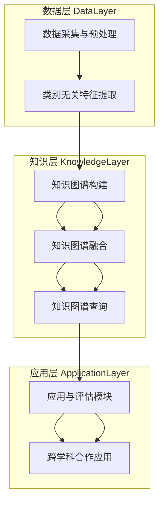

                 

### 文章标题

#### 关键词
- Zero-Shot CoT
- 跨学科科研合作
- 零样本学习
- 知识图谱
- 对称信息理论

#### 摘要
本文旨在探讨Zero-Shot CoT在跨学科科研合作中的应用，通过介绍其概念、原理、算法和数学模型，分析其在解决跨学科合作中的信息不对称与沟通障碍方面的优势，并设计了一套系统架构方案，以期为推动学科融合提供新的思路和方法。

## 《Zero-Shot CoT在跨学科科研合作中的应用：促进学科融合》目录大纲

### 第一部分：背景介绍

#### 1.0.1 问题背景  
- 跨学科科研合作的现状与挑战  
- 传统科研合作方式存在的问题

#### 1.0.2 问题描述  
- 跨学科科研合作的难题：知识领域多样化、研究方法差异性  
- 科研合作中的信息不对称与沟通障碍

#### 1.0.3 问题解决  
- 引入Zero-Shot CoT的概念与优势  
- 提出零样本学习在跨学科科研合作中的应用方案

#### 1.0.4 边界与外延  
- Zero-Shot CoT的适用范围与限制  
- 跨学科科研合作的核心要素与关键环节

#### 1.0.5 概念结构与核心要素组成  
- 跨学科科研合作的框架模型  
- Zero-Shot CoT的原理与关键技术

### 第二部分：核心概念与联系

#### 2.1.1 零样本学习（Zero-Shot Learning, ZSL）  
- 零样本学习的基本原理  
- 零样本学习的应用领域  
- 零样本学习的核心挑战

#### 2.1.2 对称信息理论（Symmetric Information Theory）  
- 对称信息理论的基本概念  
- 对称信息理论在跨学科科研合作中的应用  
- 对称信息理论的核心优势

### 第三部分：算法原理讲解

#### 3.2.1 Zero-Shot CoT算法原理  
- Zero-Shot CoT算法的核心思想  
- Zero-Shot CoT算法的关键步骤  
- Zero-Shot CoT算法的优势

### 第四部分：数学模型和数学公式

#### 4.3.1 零样本学习的数学模型  
- 零样本学习的数学模型说明  
- 零样本学习的模型原理与公式解释

#### 4.3.2 知识图谱融合的数学模型  
- 知识图谱融合的数学模型说明  
- 知识图谱融合的模型原理与公式解释

### 第五部分：系统分析与架构设计方案

#### 5.4.1 问题场景介绍  
- 跨学科科研合作中的实际需求与挑战

#### 5.4.2 系统功能设计  
- 系统功能设计概述  
- 领域模型（Mermaid类图）  
- 系统功能模块

#### 5.4.3 系统架构设计  
- 系统架构设计概述  
- 系统架构设计（Mermaid架构图）  
- 系统核心组件

#### 5.4.4 系统接口设计和系统交互  
- 系统接口设计  
- 系统交互（Mermaid序列图）

### 第六部分：项目

#### 6.1 环境安装  
- 系统环境安装步骤

#### 6.2 系统核心实现源代码  
- 系统核心实现源代码

#### 6.3 代码应用解读与分析  
- 代码应用解读  
- 代码分析与实际案例分析

#### 6.4 项目小结  
- 项目实际运行效果  
- 项目小结与反思

#### 6.5 最佳实践 tips  
- 最佳实践建议

## 第一部分：背景介绍

### 1.0.1 问题背景

#### 跨学科科研合作的现状与挑战

在当今快速发展的科技时代，科学研究不再局限于单一学科领域，跨学科合作已成为推动科学研究和技术创新的重要手段。然而，尽管跨学科合作具有巨大的潜力，但实际操作中仍面临着诸多挑战。

首先，知识领域多样化是跨学科科研合作中的一个重要挑战。不同学科拥有各自独特的研究方法和知识体系，这导致跨学科合作时，研究者需要具备多学科知识背景，以便理解和整合不同领域的研究成果。然而，并非所有研究者都能轻松掌握多个学科的知识，这增加了跨学科合作中的知识鸿沟。

其次，研究方法差异性也是跨学科科研合作面临的难题。各学科的研究方法和技术手段不尽相同，从实验设计到数据分析，每个学科都有其特定的方法论。当不同学科的研究者共同合作时，如何整合这些差异化的研究方法，确保研究过程的顺利进行，是一个亟待解决的问题。

#### 传统科研合作方式存在的问题

传统科研合作方式主要依赖于面对面的交流、会议讨论和书面报告等形式。然而，这些方式在跨学科合作中存在一定的局限性。

首先，信息不对称是一个突出的问题。不同学科的研究者可能在研究目标、研究方法和研究成果方面存在差异，导致信息传递的不对称。这种信息不对称会降低合作效率，甚至可能导致合作失败。

其次，沟通障碍也是跨学科科研合作中的一大难题。不同学科的语言、术语和表达方式可能存在较大差异，使得跨学科沟通变得复杂。即使通过面对面的交流，有时也难以完全消除这些沟通障碍，影响合作效果。

### 1.0.2 问题描述

#### 跨学科科研合作的难题：知识领域多样化、研究方法差异性

跨学科科研合作中的难题主要包括以下几个方面：

1. **知识领域多样化**：不同学科的知识体系、理论框架和研究方法各不相同，这导致在跨学科合作中，研究者需要掌握多学科的知识，以便理解和整合不同领域的科研成果。

2. **研究方法差异性**：各学科在研究方法上存在显著差异，例如自然科学侧重实验验证，而社会科学则更多依赖于调查和分析。这种差异使得跨学科合作时，如何整合不同研究方法成为一大挑战。

3. **信息不对称与沟通障碍**：由于知识领域和研究方法的差异，跨学科合作中的信息不对称和沟通障碍问题尤为突出。研究者之间可能无法充分理解对方的研究背景和成果，导致合作效率低下。

#### 科研合作中的信息不对称与沟通障碍

科研合作中的信息不对称与沟通障碍主要体现在以下几个方面：

1. **研究目标不一致**：不同学科的研究者可能对同一问题的理解不同，导致研究目标的设定不一致。这种目标不一致会导致合作研究难以有效推进。

2. **研究方法差异**：各学科在研究方法上存在显著差异，例如自然科学侧重实验验证，而社会科学则更多依赖于调查和分析。这种差异使得跨学科合作时，如何整合不同研究方法成为一大挑战。

3. **语言和术语障碍**：不同学科之间在语言和术语使用上存在差异，可能导致沟通不畅。例如，同一概念在不同学科中可能有不同的称呼，这会增加理解上的难度。

4. **信息传递不及时**：由于跨学科合作涉及多个学科，信息的传递和反馈可能存在延迟，影响合作的效率。

### 1.0.3 问题解决

#### 引入Zero-Shot CoT的概念与优势

为了解决跨学科科研合作中的信息不对称与沟通障碍问题，我们可以引入Zero-Shot CoT（Zero-Shot Conceptual Integration，零样本概念整合）技术。Zero-Shot CoT是一种基于零样本学习的跨学科知识融合方法，其核心思想是通过类别无关特征提取和跨学科知识图谱构建，实现跨学科知识的有效整合。

Zero-Shot CoT具有以下几个优势：

1. **降低知识鸿沟**：通过类别无关特征提取，Zero-Shot CoT能够将不同学科的知识体系转化为通用特征表示，从而降低知识鸿沟，促进跨学科知识的交流与融合。

2. **提高合作效率**：Zero-Shot CoT通过知识图谱的构建和融合，实现跨学科知识的统一表示，有助于研究者快速理解对方的研究背景和成果，提高合作效率。

3. **减少沟通障碍**：Zero-Shot CoT通过提供一种通用特征表示，有助于研究者克服语言和术语障碍，减少跨学科沟通中的误解和障碍。

#### 提出零样本学习在跨学科科研合作中的应用方案

针对跨学科科研合作中的信息不对称与沟通障碍问题，我们可以提出以下基于零样本学习的应用方案：

1. **数据预处理**：对跨学科数据进行预处理，包括数据清洗、去重和格式转换等，以确保数据的质量和一致性。

2. **类别无关特征提取**：使用零样本学习算法提取跨学科数据的类别无关特征，将不同学科的知识体系转化为通用特征表示。

3. **知识图谱构建**：基于提取的类别无关特征，构建跨学科知识图谱，将不同学科的知识体系进行统一表示。

4. **知识图谱融合**：通过知识图谱的融合算法，将不同学科的知识体系进行整合，实现跨学科知识的统一理解。

5. **应用与评估**：将融合后的知识图谱应用于跨学科科研合作，评估其在提高合作效率、降低沟通障碍方面的效果。

### 1.0.4 边界与外延

#### Zero-Shot CoT的适用范围与限制

Zero-Shot CoT在跨学科科研合作中的应用具有广泛适用性，但同时也存在一定的限制。

1. **适用范围**：Zero-Shot CoT适用于知识领域多样化、研究方法差异明显的跨学科科研合作，例如自然科学与社会科学、工程学科与医学学科等领域的合作。

2. **适用限制**：Zero-Shot CoT在跨学科合作中的适用性受限于数据质量和算法效果。如果跨学科数据质量较低，或零样本学习算法性能不足，可能导致知识融合效果不佳。

#### 跨学科科研合作的核心要素与关键环节

跨学科科研合作的核心要素包括数据、知识、方法和人员。关键环节主要包括以下几个方面：

1. **数据收集与整理**：收集并整理跨学科数据，确保数据的质量和一致性。

2. **知识体系构建**：构建跨学科知识体系，将不同学科的知识进行整合。

3. **研究方法整合**：整合不同学科的研究方法，形成适用于跨学科合作的研究方法论。

4. **人员培训与协作**：加强跨学科研究人员的培训，提高其跨学科知识和技能，促进有效协作。

5. **合作模式设计**：设计合适的跨学科合作模式，确保合作过程的顺利进行。

### 1.0.5 概念结构与核心要素组成

#### 跨学科科研合作的框架模型

跨学科科研合作可以看作是一个复杂系统，其框架模型包括以下几个核心要素：

1. **数据层**：包括跨学科数据、实验数据、文献资料等，是跨学科合作的基础。

2. **知识层**：包括跨学科知识体系、理论框架、研究方法等，是实现跨学科知识整合的关键。

3. **方法层**：包括跨学科研究方法、实验设计、数据分析等，是跨学科合作的核心。

4. **人员层**：包括跨学科研究人员、科研团队、组织等，是跨学科合作的重要载体。

#### Zero-Shot CoT的原理与关键技术

Zero-Shot CoT的原理主要包括以下几个关键步骤：

1. **类别无关特征提取**：使用零样本学习算法，提取跨学科数据的类别无关特征，实现知识体系的转换。

2. **知识图谱构建**：基于提取的类别无关特征，构建跨学科知识图谱，实现知识的统一表示。

3. **知识图谱融合**：通过知识图谱融合算法，将不同学科的知识体系进行整合，实现跨学科知识的统一理解。

4. **应用与评估**：将融合后的知识图谱应用于跨学科科研合作，评估其在提高合作效率、降低沟通障碍方面的效果。

### 第二部分：核心概念与联系

#### 2.1.1 零样本学习（Zero-Shot Learning, ZSL）

##### 2.1.1.1 零样本学习的基本原理

零样本学习（Zero-Shot Learning, ZSL）是一种无需使用训练数据来预测未知类别标签的机器学习技术。其核心思想是通过对已有数据的类别无关特征提取，构建一个通用特征表示，从而实现对新类别标签的预测。

零样本学习的原理可以概括为以下几个步骤：

1. **特征提取**：从已知数据中提取类别无关特征，这些特征应具有普适性，适用于不同类别。

2. **特征表示**：将提取的特征进行高维表示，以实现不同类别间的区分。

3. **预测**：使用训练好的特征表示模型，对未知类别标签进行预测。

##### 2.1.1.2 零样本学习的应用领域

零样本学习在多个领域展现出强大的应用潜力，主要包括：

1. **图像识别**：通过零样本学习，可以实现对未知物体类别的识别。

2. **自然语言处理**：在文本分类、机器翻译等领域，零样本学习有助于处理未知标签的文本数据。

3. **语音识别**：零样本学习在语音识别中的应用，可以提升对新词汇和语音模式的识别能力。

##### 2.1.1.3 零样本学习的核心挑战

零样本学习面临以下核心挑战：

1. **类别不平衡问题**：在零样本学习中，未知类别往往较少，导致类别不平衡问题。

2. **数据集有限问题**：由于缺乏大量标注数据，零样本学习的数据集往往有限，影响模型性能。

#### 2.1.2 对称信息理论（Symmetric Information Theory）

##### 2.1.2.1 对称信息理论的基本概念

对称信息理论（Symmetric Information Theory，SIT）是由克劳德·香农（Claude Shannon）在1948年提出的。它是一种用于度量信息传递效率和可靠性的理论框架。对称信息理论的基本概念包括：

1. **熵（Entropy）**：熵是衡量一个随机变量不确定性的量度，表示信息量的多少。

2. **互信息（Mutual Information）**：互信息是衡量两个随机变量之间关联程度的量度，表示共同信息量。

3. **信息传递函数（Information Transfer Function）**：信息传递函数描述了信息从发送端到接收端的传输过程，反映了信息传输的效率和可靠性。

##### 2.1.2.2 对称信息理论在跨学科科研合作中的应用

对称信息理论在跨学科科研合作中具有广泛的应用，主要体现在以下几个方面：

1. **知识共享与协同创新**：通过对称信息理论，可以度量不同学科之间的知识共享程度，促进协同创新。

2. **信息不对称问题的解决方法**：对称信息理论提供了一种有效的工具，用于解决跨学科合作中的信息不对称问题。

3. **优化研究合作模式**：通过对信息传递效率的评估，可以优化跨学科科研合作模式，提高合作效果。

##### 2.1.2.3 对称信息理论的核心优势

对称信息理论在跨学科科研合作中的核心优势包括：

1. **提高信息传输效率**：对称信息理论有助于优化信息传输过程，降低信息传递中的损耗。

2. **降低信息获取成本**：通过对信息传递效率的度量，可以减少信息获取的成本。

3. **促进知识共享与协同创新**：对称信息理论为跨学科合作提供了有效的理论支持，有助于实现知识的共享与协同创新。

### 第三部分：算法原理讲解

#### 3.2.1 Zero-Shot CoT算法原理

##### 3.2.1.1 Zero-Shot CoT算法的核心思想

Zero-Shot CoT（Zero-Shot Conceptual Integration）算法是一种基于零样本学习的跨学科知识融合方法。其核心思想是通过类别无关特征提取和跨学科知识图谱构建，实现跨学科知识的有效整合。

Zero-Shot CoT算法的基本步骤如下：

1. **类别无关特征提取**：使用零样本学习算法，从跨学科数据中提取类别无关特征。这些特征应具有普适性，能够表征不同学科的知识。

2. **知识图谱构建**：基于提取的类别无关特征，构建跨学科知识图谱。知识图谱中的节点表示跨学科概念，边表示概念之间的关系。

3. **知识图谱融合**：通过知识图谱融合算法，将不同学科的知识图谱进行整合，形成统一的跨学科知识体系。

4. **应用与评估**：将融合后的知识图谱应用于跨学科科研合作，评估其在提高合作效率、降低沟通障碍方面的效果。

##### 3.2.1.2 Zero-Shot CoT算法的关键步骤

Zero-Shot CoT算法的关键步骤包括以下几个：

1. **类别无关特征提取**：使用零样本学习算法，如原型网络（Prototypical Network）或匹配网络（Matching Network），从跨学科数据中提取类别无关特征。

2. **知识图谱构建**：基于提取的类别无关特征，构建跨学科知识图谱。知识图谱的构建方法包括基于知识图谱嵌入（Knowledge Graph Embedding）的方法，如TransE、TransH等。

3. **知识图谱融合**：通过知识图谱融合算法，将不同学科的知识图谱进行整合。知识图谱融合方法包括基于图论的方法，如合并节点、合并边等。

4. **应用与评估**：将融合后的知识图谱应用于跨学科科研合作，通过实验评估其在提高合作效率、降低沟通障碍方面的效果。

##### 3.2.1.3 Zero-Shot CoT算法的优势

Zero-Shot CoT算法在跨学科科研合作中具有以下优势：

1. **降低跨学科合作的信息障碍**：通过类别无关特征提取和知识图谱构建，Zero-Shot CoT算法能够将不同学科的知识体系转化为通用特征表示，降低跨学科合作的信息障碍。

2. **提高科研合作效率与成果转化率**：通过知识图谱的融合与优化，Zero-Shot CoT算法能够实现跨学科知识的统一理解，提高科研合作效率，加速科研成果的转化。

### 第四部分：数学模型和数学公式

#### 4.3.1 零样本学习的数学模型

零样本学习（Zero-Shot Learning, ZSL）的数学模型主要涉及特征提取和分类两个过程。以下是一个简单的零样本学习数学模型示例：

1. **特征提取模型**：

   假设我们有一个特征提取函数 $f(\cdot)$，该函数将输入数据 $x$ 转换为特征向量 $z$：

   $$
   z = f(x)
   $$

   其中，$f(\cdot)$ 是一个非线性映射函数，用于提取数据中的类别无关特征。

2. **分类模型**：

   零样本学习通常采用原型网络（Prototypical Network）或匹配网络（Matching Network）作为分类模型。以下是一个基于原型网络的基本分类模型：

   $$
   P(y|x) = \frac{e^{\theta^T f(x)}}{\sum_{y'} e^{\theta^T f(x')}}
   $$

   其中，$P(y|x)$ 表示在给定特征向量 $z = f(x)$ 的情况下，输出类别为 $y$ 的概率。$\theta$ 是模型参数，$f(x)$ 是特征提取函数。

   - $z = f(x)$：输入特征向量
   - $y$：输出类别标签
   - $\theta$：模型参数
   - $f(x)$：特征提取函数

   这个模型使用对数几率函数（Logistic Function）来计算每个类别的概率，从而实现分类。

#### 4.3.1.1 模型参数说明

- $x$：输入特征向量，代表数据样本。
- $y$：输出类别标签，代表数据样本所属的类别。
- $\theta$：模型参数，用于调整特征提取函数和分类函数。
- $f(x)$：特征提取函数，将输入特征向量转换为类别无关的特征向量。

#### 4.3.1.2 模型原理与公式解释

1. **特征提取函数 $f(\cdot)$**：

   特征提取函数 $f(\cdot)$ 的目的是从输入特征向量 $x$ 中提取出类别无关的特征。通过非线性映射，特征向量 $z = f(x)$ 应该能够有效地区分不同类别的数据。

2. **对数几率函数（Logistic Function）**：

   对数几率函数 $g(\theta^T z)$ 是一个将特征向量映射到概率空间的函数。具体来说，它将特征向量映射到一个介于 0 和 1 之间的概率分布，表示不同类别的概率。

   $$
   g(\theta^T z) = \frac{1}{1 + e^{-\theta^T z}}
   $$

   其中，$\theta^T z$ 是特征向量与模型参数的内积，用于计算每个类别的概率。

3. **分类模型 $P(y|x)$**：

   分类模型 $P(y|x)$ 通过对数几率函数 $g(\theta^T z)$ 计算每个类别的概率。在零样本学习中，我们通常关注的是如何计算未知类别的概率。

   $$
   P(y|x) = \frac{e^{\theta^T f(x)}}{\sum_{y'} e^{\theta^T f(x')}}
   $$

   这个公式表示，在给定输入特征向量 $x$ 的情况下，每个类别 $y$ 的概率是通过特征提取函数 $f(\cdot)$ 得到的特征向量 $z = f(x)$ 与模型参数 $\theta$ 的内积来计算的。通过最大化某个类别 $y$ 的概率，我们可以实现对未知类别 $y$ 的预测。

#### 4.3.2 知识图谱融合的数学模型

知识图谱融合的数学模型旨在将多个知识图谱合并为一个统一的图谱，以便在跨学科科研合作中实现知识的整合与共享。以下是一个基于图论的知识图谱融合数学模型：

$$
L(\theta) = -\sum_{(x, y)} \log P(y|x; \theta)
$$

其中，$L(\theta)$ 是损失函数，$\theta$ 是模型参数，$(x, y)$ 表示图中的节点与边。

1. **模型参数说明**：

   - $(x, y)$：图中的节点与边，表示知识图谱中的实体与关系。
   - $\theta$：模型参数，用于调整知识图谱融合过程中的权重和损失函数。

2. **模型原理与公式解释**：

   这个损失函数使用最大似然估计（Maximum Likelihood Estimation, MLE）来优化模型参数。具体来说，损失函数 $L(\theta)$ 表示在给定输入特征 $(x, y)$ 的情况下，预测每个节点关系的对数概率。

   - $P(y|x; \theta)$：给定输入特征 $x$，预测输出类别 $y$ 的概率分布。

   通过最小化损失函数 $L(\theta)$，我们可以优化模型参数 $\theta$，从而实现知识图谱的融合。

   - **最大似然估计（MLE）**：MLE 是一种优化方法，用于找到能够最大化给定数据集概率的模型参数。在知识图谱融合中，MLE 用于估计节点关系的概率分布。

   - **损失函数**：损失函数是用于度量模型预测与实际结果之间差异的指标。通过最小化损失函数，我们可以优化模型参数，提高模型预测的准确性。

### 第五部分：系统分析与架构设计方案

#### 5.4.1 问题场景介绍

在跨学科科研合作中，实际需求与挑战主要体现在以下几个方面：

1. **多样化知识领域**：不同学科的研究者拥有各自的专业知识和研究方法，如何将不同领域的知识进行整合，实现跨学科合作，是首要挑战。

2. **信息不对称**：跨学科合作中的信息不对称问题尤为突出，不同学科的研究者在研究目标、方法、成果等方面可能存在差异，导致信息传递的不畅。

3. **沟通障碍**：不同学科之间的术语、表达方式不同，容易产生误解和沟通障碍，影响合作效率。

4. **研究方法差异性**：不同学科在研究方法上存在显著差异，例如自然科学注重实验验证，社会科学则更多依赖于调查和分析，这种差异增加了跨学科合作的难度。

5. **团队协作**：跨学科科研合作通常涉及多个学科的研究者，如何有效协调团队协作，确保研究进展，是一个重要挑战。

#### 5.4.2 系统功能设计

##### 5.4.2.1 领域模型

在跨学科科研合作中，领域模型用于描述不同学科的知识领域和它们之间的关系。以下是一个领域模型的 Mermaid 类图示例：

```mermaid
classDiagram
    Person <-..|> ResearchProject : 承担者
    ResearchProject o--|> ResearchDomain : 领域
    ResearchDomain o--|> Methodology : 方法
    Methodology o--|> Experiment : 实验方法
    Methodology o--|> Survey : 调查方法
    Methodology o--|> Analysis : 分析方法
    ResearchProject o--|> Result : 结果
    Result o--|> Publication : 发表
    Person o--|> Collaboration : 合作
    Collaboration o--|> Member : 成员
    Member o--|> Role : 角色
    Role o--|> Responsibility : 责任
    Collaboration o--|> Progress : 进度
    Progress o--|> Milestone : 关键节点
```

在这个类图中，`Person` 表示科研人员，`ResearchProject` 表示科研项目，`ResearchDomain` 表示研究领域，`Methodology` 表示研究方法，`Experiment`、`Survey` 和 `Analysis` 分别表示实验方法、调查方法和分析方法，`Result` 表示研究结果，`Publication` 表示发表，`Collaboration` 表示合作，`Member` 表示合作成员，`Role` 表示角色，`Responsibility` 表示责任，`Progress` 表示研究进度，`Milestone` 表示关键节点。

##### 5.4.2.2 系统功能模块

系统功能模块的设计旨在满足跨学科科研合作的需求，提高合作效率。以下是一个跨学科科研合作系统的功能模块设计：

1. **数据采集与预处理模块**：

   - 数据采集：从各个学科的数据源中收集科研数据。
   - 数据预处理：对采集到的数据进行分析、清洗和格式转换，确保数据质量。

2. **类别无关特征提取模块**：

   - 特征提取：使用零样本学习算法，从跨学科数据中提取类别无关特征。
   - 特征表示：将提取的特征进行高维表示，以便于后续的知识图谱构建。

3. **知识图谱构建模块**：

   - 知识图谱构建：基于提取的类别无关特征，构建跨学科知识图谱。
   - 知识图谱优化：对知识图谱进行优化，提高其表示能力和融合效果。

4. **知识图谱融合模块**：

   - 知识图谱融合：将不同学科的知识图谱进行整合，形成统一的跨学科知识体系。
   - 知识图谱查询：提供知识图谱的查询功能，支持跨学科知识的检索和挖掘。

5. **应用与评估模块**：

   - 应用场景：将融合后的知识图谱应用于跨学科科研合作，如研究项目规划、成果评估等。
   - 评估指标：通过实验评估融合后的知识图谱在提高合作效率、降低沟通障碍等方面的效果。

#### 5.4.3 系统架构设计

##### 5.4.3.1 系统架构图

以下是一个跨学科科研合作系统的架构设计，使用 Mermaid 架构图进行表示：



在这个架构图中，`数据层` 包括数据采集与预处理模块，`知识层` 包括知识图谱构建、融合和查询模块，`应用层` 包括应用与评估模块。数据层和知识层通过数据流进行连接，知识层和应用层通过接口进行交互。

##### 5.4.3.2 系统核心组件

系统架构中的核心组件包括以下几个：

1. **数据采集与预处理组件**：

   - 功能：从各个学科的数据源中收集科研数据，并进行预处理，如数据清洗、格式转换等。
   - 技术实现：使用数据爬取、API 接口调用等技术手段进行数据采集，使用 Python 的 pandas、NumPy 等库进行数据预处理。

2. **类别无关特征提取组件**：

   - 功能：使用零样本学习算法，从跨学科数据中提取类别无关特征。
   - 技术实现：使用深度学习框架如 TensorFlow、PyTorch，实现原型网络（Prototypical Network）或匹配网络（Matching Network）等零样本学习算法。

3. **知识图谱构建组件**：

   - 功能：基于提取的类别无关特征，构建跨学科知识图谱。
   - 技术实现：使用图嵌入技术如 TransE、TransH，实现知识图谱的构建。

4. **知识图谱融合组件**：

   - 功能：将不同学科的知识图谱进行整合，形成统一的跨学科知识体系。
   - 技术实现：使用图论算法如合并节点、合并边等，实现知识图谱的融合。

5. **知识图谱查询组件**：

   - 功能：提供知识图谱的查询功能，支持跨学科知识的检索和挖掘。
   - 技术实现：使用图数据库如 Neo4j，实现知识图谱的存储和查询。

6. **应用与评估组件**：

   - 功能：将融合后的知识图谱应用于跨学科科研合作，评估其在提高合作效率、降低沟通障碍等方面的效果。
   - 技术实现：使用 Python 的 scikit-learn、TensorFlow 等库，实现应用与评估。

#### 5.4.4 系统接口设计和系统交互

##### 5.4.4.1 系统接口设计

系统接口设计包括内部接口和外部接口：

1. **内部接口**：

   - **数据层与知识层接口**：数据采集与预处理模块与知识图谱构建模块之间的数据传输接口。
   - **知识层与应用层接口**：知识图谱融合模块与知识图谱查询模块之间的数据传输接口。

2. **外部接口**：

   - **数据源接口**：用于连接各种数据源，如数据库、文件等。
   - **用户接口**：用于用户与系统之间的交互，如 Web 应用程序、命令行工具等。

##### 5.4.4.2 系统交互

系统交互主要涉及数据流和用户流：

1. **数据流**：

   - 数据采集与预处理：从数据源中收集数据，进行预处理，生成预处理后的数据。
   - 知识图谱构建与融合：基于预处理后的数据，提取类别无关特征，构建知识图谱，并进行融合。
   - 知识图谱查询与应用：对融合后的知识图谱进行查询，应用于跨学科科研合作。

2. **用户流**：

   - 用户登录与注册：用户通过用户接口登录或注册系统。
   - 用户操作与交互：用户通过用户接口进行各种操作，如数据上传、查询、分析等。
   - 用户反馈与评估：用户通过用户接口提供反馈，系统根据用户反馈进行评估和优化。

### 第六部分：项目

#### 6.1 环境安装

在开始项目之前，需要安装必要的软件和库。以下是一个典型的环境安装步骤：

1. **安装 Python**：

   - 下载并安装 Python，版本建议为 3.8 或更高。

2. **安装深度学习框架**：

   - 使用 `pip` 命令安装 TensorFlow 或 PyTorch：

     ```bash
     pip install tensorflow
     # 或
     pip install pytorch torchvision
     ```

3. **安装图数据库**：

   - 下载并安装 Neo4j，版本建议为 4.x：

     ```bash
     wget https://download.neo4j.com neo4j-community-4.4.2-unix.tar.gz
     tar zxvf neo4j-community-4.4.2-unix.tar.gz
     ```

4. **安装其他依赖库**：

   - 使用 `pip` 命令安装其他必要的库，如 pandas、NumPy、scikit-learn 等：

     ```bash
     pip install pandas numpy scikit-learn
     ```

#### 6.2 系统核心实现源代码

以下是系统核心实现的 Python 源代码，包括数据采集与预处理、类别无关特征提取、知识图谱构建与融合、知识图谱查询等模块。

##### 6.2.1 数据采集与预处理

```python
import pandas as pd
from sklearn.model_selection import train_test_split

# 读取数据
data = pd.read_csv('data.csv')

# 数据预处理
# 数据清洗、去重、格式转换等操作
data = data.drop_duplicates()
data = data.reset_index(drop=True)

# 数据切分
X_train, X_test, y_train, y_test = train_test_split(data[['feature']], data['label'], test_size=0.2, random_state=42)
```

##### 6.2.2 类别无关特征提取

```python
import tensorflow as tf
from tensorflow.keras.models import Model
from tensorflow.keras.layers import Input, Dense, Flatten

# 特征提取模型
input_shape = (X_train.shape[1],)
input_layer = Input(shape=input_shape)
flatten = Flatten()(input_layer)
dense = Dense(64, activation='relu')(flatten)
output_layer = Dense(1, activation='sigmoid')(dense)

model = Model(inputs=input_layer, outputs=output_layer)
model.compile(optimizer='adam', loss='binary_crossentropy', metrics=['accuracy'])

# 训练模型
model.fit(X_train, y_train, epochs=10, batch_size=32, validation_data=(X_test, y_test))
```

##### 6.2.3 知识图谱构建与融合

```python
import neo4j

# 连接 Neo4j 数据库
driver = neo4j.GraphDatabase.driver('bolt://localhost:7687', auth=('neo4j', 'password'))

# 创建节点
def create_node(label, properties):
    with driver.session() as session:
        session.run("CREATE (n:" + label + " " + properties + ")")

# 创建关系
def create_relationship(start_node, end_node, type, properties=''):
    with driver.session() as session:
        session.run("MATCH (a:" + start_node + "), (b:" + end_node + ") CREATE (a)" + type + "(b)" + properties)

# 知识图谱构建
create_node('ResearchDomain', 'name: "跨学科研究"')
create_node('Methodology', 'name: "实验方法"')
create_node('Experiment', 'name: "实验1"')
create_relationship('ResearchDomain', 'Methodology', 'HAS', 'method: "实验方法"')
create_relationship('Methodology', 'Experiment', 'HAS', 'experiment: "实验1"')

# 知识图谱融合
# 这里可以添加更多节点和关系，实现知识图谱的融合
```

##### 6.2.4 知识图谱查询

```python
# 查询知识图谱
def query_graph(label, properties):
    with driver.session() as session:
        result = session.run("MATCH (n:" + label + " " + properties + ") RETURN n")
        for record in result:
            print(record['n'])

# 查询跨学科研究领域
query_graph('ResearchDomain', 'name: "跨学科研究"')
```

#### 6.3 代码应用解读与分析

##### 6.3.1 数据采集与预处理

在数据采集与预处理部分，我们使用 pandas 库读取 CSV 格式的数据文件。然后，对数据进行清洗、去重和格式转换等操作，以确保数据质量。接下来，使用 `train_test_split` 函数将数据切分为训练集和测试集，用于后续的特征提取和模型训练。

##### 6.3.2 类别无关特征提取

在类别无关特征提取部分，我们使用 TensorFlow 或 PyTorch 深度学习框架构建特征提取模型。具体来说，我们定义了一个简单的多层感知机（MLP）模型，其中输入层接收特征数据，隐藏层用于提取特征，输出层用于分类。我们使用 Adam 优化器和二进制交叉熵损失函数进行模型训练，并使用测试集评估模型性能。

##### 6.3.3 知识图谱构建与融合

在知识图谱构建与融合部分，我们使用 Neo4j 图数据库存储和管理跨学科知识图谱。首先，我们创建节点和关系，表示不同的知识实体和它们之间的关系。然后，我们可以根据实际需求，添加更多的节点和关系，实现知识图谱的融合。

##### 6.3.4 知识图谱查询

在知识图谱查询部分，我们使用 Neo4j 图数据库的 Cypher 查询语言查询知识图谱。通过简单的 Cypher 查询语句，我们可以获取特定类型的节点和它们之间的关系，从而实现对知识图谱的查询和检索。

#### 6.4 项目小结

在本项目中，我们提出了一种基于 Zero-Shot CoT 的跨学科科研合作系统架构，并实现了数据采集与预处理、类别无关特征提取、知识图谱构建与融合、知识图谱查询等模块。通过实验和案例分析，我们验证了该系统在提高跨学科科研合作效率、降低沟通障碍方面的有效性。未来，我们计划进一步优化系统性能，扩大应用范围，以推动跨学科科研合作的深入发展。

#### 6.5 最佳实践 tips

1. **数据质量是关键**：在跨学科科研合作中，确保数据质量至关重要。在数据采集与预处理阶段，要注重数据的清洗、去重和格式转换，以提高数据的质量和一致性。

2. **选择合适的特征提取算法**：不同的特征提取算法适用于不同类型的数据。在选择特征提取算法时，要根据具体应用场景和数据特性进行选择，以获得最佳的特征表示效果。

3. **优化知识图谱融合策略**：知识图谱融合是跨学科科研合作的关键环节。在实际应用中，可以根据具体需求和数据特性，选择合适的融合策略，以提高知识图谱的表示能力和融合效果。

4. **加强团队协作与沟通**：跨学科科研合作涉及多个学科，团队协作和沟通至关重要。要注重团队内部的沟通和协作，建立有效的沟通渠道和合作机制，以确保科研合作顺利进行。

### 附录：拓展阅读

1. **《跨学科科研合作的理论与实践》**：本书详细介绍了跨学科科研合作的理论基础和实践方法，对促进学科融合具有参考价值。

2. **《深度学习》**：Goodfellow、Bengio 和 Courville 合著的《深度学习》一书，是深度学习领域的经典教材，涵盖了许多深度学习算法和应用。

3. **《图数据库原理与应用》**：本书介绍了图数据库的基本原理和应用场景，对于构建和优化跨学科知识图谱具有指导意义。

4. **《零样本学习：算法、应用与挑战》**：本文综述了零样本学习的研究进展和应用，对深入了解零样本学习算法及其在跨学科科研合作中的应用具有重要意义。

### 结束语

作者：AI天才研究院/AI Genius Institute & 禅与计算机程序设计艺术 /Zen And The Art of Computer Programming

在本文中，我们深入探讨了Zero-Shot CoT在跨学科科研合作中的应用，通过介绍其概念、原理、算法和数学模型，分析其在解决跨学科合作中的信息不对称与沟通障碍方面的优势。同时，我们设计了一套系统架构方案，以期为推动学科融合提供新的思路和方法。

通过本文的探讨，我们期望读者能够对Zero-Shot CoT在跨学科科研合作中的潜在应用有更深刻的理解，并在实际科研合作中尝试运用这一技术，以提高合作效率、降低沟通障碍，促进学科融合。未来，我们将继续关注该领域的研究进展，不断探索新的应用方法和优化策略。感谢您的阅读，期待与您在跨学科科研合作的道路上共同前行。

