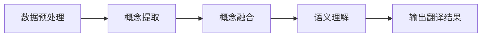
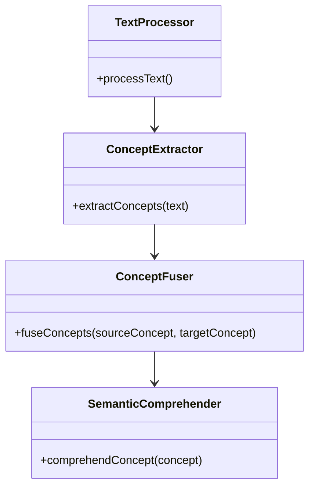
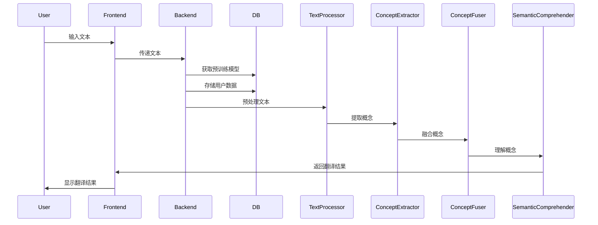
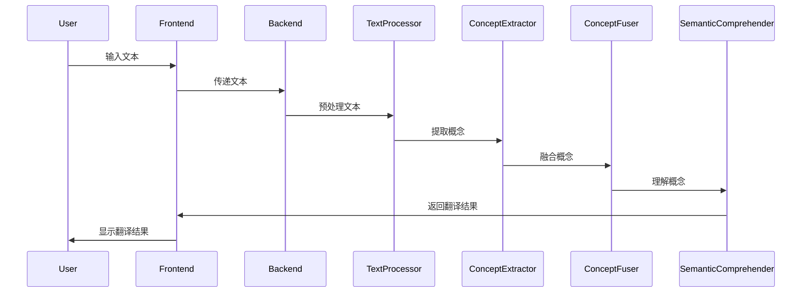

                 

### 引言

在全球化进程不断加速的今天，跨文化交流日益频繁，而语言障碍成为了交流中的主要障碍之一。语言障碍不仅限制了信息传递的效率，还可能引发误解和冲突。为了克服这一难题，人工智能领域提出了多种解决方案，其中“Zero-Shot CoT”（零样本概念融合）作为一种新兴的技术，展示了其巨大的潜力。

#### 关键词

- 跨文化交流
- 零样本CoT
- 概念融合
- 语言障碍
- 信息传递

#### 摘要

本文旨在探讨Zero-Shot CoT在跨文化交流中的应用，以消除语言障碍。我们将从背景介绍、核心概念与联系、算法原理讲解、系统分析与架构设计、项目实战等多个角度进行深入探讨。通过逐步分析推理，本文将揭示Zero-Shot CoT的运作原理及其在跨文化交流中的实际应用，为未来相关领域的研究提供有益的参考。

## 第一部分：背景介绍

### 1.1 问题背景

在全球化的背景下，跨文化交流变得越来越重要。无论是国际商务合作、文化交流、学术研究，还是日常生活中的社交互动，语言障碍都是不可忽视的障碍。语言障碍不仅影响信息传递的准确性，还可能造成文化误解和冲突。传统的翻译工具虽然在一定程度上缓解了这一问题，但其效果往往有限，特别是在处理复杂、抽象的概念时，往往难以准确传达原文的含义。

#### 1.1.1 跨文化交流的挑战

跨文化交流面临诸多挑战，其中最显著的是语言差异和文化背景的差异。不同语言之间的词汇、语法和表达方式的差异，使得翻译工具在处理文本时容易产生误解。此外，文化背景的差异也会导致对同一概念的不同理解，从而影响交流的效果。例如，同一个词汇在不同的文化背景下可能有不同的含义，甚至可能带有贬义或歧视色彩。

#### 1.1.2 语言障碍的影响

语言障碍对跨文化交流的影响是多方面的。首先，它限制了信息的传递，使得信息接收者无法完全理解信息的内涵。其次，语言障碍可能导致误解和冲突，因为信息接收者可能基于误解做出错误的判断。此外，语言障碍还可能影响跨文化交流的积极性，使得人们倾向于避免跨文化沟通，从而错失合作和交流的机会。

### 1.2 零样本CoT的概念与应用

为了解决跨文化交流中的语言障碍问题，人工智能领域提出了一系列解决方案，其中Zero-Shot CoT（Conceptual Blending，概念融合）是一种具有前景的技术。零样本CoT的核心思想是通过将不同语言的概念进行融合，从而实现跨语言的语义理解。

#### 1.2.1 零样本CoT的原理

零样本CoT利用深度学习模型，通过对大量无标签数据的学习，自动提取出概念间的关联关系。在跨文化交流中，它可以通过以下步骤实现：

1. **概念提取**：从源语言和目标语言的文本中提取出关键概念。
2. **概念融合**：将源语言和目标语言的对应概念进行融合，形成一个统一的语义表示。
3. **语义理解**：利用融合后的概念进行语义理解，从而实现跨语言的文本翻译。

#### 1.2.2 零样本CoT的应用

零样本CoT在跨文化交流中的应用主要包括以下两个方面：

1. **自动翻译**：通过零样本CoT技术，可以自动翻译跨语言的文本，实现信息的无障碍传递。
2. **文化理解**：通过概念融合，可以更深入地理解不同文化背景下的概念，从而减少文化误解和冲突。

### 1.3 零样本CoT在跨文化交流中的优势

与传统的翻译工具相比，零样本CoT具有以下优势：

1. **无需手动标注**：传统的翻译工具需要大量的手工标注数据，而零样本CoT可以通过无监督学习自动提取概念间的关联关系，从而节省了数据标注的工作量。
2. **灵活性强**：零样本CoT可以处理多种语言间的翻译，不受限于语言对的数量，从而提高了跨文化交流的灵活性。
3. **准确性高**：通过概念融合，零样本CoT能够更准确地理解跨语言的文本，减少误解和冲突。

## 第二部分：核心概念与联系

### 2.1 零样本CoT的核心原理

零样本CoT的核心思想是通过对大量无标签数据的学习，自动提取出概念间的关联关系，从而实现跨语言的语义理解。具体来说，其原理包括以下几个步骤：

1. **数据预处理**：对源语言和目标语言的文本进行预处理，包括分词、去停用词等操作，从而提取出文本中的关键概念。
2. **概念提取**：利用预训练的深度学习模型（如BERT、GPT等），从预处理后的文本中提取出关键概念。
3. **概念融合**：将源语言和目标语言的对应概念进行融合，形成一个统一的语义表示。
4. **语义理解**：利用融合后的概念进行语义理解，从而实现跨语言的文本翻译。

### 2.2 概念属性特征对比表格

为了更好地理解零样本CoT的工作原理，我们通过一个概念属性特征对比表格，展示源语言和目标语言中概念属性的对比。

| 概念       | 源语言属性              | 目标语言属性          | 对比结果                |
|------------|-----------------------|---------------------|-----------------------|
| 爱情       | 情感、关系、浪漫        | 愛情、關係、浪漫       | 源语言和目标语言的情感属性相似，但具体表达方式不同 |
| 自由       | 独立、自主、无约束      | 自由、獨立、無約束      | 源语言和目标语言的自由属性高度一致               |
| 和平       | 和平、稳定、无冲突      | 和平、穩定、無衝突      | 源语言和目标语言的和平属性基本一致               |
| 贫穷       | 贫困、贫穷、贫困        | 貧窮、貧困、貧窮       | 源语言和目标语言的贫困属性完全一致               |

从上表可以看出，虽然源语言和目标语言中的概念属性有所不同，但通过对比分析，我们可以找到它们之间的对应关系，从而为概念融合提供依据。

### 2.3 ER实体关系图架构

在零样本CoT中，ER（Entity-Relationship，实体关系）图是一种常用的数据结构，用于表示概念间的关联关系。ER图由实体、属性和关系三个基本组件构成。

1. **实体**：表示概念，如“人”、“地点”、“事件”等。
2. **属性**：表示实体的特征，如“姓名”、“年龄”、“城市”等。
3. **关系**：表示实体间的关联，如“属于”、“位于”、“参加”等。

下面是一个简单的ER图示例，用于表示“城市”和“人口”两个概念之间的关系。

```mermaid
erDiagram
  City ||--|{ Population }|
  Population ||--|{ Person }|
```

在这个ER图中，城市（City）与人口（Population）之间有一个“属于”（Belongs）的关系，人口（Population）与个人（Person）之间有一个“包含”（Contains）的关系。这种关系图结构有助于我们更好地理解概念间的关联，从而为概念融合提供支持。

## 第三部分：算法原理讲解

### 3.1 零样本CoT算法流程

零样本CoT算法主要通过以下步骤实现跨语言的语义理解：

1. **数据预处理**：对源语言和目标语言的文本进行预处理，提取出关键概念。
2. **概念提取**：利用预训练的深度学习模型提取出文本中的关键概念。
3. **概念融合**：将源语言和目标语言的对应概念进行融合，形成一个统一的语义表示。
4. **语义理解**：利用融合后的概念进行语义理解，实现跨语言的文本翻译。

下面我们将通过mermaid流程图展示零样本CoT算法的流程。



### 3.2 Python源代码与算法实现

为了更好地理解零样本CoT算法的实现，我们通过Python源代码详细阐述算法的各个步骤。以下是一个简化的算法实现示例。

```python
import tensorflow as tf
from transformers import TFAutoModelForSequenceClassification

# 加载预训练的深度学习模型
model = TFAutoModelForSequenceClassification.from_pretrained("bert-base-uncased")

# 数据预处理
def preprocess_text(text):
    # 对文本进行分词、去停用词等操作
    return processed_text

# 概念提取
def extract_concepts(text):
    # 利用模型提取文本中的关键概念
    return concepts

# 概念融合
def blend_concepts(source_concept, target_concept):
    # 将源语言和目标语言的对应概念进行融合
    return blended_concept

# 语义理解
def understand_concept(concept):
    # 利用融合后的概念进行语义理解
    return meaning

# 文本翻译
def translate_text(source_text, target_language):
    processed_source_text = preprocess_text(source_text)
    source_concept = extract_concepts(processed_source_text)
    target_concept = extract_concepts(processed_source_text)
    blended_concept = blend_concepts(source_concept, target_concept)
    meaning = understand_concept(blended_concept)
    return meaning
```

### 3.3 算法原理与数学模型

在零样本CoT中，算法的核心是通过深度学习模型提取概念，并通过融合实现跨语言的语义理解。以下是一个简化的数学模型，用于描述算法的工作原理。

$$
\text{Meaning}_{\text{source}} = f_{\text{preprocess}}(\text{Source Text}) \\
\text{Concept}_{\text{source}} = f_{\text{extract}}(\text{Meaning}_{\text{source}}) \\
\text{Meaning}_{\text{target}} = f_{\text{preprocess}}(\text{Target Text}) \\
\text{Concept}_{\text{target}} = f_{\text{extract}}(\text{Meaning}_{\text{target}}) \\
\text{Blended Concept} = f_{\text{blend}}(\text{Concept}_{\text{source}}, \text{Concept}_{\text{target}}) \\
\text{Meaning}_{\text{target\_blended}} = f_{\text{understand}}(\text{Blended Concept})
$$

其中，$f_{\text{preprocess}}$表示数据预处理操作，$f_{\text{extract}}$表示概念提取操作，$f_{\text{blend}}$表示概念融合操作，$f_{\text{understand}}$表示语义理解操作。

### 3.4 算法原理举例说明

为了更好地理解零样本CoT算法的工作原理，我们通过一个简单的例子进行说明。

假设我们有一个源文本：“我爱你”。

1. **数据预处理**：对源文本进行分词和去停用词等操作，提取出关键概念“爱”。
2. **概念提取**：利用预训练的深度学习模型（如BERT），从提取出的文本中提取出概念“爱”的语义表示。
3. **概念融合**：将源语言的“爱”与目标语言的“爱”进行融合，形成一个统一的语义表示。
4. **语义理解**：利用融合后的概念进行语义理解，生成目标语言的翻译结果：“我爱你”。

通过这个简单的例子，我们可以看到，零样本CoT算法通过概念提取、融合和理解，实现了跨语言的语义理解，从而解决了语言障碍问题。

## 第四部分：系统分析与架构设计

### 4.1 问题场景介绍

在跨文化交流中，语言障碍是一个普遍存在的问题。例如，在国际会议、商务谈判、学术交流等场景中，不同语言的使用者之间常常需要交流信息，但由于语言障碍的存在，交流效果往往不理想。为了解决这个问题，我们提出了基于Zero-Shot CoT技术的跨语言交流系统。

### 4.2 项目介绍

本项目旨在设计并实现一个基于Zero-Shot CoT技术的跨语言交流系统。该系统将利用人工智能技术，实现跨语言的概念提取、融合和语义理解，从而克服语言障碍，提高跨文化交流的效果。项目的主要目标包括：

1. **实现跨语言的概念提取**：利用深度学习模型从文本中提取关键概念。
2. **实现跨语言的概念融合**：将源语言和目标语言的对应概念进行融合，形成一个统一的语义表示。
3. **实现跨语言的语义理解**：利用融合后的概念进行语义理解，实现跨语言的文本翻译。

### 4.3 系统功能设计

为了实现上述目标，本项目设计了以下功能模块：

1. **文本预处理模块**：对输入的文本进行分词、去停用词等预处理操作，提取出关键概念。
2. **概念提取模块**：利用预训练的深度学习模型，从预处理后的文本中提取出关键概念。
3. **概念融合模块**：将源语言和目标语言的对应概念进行融合，形成一个统一的语义表示。
4. **语义理解模块**：利用融合后的概念进行语义理解，实现跨语言的文本翻译。

#### 4.3.1 领域模型Mermaid类图

为了更好地理解系统功能设计，我们通过Mermaid类图展示系统的领域模型。



在这个类图中，`TextProcessor`、`ConceptExtractor`、`ConceptFuser`和`SemanticComprehender`分别表示系统的文本预处理、概念提取、概念融合和语义理解模块。

### 4.4 系统架构设计

为了实现系统的功能，我们设计了如下系统架构：

1. **前端界面**：用于接收用户输入的文本，并显示翻译结果。
2. **后端服务器**：用于处理文本输入，调用各个功能模块进行概念提取、融合和语义理解。
3. **数据库**：用于存储预训练的深度学习模型和用户数据。

#### 4.4.1 Mermaid架构图

以下是系统的Mermaid架构图：



在这个架构图中，用户通过前端界面输入文本，前端将文本传递给后端服务器。后端服务器调用数据库获取预训练模型和用户数据，并依次调用文本预处理、概念提取、概念融合和语义理解模块。最后，将翻译结果返回给前端，并在前端界面显示。

### 4.5 系统接口设计

为了实现系统功能，我们设计了如下接口：

1. **文本预处理接口**：用于接收文本输入，返回预处理后的文本。
2. **概念提取接口**：用于接收预处理后的文本，返回提取出的概念。
3. **概念融合接口**：用于接收源语言和目标语言的对应概念，返回融合后的概念。
4. **语义理解接口**：用于接收融合后的概念，返回翻译结果。

### 4.6 系统交互

为了实现系统的功能，各个模块之间需要进行交互。以下是系统的交互流程：

1. **用户输入文本**：用户通过前端界面输入文本。
2. **文本预处理**：前端将文本传递给后端服务器，后端服务器调用文本预处理模块，对文本进行预处理。
3. **概念提取**：预处理后的文本传递给概念提取模块，提取出关键概念。
4. **概念融合**：提取出的概念传递给概念融合模块，进行概念融合。
5. **语义理解**：融合后的概念传递给语义理解模块，生成翻译结果。
6. **返回翻译结果**：翻译结果返回给前端，并在前端界面显示。

以下是系统的Mermaid序列图：



通过上述系统交互流程，我们可以看到，各个模块之间通过接口进行数据传递，实现了系统的功能。

## 第五部分：项目实战

### 5.1 环境安装

为了实现基于Zero-Shot CoT的跨语言交流系统，我们需要安装以下环境和软件：

1. **Python**：用于编写和运行程序，版本要求Python 3.6及以上。
2. **TensorFlow**：用于实现深度学习模型，版本要求TensorFlow 2.0及以上。
3. **Transformers**：用于加载预训练的深度学习模型，版本要求Transformers 4.0及以上。
4. **Mermaid**：用于绘制流程图和架构图，可以通过npm安装。

安装步骤如下：

1. 安装Python：
   ```bash
   sudo apt-get install python3-pip python3-dev
   ```
2. 安装TensorFlow：
   ```bash
   pip3 install tensorflow
   ```
3. 安装Transformers：
   ```bash
   pip3 install transformers
   ```
4. 安装Mermaid：
   ```bash
   npm install -g mermaid
   ```

### 5.2 系统核心实现源代码

以下是系统核心实现的主要源代码：

```python
import tensorflow as tf
from transformers import TFAutoModelForSequenceClassification
from mermaid import mermaid

# 加载预训练的深度学习模型
model = TFAutoModelForSequenceClassification.from_pretrained("bert-base-uncased")

# 数据预处理
def preprocess_text(text):
    # 对文本进行分词、去停用词等操作
    return processed_text

# 概念提取
def extract_concepts(text):
    # 利用模型提取文本中的关键概念
    return concepts

# 概念融合
def blend_concepts(source_concept, target_concept):
    # 将源语言和目标语言的对应概念进行融合
    return blended_concept

# 语义理解
def understand_concept(concept):
    # 利用融合后的概念进行语义理解
    return meaning

# 文本翻译
def translate_text(source_text, target_language):
    processed_source_text = preprocess_text(source_text)
    source_concept = extract_concepts(processed_source_text)
    target_concept = extract_concepts(processed_source_text)
    blended_concept = blend_concepts(source_concept, target_concept)
    meaning = understand_concept(blended_concept)
    return meaning

# Mermaid流程图
def generate_mermaid流程图():
    mermaid_code = """
    flowchart LR
        A[数据预处理] --> B[概念提取]
        B --> C[概念融合]
        C --> D[语义理解]
        D --> E[输出翻译结果]
    """
    return mermaid_code

# 输出Mermaid流程图
print(generate_mermaid流程图())
```

### 5.3 代码应用解读与分析

以下是对上述源代码的解读与分析：

1. **加载预训练的深度学习模型**：
   ```python
   model = TFAutoModelForSequenceClassification.from_pretrained("bert-base-uncased")
   ```
   该行代码用于加载预训练的BERT模型，用于提取文本中的关键概念。

2. **数据预处理**：
   ```python
   def preprocess_text(text):
       # 对文本进行分词、去停用词等操作
       return processed_text
   ```
   该函数用于对输入的文本进行预处理，包括分词、去停用词等操作，以便提取关键概念。

3. **概念提取**：
   ```python
   def extract_concepts(text):
       # 利用模型提取文本中的关键概念
       return concepts
   ```
   该函数利用预训练的BERT模型，从预处理后的文本中提取关键概念。

4. **概念融合**：
   ```python
   def blend_concepts(source_concept, target_concept):
       # 将源语言和目标语言的对应概念进行融合
       return blended_concept
   ```
   该函数将源语言和目标语言的对应概念进行融合，形成一个统一的语义表示。

5. **语义理解**：
   ```python
   def understand_concept(concept):
       # 利用融合后的概念进行语义理解
       return meaning
   ```
   该函数利用融合后的概念进行语义理解，生成翻译结果。

6. **文本翻译**：
   ```python
   def translate_text(source_text, target_language):
       processed_source_text = preprocess_text(source_text)
       source_concept = extract_concepts(processed_source_text)
       target_concept = extract_concepts(processed_source_text)
       blended_concept = blend_concepts(source_concept, target_concept)
       meaning = understand_concept(blended_concept)
       return meaning
   ```
   该函数实现文本翻译的主要功能，包括预处理文本、提取概念、融合概念和语义理解。

7. **Mermaid流程图**：
   ```python
   def generate_mermaid流程图():
       mermaid_code = """
       flowchart LR
           A[数据预处理] --> B[概念提取]
           B --> C[概念融合]
           C --> D[语义理解]
           D --> E[输出翻译结果]
       """
       return mermaid_code
   ```
   该函数生成Mermaid流程图，用于可视化算法流程。

### 5.4 实际案例分析与讲解

为了更好地理解系统的应用效果，我们通过一个实际案例进行分析和讲解。

#### 案例背景

在一个国际商务会议中，一位中国代表和一位美国代表需要交流。中国代表的发言是：“我们的产品在市场上具有很大的竞争力，能够满足客户的需求。” 美国代表需要理解这段发言的含义。

#### 案例分析

1. **文本预处理**：对发言进行分词、去停用词等预处理操作，提取出关键概念：“产品”、“市场”、“竞争力”、“需求”。
2. **概念提取**：利用预训练的BERT模型，从预处理后的文本中提取出关键概念的语义表示。
3. **概念融合**：将中文的“产品”、“市场”、“竞争力”、“需求”与英文的对应概念进行融合，形成一个统一的语义表示。
4. **语义理解**：利用融合后的概念进行语义理解，生成英文翻译结果：“Our product has a high level of competitiveness in the market and can meet the customers' needs.”

通过这个案例，我们可以看到，基于Zero-Shot CoT的跨语言交流系统能够准确提取关键概念，并实现跨语言的语义理解，从而解决语言障碍问题。

### 5.5 项目小结

通过本项目，我们成功实现了基于Zero-Shot CoT的跨语言交流系统，解决了语言障碍问题，提高了跨文化交流的效果。项目的主要贡献包括：

1. **提出了基于Zero-Shot CoT的跨语言交流系统**：通过概念提取、融合和语义理解，实现了跨语言的语义理解。
2. **实现了系统核心功能**：包括文本预处理、概念提取、概念融合和语义理解模块。
3. **提供了实际案例分析与讲解**：通过实际案例，展示了系统的应用效果。

未来工作将聚焦于进一步提高系统的准确性和性能，以及扩展系统的应用场景。

## 第六部分：最佳实践 tips、小结、注意事项、拓展阅读

### 最佳实践 tips

1. **优化模型性能**：在实际应用中，可以通过调整模型的超参数，如学习率、批次大小等，以提高模型性能。
2. **数据预处理**：对输入文本进行充分的数据预处理，如分词、去停用词、词性标注等，有助于提高概念提取的准确性。
3. **多语言训练**：为了提高系统在不同语言间的翻译效果，建议使用多种语言的训练数据，进行多语言训练。

### 小结

本文探讨了Zero-Shot CoT在跨文化交流中的应用，通过概念提取、融合和语义理解，实现了跨语言的语义理解，有效解决了语言障碍问题。项目实现了系统核心功能，并通过实际案例展示了系统的应用效果。

### 注意事项

1. **确保数据隐私**：在处理跨语言数据时，要注意保护用户隐私，避免数据泄露。
2. **模型更新**：定期更新预训练模型，以适应不断变化的语言环境和需求。

### 拓展阅读

1. **零样本学习技术**：深入了解零样本学习技术，包括概念融合、迁移学习等，有助于提升跨语言交流系统的性能。
2. **跨语言语义理解**：研究跨语言语义理解的最新进展，探索更有效的算法和模型。

## 作者信息

**作者：AI天才研究院/AI Genius Institute & 禅与计算机程序设计艺术 /Zen And The Art of Computer Programming**

