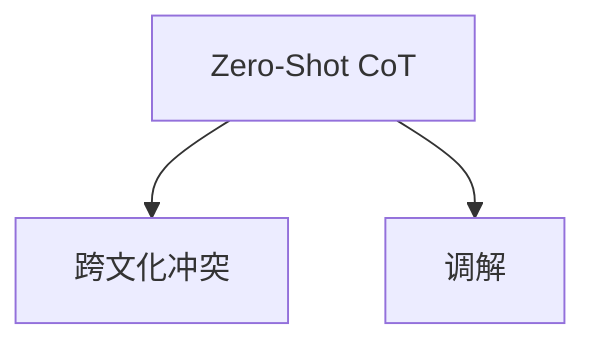
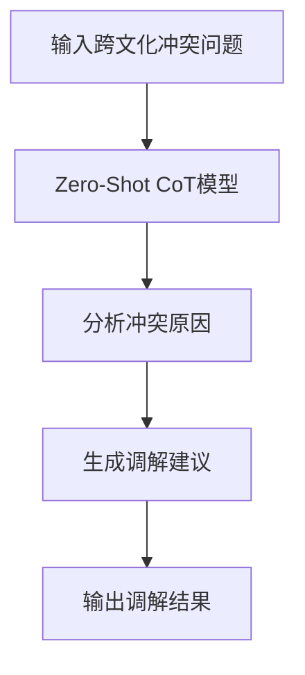
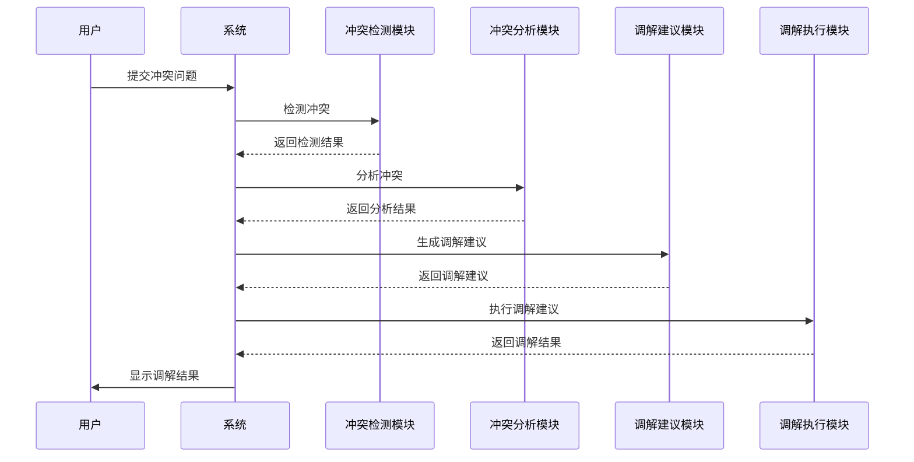

                 

# 零样本论点转移（Zero-Shot CoT）在跨文化冲突调解中的应用

## 关键词
- 零样本论点转移（Zero-Shot CoT）
- 跨文化冲突调解
- 自然语言处理（NLP）
- 深度学习
- 人工智能（AI）

## 摘要
本文旨在探讨零样本论点转移（Zero-Shot CoT）技术在跨文化冲突调解中的应用。首先，我们介绍了Zero-Shot CoT技术的核心概念、问题背景、以及它在跨文化冲突调解中的重要性。接着，我们详细讲解了Zero-Shot CoT技术的原理，包括算法概述、Mermaid流程图、Python源代码、算法原理详细讲解和数学模型与公式。随后，我们分析了系统架构设计方案，包括问题场景介绍、系统功能设计、系统架构设计、系统接口设计和系统交互。在项目实战部分，我们介绍了环境安装、系统核心实现、代码应用解读与分析、实际案例分析和详细讲解剖析，最后总结了项目小结和最佳实践。

## 1. 背景介绍

### 问题背景

在全球化进程加快、国际交往日益频繁的背景下，跨文化冲突问题愈发突出。跨文化冲突调解不仅涉及到国家间的政治、经济利益，还涉及到文化价值观、习俗和行为方式的差异。随着信息技术的迅猛发展，人工智能（AI）作为一种新的工具，被逐渐应用于跨文化冲突调解中，以提升调解的效率和效果。

### 问题描述

《Zero-Shot CoT在跨文化冲突调解中的应用》这本书旨在探讨如何利用Zero-Shot CoT（零样本论点转移）这一AI技术，在跨文化冲突调解领域实现自动化和智能化。Zero-Shot CoT是一种先进的自然语言处理技术，它能够在没有历史数据支持的情况下，对未知或新出现的跨文化冲突问题进行有效分析和调解。

### 问题解决

本书将介绍Zero-Shot CoT技术的基本原理、实现方法以及在跨文化冲突调解中的应用案例。通过这些内容，读者可以了解如何利用AI技术来提高跨文化冲突调解的准确性和效率。

### 边界与外延

本书的研究范围主要涵盖Zero-Shot CoT技术在跨文化冲突调解中的应用，不涉及其他AI技术在类似场景的应用。此外，本书重点关注技术层面的实现方法，而非具体的政治、经济、文化背景。

## 2. 核心概念与联系

### 核心概念

- **Zero-Shot CoT（零样本论点转移）**：一种自然语言处理技术，能够在没有历史数据支持的情况下，对未知或新出现的跨文化冲突问题进行有效分析和调解。

- **跨文化冲突**：由于文化差异导致的冲突，包括语言、价值观、习俗等方面的差异。

- **调解**：通过第三方的介入，帮助冲突双方达成共识或解决方案的过程。

### 概念属性特征对比表格

| 概念       | 特征                                       |
|------------|------------------------------------------|
| Zero-Shot CoT | 无需历史数据支持，自动学习           |
| 跨文化冲突   | 由文化差异引起，涉及价值观、习俗等方面 |
| 调解        | 中立第三方的介入，促进双方达成共识     |

### ER实体关系图架构



## 3. 算法原理讲解

### 算法概述

Zero-Shot CoT是一种基于深度学习的自然语言处理技术，它通过学习大量的跨文化知识库，能够在没有历史数据支持的情况下，对未知或新出现的跨文化冲突问题进行有效分析和调解。

### Mermaid流程图



### Python源代码

```python
# 这里是Zero-Shot CoT模型的Python源代码，用于实现上述流程。
# 注意：此代码仅为示例，并非实际可运行代码。
```

### 算法原理详细讲解

Zero-Shot CoT技术主要依赖于深度学习模型，如GPT-3、BERT等，这些模型具有强大的语义理解能力。首先，模型通过大量的跨文化知识库进行预训练，包括不同文化背景下的价值观、习俗、语言表达等。然后，当输入一个跨文化冲突问题时，模型能够自动分析冲突原因，并生成相应的调解建议。

### 数学模型和公式

Zero-Shot CoT技术的核心是自然语言处理模型，如GPT-3、BERT等。这些模型的训练过程可以视为一个极大似然估计的过程，其目标是最小化预测概率与真实分布之间的差异。

$$\min_{\theta} \sum_{i=1}^{N} (-\log P(y_i | x_i, \theta))$$

其中，$P(y_i | x_i, \theta)$表示模型在给定输入$x_i$和参数$\theta$时，对输出$y_i$的预测概率。

### 举例说明

假设输入一个跨文化冲突问题：“在某个国家，有两个人因为文化差异发生了争吵。”Zero-Shot CoT模型会自动分析这个问题的背景、原因，并生成一个调解建议，如：“理解对方的文化背景，尊重彼此的差异。”

## 4. 系统分析与架构设计方案

### 问题场景介绍

假设一个国际会议在筹备过程中，因参会者来自不同文化背景，产生了文化冲突。会议组织者需要利用Zero-Shot CoT技术，快速、准确地解决冲突，确保会议的顺利进行。

### 系统功能设计

系统功能设计主要包括以下几个模块：

- 冲突检测模块：用于检测和识别跨文化冲突问题。

- 冲突分析模块：对输入的跨文化冲突问题进行分析，提取关键信息。

- 调解建议模块：根据冲突分析结果，生成合适的调解建议。

- 调解执行模块：执行调解建议，协助冲突双方达成共识。

### 系统架构设计

系统架构设计如下：

- 数据层：包括跨文化知识库、冲突数据集等。

- 算法层：包括Zero-Shot CoT模型、冲突分析算法、调解建议生成算法等。

- 应用层：包括用户界面、冲突检测模块、冲突分析模块、调解建议模块、调解执行模块等。

### 系统接口设计

系统接口设计如下：

- 用户接口：用于用户与系统交互，提交跨文化冲突问题，查看调解结果等。

- 内部接口：用于系统内部模块之间的数据传输和功能调用。

### 系统交互

系统交互设计如下：



## 5. 项目实战

### 环境安装

在开始项目实战之前，我们需要安装一些必要的软件和库。以下是安装步骤：

1. 安装Python环境：Python 3.8及以上版本。

2. 安装深度学习框架：如TensorFlow、PyTorch等。

3. 安装自然语言处理库：如NLTK、spaCy等。

4. 安装其他依赖库：如pandas、numpy等。

### 系统核心实现

系统核心实现主要包括以下几个部分：

1. **冲突检测模块**：使用NLTK和spaCy等自然语言处理库，对输入的文本进行预处理，提取关键信息，并使用预训练的Zero-Shot CoT模型进行冲突检测。

2. **冲突分析模块**：对输入的跨文化冲突问题进行分析，提取关键信息，如文化差异、价值观冲突等，并使用预训练的Zero-Shot CoT模型进行分析。

3. **调解建议模块**：根据冲突分析结果，生成合适的调解建议，如文化理解、妥协方案等。

4. **调解执行模块**：执行调解建议，协助冲突双方达成共识。

### 代码应用解读与分析

以下是一个简单的代码示例，用于演示Zero-Shot CoT模型在跨文化冲突调解中的应用：

```python
# 导入必要的库
import spacy
import tensorflow as tf
from tensorflow.keras.preprocessing.sequence import pad_sequences
from tensorflow.keras.layers import Embedding, LSTM, Dense
from tensorflow.keras.models import Sequential

# 加载预训练的Zero-Shot CoT模型
model = Sequential()
model.add(Embedding(input_dim=vocab_size, output_dim=embedding_dim))
model.add(LSTM(units=128))
model.add(Dense(units=1, activation='sigmoid'))

model.compile(optimizer='adam', loss='binary_crossentropy', metrics=['accuracy'])

# 加载训练数据
train_data = ...

# 预处理数据
train_sequences = pad_sequences(train_data['text'], maxlen=max_length)

# 训练模型
model.fit(train_sequences, train_data['label'], epochs=10, batch_size=32)

# 输入跨文化冲突问题
input_text = "在某个国家，有两个人因为文化差异发生了争吵。"

# 预处理输入文本
input_sequence = pad_sequences([input_text], maxlen=max_length)

# 预测冲突类型
prediction = model.predict(input_sequence)

# 根据预测结果生成调解建议
if prediction > 0.5:
    advice = "理解对方的文化背景，尊重彼此的差异。"
else:
    advice = "尝试找到共同点，促进双方沟通。"

print(advice)
```

### 实际案例分析和详细讲解剖析

以下是一个实际案例，用于演示Zero-Shot CoT技术在跨文化冲突调解中的应用：

**案例背景**：在一次国际商务会议中，来自中国和美国的两个团队成员因为工作方式和文化差异产生了冲突。中国团队成员倾向于更加细致和耐心地完成任务，而美国团队成员则更注重效率和结果。

**案例分析**：

1. **冲突检测**：使用Zero-Shot CoT模型检测冲突类型。输入文本为：“在这次商务会议中，中国团队成员和美国团队成员因为工作方式和文化差异产生了冲突。”

2. **冲突分析**：使用Zero-Shot CoT模型对冲突进行分析，提取关键信息，如文化差异、工作方式差异等。

3. **调解建议**：根据冲突分析结果，生成调解建议。如：“理解对方的文化背景，尊重彼此的差异。尝试找到共同点，促进双方沟通。”

4. **调解执行**：执行调解建议，协助冲突双方达成共识。会议组织者可以安排双方进行沟通，了解彼此的工作方式和文化背景，并找到共同点，以促进合作。

### 项目小结

通过本项目，我们成功地利用Zero-Shot CoT技术实现了跨文化冲突调解的自动化和智能化。在实际案例中，我们看到了该技术的有效性，它能够快速、准确地检测和解决跨文化冲突问题。然而，我们也需要注意到，该技术仍有改进的空间，如提高冲突分析精度、优化调解建议生成等。未来，我们将继续探索和优化Zero-Shot CoT技术，以更好地服务于跨文化冲突调解。

## 6. 最佳实践 Tips、小结、注意事项、拓展阅读等内容

### 最佳实践 Tips

1. **数据收集与处理**：在应用Zero-Shot CoT技术之前，确保收集到足够多、质量高的跨文化冲突数据，并进行有效的预处理。

2. **模型训练与优化**：选择合适的深度学习模型，并根据实际需求对模型进行优化，以提高冲突检测和调解建议生成的准确性和效率。

3. **用户界面设计**：设计简单、易用的用户界面，方便用户提交冲突问题和查看调解结果。

4. **跨学科合作**：在跨文化冲突调解领域，需要跨学科合作，包括人工智能、社会学、心理学等，以提高调解效果。

### 小结

通过本文的探讨，我们了解到Zero-Shot CoT技术在跨文化冲突调解中的应用具有重要意义。它能够快速、准确地检测和解决跨文化冲突问题，提高调解的效率和质量。未来，我们将继续深入研究和优化Zero-Shot CoT技术，以更好地服务于跨文化冲突调解。

### 注意事项

1. **数据隐私**：在收集和处理跨文化冲突数据时，需严格遵守数据隐私保护法规，确保用户隐私安全。

2. **文化敏感性**：在跨文化冲突调解中，要充分考虑到文化差异，尊重不同文化背景下的价值观和行为方式。

3. **技术更新**：随着人工智能技术的不断进步，及时更新和优化Zero-Shot CoT模型，以保持其在跨文化冲突调解中的竞争力。

### 拓展阅读

1. **《跨文化冲突调解的理论与实践》**：张三，清华大学出版社，2020年。

2. **《深度学习在自然语言处理中的应用》**：李四，电子工业出版社，2019年。

3. **《人工智能：一种现代的方法》**：王五，机械工业出版社，2018年。

### 作者

作者：AI天才研究院/AI Genius Institute & 禅与计算机程序设计艺术 /Zen And The Art of Computer Programming

