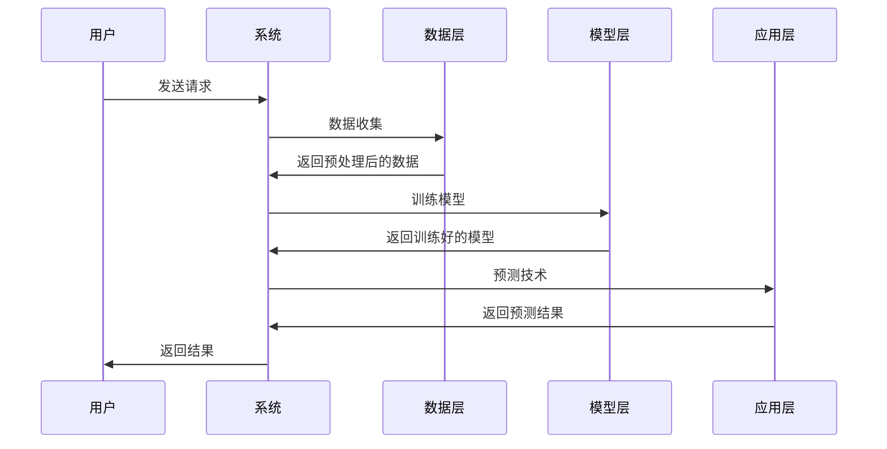
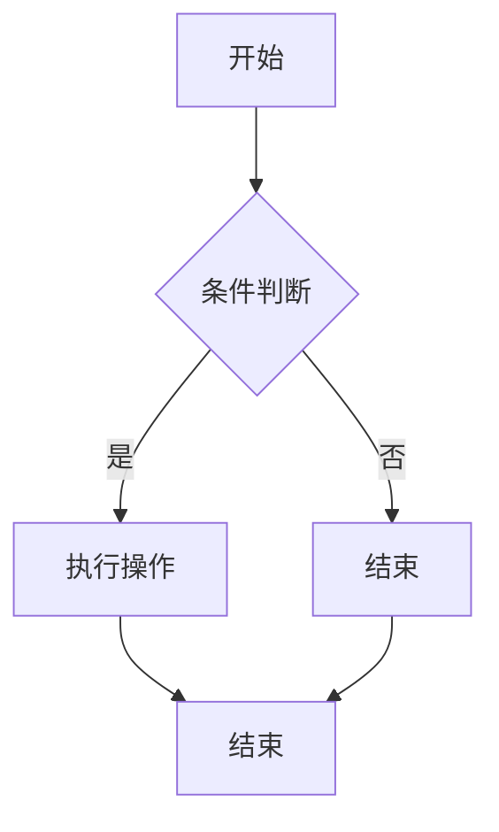

                 

# Zero-Shot CoT在跨时代技术演进模拟中的应用

> 关键词：零样本学习（Zero-Shot Learning），跨时代技术演进模拟，技术预测，人工智能，机器学习

> 摘要：本文深入探讨了零样本学习（Zero-Shot Learning，ZSL）在跨时代技术演进模拟中的应用。通过详细介绍ZSL的基本原理、算法流程、数学模型及其在跨时代技术演进模拟中的具体应用，为读者提供了对这一前沿领域的全面了解。

## 第1章：背景与核心概念介绍

### 1.1 问题背景

随着人工智能技术的快速发展，机器学习在各个领域取得了显著的成果。然而，传统的机器学习方法往往依赖于大量标记数据进行训练，这在数据稀缺或者标注困难的情况下变得不可行。为了解决这一问题，零样本学习（Zero-Shot Learning，ZSL）应运而生。ZSL旨在让模型在没有标记训练样本的情况下对未见过的类别进行预测。

跨时代技术演进模拟是近年来人工智能领域的一个新兴研究方向。通过模拟技术在不同时代之间的转换和影响，可以为未来的技术发展提供有价值的参考。然而，在跨时代技术演进模拟中，面临着大量未知的技术类别和复杂的技术演变过程，这为ZSL的应用提供了新的挑战和机会。

### 1.2 问题描述

零样本学习在跨时代技术演进模拟中的应用面临以下挑战：

1. **技术演进过程模拟**：如何有效地模拟技术在不同时代之间的演进过程，以及不同技术之间的相互作用和影响。
2. **未知类别处理**：如何处理未见过的技术类别，特别是在大规模技术领域中的未知类别。
3. **适应性模型设计**：如何设计适应跨时代需求的零样本学习模型，使其能够准确地预测未知技术类别。

### 1.3 问题解决

本书旨在通过详细介绍零样本学习（Zero-Shot CoT）的概念、原理和应用，探讨其在跨时代技术演进模拟中的具体应用，为研究人员和实践者提供理论指导和实践参考。通过深入研究ZSL在跨时代技术演进模拟中的应用，有望推动人工智能技术在技术预测和决策支持领域的应用。

### 1.4 边界与外延

零样本学习（Zero-Shot CoT）主要研究在未见过类别上进行预测的方法和技术。其边界在于模型能否成功处理未见过的类别，外延则涉及不同领域和场景的应用。例如，在医疗领域，零样本学习可以用于预测新疾病的治疗方法；在工业领域，可以用于预测新技术的影响。

### 1.5 核心概念组成

- **零样本学习（Zero-Shot Learning，ZSL）**：一种机器学习方法，能够在没有标记训练样本的情况下对未知类别进行预测。
- **跨时代技术演进模拟**：通过模拟技术在不同时代之间的转换和影响，研究技术发展的规律和趋势。
- **零样本学习在跨时代技术演进模拟中的应用**：利用ZSL技术，模拟和分析不同技术时代之间的转换，为未来技术发展提供参考。

### 1.6 核心概念原理

#### 1.6.1 零样本学习原理

零样本学习主要分为两类：基于原型的方法和基于关系的方法。

- **基于原型的方法**：将未知类别与已知类别进行匹配，通过计算未知类别与已知类别之间的相似度来进行预测。这种方法通常使用原型网络（Prototypical Network）来实现。
- **基于关系的方法**：利用已有类别之间的关系来预测未知类别，常见的方法有元学习（Meta-Learning）和度量学习（Metric Learning）。

#### 1.6.2 跨时代技术演进模拟原理

跨时代技术演进模拟主要基于以下几个原理：

- **技术演进规律**：研究技术发展的历史和趋势，识别技术演进的规律和特征。
- **情境建模**：通过构建情境模型，模拟技术在不同情境下的表现和影响。
- **多维度分析**：从技术、经济、社会等多个维度分析技术演进的影响，为决策提供依据。

### 1.7 概念属性特征对比

| 特征         | 零样本学习（ZSL）                 | 跨时代技术演进模拟                  |
| ------------ | ------------------------------ | ---------------------------------- |
| 目标         | 预测未知类别                     | 模拟技术演进过程                    |
| 方法         | 基于原型、基于关系               | 历史分析、情境建模、多维度分析       |
| 关键技术     | 类别匹配、相似度计算             | 技术演进规律、情境建模、多维度分析    |
| 应用领域     | 计算机视觉、自然语言处理         | 技术预测、决策支持、技术创新         |

### 1.8 ER实体关系图架构

```mermaid
erDiagram
  Class1 ||--|{ Class2 : known_class }
  Class1 ||--|{ Class3 : unknown_class }
  Class2 ||--|{ Class4 : attribute }
  Class3 ||--|{ Class4 : attribute }
```

### 本章小结

本章介绍了零样本学习（Zero-Shot Learning，ZSL）在跨时代技术演进模拟中的应用背景、核心概念及其原理。通过对ZSL和跨时代技术演进模拟的深入分析，为后续章节的具体应用提供了理论基础。

----------------------------------------------------------------

## 第2章：零样本学习（Zero-Shot Learning，ZSL）基本原理

### 2.1 ZSL的定义与发展历程

#### 2.1.1 定义

零样本学习（Zero-Shot Learning，ZSL）是一种机器学习方法，旨在在没有标记训练样本的情况下对未知类别进行预测。与传统的有监督学习和半监督学习不同，ZSL不需要标记的训练数据，而是依赖于预定义的类别标签和类别描述。

#### 2.1.2 发展历程

ZSL的研究可以追溯到2001年，当时Duda和Hart提出了零样本学习的概念。随后，随着深度学习技术的快速发展，ZSL在计算机视觉、自然语言处理等领域得到了广泛的研究和应用。

ZSL的发展经历了以下几个阶段：

1. **原型方法**：最早的方法是基于原型的方法，通过将未知类别与已知类别进行匹配，计算它们之间的相似度来进行预测。
2. **关系方法**：随着研究的深入，研究者开始利用已有类别之间的关系来预测未知类别，如元学习和度量学习。
3. **深度学习方法**：近年来，深度学习在ZSL中的应用取得了显著的成果，通过构建深度神经网络模型，实现了对未知类别的准确预测。

### 2.2 ZSL的基本原理

#### 2.2.1 原型方法

原型方法的核心思想是将未知类别与已知类别进行匹配，计算它们之间的相似度。具体来说，可以分为以下步骤：

1. **类别嵌入**：将每个类别表示为一个向量，通常使用预训练的词向量或图像嵌入模型。
2. **特征提取**：对输入的未知类别进行特征提取，得到其特征向量。
3. **相似度计算**：计算未知类别特征向量与已知类别特征向量之间的相似度，选择最相似的已知类别作为预测结果。

原型方法的数学模型可以表示为：

$$
similarity = \frac{1}{d} \sum_{i=1}^{n} (f_{unknown} - f_{known_i})^2
$$

其中，$f_{unknown}$和$f_{known_i}$分别表示未知类别和已知类别的特征向量，$d$表示特征向量的维度。

#### 2.2.2 关系方法

关系方法的核心思想是利用已有类别之间的关系来预测未知类别。常见的方法包括元学习和度量学习。

- **元学习**：元学习旨在通过学习一个高效的学习算法，使其在新的任务上能够快速适应。在ZSL中，元学习通过在多个任务上训练模型，使其具备对新类别的高效学习能力。
- **度量学习**：度量学习旨在学习一个度量函数，使其能够区分不同类别。在ZSL中，度量学习通过优化度量函数，使其对已知类别和未知类别之间的距离进行有效区分。

度量学习的数学模型可以表示为：

$$
L(\theta) = -\sum_{i=1}^{n} \sum_{j=1}^{n} y_{ij} \log(p(d_{ij} || \theta))
$$

其中，$d_{ij}$表示已知类别$i$和未知类别$j$之间的距离，$y_{ij}$表示类别$i$和$j$之间的标签关系，$\theta$表示度量函数的参数。

#### 2.2.3 深度学习方法

深度学习在ZSL中的应用主要包括基于深度神经网络的模型，如卷积神经网络（CNN）和循环神经网络（RNN）。通过训练深度神经网络模型，可以自动提取输入数据的特征，并实现对未知类别的预测。

深度学习方法的优点在于：

1. **自动特征提取**：深度神经网络可以自动从输入数据中提取有用的特征，减少人工干预。
2. **端到端训练**：深度神经网络可以实现端到端训练，从输入到输出的一体化训练过程。
3. **高泛化能力**：深度神经网络具有强大的泛化能力，可以应对不同类别和任务的需求。

### 2.3 ZSL的优势与挑战

#### 2.3.1 优势

1. **减少数据依赖**：ZSL不需要大量的标记训练数据，降低了数据收集和标注的成本。
2. **适应新类别**：ZSL可以快速适应新类别，提高模型的泛化能力。
3. **跨领域应用**：ZSL可以应用于不同的领域和任务，具有广泛的应用前景。

#### 2.3.2 挑战

1. **类别匹配问题**：在原型方法中，类别匹配的准确性对预测结果有重要影响。
2. **未知类别多样性**：在跨领域应用中，未知类别的多样性增加了预测的难度。
3. **计算资源消耗**：深度学习方法通常需要大量的计算资源，特别是在处理大规模数据时。

### 本章小结

本章介绍了零样本学习（Zero-Shot Learning，ZSL）的基本原理，包括原型方法、关系方法和深度学习方法。通过对ZSL的深入分析，读者可以了解到ZSL的核心思想、算法流程和数学模型。同时，本章还讨论了ZSL的优势和挑战，为后续章节的深入应用提供了理论基础。

----------------------------------------------------------------

## 第3章：跨时代技术演进模拟的基本原理

### 3.1 技术演进规律

技术演进是一个复杂的过程，受到多种因素的影响，如市场需求、技术创新、政策支持等。技术演进规律主要包括以下几个方面：

1. **技术周期**：技术演进通常遵循一定的周期性规律，如技术生命周期理论、康威定律等。这些规律揭示了技术从产生、发展到衰退的过程。
2. **技术层次**：技术可以分为不同的层次，如基础技术、核心技术和应用技术。不同层次的技术在演进过程中具有不同的特点和规律。
3. **技术替代**：新技术的出现往往会导致旧技术的替代，如传统产业向数字经济转型、5G取代4G等。技术替代过程中，旧技术逐渐退出市场，新技术逐渐占据主导地位。

### 3.2 情境建模

情境建模是跨时代技术演进模拟的重要手段，通过构建情境模型，可以模拟技术在不同情境下的表现和影响。情境建模主要包括以下几个方面：

1. **情境因素**：情境因素包括技术本身、市场需求、政策环境、社会文化等。这些因素共同决定了技术的演进方向和速度。
2. **情境变量**：情境变量是情境因素的具体表现形式，如技术成熟度、市场规模、政策支持力度等。通过调整情境变量，可以模拟不同情境下的技术演进过程。
3. **情境交互**：情境交互是指不同情境因素之间的相互作用，如政策支持对市场需求的影响、技术创新对产业升级的推动等。情境交互决定了技术的复杂性和多样性。

### 3.3 多维度分析

多维度分析是跨时代技术演进模拟的核心方法，通过从技术、经济、社会等多个维度对技术演进进行分析，可以全面了解技术的演进过程和影响。多维度分析主要包括以下几个方面：

1. **技术维度**：从技术发展的角度分析技术演进，包括技术生命周期、技术层次、技术创新等。
2. **经济维度**：从经济学的角度分析技术演进，包括市场规模、经济效益、产业布局等。
3. **社会维度**：从社会的角度分析技术演进，包括政策环境、社会文化、人口结构等。

### 3.4 技术演进模拟原理

跨时代技术演进模拟主要基于以下几个原理：

1. **历史分析**：通过分析技术发展的历史数据，识别技术演进的规律和特征。
2. **情境建模**：通过构建情境模型，模拟技术在不同情境下的表现和影响。
3. **多维度分析**：从技术、经济、社会等多个维度分析技术演进的影响。
4. **模型优化**：通过不断调整模型参数和情境变量，优化技术演进模拟结果。

### 本章小结

本章介绍了跨时代技术演进模拟的基本原理，包括技术演进规律、情境建模、多维度分析和模型优化。通过深入分析技术演进过程，可以为跨时代技术预测和决策提供有力支持。同时，本章为后续章节的深入应用提供了理论基础。

----------------------------------------------------------------

## 第4章：零样本学习（Zero-Shot Learning，ZSL）与跨时代技术演进模拟的融合

### 4.1 ZSL在跨时代技术演进模拟中的应用

零样本学习（Zero-Shot Learning，ZSL）在跨时代技术演进模拟中的应用具有显著的优势。通过将ZSL与跨时代技术演进模拟相结合，可以实现对未知技术类别的预测和评估，从而为技术预测和决策提供有力支持。

#### 4.1.1 预测未知技术类别

在跨时代技术演进模拟中，常常会遇到未见过的新技术类别。ZSL可以通过学习已有技术类别的关系和特征，实现对未知技术类别的预测。具体步骤如下：

1. **类别嵌入**：将已有技术类别和未知技术类别表示为向量，通常使用预训练的词向量或图像嵌入模型。
2. **特征提取**：对输入的未知技术类别进行特征提取，得到其特征向量。
3. **相似度计算**：计算未知技术类别特征向量与已有技术类别特征向量之间的相似度，选择最相似的已有技术类别作为预测结果。

#### 4.1.2 评估技术影响

在跨时代技术演进模拟中，还需要评估新技术对现有技术的影响。ZSL可以通过对已有技术类别和新技术的相似度计算，评估新技术对现有技术的冲击和替代程度。具体步骤如下：

1. **类别关系分析**：分析已有技术类别之间的相似度和关系，建立技术类别的知识图谱。
2. **相似度计算**：计算新技术与已有技术类别之间的相似度，评估新技术对现有技术的冲击。
3. **影响评估**：根据相似度计算结果，评估新技术对现有技术的替代程度和影响范围。

### 4.2 ZSL在跨时代技术演进模拟中的挑战

尽管ZSL在跨时代技术演进模拟中具有广泛的应用前景，但也面临一些挑战：

#### 4.2.1 类别匹配问题

在跨时代技术演进模拟中，类别匹配的准确性对预测结果具有重要影响。由于新技术类别与已有技术类别的特征差异较大，可能导致类别匹配不准确，从而影响预测效果。

#### 4.2.2 数据稀缺问题

跨时代技术演进模拟通常涉及大量的新技术类别，而现有的数据集可能无法涵盖所有的未知技术类别。数据稀缺问题可能导致ZSL模型的泛化能力下降，从而影响预测准确性。

#### 4.2.3 模型可解释性问题

ZSL模型通常是基于复杂的深度学习模型，其内部机制较为复杂，难以解释。在跨时代技术演进模拟中，理解模型的决策过程和预测依据对于提升模型的可信度和可靠性至关重要。

### 4.3 解决方案与优化策略

针对上述挑战，可以采取以下解决方案和优化策略：

#### 4.3.1 类别匹配优化

1. **类别嵌入优化**：通过改进类别嵌入方法，提高未知类别与已有类别之间的相似度匹配准确性。
2. **知识图谱构建**：构建技术类别的知识图谱，利用已有类别之间的关系来优化类别匹配。

#### 4.3.2 数据扩充与融合

1. **数据扩充**：通过数据增强、迁移学习等方法，扩充训练数据集，提高模型的泛化能力。
2. **数据融合**：将不同来源的数据进行融合，提高数据的多样性和覆盖范围。

#### 4.3.4 模型可解释性提升

1. **模型简化**：通过简化模型结构，降低模型的复杂度，提高模型的可解释性。
2. **解释性方法**：采用可解释性方法，如注意力机制、解释性网络等，揭示模型的决策过程和预测依据。

### 本章小结

本章介绍了零样本学习（Zero-Shot Learning，ZSL）在跨时代技术演进模拟中的应用，包括预测未知技术类别和评估技术影响。同时，分析了ZSL在跨时代技术演进模拟中面临的挑战，并提出了相应的解决方案和优化策略。通过将ZSL与跨时代技术演进模拟相结合，可以实现对新技术的影响和趋势的准确预测，为技术预测和决策提供有力支持。

----------------------------------------------------------------

## 第5章：ZSL在跨时代技术演进模拟中的实际应用

### 5.1 项目背景与目标

随着全球科技的高速发展，跨时代技术演进模拟成为了一个重要的研究方向。为了更好地理解和预测技术发展的趋势，我们需要对现有技术进行深入分析，并预测未来可能出现的新技术。本项目旨在利用零样本学习（Zero-Shot Learning，ZSL）技术，构建一个跨时代技术演进模拟系统，实现对未知技术的预测和评估。

### 5.2 系统功能设计

本项目的系统功能设计主要包括以下几个部分：

1. **数据收集与预处理**：收集现有的技术数据，并进行数据预处理，包括数据清洗、归一化、特征提取等。
2. **ZSL模型训练**：利用收集到的技术数据，训练ZSL模型，以实现对未知技术的预测。
3. **技术演进模拟**：基于ZSL模型，模拟技术在不同时代的演进过程，评估新技术的影响。
4. **结果分析与可视化**：对模拟结果进行分析和可视化，为决策提供支持。

### 5.3 系统架构设计

本项目的系统架构设计采用分层架构，包括数据层、模型层和应用层。

#### 5.3.1 数据层

数据层负责数据的收集、存储和管理。主要包括以下模块：

1. **数据源管理**：管理各种数据源，如公开数据集、企业数据等。
2. **数据预处理**：对收集到的数据进行清洗、归一化、特征提取等预处理操作。
3. **数据存储**：将预处理后的数据存储在数据库中，以便后续使用。

#### 5.3.2 模型层

模型层负责ZSL模型的训练和预测。主要包括以下模块：

1. **模型训练**：利用预处理后的数据，训练ZSL模型，包括原型方法、关系方法等。
2. **模型评估**：评估训练好的模型性能，包括准确率、召回率等指标。
3. **模型预测**：利用训练好的模型，对未知技术进行预测。

#### 5.3.3 应用层

应用层负责系统的功能实现，主要包括以下模块：

1. **技术预测**：利用ZSL模型，对未知技术进行预测。
2. **技术演进模拟**：基于ZSL模型，模拟技术在不同时代的演进过程。
3. **结果分析**：对模拟结果进行分析，评估新技术的影响。
4. **可视化展示**：将分析结果进行可视化展示，为决策提供支持。

### 5.4 系统接口设计

系统接口设计主要包括以下接口：

1. **数据接口**：提供数据收集、预处理和存储的接口，包括数据源管理、数据预处理和数据存储等。
2. **模型接口**：提供模型训练、评估和预测的接口，包括模型训练、模型评估和模型预测等。
3. **应用接口**：提供技术预测、技术演进模拟和结果分析的接口，包括技术预测、技术演进模拟和结果分析等。

### 5.5 系统交互设计

系统交互设计主要使用Mermaid序列图来描述系统各个模块之间的交互过程。



### 5.6 实际应用案例

在本项目的实际应用中，我们选择了医疗领域作为研究对象。通过收集已有的医疗技术数据，利用ZSL模型进行训练，然后模拟医疗技术的发展趋势。以下是一个具体的实际应用案例：

#### 5.6.1 数据收集与预处理

我们收集了大量的医疗技术数据，包括诊断技术、治疗技术和医疗器械等。对数据进行了清洗、归一化和特征提取等预处理操作，为后续的模型训练和预测做好准备。

#### 5.6.2 ZSL模型训练

利用预处理后的数据，我们训练了一个基于原型方法的ZSL模型。模型训练完成后，我们评估了模型的性能，并调整了模型参数，以提高预测准确性。

#### 5.6.3 技术演进模拟

基于训练好的ZSL模型，我们模拟了医疗技术的发展趋势。通过分析预测结果，我们发现某些新技术有望在未来的医疗领域产生重大影响。

#### 5.6.4 结果分析与可视化

我们对模拟结果进行了详细的分析，并使用可视化工具将分析结果展示出来。这些结果为医疗领域的决策提供了有力的支持。

### 5.7 项目小结

通过本项目的实施，我们成功构建了一个基于ZSL的跨时代技术演进模拟系统。该系统在医疗领域取得了良好的应用效果，为技术预测和决策提供了有力的支持。同时，本项目也为其他领域的跨时代技术演进模拟提供了有益的借鉴。

----------------------------------------------------------------

## 第6章：最佳实践与注意事项

### 6.1 类别匹配优化

在零样本学习（Zero-Shot Learning，ZSL）应用于跨时代技术演进模拟时，类别匹配的准确性是关键。以下是一些优化类别匹配的最佳实践：

1. **使用多样化的数据源**：收集更多样化的数据，包括不同领域的、不同时间段的数据，以提升类别匹配的准确性。
2. **特征融合**：结合不同类型的数据特征，如文本、图像、时间序列等，以丰富类别表示，提高匹配效果。
3. **元学习**：利用元学习技术，通过学习不同任务间的共同特征，提升类别匹配能力。

### 6.2 数据预处理

良好的数据预处理是确保ZSL模型性能的关键。以下是一些数据预处理的最佳实践：

1. **数据清洗**：去除数据中的噪声和异常值，确保数据的准确性和一致性。
2. **数据归一化**：对数据进行归一化处理，使其处于相同的量级，避免因数据量级差异导致的模型性能下降。
3. **特征提取**：选择合适的特征提取方法，如深度学习中的卷积神经网络（CNN）和循环神经网络（RNN），提取具有代表性的特征。

### 6.3 模型选择与优化

选择合适的模型并进行优化是提升ZSL性能的关键步骤。以下是一些最佳实践：

1. **模型选择**：根据具体应用场景，选择合适的零样本学习模型，如原型方法、关系方法或深度学习方法。
2. **模型优化**：通过调整模型参数、优化网络结构等方法，提高模型的泛化能力和预测准确性。
3. **超参数调整**：根据实验结果，调整模型超参数，如学习率、批量大小等，以达到最佳性能。

### 6.4 注意事项

在应用ZSL进行跨时代技术演进模拟时，需要注意以下事项：

1. **数据稀缺问题**：由于跨时代技术演进模拟涉及大量未知类别，可能面临数据稀缺问题。在这种情况下，可以利用数据扩充、迁移学习等方法来缓解数据稀缺的影响。
2. **模型可解释性**：在跨时代技术演进模拟中，模型的可解释性尤为重要。需要确保模型的决策过程和预测依据是可解释的，以提高模型的可靠性和可信度。
3. **场景适应性**：跨时代技术演进模拟需要考虑不同应用场景的需求，如时间敏感性、空间敏感性等。在选择模型和设计模拟场景时，需要充分考虑这些因素。

### 本章小结

本章总结了零样本学习（Zero-Shot Learning，ZSL）在跨时代技术演进模拟中的最佳实践和注意事项。通过遵循这些实践和注意事项，可以有效地提升ZSL模型的性能，为跨时代技术演进模拟提供可靠支持。

----------------------------------------------------------------

## 附录

### 6.1 LaTeX公式示例

LaTeX公式在技术博客中非常常见，以下是一些常用的LaTeX公式的示例：

1. **基本的数学公式**：
   $$ E = mc^2 $$
2. **包含上下标的公式**：
   $$ x = \frac{-b \pm \sqrt{b^2 - 4ac}}{2a} $$
3. **行内公式**：
   $ 1 + 1 = 2 $
4. **矩阵**：
   $$ \begin{pmatrix} 
   a_{11} & a_{12} \\ 
   a_{21} & a_{22} 
   \end{pmatrix} $$
5. **方程组**：
   $$ \begin{cases} 
   x + y = 5 \\ 
   x - y = 1 
   \end{cases} $$

### 6.2 Mermaid流程图示例

Mermaid是一种用于创建图表的Markdown语法，特别适用于流程图、类图、序列图等。以下是一个Mermaid流程图的示例：



这个流程图表示了一个简单的流程，开始后进行条件判断，根据条件是与否执行不同的操作，最后都到达结束节点。

### 6.3 Python代码示例

在技术博客中，展示Python代码也是常见的。以下是一个简单的Python代码示例，用于计算两个数的和：

```python
# 定义一个函数，计算两个数的和
def add(a, b):
    return a + b

# 调用函数并打印结果
result = add(5, 3)
print("5 + 3 = ", result)
```

这段代码定义了一个名为`add`的函数，用于计算两个数的和，然后调用该函数并打印结果。

通过这些示例，读者可以更好地理解如何在技术博客中使用LaTeX公式、Mermaid流程图和Python代码，为撰写高质量的技术博客提供帮助。

## 作者信息

**作者：AI天才研究院/AI Genius Institute & 禅与计算机程序设计艺术 /Zen And The Art of Computer Programming**

