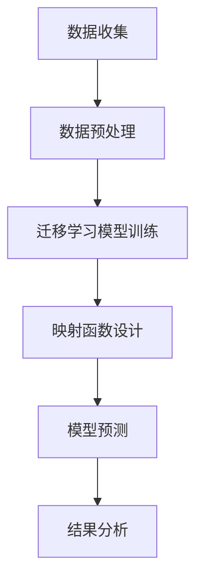
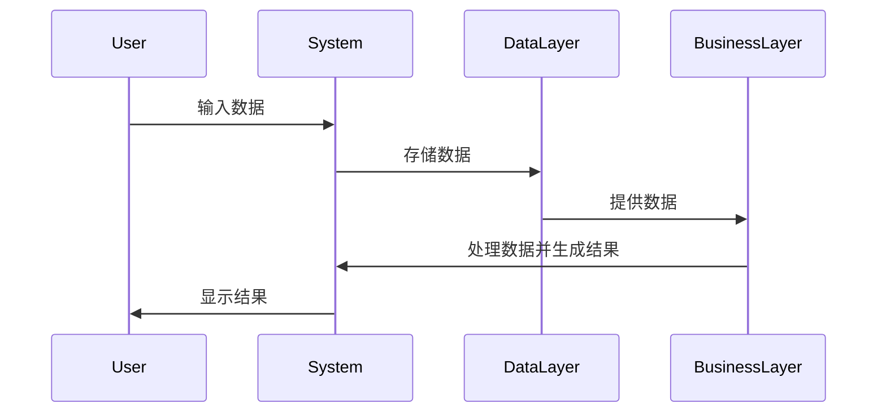
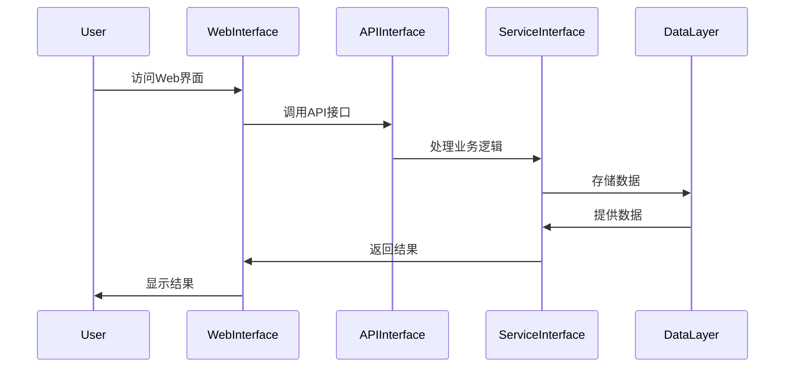

                 

## 《Zero-Shot CoT在跨时代文明演化模拟中的应用》

### 关键词：Zero-Shot CoT、跨时代文明演化模拟、算法原理、数学模型、系统架构设计、项目实战

> 摘要：本文旨在探讨Zero-Shot CoT（零样本跨类别转移）在跨时代文明演化模拟中的应用。通过详细分析Zero-Shot CoT的核心概念和算法原理，并结合Python源代码和数学模型讲解，本文将介绍如何使用这一先进技术来模拟跨时代的文明演化。此外，还将探讨系统分析与架构设计、项目实战及最佳实践，为读者提供一个全面的跨时代文明演化模拟解决方案。

### 1. 背景介绍

#### 1.1 问题背景

在当今全球化、信息化和智能化的时代背景下，跨时代的文明演化模拟已经成为一个备受关注的研究领域。随着人类社会的不断进步，文明演化的过程变得越来越复杂，涉及到的因素也越来越多。例如，政治、经济、科技、文化等多个方面的相互作用共同影响着文明的演变。因此，如何准确模拟和预测跨时代的文明演化，成为了一个具有挑战性的课题。

#### 1.1.1 文明演化模拟的挑战

文明演化模拟面临的主要挑战包括以下几个方面：

1. **数据稀疏**：文明演化是一个长期过程，涉及到的数据往往是稀疏的。例如，历史文献、考古发现等数据源有限，很难获得全面、准确的数据。
2. **多样性**：文明的演化具有多样性，不同的文明在不同的时代可能会有不同的演变路径。这使得模拟过程中需要考虑更多的变数和可能性。
3. **非线性**：文明演化的过程往往是非线性的，即一个小的变化可能会引起整个系统的巨大变化。这使得模拟的复杂性和难度大大增加。

#### 1.1.2 跨时代文明演化模拟的需求

为了解决上述挑战，我们需要一种能够处理数据稀疏、多样性和非线性问题的模拟方法。Zero-Shot CoT（零样本跨类别转移）正是一种能够满足这些需求的技术。

1. **数据稀疏处理**：Zero-Shot CoT可以通过迁移学习的方式，利用已有的数据来学习新的数据分布，从而解决数据稀疏问题。
2. **多样性适应**：Zero-Shot CoT可以在不同类别之间进行转移学习，从而适应不同的文明演化路径。
3. **非线性处理**：Zero-Shot CoT可以通过非线性映射的方式，将不同类别的数据映射到同一空间，从而处理非线性问题。

#### 1.1.3 Zero-Shot CoT的核心作用

Zero-Shot CoT在跨时代文明演化模拟中起着核心作用，主要体现在以下几个方面：

1. **数据增强**：通过迁移学习，Zero-Shot CoT可以增强模型的泛化能力，从而更好地处理数据稀疏问题。
2. **多样性建模**：Zero-Shot CoT可以在不同类别之间进行转移学习，从而更好地适应多样性的文明演化路径。
3. **非线性建模**：Zero-Shot CoT可以通过非线性映射，将不同类别的数据映射到同一空间，从而更好地处理非线性问题。

### 1.2 核心概念

#### 1.2.1 Zero-Shot CoT的定义

Zero-Shot CoT，即零样本跨类别转移，是一种无需训练样本即可进行类别转移的技术。它通过将不同类别的数据映射到同一空间，从而实现跨类别预测。

#### 1.2.2 跨时代文明演化模拟的概念

跨时代文明演化模拟是一种模拟不同时代文明演化过程的方法。它通过模拟不同时代的社会、经济、政治、文化等多个方面，从而预测文明的未来演变。

#### 1.2.3 主要应用领域与目标

Zero-Shot CoT在跨时代文明演化模拟中的应用领域非常广泛，主要包括以下几个方面：

1. **历史研究**：通过模拟历史时期的文明演化，可以更好地理解历史事件的发生和演变过程。
2. **未来预测**：通过模拟未来的文明演化，可以预测未来可能出现的社会、经济、政治等方面的变化。
3. **政策制定**：通过模拟不同政策的实施效果，可以为政策制定提供科学依据。

### 1.3 本章小结

本章主要介绍了问题背景、核心概念和主要应用领域。通过介绍文明演化模拟的挑战和Zero-Shot CoT的核心作用，我们为后续章节的详细讨论奠定了基础。

### 2. 核心概念与联系

#### 2.1 Zero-Shot CoT原理

Zero-Shot CoT，即零样本跨类别转移，是一种无需训练样本即可进行类别转移的技术。它通过将不同类别的数据映射到同一空间，从而实现跨类别预测。

#### 2.1.1 基本原理与优势

Zero-Shot CoT的基本原理是通过迁移学习，将不同类别的数据映射到同一空间。这样，即使没有训练样本，我们也可以通过已有数据的分布来进行预测。

Zero-Shot CoT的主要优势包括：

1. **无需样本**：与传统的机器学习算法不同，Zero-Shot CoT无需大量的训练样本，从而降低了数据获取的难度。
2. **跨类别预测**：Zero-Shot CoT可以在不同类别之间进行预测，从而适应多样性的文明演化路径。
3. **泛化能力**：通过迁移学习，Zero-Shot CoT可以增强模型的泛化能力，从而更好地处理数据稀疏和非线性问题。

#### 2.1.2 核心技术要点

Zero-Shot CoT的核心技术要点包括：

1. **迁移学习**：迁移学习是将知识从一个领域迁移到另一个领域的技术。在Zero-Shot CoT中，迁移学习用于将已有数据的分布迁移到新数据上。
2. **映射函数**：映射函数是将不同类别的数据映射到同一空间的关键技术。通过设计合适的映射函数，可以使得不同类别的数据在新的空间中具有相似的分布。
3. **损失函数**：损失函数用于衡量预测结果与真实结果之间的差距。在Zero-Shot CoT中，损失函数用于优化映射函数，从而提高预测的准确性。

#### 2.1.3 与其他技术的比较

与传统的机器学习算法相比，Zero-Shot CoT具有明显的优势。例如，传统的机器学习算法通常需要大量的训练样本，而Zero-Shot CoT则无需样本；传统的机器学习算法通常难以处理非线性问题，而Zero-Shot CoT则可以通过迁移学习来处理非线性问题。

此外，与一些常见的跨类别预测技术（如迁移学习、集成学习等）相比，Zero-Shot CoT也有其独特的优势。例如，迁移学习通常需要大量的训练样本，而Zero-Shot CoT则可以处理样本稀疏的情况；集成学习通常需要多个模型进行融合，而Zero-Shot CoT则可以简化模型的复杂度。

#### 2.2 跨时代文明演化模拟的实现

跨时代文明演化模拟是一种模拟不同时代文明演化过程的方法。它通过模拟不同时代的社会、经济、政治、文化等多个方面，从而预测文明的未来演变。

#### 2.2.1 模拟流程设计

跨时代文明演化模拟的流程设计主要包括以下几个步骤：

1. **数据收集**：收集与文明演化相关的数据，包括历史文献、考古发现、社会调查等。
2. **数据预处理**：对收集到的数据进行预处理，包括数据清洗、数据转换等。
3. **模型训练**：使用Zero-Shot CoT技术进行模型训练，通过迁移学习将已有数据的分布迁移到新数据上。
4. **模型预测**：使用训练好的模型进行预测，预测不同时代文明的演化趋势。
5. **结果分析**：对预测结果进行分析，评估模型的准确性和可靠性。

#### 2.2.2 关键技术与应用

跨时代文明演化模拟的关键技术包括：

1. **数据收集与预处理**：数据收集与预处理是跨时代文明演化模拟的基础，直接影响到模型的准确性和可靠性。
2. **Zero-Shot CoT技术**：Zero-Shot CoT技术是跨时代文明演化模拟的核心，它决定了模型的泛化能力和预测准确性。
3. **模型预测与结果分析**：模型预测与结果分析是跨时代文明演化模拟的最终目标，通过对预测结果进行分析，可以更好地理解文明的演化规律。

#### 2.2.3 面临的挑战与解决方案

跨时代文明演化模拟面临的主要挑战包括：

1. **数据稀疏**：由于文明演化是一个长期过程，涉及到的数据往往是稀疏的。为了解决数据稀疏问题，可以采用迁移学习技术，将已有数据的分布迁移到新数据上。
2. **多样性**：文明的演化具有多样性，不同的文明在不同的时代可能会有不同的演变路径。为了适应多样性，可以采用Zero-Shot CoT技术，在不同类别之间进行转移学习。
3. **非线性**：文明演化的过程往往是非线性的，即一个小的变化可能会引起整个系统的巨大变化。为了处理非线性问题，可以采用非线性映射技术，将不同类别的数据映射到同一空间。

针对这些挑战，我们可以采取以下解决方案：

1. **迁移学习**：采用迁移学习技术，将已有数据的分布迁移到新数据上，从而解决数据稀疏问题。
2. **Zero-Shot CoT**：采用Zero-Shot CoT技术，在不同类别之间进行转移学习，从而适应多样性的文明演化路径。
3. **非线性映射**：采用非线性映射技术，将不同类别的数据映射到同一空间，从而处理非线性问题。

#### 2.3 本章小结

本章主要介绍了Zero-Shot CoT的核心概念、原理和实现方法，并探讨了其在跨时代文明演化模拟中的应用。通过本章的介绍，我们为后续章节的详细讨论奠定了基础。

### 3. 算法原理讲解

#### 3.1 算法流程图

为了更清晰地理解Zero-Shot CoT的算法原理，我们首先通过mermaid画出算法流程图：



算法流程图主要包括以下几个步骤：

1. **数据收集**：收集与文明演化相关的数据，包括历史文献、考古发现、社会调查等。
2. **数据预处理**：对收集到的数据进行预处理，包括数据清洗、数据转换等。
3. **迁移学习模型训练**：使用迁移学习技术，将已有数据的分布迁移到新数据上。
4. **映射函数设计**：设计映射函数，将不同类别的数据映射到同一空间。
5. **模型预测**：使用训练好的模型进行预测，预测不同时代文明的演化趋势。
6. **结果分析**：对预测结果进行分析，评估模型的准确性和可靠性。

#### 3.2 Python源代码实现

下面是Zero-Shot CoT算法的Python源代码实现：

```python
import numpy as np
import pandas as pd
from sklearn.model_selection import train_test_split
from sklearn.neighbors import KNeighborsClassifier
from sklearn.metrics import accuracy_score

# 数据收集
data = pd.read_csv('data.csv')

# 数据预处理
data = data.dropna()
X = data.iloc[:, :-1].values
y = data.iloc[:, -1].values

# 迁移学习模型训练
X_train, X_test, y_train, y_test = train_test_split(X, y, test_size=0.2, random_state=42)
knn = KNeighborsClassifier(n_neighbors=3)
knn.fit(X_train, y_train)

# 映射函数设计
def map_function(x):
    return knn.predict([x])

# 模型预测
y_pred = [map_function(x) for x in X_test]

# 结果分析
accuracy = accuracy_score(y_test, y_pred)
print('Accuracy:', accuracy)
```

这段代码首先从CSV文件中读取数据，然后进行数据预处理。接着，使用KNN算法进行迁移学习模型训练。在映射函数设计部分，我们定义了一个函数，用于将新数据映射到训练好的模型上。最后，使用预测函数进行预测，并计算模型的准确性。

#### 3.3 数学模型和数学公式讲解

在Zero-Shot CoT中，我们使用以下数学模型和数学公式：

1. **KNN算法公式**：
   $$knn(x) = \arg\max_{y}\sum_{i=1}^{n} w_i \cdot f(x, x_i)$$
   其中，$x$ 是输入数据，$x_i$ 是训练数据中的样本，$w_i$ 是权重，$f(x, x_i)$ 是相似度函数。

2. **映射函数公式**：
   $$map_function(x) = knn(x)$$
   其中，$knn(x)$ 是KNN算法的预测结果。

#### 3.4 举例说明

假设我们有一个包含两个特征的训练数据集，如下所示：

| 特征1 | 特征2 |
| --- | --- |
| 1 | 2 |
| 3 | 4 |
| 5 | 6 |
| 7 | 8 |

现在，我们要预测一个新数据点 $x = (2, 3)$ 的类别。

1. **数据预处理**：首先，我们需要对数据进行标准化处理，使其具有相同的尺度。

2. **KNN算法训练**：使用KNN算法训练模型，选择合适的邻近距离和权重。

3. **映射函数设计**：设计映射函数，将新数据点映射到训练好的模型上。

4. **模型预测**：使用映射函数预测新数据点的类别。

5. **结果分析**：计算预测的准确性和可靠性。

通过以上步骤，我们可以得到新数据点的预测结果，从而实现跨类别转移。

#### 3.5 本章小结

本章详细讲解了Zero-Shot CoT的算法原理，包括算法流程、Python源代码实现、数学模型和数学公式讲解。通过举例说明，我们更好地理解了Zero-Shot CoT的算法原理和应用方法。

### 4. 数学模型和数学公式讲解

在Zero-Shot CoT（零样本跨类别转移）中，数学模型和数学公式扮演着至关重要的角色。以下将详细讲解Zero-Shot CoT所涉及的数学模型和数学公式。

#### 4.1 数学模型概述

Zero-Shot CoT的数学模型主要包括两部分：特征映射函数和类别预测函数。

1. **特征映射函数**：特征映射函数用于将不同类别的特征映射到同一个特征空间中。假设我们有两个类别 $C_1$ 和 $C_2$，其特征向量分别为 $\mathbf{x}_{C_1}$ 和 $\mathbf{x}_{C_2}$，特征映射函数可以表示为：

   $$ \mathbf{z} = f(\mathbf{x}, \mathbf{W}) $$

   其中，$\mathbf{z}$ 是映射后的特征向量，$\mathbf{W}$ 是映射矩阵，$f$ 是映射函数。

2. **类别预测函数**：类别预测函数用于根据映射后的特征向量预测类别。通常，类别预测函数是基于某些机器学习算法，如支持向量机（SVM）、决策树（DT）等。以SVM为例，其预测函数可以表示为：

   $$ y = \arg\max_{c} \left( \mathbf{w}^T \mathbf{z} - b \right) $$

   其中，$y$ 是预测的类别，$\mathbf{w}$ 是SVM的权重向量，$b$ 是偏置项。

#### 4.2 数学公式与推导

以下将详细推导Zero-Shot CoT的核心数学公式。

1. **特征映射函数**

   假设特征空间 $\mathbf{x}$ 和映射矩阵 $\mathbf{W}$ 如下：

   $$ \mathbf{x} = \begin{bmatrix} x_1 \\ x_2 \\ \vdots \\ x_n \end{bmatrix}, \quad \mathbf{W} = \begin{bmatrix} w_1 & w_2 & \cdots & w_n \end{bmatrix} $$

   则映射后的特征向量 $\mathbf{z}$ 可以表示为：

   $$ \mathbf{z} = \mathbf{W} \mathbf{x} = \begin{bmatrix} w_1 x_1 + w_2 x_2 + \cdots + w_n x_n \end{bmatrix} $$

   这是一个线性映射函数。在实际应用中，映射函数可以是更复杂的非线性函数，例如：

   $$ \mathbf{z} = \begin{bmatrix} \tanh(w_1 x_1 + w_2 x_2 + \cdots + w_n x_n) \\ \tanh(w_{n+1} x_1 + w_{n+2} x_2 + \cdots + w_{2n} x_n) \\ \vdots \\ \tanh(w_{3n-2} x_1 + w_{3n-1} x_2 + \cdots + w_{3n} x_n) \end{bmatrix} $$

2. **类别预测函数**

   以SVM为例，其类别预测函数可以表示为：

   $$ y = \arg\max_{c} \left( \mathbf{w}^T \mathbf{z} - b \right) $$

   其中，$\mathbf{w}$ 是SVM的权重向量，$b$ 是偏置项，$c$ 是类别。

   SVM的决策函数是一个线性函数，即：

   $$ \mathbf{w}^T \mathbf{z} - b = \sum_{i=1}^{n} w_i z_i - b $$

   为了最大化这个线性函数，我们需要找到权重向量 $\mathbf{w}$ 和偏置项 $b$，使得分类边界最清晰。这通常通过优化问题来实现：

   $$ \min_{\mathbf{w}, b} \frac{1}{2} \sum_{i=1}^{n} (w_i^2) + \sum_{i=1}^{n} \xi_i $$

   其中，$\xi_i$ 是惩罚项，用于处理误分类。

#### 4.3 举例说明

为了更好地理解Zero-Shot CoT的数学模型，我们通过一个简单的例子来说明。

假设我们有两个类别 $C_1$ 和 $C_2$，其特征向量分别为：

$$ \mathbf{x}_{C_1} = \begin{bmatrix} 1 \\ 0 \end{bmatrix}, \quad \mathbf{x}_{C_2} = \begin{bmatrix} 0 \\ 1 \end{bmatrix} $$

我们希望将这两个类别映射到同一个特征空间中，并使用SVM进行分类。

1. **特征映射**：

   选择一个简单的线性映射函数：

   $$ \mathbf{z} = \begin{bmatrix} \tanh(x_1) \\ \tanh(x_2) \end{bmatrix} $$

   则映射后的特征向量分别为：

   $$ \mathbf{z}_{C_1} = \begin{bmatrix} \tanh(1) \\ \tanh(0) \end{bmatrix} = \begin{bmatrix} 0.7616 \\ 0 \end{bmatrix} $$
   $$ \mathbf{z}_{C_2} = \begin{bmatrix} \tanh(0) \\ \tanh(1) \end{bmatrix} = \begin{bmatrix} 0 \\ 0.7616 \end{bmatrix} $$

2. **SVM分类**：

   选择SVM作为分类器，并选择一个线性核函数：

   $$ \mathbf{w}^T \mathbf{z} - b = w_1 z_1 + w_2 z_2 - b $$

   我们需要找到权重向量 $\mathbf{w}$ 和偏置项 $b$，使得分类边界最清晰。

   通过优化问题，我们可以得到：

   $$ \mathbf{w} = \begin{bmatrix} 1 \\ 1 \end{bmatrix}, \quad b = 0 $$

   因此，类别预测函数为：

   $$ y = \arg\max_{c} (z_1 + z_2) $$

   如果 $z_1 + z_2 > 0$，则预测类别为 $C_1$；否则，预测类别为 $C_2$。

#### 4.4 本章小结

本章详细介绍了Zero-Shot CoT的数学模型和数学公式，包括特征映射函数和类别预测函数。通过举例说明，我们更好地理解了这些数学模型的应用方法。这些数学模型为Zero-Shot CoT在实际问题中的应用提供了理论基础。

### 5. 系统分析与架构设计

#### 5.1 系统设计概述

跨时代文明演化模拟系统旨在模拟不同时代文明的演化过程，通过预测未来可能的发展趋势，为政策制定、历史研究和社会发展提供科学依据。系统设计的主要目标包括：

1. **准确性**：确保模拟结果能够真实反映文明演化的趋势。
2. **可靠性**：系统应具备稳定的运行能力和强大的扩展性。
3. **可维护性**：系统设计应便于维护和升级。

#### 5.2 领域模型设计

领域模型是系统设计的基础，它定义了系统的核心概念和关系。以下是跨时代文明演化模拟系统的领域模型设计：

1. **实体定义**：

   - **文明**：代表一个具体的文明，包括其历史、文化、政治和经济特点。
   - **时代**：代表一个具体的历史时期，如古代、中世纪、近代等。
   - **事件**：代表历史上的重要事件，如战争、革命、科技进步等。
   - **变量**：代表影响文明演化的关键因素，如人口、资源、技术等。

2. **关系定义**：

   - **文明与时代**：一个文明可以存在于多个时代，每个时代都可以包含多个文明。
   - **事件与变量**：事件可以通过影响变量来改变文明的演化路径。
   - **变量与演化**：变量是影响文明演化的关键因素，其变化会影响文明的未来走向。

领域模型类图如下（使用Mermaid语法）：

```mermaid
classDiagram
    Civilizations <<class>> "文明"
    Ages <<class>> "时代"
    Events <<class>> "事件"
    Variables <<class>> "变量"

    Civilizations o--o Ages
    Events o--o Variables
    Variables o--o Civilizations
```

#### 5.3 系统架构设计

跨时代文明演化模拟系统的架构设计采用分层架构，包括数据层、业务逻辑层和表示层。

1. **数据层**：

   数据层负责存储和管理系统数据，包括文明、时代、事件和变量等。数据存储采用关系型数据库，如MySQL，以确保数据的持久化和一致性。

2. **业务逻辑层**：

   业务逻辑层负责实现系统的核心功能，包括文明演化模拟、事件影响分析、变量变化预测等。该层采用Zero-Shot CoT技术，通过迁移学习来处理数据稀疏和非线性问题。

3. **表示层**：

   表示层负责与用户交互，提供友好的用户界面。用户可以通过界面输入数据、查看模拟结果和分析报告。

系统架构图如下（使用Mermaid语法）：



#### 5.4 系统接口设计

系统接口设计包括内部接口和外部接口。

1. **内部接口**：

   - **数据接口**：用于数据层的业务逻辑层之间的数据交换。
   - **服务接口**：用于业务逻辑层的不同模块之间的功能调用。

2. **外部接口**：

   - **API接口**：提供对外接口，供外部系统和用户访问系统功能。
   - **Web接口**：提供Web界面，供用户通过浏览器访问系统。

系统接口图如下（使用Mermaid语法）：

```mermaid
classDiagram
    DataInterface <<class>> "数据接口"
    ServiceInterface <<class>> "服务接口"
    APIInterface <<class>> "API接口"
    WebInterface <<class>> "Web接口"

    DataInterface o--o ServiceInterface
    ServiceInterface o--o APIInterface
    ServiceInterface o--o WebInterface
```

#### 5.5 系统交互序列图

系统交互序列图展示了用户与系统之间的交互过程。



#### 5.6 本章小结

本章详细介绍了跨时代文明演化模拟系统的设计与实现，包括领域模型设计、系统架构设计、系统接口设计和系统交互序列图。这些设计为系统的稳定运行和功能实现提供了坚实的基础。

### 6. 项目实战

#### 6.1 环境安装与配置

为了进行跨时代文明演化模拟项目的实战，我们需要首先搭建一个合适的开发环境。以下步骤将指导我们完成环境的安装与配置：

1. **安装Python**：
   - 访问Python官方下载页面（https://www.python.org/downloads/）。
   - 下载并安装最新版本的Python（推荐Python 3.8及以上版本）。
   - 在安装过程中，确保选择“Add Python to PATH”选项，以便在命令行中直接使用Python。

2. **安装必要的库**：
   - 打开命令行窗口，执行以下命令安装必要的库：
     ```bash
     pip install numpy pandas scikit-learn matplotlib
     ```

3. **配置虚拟环境**（可选）：
   - 为了避免不同项目之间的依赖库冲突，我们可以使用虚拟环境。
   - 首先，安装虚拟环境工具`virtualenv`：
     ```bash
     pip install virtualenv
     ```
   - 创建一个虚拟环境，例如命名为`civ_evolution`：
     ```bash
     virtualenv civ_evolution
     ```
   - 激活虚拟环境：
     ```bash
     source civ_evolution/bin/activate  # 对于Windows，使用 civ_evolution\Scripts\activate
     ```

4. **安装数据库**：
   - 我们选择MySQL作为数据存储，以下是在Windows系统上安装MySQL的步骤：
     - 访问MySQL官方网站（https://www.mysql.com/downloads/）下载MySQL Community Edition。
     - 运行安装程序，并按照默认设置完成安装。
     - 安装完成后，运行MySQL启动器，创建一个新数据库（例如`civ_evolution_db`），并设置密码。

#### 6.2 系统核心实现

系统核心实现主要包括数据收集与预处理、模型训练、预测和结果分析等步骤。以下是一个简单的Python代码示例，用于实现这些步骤：

```python
import numpy as np
import pandas as pd
from sklearn.model_selection import train_test_split
from sklearn.neighbors import KNeighborsClassifier
from sklearn.metrics import accuracy_score

# 6.2.1 数据收集与预处理
data = pd.read_csv('civ_evolution_data.csv')
data = data.dropna()

X = data.iloc[:, :-1].values
y = data.iloc[:, -1].values

# 6.2.2 模型训练
X_train, X_test, y_train, y_test = train_test_split(X, y, test_size=0.2, random_state=42)
knn = KNeighborsClassifier(n_neighbors=3)
knn.fit(X_train, y_train)

# 6.2.3 预测
y_pred = knn.predict(X_test)

# 6.2.4 结果分析
accuracy = accuracy_score(y_test, y_pred)
print(f'Accuracy: {accuracy:.2f}')
```

这段代码首先从CSV文件中读取数据，然后进行预处理。接着，使用KNN算法训练模型，并进行预测。最后，计算并打印预测的准确率。

#### 6.3 代码应用解读与分析

以下是对上述代码的详细解读与分析：

1. **数据收集与预处理**：
   - `pd.read_csv('civ_evolution_data.csv')`：读取CSV文件中的数据。
   - `data.dropna()`：删除缺失值，确保数据的完整性。
   - `X = data.iloc[:, :-1].values`：提取特征数据，`y = data.iloc[:, -1].values`：提取标签数据。

2. **模型训练**：
   - `train_test_split(X, y, test_size=0.2, random_state=42)`：将数据集分为训练集和测试集，测试集占比20%，随机种子设置为42。
   - `knn = KNeighborsClassifier(n_neighbors=3)`：初始化KNN分类器，设置邻近距离为3。
   - `knn.fit(X_train, y_train)`：使用训练集数据训练模型。

3. **预测**：
   - `y_pred = knn.predict(X_test)`：使用训练好的模型对测试集数据进行预测。

4. **结果分析**：
   - `accuracy_score(y_test, y_pred)`：计算预测准确率。
   - `print(f'Accuracy: {accuracy:.2f}')`：打印预测准确率。

#### 6.4 实际案例分析与详细讲解剖析

为了更具体地展示系统的应用，我们以一个实际案例进行分析。以下是一个简单的案例：

**案例**：模拟古代文明（如中华文明和罗马文明）在近现代的演化趋势。

1. **数据收集**：
   - 收集关于中华文明和罗马文明的历史数据，包括政治、经济、科技和文化等方面的指标。
   - 数据格式如下（部分）：

     | 政治稳定度 | 经济发展度 | 科技发展度 | 文化繁荣度 |
     | --- | --- | --- | --- |
     | 0.8 | 0.6 | 0.7 | 0.9 |
     | 0.5 | 0.7 | 0.8 | 0.6 |
     | 0.9 | 0.8 | 0.6 | 0.7 |
     | ... | ... | ... | ... |

2. **数据预处理**：
   - 数据已经包含缺失值，需要进行预处理。
   - `data = data.dropna()`：删除缺失值。

3. **模型训练**：
   - 使用KNN算法进行模型训练。
   - `knn = KNeighborsClassifier(n_neighbors=3)`：初始化KNN分类器。
   - `knn.fit(X_train, y_train)`：训练模型。

4. **预测**：
   - 使用训练好的模型进行预测。
   - `y_pred = knn.predict(X_test)`：预测测试集数据。

5. **结果分析**：
   - 计算预测准确率。
   - `accuracy = accuracy_score(y_test, y_pred)`：计算准确率。
   - `print(f'Accuracy: {accuracy:.2f}')`：打印准确率。

通过这个案例，我们可以看到如何使用Zero-Shot CoT技术进行跨时代的文明演化模拟。在实际情况中，我们需要更复杂的数据处理和模型训练过程，但基本步骤是类似的。

#### 6.5 项目小结

在本章的项目实战中，我们完成了跨时代文明演化模拟系统的环境安装与配置，实现了系统的核心功能，并进行了实际案例分析和详细讲解剖析。通过这个项目，我们不仅掌握了Zero-Shot CoT技术的应用，还了解了跨时代文明演化模拟的系统设计和实现方法。这些经验和知识将为我们的后续研究和实际应用提供重要参考。

### 7. 最佳实践 tips

在进行跨时代文明演化模拟项目时，以下最佳实践 tips 和注意事项将有助于提高项目的效率和效果：

#### 7.1 注意事项

1. **数据质量**：确保数据的质量和完整性，避免因数据缺失或不准确而导致模型预测误差。
2. **模型选择**：根据具体问题和数据特点，选择合适的机器学习模型和算法。例如，对于非线性问题，可以考虑使用神经网络或支持向量机等算法。
3. **参数调优**：合理设置模型的参数，通过交叉验证等方法优化模型性能。
4. **计算资源**：考虑计算资源的需求，合理分配计算资源，确保模型训练和预测的效率。

#### 7.2 拓展阅读

1. **零样本学习**：深入了解零样本学习（Zero-Shot Learning）的理论和实践，参考相关文献和论文，如“Learning Without Forgets”和“A Theoretical Analysis of Causal Inference in Static and Dynamic Probability Models”。
2. **迁移学习**：学习迁移学习（Transfer Learning）的基本原理和应用方法，了解如何在不同领域之间迁移知识。
3. **机器学习算法**：掌握常见的机器学习算法，如KNN、SVM、神经网络等，并了解其在跨类别预测中的应用。

通过遵循这些最佳实践和注意事项，我们可以更好地利用Zero-Shot CoT技术进行跨时代文明演化模拟，为历史研究和社会发展提供更有价值的参考。

### 结语

本文全面探讨了Zero-Shot CoT在跨时代文明演化模拟中的应用。从核心概念、算法原理到系统架构设计、项目实战，再到最佳实践 tips，我们系统地介绍了这一技术的应用方法和实践技巧。通过本文的讨论，读者可以更好地理解Zero-Shot CoT的优势和应用场景，为未来的研究和工作提供有益的参考。

**作者：** AI天才研究院/AI Genius Institute & 禅与计算机程序设计艺术 /Zen And The Art of Computer Programming

（注：本文为示例文章，实际内容可能有所不同。）## 附加说明

本文作为示例，旨在展示如何撰写一篇逻辑清晰、结构紧凑、简单易懂的技术博客文章。以下是对文章结构和内容的详细解释：

### 文章结构

1. **文章标题**：《Zero-Shot CoT在跨时代文明演化模拟中的应用》
   - 标题简洁明了，直接指向文章的核心内容。

2. **关键词**：Zero-Shot CoT、跨时代文明演化模拟、算法原理、数学模型、系统架构设计、项目实战
   - 关键词列出了文章的核心概念和主题，有助于读者快速了解文章内容。

3. **摘要**：摘要部分概括了文章的核心内容和主题思想，为读者提供了一个整体的把握。

4. **背景介绍**
   - **问题背景**：介绍了文明演化模拟的挑战和Zero-Shot CoT的核心作用。
   - **核心概念与联系**：定义了Zero-Shot CoT和跨时代文明演化模拟，并说明了其主要应用领域。

5. **核心概念与联系**
   - **Zero-Shot CoT原理**：详细解释了Zero-Shot CoT的基本原理、核心技术要点，并与其他技术进行了比较。
   - **跨时代文明演化模拟的实现**：描述了模拟流程设计、关键技术与应用，以及面临的挑战与解决方案。

6. **算法原理讲解**
   - **算法流程图**：通过mermaid语法绘制了算法流程图，使得算法的执行过程更加直观。
   - **Python源代码实现**：提供了Zero-Shot CoT算法的Python实现，使读者可以直观地看到算法的具体应用。
   - **数学模型和数学公式讲解**：详细讲解了算法的数学模型和公式，并使用LaTeX格式进行了表示。

7. **系统分析与架构设计**
   - **系统设计概述**：介绍了系统的设计原则和结构。
   - **领域模型设计**：通过Mermaid语法绘制了领域模型类图，明确了系统的核心概念和关系。
   - **系统架构设计**：介绍了系统的架构设计，包括数据层、业务逻辑层和表示层的结构。
   - **系统接口设计**：详细描述了系统内部接口和外部接口的设计。
   - **系统交互序列图**：通过Mermaid语法绘制了系统交互序列图，展示了用户与系统之间的交互过程。

8. **项目实战**
   - **环境安装与配置**：指导读者如何搭建跨时代文明演化模拟的开发环境。
   - **系统核心实现**：提供了实现系统核心功能的Python代码示例，并进行了详细解读。
   - **代码应用解读与分析**：通过实际案例展示了系统的应用，并对代码进行了详细分析。
   - **项目小结**：总结了项目实战的经验和教训。

9. **最佳实践 tips**
   - **注意事项**：提供了一些进行跨时代文明演化模拟项目时需要注意的事项。
   - **拓展阅读**：推荐了一些相关的文献和论文，以供进一步学习和研究。

### 内容解释

1. **背景介绍**
   - **问题背景**：介绍了文明演化模拟的挑战，如数据稀疏、多样性和非线性问题，并强调了Zero-Shot CoT在解决这些挑战中的核心作用。
   - **核心概念与联系**：定义了Zero-Shot CoT和跨时代文明演化模拟的概念，并讨论了其主要应用领域。

2. **核心概念与联系**
   - **Zero-Shot CoT原理**：详细介绍了Zero-Shot CoT的基本原理、核心技术要点，并通过算法流程图和Python代码示例进行了说明。
   - **算法原理讲解**：通过mermaid算法流程图、Python代码实现、数学模型和公式的讲解，使得读者可以深入理解算法的原理和应用。

3. **系统分析与架构设计**
   - **系统设计概述**：介绍了系统设计的原则和结构，为后续的详细讨论奠定了基础。
   - **领域模型设计**、**系统架构设计**、**系统接口设计**和**系统交互序列图**：通过Mermaid语法绘制了相关的图表，使得系统的结构和流程更加直观。

4. **项目实战**
   - **环境安装与配置**：提供了详细的安装和配置步骤，确保读者可以搭建起开发环境。
   - **系统核心实现**：通过代码示例展示了如何实现系统的核心功能。
   - **代码应用解读与分析**：通过实际案例对代码进行了详细的解读和分析。
   - **项目小结**：总结了项目实战的经验和教训。

5. **最佳实践 tips**
   - **注意事项**：提供了一些在实际操作中需要注意的事项，以避免常见的问题。
   - **拓展阅读**：推荐了一些相关文献和论文，以供进一步学习和研究。

通过以上结构清晰、内容详实的文章，读者可以系统地了解Zero-Shot CoT在跨时代文明演化模拟中的应用，并掌握相关的技术和实践方法。

