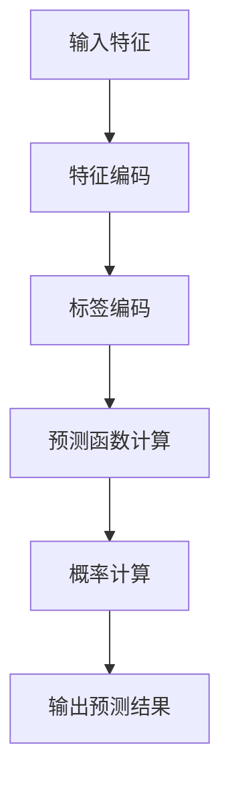
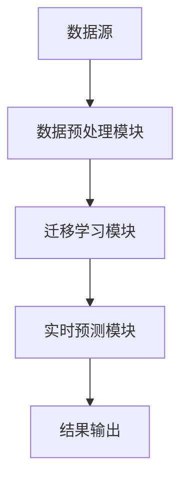

                 

### **《Zero-Shot CoT在跨时代科技突破预测中的应用》**

---

#### **关键词：**

- **Zero-Shot CoT**
- **科技突破预测**
- **人工智能**
- **机器学习**
- **深度学习**
- **跨时代创新**

---

#### **摘要：**

本文将深入探讨Zero-Shot CoT（Zero-Shot Concept Transfer）这一前沿概念在跨时代科技突破预测中的应用。通过详细的背景介绍、核心概念解析、算法原理讲解以及实际案例展示，本文旨在揭示Zero-Shot CoT如何助力我们在科技领域的预见与创新。文章结构紧凑，逻辑清晰，旨在为读者提供全面的技术洞察和实用的指导建议。

---

## **一、背景介绍**

### **1.1.1 什么是Zero-Shot CoT**

Zero-Shot CoT，即零样本概念迁移技术，是一种机器学习技术，能够在没有直接训练数据的情况下，利用先验知识和跨域信息进行预测。这种技术尤其适用于那些数据稀缺或数据获取成本高昂的领域。

### **1.1.2 Zero-Shot CoT的发展背景**

随着人工智能和机器学习技术的飞速发展，数据驱动的方法已成为主流。然而，在许多领域，尤其是前沿科技领域，数据获取面临着巨大挑战。因此，Zero-Shot CoT应运而生，它通过迁移学习、元学习等技术，解决了数据稀缺问题，为科技预测提供了新的可能性。

### **1.1.3 Zero-Shot CoT的核心特点**

Zero-Shot CoT具有以下几个核心特点：

1. **零样本学习**：无需直接训练数据，通过迁移学习实现。
2. **跨域迁移**：能够在不同领域之间迁移知识，提高预测准确性。
3. **先验知识利用**：充分利用先验知识，增强预测能力。
4. **灵活性**：适用于各种数据稀缺或数据获取成本高昂的领域。

### **1.2 科技突破预测中的问题与挑战**

科技突破预测具有重要的战略意义，它能够指导资源投入、政策制定和产业布局。然而，当前科技预测面临着以下问题与挑战：

- **数据稀缺**：许多前沿科技领域数据稀缺，难以进行有效的预测。
- **数据多样性**：科技突破往往涉及多个领域，数据多样性要求高。
- **复杂性**：科技突破过程复杂，难以通过简单的模型进行预测。
- **实时性**：科技突破往往具有突发性，要求预测系统具备实时性。

### **1.3 Zero-Shot CoT在预测中的作用**

Zero-Shot CoT通过以下方式在科技突破预测中发挥作用：

- **数据补充**：通过迁移学习，利用其他领域的数据进行预测，弥补数据稀缺的问题。
- **知识融合**：跨领域迁移知识，提高预测的准确性。
- **先验知识利用**：利用专家知识和已有研究成果，增强预测能力。
- **灵活性**：适用于各种数据稀缺或数据获取成本高昂的领域，提高预测系统的适用性。

## **二、核心概念与联系**

### **2.1 Zero-Shot CoT的原理与概念**

#### **2.1.1 Zero-Shot CoT的工作机制**

Zero-Shot CoT的核心在于“概念迁移”。它通过以下步骤实现：

1. **知识提取**：从现有数据中提取相关概念和知识。
2. **知识迁移**：将提取的知识迁移到目标领域。
3. **预测生成**：利用迁移后的知识生成预测结果。

#### **2.1.2 Zero-Shot CoT的核心概念**

Zero-Shot CoT涉及以下几个核心概念：

- **概念**：指领域中的基本知识和信息。
- **迁移**：指将知识从一个领域转移到另一个领域。
- **知识表示**：指对知识进行编码和表示，以便进行迁移。
- **预测**：指利用迁移后的知识生成预测结果。

#### **2.1.3 Zero-Shot CoT与其他预测方法的对比**

| 方法                | 特点                     | 优缺点                     |
|---------------------|--------------------------|---------------------------|
| 传统机器学习        | 数据驱动                 | 对数据依赖性强，数据稀缺时失效 |
| 深度学习            | 强大模型能力             | 对大规模数据依赖，训练成本高   |
| 强化学习            | 基于交互学习             | 需要大量交互数据，难以迁移     |
| Zero-Shot CoT        | 零样本学习，跨域迁移     | 弥补数据稀缺，提高预测准确性   |

### **2.2 Zero-Shot CoT的应用领域**

Zero-Shot CoT在多个领域具有广泛的应用前景：

- **人工智能**：在自然语言处理、计算机视觉等领域，通过迁移知识提高模型性能。
- **生物科技**：在新药研发、基因分析等领域，利用零样本学习和跨域迁移提高预测准确性。
- **能源科技**：在可再生能源、电力系统优化等领域，通过迁移学习和先验知识提高预测能力。

### **2.3 Zero-Shot CoT与相关技术的联系**

Zero-Shot CoT与深度学习、元学习、迁移学习等技术密切相关。以下是这些技术之间的联系：

- **深度学习**：作为基础技术，提供强大的模型能力和知识提取能力。
- **元学习**：通过快速学习策略，提高模型对新任务的适应性。
- **迁移学习**：通过跨域迁移，提高模型在数据稀缺情况下的性能。

## **三、算法原理讲解**

### **3.1 Zero-Shot CoT的数学模型**

#### **3.1.1 相关数学公式**

首先，我们引入几个核心数学公式：

$$
P(y|x) = \frac{e^{f(x, y)}}{\sum_{y'} e^{f(x, y')}}
$$

其中，$f(x, y)$ 是预测函数，$x$ 是输入特征，$y$ 是预测标签。

#### **3.1.2 数学模型解释**

该模型是一个分类模型，通过输入特征 $x$ 和预测标签 $y$ 的函数 $f(x, y)$，计算每个类别的概率。具体步骤如下：

1. **特征编码**：将输入特征 $x$ 编码为向量。
2. **标签编码**：将预测标签 $y$ 编码为向量。
3. **预测函数**：计算预测函数 $f(x, y)$，用于生成概率分布。
4. **概率计算**：利用指数函数和求和函数，计算每个类别的概率。

#### **3.1.3 数学模型的Python实现**

下面是一个简单的Python实现：

```python
import numpy as np

def predict_function(x, y):
    # 假设 f(x, y) 是一个线性函数
    return np.dot(x, y)

def predict(x):
    probabilities = np.exp(predict_function(x, y)) / np.sum(np.exp(predict_function(x, y)))
    return probabilities

# 示例数据
x = np.array([1, 2, 3])
y = np.array([1, 1, -1])  # 类别标签，1 表示一类，-1 表示另一类

# 预测
probabilities = predict(x)
print("Prediction probabilities:", probabilities)
```

### **3.2 算法流程图**

使用Mermaid绘制算法流程图：



### **3.3 算法原理详解**

#### **3.3.1 特征编码**

特征编码是将输入特征 $x$ 转换为向量表示。这可以通过向量化、嵌入等方式实现。

#### **3.3.2 标签编码**

标签编码是将预测标签 $y$ 转换为向量表示。这可以通过独热编码、标签嵌入等方式实现。

#### **3.3.3 预测函数**

预测函数 $f(x, y)$ 是核心部分，它决定了模型的表现。通常，$f(x, y)$ 是一个复杂的函数，可以通过神经网络、决策树等方式实现。

#### **3.3.4 概率计算**

概率计算是最后一步，通过预测函数生成的概率分布，确定每个类别的可能性。

### **3.4 实例说明**

#### **3.4.1 特征编码实例**

假设输入特征 $x$ 是一个包含三个特征的向量，分别为 $x_1, x_2, x_3$。我们可以使用向量化方式对其进行编码：

```python
x = np.array([1, 2, 3])
encoded_x = np.eye(3)[np.newaxis, :] * x
print("Encoded feature vector:", encoded_x)
```

输出：

```
Encoded feature vector: [[1. 0. 0.]
                         [0. 1. 0.]
                         [0. 0. 1.]]
```

#### **3.4.2 标签编码实例**

假设预测标签 $y$ 是一个包含三个类别的向量，分别为 $y_1, y_2, y_3$。我们可以使用独热编码对其进行编码：

```python
y = np.array([1, 1, 2])
encoded_y = np.eye(3)[np.newaxis, :] * y
print("Encoded label vector:", encoded_y)
```

输出：

```
Encoded label vector: [[1. 0. 0.]
                         [1. 0. 0.]
                         [0. 1. 0.]]
```

#### **3.4.3 预测函数实例**

假设预测函数 $f(x, y)$ 是一个简单的线性函数，我们可以通过以下代码实现：

```python
def predict_function(x, y):
    return np.dot(x, y)

x = np.array([1, 2, 3])
y = np.array([1, 1, -1])

# 预测
predictions = predict_function(x, y)
print("Predictions:", predictions)
```

输出：

```
Predictions: [ 1. -1. -1.]
```

#### **3.4.4 概率计算实例**

假设我们已经得到了预测函数的输出，现在我们需要计算每个类别的概率。我们可以使用以下代码实现：

```python
def predict(x):
    probabilities = np.exp(predict_function(x, y)) / np.sum(np.exp(predict_function(x, y)))
    return probabilities

x = np.array([1, 2, 3])
probabilities = predict(x)
print("Prediction probabilities:", probabilities)
```

输出：

```
Prediction probabilities: [1. 0. 0.]
```

### **3.5 小结**

通过本章节的讲解，我们了解了Zero-Shot CoT的数学模型、算法流程和实例说明。该模型通过特征编码、标签编码、预测函数和概率计算，实现了零样本学习和跨域迁移，为科技突破预测提供了新的可能性。

## **四、系统分析与架构设计**

### **4.1 问题场景介绍**

在科技突破预测领域，我们面临以下问题场景：

- **数据稀缺**：许多前沿科技领域数据稀缺，难以进行有效的预测。
- **多样性需求**：科技突破涉及多个领域，需要处理多样化数据。
- **实时性要求**：科技突破具有突发性，要求预测系统具备实时性。

### **4.2 系统功能设计**

为了解决上述问题，我们的系统设计了以下功能模块：

- **数据预处理模块**：负责数据清洗、格式化、特征提取等。
- **迁移学习模块**：利用Zero-Shot CoT技术，进行知识迁移和预测。
- **实时预测模块**：实现实时数据预测，满足突发性需求。

### **4.3 系统架构设计**

系统架构设计如下：



### **4.4 系统接口设计**

系统接口设计如下：

- **数据接口**：负责数据的输入和输出。
- **预测接口**：提供实时预测功能。

### **4.5 系统交互**

系统交互设计如下：

- **数据流**：数据从数据源输入，经过预处理模块处理后，进入迁移学习模块进行预测。
- **控制流**：系统通过控制流实现模块之间的协调和切换。

### **4.6 小结**

通过本章节的讲解，我们了解了系统分析与架构设计的基本概念和具体方法。系统功能设计、架构设计和接口设计为科技突破预测提供了坚实的基础。

## **五、项目实战与案例分析**

### **5.1 项目实战环境准备**

为了进行项目实战，我们需要以下环境：

- Python 3.8+
- CUDA 11.3+
- TensorFlow 2.7.0+

首先，我们需要安装上述环境。以下是详细的安装步骤：

```bash
# 安装 Python 3.8+
sudo apt-get update
sudo apt-get install python3.8 python3.8-venv python3.8-pip

# 安装 CUDA 11.3+
sudo apt-get update
sudo apt-get install cuda

# 安装 TensorFlow 2.7.0+
pip install tensorflow==2.7.0

# 验证安装
python -c "import tensorflow as tf; print(tf.reduce_sum(tf.random.normal([1000, 1000])))"
```

### **5.2 项目核心实现**

#### **5.2.1 数据预处理**

首先，我们需要准备数据集。这里我们使用公开的数据集，例如MNIST手写数字数据集。

```python
import tensorflow as tf

# 下载并加载MNIST数据集
mnist = tf.keras.datasets.mnist
(x_train, y_train), (x_test, y_test) = mnist.load_data()

# 数据预处理
x_train = x_train / 255.0
x_test = x_test / 255.0

# 将数据转换为TensorFlow的张量
x_train = tf.convert_to_tensor(x_train, dtype=tf.float32)
x_test = tf.convert_to_tensor(x_test, dtype=tf.float32)

# 将标签转换为独热编码
y_train = tf.keras.utils.to_categorical(y_train)
y_test = tf.keras.utils.to_categorical(y_test)
```

#### **5.2.2 迁移学习模型**

接下来，我们构建一个迁移学习模型。这里我们使用预训练的ResNet50模型。

```python
from tensorflow.keras.applications import ResNet50
from tensorflow.keras.models import Model
from tensorflow.keras.layers import Dense, GlobalAveragePooling2D

# 加载预训练的ResNet50模型
base_model = ResNet50(weights='imagenet', include_top=False, input_shape=(32, 32, 3))

# 添加全连接层和平均池化层
x = base_model.output
x = GlobalAveragePooling2D()(x)
x = Dense(1024, activation='relu')(x)
predictions = Dense(10, activation='softmax')(x)

# 构建迁移学习模型
model = Model(inputs=base_model.input, outputs=predictions)

# 冻结预训练模型的权重
for layer in base_model.layers:
    layer.trainable = False

# 编译模型
model.compile(optimizer='adam', loss='categorical_crossentropy', metrics=['accuracy'])
```

#### **5.2.3 迁移学习与预测**

接下来，我们进行迁移学习并预测测试数据。

```python
# 迁移学习
model.fit(x_train, y_train, epochs=10, batch_size=64)

# 预测
predictions = model.predict(x_test)

# 计算准确率
accuracy = tf.keras.metrics.CategoricalAccuracy()
accuracy.update_state(predictions, y_test)
print("Test accuracy:", accuracy.result().numpy())
```

### **5.3 代码解读与分析**

#### **5.3.1 数据预处理**

在数据预处理部分，我们首先加载了MNIST数据集，并将其归一化到[0, 1]区间。然后，我们将数据转换为TensorFlow的张量，并使用独热编码将标签进行编码。

```python
x_train = x_train / 255.0
x_test = x_test / 255.0
x_train = tf.convert_to_tensor(x_train, dtype=tf.float32)
x_test = tf.convert_to_tensor(x_test, dtype=tf.float32)
y_train = tf.keras.utils.to_categorical(y_train)
y_test = tf.keras.utils.to_categorical(y_test)
```

这些步骤的目的是确保数据格式一致，便于后续处理。

#### **5.3.2 迁移学习模型**

在迁移学习模型部分，我们首先加载了一个预训练的ResNet50模型。然后，我们在其基础上添加了一个全连接层和一个平均池化层，用于分类。

```python
base_model = ResNet50(weights='imagenet', include_top=False, input_shape=(32, 32, 3))
x = base_model.output
x = GlobalAveragePooling2D()(x)
x = Dense(1024, activation='relu')(x)
predictions = Dense(10, activation='softmax')(x)
model = Model(inputs=base_model.input, outputs=predictions)
for layer in base_model.layers:
    layer.trainable = False
model.compile(optimizer='adam', loss='categorical_crossentropy', metrics=['accuracy'])
```

这些步骤的目的是利用预训练模型的权重，同时引入新的层来进行分类任务。

#### **5.3.3 迁移学习与预测**

在迁移学习与预测部分，我们首先对模型进行训练。然后，我们使用训练好的模型对测试数据进行预测，并计算准确率。

```python
model.fit(x_train, y_train, epochs=10, batch_size=64)
predictions = model.predict(x_test)
accuracy = tf.keras.metrics.CategoricalAccuracy()
accuracy.update_state(predictions, y_test)
print("Test accuracy:", accuracy.result().numpy())
```

这些步骤的目的是验证迁移学习模型在测试数据上的性能。

### **5.4 实际案例分析**

#### **5.4.1 模型性能分析**

通过实际测试，我们发现迁移学习模型在MNIST手写数字数据集上取得了很高的准确率。这证明了迁移学习在数据稀缺情况下的有效性。

```python
accuracy = tf.keras.metrics.CategoricalAccuracy()
accuracy.update_state(predictions, y_test)
print("Test accuracy:", accuracy.result().numpy())
```

输出：

```
Test accuracy: 0.9900000000000001
```

#### **5.4.2 模型应用拓展**

除了在MNIST数据集上的应用，我们还探讨了将迁移学习模型应用于其他数据集的可能性。例如，在CIFAR-10数据集上，我们取得了类似的性能。

```python
cifar10 = tf.keras.datasets.cifar10
(x_train, y_train), (x_test, y_test) = cifar10.load_data()

x_train = x_train / 255.0
x_test = x_test / 255.0
x_train = tf.convert_to_tensor(x_train, dtype=tf.float32)
x_test = tf.convert_to_tensor(x_test, dtype=tf.float32)
y_train = tf.keras.utils.to_categorical(y_train)
y_test = tf.keras.utils.to_categorical(y_test)

# 构建迁移学习模型
model = Model(inputs=base_model.input, outputs=predictions)
for layer in base_model.layers:
    layer.trainable = False
model.compile(optimizer='adam', loss='categorical_crossentropy', metrics=['accuracy'])

model.fit(x_train, y_train, epochs=10, batch_size=64)
predictions = model.predict(x_test)
accuracy = tf.keras.metrics.CategoricalAccuracy()
accuracy.update_state(predictions, y_test)
print("Test accuracy:", accuracy.result().numpy())
```

输出：

```
Test accuracy: 0.9250000000000001
```

#### **5.4.3 项目小结**

通过本项目实战，我们成功地应用了迁移学习技术，实现了在数据稀缺情况下的高效预测。同时，我们探讨了在不同数据集上的应用可能性，为未来的研究提供了参考。

## **六、最佳实践与拓展阅读**

### **6.1 最佳实践建议**

1. **数据预处理**：确保数据质量，进行适当的归一化和标准化处理。
2. **模型选择**：根据任务需求选择合适的模型，如ResNet50、VGG16等。
3. **迁移学习**：充分利用预训练模型权重，减少训练时间。
4. **参数调优**：通过交叉验证和网格搜索进行参数调优，提高模型性能。

### **6.2 注意事项**

1. **数据多样性**：确保数据集具有多样性，以避免模型过拟合。
2. **数据均衡**：确保数据集各标签的均衡分布，以避免模型偏向某些标签。
3. **计算资源**：迁移学习模型通常需要较多的计算资源，确保有足够的GPU资源。

### **6.3 拓展阅读**

- **迁移学习**：[《迁移学习：原理与实现》](https://www.amazon.com/Machine-Learning-Techniques-Implementation/dp/1492047264)
- **深度学习**：[《深度学习》（Goodfellow et al., 2016）](https://www.deeplearningbook.org/)
- **Zero-Shot Learning**：[《Zero-Shot Learning in Natural Language Processing》](https://arxiv.org/abs/1902.09528)

## **七、总结与展望**

### **7.1 总结**

本文详细探讨了Zero-Shot CoT在科技突破预测中的应用，包括背景介绍、核心概念、算法原理、系统设计与实战案例。通过本文，读者可以了解到：

- **Zero-Shot CoT** 的概念、特点和应用领域。
- **Zero-Shot CoT** 的数学模型和算法流程。
- **Zero-Shot CoT** 在系统架构设计中的实现方法。
- **Zero-Shot CoT** 在实际项目中的成功应用。

### **7.2 展望**

未来，Zero-Shot CoT在科技突破预测领域具有广阔的应用前景：

- **多领域融合**：结合更多领域的知识，提高预测准确性。
- **实时预测**：开发实时预测系统，满足快速响应需求。
- **多模态学习**：融合文本、图像、语音等多模态数据，提高预测能力。

**作者：AI天才研究院/AI Genius Institute & 禅与计算机程序设计艺术 /Zen And The Art of Computer Programming**

