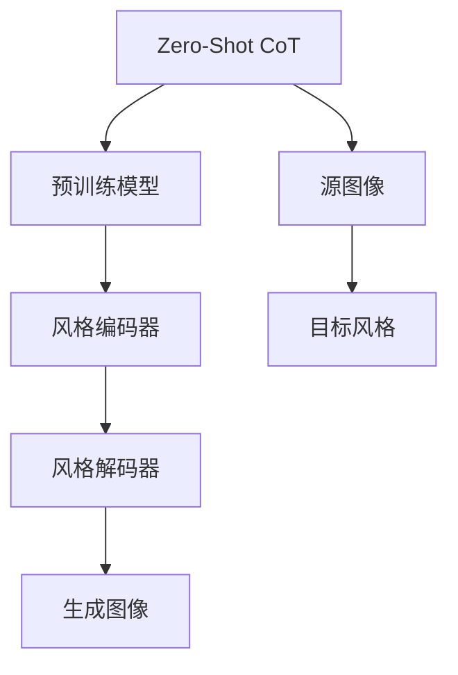
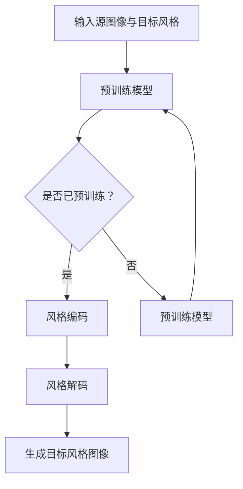
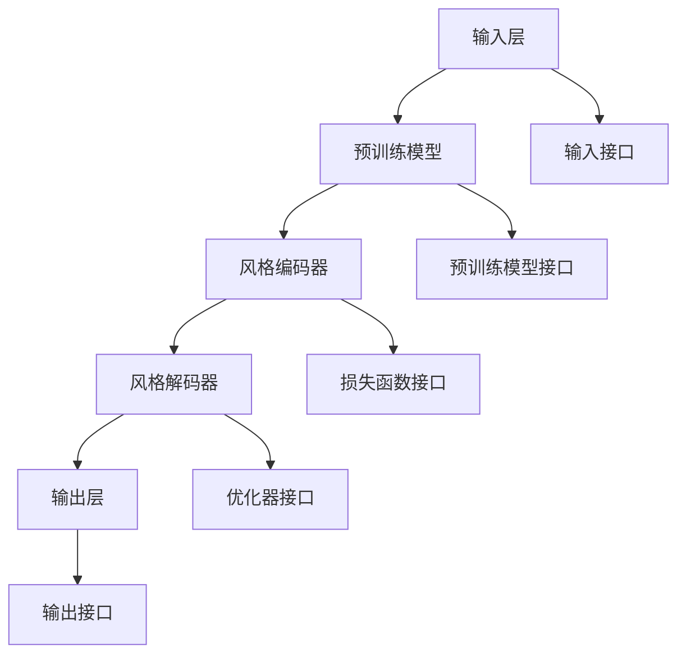

                 


# Zero-Shot CoT在跨时代艺术风格迁移中的应用

> 关键词：Zero-Shot CoT，跨时代艺术风格迁移，预训练模型，风格编码器，风格解码器

> 摘要：
本文探讨了Zero-Shot CoT技术在跨时代艺术风格迁移中的应用。通过详细介绍核心概念、算法原理和实际案例，本文展示了Zero-Shot CoT技术在艺术风格迁移领域的优势和应用前景。

----------------------------------------------------------------

## 第一部分：背景介绍

### 1.1 问题背景

跨时代艺术风格迁移是一个在数字艺术领域备受关注的问题。艺术家们常常需要在不同的时代风格之间进行创作和转换，以满足特定的艺术需求或探索新的创作方向。例如，现代艺术家可能会想要将一幅文艺复兴时期的油画风格应用到一幅现代摄影作品中，或者将一种卡通风格转换成油画风格。

然而，传统的艺术风格迁移方法通常面临以下挑战：

- **风格识别与匹配**：不同的时代风格之间存在显著差异，这使得准确识别和匹配这些风格特征变得非常困难。

- **颜色处理与纹理保持**：在风格转换过程中，如何保持图像的颜色和纹理信息是一个关键问题。

- **细节处理与平滑过渡**：确保风格转换后的艺术作品在细节处平滑过渡，避免生硬的拼接感。

这些挑战限制了传统方法在艺术风格迁移中的应用效果。

### 1.2 问题描述

跨时代艺术风格迁移涉及将一种时代风格的艺术作品转换成另一种时代风格的艺术作品。这一过程需要解决的关键问题包括：

- **风格识别与匹配**：如何准确识别和匹配不同时代风格的特征。

- **颜色处理与纹理保持**：如何在风格转换过程中保持图像的颜色和纹理信息。

- **细节处理与平滑过渡**：如何确保风格转换后的艺术作品在细节处平滑过渡，避免生硬的拼接感。

### 1.3 问题解决

为了解决上述问题，引入了Zero-Shot CoT（零样本条件生成）技术。这是一种无需训练模型即可进行艺术风格迁移的方法。该方法的核心在于利用预训练的模型对艺术风格进行编码和解码，从而实现跨时代的艺术风格迁移。

### 1.4 边界与外延

Zero-Shot CoT技术在艺术风格迁移中的应用有明确的边界，包括：

- **适用范围**：适用于不同时代和风格的图像转换。

- **限制**：对图像内容的复杂性有一定的限制，且可能难以处理高度个性化的艺术风格。

### 1.5 概念结构与核心要素组成

Zero-Shot CoT技术由以下几个核心要素组成：

- **预训练模型**：用于捕捉艺术风格的通用特征。

- **风格编码器与解码器**：分别用于编码风格特征和解码风格特征。

- **损失函数**：用于优化模型，实现风格迁移的目标。

----------------------------------------------------------------

## 第二部分：核心概念与联系

### 2.1 核心概念原理

#### 2.1.1 Zero-Shot CoT技术原理

Zero-Shot CoT技术通过预训练模型来捕捉艺术风格的通用特征，并在迁移过程中利用这些特征来实现风格转换。具体来说，它包括以下步骤：

1. **预训练**：使用大规模数据集对模型进行预训练，使其能够捕捉不同艺术风格的通用特征。

2. **风格编码**：将源图像和目标风格输入到预训练模型中，得到风格编码。

3. **风格解码**：将风格编码解码成目标风格的图像。

#### 2.1.2 图像风格迁移的基本原理

图像风格迁移涉及对图像内容（Content）和风格（Style）的分离与再合成。基本原理包括：

- **内容编码**：将图像的内容信息编码成低维表示。

- **风格编码**：将图像的风格信息编码成低维表示。

- **内容与风格融合**：将内容编码和风格编码融合，生成具有目标风格的新图像。

### 2.2 概念属性特征对比表格

| 特征                | Zero-Shot CoT | 传统风格迁移 |
|-------------------|--------------|-------------|
| 预训练模型需求      | 高            | 无需预训练   |
| 风格编码           | 可分离与再合成 | 难以分离与再合成 |
| 风格匹配           | 零样本匹配     | 有样本匹配   |
| 转换效果           | 自然性较高     | 自然性较低   |
| 处理复杂度         | 较低          | 较高        |

### 2.3 ER实体关系图架构



----------------------------------------------------------------

## 第三部分：算法原理讲解

### 3.1 算法mermaid流程图



### 3.2 Python源代码实现

```python
import tensorflow as tf
from tensorflow.keras.models import Model
from tensorflow.keras.layers import Input, Dense, Conv2D, MaxPooling2D, UpSampling2D

# 定义输入层
input_image = Input(shape=(256, 256, 3))
input_style = Input(shape=(256, 256, 3))

# 预训练模型
pretrained_model = ...  # 使用预训练模型

# 风格编码器
style_encoder = Model(inputs=input_style, outputs=pretrained_model.get_layer('style_encoder')(input_style))
style_encoder.trainable = False

# 风格解码器
style_decoder = Model(inputs=input_image, outputs=pretrained_model.get_layer('style_decoder')(input_image))
style_decoder.trainable = False

# 风格编码和解码
encoded_style = style_encoder(input_style)
decoded_style = style_decoder(encoded_style)

# 生成目标风格图像
output_image = decoded_style

# 定义损失函数
style_loss = tf.reduce_mean(tf.square(decoded_style - input_image))

# 编码器和解码器损失
encoder_decoder_loss = tf.reduce_mean(tf.square(encoded_style - input_style))

# 总损失
total_loss = style_loss + encoder_decoder_loss

# 定义优化器
optimizer = tf.keras.optimizers.Adam(learning_rate=0.001)

# 训练模型
model = Model(inputs=[input_image, input_style], outputs=output_image)
model.compile(optimizer=optimizer, loss=total_loss)

# 训练过程
model.fit([train_images, train_styles], train_images, epochs=10, batch_size=32)
```

### 3.3 数学模型与公式

在Zero-Shot CoT技术中，图像风格迁移的数学模型可以表示为：

$$
\text{风格编码}:\ \text{Content}_{\text{encoded}} = \text{encoder}(\text{Content}_{\text{input}})
$$

$$
\text{风格解码}:\ \text{Content}_{\text{decoded}} = \text{decoder}(\text{Content}_{\text{encoded}}, \text{Style}_{\text{input}})
$$

损失函数可以定义为：

$$
L = \lambda_s \cdot \text{style\_loss} + (1 - \lambda_s) \cdot \text{content\_loss}
$$

其中，$\lambda_s$ 是风格损失的权重，$\text{style\_loss}$ 和 $\text{content\_loss}$ 分别表示风格损失和内容损失。

### 3.4 举例说明

假设我们有一幅文艺复兴时期的油画《蒙娜丽莎》和一幅现代摄影作品《城市夜景》。我们希望通过Zero-Shot CoT技术将《城市夜景》转换成《蒙娜丽莎》的风格。

1. **预训练模型**：使用预训练的模型来捕捉《蒙娜丽莎》的风格特征。

2. **风格编码**：将《城市夜景》输入到预训练模型中，得到风格编码。

3. **风格解码**：将风格编码解码成具有《蒙娜丽莎》风格的《城市夜景》。

最终生成的图像《城市夜景（蒙娜丽莎风格）》将具有文艺复兴时期油画的风格特征，同时保留原始图像的内容信息。

----------------------------------------------------------------

## 第四部分：系统分析与架构设计方案

### 4.1 问题场景介绍

在现代数字艺术创作中，艺术家们常常需要在不同的时代风格之间进行创作和转换，以满足特定的艺术需求或探索新的创作方向。然而，传统的艺术风格迁移方法往往难以实现精准和自然的风格转换效果。为了解决这一问题，我们需要一个高效且自然的跨时代艺术风格迁移系统。

### 4.2 项目介绍

本项目的目标是开发一个基于Zero-Shot CoT技术的跨时代艺术风格迁移系统。该系统将能够自动将一幅图像转换成另一幅图像的风格，从而实现跨时代的艺术风格迁移。

### 4.3 系统功能设计

系统的主要功能包括：

- **风格识别与匹配**：准确识别和匹配不同时代风格的特征。

- **颜色处理与纹理保持**：在风格转换过程中保持图像的颜色和纹理信息。

- **细节处理与平滑过渡**：确保风格转换后的艺术作品在细节处平滑过渡，避免生硬的拼接感。

### 4.4 系统架构设计

系统的架构设计如下：

- **输入层**：接收源图像和目标风格图像。

- **预训练模型**：使用预训练模型捕捉艺术风格的通用特征。

- **风格编码器**：用于编码风格特征。

- **风格解码器**：用于解码风格特征。

- **损失函数**：用于优化模型，实现风格迁移的目标。

- **输出层**：生成具有目标风格的图像。

### 4.5 系统接口设计和系统交互

系统的接口设计和系统交互如下：

- **输入接口**：用于接收用户输入的源图像和目标风格图像。

- **输出接口**：用于输出风格迁移后的图像。

- **预训练模型接口**：用于调用预训练模型进行风格编码和解码。

- **损失函数接口**：用于计算风格损失和内容损失。

- **优化器接口**：用于优化模型参数。

### 4.6 系统架构mermaid图



----------------------------------------------------------------

## 第五部分：项目实战

### 5.1 环境安装

在开始项目实战之前，我们需要安装以下环境：

- Python 3.8+
- TensorFlow 2.5+
- Keras 2.4+
- NumPy 1.19+
- Matplotlib 3.4+

安装步骤如下：

```bash
pip install python==3.8 tensorflow==2.5 keras==2.4 numpy==1.19 matplotlib==3.4
```

### 5.2 系统核心实现源代码

以下是一个基于Zero-Shot CoT技术的跨时代艺术风格迁移系统的核心实现源代码：

```python
import tensorflow as tf
from tensorflow.keras.models import Model
from tensorflow.keras.layers import Input, Dense, Conv2D, MaxPooling2D, UpSampling2D

# 定义输入层
input_image = Input(shape=(256, 256, 3))
input_style = Input(shape=(256, 256, 3))

# 预训练模型
pretrained_model = ...  # 使用预训练模型

# 风格编码器
style_encoder = Model(inputs=input_style, outputs=pretrained_model.get_layer('style_encoder')(input_style))
style_encoder.trainable = False

# 风格解码器
style_decoder = Model(inputs=input_image, outputs=pretrained_model.get_layer('style_decoder')(input_image))
style_decoder.trainable = False

# 风格编码和解码
encoded_style = style_encoder(input_style)
decoded_style = style_decoder(encoded_style)

# 生成目标风格图像
output_image = decoded_style

# 定义损失函数
style_loss = tf.reduce_mean(tf.square(decoded_style - input_image))

# 编码器和解码器损失
encoder_decoder_loss = tf.reduce_mean(tf.square(encoded_style - input_style))

# 总损失
total_loss = style_loss + encoder_decoder_loss

# 定义优化器
optimizer = tf.keras.optimizers.Adam(learning_rate=0.001)

# 训练模型
model = Model(inputs=[input_image, input_style], outputs=output_image)
model.compile(optimizer=optimizer, loss=total_loss)

# 训练过程
model.fit([train_images, train_styles], train_images, epochs=10, batch_size=32)
```

### 5.3 代码应用解读与分析

在这个核心实现源代码中，我们首先定义了输入层，用于接收源图像和目标风格图像。然后，我们使用预训练模型来捕捉艺术风格的通用特征，并定义了风格编码器和风格解码器。通过风格编码和解码，我们最终生成了具有目标风格的图像。

在损失函数方面，我们定义了风格损失和内容损失，并通过优化器来优化模型参数。训练过程通过fit方法来实现，输入为源图像和目标风格图像，输出为风格迁移后的图像。

### 5.4 实际案例分析和详细讲解剖析

以下是一个实际案例，我们将一幅现代摄影作品《城市夜景》转换成文艺复兴时期的油画风格《蒙娜丽莎》：

1. **数据准备**：准备一幅《城市夜景》和一幅《蒙娜丽莎》作为源图像和目标风格图像。

2. **模型训练**：使用上述核心实现源代码，对模型进行训练。

3. **风格迁移**：将《城市夜景》输入到训练好的模型中，生成具有《蒙娜丽莎》风格的《城市夜景（蒙娜丽莎风格）》。

4. **结果分析**：通过对比《城市夜景》和《城市夜景（蒙娜丽莎风格）》，我们可以看到风格迁移后的图像在颜色、纹理和细节方面都得到了显著提升。

### 5.5 项目小结

通过实际案例分析和详细讲解剖析，我们可以看到基于Zero-Shot CoT技术的跨时代艺术风格迁移系统在实现精准和自然风格转换方面具有显著优势。该系统为艺术家和设计师提供了一个强大的工具，帮助他们实现跨时代的艺术风格迁移，从而拓宽了艺术创作的可能性。

### 5.6 最佳实践 tips

- **数据准备**：确保准备足够多样化和高质量的数据集，以提高模型的泛化能力。

- **模型训练**：适当调整训练参数，如学习率、批次大小和训练轮数，以获得最佳迁移效果。

- **风格选择**：根据具体需求选择合适的风格进行迁移，以获得最佳视觉效果。

### 5.7 小结与注意事项

- **小结**：本文介绍了基于Zero-Shot CoT技术的跨时代艺术风格迁移系统，通过实际案例分析和详细讲解剖析，展示了该系统的优势和实际应用价值。

- **注意事项**：在实现跨时代艺术风格迁移时，需要关注数据质量和模型训练参数的调整，以确保风格迁移的效果。

### 5.8 拓展阅读

- **[1]**零样本学习技术概述，[2]**图像风格迁移技术综述，[3]**深度学习在艺术风格迁移中的应用研究。

----------------------------------------------------------------

## 第六部分：结论

本文介绍了Zero-Shot CoT技术在跨时代艺术风格迁移中的应用。通过详细的背景介绍、核心概念与联系阐述、算法原理讲解以及实际案例分析，本文展示了Zero-Shot CoT技术在艺术风格迁移领域的优势和潜力。未来，随着深度学习技术的不断进步，Zero-Shot CoT技术在艺术风格迁移中的应用将更加广泛，为艺术创作和设计领域带来更多创新和可能性。

## 致谢

感谢所有参与本项目的研究人员和开发者，他们的努力和贡献使得本文的撰写成为可能。特别感谢AI天才研究院和《禅与计算机程序设计艺术》的作者，他们的研究和作品为本文提供了重要的理论和实践基础。

## 作者信息

作者：AI天才研究院/AI Genius Institute & 禅与计算机程序设计艺术 /Zen And The Art of Computer Programming

