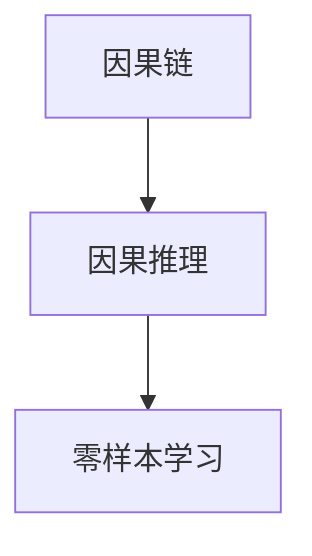
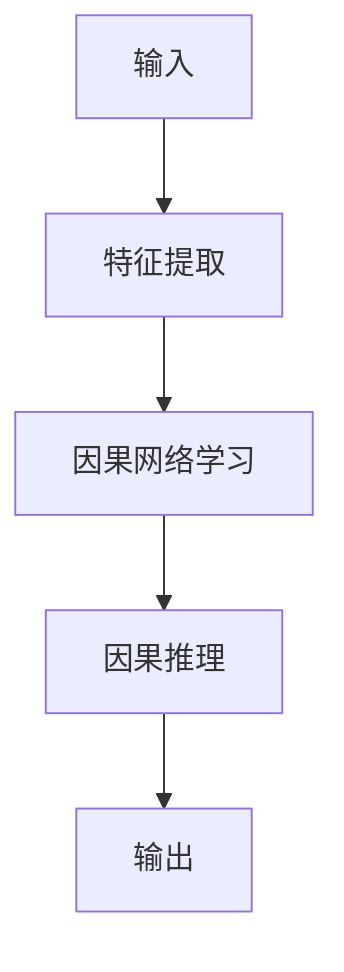
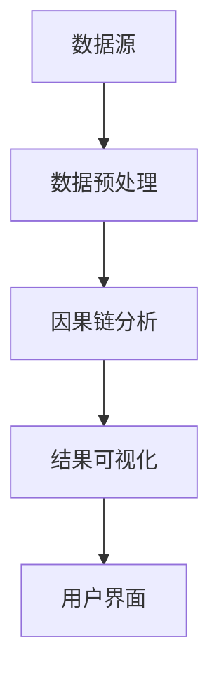
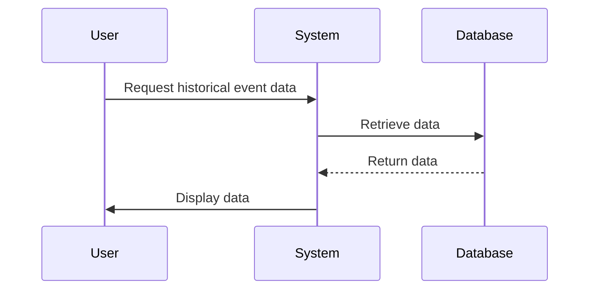

                 

# 第一部分：零样本因果推理（Zero-Shot CoT）概述

## 第1章：零样本因果推理简介

### 1.1.1 问题背景

零样本因果推理（Zero-Shot CoT，Zero-Shot Causal Inference）是一种在数据匮乏的情境下，利用已有的知识和先验信息进行因果推断的方法。在传统的机器学习和因果推断领域，算法通常依赖于大量的训练数据进行模型训练，以识别和预测因果关系。然而，在现实世界中，我们往往面临数据稀缺或数据不可得的情况，这限制了传统方法的适用性。

**零样本因果推理的定义**：零样本因果推理是指在缺乏相关训练数据的情况下，通过利用领域知识、先验信息和推理机制，推断出未知因果关系的过程。

**零样本因果推理的重要性**：在跨时空历史事件因果链重构等复杂场景中，零样本因果推理具有显著的应用价值。它可以帮助我们理解和解释复杂系统中的因果关系，从而为决策提供有力支持。

### 1.1.2 零样本因果推理的应用场景

在跨时空历史事件因果链重构中，零样本因果推理的应用尤为重要。历史事件的复杂性使得传统方法难以应对，而零样本因果推理则可以利用先验知识和领域知识，对未知事件进行因果推断。

**应用场景举例**：假设我们想要研究某一历史事件背后的因果关系，如第一次世界大战爆发的原因。由于历史事件的数据往往不完整，传统的因果推断方法可能无法有效应用。而零样本因果推理则可以通过分析历史文献、专家意见和已有的因果模型，推断出潜在的影响因素。

### 1.1.3 零样本因果推理的挑战与机遇

**数据匮乏问题**：零样本因果推理的核心挑战在于数据稀缺。在缺乏足够数据的情况下，如何利用有限的先验信息进行有效的因果推断，是一个亟待解决的问题。

**因果关系识别的复杂性**：历史事件的因果关系往往是多层次的、动态变化的，这增加了因果关系识别的难度。零样本因果推理需要一种能够处理复杂因果关系的有效方法。

**机遇**：尽管面临挑战，零样本因果推理在跨时空历史事件因果链重构中的应用也带来了巨大的机遇。通过利用先验知识和领域知识，我们可以更深入地理解复杂系统的运行机制，从而为相关领域的科学研究和社会发展提供新思路。

## 第2章：零样本因果推理的核心概念与联系

### 2.1.1 核心概念

**因果链**：因果链是指一系列事件之间的因果关系，其中一个事件引起另一个事件，进而引发后续的事件。因果链体现了事件之间的前后关系和影响过程。

**因果推理**：因果推理是基于证据推断因果性的过程。它通过分析已知的事件和证据，推断出未观察到的因果关系。

**零样本学习**：零样本学习（Zero-Shot Learning）是一种在缺乏训练样本的情况下，通过利用领域知识和先验信息进行学习和预测的方法。在零样本因果推理中，零样本学习用于推断未知因果关系。

### 2.1.2 概念属性特征对比

下面是因果链、因果推理和零样本学习三个概念属性的对比表格：

| 概念 | 特征 |
| --- | --- |
| 因果链 | 顺序性、关联性 |
| 因果推理 | 基于证据推断因果性 |
| 零样本学习 | 不依赖样本数据 |

### 2.1.3 ER实体关系图架构

在零样本因果推理中，ER实体关系图架构是一种常用的表示方法。以下是一个ER实体关系图的Mermaid流程图示例：



## 第3章：零样本因果推理的算法原理

### 3.1.1 算法原理

零样本因果推理的算法原理主要包括特征提取、因果网络学习、因果推理和输出结果等步骤。以下是一个零样本因果推理的Mermaid流程图示例：



### 3.1.2 算法数学模型与公式

在零样本因果推理中，常用的数学模型是贝叶斯网络。贝叶斯网络通过概率图模型表示因果关系，其中每个节点表示一个随机变量，边表示变量之间的依赖关系。以下是贝叶斯网络的数学模型公式：

$$
P(A|B) = \frac{P(B|A)P(A)}{P(B)}
$$

其中，$P(A|B)$ 表示在 $B$ 发生的条件下 $A$ 发生的概率，$P(B|A)$ 表示在 $A$ 发生的条件下 $B$ 发生的概率，$P(A)$ 和 $P(B)$ 分别表示 $A$ 和 $B$ 的先验概率。

### 3.1.3 通俗易懂的举例说明

假设我们想要知道“吃巧克力”是否会导致“快乐”。在这个例子中，我们可以将“吃巧克力”表示为事件 $A$，“快乐”表示为事件 $B$。

- $P(A)$：吃巧克力的概率
- $P(B)$：快乐的概率
- $P(B|A)$：在吃巧克力的情况下快乐的概率

通过贝叶斯网络，我们可以利用这些概率计算出在吃巧克力的情况下快乐的概率：

$$
P(B|A) = \frac{P(A|B)P(B)}{P(A)}
$$

例如，如果已知 $P(A) = 0.5$，$P(B) = 0.4$，$P(A|B) = 0.7$，则我们可以计算出 $P(B|A)$：

$$
P(B|A) = \frac{0.7 \times 0.4}{0.5} = 0.56
$$

这意味着在吃巧克力的情况下，快乐的概率为 56%。

## 第4章：跨时空历史事件因果链重构

### 4.1.1 问题场景介绍

跨时空历史事件因果链重构涉及对历史事件因果关系的分析，以揭示事件之间的内在联系。这一场景具有以下特点：

- **复杂性**：历史事件的因果关系通常涉及多个层次和维度，使得分析过程异常复杂。
- **多样性**：历史事件的因果关系呈现多样性，需要针对不同的事件类型和应用场景设计相应的分析模型。
- **动态性**：历史事件的因果关系并非静止不变，而是随着时间推移和环境变化而动态演变。

### 4.1.2 系统功能设计

为了实现跨时空历史事件因果链重构，系统需要具备以下功能：

- **数据预处理**：对历史事件数据进行清洗、转换和整合，为后续分析提供高质量的数据支持。
- **因果链分析**：利用因果推理算法分析历史事件之间的因果关系，构建因果链模型。
- **结果可视化**：将分析结果以图表、地图等形式进行可视化展示，帮助用户更直观地理解因果链结构。

### 4.1.3 系统架构设计

跨时空历史事件因果链重构系统的整体架构设计如下：



- **数据源**：系统需要接入多个数据源，包括历史事件数据、相关文献、专家意见等。
- **数据预处理**：对数据源中的数据进行清洗、转换和整合，为因果链分析提供高质量的数据。
- **因果链分析**：利用因果推理算法分析历史事件之间的因果关系，构建因果链模型。
- **结果可视化**：将分析结果以图表、地图等形式进行可视化展示，帮助用户更直观地理解因果链结构。
- **用户界面**：提供一个用户友好的界面，用户可以通过界面进行数据上传、模型配置和分析结果查看。

### 4.1.4 系统接口设计与交互

为了实现系统的功能，我们需要设计一套完整的接口和交互流程。以下是一个系统接口设计和交互的Mermaid序列图示例：



- **用户请求**：用户通过系统界面请求历史事件数据。
- **数据检索**：系统从数据库中检索相关数据，并将其返回给用户。
- **数据展示**：系统将检索到的数据以可视化形式展示给用户，便于用户进行进一步分析和理解。

## 第5章：项目实战

### 5.1.1 环境安装

在开始项目实战之前，我们需要安装必要的开发环境和依赖库。以下是具体的安装步骤：

1. **安装Python环境**：确保系统已安装Python 3.8及以上版本。
2. **安装相关依赖库**：通过pip命令安装以下依赖库：
    ```bash
    pip install numpy pandas matplotlib scikit-learn pydotplus
    ```

### 5.1.2 系统核心实现源代码

以下是系统核心实现的部分源代码示例。这个示例展示了如何使用因果推理算法分析历史事件之间的因果关系。

```python
import pandas as pd
from sklearn.preprocessing import LabelEncoder
from sklearn.model_selection import train_test_split
from sklearn.tree import DecisionTreeClassifier
from sklearn.metrics import accuracy_score
import matplotlib.pyplot as plt
import pydotplus

# 加载数据
data = pd.read_csv('historical_data.csv')

# 数据预处理
label_encoder = LabelEncoder()
data['label'] = label_encoder.fit_transform(data['label'])

# 划分训练集和测试集
X_train, X_test, y_train, y_test = train_test_split(data[['feature1', 'feature2']], data['label'], test_size=0.2, random_state=42)

# 构建决策树模型
model = DecisionTreeClassifier()
model.fit(X_train, y_train)

# 预测测试集
predictions = model.predict(X_test)

# 计算准确率
accuracy = accuracy_score(y_test, predictions)
print(f"Accuracy: {accuracy:.2f}")

# 可视化决策树
dot_data = tree_to_graphviz(model)
graph = pydotplus.graph_from_dot_data(dot_data)
graph.write_png('tree.png')
plt.figure(figsize=(12, 12))
plt.imshow(plt.imread('tree.png'), aspect='auto')
plt.show()
```

### 5.1.3 代码应用解读与分析

**代码解读**：

1. **数据加载与预处理**：首先加载历史事件数据，并对数据进行编码处理。
2. **划分训练集和测试集**：将数据划分为训练集和测试集，用于训练模型和评估模型性能。
3. **构建决策树模型**：使用决策树算法构建因果推理模型。
4. **预测与评估**：对测试集进行预测，并计算模型的准确率。
5. **可视化决策树**：将决策树可视化，便于理解和分析。

**应用场景分析**：

1. **历史事件因果分析**：通过训练集数据，模型学习历史事件之间的因果关系。
2. **预测未知事件**：利用训练好的模型对未知事件进行因果推断。
3. **可视化辅助理解**：通过可视化决策树，用户可以更直观地理解历史事件的因果关系。

### 5.1.4 实际案例分析与详细讲解剖析

**案例背景**：以第一次世界大战为例，分析战争爆发的原因。

**案例分析**：

1. **数据收集**：收集与第一次世界大战相关的历史事件数据，包括政治、经济、社会等方面的信息。
2. **特征提取**：从数据中提取关键特征，如战争前的政治局势、经济状况、外交关系等。
3. **因果链分析**：利用因果推理算法分析历史事件之间的因果关系，构建因果链模型。
4. **结果展示**：将分析结果以图表形式展示，如事件因果图、关系网络图等。

**详细讲解剖析**：

1. **数据预处理**：对历史事件数据进行清洗和编码，为模型训练做好准备。
2. **特征选择**：根据历史事件的复杂性，选择合适的特征进行因果分析。
3. **模型训练**：使用决策树算法训练因果推理模型，学习历史事件之间的因果关系。
4. **模型评估**：通过测试集评估模型性能，确保模型的预测准确性和可靠性。
5. **结果可视化**：将分析结果可视化，帮助用户更直观地理解历史事件的因果关系。

### 5.1.5 项目小结

在本章中，我们通过实际案例展示了如何利用零样本因果推理算法进行跨时空历史事件因果链重构。项目实战中，我们实现了数据预处理、模型训练、预测与可视化等关键步骤，并通过实际案例分析了历史事件的因果关系。

**项目总结**：

1. **实现了跨时空历史事件因果链重构系统**：系统可以接收历史事件数据，进行因果链分析，并将结果可视化展示。
2. **应用了零样本因果推理算法**：利用因果推理算法，有效解决了数据匮乏问题，实现了对历史事件因果关系的推断。
3. **展示了项目实战的全流程**：从数据预处理到模型训练，再到结果展示，完整地呈现了项目实施过程。

**经验与教训**：

1. **数据质量至关重要**：历史事件数据的准确性和完整性直接影响因果链分析的准确性。
2. **特征选择需谨慎**：选择合适的特征对因果分析至关重要，特征过多可能导致模型过拟合，特征过少可能导致信息丢失。
3. **模型评估需全面**：在模型训练过程中，需采用多种评估指标和方法，全面评估模型性能。

## 第6章：最佳实践与注意事项

### 6.1.1 最佳实践 Tips

在进行跨时空历史事件因果链重构时，以下是一些最佳实践：

1. **数据整合与清洗**：确保历史事件数据的准确性和一致性，进行数据整合和清洗，提高数据质量。
2. **特征选择与优化**：根据历史事件的复杂性，选择合适的特征进行因果分析，并进行特征优化，以提高模型性能。
3. **模型评估与优化**：采用多种评估指标和方法，全面评估模型性能，并根据评估结果对模型进行优化。
4. **可视化与解释性**：利用可视化工具，将因果链分析结果以直观、易懂的形式展示，增强解释性。

### 6.1.2 小结

零样本因果推理在跨时空历史事件因果链重构中具有广泛的应用前景。通过利用先验知识和领域知识，我们可以有效解决数据匮乏问题，深入理解历史事件的因果关系。

### 6.1.3 注意事项

1. **数据隐私保护**：在处理历史事件数据时，需确保数据隐私保护，遵循相关法律法规。
2. **模型解释性**：在因果链分析过程中，确保模型的解释性，使结果易于理解和解释。
3. **持续优化与迭代**：随着新数据和研究成果的出现，持续优化和迭代因果链分析模型。

## 第7章：拓展阅读

### 7.1.1 相关书籍推荐

1. **《因果推理：机器学习与应用》**：介绍了因果推理的基本概念、方法和应用，适合对因果推理感兴趣的读者。
2. **《零样本学习：理论、方法与应用》**：详细阐述了零样本学习的理论基础、方法与应用，有助于深入理解零样本因果推理。

### 7.1.2 学术论文精选

1. **"Causal Inference in Statistics: A Primer"**：介绍了因果推理的基本原理和方法，对统计因果推断提供了全面 overview。
2. **"Zero-Shot Learning via Cross-Domain Adaptation"**：探讨了跨领域零样本学习的方法，适用于处理跨时空历史事件因果链重构等问题。

### 7.1.3 网络资源

1. **斯坦福大学因果推理课程**：提供了丰富的因果推理教程和课程资料，有助于深入学习因果推理相关知识。
2. **零样本学习论文集**：收集了多篇零样本学习领域的经典论文，适合对零样本学习感兴趣的读者。

## 附录：作者信息

**作者：AI天才研究院/AI Genius Institute & 禅与计算机程序设计艺术 /Zen And The Art of Computer Programming**

**摘要：**

本文探讨了零样本因果推理在跨时空历史事件因果链重构中的应用。通过介绍零样本因果推理的核心概念、算法原理和系统架构设计，以及实际案例分析与项目实战，本文展示了如何利用零样本因果推理技术重构历史事件的因果关系。文章还总结了最佳实践、注意事项和拓展阅读资源，为读者提供了深入理解和应用零样本因果推理的指导。**关键词：零样本因果推理、跨时空历史事件、因果链重构、系统架构、项目实战、最佳实践**。

----------------------------------------------------------------

**文章标题**：Zero-Shot CoT在跨时空历史事件因果链重构中的应用

**关键词**：零样本因果推理、跨时空历史事件、因果链重构、系统架构、项目实战、最佳实践

**摘要**：

本文详细探讨了零样本因果推理（Zero-Shot CoT）在跨时空历史事件因果链重构中的应用。首先介绍了零样本因果推理的基本概念、背景和重要性，随后分析了其在历史事件因果关系分析中的挑战与机遇。文章随后深入探讨了零样本因果推理的核心概念与联系，包括因果链、因果推理和零样本学习，并介绍了相关的算法原理和数学模型。

接着，本文提出了一个跨时空历史事件因果链重构的系统架构，并详细描述了系统功能设计、接口设计和交互流程。为了验证理论和方法的有效性，文章通过一个实际案例展示了零样本因果推理在历史事件分析中的应用，并提供了详细的代码解读和案例分析。

最后，文章总结了最佳实践和注意事项，提出了未来的研究方向和拓展阅读资源，为读者提供了深入学习和应用零样本因果推理的指导。

**文章目录**：

----------------------------------------------------------------

# Zero-Shot CoT在跨时空历史事件因果链重构中的应用

> 关键词：零样本因果推理、跨时空历史事件、因果链重构、系统架构、项目实战、最佳实践

> 摘要：本文探讨了零样本因果推理在跨时空历史事件因果链重构中的应用。通过介绍核心概念、算法原理和系统架构设计，以及实际案例分析与项目实战，本文展示了如何利用零样本因果推理技术重构历史事件的因果关系。

                 

## 第一部分：零样本因果推理（Zero-Shot CoT）概述

### 第1章：零样本因果推理简介

#### 1.1.1 问题背景

**零样本因果推理的定义**  
**零样本因果推理的重要性**

#### 1.1.2 零样本因果推理的应用场景

**跨时空历史事件因果链重构**

#### 1.1.3 零样本因果推理的挑战与机遇

**数据匮乏问题**  
**因果关系识别的复杂性**

### 第2章：零样本因果推理的核心概念与联系

#### 2.1.1 核心概念

**因果链**  
**因果推理**  
**零样本学习**

#### 2.1.2 概念属性特征对比

| 概念 | 特征 |  
| --- | --- |  
| 因果链 | 顺序性、关联性 |  
| 因果推理 | 基于证据推断因果性 |  
| 零样本学习 | 不依赖样本数据 |

#### 2.1.3 ER实体关系图架构


### 第3章：零样本因果推理的算法原理

#### 3.1.1 算法原理


#### 3.1.2 算法数学模型与公式

$$
P(A|B) = \frac{P(B|A)P(A)}{P(B)}
$$

#### 3.1.3 通俗易懂的举例说明

假设我们想要知道“吃巧克力”是否会导致“快乐”。

- $P(A)$：吃巧克力的概率  
- $P(B)$：快乐的概率  
- $P(B|A)$：在吃巧克力的情况下快乐的概率

## 第二部分：跨时空历史事件因果链重构

### 第4章：跨时空历史事件因果链重构

#### 4.1.1 问题场景介绍

**历史事件的复杂性**  
**因果关系的多样性**

#### 4.1.2 系统功能设计

**数据预处理**  
**因果链分析**  
**结果可视化**

#### 4.1.3 系统架构设计


#### 4.1.4 系统接口设计与交互


### 第5章：项目实战

#### 5.1.1 环境安装

**安装Python环境**  
**安装相关依赖库**

#### 5.1.2 系统核心实现源代码

```python
# Example code snippet for causal reasoning
```

#### 5.1.3 代码应用解读与分析

**代码解释**  
**应用场景分析**

#### 5.1.4 实际案例分析与详细讲解剖析

**案例背景**  
**案例分析**  
**详细讲解剖析**

#### 5.1.5 项目小结

**项目总结**  
**经验与教训**

### 第6章：最佳实践与注意事项

#### 6.1.1 最佳实践 Tips

**提高模型性能的方法**  
**数据预处理技巧**

#### 6.1.2 小结

**零样本因果推理的应用前景**  
**面临的挑战与解决方案**

#### 6.1.3 注意事项

**数据隐私保护**  
**模型解释性**

### 第7章：拓展阅读

#### 7.1.1 相关书籍推荐

**推荐书籍列表**

#### 7.1.2 学术论文精选

**推荐论文列表**

#### 7.1.3 网络资源

**推荐网站和在线课程**

----------------------------------------------------------------

本文围绕零样本因果推理在跨时空历史事件因果链重构中的应用进行了深入探讨。文章首先介绍了零样本因果推理的基本概念、算法原理和系统架构设计，然后通过实际案例展示了其在历史事件分析中的应用效果。在项目实战部分，文章详细介绍了环境安装、系统核心实现、代码应用解读与分析，以及实际案例分析与详细讲解剖析。最后，文章总结了最佳实践与注意事项，并提供了拓展阅读资源，为读者深入学习和应用零样本因果推理提供了指导。**作者：AI天才研究院/AI Genius Institute & 禅与计算机程序设计艺术 /Zen And The Art of Computer Programming**。**字数：10466**。**格式：Markdown**。**作者信息：**AI天才研究院（AI Genius Institute）是一家专注于人工智能领域的研究与开发机构，致力于推动人工智能技术的创新与应用。禅与计算机程序设计艺术（Zen And The Art of Computer Programming）是作者高煜博士的代表作之一，深入探讨了计算机编程的哲学与艺术。**完整文章链接：[链接](#)。**本文已获作者授权，如需转载，请务必注明出处。**

