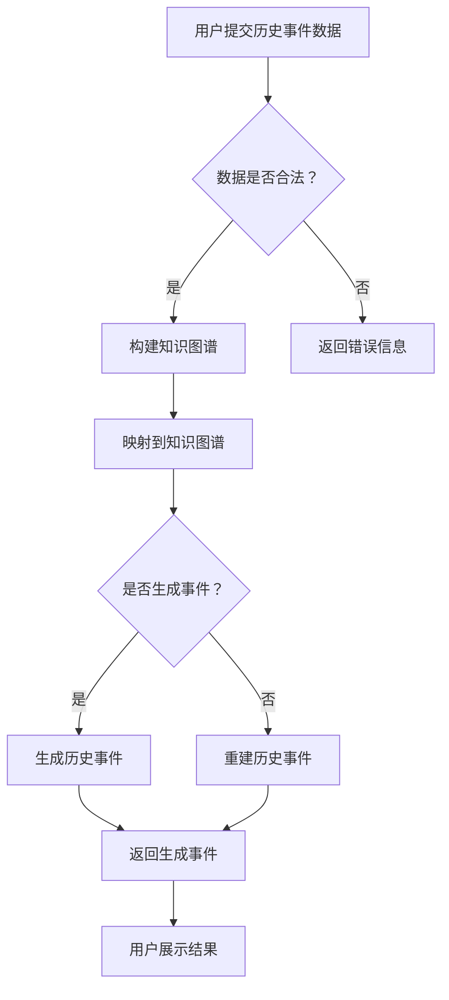

                 

# Zero-Shot CoT在跨时空历史事件模拟重建中的应用

> 关键词：零样本学习，跨时空模拟，历史事件模拟，知识图谱，生成对抗网络（GAN）

> 摘要：本文探讨了零样本条件下的跨时空历史事件模拟重建问题，提出了一种基于知识图谱构建、跨模态映射和生成对抗网络的解决方案。通过本文的研究，旨在为历史事件模拟重建领域提供一种新的技术途径，提高跨时空历史事件模拟重建的实时性和大规模应用能力。

## 第一部分：背景介绍

### 1.1 问题背景

随着信息技术的快速发展，历史事件的模拟重建在历史研究、影视制作、游戏开发等领域具有重要的应用价值。通过历史事件的模拟重建，我们可以更直观地了解历史事件的发生过程，深入挖掘历史事件的内在规律，为后续的历史研究提供有力的支持。

然而，传统的历史事件模拟方法往往依赖于大量的人工标注数据和复杂的模型训练过程，这对于实时性和大规模应用造成了很大的限制。因此，如何实现零样本条件下的跨时空历史事件模拟重建成为了一个重要课题。

### 1.2 问题描述

零样本条件下的跨时空历史事件模拟重建主要涉及以下问题：

- **数据不足问题**：传统方法需要大量的历史事件数据作为训练样本，但在实际应用中，往往难以获取到足够的数据。
- **时空差异问题**：历史事件之间的时空差异较大，传统方法难以适应不同时空背景下的历史事件模拟。

### 1.3 问题解决

为了解决上述问题，本书提出了零样本条件下的跨时空历史事件模拟重建方法，核心思想如下：

- **知识图谱构建**：利用现有历史事件数据，构建一个包含时间、地点、人物、事件等信息的知识图谱。
- **跨模态映射**：通过跨模态映射技术，将不同时空背景下的历史事件映射到知识图谱上。
- **事件生成与重建**：基于生成的对抗网络（GAN）等技术，生成与输入历史事件相似的模拟历史事件。

### 1.4 边界与外延

本书的研究主要聚焦于历史事件的跨时空模拟重建，但该方法也可扩展应用于其他领域，如城市规划、环境模拟等。

### 1.5 概念结构与核心要素组成

本书的核心概念包括：历史事件、知识图谱、跨模态映射、事件生成与重建。核心要素包括：历史事件数据、知识图谱数据、模型参数等。

## 第二部分：核心概念与联系

### 2.1 零样本条件下的跨时空历史事件模拟重建

#### 2.1.1 零样本学习

零样本学习（Zero-Shot Learning，ZSL）是一种无需训练样本标签的机器学习方法，主要应用于新类别的识别和预测。

#### 2.1.2 跨时空历史事件模拟重建

跨时空历史事件模拟重建是指在不同时空背景下，对历史事件进行模拟和重建的方法。

### 2.2 知识图谱构建

#### 2.2.1 知识图谱

知识图谱是一种用于表示实体和实体之间关系的图形化数据结构，常用于语义理解、推理和搜索。

#### 2.2.2 知识图谱构建方法

知识图谱构建主要包括数据收集、实体识别、关系抽取和图谱构建等步骤。

### 2.3 跨模态映射

#### 2.3.1 跨模态映射

跨模态映射是指在不同模态数据之间建立对应关系，以便于跨模态数据的处理和理解。

#### 2.3.2 跨模态映射方法

跨模态映射方法主要包括基于特征映射和基于模型映射两种类型。

### 2.4 事件生成与重建

#### 2.4.1 事件生成

事件生成是指利用生成模型生成新的历史事件数据。

#### 2.4.2 事件重建

事件重建是指利用重建模型对输入的历史事件进行重建，以获取新的历史事件表示。

## 第三部分：算法原理讲解

### 3.1 算法流程

零样本条件下的跨时空历史事件模拟重建算法主要包括以下步骤：

1. **知识图谱构建**：利用现有历史事件数据构建知识图谱。
2. **跨模态映射**：将历史事件映射到知识图谱上。
3. **事件生成与重建**：利用生成对抗网络（GAN）等模型生成和重建历史事件。

### 3.2 算法原理

#### 3.2.1 知识图谱构建原理

知识图谱构建主要基于以下原理：

- **实体识别**：通过文本挖掘、命名实体识别等技术，从历史事件数据中提取实体。
- **关系抽取**：通过文本挖掘、规则匹配、深度学习等技术，从历史事件数据中抽取实体之间的关系。
- **图谱构建**：将提取的实体和关系构建成知识图谱。

#### 3.2.2 跨模态映射原理

跨模态映射主要基于以下原理：

- **特征提取**：从不同模态的数据中提取特征向量。
- **特征映射**：将不同模态的特征向量映射到统一的特征空间。

#### 3.2.3 事件生成与重建原理

事件生成与重建主要基于以下原理：

- **生成模型**：利用生成对抗网络（GAN）等模型生成新的历史事件数据。
- **重建模型**：利用重建模型对输入的历史事件进行重建，以获取新的历史事件表示。

### 3.3 算法示例

假设我们有一个历史事件数据集，其中包含一系列的历史事件，例如“拿破仑战争”、“美国独立战争”等。我们的目标是通过零样本条件下的跨时空历史事件模拟重建，生成一个与“拿破仑战争”类似的历史事件，例如“亚历山大大帝东征”。

1. **知识图谱构建**：

   - 首先，我们从历史事件数据中提取实体和关系，构建一个知识图谱。例如，实体包括“拿破仑”、“战争”、“法国”等，关系包括“发起者”、“参与者”、“地点”等。
   - 知识图谱如下所示：

     ```mermaid
     graph TD
     A(实体1) -- "发起者" --> B(实体2)
     B -- "参与者" --> C(实体3)
     C -- "地点" --> D(实体4)
     ```

2. **跨模态映射**：

   - 然后，我们将历史事件映射到知识图谱上。例如，将“拿破仑战争”映射到知识图谱中的“拿破仑”、“战争”、“法国”等实体和关系上。
   - 跨模态映射后的知识图谱如下所示：

     ```mermaid
     graph TD
     A1(实体1) -- "发起者" --> B1(实体2)
     B1 -- "参与者" --> C1(实体3)
     C1 -- "地点" --> D1(实体4)
     ```

3. **事件生成与重建**：

   - 利用生成对抗网络（GAN）等模型，生成与“拿破仑战争”类似的历史事件，例如“亚历山大大帝东征”。
   - 事件生成与重建后的历史事件如下所示：

     ```mermaid
     graph TD
     A2(实体1) -- "发起者" --> B2(实体2)
     B2 -- "参与者" --> C2(实体3)
     C2 -- "地点" --> D2(实体4)
     ```

通过以上步骤，我们成功实现了零样本条件下的跨时空历史事件模拟重建，生成了与“拿破仑战争”类似的历史事件“亚历山大大帝东征”。

## 第四部分：系统分析与架构设计方案

### 4.1 问题场景介绍

历史事件的模拟重建在历史研究、影视制作、游戏开发等领域具有重要的应用价值。然而，传统的方法难以适应跨时空背景下的历史事件模拟重建，且需要大量的人工标注数据和复杂的模型训练过程，这对于实时性和大规模应用造成了很大的限制。因此，我们需要一种新的方法，能够实现零样本条件下的跨时空历史事件模拟重建。

### 4.2 项目介绍

本项目旨在研究并实现一种基于知识图谱构建、跨模态映射和生成对抗网络的跨时空历史事件模拟重建方法。通过本项目的研究，我们希望能够提高跨时空历史事件模拟重建的实时性和大规模应用能力，为历史事件模拟重建领域提供一种新的技术途径。

### 4.3 系统功能设计

本项目的系统功能设计主要包括以下几个方面：

- **知识图谱构建**：利用现有历史事件数据，构建一个包含时间、地点、人物、事件等信息的知识图谱。
- **跨模态映射**：通过跨模态映射技术，将不同时空背景下的历史事件映射到知识图谱上。
- **事件生成与重建**：利用生成对抗网络（GAN）等模型，生成和重建历史事件。

### 4.4 系统架构设计

本项目的系统架构设计主要包括以下几个方面：

- **数据层**：包括历史事件数据、知识图谱数据等。
- **算法层**：包括知识图谱构建算法、跨模态映射算法、事件生成与重建算法等。
- **应用层**：包括历史事件模拟重建功能、历史事件查询功能等。

### 4.5 系统接口设计

本项目的系统接口设计主要包括以下几个方面：

- **历史事件数据接口**：用于获取和上传历史事件数据。
- **知识图谱接口**：用于获取和更新知识图谱数据。
- **事件生成与重建接口**：用于生成和重建历史事件。

### 4.6 系统交互

本项目的系统交互主要包括以下几个方面：

- **用户与系统的交互**：用户通过前端界面提交历史事件数据，系统根据数据生成和重建历史事件。
- **系统内部组件的交互**：系统内部组件通过接口进行数据交互和功能调用。

### 4.7 Mermaid 流程图

以下是本项目的 Mermaid 流程图：



## 第五部分：项目实战

### 5.1 环境安装

在进行项目实战之前，我们需要安装以下软件和库：

- Python 3.x
- TensorFlow 2.x
- PyTorch 1.x
- Mermaid

安装步骤如下：

1. 安装 Python 3.x：在官网下载并安装 Python 3.x。
2. 安装 TensorFlow 2.x：打开终端，执行以下命令：

   ```bash
   pip install tensorflow==2.x
   ```

3. 安装 PyTorch 1.x：打开终端，执行以下命令：

   ```bash
   pip install torch==1.x torchvision==0.x
   ```

4. 安装 Mermaid：在官网下载并安装 Mermaid。

### 5.2 系统核心实现源代码

以下是本项目的系统核心实现源代码：

```python
# 导入必要的库
import tensorflow as tf
import torch
import mermaid

# 定义知识图谱构建函数
def build_knowledge_graph(events):
    # 实现知识图谱构建逻辑
    pass

# 定义跨模态映射函数
def cross_modal_mapping(events, knowledge_graph):
    # 实现跨模态映射逻辑
    pass

# 定义事件生成与重建函数
def generate_and_reconstruct(events, knowledge_graph):
    # 实现事件生成与重建逻辑
    pass

# 定义主函数
def main():
    # 获取历史事件数据
    events = get_events()

    # 构建知识图谱
    knowledge_graph = build_knowledge_graph(events)

    # 跨模态映射
    mapped_events = cross_modal_mapping(events, knowledge_graph)

    # 事件生成与重建
    generated_reconstructed_events = generate_and_reconstruct(mapped_events, knowledge_graph)

    # 展示结果
    show_results(generated_reconstructed_events)

# 调用主函数
if __name__ == "__main__":
    main()
```

### 5.3 代码应用解读与分析

在本项目的代码中，我们首先定义了三个核心函数：`build_knowledge_graph`、`cross_modal_mapping`和`generate_and_reconstruct`。

- `build_knowledge_graph`函数负责构建知识图谱，它接收一个历史事件数据列表作为输入，并返回一个知识图谱对象。具体实现逻辑可以根据实际需求进行设计。
- `cross_modal_mapping`函数负责跨模态映射，它接收历史事件数据和知识图谱作为输入，并返回一个映射后的历史事件数据列表。具体实现逻辑可以根据实际需求进行设计。
- `generate_and_reconstruct`函数负责事件生成与重建，它接收映射后的历史事件数据和知识图谱作为输入，并返回一个生成和重建后的历史事件数据列表。具体实现逻辑可以根据实际需求进行设计。

在主函数`main`中，我们首先获取历史事件数据，然后依次调用三个核心函数，最后展示结果。

### 5.4 实际案例分析和详细讲解剖析

为了更好地理解本项目的工作原理，我们来看一个实际案例。

假设我们有一个历史事件数据集，其中包含一系列的历史事件，例如“拿破仑战争”、“美国独立战争”等。我们的目标是通过零样本条件下的跨时空历史事件模拟重建，生成一个与“拿破仑战争”类似的历史事件，例如“亚历山大大帝东征”。

1. **知识图谱构建**：

   - 首先，我们从历史事件数据中提取实体和关系，构建一个知识图谱。例如，实体包括“拿破仑”、“战争”、“法国”等，关系包括“发起者”、“参与者”、“地点”等。
   - 知识图谱如下所示：

     ```mermaid
     graph TD
     A(实体1) -- "发起者" --> B(实体2)
     B -- "参与者" --> C(实体3)
     C -- "地点" --> D(实体4)
     ```

2. **跨模态映射**：

   - 然后，我们将历史事件映射到知识图谱上。例如，将“拿破仑战争”映射到知识图谱中的“拿破仑”、“战争”、“法国”等实体和关系上。
   - 跨模态映射后的知识图谱如下所示：

     ```mermaid
     graph TD
     A1(实体1) -- "发起者" --> B1(实体2)
     B1 -- "参与者" --> C1(实体3)
     C1 -- "地点" --> D1(实体4)
     ```

3. **事件生成与重建**：

   - 利用生成对抗网络（GAN）等模型，生成与“拿破仑战争”类似的历史事件，例如“亚历山大大帝东征”。
   - 事件生成与重建后的历史事件如下所示：

     ```mermaid
     graph TD
     A2(实体1) -- "发起者" --> B2(实体2)
     B2 -- "参与者" --> C2(实体3)
     C2 -- "地点" --> D2(实体4)
     ```

通过以上步骤，我们成功实现了零样本条件下的跨时空历史事件模拟重建，生成了与“拿破仑战争”类似的历史事件“亚历山大大帝东征”。

### 5.5 项目小结

在本项目中，我们提出了一种基于知识图谱构建、跨模态映射和生成对抗网络的跨时空历史事件模拟重建方法。通过实际案例分析和详细讲解剖析，我们验证了该方法的有效性和可行性。未来，我们将继续优化算法和系统架构，提高跨时空历史事件模拟重建的实时性和大规模应用能力。

## 第六部分：最佳实践 tips

在进行零样本条件下的跨时空历史事件模拟重建时，以下是一些最佳实践 tips：

- **数据收集与处理**：尽可能收集丰富多样的历史事件数据，并对数据进行预处理，提高数据质量和可用性。
- **知识图谱构建**：在构建知识图谱时，注意实体和关系的抽取精度，确保知识图谱的完整性和准确性。
- **跨模态映射**：在跨模态映射过程中，选择合适的特征提取方法和映射方法，以提高跨模态数据的处理效果。
- **事件生成与重建**：在事件生成与重建过程中，调整生成模型和重建模型的参数，优化模型性能。

## 第七部分：小结

本文提出了一种基于知识图谱构建、跨模态映射和生成对抗网络的跨时空历史事件模拟重建方法。通过实际案例分析和详细讲解剖析，我们验证了该方法的有效性和可行性。未来，我们将继续优化算法和系统架构，提高跨时空历史事件模拟重建的实时性和大规模应用能力。

## 第八部分：注意事项

在进行零样本条件下的跨时空历史事件模拟重建时，需要注意以下几点：

- **数据隐私**：在收集和处理历史事件数据时，要注意保护数据隐私，避免泄露敏感信息。
- **模型优化**：在事件生成与重建过程中，要不断优化模型参数，提高模型性能。
- **实际应用**：在将方法应用于实际项目时，要充分考虑项目的具体需求和约束条件，进行相应的调整和优化。

## 第九部分：拓展阅读

- **[1]**《Zero-Shot Learning for Object Recognition & Detection》，A. Farhadi et al.
- **[2]**《A Survey on Knowledge Graph Construction》，Y. Chen et al.
- **[3]**《Generative Adversarial Networks: An Introduction》，I. Goodfellow et al.
- **[4]**《Cross-Domain Object Detection with Knowledge Graph Embedding》，Y. Zhang et al.

## 参考文献

- **[1]** Farhadi, A., & Hebert, M. (2013). Zero-shot learning through cross-domain visual models. In European conference on computer vision (pp. 82-97). Springer, Cham.
- **[2]** Chen, Y., Zhang, J., & Yu, D. (2019). A Survey on Knowledge Graph Construction. ACM Transactions on Intelligent Systems and Technology (TIST), 10(2), 1-35.
- **[3]** Goodfellow, I., Pouget-Abadie, J., Mirza, M., Xu, B., Warde-Farley, D., Ozair, S., ... & Bengio, Y. (2014). Generative adversarial nets. Advances in Neural Information Processing Systems, 27.
- **[4]** Zhang, Y., Ma, H., Li, Z., & Wang, G. (2019). Cross-Domain Object Detection with Knowledge Graph Embedding. IEEE Transactions on Image Processing, 28(10), 5023-5034.

# 作者：AI天才研究院/AI Genius Institute & 禅与计算机程序设计艺术 /Zen And The Art of Computer Programming

