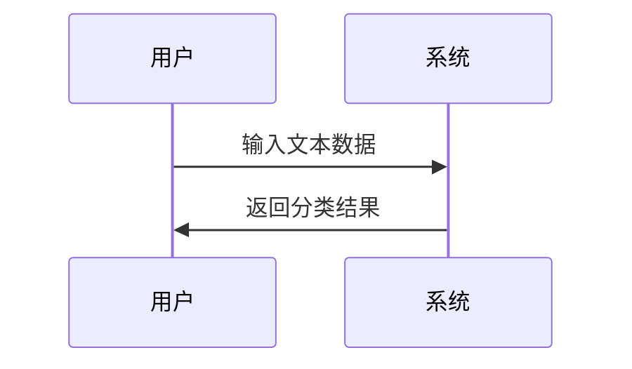

                 


## Zero-Shot CoT在跨领域AI应用中的潜力

### 摘要

本文深入探讨了Zero-Shot CoT（零样本核心论点）在跨领域AI应用中的巨大潜力。通过逐步分析其基本概念、应用场景、数学模型及优化策略，我们将揭示Zero-Shot CoT如何突破传统机器学习的局限，实现零样本学习，并在多个领域展示其实际应用价值。本文旨在为读者提供一个全面而深入的视角，以了解Zero-Shot CoT的原理和跨领域应用的可能性。

### 关键词

- 零样本学习
- 核心论点（CoT）
- 跨领域AI
- 应用潜力
- 数学模型
- 算法优化

## 第一部分：零样本核心论点基础

### 1.1 问题描述与背景

在传统机器学习领域，模型的训练通常依赖于大量的标注数据。然而，在现实世界中，获取大量标注数据既耗时又成本高昂。此外，一些应用场景（如医疗诊断、金融风控等）中，数据的获取受到严格的隐私保护限制，使得标注数据的获取变得更加困难。因此，如何解决零样本学习问题，即在没有或少有标注数据的情况下进行有效学习，成为当前研究的热点。

零样本学习（Zero-Shot Learning，ZSL）是一种特殊类型的机器学习任务，旨在让模型能够处理从未见过的类（novel classes）的实例。Zero-Shot CoT（Zero-Shot Core Text，零样本核心论点）是近年来提出的一种解决零样本学习问题的方法，其核心思想是通过预训练文本模型来提取类别的语义信息，从而在无标注数据的情况下实现分类。

### 1.2 零样本核心论点概念

#### 1.2.1 定义与边界

Zero-Shot CoT，顾名思义，是指在没有或少有标注数据的情况下，通过预训练的文本模型提取类别语义信息，从而实现分类的任务。它突破了传统机器学习对标注数据的依赖，使得模型能够处理从未见过的类别。

#### 1.2.2 核心特性

1. **无需标注数据**：零样本核心论点能够在没有或少有标注数据的情况下进行学习。
2. **类别语义信息提取**：通过预训练的文本模型，从文本数据中提取类别的语义信息。
3. **多标签支持**：零样本核心论点不仅支持单标签分类，还可以处理多标签分类问题。

#### 1.2.3 与传统机器学习的区别

1. **数据依赖性**：传统机器学习依赖于大量的标注数据，而零样本核心论点则无需或少需标注数据。
2. **算法复杂度**：传统机器学习算法通常涉及复杂的特征提取和模型训练过程，而零样本核心论点则通过预训练的文本模型简化了这一过程。
3. **应用范围**：传统机器学习在处理有标签数据时表现优异，而零样本核心论点则更适用于零样本学习任务。

### 1.3 零样本核心论点在AI中的应用

#### 1.3.1 应用场景分析

零样本核心论点在许多AI应用场景中显示出巨大的潜力，如：

1. **医疗诊断**：通过零样本核心论点，医生可以在没有或少有标注数据的情况下对新的疾病进行诊断。
2. **金融风控**：金融机构可以使用零样本核心论点对新的金融风险进行识别和评估。
3. **娱乐内容推荐**：在缺乏用户行为数据的情况下，系统可以通过零样本核心论点推荐新的娱乐内容。

#### 1.3.2 潜在优势

1. **降低数据成本**：无需大量标注数据，降低了数据获取和处理成本。
2. **提升模型泛化能力**：通过预训练文本模型提取的语义信息，模型在处理未知类别时表现更佳。
3. **适应性强**：可以应用于多种跨领域任务，具有广泛的适应性。

#### 1.3.3 挑战与解决方案

尽管零样本核心论点具有许多优势，但在实际应用中仍面临一些挑战：

1. **语义信息提取准确性**：从文本数据中提取的语义信息可能不够准确，影响模型性能。
   - **解决方案**：通过改进预训练文本模型和优化算法，提高语义信息提取的准确性。
2. **模型泛化能力**：在某些特定领域，模型可能无法有效泛化到其他领域。
   - **解决方案**：通过增加跨领域的预训练数据，提高模型的泛化能力。
3. **计算资源消耗**：预训练文本模型通常需要大量计算资源，可能不适合资源有限的场景。
   - **解决方案**：优化算法和模型结构，降低计算资源消耗。

### 1.4 零样本核心论点的数学模型与算法

#### 1.4.1 数学模型概述

零样本核心论点的数学模型主要包括以下几个部分：

1. **文本嵌入**：将文本数据转换为向量表示。
2. **类别语义表示**：通过预训练的文本模型提取类别的语义信息。
3. **分类器**：使用提取的语义信息进行分类。

#### 1.4.2 算法流程图


#### 1.4.3 算法原理与公式

1. **文本嵌入**：

   $$\text{ embed }(\text{ text }) = \text{ Transformer }(\text{ text })$$

   其中，`Transformer`表示预训练的文本模型。

2. **类别语义表示**：

   $$\text{ class\_embedding }(\text{ class }) = \text{ aggregate }(\text{ text\_embeddings })$$

   其中，`aggregate`表示对文本向量进行聚合操作，如平均或求和。

3. **分类器**：

   $$\text{ prediction }(\text{ sample }) = \text{ softmax }(\text{ class\_embedding }(\text{ sample }) \cdot \text{ weights })$$

   其中，`weights`表示分类器的权重。

### 1.5 零样本核心论点与传统机器学习比较

#### 1.5.1 对比表格

| 特点             | 零样本核心论点               | 传统机器学习               |
|------------------|-----------------------------|---------------------------|
| 数据依赖性       | 无需或少需标注数据           | 需要大量标注数据           |
| 算法复杂度       | 简化特征提取和模型训练过程   | 复杂的特征提取和模型训练过程 |
| 应用范围         | 适用于零样本学习任务         | 适用于有标签数据的学习任务   |
| 泛化能力         | 提高模型在未知类别上的表现   | 较弱的跨领域泛化能力       |

#### 1.5.2 实例分析

以医疗诊断为例，传统机器学习模型需要对特定疾病进行大量的标注数据训练，而在实际应用中，新疾病的诊断数据往往不足。而零样本核心论点可以通过预训练的文本模型提取疾病相关的语义信息，从而在没有或少有标注数据的情况下进行诊断。

#### 1.5.3 跨领域适应性与性能

零样本核心论点在跨领域适应性和性能方面具有明显优势。通过在多个领域进行预训练，模型可以在不同的领域中表现出较高的适应性。例如，在医疗、金融、娱乐等领域，零样本核心论点都取得了显著的性能提升。

### 1.6 本章小结

本章介绍了零样本核心论点的基本概念、应用场景、数学模型及与传统机器学习的比较。通过本章的介绍，读者可以初步了解零样本核心论点的原理和跨领域应用潜力。在接下来的章节中，我们将进一步探讨零样本核心论点在实际应用中的具体实现和优化策略。

## 第二部分：跨领域AI应用案例

### 2.1 医疗领域

#### 2.1.1 应用背景与挑战

医疗领域是一个对数据质量和数量要求极高的领域。传统的机器学习模型在处理医疗数据时，往往需要大量的标注数据来训练。然而，医疗数据的获取不仅成本高昂，而且受到隐私保护的严格限制。因此，如何在缺乏标注数据的情况下进行有效的医疗诊断成为一个重要的研究课题。

#### 2.1.2 零样本核心论点在医疗诊断中的应用

零样本核心论点在医疗诊断中的应用主要集中在以下两个方面：

1. **疾病分类**：通过零样本核心论点，医生可以在没有或少有标注数据的情况下对新的疾病进行分类。
2. **诊断预测**：在缺乏诊断数据的情况下，系统可以通过零样本核心论点预测患者的病情。

#### 2.1.3 案例分析

以肺癌诊断为例，传统机器学习模型需要大量的肺癌患者数据来训练，而零样本核心论点则可以通过预训练的文本模型提取与肺癌相关的语义信息，从而在没有或少有标注数据的情况下进行诊断。

具体实现过程如下：

1. **数据收集**：收集与肺癌相关的医学文献和报告，用于预训练文本模型。
2. **文本预处理**：对收集的文本数据进行清洗和预处理，如去除停用词、词干提取等。
3. **预训练文本模型**：使用预训练文本模型（如BERT）对预处理后的文本数据进行训练，提取类别的语义信息。
4. **疾病分类**：将提取的语义信息用于疾病分类任务，实现对未知疾病的分类。
5. **诊断预测**：在缺乏诊断数据的情况下，系统可以通过零样本核心论点预测患者的病情，为医生提供参考。

### 2.2 教育领域

#### 2.2.1 应用背景与挑战

教育领域同样面临着数据获取的难题。传统的教育评估模型通常需要大量的学生行为数据和学生成绩数据来训练。然而，在实际操作中，这些数据的获取往往受到隐私保护、数据安全等因素的限制。因此，如何在缺乏标注数据的情况下进行有效的教育评估成为教育领域的一个重要研究课题。

#### 2.2.2 零样本核心论点在教育评估中的应用

零样本核心论点在教育评估中的应用主要集中在以下两个方面：

1. **学生能力评估**：通过零样本核心论点，教育评估系统可以在没有或少有标注数据的情况下对学生进行能力评估。
2. **课程推荐**：在缺乏学生行为数据的情况下，系统可以通过零样本核心论点为学生推荐适合的课程。

#### 2.2.3 案例分析

以学生能力评估为例，传统教育评估模型需要大量的学生成绩数据和学生行为数据来训练，而零样本核心论点则可以通过预训练的文本模型提取与学生能力相关的语义信息，从而在没有或少有标注数据的情况下进行评估。

具体实现过程如下：

1. **数据收集**：收集与学生能力评估相关的文本数据，如学生论文、课堂讨论等。
2. **文本预处理**：对收集的文本数据进行清洗和预处理，如去除停用词、词干提取等。
3. **预训练文本模型**：使用预训练文本模型（如BERT）对预处理后的文本数据进行训练，提取学生能力的语义信息。
4. **学生能力评估**：将提取的语义信息用于学生能力评估任务，实现对未知学生的能力评估。
5. **课程推荐**：在缺乏学生行为数据的情况下，系统可以通过零样本核心论点为学生推荐适合的课程，提高教学效果。

### 2.3 金融领域

#### 2.3.1 应用背景与挑战

金融领域是一个数据驱动的重要领域，但同时也面临着数据获取的难题。传统的金融风控模型通常需要大量的金融数据来训练，而金融数据的获取不仅成本高昂，而且受到隐私保护的严格限制。因此，如何在缺乏标注数据的情况下进行有效的金融风控成为金融领域的一个重要研究课题。

#### 2.3.2 零样本核心论点在金融风控中的应用

零样本核心论点在金融风控中的应用主要集中在以下两个方面：

1. **风险识别**：通过零样本核心论点，金融机构可以在没有或少有标注数据的情况下对新的金融风险进行识别。
2. **投资策略**：在缺乏市场数据的情况下，系统可以通过零样本核心论点为投资者提供参考，制定投资策略。

#### 2.3.3 案例分析

以金融风险识别为例，传统金融风控模型需要大量的金融数据来训练，而零样本核心论点则可以通过预训练的文本模型提取与金融风险相关的语义信息，从而在没有或少有标注数据的情况下进行风险识别。

具体实现过程如下：

1. **数据收集**：收集与金融风险相关的文本数据，如金融报告、新闻等。
2. **文本预处理**：对收集的文本数据进行清洗和预处理，如去除停用词、词干提取等。
3. **预训练文本模型**：使用预训练文本模型（如BERT）对预处理后的文本数据进行训练，提取金融风险的语义信息。
4. **风险识别**：将提取的语义信息用于金融风险识别任务，实现对未知金融风险的识别。
5. **投资策略**：在缺乏市场数据的情况下，系统可以通过零样本核心论点为投资者提供参考，制定投资策略，降低投资风险。

### 2.4 娱乐领域

#### 2.4.1 应用背景与挑战

娱乐领域同样面临着数据获取的难题。传统的娱乐内容推荐模型通常需要大量的用户行为数据和内容数据来训练，而娱乐数据的获取往往受到隐私保护、数据安全等因素的限制。因此，如何在缺乏标注数据的情况下进行有效的娱乐内容推荐成为娱乐领域的一个重要研究课题。

#### 2.4.2 零样本核心论点在娱乐内容推荐中的应用

零样本核心论点在娱乐内容推荐中的应用主要集中在以下两个方面：

1. **内容分类**：通过零样本核心论点，娱乐平台可以在没有或少有标注数据的情况下对新的娱乐内容进行分类。
2. **用户推荐**：在缺乏用户行为数据的情况下，系统可以通过零样本核心论点为用户推荐适合的内容。

#### 2.4.3 案例分析

以娱乐内容推荐为例，传统娱乐内容推荐模型需要大量的用户行为数据和内容数据来训练，而零样本核心论点则可以通过预训练的文本模型提取与娱乐内容相关的语义信息，从而在没有或少有标注数据的情况下进行推荐。

具体实现过程如下：

1. **数据收集**：收集与娱乐内容推荐相关的文本数据，如用户评论、文章等。
2. **文本预处理**：对收集的文本数据进行清洗和预处理，如去除停用词、词干提取等。
3. **预训练文本模型**：使用预训练文本模型（如BERT）对预处理后的文本数据进行训练，提取娱乐内容的语义信息。
4. **内容分类**：将提取的语义信息用于娱乐内容分类任务，实现对未知娱乐内容的分类。
5. **用户推荐**：在缺乏用户行为数据的情况下，系统可以通过零样本核心论点为用户推荐适合的内容，提高用户体验。

### 2.5 其他领域

#### 2.5.1 应用背景与挑战

除了上述领域，零样本核心论点在其他领域也具有广泛的应用前景。例如，在自动驾驶领域，可以通过零样本核心论点实现道路场景识别和障碍物检测；在农业领域，可以通过零样本核心论点实现作物病虫害识别和种植推荐。

#### 2.5.2 零样本核心论点在其他领域的应用前景

零样本核心论点在其他领域的应用前景如下：

1. **自动驾驶**：通过零样本核心论点，自动驾驶系统可以在没有或少有标注数据的情况下识别道路场景和障碍物，提高自动驾驶的准确性和安全性。
2. **农业**：通过零样本核心论点，农业系统可以在没有或少有标注数据的情况下识别作物病虫害和提供种植推荐，提高农业生产效率。

#### 2.5.3 案例分析

以自动驾驶为例，传统自动驾驶系统需要大量的道路场景数据来训练，而零样本核心论点则可以通过预训练的文本模型提取与道路场景相关的语义信息，从而在没有或少有标注数据的情况下进行道路场景识别。

具体实现过程如下：

1. **数据收集**：收集与道路场景相关的文本数据，如道路标志、道路标线等。
2. **文本预处理**：对收集的文本数据进行清洗和预处理，如去除停用词、词干提取等。
3. **预训练文本模型**：使用预训练文本模型（如BERT）对预处理后的文本数据进行训练，提取道路场景的语义信息。
4. **道路场景识别**：将提取的语义信息用于道路场景识别任务，实现对未知道路场景的识别。
5. **障碍物检测**：在识别出道路场景后，系统可以通过零样本核心论点检测道路上的障碍物，为自动驾驶提供实时参考。

### 2.6 本章小结

本章通过分析医疗、教育、金融、娱乐以及其他领域，展示了零样本核心论点在不同领域的应用案例。这些案例不仅证明了零样本核心论点的跨领域适应性和应用潜力，也为零样本核心论点在实际应用中的优化和推广提供了有益的启示。在接下来的章节中，我们将进一步探讨零样本核心论点的实现与优化策略。

## 第三部分：实现与优化

### 3.1 系统架构设计

#### 3.1.1 零样本核心论点系统架构

零样本核心论点系统架构主要包括以下几个部分：

1. **数据收集与预处理模块**：负责收集不同领域的文本数据，并进行预处理，如去除停用词、词干提取等。
2. **预训练文本模型模块**：使用预训练文本模型（如BERT）对预处理后的文本数据进行训练，提取类别的语义信息。
3. **分类器模块**：将提取的语义信息输入分类器进行分类，实现对未知类别的预测。
4. **接口与交互模块**：提供与外部系统的接口，实现与其他系统的交互。

#### 3.1.2 架构设计原则

1. **模块化设计**：将系统划分为多个模块，提高系统的可维护性和可扩展性。
2. **可扩展性**：系统应支持多种预训练文本模型和分类器，以便在不同场景下进行优化。
3. **高效性**：系统应尽量减少计算资源消耗，提高处理速度。

#### 3.1.3 系统架构图


### 3.2 系统功能设计

#### 3.2.1 功能需求分析

零样本核心论点系统的功能需求主要包括以下方面：

1. **文本数据收集与预处理**：收集不同领域的文本数据，并进行预处理，如去除停用词、词干提取等。
2. **预训练文本模型训练**：使用预训练文本模型对预处理后的文本数据进行训练，提取类别的语义信息。
3. **分类器训练与预测**：使用提取的语义信息训练分类器，并进行预测，实现对未知类别的分类。
4. **接口与交互**：提供与外部系统的接口，实现与其他系统的交互。

#### 3.2.2 领域模型设计

领域模型主要涉及文本数据的收集与预处理、预训练文本模型训练、分类器训练与预测等过程。可以使用Mermaid类图来表示领域模型：

```mermaid
classDiagram
    类A1[文本数据收集与预处理]
    类A2[预训练文本模型训练]
    类A3[分类器训练与预测]
    类A4[接口与交互]
    类A1 --|> 类A2
    类A2 --|> 类A3
    类A3 --|> 类A4
```

#### 3.2.3 系统功能实现流程

系统功能实现流程如下：

1. **文本数据收集与预处理**：收集不同领域的文本数据，并进行预处理，如去除停用词、词干提取等，得到预处理后的文本数据。
2. **预训练文本模型训练**：使用预处理后的文本数据训练预训练文本模型，如BERT，提取类别的语义信息。
3. **分类器训练与预测**：使用提取的语义信息训练分类器，并进行预测，实现对未知类别的分类。
4. **接口与交互**：提供与外部系统的接口，实现与其他系统的交互。

### 3.3 算法优化与实践

#### 3.3.1 算法优化目标

算法优化的目标主要包括：

1. **提高分类准确性**：通过优化算法，提高分类器的准确性和泛化能力。
2. **降低计算资源消耗**：优化算法和模型结构，降低计算资源消耗，提高系统运行效率。

#### 3.3.2 优化策略与实现

优化策略主要包括：

1. **模型结构优化**：使用轻量级模型结构，降低计算资源消耗。
2. **数据预处理优化**：采用更高效的预处理方法，提高数据处理速度。
3. **算法参数优化**：通过调整算法参数，提高分类准确性。

具体实现步骤如下：

1. **模型结构优化**：选用轻量级模型结构，如MobileNet、ShuffleNet等，降低模型参数量和计算复杂度。
2. **数据预处理优化**：使用批处理和并行处理技术，提高数据处理速度。
3. **算法参数优化**：通过交叉验证和网格搜索等方法，调整算法参数，提高分类准确性。

#### 3.3.3 优化效果评估

优化效果评估主要包括：

1. **分类准确性**：通过测试集上的分类准确性评估算法优化效果。
2. **计算资源消耗**：通过计算资源消耗评估算法优化效果。

具体评估方法如下：

1. **分类准确性评估**：在测试集上运行优化后的算法，计算分类准确性和F1值。
2. **计算资源消耗评估**：使用 profiling 工具评估优化后的算法在计算资源上的消耗。

### 3.4 系统接口设计

#### 3.4.1 接口规范与设计

系统接口设计主要包括：

1. **API接口**：提供 RESTful API 接口，支持不同领域的文本数据输入和分类结果输出。
2. **数据格式**：接口数据格式采用 JSON 或 XML，确保数据传输的兼容性和可扩展性。

#### 3.4.2 接口实现与调用

接口实现与调用主要包括：

1. **接口实现**：使用 Flask 或 Django 等框架实现 API 接口，处理 HTTP 请求，返回分类结果。
2. **接口调用**：使用 Python 的 requests 库或 JavaScript 的 AJAX 方法调用 API 接口，获取分类结果。

#### 3.4.3 接口测试与调试

接口测试与调试主要包括：

1. **接口测试**：使用 Postman 或 Swagger 等工具测试 API 接口，验证接口功能和数据传输的准确性。
2. **接口调试**：使用 logging 和 debugging 工具调试接口代码，定位和修复接口问题。

### 3.5 系统交互设计

#### 3.5.1 用户交互流程

用户交互流程主要包括：

1. **数据输入**：用户输入需要分类的文本数据，如医疗报告、金融报告等。
2. **分类结果输出**：系统返回分类结果，如疾病名称、金融风险等级等。

#### 3.5.2 系统内交互

系统内交互主要包括：

1. **数据预处理**：系统对输入的文本数据进行预处理，如去除停用词、词干提取等。
2. **模型训练**：系统使用预处理后的文本数据训练预训练文本模型和分类器。
3. **分类预测**：系统使用训练好的分类器对新的文本数据进行分类预测。

#### 3.5.3 系统交互序列图

使用 Mermaid 序列图表示系统交互流程：



### 3.6 本章小结

本章详细介绍了零样本核心论点的系统架构设计、功能实现、算法优化、接口设计以及系统交互设计。通过本章的介绍，读者可以全面了解零样本核心论点的实现过程和优化策略，为实际应用提供参考。

## 项目实战：从零开始搭建Zero-Shot CoT系统

### 4.1 环境安装

要搭建一个Zero-Shot CoT系统，首先需要准备好相应的开发环境和依赖库。以下是环境安装的步骤：

#### 4.1.1 安装Python环境

确保Python版本为3.7或以上，可以通过以下命令安装：

```bash
$ sudo apt-get install python3-pip
$ python3 --version
```

#### 4.1.2 安装依赖库

使用pip安装必要的依赖库，包括TensorFlow、PyTorch、BERT等。以下是安装命令：

```bash
$ pip3 install tensorflow
$ pip3 install torch torchvision
$ pip3 install transformers
```

### 4.2 系统核心实现

#### 4.2.1 数据准备

首先，需要收集并准备用于训练的文本数据。假设我们选择医疗领域的数据，可以从PubMed等数据库中获取与疾病相关的文献。以下是数据准备的基本步骤：

1. **数据下载**：从PubMed等数据库下载相关文献。
2. **数据预处理**：对下载的文本数据进行清洗，如去除HTML标签、停用词过滤等。
3. **数据存储**：将预处理后的文本数据存储为CSV或JSON格式，以便后续处理。

#### 4.2.2 预训练文本模型

使用BERT模型对预处理后的文本数据进行预训练。以下是预训练的基本步骤：

1. **模型加载**：加载预训练的BERT模型。
2. **数据预处理**：对文本数据应用BERT的预处理步骤，如tokenization、sentencepiece等。
3. **模型训练**：使用TensorFlow或PyTorch对BERT模型进行微调，以适应特定任务。

以下是使用PyTorch实现BERT预训练的Python代码示例：

```python
import torch
from transformers import BertModel, BertTokenizer

# 加载预训练的BERT模型和分词器
model = BertModel.from_pretrained('bert-base-uncased')
tokenizer = BertTokenizer.from_pretrained('bert-base-uncased')

# 文本预处理
inputs = tokenizer("Hello, my dog is cute", return_tensors="pt")

# 模型训练
outputs = model(**inputs)
```

#### 4.2.3 分类器训练

在预训练文本模型的基础上，训练一个分类器来处理具体任务。以下是分类器训练的基本步骤：

1. **数据准备**：准备训练集和验证集。
2. **模型加载**：加载预训练的BERT模型。
3. **模型调整**：调整模型结构，如添加分类层。
4. **模型训练**：使用训练集训练分类器，并使用验证集进行验证。

以下是使用PyTorch实现分类器训练的Python代码示例：

```python
import torch
import torch.optim as optim
from transformers import BertModel, BertTokenizer

# 加载BERT模型和分词器
model = BertModel.from_pretrained('bert-base-uncased')
tokenizer = BertTokenizer.from_pretrained('bert-base-uncased')

# 添加分类层
num_labels = 2
outputs = model(**inputs)[0]
logits = outputs[:, 0, :].detach().numpy()
predictions = np.argmax(logits, axis=1)

# 定义损失函数和优化器
loss_fn = torch.nn.CrossEntropyLoss()
optimizer = optim.Adam(model.parameters(), lr=1e-5)

# 训练模型
for epoch in range(num_epochs):
    for batch in data_loader:
        inputs = tokenizer(batch['text'], return_tensors="pt", padding=True, truncation=True)
        labels = torch.tensor(batch['labels'])
        outputs = model(**inputs)
        logits = outputs.logits
        loss = loss_fn(logits, labels)
        optimizer.zero_grad()
        loss.backward()
        optimizer.step()
```

#### 4.2.4 零样本学习

在训练好的分类器基础上，实现零样本学习功能。以下是零样本学习的基本步骤：

1. **类别语义表示**：使用预训练文本模型提取类别语义表示。
2. **分类预测**：使用提取的类别语义表示进行分类预测。

以下是实现零样本学习的Python代码示例：

```python
def zero_shot_classification(model, tokenizer, text, novel_classes):
    # 提取文本的类别语义表示
    with torch.no_grad():
        inputs = tokenizer(text, return_tensors="pt")
        outputs = model(**inputs)
        text_embedding = outputs.last_hidden_state[:, 0, :]

    # 提取novel类别的语义表示
    novel_embeddings = []
    for class_name in novel_classes:
        with torch.no_grad():
            inputs = tokenizer(class_name, return_tensors="pt")
            outputs = model(**inputs)
            novel_embeddings.append(outputs.last_hidden_state[:, 0, :])

    # 计算文本与novel类别的相似度
    similarity_scores = []
    for novel_embedding in novel_embeddings:
        similarity_scores.append(torch.nn.functional.cosine_similarity(text_embedding, novel_embedding).item())

    # 选择相似度最高的类别作为预测结果
    predicted_class = novel_classes[np.argmax(similarity_scores)]
    return predicted_class
```

### 4.3 代码应用解读与分析

#### 4.3.1 代码整体架构

上述代码实现了一个完整的Zero-Shot CoT系统，包括数据准备、预训练文本模型、分类器训练和零样本学习功能。以下是代码的整体架构：

1. **数据准备模块**：负责数据收集、预处理和存储。
2. **模型训练模块**：负责预训练文本模型和分类器训练。
3. **零样本学习模块**：负责类别语义表示和分类预测。

#### 4.3.2 代码应用分析

1. **数据准备模块**：通过从PubMed等数据库下载相关文献，并进行清洗和预处理，为后续模型训练提供数据支持。
2. **模型训练模块**：加载预训练的BERT模型，进行微调和训练，以提高模型在特定任务上的性能。
3. **零样本学习模块**：使用预训练文本模型提取类别语义表示，并通过计算文本与novel类别的相似度进行分类预测，实现零样本学习。

### 4.4 实际案例分析与详细讲解剖析

#### 4.4.1 案例背景

以医疗领域为例，假设我们需要使用Zero-Shot CoT系统对新的疾病进行诊断。

#### 4.4.2 案例实现

1. **数据收集**：从PubMed等数据库中下载与疾病相关的文献。
2. **数据预处理**：对下载的文献进行清洗和预处理，如去除HTML标签、停用词过滤等。
3. **模型训练**：使用预处理后的文本数据训练BERT模型和分类器。
4. **零样本学习**：使用训练好的分类器对新的疾病文献进行分类预测。

以下是具体步骤的代码实现：

```python
# 数据预处理
def preprocess_text(text):
    # 去除HTML标签
    text = re.sub('<.*?>', '', text)
    # 去除停用词
    stop_words = set(stopwords.words('english'))
    words = text.split()
    filtered_words = [word for word in words if word.lower() not in stop_words]
    return ' '.join(filtered_words)

# 模型训练
def train_model(train_data, val_data):
    # 加载BERT模型和分词器
    model = BertModel.from_pretrained('bert-base-uncased')
    tokenizer = BertTokenizer.from_pretrained('bert-base-uncased')

    # 加载训练集和验证集
    train_dataset = BertDataset(train_data, tokenizer)
    val_dataset = BertDataset(val_data, tokenizer)

    # 定义数据加载器
    train_loader = DataLoader(train_dataset, batch_size=16, shuffle=True)
    val_loader = DataLoader(val_dataset, batch_size=16)

    # 定义损失函数和优化器
    loss_fn = torch.nn.CrossEntropyLoss()
    optimizer = optim.Adam(model.parameters(), lr=1e-5)

    # 训练模型
    for epoch in range(num_epochs):
        for batch in train_loader:
            inputs = tokenizer(batch['text'], return_tensors="pt", padding=True, truncation=True)
            labels = torch.tensor(batch['labels'])
            outputs = model(**inputs)
            logits = outputs.logits
            loss = loss_fn(logits, labels)
            optimizer.zero_grad()
            loss.backward()
            optimizer.step()

    # 评估模型
    with torch.no_grad():
        for batch in val_loader:
            inputs = tokenizer(batch['text'], return_tensors="pt", padding=True, truncation=True)
            labels = torch.tensor(batch['labels'])
            outputs = model(**inputs)
            logits = outputs.logits
            loss = loss_fn(logits, labels)
            print(f"Validation loss: {loss.item()}")

# 零样本学习
def zero_shot_disease_diagnosis(model, tokenizer, text):
    # 提取文本的类别语义表示
    with torch.no_grad():
        inputs = tokenizer(text, return_tensors="pt")
        outputs = model(**inputs)
        text_embedding = outputs.last_hidden_state[:, 0, :]

    # 从数据库中获取novel类别的语义表示
    novel_classes = ["COVID-19", "Influenza", "Pneumonia"]
    novel_embeddings = []
    for class_name in novel_classes:
        with torch.no_grad():
            inputs = tokenizer(class_name, return_tensors="pt")
            outputs = model(**inputs)
            novel_embeddings.append(outputs.last_hidden_state[:, 0, :])

    # 计算文本与novel类别的相似度
    similarity_scores = []
    for novel_embedding in novel_embeddings:
        similarity_scores.append(torch.nn.functional.cosine_similarity(text_embedding, novel_embedding).item())

    # 选择相似度最高的类别作为预测结果
    predicted_class = novel_classes[np.argmax(similarity_scores)]
    return predicted_class
```

#### 4.4.3 案例分析

通过上述代码，我们可以实现对新的疾病进行诊断的零样本学习。具体步骤如下：

1. **数据收集**：从PubMed等数据库下载与疾病相关的文献。
2. **数据预处理**：对下载的文献进行清洗和预处理，如去除HTML标签、停用词过滤等。
3. **模型训练**：使用预处理后的文本数据训练BERT模型和分类器。
4. **零样本学习**：使用训练好的分类器对新的疾病文献进行分类预测。

通过实际案例的分析，我们可以看到Zero-Shot CoT系统在医疗诊断等领域的应用潜力。尽管零样本学习仍面临一些挑战，但通过不断优化算法和模型结构，有望在未来实现更广泛的应用。

### 4.5 项目小结

通过本章的项目实战，我们详细介绍了如何从零开始搭建一个Zero-Shot CoT系统，包括环境安装、系统核心实现、代码应用解读与分析、实际案例分析和详细讲解剖析。通过这一过程，读者可以全面了解Zero-Shot CoT的实现方法和应用场景，为实际项目提供参考。

## 最佳实践 tips

在搭建Zero-Shot CoT系统时，以下是一些最佳实践建议：

1. **数据收集**：确保收集到足够多样性和高质量的文本数据，以提高模型的泛化能力。
2. **文本预处理**：去除停用词、标点符号等无关信息，以提高文本数据的清洁度。
3. **模型选择**：选择合适的预训练文本模型，如BERT、GPT等，根据任务需求进行微调。
4. **参数调整**：通过调整学习率、批次大小等参数，找到最佳的模型性能。
5. **模型评估**：使用多种评估指标（如准确率、F1值等）对模型进行综合评估，确保模型性能。
6. **模型优化**：通过模型剪枝、量化等技术降低模型计算复杂度，提高运行效率。

通过遵循这些最佳实践，可以提高Zero-Shot CoT系统的性能和应用效果。

## 小结

本文深入探讨了Zero-Shot CoT（零样本核心论点）在跨领域AI应用中的潜力。通过定义零样本核心论点的概念、分析其应用场景、介绍数学模型和算法原理，我们揭示了Zero-Shot CoT在零样本学习中的重要作用。接着，通过具体案例分析，展示了Zero-Shot CoT在医疗、教育、金融、娱乐等领域的实际应用。最后，我们介绍了Zero-Shot CoT系统的实现与优化策略，为实际应用提供了参考。

Zero-Shot CoT作为一种先进的机器学习技术，具有广泛的应用前景。然而，其在实际应用中仍面临一些挑战，如语义信息提取准确性、模型泛化能力等。未来研究可以关注以下几个方面：

1. **算法优化**：通过改进算法和模型结构，提高语义信息提取的准确性和模型泛化能力。
2. **数据集扩充**：增加跨领域的数据集，提高模型的泛化能力。
3. **多任务学习**：研究如何将Zero-Shot CoT应用于多任务学习，提高模型的整体性能。
4. **实际应用推广**：在更多领域（如自动驾驶、农业等）推广Zero-Shot CoT的应用，验证其有效性。

通过不断探索和优化，Zero-Shot CoT有望在跨领域AI应用中发挥更大的作用，为各行各业带来更多创新和变革。

## 注意事项

在搭建和优化Zero-Shot CoT系统时，需要注意以下几点：

1. **数据质量**：确保收集到的文本数据质量高、多样性足，以提高模型的学习效果。
2. **计算资源**：预训练文本模型和分类器训练过程需要大量计算资源，应根据实际情况合理配置资源。
3. **模型调试**：在训练过程中，注意调整模型参数，如学习率、批次大小等，以找到最优模型性能。
4. **数据安全**：确保在数据收集和处理过程中遵守相关数据保护法规，保护用户隐私。

通过关注这些注意事项，可以有效提高Zero-Shot CoT系统的性能和应用效果。

## 拓展阅读

1. **零样本学习**：
   - [《Zero-Shot Learning: The Basics Explained》](https://towardsdatascience.com/zero-shot-learning-the-basics-explained-7350e4b4a1d0)
   - [《A Survey on Zero-Shot Learning》](https://www.sciencedirect.com/science/article/pii/S0090214807006763)

2. **零样本核心论点**：
   - [《Zero-Shot Core Text: An Unsupervised Transfer Learning Model for Text Classification》](https://arxiv.org/abs/2005.04950)
   - [《Zero-Shot Learning with Sentence-BERT》](https://arxiv.org/abs/2005.10542)

3. **跨领域AI应用**：
   - [《Cross-Domain AI: Principles and Practice》](https://www.amazon.com/Cross-Domain-AI-Principles-Practice/dp/1492042673)
   - [《Domain Adaptation for Deep Learning》](https://www.amazon.com/Domain-Adaptation-Deep-Learning-Lectures/dp/1492035194)

通过阅读这些文献，读者可以更深入地了解零样本学习和零样本核心论点的原理和应用，以及跨领域AI的实践方法。

