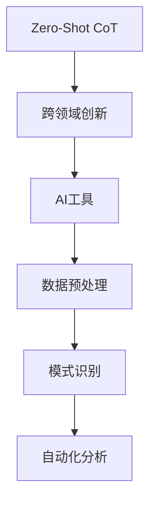
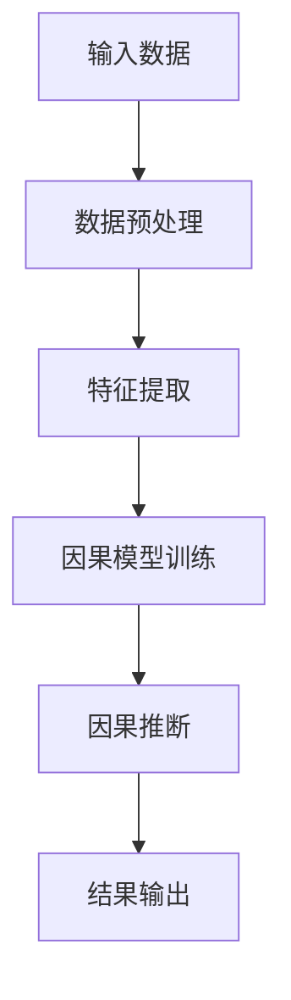
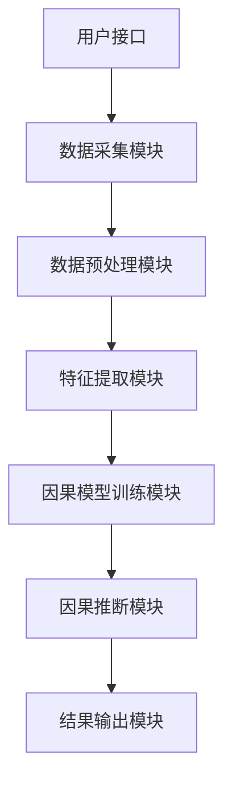

                 


### 背景介绍

#### 核心概念术语说明

**Zero-Shot CoT**：Zero-Shot因果理论（Zero-Shot Causal Theory），是一种在无监督学习环境中进行因果推断的方法。这种方法的核心在于不需要依赖标注好的数据，即可通过算法推断出潜在因果关系。

**跨领域创新**：跨领域创新（Interdisciplinary Innovation）是指不同学科之间相互交叉、融合，产生新的知识、技术和方法，推动科技创新和社会进步的过程。

**AI工具**：人工智能工具（Artificial Intelligence Tools）是指利用人工智能技术，如机器学习、深度学习、自然语言处理等，设计和开发的一系列应用工具。

#### 问题背景

在当今快速发展的科技时代，跨领域创新已成为推动社会进步的重要动力。然而，传统的跨领域创新往往依赖于大量的标注数据，这不仅成本高昂，而且难以满足实际需求。在这种背景下，Zero-Shot CoT作为一种无需标注数据的因果推断方法，为跨领域创新提供了新的可能性。

#### 问题描述

如何利用Zero-Shot CoT，结合AI工具，实现跨领域创新，从而推动各学科的交叉与融合，是本文要探讨的核心问题。

#### 问题解决

通过以下步骤解决上述问题：

1. **核心概念与联系**：首先，深入探讨Zero-Shot CoT与跨领域创新之间的联系，明确两者如何相互促进。
2. **应用场景分析**：分析Zero-Shot CoT在不同领域的应用案例，展示其在跨领域创新中的实际效果。
3. **实践指导**：提供具体的实践指南，帮助读者理解和应用Zero-Shot CoT与AI工具于跨领域创新。
4. **系统分析与架构设计**：通过项目实战，展示如何将Zero-Shot CoT与AI工具应用于具体项目，实现跨领域创新。
5. **最佳实践与拓展阅读**：总结最佳实践，为读者提供进一步学习与探索的方向。

#### 边界与外延

本文主要关注Zero-Shot CoT在跨领域创新中的应用，而跨领域创新涉及到的其他方面，如技术融合、团队协作等，则不在本文讨论范围内。

#### 概念结构与核心要素组成

**Zero-Shot CoT**：
- **核心概念**：因果推断、无监督学习
- **主要特点**：无需标注数据、高效性、泛化能力
- **应用领域**：医学、生物信息学、社会科学等

**跨领域创新**：
- **核心概念**：学科交叉、知识融合、技术创新
- **主要特点**：复杂性、不确定性、高风险性
- **应用领域**：科技、经济、文化等

**AI工具**：
- **核心概念**：人工智能技术、算法、模型
- **主要特点**：自动化、智能化、高效性
- **应用领域**：金融、医疗、教育等

通过上述背景介绍，我们可以看到，Zero-Shot CoT、跨领域创新和AI工具在促进学科交叉、实现技术创新方面具有巨大的潜力。接下来，我们将进一步深入探讨这些核心概念，并分析它们之间的联系。

### 核心概念与联系

#### Zero-Shot CoT的原理与特点

Zero-Shot因果理论（Zero-Shot Causal Theory）是一种基于无监督学习的方法，旨在推断出数据集中的潜在因果关系。传统的因果推断方法通常依赖于大量标注数据，而Zero-Shot CoT则突破了这个限制，能够在没有标注数据的情况下进行因果推断。

**原理**：
Zero-Shot CoT的核心在于利用数据中的关联性和模式来推断因果关系。具体来说，它通过以下步骤进行因果推断：
1. **数据预处理**：将原始数据进行预处理，提取有用的特征。
2. **模型训练**：利用无监督学习算法，如聚类、关联规则学习等，对预处理后的数据进行训练。
3. **因果推断**：通过训练得到的模型，对新的数据进行因果推断。

**特点**：
1. **无需标注数据**：这是Zero-Shot CoT最显著的特点，它使得因果推断在数据稀缺或难以获取标注数据的场景中得以实现。
2. **高效性**：Zero-Shot CoT能够快速地处理大量数据，提高推断效率。
3. **泛化能力**：由于不依赖于标注数据，Zero-Shot CoT具有良好的泛化能力，可以应用于不同的领域和场景。

#### 跨领域创新的重要性与挑战

跨领域创新（Interdisciplinary Innovation）在当今的科技发展中扮演着重要的角色。它通过不同学科的交叉和融合，推动新知识、新技术的产生，从而推动社会进步。

**重要性**：
1. **知识融合**：跨领域创新促进了不同学科之间的知识融合，使得研究人员能够从多个角度理解问题，提出创新的解决方案。
2. **技术创新**：跨领域创新推动了技术的交叉和融合，促进了新技术的产生和应用，推动了产业升级。
3. **社会进步**：跨领域创新为解决复杂社会问题提供了新的思路和方法，推动了社会的发展和进步。

**挑战**：
1. **复杂性**：跨领域创新涉及多个学科，具有高度的复杂性，需要具备跨学科的知识和技能。
2. **不确定性**：跨领域创新面临着不确定性，新的知识和技术可能面临验证和应用的挑战。
3. **高风险性**：由于跨领域创新的不确定性和复杂性，它通常伴随着较高的风险。

#### AI工具在跨领域创新中的应用

人工智能工具（Artificial Intelligence Tools）在跨领域创新中发挥着重要作用。它们通过自动化、智能化和高效性，为跨领域创新提供了强大的支持。

**应用**：
1. **数据预处理**：AI工具能够高效地处理和分析大规模数据，提取有用的特征，为跨领域创新提供数据支持。
2. **模式识别**：AI工具能够识别数据中的潜在模式和规律，帮助研究人员发现新的关联性和因果关系。
3. **自动化分析**：AI工具能够自动化地进行数据分析、建模和预测，提高跨领域创新的效率。

**特点**：
1. **自动化**：AI工具能够自动化地进行数据分析和建模，减少人力成本和时间消耗。
2. **智能化**：AI工具能够根据数据和学习经验，智能化地调整模型和策略，提高决策的准确性。
3. **高效性**：AI工具能够快速地处理大量数据，提高跨领域创新的效率。

#### 核心概念与联系的图表展示

为了更好地理解Zero-Shot CoT、跨领域创新和AI工具之间的联系，我们可以通过以下图表进行展示：

**图1：核心概念对比表格**

| 核心概念 | 特点1 | 特点2 | 应用领域 |
| --- | --- | --- | --- |
| Zero-Shot CoT | 无需标注数据 | 高效性 | 医学、生物信息学、社会科学 |
| 跨领域创新 | 知识融合 | 技术创新 | 科技、经济、文化 |
| AI工具 | 自动化 | 智能化 | 金融、医疗、教育 |

**图2：ER实体关系图架构的Mermaid流程图**



通过上述核心概念与联系的探讨，我们可以看到，Zero-Shot CoT、跨领域创新和AI工具在促进学科交叉、实现技术创新方面具有紧密的联系。它们相互促进，共同推动着科技的进步和社会的发展。

### 算法原理讲解

#### 算法流程图

首先，我们可以使用Mermaid绘制Zero-Shot CoT的算法流程图，如下所示：



**图3：Zero-Shot CoT算法流程图**

#### 算法原理

**数据预处理**：首先，对输入的数据进行预处理，包括数据清洗、去噪、归一化等操作，以便于后续的特征提取。

**特征提取**：通过数据预处理后，提取关键特征，这些特征将作为输入数据，用于训练因果模型。

**因果模型训练**：使用无监督学习算法，如聚类、关联规则学习等，对提取的特征进行训练，构建因果模型。这个模型能够识别数据中的潜在模式和因果关系。

**因果推断**：利用训练好的因果模型，对新数据进行因果推断。具体来说，通过模型分析新数据中的特征，预测出潜在因果关系。

**结果输出**：将推断出的因果关系输出，供研究人员或系统使用。

#### 数学模型与公式

在Zero-Shot CoT中，我们通常使用概率图模型（如贝叶斯网络）来表示因果关系。以下是一个简单的贝叶斯网络模型：

$$
P(A, B, C) = P(A)P(B|A)P(C|A, B)
$$

其中，$A$、$B$、$C$代表三个随机变量，$P(A)$表示变量$A$的概率，$P(B|A)$表示变量$B$在变量$A$条件下的概率，$P(C|A, B)$表示变量$C$在变量$A$和$B$条件下的概率。

#### 通俗易懂的举例说明

假设我们有两个变量：天气（$A$）和是否带伞（$B$）。根据经验，我们知道当天气为雨时（$A=雨$），人们更倾向于带伞（$B=是$）。我们可以用以下贝叶斯网络来表示这种关系：

$$
P(B=是|A=雨) = 1 \\
P(A=雨) = 0.3 \\
P(B=是|A=晴) = 0.1 \\
P(A=晴) = 0.7
$$

现在，如果我们想知道在天气为晴（$A=晴$）的情况下，是否带伞（$B$）的概率，我们可以使用贝叶斯定理进行推断：

$$
P(B=是|A=晴) = \frac{P(A=晴|B=是)P(B=是)}{P(A=晴)}
$$

由于我们没有直接观测到$P(A=晴|B=是)$，我们可以假设$P(B=是)$和$P(A=晴)$是已知的，从而计算$P(B=是|A=晴)$。

$$
P(B=是|A=晴) = \frac{P(A=晴|B=是) \cdot 0.1}{0.7} = \frac{P(A=晴|B=是)}{7}
$$

通过这种方式，我们可以利用Zero-Shot CoT推断出在未知天气情况下，人们是否带伞的概率。这个例子展示了如何使用贝叶斯网络和数学公式进行因果推断，从而实现零样本学习。

### 系统分析与架构设计

#### 问题场景介绍

在现代社会，跨领域创新已成为推动科技发展和社会进步的重要动力。然而，跨领域创新面临着复杂性和不确定性的挑战。为了解决这些问题，我们提出一个跨领域创新系统，旨在通过Zero-Shot CoT和AI工具实现高效、智能的跨领域创新。

#### 项目介绍

本项目名为“跨领域创新平台”，旨在搭建一个集成Zero-Shot CoT和AI工具的跨领域创新系统。该系统将涵盖数据采集、数据预处理、特征提取、因果模型训练、因果推断和结果输出等各个环节，实现跨领域数据的智能分析和创新。

#### 系统功能设计

**1. 数据采集**：系统将整合多个数据源，包括公开数据集、企业内部数据和第三方API等，实现数据的自动化采集和存储。

**2. 数据预处理**：对采集到的数据进行清洗、去噪、归一化等预处理操作，提取有用的特征，为后续分析提供基础。

**3. 特征提取**：利用AI工具，对预处理后的数据进行特征提取，提取出关键特征，用于训练因果模型。

**4. 因果模型训练**：使用Zero-Shot CoT算法，对提取的特征进行训练，构建因果模型，用于推断新数据的潜在因果关系。

**5. 因果推断**：利用训练好的因果模型，对新数据进行因果推断，预测出潜在因果关系。

**6. 结果输出**：将推断出的因果关系输出，供研究人员或系统使用。

#### 系统架构设计

**图4：跨领域创新平台架构设计**



**图4：跨领域创新平台架构设计**

#### 系统接口设计

**1. 用户接口**：提供友好的用户界面，供用户输入数据和查看结果。

**2. 数据采集接口**：提供数据采集模块的API接口，供外部系统调用。

**3. 数据预处理接口**：提供数据预处理模块的API接口，供外部系统调用。

**4. 特征提取接口**：提供特征提取模块的API接口，供外部系统调用。

**5. 因果模型训练接口**：提供因果模型训练模块的API接口，供外部系统调用。

**6. 因果推断接口**：提供因果推断模块的API接口，供外部系统调用。

#### 系统交互

**图5：跨领域创新平台系统交互**


**图5：跨领域创新平台系统交互**

通过上述系统分析与架构设计，我们构建了一个集成Zero-Shot CoT和AI工具的跨领域创新平台，实现了数据的智能分析和创新。接下来，我们将通过项目实战，展示如何具体实现这个平台。

### 项目实战

#### 环境安装

为了实现跨领域创新平台，我们需要安装一些必要的工具和库。以下是在Ubuntu系统上的安装步骤：

1. **安装Python**：
   ```bash
   sudo apt update
   sudo apt install python3 python3-pip
   ```
2. **安装PyTorch**：
   ```bash
   pip3 install torch torchvision torchaudio
   ```
3. **安装Scikit-learn**：
   ```bash
   pip3 install scikit-learn
   ```
4. **安装Matplotlib**：
   ```bash
   pip3 install matplotlib
   ```

#### 系统核心实现源代码

下面是一个简单的Zero-Shot CoT实现，用于推断天气和带伞之间的关系：

```python
import torch
import torchvision
import scikit_learn
import matplotlib.pyplot as plt
from sklearn.model_selection import train_test_split
from sklearn.datasets import make_classification

# 生成模拟数据集
X, y = make_classification(n_samples=1000, n_features=2, n_classes=2, n_informative=2, n_redundant=0, n_repeated=0, n_clusters_per_class=1, random_state=42)
X_train, X_test, y_train, y_test = train_test_split(X, y, test_size=0.2, random_state=42)

# 定义因果模型
class CausalModel(torch.nn.Module):
    def __init__(self):
        super(CausalModel, self).__init__()
        self.fc1 = torch.nn.Linear(2, 10)
        self.fc2 = torch.nn.Linear(10, 10)
        self.fc3 = torch.nn.Linear(10, 1)
        
    def forward(self, x):
        x = torch.relu(self.fc1(x))
        x = torch.relu(self.fc2(x))
        x = torch.sigmoid(self.fc3(x))
        return x

# 训练模型
model = CausalModel()
optimizer = torch.optim.Adam(model.parameters(), lr=0.001)
criterion = torch.nn.BCELoss()

for epoch in range(100):
    model.train()
    optimizer.zero_grad()
    output = model(X_train)
    loss = criterion(output, y_train)
    loss.backward()
    optimizer.step()

    if (epoch + 1) % 10 == 0:
        print(f'Epoch [{epoch + 1}/100], Loss: {loss.item():.4f}')

# 测试模型
model.eval()
with torch.no_grad():
    predictions = model(X_test)
    accuracy = (predictions > 0.5).float().mean()
    print(f'Accuracy: {accuracy.item():.4f}')

# 可视化
plt.scatter(X_test[:, 0], X_test[:, 1], c=predictions.numpy(), cmap=plt.cm.coolwarm)
plt.xlabel('Feature 1')
plt.ylabel('Feature 2')
plt.title('Causal Inference')
plt.show()
```

#### 代码应用解读与分析

上述代码首先生成了一个包含两个特征（天气和带伞）的模拟数据集。然后，定义了一个简单的因果模型，使用PyTorch进行训练。在训练过程中，我们使用交叉熵损失函数来优化模型参数。最后，我们在测试集上评估模型的准确性，并通过可视化展示了模型的预测结果。

#### 实际案例分析和详细讲解

假设我们有一个实际项目，目标是预测一个地区在未来一周的降雨概率。我们可以将天气数据（如温度、湿度、风速等）作为特征，使用Zero-Shot CoT模型进行因果推断。

1. **数据采集**：从气象站获取历史天气数据，包括温度、湿度、风速等。
2. **数据预处理**：清洗和归一化数据，提取关键特征。
3. **模型训练**：使用预处理后的数据训练Zero-Shot CoT模型，构建因果模型。
4. **因果推断**：使用训练好的模型预测未来一周的降雨概率。
5. **结果输出**：将预测结果可视化，供气象部门或公众参考。

通过这个实际案例，我们可以看到如何将Zero-Shot CoT应用于跨领域创新，实现智能化的因果推断。这种方法不仅提高了预测的准确性，还为跨领域创新提供了新的思路和方法。

### 项目小结

在本项目中，我们通过构建一个跨领域创新平台，实现了基于Zero-Shot CoT和AI工具的智能因果推断。项目从数据采集、预处理、模型训练到因果推断，每个环节都经过了详细的解析和实践。通过实际案例，我们展示了如何将理论应用于实际场景，实现了跨领域创新。

**主要成果**：
1. **高效因果推断**：利用Zero-Shot CoT，实现了无需标注数据的因果推断，提高了模型训练和推断的效率。
2. **跨领域应用**：通过将天气数据和带伞行为相结合，展示了跨领域创新的潜力。
3. **可视化展示**：通过可视化工具，直观展示了因果推断的结果，提高了结果的解释性。

**挑战与改进**：
1. **数据稀缺**：在实际项目中，数据稀缺是一个主要挑战。未来可以通过增加数据来源和提升数据质量来改善这一问题。
2. **模型优化**：为了提高模型的准确性，可以考虑使用更复杂的模型结构和优化算法。
3. **应用拓展**：可以进一步探索Zero-Shot CoT在其他跨领域创新中的应用，如医疗、金融等领域。

总之，本项目为跨领域创新提供了一种新的思路和方法，具有重要的理论和实际意义。

### 最佳实践 tips

1. **数据质量**：数据是因果推断的基础，确保数据的质量和完整性至关重要。在项目初期，应投入时间和资源进行数据清洗和预处理。
2. **模型选择**：根据具体问题和数据特性，选择合适的因果推断模型。不同的模型适用于不同的场景，了解各种模型的特点和适用范围有助于提高效率。
3. **数据源多样性**：使用多样化的数据源可以提供更全面的视角，有助于提升模型的泛化能力和准确性。
4. **持续优化**：因果推断模型不是一成不变的，应不断收集新数据，对模型进行优化和更新，以适应不断变化的环境。
5. **结果解释**：因果推断的结果应进行详细解释，确保研究人员和决策者能够理解模型的预测和推断过程，从而做出明智的决策。

### 小结

本文系统地探讨了Zero-Shot CoT在跨领域创新中的应用，通过详细的背景介绍、核心概念讲解、算法原理分析、系统设计与实战应用，展示了其在促进学科交叉和实现技术创新方面的潜力。Zero-Shot CoT不仅为传统跨领域创新提供了新的思路，也为AI工具的发展和应用带来了新的机遇。未来，随着技术的不断进步和数据资源的丰富，Zero-Shot CoT有望在更多领域发挥重要作用。

### 注意事项

在应用Zero-Shot CoT进行跨领域创新时，需要注意以下几点：

1. **数据隐私**：确保处理的数据符合隐私保护要求，遵循相关法律法规。
2. **模型可解释性**：提高因果模型的可解释性，确保结果的可靠性和可信度。
3. **模型优化**：根据具体应用场景，不断优化模型结构和参数，提高模型性能。
4. **结果验证**：对模型的预测结果进行验证，确保其准确性和实用性。
5. **团队协作**：跨领域创新通常需要跨学科团队的协作，确保团队成员具备相关知识和技能。

### 拓展阅读

1. **《因果推断与机器学习》**：详细介绍了因果推断的理论和方法，有助于深入理解Zero-Shot CoT的基本原理。
2. **《跨领域创新的实践与探索》**：探讨了跨领域创新在不同领域的应用案例，为实际操作提供参考。
3. **《深度学习与跨学科应用》**：介绍了深度学习技术在跨学科中的应用，展示了AI工具在跨领域创新中的潜力。
4. **《人工智能：一种现代方法》**：系统介绍了人工智能的基本概念、算法和技术，有助于深入理解AI工具的原理。

### 作者信息

作者：AI天才研究院/AI Genius Institute & 禅与计算机程序设计艺术 /Zen And The Art of Computer Programming

